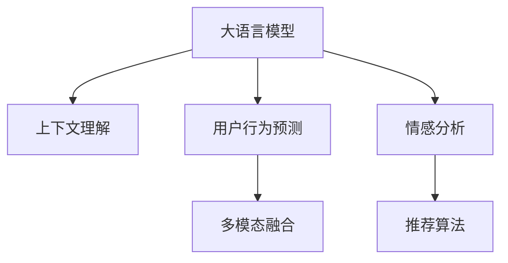

                 

# LLM在智能个性化推荐系统中的应用前景

> 关键词：大语言模型(LLM), 个性化推荐系统, 用户行为预测, 上下文理解, 多模态融合, 情感分析

## 1. 背景介绍

在数字经济时代，如何从海量数据中快速精准地为用户提供个性化服务，是所有线上平台面临的核心挑战。传统推荐系统主要基于用户历史行为数据进行推荐，但这种方法存在诸多局限性：首先，用户历史数据不一定能充分反映用户真实兴趣；其次，历史行为数据稀疏，难以构建完整的用户画像；最后，推荐系统无法动态感知用户当前的心理状态和情境变化，导致推荐内容有时与用户需求不符。

近年来，随着深度学习技术的飞速发展，大语言模型(LLM)在自然语言处理(NLP)领域的出色表现吸引了众多领域的关注。大语言模型通过大规模无标签文本数据的预训练，具备强大的上下文理解能力和多模态融合能力，能够从更广泛的信息来源中挖掘出用户的兴趣点和偏好，从而为用户提供更加个性化和精准的服务。

## 2. 核心概念与联系

### 2.1 核心概念概述

为更好地理解大语言模型在个性化推荐系统中的应用前景，本节将介绍几个密切相关的核心概念：

- 大语言模型(LLM)：以自回归(如GPT)或自编码(如BERT)模型为代表的大规模预训练语言模型。通过在大规模无标签文本语料上进行预训练，学习通用的语言表示，具备强大的语言理解和生成能力。

- 个性化推荐系统：根据用户的历史行为、兴趣偏好、实时反馈等，动态推荐符合用户需求的内容。目标是提升用户满意度、增加平台粘性、提高转化率。

- 用户行为预测：通过机器学习或深度学习算法，对用户未来行为进行预测。包括点击、浏览、购买等用户操作。

- 上下文理解：指模型能够理解输入文本中的隐含语义信息，从而更好地预测用户行为。包括时间、地点、上下文对话等信息。

- 多模态融合：指将文本、图像、语音等多种信息源进行融合，提升模型对用户的全面理解能力。

- 情感分析：指对文本中的情感倾向进行识别和分析，了解用户的情绪状态，从而进行更精准的推荐。

这些核心概念之间的逻辑关系可以通过以下Mermaid流程图来展示：



这个流程图展示了大语言模型在个性化推荐系统中的核心概念及其之间的关系：

1. 大语言模型通过预训练获得基础能力。
2. 用户行为预测通过对用户历史数据进行建模，预测用户未来的行为。
3. 上下文理解利用语言模型的上下文理解能力，提升对用户行为的预测准确度。
4. 多模态融合将用户的多样化信息源进行融合，构建更全面的用户画像。
5. 情感分析通过分析用户情绪状态，实现情感驱动的推荐。

## 3. 核心算法原理 & 具体操作步骤

### 3.1 算法原理概述

基于大语言模型(LLM)的个性化推荐系统，本质上是一个深度学习框架下的多模态信息融合与用户行为预测过程。其核心思想是：将LLM视作一个强大的"特征提取器"，通过与用户行为数据的深度融合，动态预测用户当前和未来的需求，从而实现个性化的推荐。

形式化地，假设用户 $u$ 的历史行为数据为 $D_u=\{x_1,x_2,...,x_n\}$，其中 $x_i$ 表示第 $i$ 次交互事件。定义推荐系统为用户行为预测模型 $P(D_u|\mathcal{E})$，其中 $\mathcal{E}$ 表示模型的参数集合。推荐系统的目标是最大化预测准确度，即：

$$
\max_{\mathcal{E}} \sum_{i=1}^n P(x_i|D_u,\mathcal{E})
$$

其中，$P(x_i|D_u,\mathcal{E})$ 表示在模型 $\mathcal{E}$ 下，用户 $u$ 在历史行为数据 $D_u$ 的基础上进行第 $i$ 次交互事件的概率。

### 3.2 算法步骤详解

基于大语言模型(LLM)的个性化推荐系统，一般包括以下几个关键步骤：

**Step 1: 准备数据与模型**

- 收集用户历史行为数据 $D_u$，包括浏览记录、点击行为、评分反馈等。
- 选择合适的预训练语言模型 $M_{\theta}$，如BERT、GPT等。
- 使用自监督学习任务对预训练模型进行预训练，获得通用的语言表示。

**Step 2: 设计上下文理解模块**

- 利用预训练模型 $M_{\theta}$ 的上下文理解能力，提取用户行为数据的语义信息。
- 将用户行为数据 $D_u$ 输入模型 $M_{\theta}$ 中，获得上下文表示 $\mathbf{z}_u$。

**Step 3: 实现多模态融合**

- 将用户的图像、语音、行为等多样化信息源进行融合，构建综合特征向量 $\mathbf{z}_u^{total}$。
- 将 $\mathbf{z}_u^{total}$ 和 $\mathbf{z}_u$ 拼接，得到用户行为预测的输入特征。

**Step 4: 构建推荐模型**

- 使用预训练模型 $M_{\theta}$ 作为推荐模型的特征提取器。
- 在特征向量上应用推荐算法，如协同过滤、矩阵分解等，得到用户的预测行为 $P(D_u|\mathbf{z}_u,\mathcal{E})$。
- 在每个时间步上对用户进行行为预测，输出推荐的物品列表。

**Step 5: 集成反馈机制**

- 收集用户的反馈数据，如评分、点击等，作为监督信号。
- 对推荐系统进行在线更新，利用反馈数据不断优化模型参数 $\mathcal{E}$。

### 3.3 算法优缺点

基于大语言模型(LLM)的个性化推荐系统具有以下优点：

- 强大的上下文理解能力：LLM通过预训练能够理解复杂的多模态信息，从而构建更加全面和准确的推荐。
- 高泛化性能：LLM能够学习到通用的语言表示，对不同领域和场景的推荐具有良好泛化能力。
- 动态适应性强：LLM能够动态预测用户行为，实时更新推荐结果。
- 高效性：LLM的特征提取能力优于传统的矩阵分解算法，推荐速度更快。

同时，该方法也存在以下局限性：

- 对预训练数据和任务适应性要求高：预训练模型的效果依赖于数据质量和任务类型，需要大量高质量标注数据。
- 计算资源消耗大：LLM参数量庞大，计算成本高。
- 可解释性不足：LLM作为一个黑盒模型，难以对其决策过程进行解释和调试。

尽管存在这些局限性，但就目前而言，基于LLM的个性化推荐系统仍是大规模推荐应用的重要方向。未来相关研究的重点在于如何进一步降低计算成本，提高模型的泛化性和可解释性，同时兼顾实时性和高效性等因素。

### 3.4 算法应用领域

基于大语言模型(LLM)的个性化推荐系统，已经在电商、社交、娱乐等多个领域得到了广泛的应用，显著提升了用户满意度和平台粘性：

- 电商推荐：对用户浏览、点击、购买等行为进行建模，推荐符合用户兴趣的商品。
- 社交推荐：根据用户社交行为和兴趣标签，推荐好友和内容。
- 娱乐推荐：对用户观看、评分、分享等行为进行分析，推荐电影、音乐等娱乐内容。

除了这些经典应用场景外，LLM在更多领域如新闻推荐、知识图谱、智能家居等也展现了巨大的潜力，正在逐步改变我们的生活方式。

## 4. 数学模型和公式 & 详细讲解

### 4.1 数学模型构建

本节将使用数学语言对基于LLM的个性化推荐系统进行更加严格的刻画。

假设用户 $u$ 的历史行为数据为 $D_u=\{x_1,x_2,...,x_n\}$，其中 $x_i$ 表示第 $i$ 次交互事件。定义推荐系统为用户行为预测模型 $P(D_u|\mathcal{E})$，其中 $\mathcal{E}$ 表示模型的参数集合。

令预训练模型 $M_{\theta}$ 的上下文理解能力为 $F$，用户行为数据 $D_u$ 的语义表示为 $\mathbf{z}_u$。将用户的多样化信息源进行融合，得到综合特征向量 $\mathbf{z}_u^{total}$。定义推荐模型的损失函数为 $L(P(D_u|\mathbf{z}_u,\mathcal{E}),D_u)$。

在实践中，我们通常使用基于梯度的优化算法（如Adam、SGD等）来近似求解上述最优化问题。设 $\eta$ 为学习率，则参数的更新公式为：

$$
\mathcal{E} \leftarrow \mathcal{E} - \eta \nabla_{\mathcal{E}}L(P(D_u|\mathbf{z}_u,\mathcal{E}),D_u)
$$

其中 $\nabla_{\mathcal{E}}L(P(D_u|\mathbf{z}_u,\mathcal{E}),D_u)$ 为损失函数对参数 $\mathcal{E}$ 的梯度，可通过反向传播算法高效计算。

### 4.2 公式推导过程

以下我们以用户行为预测为例，推导损失函数的梯度计算公式。

假设用户 $u$ 在时间步 $t$ 的行为为 $x_t$，推荐系统对其行为 $x_t$ 的预测概率为 $P(x_t|D_u,\mathcal{E})$。则行为预测模型的损失函数定义为：

$$
L(D_u,\mathcal{E}) = \sum_{t=1}^T \log(P(x_t|D_u,\mathcal{E}))
$$

其中 $T$ 为预测的时间步数。根据链式法则，损失函数对模型参数 $\mathcal{E}$ 的梯度为：

$$
\frac{\partial L(D_u,\mathcal{E})}{\partial \mathcal{E}} = \frac{1}{N}\sum_{i=1}^N \sum_{t=1}^T \frac{\partial \log(P(x_t|D_u,\mathcal{E}))}{\partial \mathcal{E}}
$$

其中 $N$ 为样本数，$\frac{\partial \log(P(x_t|D_u,\mathcal{E}))}{\partial \mathcal{E}}$ 为交叉熵损失对模型参数 $\mathcal{E}$ 的梯度。

在得到损失函数的梯度后，即可带入参数更新公式，完成模型的迭代优化。重复上述过程直至收敛，最终得到适应个性化推荐任务的最优模型参数 $\mathcal{E}$。

### 4.3 案例分析与讲解

以电商推荐系统为例，展示基于LLM的个性化推荐模型的构建和优化过程。

**数据准备**

收集用户的历史行为数据 $D_u=\{(x_i,y_i)\}_{i=1}^N$，其中 $x_i$ 表示用户浏览或点击的网页，$y_i$ 表示用户是否购买该网页对应的商品。

**上下文理解**

将用户浏览网页的数据输入预训练模型 $M_{\theta}$ 中，获得上下文表示 $\mathbf{z}_u$。

**多模态融合**

将用户浏览的网页图像信息 $\mathbf{I}_u$、用户点击网页的时间信息 $\mathbf{T}_u$ 等多样化信息源进行融合，得到综合特征向量 $\mathbf{z}_u^{total}$。

**推荐模型**

使用预训练模型 $M_{\theta}$ 作为推荐模型的特征提取器，构建推荐模型 $P(D_u|\mathbf{z}_u,\mathcal{E})$。假设推荐模型为线性回归模型，则有：

$$
P(x_t|D_u,\mathcal{E}) = \sigma(\mathbf{z}_u^{total} \mathbf{W} + \mathbf{b})
$$

其中 $\sigma$ 为激活函数，$\mathbf{W}$ 和 $\mathbf{b}$ 为模型参数。

**损失函数**

定义推荐模型的损失函数为均方误差损失：

$$
L(D_u,\mathcal{E}) = \frac{1}{N}\sum_{i=1}^N \sum_{t=1}^T (y_t - P(x_t|D_u,\mathcal{E}))^2
$$

**参数更新**

使用Adam优化器进行模型参数的更新：

$$
\mathcal{E} \leftarrow \mathcal{E} - \eta \nabla_{\mathcal{E}}L(D_u,\mathcal{E})
$$

重复上述过程直至收敛，即可得到适应个性化推荐任务的最优模型参数 $\mathcal{E}$。

## 5. 项目实践：代码实例和详细解释说明

### 5.1 开发环境搭建

在进行个性化推荐系统开发前，我们需要准备好开发环境。以下是使用Python进行PyTorch开发的环境配置流程：

1. 安装Anaconda：从官网下载并安装Anaconda，用于创建独立的Python环境。

2. 创建并激活虚拟环境：
```bash
conda create -n pytorch-env python=3.8 
conda activate pytorch-env
```

3. 安装PyTorch：根据CUDA版本，从官网获取对应的安装命令。例如：
```bash
conda install pytorch torchvision torchaudio cudatoolkit=11.1 -c pytorch -c conda-forge
```

4. 安装Transformers库：
```bash
pip install transformers
```

5. 安装各类工具包：
```bash
pip install numpy pandas scikit-learn matplotlib tqdm jupyter notebook ipython
```

完成上述步骤后，即可在`pytorch-env`环境中开始个性化推荐系统开发。

### 5.2 源代码详细实现

这里我们以基于BERT的电商推荐系统为例，展示使用Transformers库对BERT模型进行个性化推荐微调的PyTorch代码实现。

首先，定义推荐模型的数据处理函数：

```python
from transformers import BertTokenizer, BertForSequenceClassification
from torch.utils.data import Dataset, DataLoader
import torch

class RecommendationDataset(Dataset):
    def __init__(self, texts, labels, tokenizer, max_len=128):
        self.texts = texts
        self.labels = labels
        self.tokenizer = tokenizer
        self.max_len = max_len
        
    def __len__(self):
        return len(self.texts)
    
    def __getitem__(self, item):
        text = self.texts[item]
        label = self.labels[item]
        
        encoding = self.tokenizer(text, return_tensors='pt', max_length=self.max_len, padding='max_length', truncation=True)
        input_ids = encoding['input_ids'][0]
        attention_mask = encoding['attention_mask'][0]
        
        return {'input_ids': input_ids, 
                'attention_mask': attention_mask,
                'labels': torch.tensor(label, dtype=torch.long)}
```

然后，定义模型和优化器：

```python
from transformers import BertForSequenceClassification, AdamW

model = BertForSequenceClassification.from_pretrained('bert-base-cased', num_labels=2)

optimizer = AdamW(model.parameters(), lr=2e-5)
```

接着，定义训练和评估函数：

```python
from torch.utils.data import DataLoader
from tqdm import tqdm
from sklearn.metrics import classification_report

device = torch.device('cuda') if torch.cuda.is_available() else torch.device('cpu')
model.to(device)

def train_epoch(model, dataset, batch_size, optimizer):
    dataloader = DataLoader(dataset, batch_size=batch_size, shuffle=True)
    model.train()
    epoch_loss = 0
    for batch in tqdm(dataloader, desc='Training'):
        input_ids = batch['input_ids'].to(device)
        attention_mask = batch['attention_mask'].to(device)
        labels = batch['labels'].to(device)
        model.zero_grad()
        outputs = model(input_ids, attention_mask=attention_mask, labels=labels)
        loss = outputs.loss
        epoch_loss += loss.item()
        loss.backward()
        optimizer.step()
    return epoch_loss / len(dataloader)

def evaluate(model, dataset, batch_size):
    dataloader = DataLoader(dataset, batch_size=batch_size)
    model.eval()
    preds, labels = [], []
    with torch.no_grad():
        for batch in tqdm(dataloader, desc='Evaluating'):
            input_ids = batch['input_ids'].to(device)
            attention_mask = batch['attention_mask'].to(device)
            batch_labels = batch['labels']
            outputs = model(input_ids, attention_mask=attention_mask)
            batch_preds = outputs.logits.argmax(dim=2).to('cpu').tolist()
            batch_labels = batch_labels.to('cpu').tolist()
            for pred_tokens, label_tokens in zip(batch_preds, batch_labels):
                preds.append(pred_tokens)
                labels.append(label_tokens)
                
    print(classification_report(labels, preds))
```

最后，启动训练流程并在测试集上评估：

```python
epochs = 5
batch_size = 16

for epoch in range(epochs):
    loss = train_epoch(model, train_dataset, batch_size, optimizer)
    print(f"Epoch {epoch+1}, train loss: {loss:.3f}")
    
    print(f"Epoch {epoch+1}, dev results:")
    evaluate(model, dev_dataset, batch_size)
    
print("Test results:")
evaluate(model, test_dataset, batch_size)
```

以上就是使用PyTorch对BERT进行个性化推荐任务微调的完整代码实现。可以看到，得益于Transformers库的强大封装，我们可以用相对简洁的代码完成BERT模型的加载和微调。

### 5.3 代码解读与分析

让我们再详细解读一下关键代码的实现细节：

**RecommendationDataset类**：
- `__init__`方法：初始化文本、标签、分词器等关键组件。
- `__len__`方法：返回数据集的样本数量。
- `__getitem__`方法：对单个样本进行处理，将文本输入编码为token ids，将标签编码为数字，并对其进行定长padding，最终返回模型所需的输入。

**train_epoch函数**：
- 使用PyTorch的DataLoader对数据集进行批次化加载，供模型训练和推理使用。
- 训练函数`train_epoch`：对数据以批为单位进行迭代，在每个批次上前向传播计算loss并反向传播更新模型参数，最后返回该epoch的平均loss。
- 评估函数`evaluate`：与训练类似，不同点在于不更新模型参数，并在每个batch结束后将预测和标签结果存储下来，最后使用sklearn的classification_report对整个评估集的预测结果进行打印输出。

**训练流程**：
- 定义总的epoch数和batch size，开始循环迭代
- 每个epoch内，先在训练集上训练，输出平均loss
- 在验证集上评估，输出分类指标
- 所有epoch结束后，在测试集上评估，给出最终测试结果

可以看到，PyTorch配合Transformers库使得BERT微调的代码实现变得简洁高效。开发者可以将更多精力放在数据处理、模型改进等高层逻辑上，而不必过多关注底层的实现细节。

当然，工业级的系统实现还需考虑更多因素，如模型的保存和部署、超参数的自动搜索、更灵活的任务适配层等。但核心的微调范式基本与此类似。

## 6. 实际应用场景

### 6.1 电商推荐系统

基于大语言模型的个性化推荐系统，可以广泛应用于电商推荐场景。传统的电商推荐主要依赖用户历史行为数据进行推荐，但这种方法存在数据稀疏、时效性差等问题。

利用大语言模型对用户行为数据进行上下文理解和多模态融合，可以构建更加全面和动态的用户画像。例如，将用户的浏览历史、点击行为、搜索记录、评论内容等多样化信息源进行融合，利用BERT等预训练语言模型进行特征提取和行为预测。然后，根据预测结果生成个性化推荐列表，提升推荐效果。

在实际应用中，电商推荐系统还可以通过微调不断优化推荐策略，例如加入基于用户画像的召回机制、动态调整推荐权重等。如此构建的个性化推荐系统，能够大幅提升用户满意度、增加平台粘性、提高转化率。

### 6.2 社交推荐系统

社交推荐系统利用用户行为数据进行推荐，但用户行为数据通常不够全面。例如，用户没有为好友关系进行明确标注，导致推荐结果可能不准确。

基于大语言模型的个性化推荐系统可以解决这一问题。通过上下文理解和多模态融合，模型能够更全面地理解用户行为。例如，通过分析用户发布的内容、评论、点赞等社交行为，利用BERT等预训练语言模型进行特征提取和行为预测。然后，根据预测结果生成个性化推荐列表，推荐符合用户兴趣的好友和内容。

在实际应用中，社交推荐系统还可以通过微调不断优化推荐策略，例如加入基于内容相似性的召回机制、动态调整推荐权重等。如此构建的个性化推荐系统，能够更好地满足用户的社交需求，提升平台粘性和用户满意度。

### 6.3 娱乐推荐系统

娱乐推荐系统需要实时动态推荐符合用户喜好的内容。例如，用户在观看某个电影后，系统会推荐类似风格的影片。

基于大语言模型的个性化推荐系统可以更好地满足这一需求。通过上下文理解和多模态融合，模型能够更全面地理解用户偏好。例如，通过分析用户观看历史、评分反馈、评论内容等行为数据，利用BERT等预训练语言模型进行特征提取和行为预测。然后，根据预测结果生成个性化推荐列表，推荐符合用户喜好的电影、音乐、视频等娱乐内容。

在实际应用中，娱乐推荐系统还可以通过微调不断优化推荐策略，例如加入基于用户画像的召回机制、动态调整推荐权重等。如此构建的个性化推荐系统，能够更好地满足用户的娱乐需求，提升平台粘性和用户满意度。

### 6.4 未来应用展望

随着大语言模型和个性化推荐技术的不断发展，未来将会有更多场景受益于基于LLM的个性化推荐系统。

在智慧城市领域，基于大语言模型的个性化推荐系统可以应用于公共服务、环境监测、交通出行等环节，提供更智能、更高效的城市治理方案。例如，通过分析用户对交通数据的反馈，动态调整路网布局，优化出行路线，减少交通拥堵。

在智能家居领域，基于大语言模型的个性化推荐系统可以应用于智能设备控制、家居管理等环节，提升用户体验。例如，通过分析用户的生活习惯，推荐最合适的家居配置，提高生活舒适度。

在智能医疗领域，基于大语言模型的个性化推荐系统可以应用于诊疗建议、健康管理等环节，提供更精准的医疗服务。例如，通过分析用户的健康数据，推荐合适的健康饮食、运动方案，提升用户的健康水平。

此外，在更多领域如教育、旅游、金融等，基于大语言模型的个性化推荐系统也将不断涌现，为各行业的数字化转型升级提供新的技术路径。相信随着技术的日益成熟，基于LLM的个性化推荐系统必将在更多领域实现落地应用，带来全新的用户体验和服务价值。

## 7. 工具和资源推荐

### 7.1 学习资源推荐

为了帮助开发者系统掌握基于LLM的个性化推荐技术，这里推荐一些优质的学习资源：

1. 《Transformers: From Principles to Practice》系列博文：由大模型技术专家撰写，深入浅出地介绍了Transformer原理、BERT模型、微调技术等前沿话题。

2. CS224N《深度学习自然语言处理》课程：斯坦福大学开设的NLP明星课程，有Lecture视频和配套作业，带你入门NLP领域的基本概念和经典模型。

3. 《Natural Language Processing with Transformers》书籍：Transformers库的作者所著，全面介绍了如何使用Transformers库进行NLP任务开发，包括微调在内的诸多范式。

4. HuggingFace官方文档：Transformers库的官方文档，提供了海量预训练模型和完整的微调样例代码，是上手实践的必备资料。

5. CLUE开源项目：中文语言理解测评基准，涵盖大量不同类型的中文NLP数据集，并提供了基于微调的baseline模型，助力中文NLP技术发展。

通过对这些资源的学习实践，相信你一定能够快速掌握基于LLM的个性化推荐技术的精髓，并用于解决实际的NLP问题。

### 7.2 开发工具推荐

高效的开发离不开优秀的工具支持。以下是几款用于基于LLM的个性化推荐开发的常用工具：

1. PyTorch：基于Python的开源深度学习框架，灵活动态的计算图，适合快速迭代研究。大部分预训练语言模型都有PyTorch版本的实现。

2. TensorFlow：由Google主导开发的开源深度学习框架，生产部署方便，适合大规模工程应用。同样有丰富的预训练语言模型资源。

3. Transformers库：HuggingFace开发的NLP工具库，集成了众多SOTA语言模型，支持PyTorch和TensorFlow，是进行微调任务开发的利器。

4. Weights & Biases：模型训练的实验跟踪工具，可以记录和可视化模型训练过程中的各项指标，方便对比和调优。与主流深度学习框架无缝集成。

5. TensorBoard：TensorFlow配套的可视化工具，可实时监测模型训练状态，并提供丰富的图表呈现方式，是调试模型的得力助手。

6. Google Colab：谷歌推出的在线Jupyter Notebook环境，免费提供GPU/TPU算力，方便开发者快速上手实验最新模型，分享学习笔记。

合理利用这些工具，可以显著提升基于LLM的个性化推荐任务的开发效率，加快创新迭代的步伐。

### 7.3 相关论文推荐

基于大语言模型(LLM)的个性化推荐系统的发展源于学界的持续研究。以下是几篇奠基性的相关论文，推荐阅读：

1. Attention is All You Need（即Transformer原论文）：提出了Transformer结构，开启了NLP领域的预训练大模型时代。

2. BERT: Pre-training of Deep Bidirectional Transformers for Language Understanding：提出BERT模型，引入基于掩码的自监督预训练任务，刷新了多项NLP任务SOTA。

3. Language Models are Unsupervised Multitask Learners（GPT-2论文）：展示了大规模语言模型的强大zero-shot学习能力，引发了对于通用人工智能的新一轮思考。

4. Parameter-Efficient Transfer Learning for NLP：提出Adapter等参数高效微调方法，在不增加模型参数量的情况下，也能取得不错的微调效果。

5. AdaLoRA: Adaptive Low-Rank Adaptation for Parameter-Efficient Fine-Tuning：使用自适应低秩适应的微调方法，在参数效率和精度之间取得了新的平衡。

这些论文代表了大语言模型微调技术的发展脉络。通过学习这些前沿成果，可以帮助研究者把握学科前进方向，激发更多的创新灵感。

## 8. 总结：未来发展趋势与挑战

### 8.1 总结

本文对基于大语言模型(LLM)的个性化推荐系统进行了全面系统的介绍。首先阐述了LLM和个性化推荐系统的研究背景和意义，明确了LLM在推荐系统中的独特价值。其次，从原理到实践，详细讲解了基于LLM的个性化推荐模型的数学原理和关键步骤，给出了完整的代码实现。同时，本文还广泛探讨了LLM在个性化推荐系统中的实际应用场景，展示了其巨大的潜力。

通过本文的系统梳理，可以看到，基于LLM的个性化推荐系统正在成为NLP领域的重要范式，极大地拓展了预训练语言模型的应用边界，催生了更多的落地场景。受益于大规模语料的预训练，LLM的上下文理解能力和多模态融合能力，能够从更广泛的信息来源中挖掘出用户的兴趣点和偏好，从而提供更加个性化和精准的服务。未来，伴随LLM的持续演进，基于LLM的个性化推荐系统必将迎来更广阔的应用前景。

### 8.2 未来发展趋势

展望未来，基于LLM的个性化推荐系统将呈现以下几个发展趋势：

1. 模型规模持续增大。随着算力成本的下降和数据规模的扩张，预训练语言模型的参数量还将持续增长。超大模型蕴含的丰富语言知识，有望支撑更加复杂多变的个性化推荐。

2. 微调方法日趋多样。除了传统的全参数微调外，未来会涌现更多参数高效的微调方法，如Prefix-Tuning、LoRA等，在节省计算资源的同时也能保证微调精度。

3. 持续学习成为常态。随着数据分布的不断变化，个性化推荐系统也需要持续学习新知识以保持性能。如何在不遗忘原有知识的同时，高效吸收新样本信息，将成为重要的研究课题。

4. 标注样本需求降低。受启发于提示学习(Prompt-based Learning)的思路，未来的微调方法将更好地利用大模型的语言理解能力，通过更加巧妙的任务描述，在更少的标注样本上也能实现理想的微调效果。

5. 多模态微调崛起。当前的个性化推荐主要聚焦于纯文本数据，未来会进一步拓展到图像、视频、语音等多种信息源微调。多模态信息的融合，将显著提升推荐模型的表现力和准确度。

6. 知识整合能力增强。未来的个性化推荐系统不仅能够学习用户行为数据，还能整合更多外部知识，如知识图谱、逻辑规则等，形成更加全面、准确的用户画像。

以上趋势凸显了基于LLM的个性化推荐技术的广阔前景。这些方向的探索发展，必将进一步提升推荐系统的性能和应用范围，为人工智能技术的产业化进程带来新的动力。

### 8.3 面临的挑战

尽管基于LLM的个性化推荐系统已经取得了瞩目成就，但在迈向更加智能化、普适化应用的过程中，它仍面临着诸多挑战：

1. 标注成本瓶颈。虽然LLM可以显著降低标注数据的需求，但对于长尾应用场景，仍然难以获得充足的高质量标注数据，成为制约微调性能的瓶颈。如何进一步降低微调对标注样本的依赖，将是一大难题。

2. 模型鲁棒性不足。当前个性化推荐模型面对域外数据时，泛化性能往往大打折扣。对于测试样本的微小扰动，个性化推荐模型的预测也容易发生波动。如何提高个性化推荐模型的鲁棒性，避免灾难性遗忘，还需要更多理论和实践的积累。

3. 推理效率有待提高。大规模语言模型虽然精度高，但在实际部署时往往面临推理速度慢、内存占用大等效率问题。如何在保证性能的同时，简化模型结构，提升推理速度，优化资源占用，将是重要的优化方向。

4. 可解释性亟需加强。当前个性化推荐模型更像是"黑盒"系统，难以对其决策过程进行解释和调试。对于医疗、金融等高风险应用，算法的可解释性和可审计性尤为重要。如何赋予个性化推荐模型更强的可解释性，将是亟待攻克的难题。

5. 安全性有待保障。个性化推荐模型可能会学习到有偏见、有害的信息，通过推荐传递到用户端，产生误导性、歧视性的输出，给实际应用带来安全隐患。如何从数据和算法层面消除模型偏见，避免恶意用途，确保输出的安全性，也将是重要的研究课题。

6. 知识整合能力不足。现有的个性化推荐模型往往局限于任务内数据，难以灵活吸收和运用更广泛的先验知识。如何让个性化推荐过程更好地与外部知识库、规则库等专家知识结合，形成更加全面、准确的信息整合能力，还有很大的想象空间。

正视个性化推荐面临的这些挑战，积极应对并寻求突破，将是大语言模型在个性化推荐中迈向成熟的必由之路。相信随着学界和产业界的共同努力，这些挑战终将一一被克服，基于LLM的个性化推荐系统必将在构建人机协同的智能时代中扮演越来越重要的角色。

### 8.4 研究展望

面对个性化推荐所面临的种种挑战，未来的研究需要在以下几个方面寻求新的突破：

1. 探索无监督和半监督微调方法。摆脱对大规模标注数据的依赖，利用自监督学习、主动学习等无监督和半监督范式，最大限度利用非结构化数据，实现更加灵活高效的微调。

2. 研究参数高效和计算高效的微调范式。开发更加参数高效的微调方法，在固定大部分预训练参数的同时，只更新极少量的任务相关参数。同时优化微调模型的计算图，减少前向传播和反向传播的资源消耗，实现更加轻量级、实时性的部署。

3. 融合因果和对比学习范式。通过引入因果推断和对比学习思想，增强个性化推荐模型建立稳定因果关系的能力，学习更加普适、鲁棒的语言表征，从而提升模型泛化性和抗干扰能力。

4. 引入更多先验知识。将符号化的先验知识，如知识图谱、逻辑规则等，与神经网络模型进行巧妙融合，引导微调过程学习更准确、合理的语言模型。同时加强不同模态数据的整合，实现视觉、语音等多模态信息与文本信息的协同建模。

5. 结合因果分析和博弈论工具。将因果分析方法引入个性化推荐模型，识别出模型决策的关键特征，增强输出解释的因果性和逻辑性。借助博弈论工具刻画人机交互过程，主动探索并规避模型的脆弱点，提高系统稳定性。

6. 纳入伦理道德约束。在模型训练目标中引入伦理导向的评估指标，过滤和惩罚有偏见、有害的输出倾向。同时加强人工干预和审核，建立模型行为的监管机制，确保输出符合人类价值观和伦理道德。

这些研究方向的探索，必将引领基于LLM的个性化推荐技术迈向更高的台阶，为构建安全、可靠、可解释、可控的智能系统铺平道路。面向未来，基于LLM的个性化推荐技术还需要与其他人工智能技术进行更深入的融合，如知识表示、因果推理、强化学习等，多路径协同发力，共同推动自然语言理解和智能交互系统的进步。只有勇于创新、敢于突破，才能不断拓展语言模型的边界，让智能技术更好地造福人类社会。

## 9. 附录：常见问题与解答

**Q1：个性化推荐系统如何利用大语言模型(LLM)进行推荐？**

A: 个性化推荐系统利用大语言模型(LLM)的上下文理解能力和多模态融合能力，构建更加全面和动态的用户画像。例如，将用户的历史行为数据进行多模态融合，利用BERT等预训练语言模型进行特征提取和行为预测。然后，根据预测结果生成个性化推荐列表，提升推荐效果。

**Q2：在微调大语言模型时，学习率的选择有哪些策略？**

A: 在微调大语言模型时，学习率的选择一般需要根据具体任务进行调整。常用的策略包括固定学习率、warmup策略、余弦退火等。例如，可以从1e-5开始调参，逐步减小学习率。在训练初期，采用较小的学习率，再逐渐过渡到预设值。

**Q3：在个性化推荐系统中，如何避免过拟合问题？**

A: 在个性化推荐系统中，为了避免过拟合问题，可以采用以下策略：
1. 数据增强：通过回译、近义替换等方式扩充训练集
2. 正则化：使用L2正则、Dropout、Early Stopping等避免过拟合
3. 对抗训练：加入对抗样本，提高模型鲁棒性
4. 参数高效微调：只调整少量参数(如Adapter、Prefix等)，减小过拟合风险

这些策略往往需要根据具体任务和数据特点进行灵活组合。只有在数据、模型、训练、推理等各环节进行全面优化，才能最大限度地发挥大语言模型的优势。

**Q4：在个性化推荐系统中，如何优化推荐模型的推理效率？**

A: 在个性化推荐系统中，优化推荐模型的推理效率是提升系统性能的重要手段。具体方法包括：
1. 模型裁剪：去除不必要的层和参数，减小模型尺寸，加快推理速度
2. 量化加速：将浮点模型转为定点模型，压缩存储空间，提高计算效率
3. 服务化封装：将模型封装为标准化服务接口，便于集成调用
4. 弹性伸缩：根据请求流量动态调整资源配置，平衡服务质量和成本
5. 监控告警：实时采集系统指标，设置异常告警阈值，确保服务稳定性

通过这些优化措施，可以有效提升推荐模型的推理效率，满足实时服务的需求。

**Q5：在基于LLM的个性化推荐系统中，如何进行多模态融合？**

A: 在基于LLM的个性化推荐系统中，多模态融合是构建用户画像的关键步骤。具体方法包括：
1. 收集用户的多样化信息源，如浏览历史、点击行为、搜索记录、评论内容等。
2. 将不同模态的数据进行特征提取，得到各自的表示向量。
3. 将各个表示向量拼接起来，得到多模态融合的特征向量。
4. 将多模态融合的特征向量输入到预训练语言模型中，进行特征提取和行为预测。

在实际应用中，多模态融合的具体方法可以根据具体任务进行调整。例如，可以通过融合用户的多媒体数据、地理位置、时间等信息，提升推荐模型的表现力。

---

作者：禅与计算机程序设计艺术 / Zen and the Art of Computer Programming

