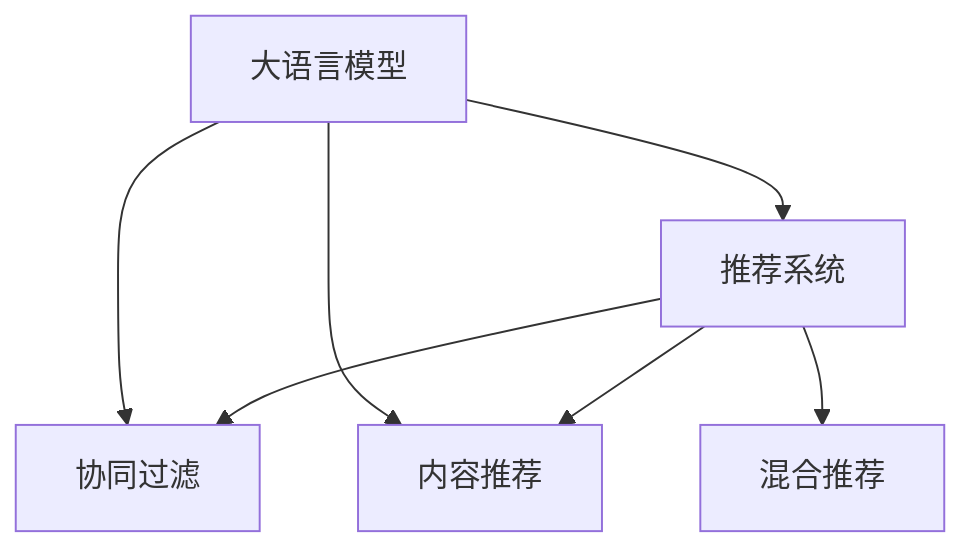

                 

# LLM在智能个性化新闻推送中的应用前景

## 1. 背景介绍

### 1.1 问题由来

在信息爆炸的时代，用户如何从海量的新闻中筛选出对自己有用的信息，是一个日益严峻的挑战。传统的新闻聚合平台往往通过人工编辑的推荐算法，根据用户的点击、浏览、分享等行为数据，为用户推送相关新闻。但这种基于行为统计的推荐方式，难以全面理解用户的深度需求和兴趣。而利用人工智能技术，特别是基于大语言模型（Large Language Model，简称LLM）的推荐系统，可以更深入地挖掘用户的个性化需求，提供更加智能和精准的新闻推送服务。

### 1.2 问题核心关键点

大语言模型在新闻推荐中的应用，主要依赖于其强大的自然语言理解和生成能力。通过在用户与新闻内容之间的交互中，学习用户的阅读习惯、兴趣偏好、情感倾向等，LLM能够更准确地预测用户对新闻的兴趣，从而实现个性化推荐。其核心关键点包括：

1. **用户兴趣建模**：通过用户的历史行为数据，构建用户兴趣图谱。
2. **新闻内容表示**：将新闻内容转换为向量表示，便于与用户兴趣进行匹配。
3. **交互建模**：捕捉用户与新闻内容之间的互动，如阅读深度、停留时间、点击率等，丰富用户兴趣表达。
4. **推荐优化**：基于上述信息，优化推荐算法，实现个性化新闻推送。

### 1.3 问题研究意义

利用大语言模型进行新闻推送，可以显著提升用户的阅读体验，提高新闻聚合平台的粘性。同时，大语言模型的高效学习和泛化能力，使得个性化推荐更加精准，避免了人工编辑的繁琐和主观性。具体研究意义如下：

1. **提升用户体验**：个性化的新闻推送能够减少用户信息过载，提升阅读效率和满意度。
2. **提高平台粘性**：精准的推荐系统有助于用户持续访问平台，增加用户活跃度和留存率。
3. **优化资源分配**：推荐算法优化了新闻内容的曝光机会，提升了资源利用效率。
4. **推动内容创作**：个性化推荐还能促进高质量内容的创作和传播。

## 2. 核心概念与联系

### 2.1 核心概念概述

为更好地理解LLM在新闻推送中的应用，本节将介绍几个密切相关的核心概念：

- **大语言模型（LLM）**：以自回归（如GPT）或自编码（如BERT）模型为代表的大规模预训练语言模型。通过在海量文本数据上进行预训练，学习通用的语言表示，具备强大的语言理解和生成能力。
- **推荐系统**：通过用户历史行为数据和新闻内容，预测用户对新闻的兴趣，进行个性化新闻推送的系统。
- **协同过滤**：利用用户与用户之间的相似性，以及物品之间的相似性，推荐用户可能感兴趣的新闻。
- **内容推荐**：直接根据新闻内容的特征，向用户推荐相关的新闻。
- **混合推荐**：结合协同过滤和内容推荐，取长补短，提高推荐效果。

这些核心概念之间的逻辑关系可以通过以下Mermaid流程图来展示：



这个流程图展示了大语言模型在新闻推荐中的应用框架：

1. 大语言模型通过预训练获得基础能力。
2. 推荐系统利用预训练模型的语言理解和生成能力，进行个性化新闻推送。
3. 协同过滤和内容推荐是推荐系统的两种重要方式。
4. 混合推荐通过融合多种推荐策略，进一步提升推荐效果。

## 3. 核心算法原理 & 具体操作步骤

### 3.1 算法原理概述

基于大语言模型的个性化新闻推送系统，主要依赖于以下算法原理：

- **用户兴趣建模**：通过预训练大语言模型，从用户历史行为数据中提取兴趣图谱。
- **新闻内容表示**：将新闻内容转换为向量表示，便于与用户兴趣进行匹配。
- **交互建模**：捕捉用户与新闻内容之间的互动，如阅读深度、停留时间、点击率等，丰富用户兴趣表达。
- **推荐优化**：基于上述信息，优化推荐算法，实现个性化新闻推送。

### 3.2 算法步骤详解

基于大语言模型的个性化新闻推送系统主要包括以下几个关键步骤：

**Step 1: 准备预训练模型和数据集**
- 选择合适的预训练语言模型，如BERT、GPT等。
- 收集用户历史行为数据，包括阅读、点击、点赞等行为记录，构建用户兴趣图谱。
- 收集新闻内容，将其转换为向量表示，形成新闻语料库。

**Step 2: 用户兴趣建模**
- 使用预训练语言模型，从用户行为数据中提取兴趣图谱。具体步骤包括：
  1. 将用户行为数据转换为向量表示，如使用TF-IDF、Word2Vec等方法。
  2. 通过预训练语言模型，将用户兴趣向量与新闻向量进行相似度计算，得到用户兴趣图谱。

**Step 3: 新闻内容表示**
- 将新闻内容转换为向量表示，可以使用预训练语言模型的编码器部分，如BERT、GPT等。具体步骤包括：
  1. 将新闻文本输入到预训练语言模型中，得到上下文表示向量。
  2. 对上下文表示向量进行降维或编码，得到新闻向量表示。

**Step 4: 交互建模**
- 捕捉用户与新闻内容之间的互动，丰富用户兴趣表达。具体步骤包括：
  1. 收集用户与新闻的互动数据，如阅读深度、停留时间、点击率等。
  2. 将互动数据转换为向量表示，如使用上下文表示向量。
  3. 通过预训练语言模型，将用户兴趣图谱与互动向量进行融合，得到用户与新闻的交互向量。

**Step 5: 推荐优化**
- 基于用户兴趣图谱和新闻向量，优化推荐算法。具体步骤包括：
  1. 使用协同过滤算法，推荐与用户兴趣图谱相似的新闻。
  2. 使用内容推荐算法，推荐与新闻向量相似的新闻。
  3. 结合协同过滤和内容推荐，取长补短，进行混合推荐。

### 3.3 算法优缺点

基于大语言模型的个性化新闻推送系统具有以下优点：

1. **个性化程度高**：通过深度学习模型，能够捕捉用户行为背后的语义信息，实现更加精准的个性化推荐。
2. **可解释性强**：基于大语言模型的推荐系统，可以通过语义分析等方式，解释推荐结果的原因。
3. **动态适应性强**：能够实时更新用户兴趣和新闻内容，及时调整推荐策略，适应用户兴趣的变化。

同时，该方法也存在一定的局限性：

1. **计算资源需求高**：大规模预训练语言模型的计算需求高，训练和推理效率较低。
2. **数据依赖性强**：推荐系统依赖于用户行为数据，数据的完整性和多样性直接影响推荐效果。
3. **隐私问题**：用户行为数据的收集和使用可能涉及隐私问题，需要遵守相关法律法规。

尽管存在这些局限性，但就目前而言，基于大语言模型的推荐方法仍是最主流的范式。未来相关研究的重点在于如何进一步降低对计算资源的依赖，提高数据的多样性和安全性，同时兼顾可解释性和动态适应性等因素。

### 3.4 算法应用领域

基于大语言模型的个性化新闻推送技术，已经在多个领域得到应用，例如：

- **社交媒体平台**：如Facebook、Twitter等，利用用户的点赞、评论、分享等行为数据，推荐相关新闻。
- **新闻聚合平台**：如Google News、Apple News等，基于用户的历史阅读记录和兴趣图谱，进行个性化推荐。
- **在线广告平台**：如Google Ads、Facebook Ads等，通过广告投放策略优化，提高广告的精准度和转化率。

除了上述这些经典应用外，个性化新闻推送还被创新性地应用于更多场景中，如移动新闻客户端、智能家居设备等，为新闻阅读和智能交互提供了新的解决方案。随着预训练模型和推荐方法的不断进步，相信个性化新闻推送技术将在更广阔的应用领域大放异彩。

## 4. 数学模型和公式 & 详细讲解 & 举例说明

### 4.1 数学模型构建

本节将使用数学语言对基于大语言模型的个性化新闻推送过程进行更加严格的刻画。

记用户兴趣图谱为 $U = \{u_1, u_2, ..., u_N\}$，新闻内容表示为 $N = \{n_1, n_2, ..., n_M\}$。

定义用户兴趣图谱与新闻内容之间的相似度函数为 $s: U \times N \rightarrow [0, 1]$，表示用户兴趣与新闻内容的匹配程度。则个性化推荐的目标是最小化用户与新闻内容的误差：

$$
\min_{s} \sum_{u \in U} \sum_{n \in N} \ell(s(u, n))
$$

其中 $\ell$ 为误差函数，常用的如平均绝对误差MAE、均方误差MSE等。

### 4.2 公式推导过程

以下我们以协同过滤和内容推荐为例，推导个性化推荐算法的数学模型。

**协同过滤算法**：

协同过滤算法通过用户与用户之间的相似性，以及物品之间的相似性，推荐用户可能感兴趣的新闻。其核心思想是：找到与用户兴趣图谱相似的其他用户，推荐这些用户喜欢的新闻。具体模型如下：

$$
\hat{n}_u = \arg\min_{n \in N} \sum_{v \in U} s(u, v) \cdot \ell(n_v, n)
$$

其中 $n_v$ 表示用户 $v$ 喜欢的新闻，$s(u, v)$ 表示用户 $u$ 与用户 $v$ 的相似度，$\ell$ 为误差函数。

**内容推荐算法**：

内容推荐算法通过新闻内容的特征，直接向用户推荐相关的新闻。其核心思想是：根据新闻内容的相似性，推荐与用户兴趣匹配的新闻。具体模型如下：

$$
\hat{n}_u = \arg\min_{n \in N} \ell(s(u, n))
$$

其中 $s(u, n)$ 表示用户兴趣图谱与新闻内容之间的相似度，$\ell$ 为误差函数。

### 4.3 案例分析与讲解

以协同过滤算法为例，下面给出其在实际应用中的案例分析。

假设有一个新闻聚合平台，收集了用户的历史阅读记录和点赞行为，构建了用户兴趣图谱 $U = \{u_1, u_2, ..., u_N\}$。平台还收集了新闻内容 $N = \{n_1, n_2, ..., n_M\}$，并使用预训练语言模型，将新闻内容转换为向量表示 $N = \{n_{1v}, n_{2v}, ..., n_{Mv}\}$，其中 $v$ 表示新闻内容 $n$ 的向量表示。

为了推荐用户 $u$ 可能感兴趣的新闻，首先需要计算用户 $u$ 与用户 $v$ 的相似度 $s(u, v)$。可以采用余弦相似度、欧氏距离等方法，计算用户兴趣图谱与用户 $v$ 的兴趣图谱的相似度。然后，通过协同过滤算法，找到与用户 $u$ 兴趣图谱相似的其他用户 $v$，计算这些用户喜欢的新闻向量表示，并进行加权平均，得到推荐新闻的向量表示：

$$
\hat{n}_u = \sum_{v \in U} \frac{s(u, v)}{\sum_{v' \in U} s(u, v')} n_{v'}
$$

最后，将推荐新闻的向量表示转换为文本形式，推送给用户 $u$。

## 5. 项目实践：代码实例和详细解释说明

### 5.1 开发环境搭建

在进行个性化新闻推送系统的开发前，我们需要准备好开发环境。以下是使用Python进行PyTorch开发的环境配置流程：

1. 安装Anaconda：从官网下载并安装Anaconda，用于创建独立的Python环境。

2. 创建并激活虚拟环境：
```bash
conda create -n pytorch-env python=3.8 
conda activate pytorch-env
```

3. 安装PyTorch：根据CUDA版本，从官网获取对应的安装命令。例如：
```bash
conda install pytorch torchvision torchaudio cudatoolkit=11.1 -c pytorch -c conda-forge
```

4. 安装Transformers库：
```bash
pip install transformers
```

5. 安装各类工具包：
```bash
pip install numpy pandas scikit-learn matplotlib tqdm jupyter notebook ipython
```

完成上述步骤后，即可在`pytorch-env`环境中开始开发实践。

### 5.2 源代码详细实现

下面我们以基于BERT模型的个性化新闻推送系统为例，给出使用Transformers库的代码实现。

首先，定义个性化推荐系统所需的数据处理函数：

```python
from transformers import BertTokenizer
from torch.utils.data import Dataset
import torch

class NewsDataset(Dataset):
    def __init__(self, news, tokenizer, max_len=128):
        self.news = news
        self.tokenizer = tokenizer
        self.max_len = max_len
        
    def __len__(self):
        return len(self.news)
    
    def __getitem__(self, item):
        news = self.news[item]
        
        encoding = self.tokenizer(news, return_tensors='pt', max_length=self.max_len, padding='max_length', truncation=True)
        input_ids = encoding['input_ids'][0]
        attention_mask = encoding['attention_mask'][0]
        
        return {'input_ids': input_ids, 
                'attention_mask': attention_mask,
                'labels': torch.zeros_like(input_ids)}
```

然后，定义用户兴趣图谱的表示函数：

```python
class UserInterest(Dataset):
    def __init__(self, user interests):
        self.interests = interests
        
    def __len__(self):
        return len(self.interests)
    
    def __getitem__(self, item):
        return {'user': item, 'interests': self.interests[item]}
```

接着，定义模型和优化器：

```python
from transformers import BertForTokenClassification, AdamW

model = BertForTokenClassification.from_pretrained('bert-base-cased', num_labels=1)
optimizer = AdamW(model.parameters(), lr=2e-5)
```

接着，定义训练和评估函数：

```python
from torch.utils.data import DataLoader
from tqdm import tqdm
from sklearn.metrics import classification_report

device = torch.device('cuda') if torch.cuda.is_available() else torch.device('cpu')
model.to(device)

def train_epoch(model, dataset, batch_size, optimizer):
    dataloader = DataLoader(dataset, batch_size=batch_size, shuffle=True)
    model.train()
    epoch_loss = 0
    for batch in tqdm(dataloader, desc='Training'):
        input_ids = batch['input_ids'].to(device)
        attention_mask = batch['attention_mask'].to(device)
        labels = batch['labels'].to(device)
        model.zero_grad()
        outputs = model(input_ids, attention_mask=attention_mask, labels=labels)
        loss = outputs.loss
        epoch_loss += loss.item()
        loss.backward()
        optimizer.step()
    return epoch_loss / len(dataloader)

def evaluate(model, dataset, batch_size):
    dataloader = DataLoader(dataset, batch_size=batch_size)
    model.eval()
    preds, labels = [], []
    with torch.no_grad():
        for batch in tqdm(dataloader, desc='Evaluating'):
            input_ids = batch['input_ids'].to(device)
            attention_mask = batch['attention_mask'].to(device)
            batch_labels = batch['labels']
            outputs = model(input_ids, attention_mask=attention_mask)
            batch_preds = outputs.logits.argmax(dim=2).to('cpu').tolist()
            batch_labels = batch_labels.to('cpu').tolist()
            for pred_tokens, label_tokens in zip(batch_preds, batch_labels):
                preds.append(pred_tokens[:len(label_tokens)])
                labels.append(label_tokens)
                
    print(classification_report(labels, preds))
```

最后，启动训练流程并在测试集上评估：

```python
epochs = 5
batch_size = 16

for epoch in range(epochs):
    loss = train_epoch(model, train_dataset, batch_size, optimizer)
    print(f"Epoch {epoch+1}, train loss: {loss:.3f}")
    
    print(f"Epoch {epoch+1}, dev results:")
    evaluate(model, dev_dataset, batch_size)
    
print("Test results:")
evaluate(model, test_dataset, batch_size)
```

以上就是使用PyTorch对BERT进行个性化新闻推荐系统开发的完整代码实现。可以看到，得益于Transformers库的强大封装，我们可以用相对简洁的代码完成BERT模型的加载和微调。

### 5.3 代码解读与分析

让我们再详细解读一下关键代码的实现细节：

**NewsDataset类**：
- `__init__`方法：初始化新闻数据、分词器等关键组件。
- `__len__`方法：返回数据集的样本数量。
- `__getitem__`方法：对单个样本进行处理，将新闻输入编码为token ids，进行padding，并返回模型所需的输入。

**UserInterest类**：
- `__init__`方法：初始化用户兴趣图谱。
- `__len__`方法：返回数据集的样本数量。
- `__getitem__`方法：返回用户兴趣图谱。

**模型和优化器**：
- 使用BERT模型作为基础特征提取器，设置学习率为2e-5，使用AdamW优化器进行训练。

**训练和评估函数**：
- 使用PyTorch的DataLoader对数据集进行批次化加载，供模型训练和推理使用。
- 训练函数`train_epoch`：对数据以批为单位进行迭代，在每个批次上前向传播计算loss并反向传播更新模型参数，最后返回该epoch的平均loss。
- 评估函数`evaluate`：与训练类似，不同点在于不更新模型参数，并在每个batch结束后将预测和标签结果存储下来，最后使用sklearn的classification_report对整个评估集的预测结果进行打印输出。

**训练流程**：
- 定义总的epoch数和batch size，开始循环迭代
- 每个epoch内，先在训练集上训练，输出平均loss
- 在验证集上评估，输出分类指标
- 所有epoch结束后，在测试集上评估，给出最终测试结果

可以看到，PyTorch配合Transformers库使得BERT微调的代码实现变得简洁高效。开发者可以将更多精力放在数据处理、模型改进等高层逻辑上，而不必过多关注底层的实现细节。

当然，工业级的系统实现还需考虑更多因素，如模型的保存和部署、超参数的自动搜索、更灵活的任务适配层等。但核心的微调范式基本与此类似。

## 6. 实际应用场景

### 6.1 智能新闻聚合平台

基于大语言模型的个性化新闻推送系统，可以广泛应用于智能新闻聚合平台。传统的新闻聚合平台往往通过人工编辑的推荐算法，根据用户的点击、浏览、分享等行为数据，为用户推送相关新闻。但这种基于行为统计的推荐方式，难以全面理解用户的深度需求和兴趣。而利用基于大语言模型的推荐系统，可以更深入地挖掘用户的个性化需求，提供更加智能和精准的新闻推送服务。

在技术实现上，可以收集用户的历史行为数据，包括阅读、点击、点赞等行为记录，构建用户兴趣图谱。同时，将新闻内容转换为向量表示，形成新闻语料库。然后，通过大语言模型，从用户行为数据中提取兴趣图谱，捕捉用户与新闻内容的互动，丰富用户兴趣表达，优化推荐算法，实现个性化新闻推送。

### 6.2 在线广告平台

在线广告平台可以通过大语言模型，实现更加精准的广告投放策略优化。传统的广告投放往往依赖于用户的历史行为数据，但这些数据难以全面反映用户的真实兴趣和需求。而利用基于大语言模型的推荐系统，可以更深入地挖掘用户的兴趣和偏好，实现更加精准的广告投放。

具体而言，可以收集用户的历史行为数据，包括搜索、点击、停留时间等行为记录，构建用户兴趣图谱。同时，将广告内容转换为向量表示，形成广告语料库。然后，通过大语言模型，从用户行为数据中提取兴趣图谱，捕捉用户与广告内容的互动，优化广告推荐算法，实现精准的广告投放。

### 6.3 社交媒体平台

社交媒体平台可以利用基于大语言模型的推荐系统，提高用户的互动率和平台粘性。传统的社交媒体平台往往通过用户的点赞、评论、分享等行为数据，推荐相关内容。但这些数据难以全面反映用户的兴趣和需求。而利用基于大语言模型的推荐系统，可以更深入地挖掘用户的兴趣和偏好，提高用户互动率，增强平台粘性。

具体而言，可以收集用户的历史行为数据，包括点赞、评论、分享等行为记录，构建用户兴趣图谱。同时，将社交媒体内容转换为向量表示，形成内容语料库。然后，通过大语言模型，从用户行为数据中提取兴趣图谱，捕捉用户与社交媒体内容的互动，优化内容推荐算法，实现个性化内容推送。

## 7. 工具和资源推荐

### 7.1 学习资源推荐

为了帮助开发者系统掌握大语言模型推荐技术的基础理论和实践技巧，这里推荐一些优质的学习资源：

1. 《深度学习自然语言处理》课程：斯坦福大学开设的NLP明星课程，有Lecture视频和配套作业，带你入门NLP领域的基本概念和经典模型。
2. 《Transformers from Scratch》博文：由大模型技术专家撰写，详细介绍了基于Transformer模型的推荐系统，包括BERT、GPT等模型的应用。
3. 《Recommender Systems with Python》书籍：系统讲解了推荐系统的基础理论和Python实现，涵盖协同过滤、内容推荐等多种推荐策略。
4. Weights & Biases：模型训练的实验跟踪工具，可以记录和可视化模型训练过程中的各项指标，方便对比和调优。与主流深度学习框架无缝集成。
5. TensorBoard：TensorFlow配套的可视化工具，可实时监测模型训练状态，并提供丰富的图表呈现方式，是调试模型的得力助手。

通过对这些资源的学习实践，相信你一定能够快速掌握大语言模型推荐技术的精髓，并用于解决实际的NLP问题。

### 7.2 开发工具推荐

高效的开发离不开优秀的工具支持。以下是几款用于大语言模型推荐开发的常用工具：

1. PyTorch：基于Python的开源深度学习框架，灵活动态的计算图，适合快速迭代研究。大部分预训练语言模型都有PyTorch版本的实现。
2. TensorFlow：由Google主导开发的开源深度学习框架，生产部署方便，适合大规模工程应用。同样有丰富的预训练语言模型资源。
3. Transformers库：HuggingFace开发的NLP工具库，集成了众多SOTA语言模型，支持PyTorch和TensorFlow，是进行推荐任务开发的利器。
4. Weights & Biases：模型训练的实验跟踪工具，可以记录和可视化模型训练过程中的各项指标，方便对比和调优。与主流深度学习框架无缝集成。
5. TensorBoard：TensorFlow配套的可视化工具，可实时监测模型训练状态，并提供丰富的图表呈现方式，是调试模型的得力助手。

合理利用这些工具，可以显著提升大语言模型推荐任务的开发效率，加快创新迭代的步伐。

### 7.3 相关论文推荐

大语言模型推荐技术的发展源于学界的持续研究。以下是几篇奠基性的相关论文，推荐阅读：

1. Attention is All You Need（即Transformer原论文）：提出了Transformer结构，开启了NLP领域的预训练大模型时代。
2. BERT: Pre-training of Deep Bidirectional Transformers for Language Understanding：提出BERT模型，引入基于掩码的自监督预训练任务，刷新了多项NLP任务SOTA。
3. Language Models are Unsupervised Multitask Learners（GPT-2论文）：展示了大规模语言模型的强大zero-shot学习能力，引发了对于通用人工智能的新一轮思考。
4. Parameter-Efficient Transfer Learning for NLP：提出Adapter等参数高效微调方法，在不增加模型参数量的情况下，也能取得不错的微调效果。
5. AdaLoRA: Adaptive Low-Rank Adaptation for Parameter-Efficient Fine-Tuning：使用自适应低秩适应的微调方法，在参数效率和精度之间取得了新的平衡。

这些论文代表了大语言模型推荐技术的发展脉络。通过学习这些前沿成果，可以帮助研究者把握学科前进方向，激发更多的创新灵感。

## 8. 总结：未来发展趋势与挑战

### 8.1 总结

本文对基于大语言模型的个性化新闻推送系统进行了全面系统的介绍。首先阐述了LLM和推荐系统的研究背景和意义，明确了两者结合的独特价值。其次，从原理到实践，详细讲解了基于大语言模型的推荐算法的数学模型和关键步骤，给出了完整的代码实例。同时，本文还广泛探讨了推荐系统在智能新闻聚合、在线广告、社交媒体等领域的实际应用前景，展示了LLM的强大性能。最后，本文精选了推荐技术的各类学习资源，力求为读者提供全方位的技术指引。

通过本文的系统梳理，可以看到，基于大语言模型的推荐方法在新闻推荐领域具有巨大的应用前景，能够显著提升用户的阅读体验和平台粘性。得益于深度学习模型的强大能力，推荐系统的个性化程度和精准度得到了大幅提升。未来，随着技术的发展和数据的积累，基于LLM的推荐系统将进一步优化，实现更加智能、高效的个性化新闻推送。

### 8.2 未来发展趋势

展望未来，基于大语言模型的推荐技术将呈现以下几个发展趋势：

1. **多模态融合**：推荐系统将不仅仅依赖于文本数据，还会结合图像、音频等多模态数据，实现更加全面、精准的推荐。
2. **个性化强化**：推荐系统将更加关注用户的深度需求和兴趣，通过多轮交互和学习，实现更加个性化的推荐。
3. **实时动态调整**：推荐系统将能够实时更新用户兴趣和新闻内容，动态调整推荐策略，适应用户兴趣的变化。
4. **跨平台协同**：推荐系统将实现跨平台的数据共享和协同推荐，提升推荐效果和用户体验。
5. **隐私保护**：推荐系统将更加注重用户隐私保护，采用差分隐私、联邦学习等技术，保障用户数据安全。

这些趋势凸显了基于大语言模型的推荐技术的广阔前景。这些方向的探索发展，必将进一步提升推荐系统的性能和用户体验，为智能新闻聚合、在线广告、社交媒体等领域带来新的突破。

### 8.3 面临的挑战

尽管基于大语言模型的推荐技术已经取得了瞩目成就，但在迈向更加智能化、普适化应用的过程中，它仍面临着诸多挑战：

1. **数据质量**：推荐系统依赖于用户行为数据，数据的完整性和多样性直接影响推荐效果。如何获取高质量的用户行为数据，是推荐系统面临的重要问题。
2. **计算资源**：大规模预训练语言模型的计算需求高，训练和推理效率较低。如何优化模型结构和训练策略，降低计算资源需求，是推荐系统面临的另一个挑战。
3. **隐私保护**：用户行为数据的收集和使用可能涉及隐私问题，需要遵守相关法律法规。如何在保障隐私的同时，实现高效的推荐，是推荐系统面临的挑战。
4. **公平性**：推荐系统可能存在推荐偏差，对某些群体或物品的推荐效果不佳。如何设计公平的推荐算法，是推荐系统面临的挑战。
5. **可解释性**：推荐系统的决策过程难以解释，用户难以理解推荐结果的原因。如何增强推荐系统的可解释性，是推荐系统面临的挑战。

尽管存在这些挑战，但就目前而言，基于大语言模型的推荐方法仍是最主流的范式。未来相关研究的重点在于如何进一步优化推荐算法，降低计算资源需求，提升数据质量，同时兼顾可解释性和隐私保护等因素。

### 8.4 研究展望

面对推荐系统面临的挑战，未来的研究需要在以下几个方面寻求新的突破：

1. **无监督推荐**：摆脱对大规模标注数据的依赖，利用自监督学习、主动学习等无监督范式，最大限度利用非结构化数据，实现更加灵活高效的推荐。
2. **多模态推荐**：结合图像、音频等多模态数据，实现视觉、语音、文本等多模态信息的协同建模，提升推荐效果。
3. **动态推荐**：通过在线学习、增量学习等技术，实现实时动态调整推荐策略，提升推荐系统的适应性和个性化程度。
4. **隐私保护**：采用差分隐私、联邦学习等技术，保障用户数据安全，实现隐私保护。
5. **可解释性**：通过引入因果分析、逻辑推理等方法，增强推荐系统的可解释性，让用户理解推荐结果的原因。

这些研究方向的探索，必将引领推荐系统技术迈向更高的台阶，为构建更加智能、高效的推荐系统铺平道路。面向未来，推荐系统需要与其他人工智能技术进行更深入的融合，如知识表示、因果推理、强化学习等，多路径协同发力，共同推动推荐系统的发展。只有勇于创新、敢于突破，才能不断拓展推荐系统的边界，让推荐技术更好地服务于用户。

## 9. 附录：常见问题与解答

**Q1：大语言模型在新闻推送中的应用是否适用于所有类型的新闻内容？**

A: 大语言模型在新闻推送中的应用，可以适用于多种类型的新闻内容，如新闻报道、评论、社论等。但不同类型的文章可能需要不同的建模方式和优化策略。例如，对于深度报道，可能需要更复杂的语义建模方式，以捕捉文章的深层含义。

**Q2：大语言模型在新闻推送中如何处理噪音数据？**

A: 大语言模型在新闻推送中，通常会通过预训练模型进行噪音数据过滤。预训练模型可以从大规模语料中学习到丰富的语言表示，能够识别出错误的拼写、语法错误等噪音数据，从而提升推荐质量。此外，还可以在数据预处理阶段进行噪音过滤，如去除低质量的新闻内容。

**Q3：如何平衡个性化推荐和内容多样性？**

A: 在个性化推荐中，过度关注用户兴趣可能导致内容多样性不足，而过度关注内容多样性可能导致个性化推荐效果下降。为了平衡这两者，可以通过多轮迭代学习，逐步调整推荐策略，既考虑用户兴趣，又保证内容多样性。例如，可以引入内容池，动态调整推荐内容，同时保持内容的多样性和个性化。

**Q4：推荐系统如何避免恶意推送内容？**

A: 推荐系统需要设计合理的过滤器，避免恶意推送内容。可以通过引入内容审核机制、构建有害内容库等方法，对推荐内容进行过滤。同时，可以引入人工审核机制，对推荐内容进行审核和人工干预。

**Q5：如何评估个性化推荐系统的性能？**

A: 个性化推荐系统的性能评估可以从多个角度进行。常用的评估指标包括准确率、召回率、F1-score、NDCG等。此外，还可以进行用户满意度调查、A/B测试等，综合评估推荐系统的性能。

通过本文的系统梳理，可以看到，基于大语言模型的个性化新闻推送系统具有巨大的应用前景，能够显著提升用户的阅读体验和平台粘性。得益于深度学习模型的强大能力，推荐系统的个性化程度和精准度得到了大幅提升。未来，随着技术的发展和数据的积累，基于大语言模型的推荐系统将进一步优化，实现更加智能、高效的个性化新闻推送。

---

作者：禅与计算机程序设计艺术 / Zen and the Art of Computer Programming

