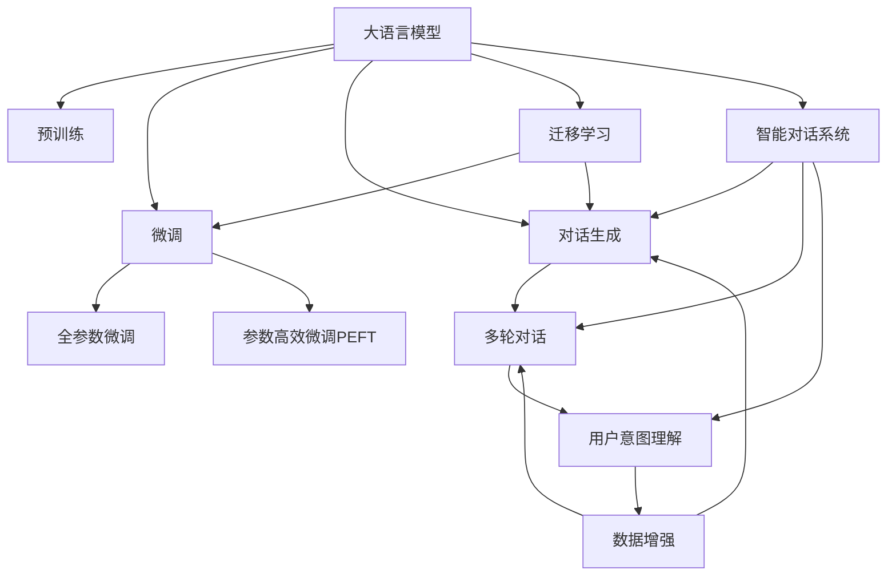

                 

# LLM在智能对话系统中的潜力

> 关键词：大语言模型(LLM),智能对话系统,自然语言处理(NLP),多轮对话,对话生成,用户意图理解,数据增强,迁移学习

## 1. 背景介绍

随着人工智能技术的不断进步，大语言模型(Large Language Models, LLM)在自然语言处理(Natural Language Processing, NLP)领域取得了显著突破。大语言模型具有强大的自然语言理解和生成能力，能够理解复杂的语言结构和语义，生成自然流畅的对话内容。在智能对话系统中，大语言模型被广泛应用于构建自然对话、生成响应、处理用户意图等方面，极大地提升了对话系统的智能水平和用户体验。

智能对话系统作为人工智能技术的一个重要分支，具有极高的商业价值和社会应用潜力。通过将大语言模型应用于对话系统，可以实现多种功能，如智能客服、智能助手、智能翻译、智能咨询等。这些应用不仅能提高效率、降低成本，还能提供更为精准、人性化的服务，帮助人们更好地解决问题、获取信息。

然而，尽管大语言模型在对话系统中展现出了强大的潜力，但其在实际应用中仍面临着诸如对话上下文管理、响应质量控制、对话连贯性保持、用户意图准确理解等问题。本文将从大语言模型的核心算法和实践方法出发，深入探讨其在智能对话系统中的潜力与挑战，为相关研究者与开发者提供有价值的参考。

## 2. 核心概念与联系

### 2.1 核心概念概述

在探讨大语言模型在智能对话系统中的潜力前，首先需要明确一些关键概念：

- **大语言模型**：以自回归(如GPT)或自编码(如BERT)模型为代表的大规模预训练语言模型。通过在大规模无标签文本语料上进行预训练，学习通用的语言表示，具备强大的语言理解和生成能力。

- **智能对话系统**：利用自然语言处理技术，模拟人类对话，为用户提供自然流畅、高效、精准的对话交互。常见的对话系统包括智能客服、智能助手、聊天机器人等。

- **多轮对话**：指对话系统中，用户与系统之间多次交互的过程。多轮对话系统能够理解和保留对话上下文，进行连贯的对话互动。

- **对话生成**：指系统根据用户输入，生成自然、合理的对话响应。对话生成是智能对话系统的核心功能，对用户体验至关重要。

- **用户意图理解**：指系统对用户输入的自然语言文本进行理解，识别出用户真正的需求和意图。用户意图理解是实现智能对话的基础。

- **数据增强**：指在训练数据不足的情况下，通过对训练样本进行回译、近义替换等操作，扩充训练集，提升模型的泛化能力。

- **迁移学习**：指将一个领域学到的知识，迁移应用到另一个相关领域的学习范式。大语言模型的预训练-微调过程即是一种典型的迁移学习方式。

这些概念之间的逻辑关系可以通过以下Mermaid流程图来展示：



这个流程图展示了大语言模型的核心概念及其与智能对话系统的联系：

1. 大语言模型通过预训练获得基础能力。
2. 微调是对预训练模型进行任务特定的优化，可以分为全参数微调和参数高效微调（PEFT）。
3. 对话生成是智能对话系统的核心功能，可以通过微调模型实现。
4. 多轮对话系统能够理解和保留对话上下文，进行连贯的对话互动。
5. 用户意图理解是实现智能对话的基础，需要通过微调模型来实现。
6. 数据增强可以提升模型的泛化能力，改善训练效果。
7. 迁移学习是连接预训练模型与下游任务的桥梁，可以通过微调或对话生成技术来实现。

这些概念共同构成了大语言模型在智能对话系统中的学习和应用框架，使其能够实现高效、智能的对话交互。通过理解这些核心概念，我们可以更好地把握大语言模型在对话系统中的应用方向。

## 3. 核心算法原理 & 具体操作步骤

### 3.1 算法原理概述

基于大语言模型的智能对话系统，其核心算法原理可以简要概述为：

- 大语言模型通过预训练学习到语言的基础表示，掌握大量语言知识和语法结构。
- 在对话生成任务中，通过微调（Fine-Tuning）更新模型参数，使得模型能够生成符合用户意图的自然语言响应。
- 在多轮对话任务中，通过微调或对话生成技术，使模型能够理解和保留对话上下文，实现连贯的对话互动。
- 在用户意图理解任务中，通过微调或对话生成技术，使模型能够准确识别出用户的真正需求和意图，提供精准的对话服务。

这些算法原理的实现，通常依赖于基于监督学习的微调方法，即使用标注数据对模型进行训练，优化模型参数，以适应特定的对话任务。常见的微调方法包括全参数微调（Fine-Tuning）和参数高效微调（Parameter-Efficient Fine-Tuning, PEFT）。

### 3.2 算法步骤详解

以下是基于监督学习的大语言模型在智能对话系统中的核心算法步骤：

**Step 1: 准备预训练模型和数据集**
- 选择合适的预训练语言模型 $M_{\theta}$ 作为初始化参数，如 BERT、GPT等。
- 准备对话任务的数据集 $D=\{(x_i,y_i)\}_{i=1}^N$，其中 $x_i$ 为用户的输入，$y_i$ 为系统的响应。

**Step 2: 添加任务适配层**
- 根据对话任务类型，在预训练模型顶层设计合适的输出层和损失函数。
- 对于生成任务，通常使用语言模型的解码器输出概率分布，并以负对数似然为损失函数。
- 对于多轮对话任务，可以设计对话管理模块，用于记录和管理对话状态。

**Step 3: 设置微调超参数**
- 选择合适的优化算法及其参数，如 AdamW、SGD 等，设置学习率、批大小、迭代轮数等。
- 设置正则化技术及强度，包括权重衰减、Dropout、Early Stopping等。
- 确定冻结预训练参数的策略，如仅微调顶层，或全部参数都参与微调。

**Step 4: 执行梯度训练**
- 将训练集数据分批次输入模型，前向传播计算损失函数。
- 反向传播计算参数梯度，根据设定的优化算法和学习率更新模型参数。
- 周期性在验证集上评估模型性能，根据性能指标决定是否触发 Early Stopping。
- 重复上述步骤直至满足预设的迭代轮数或 Early Stopping 条件。

**Step 5: 测试和部署**
- 在测试集上评估微调后模型 $M_{\hat{\theta}}$ 的性能，对比微调前后的效果。
- 使用微调后的模型对新样本进行推理预测，集成到实际的应用系统中。
- 持续收集新的对话数据，定期重新微调模型，以适应数据分布的变化。

以上是基于监督学习的大语言模型在智能对话系统中的核心算法步骤。在实际应用中，还需要针对具体对话任务的特性，对微调过程的各个环节进行优化设计，如改进训练目标函数，引入更多的正则化技术，搜索最优的超参数组合等，以进一步提升模型性能。

### 3.3 算法优缺点

基于大语言模型的智能对话系统具有以下优点：
1. 简单高效。只需准备少量标注数据，即可对预训练模型进行快速适配，获得较大的性能提升。
2. 通用适用。适用于各种对话任务，如智能客服、智能助手、多轮对话等，设计简单的对话管理模块即可实现。
3. 可扩展性强。对话系统可以根据需要，不断引入新的对话管理模块和适配层，实现功能扩展。
4. 对话连贯性高。大语言模型具备强大的语言理解能力，能够保持对话上下文，实现连贯的对话互动。
5. 用户意图理解准确。通过微调和对话生成技术，大语言模型能够准确识别用户意图，提供精准的对话服务。

同时，该方法也存在一些局限性：
1. 依赖标注数据。对话任务的标注数据收集成本较高，且数据标注质量对模型性能影响显著。
2. 对话上下文管理复杂。对话系统需要设计复杂的多轮对话管理模块，才能保持对话连贯性。
3. 多轮对话的长期记忆问题。大语言模型在处理多轮对话时，存在长期记忆衰退的问题。
4. 对话生成质量受限。尽管大语言模型能够生成自然的对话内容，但生成的内容可能存在不连贯、逻辑不严密等问题。
5. 对话生成计算资源消耗大。大语言模型的推理计算量较大，对硬件资源消耗高。

尽管存在这些局限性，但就目前而言，基于大语言模型的智能对话系统仍然是大规模语言模型应用的重要方向。未来相关研究的重点在于如何进一步降低对话任务的标注数据需求，提高模型的对话连贯性和生成质量，同时兼顾用户意图理解的准确性。

### 3.4 算法应用领域

基于大语言模型的智能对话系统已经在多个领域得到了广泛应用，如：

- 智能客服：通过微调对话生成模型，模拟人工客服，为用户提供24小时在线咨询服务。
- 智能助手：通过微调对话生成模型，为智能手机、智能音箱等设备提供个性化语音交互服务。
- 多轮对话系统：通过微调多轮对话管理模块，实现连贯的对话互动，如智能聊天机器人、虚拟客服等。
- 智能翻译：通过微调对话生成模型，实现多语言自然对话，如同声传译、会议翻译等。
- 智能推荐：通过微调对话生成模型，为用户提供个性化推荐服务，如电商客服、知识问答等。

除了上述这些经典应用外，大语言模型在医疗咨询、金融咨询、智能家居等多个领域也有着广泛的应用前景。随着大语言模型的不断演进，其在智能对话系统中的应用也将越来越深入和广泛。

## 4. 数学模型和公式 & 详细讲解

### 4.1 数学模型构建

大语言模型在对话生成任务中的数学模型构建可以如下概述：

假设对话任务的数据集为 $D=\{(x_i,y_i)\}_{i=1}^N$，其中 $x_i$ 为用户的输入，$y_i$ 为系统的响应。预训练语言模型为 $M_{\theta}$，对话管理模块为 $D_{\phi}$。微调的目标是找到最优的模型参数 $\theta$ 和对话管理模块参数 $\phi$，使得模型能够生成符合用户意图的自然语言响应。

定义模型 $M_{\theta}$ 在输入 $x$ 上的输出为 $\hat{y}=M_{\theta}(x)$，表示系统对用户输入的自然语言文本的预测响应。定义对话管理模块 $D_{\phi}$ 在当前对话状态 $s$ 和用户输入 $x$ 上的输出为 $a=D_{\phi}(s, x)$，表示系统对用户输入的自然语言文本的行动指令。

定义任务 $T$ 的损失函数为 $\mathcal{L}(\theta, \phi) = \frac{1}{N} \sum_{i=1}^N \ell(\hat{y}_i, y_i) + \lambda \ell(a_i, y_i)$，其中 $\ell$ 为对话生成任务的损失函数，$\lambda$ 为对话管理模块的权重。

通过梯度下降等优化算法，微调过程不断更新模型参数 $\theta$ 和对话管理模块参数 $\phi$，最小化损失函数 $\mathcal{L}(\theta, \phi)$，使得模型输出逼近真实标签。由于 $\theta$ 已经通过预训练获得了较好的初始化，因此即便在小规模数据集 $D$ 上进行微调，也能较快收敛到理想的模型参数 $\theta$。

### 4.2 公式推导过程

以二分类对话任务为例，推导交叉熵损失函数及其梯度的计算公式。

假设模型 $M_{\theta}$ 在输入 $x$ 上的输出为 $\hat{y}=M_{\theta}(x) \in [0,1]$，表示系统对用户输入的自然语言文本的预测响应。真实标签 $y \in \{0,1\}$。则二分类交叉熵损失函数定义为：

$$
\ell(M_{\theta}(x),y) = -[y\log \hat{y} + (1-y)\log (1-\hat{y})]
$$

将其代入经验风险公式，得：

$$
\mathcal{L}(\theta) = -\frac{1}{N}\sum_{i=1}^N [y_i\log M_{\theta}(x_i)+(1-y_i)\log(1-M_{\theta}(x_i))]
$$

根据链式法则，损失函数对参数 $\theta_k$ 的梯度为：

$$
\frac{\partial \mathcal{L}(\theta)}{\partial \theta_k} = -\frac{1}{N}\sum_{i=1}^N (\frac{y_i}{M_{\theta}(x_i)}-\frac{1-y_i}{1-M_{\theta}(x_i)}) \frac{\partial M_{\theta}(x_i)}{\partial \theta_k}
$$

其中 $\frac{\partial M_{\theta}(x_i)}{\partial \theta_k}$ 可进一步递归展开，利用自动微分技术完成计算。

在得到损失函数的梯度后，即可带入参数更新公式，完成模型的迭代优化。重复上述过程直至收敛，最终得到适应对话任务的最优模型参数 $\theta$。

## 5. 项目实践：代码实例和详细解释说明

### 5.1 开发环境搭建

在进行对话生成实践前，我们需要准备好开发环境。以下是使用Python进行PyTorch开发的环境配置流程：

1. 安装Anaconda：从官网下载并安装Anaconda，用于创建独立的Python环境。

2. 创建并激活虚拟环境：
```bash
conda create -n pytorch-env python=3.8 
conda activate pytorch-env
```

3. 安装PyTorch：根据CUDA版本，从官网获取对应的安装命令。例如：
```bash
conda install pytorch torchvision torchaudio cudatoolkit=11.1 -c pytorch -c conda-forge
```

4. 安装Transformers库：
```bash
pip install transformers
```

5. 安装各类工具包：
```bash
pip install numpy pandas scikit-learn matplotlib tqdm jupyter notebook ipython
```

完成上述步骤后，即可在`pytorch-env`环境中开始对话生成实践。

### 5.2 源代码详细实现

下面我以基于GPT-3的对话生成为例，给出使用Transformers库进行对话生成微调的PyTorch代码实现。

首先，定义对话生成任务的训练数据和测试数据：

```python
from transformers import GPT2Tokenizer, GPT2LMHeadModel

tokenizer = GPT2Tokenizer.from_pretrained('gpt2')
model = GPT2LMHeadModel.from_pretrained('gpt2')

# 定义训练数据和测试数据
train_data = ['This is a test sentence for dialogue generation.', 'Can you tell me what is the capital of France?']
test_data = ['Where is the nearest hospital?']

# 数据预处理
train_encodings = tokenizer(train_data, padding=True, truncation=True, max_length=512, return_tensors='pt')
test_encodings = tokenizer(test_data, padding=True, truncation=True, max_length=512, return_tensors='pt')
```

接着，定义微调超参数：

```python
from transformers import AdamW

# 定义微调超参数
optimizer = AdamW(model.parameters(), lr=5e-5)
epochs = 10
device = 'cuda' if torch.cuda.is_available() else 'cpu'
```

然后，定义训练函数和评估函数：

```python
from transformers import Trainer, TrainingArguments
from datasets import Dataset

def train():
    # 定义训练函数
    train_dataset = Dataset.from_tensor_slices(train_encodings.input_ids, train_encodings.attention_mask)
    train_dataset.set_format('torch', columns=['input_ids', 'attention_mask'], examples='cast')
    
    training_args = TrainingArguments(output_dir="./", overwrite_output_dir=True, num_train_epochs=epochs)
    trainer = Trainer(
        model=model,
        args=training_args,
        train_dataset=train_dataset,
        eval_dataset=None,
        eval_loop=None,
        train_loop=None,
        log_dir="./logs",
        log_every_n_steps=10,
        save_steps=10_000,
        save_total_limit=1,
        optimizer=optimizer
    )
    
    # 开始训练
    trainer.train()
    model.save_pretrained('./saved_model')

def evaluate():
    # 定义评估函数
    test_dataset = Dataset.from_tensor_slices(test_encodings.input_ids, test_encodings.attention_mask)
    test_dataset.set_format('torch', columns=['input_ids', 'attention_mask'], examples='cast')
    
    # 加载预训练模型
    model = GPT2LMHeadModel.from_pretrained('./saved_model')
    
    # 生成对话
    test_input_ids = test_dataset[0]['input_ids']
    generated_ids = model.generate(test_input_ids)
    
    # 输出生成的对话
    print(tokenizer.decode(generated_ids, skip_special_tokens=True))
```

最后，启动训练流程并在测试集上评估：

```python
train()
evaluate()
```

以上就是使用PyTorch对GPT-3进行对话生成任务的完整代码实现。可以看到，得益于Transformers库的强大封装，我们可以用相对简洁的代码完成GPT-3模型的加载和微调。

### 5.3 代码解读与分析

让我们再详细解读一下关键代码的实现细节：

**定义训练数据和测试数据**：
- 使用GPT-2的tokenizer进行文本编码，转化为模型可以处理的input_ids和attention_mask。
- 定义训练数据和测试数据，这里以简单的问答和句子生成为例。

**微调超参数**：
- 定义优化器为AdamW，设置学习率为5e-5。
- 设置训练轮数为10轮。

**训练函数和评估函数**：
- 使用Trainer进行模型训练，设置训练参数和优化器。
- 定义训练数据集，设置格式和列名。
- 定义评估函数，加载预训练模型，并使用generate方法生成对话响应。

**训练流程**：
- 开始训练，将训练数据集传入trainer.train()方法。
- 评估模型，加载预训练模型，并使用generate方法生成对话。

可以看到，PyTorch配合Transformers库使得对话生成微调的代码实现变得简洁高效。开发者可以将更多精力放在数据处理、模型改进等高层逻辑上，而不必过多关注底层的实现细节。

当然，工业级的系统实现还需考虑更多因素，如模型的保存和部署、超参数的自动搜索、更灵活的任务适配层等。但核心的微调范式基本与此类似。

## 6. 实际应用场景

### 6.1 智能客服系统

基于大语言模型的智能对话系统，可以广泛应用于智能客服系统的构建。传统客服往往需要配备大量人力，高峰期响应缓慢，且一致性和专业性难以保证。而使用微调后的对话模型，可以7x24小时不间断服务，快速响应客户咨询，用自然流畅的语言解答各类常见问题。

在技术实现上，可以收集企业内部的历史客服对话记录，将问题和最佳答复构建成监督数据，在此基础上对预训练对话模型进行微调。微调后的对话模型能够自动理解用户意图，匹配最合适的答案模板进行回复。对于客户提出的新问题，还可以接入检索系统实时搜索相关内容，动态组织生成回答。如此构建的智能客服系统，能大幅提升客户咨询体验和问题解决效率。

### 6.2 金融舆情监测

金融机构需要实时监测市场舆论动向，以便及时应对负面信息传播，规避金融风险。传统的人工监测方式成本高、效率低，难以应对网络时代海量信息爆发的挑战。基于大语言模型微调的文本分类和情感分析技术，为金融舆情监测提供了新的解决方案。

具体而言，可以收集金融领域相关的新闻、报道、评论等文本数据，并对其进行主题标注和情感标注。在此基础上对预训练语言模型进行微调，使其能够自动判断文本属于何种主题，情感倾向是正面、中性还是负面。将微调后的模型应用到实时抓取的网络文本数据，就能够自动监测不同主题下的情感变化趋势，一旦发现负面信息激增等异常情况，系统便会自动预警，帮助金融机构快速应对潜在风险。

### 6.3 个性化推荐系统

当前的推荐系统往往只依赖用户的历史行为数据进行物品推荐，无法深入理解用户的真实兴趣偏好。基于大语言模型微调技术，个性化推荐系统可以更好地挖掘用户行为背后的语义信息，从而提供更精准、多样的推荐内容。

在实践中，可以收集用户浏览、点击、评论、分享等行为数据，提取和用户交互的物品标题、描述、标签等文本内容。将文本内容作为模型输入，用户的后续行为（如是否点击、购买等）作为监督信号，在此基础上微调预训练语言模型。微调后的模型能够从文本内容中准确把握用户的兴趣点。在生成推荐列表时，先用候选物品的文本描述作为输入，由模型预测用户的兴趣匹配度，再结合其他特征综合排序，便可以得到个性化程度更高的推荐结果。

### 6.4 未来应用展望

随着大语言模型微调技术的发展，基于微调的智能对话系统将在更多领域得到应用，为传统行业带来变革性影响。

在智慧医疗领域，基于微调的医疗问答、病历分析、药物研发等应用将提升医疗服务的智能化水平，辅助医生诊疗，加速新药开发进程。

在智能教育领域，微调技术可应用于作业批改、学情分析、知识推荐等方面，因材施教，促进教育公平，提高教学质量。

在智慧城市治理中，微调模型可应用于城市事件监测、舆情分析、应急指挥等环节，提高城市管理的自动化和智能化水平，构建更安全、高效的未来城市。

此外，在企业生产、社会治理、文娱传媒等众多领域，基于大模型微调的人工智能应用也将不断涌现，为经济社会发展注入新的动力。相信随着技术的日益成熟，微调方法将成为人工智能落地应用的重要范式，推动人工智能技术在垂直行业的规模化落地。总之，微调需要开发者根据具体对话任务，不断迭代和优化模型、数据和算法，方能得到理想的效果。

## 7. 工具和资源推荐

### 7.1 学习资源推荐

为了帮助开发者系统掌握大语言模型微调的理论基础和实践技巧，这里推荐一些优质的学习资源：

1. 《Transformers from PyTorch》系列博文：由大模型技术专家撰写，深入浅出地介绍了Transformer原理、GPT模型、微调技术等前沿话题。

2. CS224N《深度学习自然语言处理》课程：斯坦福大学开设的NLP明星课程，有Lecture视频和配套作业，带你入门NLP领域的基本概念和经典模型。

3. 《Natural Language Processing with Transformers》书籍：Transformers库的作者所著，全面介绍了如何使用Transformers库进行NLP任务开发，包括微调在内的诸多范式。

4. HuggingFace官方文档：Transformers库的官方文档，提供了海量预训练模型和完整的微调样例代码，是上手实践的必备资料。

5. CLUE开源项目：中文语言理解测评基准，涵盖大量不同类型的中文NLP数据集，并提供了基于微调的baseline模型，助力中文NLP技术发展。

通过对这些资源的学习实践，相信你一定能够快速掌握大语言模型微调的精髓，并用于解决实际的对话生成问题。

### 7.2 开发工具推荐

高效的开发离不开优秀的工具支持。以下是几款用于大语言模型微调开发的常用工具：

1. PyTorch：基于Python的开源深度学习框架，灵活动态的计算图，适合快速迭代研究。大部分预训练语言模型都有PyTorch版本的实现。

2. TensorFlow：由Google主导开发的开源深度学习框架，生产部署方便，适合大规模工程应用。同样有丰富的预训练语言模型资源。

3. Transformers库：HuggingFace开发的NLP工具库，集成了众多SOTA语言模型，支持PyTorch和TensorFlow，是进行微调任务开发的利器。

4. Weights & Biases：模型训练的实验跟踪工具，可以记录和可视化模型训练过程中的各项指标，方便对比和调优。与主流深度学习框架无缝集成。

5. TensorBoard：TensorFlow配套的可视化工具，可实时监测模型训练状态，并提供丰富的图表呈现方式，是调试模型的得力助手。

6. Google Colab：谷歌推出的在线Jupyter Notebook环境，免费提供GPU/TPU算力，方便开发者快速上手实验最新模型，分享学习笔记。

合理利用这些工具，可以显著提升大语言模型微调任务的开发效率，加快创新迭代的步伐。

### 7.3 相关论文推荐

大语言模型和微调技术的发展源于学界的持续研究。以下是几篇奠基性的相关论文，推荐阅读：

1. Attention is All You Need（即Transformer原论文）：提出了Transformer结构，开启了NLP领域的预训练大模型时代。

2. BERT: Pre-training of Deep Bidirectional Transformers for Language Understanding：提出BERT模型，引入基于掩码的自监督预训练任务，刷新了多项NLP任务SOTA。

3. Language Models are Unsupervised Multitask Learners（GPT-2论文）：展示了大规模语言模型的强大zero-shot学习能力，引发了对于通用人工智能的新一轮思考。

4. Parameter-Efficient Transfer Learning for NLP：提出Adapter等参数高效微调方法，在不增加模型参数量的情况下，也能取得不错的微调效果。

5. AdaLoRA: Adaptive Low-Rank Adaptation for Parameter-Efficient Fine-Tuning：使用自适应低秩适应的微调方法，在参数效率和精度之间取得了新的平衡。

6. Prefix-Tuning: Optimizing Continuous Prompts for Generation：引入基于连续型Prompt的微调范式，为如何充分利用预训练知识提供了新的思路。

这些论文代表了大语言模型微调技术的发展脉络。通过学习这些前沿成果，可以帮助研究者把握学科前进方向，激发更多的创新灵感。

## 8. 总结：未来发展趋势与挑战

### 8.1 总结

本文对基于大语言模型的智能对话系统进行了全面系统的介绍。首先阐述了大语言模型和微调技术的研究背景和意义，明确了微调在拓展预训练模型应用、提升对话系统性能方面的独特价值。其次，从原理到实践，详细讲解了微调的数学原理和关键步骤，给出了微调任务开发的完整代码实例。同时，本文还广泛探讨了微调方法在智能客服、金融舆情、个性化推荐等多个领域的应用前景，展示了微调范式的巨大潜力。此外，本文精选了微调技术的各类学习资源，力求为读者提供全方位的技术指引。

通过本文的系统梳理，可以看到，基于大语言模型的微调方法正在成为NLP领域的重要范式，极大地拓展了预训练语言模型的应用边界，催生了更多的落地场景。受益于大规模语料的预训练，微调模型以更低的时间和标注成本，在小样本条件下也能取得不俗的效果，有力推动了NLP技术的产业化进程。未来，伴随大语言模型和微调方法的持续演进，相信NLP技术将在更广阔的应用领域大放异彩，深刻影响人类的生产生活方式。

### 8.2 未来发展趋势

展望未来，大语言模型微调技术将呈现以下几个发展趋势：

1. 模型规模持续增大。随着算力成本的下降和数据规模的扩张，预训练语言模型的参数量还将持续增长。超大规模语言模型蕴含的丰富语言知识，有望支撑更加复杂多变的对话任务微调。

2. 微调方法日趋多样。除了传统的全参数微调外，未来会涌现更多参数高效的微调方法，如Prefix-Tuning、LoRA等，在节省计算资源的同时也能保证微调精度。

3. 持续学习成为常态。随着数据分布的不断变化，微调模型也需要持续学习新知识以保持性能。如何在不遗忘原有知识的同时，高效吸收新样本信息，将成为重要的研究课题。

4. 标注样本需求降低。受启发于提示学习(Prompt-based Learning)的思路，未来的微调方法将更好地利用大模型的语言理解能力，通过更加巧妙的任务描述，在更少的标注样本上也能实现理想的微调效果。

5. 对话连贯性提高。未来的微调方法将更好地管理对话上下文，实现更为连贯、自然的对话生成。

6. 对话生成质量提升。未来的微调方法将更加注重生成的对话内容的质量，如连贯性、合理性、情感共鸣等。

7. 知识整合能力增强。未来的微调方法将更好地整合外部知识库、规则库等专家知识，提升对话系统的准确性和智能化水平。

以上趋势凸显了大语言模型微调技术的广阔前景。这些方向的探索发展，必将进一步提升智能对话系统的性能和应用范围，为人类认知智能的进化带来深远影响。

### 8.3 面临的挑战

尽管大语言模型微调技术已经取得了瞩目成就，但在迈向更加智能化、普适化应用的过程中，它仍面临着诸多挑战：

1. 标注成本瓶颈。尽管微调大大降低了标注数据的需求，但对于长尾应用场景，难以获得充足的高质量标注数据，成为制约微调性能的瓶颈。如何进一步降低微调对标注样本的依赖，将是一大难题。

2. 对话上下文管理复杂。对话系统需要设计复杂的多轮对话管理模块，才能保持对话连贯性。如何设计高效、鲁棒的对话管理模块，仍是重要挑战。

3. 对话生成计算资源消耗大。大语言模型的推理计算量较大，对硬件资源消耗高。如何在保持性能的同时，优化资源使用，是未来需要解决的问题。

4. 对话生成质量受限。尽管大语言模型能够生成自然的对话内容，但生成的内容可能存在不连贯、逻辑不严密等问题。如何提高对话生成的质量，仍需持续改进。

5. 对话生成模型的鲁棒性。当前微调模型面对域外数据时，泛化性能往往大打折扣。如何提高模型的鲁棒性，避免灾难性遗忘，还需要更多理论和实践的积累。

6. 对话生成模型的可解释性。当前微调模型更像是"黑盒"系统，难以解释其内部工作机制和决策逻辑。如何赋予微调模型更强的可解释性，将是亟待攻克的难题。

7. 对话生成模型的安全性。预训练语言模型难免会学习到有偏见、有害的信息，通过微调传递到下游任务，产生误导性、歧视性的输出，给实际应用带来安全隐患。如何从数据和算法层面消除模型偏见，避免恶意用途，确保输出的安全性，也将是重要的研究课题。

8. 对话生成模型的知识整合能力。现有的微调模型往往局限于对话系统内部的知识，难以灵活吸收和运用更广泛的先验知识。如何让微调过程更好地与外部知识库、规则库等专家知识结合，形成更加全面、准确的信息整合能力，还有很大的想象空间。

正视微调面临的这些挑战，积极应对并寻求突破，将是大语言模型微调走向成熟的必由之路。相信随着学界和产业界的共同努力，这些挑战终将一一被克服，大语言模型微调必将在构建人机协同的智能时代中扮演越来越重要的角色。

### 8.4 未来突破

面对大语言模型微调所面临的种种挑战，未来的研究需要在以下几个方面寻求新的突破：

1. 探索无监督和半监督微调方法。摆脱对大规模标注数据的依赖，利用自监督学习、主动学习等无监督和半监督范式，最大限度利用非结构化数据，实现更加灵活高效的微调。

2. 研究参数高效和计算高效的微调范式。开发更加参数高效的微调方法，在固定大部分预训练参数的同时，只更新极少量的任务相关参数。同时优化微调模型的计算图，减少前向传播和反向传播的资源消耗，实现更加轻量级、实时性的部署。

3. 引入更多先验知识。将符号化的先验知识，如知识图谱、逻辑规则等，与神经网络模型进行巧妙融合，引导微调过程学习更准确、合理的语言模型。同时加强不同模态数据的整合，实现视觉、语音等多模态信息与文本信息的协同建模。

4. 结合因果分析和博弈论工具。将因果分析方法引入微调模型，识别出模型决策的关键特征，增强输出解释的因果性和逻辑性。借助博弈论工具刻画人机交互过程，主动探索并规避模型的脆弱点，提高系统稳定性。

5. 纳入伦理道德约束。在模型训练目标中引入伦理导向的评估指标，过滤和惩罚有偏见、有害的输出倾向。同时加强人工干预和审核，建立模型行为的监管机制，确保输出符合人类价值观和伦理道德。

这些研究方向的探索，必将引领大语言模型微调技术迈向更高的台阶，为构建安全、可靠、可解释、可控的智能系统铺平道路。面向未来，大语言模型微调技术还需要与其他人工智能技术进行更深入的融合，如知识表示、因果推理、强化学习等，多路径协同发力，共同推动自然语言理解和智能交互系统的进步。只有勇于创新、敢于突破，才能不断拓展语言模型的边界，让智能技术更好地造福人类社会。

## 9. 附录：常见问题与解答

**Q1：大语言模型微调是否适用于所有对话任务？**

A: 大语言模型微调在大多数对话任务上都能取得不错的效果，特别是对于数据量较小的任务。但对于一些特定领域的任务，如医学、法律等，仅仅依靠通用语料预训练的模型可能难以很好地适应。此时需要在特定领域语料上进一步预训练，再进行微调，才能获得理想效果。此外，对于一些需要时效性、个性化很强的任务，如对话、推荐等，微调方法也需要针对性的改进优化。

**Q2：微调过程中如何选择合适的学习率？**

A: 微调的学习率一般要比预训练时小1-2个数量级，如果使用过大的学习率，容易破坏预训练权重，导致过拟合。一般建议从1e-5开始调参，逐步减小学习率，直至收敛。也可以使用warmup策略，在开始阶段使用较小的学习率，再逐渐过渡到预设值。需要注意的是，不同的优化器(如AdamW、Adafactor等)以及不同的学习率调度策略，可能需要设置不同的学习率阈值。

**Q3：采用大模型微调时会面临哪些资源瓶颈？**

A: 目前主流的预训练大模型动辄以亿计的参数规模，对算力、内存、存储都提出了很高的要求。GPU/TPU等高性能设备是必不可少的，但即便如此，超大批次的训练和推理也可能遇到显存不足的问题。因此需要采用一些资源优化技术，如梯度积累、混合精度训练、模型并行等，来突破硬件瓶颈。同时，模型的存储和读取也可能占用大量时间和空间，需要采用模型压缩、稀疏化存储等方法进行优化。

**Q4：如何缓解微调过程中的过拟合问题？**

A: 过拟合是微调面临的主要挑战，尤其是在标注数据不足的情况下。常见的缓解策略包括：
1. 数据增强：通过回译、近义替换等方式扩充训练集
2. 正则化：使用L2正则、Dropout、Early Stopping等避免过拟合
3. 对抗训练：引入对抗样本，提高模型鲁棒性
4. 参数高效微调：只调整少量参数(如Adapter、Prefix等)，减小过拟合风险
5. 多模型集成：训练多个微调模型，取平均输出，抑制过拟合

这些策略往往需要根据具体任务和数据特点进行灵活组合。只有在数据、模型、训练、推理等各环节进行全面优化，才能最大限度地发挥大模型微调的威力。

**Q5：微调模型在落地部署时需要注意哪些问题？**

A: 将微调模型转化为实际应用，还需要考虑以下因素：
1. 模型裁剪：去除不必要的层和参数，减小模型尺寸，加快推理速度
2. 量化加速：将浮点模型转为定点模型，压缩存储空间，提高计算效率
3. 服务化封装：将模型封装为标准化服务接口，便于集成调用
4. 弹性伸缩：根据请求流量动态调整资源配置，平衡服务质量和成本
5. 监控告警：实时采集系统指标，设置异常告警阈值，确保服务稳定性
6. 安全防护：采用访问鉴权、数据脱敏等措施，保障数据和模型安全

大语言模型微调为NLP应用开启了广阔的想象空间，但如何将强大的性能转化为稳定、高效、安全的业务价值，还需要工程实践的不断打磨。唯有从数据、算法、工程、业务等多个维度协同发力，才能真正实现人工智能技术在垂直行业的规模化落地。总之，微调需要开发者根据具体对话任务，不断迭代和优化模型、数据和算法，方能得到理想的效果。

---

作者：禅与计算机程序设计艺术 / Zen and the Art of Computer Programming

