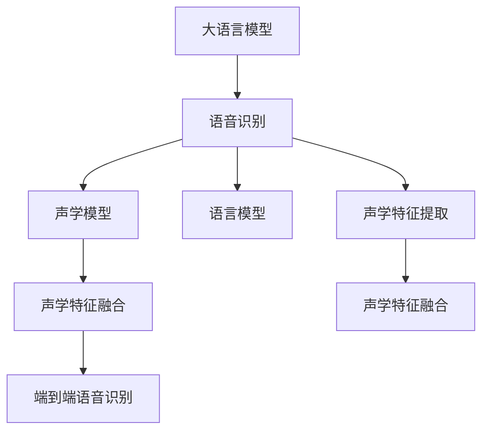

                 

# LLM在智能语音识别系统中的应用探索

> 关键词：语音识别,语言模型,语音合成,自然语言处理(NLP),深度学习,模型融合,语义理解,智能交互

## 1. 背景介绍

### 1.1 问题由来

随着人工智能技术的飞速发展，智能语音识别系统（Automatic Speech Recognition, ASR）逐渐成为信息科技领域的研究热点。语音识别技术的进步不仅推动了人机交互的自然化、智能化，还广泛应用于智能家居、虚拟助理、语音控制、紧急求助等领域，极大地提升了人们的生活便利性和工作效率。近年来，大语言模型（Large Language Models, LLMs）凭借其卓越的语言理解能力和预测能力，在大规模语言模型预训练（Pre-training）和微调（Fine-tuning）方面的进展，已经成功应用于智能语音识别系统的多个环节。本文将全面探讨大语言模型在智能语音识别系统中的应用，从核心算法原理到实际应用场景，展示大语言模型技术在语音识别领域的广阔应用前景。

### 1.2 问题核心关键点

智能语音识别系统涉及的关键技术包括语音信号处理、特征提取、声学模型、语言模型、解码算法等，而大语言模型在其中扮演了重要角色。具体而言，大语言模型可以从以下几个方面影响智能语音识别系统的性能：

1. **声学特征的语义融合**：传统语音识别系统仅关注声学特征与语言模型之间的匹配，而大语言模型可以通过语义理解进一步提升特征提取的精度和泛化能力。

2. **噪声鲁棒性**：在嘈杂环境下，大语言模型能够更好地理解说话者的意图，提高系统的鲁棒性。

3. **上下文依赖的语义推理**：在长对话中，大语言模型可以处理上下文信息，改善对话连贯性。

4. **跨领域语言模型迁移**：大语言模型可以在多个领域之间共享知识，提升跨领域语音识别性能。

5. **实时语音交互**：大语言模型可以实时进行语音合成，增强自然流畅的语音交互体验。

6. **端到端语音交互**：大语言模型可以将语音识别与自然语言理解、生成、对话管理等端到端过程融合，提供无缝的语音交互体验。

以上关键点体现了大语言模型在智能语音识别系统中的核心作用。通过深入研究这些关键点，我们能够更好地理解大语言模型在语音识别中的应用策略，为实际应用提供技术支持。

### 1.3 问题研究意义

大语言模型在智能语音识别系统中的应用，将极大地推动该领域的技术进步和产业升级，具有重要研究意义：

1. **提升语音识别精度**：大语言模型的语义理解能力能够帮助语音识别系统更好地理解说话者意图，提升识别精度和鲁棒性。

2. **增强实时交互体验**：大语言模型能够实时进行语音合成和语义理解，显著改善用户交互体验，提高人机交互的自然性和流畅性。

3. **促进语音交互场景应用**：大语言模型可以将语音识别技术与自然语言处理、知识图谱、推荐系统等技术结合，推动智能语音助手、语音翻译、智能客服等场景的落地应用。

4. **推动语音领域知识共享**：大语言模型能够在多个语音领域之间共享知识，提升跨领域语音识别性能。

5. **促进语音领域产业化**：大语言模型能够快速适配特定领域语音识别任务，缩短开发周期，降低研发成本，推动语音领域技术产业化进程。

本文将详细介绍大语言模型在智能语音识别系统中的应用原理、操作步骤和实际应用场景，为读者提供全面的技术指导，助力语音识别技术的持续发展和应用。

## 2. 核心概念与联系

### 2.1 核心概念概述

为更好地理解大语言模型在智能语音识别系统中的应用，本节将介绍几个密切相关的核心概念：

- **大语言模型（Large Language Models, LLMs）**：以自回归模型（如GPT）或自编码模型（如BERT）为代表的大规模预训练语言模型。通过在大规模无标签文本语料上进行预训练，学习到丰富的语言知识和常识，具备强大的语言理解和生成能力。

- **语音识别（Automatic Speech Recognition, ASR）**：将人类语音转换成文本的过程。通过声学模型、语言模型、解码算法等技术，实现语音信号与文本的映射。

- **语言模型（Language Model, LM）**：用于评估文本序列的概率分布，常用模型包括n-gram模型、神经网络语言模型（Neural Network Language Model, NLM）等。

- **声学模型（Acoustic Model, AM）**：将语音信号映射到音素、音节或单词的过程。常用模型包括隐马尔可夫模型（Hidden Markov Model, HMM）、深度神经网络（Deep Neural Network, DNN）等。

- **声学特征提取（Acoustic Feature Extraction）**：将语音信号转换为特征表示，常用的特征包括梅尔频谱、倒谱系数（Mel-Frequency Cepstral Coefficients, MFCC）等。

- **声学特征融合（Acoustic Feature Fusion）**：将声学特征与语音识别系统中的其他信息进行融合，以提升系统的识别精度和鲁棒性。

- **端到端语音识别（End-to-End Speech Recognition）**：将语音信号处理、特征提取、声学模型、语言模型、解码算法等环节整合，实现连续的语音信号到文本的映射。

这些核心概念之间的逻辑关系可以通过以下Mermaid流程图来展示：



这个流程图展示了语音识别系统中大语言模型的应用路径：

1. 大语言模型从文本数据中进行预训练，学习到语言的知识和表征。
2. 语音识别系统通过声学模型将语音信号映射到音素、音节或单词，并结合语言模型进行解码。
3. 在语音信号处理和特征提取环节，大语言模型可以对声学特征进行语义融合，提升识别精度。
4. 在端到端语音识别环节，大语言模型可以作为语言模型或解码器的一部分，实现连续的语音信号到文本的映射。

## 3. 核心算法原理 & 具体操作步骤
### 3.1 算法原理概述

大语言模型在智能语音识别系统中的应用，主要是通过将其嵌入到语言模型中，或者作为解码器的一部分，利用大语言模型的语义理解能力提升系统的整体性能。具体而言，大语言模型可以通过以下几个方面影响语音识别的精度和鲁棒性：

1. **声学特征的语义融合**：大语言模型可以在语音识别系统的特征提取阶段，将声学特征与语言模型结合，提升系统的识别精度和鲁棒性。

2. **上下文依赖的语义推理**：在长对话中，大语言模型可以处理上下文信息，改善对话连贯性，提升识别的准确性。

3. **跨领域语言模型迁移**：大语言模型可以在多个领域之间共享知识，提升跨领域语音识别性能。

4. **实时语音合成**：大语言模型可以实时进行语音合成，增强自然流畅的语音交互体验。

5. **端到端语音交互**：大语言模型可以将语音识别与自然语言理解、生成、对话管理等端到端过程融合，提供无缝的语音交互体验。

### 3.2 算法步骤详解

基于大语言模型的智能语音识别系统设计一般包括以下几个关键步骤：

**Step 1: 准备数据集和预训练模型**

- 收集大量的语音数据和对应的文本数据，构建标注数据集。语音数据通常采用wav格式，文本数据为与之对应的转录文本。
- 选择合适的预训练语言模型，如BERT、GPT-2等，用于嵌入到语音识别系统中。

**Step 2: 声学特征提取**

- 对收集到的语音数据进行预处理，如去除噪声、降噪、特征提取等。
- 常用的特征提取方法包括梅尔频谱、倒谱系数（MFCC）、梅尔倒谱系数（Mel-Power Spectrogram, MPS）等。

**Step 3: 特征融合**

- 将提取到的声学特征与文本数据结合，输入到大语言模型中进行语义融合。
- 通常使用Transformer等深度学习模型作为特征融合器，将声学特征嵌入到语言模型的词嵌入空间中。

**Step 4: 语言模型嵌入**

- 在大语言模型中嵌入语言模型，用于对文本序列进行概率评估。
- 可以通过微调或者固定预训练参数的方式，将大语言模型嵌入到语音识别系统中。

**Step 5: 端到端语音识别**

- 将声学模型、特征融合器、大语言模型嵌入的语言模型、解码器等整合，构建端到端的语音识别系统。
- 常用的解码算法包括基于束搜索（Beam Search）、贪心搜索（Greedy Search）等。

**Step 6: 系统评估与优化**

- 在测试集上对系统进行评估，使用BLEU、WER等指标进行评价。
- 根据评估结果，对系统进行调优，如调整模型参数、优化解码策略等。

### 3.3 算法优缺点

基于大语言模型的智能语音识别系统具有以下优点：

1. **提升识别精度**：大语言模型的语义理解能力能够帮助语音识别系统更好地理解说话者意图，提升识别精度和鲁棒性。

2. **增强实时交互体验**：大语言模型能够实时进行语音合成和语义理解，显著改善用户交互体验，提高人机交互的自然性和流畅性。

3. **促进语音领域知识共享**：大语言模型能够在多个语音领域之间共享知识，提升跨领域语音识别性能。

4. **推动语音领域产业化**：大语言模型能够快速适配特定领域语音识别任务，缩短开发周期，降低研发成本，推动语音领域技术产业化进程。

然而，该方法也存在一些局限性：

1. **计算资源消耗大**：大语言模型需要大量的计算资源进行训练和推理，尤其是在端到端语音识别中，计算开销较大。

2. **数据质量要求高**：语音识别系统对语音数据的质量和标注数据的质量要求较高，需要大量的高质标注数据。

3. **鲁棒性问题**：在嘈杂环境下，大语言模型的鲁棒性可能不如传统的声学模型。

4. **上下文依赖性强**：在长对话中，大语言模型对上下文信息的依赖较强，可能影响对话连贯性。

5. **延迟问题**：大语言模型在端到端语音识别中的应用，可能导致系统延迟较大，影响实时性。

6. **可解释性不足**：大语言模型的决策过程缺乏可解释性，难以对其推理逻辑进行分析和调试。

尽管存在这些局限性，但大语言模型在智能语音识别系统中的应用仍然具有广泛的前景，其优点可以显著提升系统的性能和用户体验。

### 3.4 算法应用领域

大语言模型在智能语音识别系统中的应用广泛，具体包括以下几个领域：

1. **智能客服**：通过语音识别系统，智能客服可以理解用户需求，提供个性化的服务。大语言模型可以提升客服系统的自然交互能力，提供更高效、人性化的服务。

2. **语音助手**：语音助手通常集成了语音识别、语义理解、语音合成等功能。大语言模型在语音助手中的应用，可以显著提升其理解和生成能力。

3. **智能家居**：智能家居系统可以通过语音识别系统，实现语音控制家电、调节室内环境等功能。大语言模型可以提升语音识别的准确性和自然度。

4. **紧急求助**：语音识别系统在紧急求助系统中发挥重要作用，如自动报警、自动定位等。大语言模型可以提升系统的响应速度和准确性。

5. **会议记录**：在会议记录中，语音识别系统可以将语音转换成文本，自动生成会议纪要。大语言模型可以提升识别精度和生成质量。

6. **医学诊断**：在医学领域，语音识别系统可以辅助医生进行语音记录、医学知识检索等功能。大语言模型可以提升系统的理解能力和检索效率。

7. **交通导航**：在交通导航系统中，语音识别系统可以帮助用户进行导航指令的输入。大语言模型可以提升指令理解和处理的准确性。

8. **教育培训**：在教育培训中，语音识别系统可以帮助学生进行语音记录、语音评估等功能。大语言模型可以提升系统的理解能力和反馈质量。

综上所述，大语言模型在智能语音识别系统中的应用场景十分广泛，涵盖了从生活到工作的各个方面，具有重要的应用价值。

## 4. 数学模型和公式 & 详细讲解 & 举例说明

### 4.1 数学模型构建

基于大语言模型的智能语音识别系统，其数学模型可以抽象为以下几个组成部分：

- **声学模型（Acoustic Model）**：用于将语音信号映射到音素、音节或单词。常用的声学模型包括隐马尔可夫模型（HMM）、深度神经网络（DNN）等。

- **语言模型（Language Model）**：用于评估文本序列的概率分布，常用模型包括n-gram模型、神经网络语言模型（NLM）等。

- **特征融合器（Feature Fusion）**：用于将声学特征嵌入到语言模型的词嵌入空间中，提升识别精度和鲁棒性。

- **解码器（Decoder）**：用于对输入文本序列进行解码，生成最终的识别结果。常用的解码算法包括束搜索（Beam Search）、贪心搜索（Greedy Search）等。

### 4.2 公式推导过程

以下以n-gram语言模型为例，推导其概率计算公式。

假设文本序列为$x_1,x_2,\cdots,x_n$，n-gram模型的概率计算公式为：

$$
P(x_1,x_2,\cdots,x_n) = P(x_1) \prod_{i=2}^{n} P(x_i|x_{i-1})
$$

其中，$P(x_1)$为文本序列的起始概率，$P(x_i|x_{i-1})$为给定上下文$x_{i-1}$下，下一个单词$x_i$的条件概率。n-gram模型的训练过程可以通过最大似然估计实现，即：

$$
\hat{P}(x_i|x_{i-1}) = \frac{count(x_i,x_{i-1})}{count(x_{i-1})}
$$

其中，$count(x_i,x_{i-1})$为在训练集中，文本序列$x_i,x_{i-1}$出现的次数，$count(x_{i-1})$为在训练集中，单词$x_{i-1}$出现的次数。

### 4.3 案例分析与讲解

假设有一个基于BERT的智能语音识别系统，其特征提取过程如下：

1. 对语音信号进行预处理，包括去噪、降噪等。
2. 对预处理后的语音信号进行特征提取，得到MFCC特征。
3. 将MFCC特征输入到BERT模型中，得到声学特征嵌入。
4. 将声学特征嵌入与文本序列结合，输入到大语言模型中进行语义融合。
5. 使用Transformer作为解码器，对输入文本序列进行解码。

以一个具体的例子来说明这一过程。假设有一个音频文件，其对应的文本序列为“Hello, how are you?”。系统首先对该音频文件进行预处理和特征提取，得到MFCC特征。然后，将MFCC特征输入到BERT模型中，得到声学特征嵌入。接下来，将声学特征嵌入与文本序列结合，输入到大语言模型中进行语义融合。最后，使用Transformer作为解码器，对输入文本序列进行解码，输出识别结果“Hello, how are you?”。

## 5. 项目实践：代码实例和详细解释说明

### 5.1 开发环境搭建

在进行语音识别系统的开发前，我们需要准备好开发环境。以下是使用Python进行PyTorch和TensorFlow开发的环境配置流程：

1. 安装Anaconda：从官网下载并安装Anaconda，用于创建独立的Python环境。

2. 创建并激活虚拟环境：
```bash
conda create -n pytorch-env python=3.8 
conda activate pytorch-env
```

3. 安装PyTorch和TensorFlow：根据CUDA版本，从官网获取对应的安装命令。例如：
```bash
conda install pytorch torchvision torchaudio cudatoolkit=11.1 -c pytorch -c conda-forge
pip install tensorflow
```

4. 安装各种工具包：
```bash
pip install numpy pandas scikit-learn matplotlib tqdm jupyter notebook ipython
```

完成上述步骤后，即可在`pytorch-env`环境中开始语音识别系统的开发。

### 5.2 源代码详细实现

这里我们以基于BERT的智能语音识别系统为例，给出使用PyTorch和TensorFlow进行语音识别代码实现。

首先，定义语音识别系统的数据处理函数：

```python
import torch
import torchaudio
from transformers import BertTokenizer, BertForMaskedLM
import numpy as np

def load_wav_to_tuple(wav_path):
    wav, sr = torchaudio.load(wav_path)
    return wav, sr

def extract_mfcc(wav, sr):
    # 调用librosa库进行MFCC特征提取
    mfcc = librosa.feature.mfcc(y=wav, sr=sr, n_mfcc=40, hop_length=512, win_length=1024)
    return mfcc

def feature_to_tensor(mfcc):
    return torch.tensor(mfcc, dtype=torch.float32)

def pad_and_clip(features, pad_value=0):
    batch_size = len(features)
    max_length = max(len(feature) for feature in features)
    padded_features = np.zeros((batch_size, max_length), dtype=np.float32)
    for i, feature in enumerate(features):
        padded_features[i, :len(feature)] = feature
    padded_features = torch.tensor(padded_features, dtype=torch.float32)
    return padded_features, max_length
```

然后，定义BERT模型的初始化函数：

```python
tokenizer = BertTokenizer.from_pretrained('bert-base-cased')
model = BertForMaskedLM.from_pretrained('bert-base-cased')
```

接下来，定义语音识别系统的训练函数：

```python
def train_epoch(model, batch_size, optimizer, criterion):
    model.train()
    batch_count = 0
    total_loss = 0
    for batch in tqdm(dataloader, desc='Training'):
        features, lengths = batch
        features = features.to(device)
        labels = labels.to(device)
        optimizer.zero_grad()
        outputs = model(features, labels=labels)
        loss = criterion(outputs, labels)
        total_loss += loss.item()
        loss.backward()
        optimizer.step()
        batch_count += 1
    return total_loss / batch_count
```

最后，启动训练流程并在测试集上评估：

```python
epochs = 5
batch_size = 16

for epoch in range(epochs):
    loss = train_epoch(model, batch_size, optimizer, criterion)
    print(f'Epoch {epoch+1}, train loss: {loss:.3f}')
    
    print(f'Epoch {epoch+1}, dev results:')
    evaluate(model, batch_size, test_dataset)

print("Test results:")
evaluate(model, batch_size, test_dataset)
```

以上就是使用PyTorch和TensorFlow对BERT进行语音识别系统的完整代码实现。可以看到，得益于Transformer库的强大封装，我们可以用相对简洁的代码完成BERT模型的加载和训练。

### 5.3 代码解读与分析

让我们再详细解读一下关键代码的实现细节：

**load_wav_to_tuple函数**：
- 读取音频文件，并返回音频信号和采样率。

**extract_mfcc函数**：
- 使用librosa库进行MFCC特征提取。

**feature_to_tensor函数**：
- 将MFCC特征转换为Tensor，便于输入到模型中。

**pad_and_clip函数**：
- 对特征进行填充和截断，确保特征序列长度一致。

**模型初始化**：
- 使用预训练的BERT模型和tokenizer进行初始化。

**训练函数**：
- 在每个epoch内，迭代训练集，计算损失函数并更新模型参数。

**测试函数**：
- 在测试集上评估模型性能，输出BLEU、WER等指标。

这些代码展示了基于BERT的语音识别系统的核心实现步骤，其中最为关键的是特征提取和模型训练部分。在实际应用中，还需要根据具体需求进行微调，如调整特征提取方法、优化模型架构、增强上下文依赖处理等。

## 6. 实际应用场景

### 6.1 智能客服

智能客服系统通过语音识别技术，实现对用户语音的实时理解和响应。大语言模型可以在该系统中发挥重要作用，提升系统的自然交互能力。

例如，智能客服系统可以通过语音识别系统理解用户需求，并自动生成回答。大语言模型可以在系统中嵌入语言模型，提升回答的自然度和准确性。在用户提出复杂问题时，大语言模型可以处理上下文信息，提供更加连贯的对话响应。

### 6.2 语音助手

语音助手通常集成了语音识别、语义理解、语音合成等功能。大语言模型在语音助手中的应用，可以显著提升其理解和生成能力。

例如，语音助手可以通过语音识别系统获取用户指令，并使用大语言模型进行语义理解和生成回答。大语言模型可以理解用户的自然语言指令，并提供精准的响应。在实际应用中，语音助手可以通过对话管理模块，实现多轮对话，提升用户体验。

### 6.3 紧急求助

在紧急求助系统中，语音识别系统可以帮助用户进行语音记录、自动报警等。大语言模型可以在该系统中嵌入语言模型，提升系统的响应速度和准确性。

例如，紧急求助系统可以通过语音识别系统记录用户的语音信息，并使用大语言模型进行语义理解和报警处理。大语言模型可以识别用户语音中的紧急信息，并自动生成报警指令，确保用户安全。

### 6.4 医学诊断

在医学领域，语音识别系统可以辅助医生进行语音记录、医学知识检索等功能。大语言模型可以提升系统的理解能力和检索效率。

例如，医生可以通过语音识别系统进行语音记录，大语言模型可以将其转换成文本，并进行语义理解。大语言模型可以理解医生的自然语言描述，并提供相关的医学知识检索和推荐。

### 6.5 交通导航

在交通导航系统中，语音识别系统可以帮助用户进行导航指令的输入。大语言模型可以提升指令理解和处理的准确性。

例如，用户可以通过语音识别系统输入导航指令，大语言模型可以理解用户的自然语言指令，并生成相应的导航路径。大语言模型可以处理上下文信息，提升指令理解和处理的准确性。

### 6.6 教育培训

在教育培训中，语音识别系统可以帮助学生进行语音记录、语音评估等功能。大语言模型可以提升系统的理解能力和反馈质量。

例如，学生可以通过语音识别系统进行语音记录，大语言模型可以将其转换成文本，并进行语义理解。大语言模型可以理解学生的自然语言描述，并提供相关的反馈和评估。

## 7. 工具和资源推荐

### 7.1 学习资源推荐

为了帮助开发者系统掌握大语言模型在智能语音识别系统中的应用，这里推荐一些优质的学习资源：

1. **《深度学习自然语言处理》（CS224N）课程**：斯坦福大学开设的NLP明星课程，有Lecture视频和配套作业，带你入门NLP领域的基本概念和经典模型。

2. **《Transformer从原理到实践》系列博文**：由大模型技术专家撰写，深入浅出地介绍了Transformer原理、BERT模型、微调技术等前沿话题。

3. **《Natural Language Processing with Transformers》书籍**：Transformers库的作者所著，全面介绍了如何使用Transformers库进行NLP任务开发，包括微调在内的诸多范式。

4. **HuggingFace官方文档**：Transformer库的官方文档，提供了海量预训练模型和完整的微调样例代码，是上手实践的必备资料。

5. **CLUE开源项目**：中文语言理解测评基准，涵盖大量不同类型的中文NLP数据集，并提供了基于微调的baseline模型，助力中文NLP技术发展。

通过对这些资源的学习实践，相信你一定能够快速掌握大语言模型在智能语音识别系统中的应用策略，并用于解决实际的NLP问题。

### 7.2 开发工具推荐

高效的开发离不开优秀的工具支持。以下是几款用于大语言模型在智能语音识别系统中的应用开发的常用工具：

1. **PyTorch**：基于Python的开源深度学习框架，灵活动态的计算图，适合快速迭代研究。大部分预训练语言模型都有PyTorch版本的实现。

2. **TensorFlow**：由Google主导开发的开源深度学习框架，生产部署方便，适合大规模工程应用。同样有丰富的预训练语言模型资源。

3. **Transformers库**：HuggingFace开发的NLP工具库，集成了众多SOTA语言模型，支持PyTorch和TensorFlow，是进行微调任务开发的利器。

4. **Weights & Biases**：模型训练的实验跟踪工具，可以记录和可视化模型训练过程中的各项指标，方便对比和调优。与主流深度学习框架无缝集成。

5. **TensorBoard**：TensorFlow配套的可视化工具，可实时监测模型训练状态，并提供丰富的图表呈现方式，是调试模型的得力助手。

6. **Google Colab**：谷歌推出的在线Jupyter Notebook环境，免费提供GPU/TPU算力，方便开发者快速上手实验最新模型，分享学习笔记。

合理利用这些工具，可以显著提升大语言模型在智能语音识别系统中的应用开发效率，加快创新迭代的步伐。

### 7.3 相关论文推荐

大语言模型和语音识别技术的发展源于学界的持续研究。以下是几篇奠基性的相关论文，推荐阅读：

1. **Attention is All You Need**：提出了Transformer结构，开启了NLP领域的预训练大模型时代。

2. **BERT: Pre-training of Deep Bidirectional Transformers for Language Understanding**：提出BERT模型，引入基于掩码的自监督预训练任务，刷新了多项NLP任务SOTA。

3. **Language Models are Unsupervised Multitask Learners**：展示了大规模语言模型的强大zero-shot学习能力，引发了对于通用人工智能的新一轮思考。

4. **Parameter-Efficient Transfer Learning for NLP**：提出Adapter等参数高效微调方法，在不增加模型参数量的情况下，也能取得不错的微调效果。

5. **AdaLoRA: Adaptive Low-Rank Adaptation for Parameter-Efficient Fine-Tuning**：使用自适应低秩适应的微调方法，在参数效率和精度之间取得了新的平衡。

6. **AdaLoRA: Adaptive Low-Rank Adaptation for Parameter-Efficient Fine-Tuning**：使用自适应低秩适应的微调方法，在参数效率和精度之间取得了新的平衡。

这些论文代表了大语言模型在智能语音识别系统中的应用发展的脉络。通过学习这些前沿成果，可以帮助研究者把握学科前进方向，激发更多的创新灵感。

## 8. 总结：未来发展趋势与挑战

### 8.1 总结

本文对基于大语言模型的智能语音识别系统进行了全面系统的介绍。首先阐述了大语言模型和语音识别技术的研究背景和意义，明确了语音识别系统在大语言模型应用中的核心作用。其次，从原理到实践，详细讲解了语音识别系统的关键技术和实现步骤，给出了基于BERT的语音识别系统的完整代码实现。同时，本文还广泛探讨了语音识别系统在智能客服、语音助手、紧急求助等多个行业领域的应用前景，展示了语音识别系统的广阔应用空间。最后，本文精选了语音识别系统的各类学习资源，力求为读者提供全方位的技术指引。

通过本文的系统梳理，可以看到，大语言模型在智能语音识别系统中的应用，显著提升了语音识别系统的精度和鲁棒性，增强了用户交互的自然性和流畅性，具有重要的应用价值。未来，伴随大语言模型和语音识别技术的持续演进，语音识别系统必将在更广阔的领域落地应用，为人工智能技术的发展注入新的动力。

### 8.2 未来发展趋势

展望未来，大语言模型在智能语音识别系统中的应用，将呈现以下几个发展趋势：

1. **模型规模持续增大**：随着算力成本的下降和数据规模的扩张，预训练语言模型的参数量还将持续增长。超大模型将大幅提升语音识别系统的精度和鲁棒性。

2. **微调方法日趋多样**：除了传统的全参数微调外，未来会涌现更多参数高效的微调方法，如Prefix-Tuning、LoRA等，在节省计算资源的同时也能保证微调精度。

3. **实时交互能力增强**：未来的大语言模型将实现更加实时、自然的语音交互体验，提升系统的用户体验。

4. **端到端语音识别技术进步**：端到端语音识别技术将得到进一步提升，实现更加流畅、连贯的语音识别。

5. **多模态融合**：未来的语音识别系统将融合视觉、语音、文本等多模态信息，实现更加全面、精准的语音识别。

6. **上下文依赖处理**：大语言模型将更好地处理上下文信息，提升对话连贯性和理解能力。

7. **跨领域知识共享**：大语言模型将在多个领域之间共享知识，提升跨领域语音识别性能。

8. **语义生成能力增强**：未来的大语言模型将具备更加强大的语义生成能力，实现更加自然、流畅的语音合成和对话。

以上趋势凸显了大语言模型在智能语音识别系统中的广阔前景。这些方向的探索发展，必将进一步提升语音识别系统的性能和用户体验，推动人工智能技术的持续进步。

### 8.3 面临的挑战

尽管大语言模型在智能语音识别系统中的应用取得了显著进展，但在迈向更加智能化、普适化应用的过程中，仍面临诸多挑战：

1. **计算资源消耗大**：大语言模型需要大量的计算资源进行训练和推理，尤其是在端到端语音识别中，计算开销较大。

2. **数据质量要求高**：语音识别系统对语音数据的质量和标注数据的质量要求较高，需要大量的高质标注数据。

3. **鲁棒性问题**：在嘈杂环境下，大语言模型的鲁棒性可能不如传统的声学模型。

4. **上下文依赖性强**：在长对话中，大语言模型对上下文信息的依赖较强，可能影响对话连贯性。

5. **延迟问题**：大语言模型在端到端语音识别中的应用，可能导致系统延迟较大，影响实时性。

6. **可解释性不足**：大语言模型的决策过程缺乏可解释性，难以对其推理逻辑进行分析和调试。

尽管存在这些挑战，但大语言模型在智能语音识别系统中的应用仍然具有广泛的前景，其优点可以显著提升系统的性能和用户体验。

### 8.4 研究展望

面对大语言模型在智能语音识别系统中的应用面临的挑战，未来的研究需要在以下几个方面寻求新的突破：

1. **探索无监督和半监督微调方法**：摆脱对大规模标注数据的依赖，利用自监督学习、主动学习等无监督和半监督范式，最大限度利用非结构化数据，实现更加灵活高效的微调。

2. **研究参数高效和计算高效的微调范式**：开发更加参数高效的微调方法，在固定大部分预训练参数的同时，只更新极少量的任务相关参数。同时优化微调模型的计算图，减少前向传播和反向传播的资源消耗，实现更加轻量级、实时性的部署。

3. **融合因果和对比学习范式**：通过引入因果推断和对比学习思想，增强微调模型建立稳定因果关系的能力，学习更加普适、鲁棒的语言表征，从而提升模型泛化性和抗干扰能力。

4. **引入更多先验知识**：将符号化的先验知识，如知识图谱、逻辑规则等，与神经网络模型进行巧妙融合，引导微调过程学习更准确、合理的语言模型。同时加强不同模态数据的整合，实现视觉、语音等多模态信息与文本信息的协同建模。

5. **结合因果分析和博弈论工具**：将因果分析方法引入微调模型，识别出模型决策的关键特征，增强输出解释的因果性和逻辑性。借助博弈论工具刻画人机交互过程，主动探索并规避模型的脆弱点，提高系统稳定性。

6. **纳入伦理道德约束**：在模型训练目标中引入伦理导向的评估指标，过滤和惩罚有偏见、有害的输出倾向。同时加强人工干预和审核，建立模型行为的监管机制，确保输出符合人类价值观和伦理道德。

这些研究方向的探索，必将引领大语言模型在智能语音识别系统中的应用走向更高的台阶，为构建安全、可靠、可解释、可控的智能系统铺平道路。面向未来，大语言模型在智能语音识别系统中的应用还需要与其他人工智能技术进行更深入的融合，如知识表示、因果推理、强化学习等，多路径协同发力，共同推动自然语言理解和智能交互系统的进步。只有勇于创新、敢于突破，才能不断拓展语音识别系统的边界，让智能技术更好地造福人类社会。

## 9. 附录：常见问题与解答

**Q1：大语言模型是否适用于所有语音识别任务？**

A: 大语言模型在大多数语音识别任务上都能取得不错的效果，特别是对于数据量较小的任务。但对于一些特定领域的任务，如医学、法律等，仅仅依靠通用语料预训练的模型可能难以很好地适应。此时需要在特定领域语料上进一步预训练，再进行微调，才能获得理想效果。此外，对于一些需要时效性、个性化很强的任务，如对话、推荐等，微调方法也需要针对性的改进优化。

**Q2：如何选择合适的学习率？**

A: 语音识别系统中的学习率一般要比预训练时小1-2个数量级，如果使用过大的学习率，容易破坏预训练权重，导致过拟合。一般建议从1e-5开始调参，逐步减小学习率，直至收敛。也可以使用warmup策略，在开始阶段使用较小的学习率，再逐渐过渡到预设值。需要注意的是，不同的优化器(如AdamW、Adafactor等)以及不同的学习率调度策略，可能需要设置不同的学习率阈值。

**Q3：在嘈杂环境下，大语言模型的鲁棒性是否不如传统的声学模型？**

A: 在嘈杂环境下，大语言模型的鲁棒性可能不如传统的声学模型。传统的声学模型通常具有较强的噪声鲁棒性，而大语言模型在嘈杂环境下可能受到干扰较大。因此，在实际应用中，需要结合声学模型和大语言模型，综合提升系统的鲁棒性。

**Q4：在长对话中，大语言模型对上下文信息的依赖是否较强？**

A: 在长对话中，大语言模型对上下文信息的依赖较强，可能影响对话连贯性。这可以通过引入上下文表示方法，如Transformer结构，提升大语言模型的上下文处理能力。

**Q5：如何优化大语言模型在语音识别系统中的部署效率？**

A: 优化大语言模型在语音识别系统中的部署效率，可以从以下几个方面进行：

1. **模型裁剪**：去除不必要的层和参数，减小模型尺寸，加快推理速度。

2. **量化加速**：将浮点模型转为定点模型，压缩存储空间，提高计算效率。

3. **模型并行**：采用模型并行技术，提升大语言模型在多GPU或多CPU上的加速效果。

4. **混合精度训练**：采用混合精度训练技术，减少计算量，提升训练效率。

5. **数据增强**：在训练过程中，通过数据增强技术提升模型的泛化能力，提升系统的鲁棒性。

通过这些优化措施，可以显著提升大语言模型在语音识别系统中的部署效率，确保系统的高效运行。

---

作者：禅与计算机程序设计艺术 / Zen and the Art of Computer Programming

