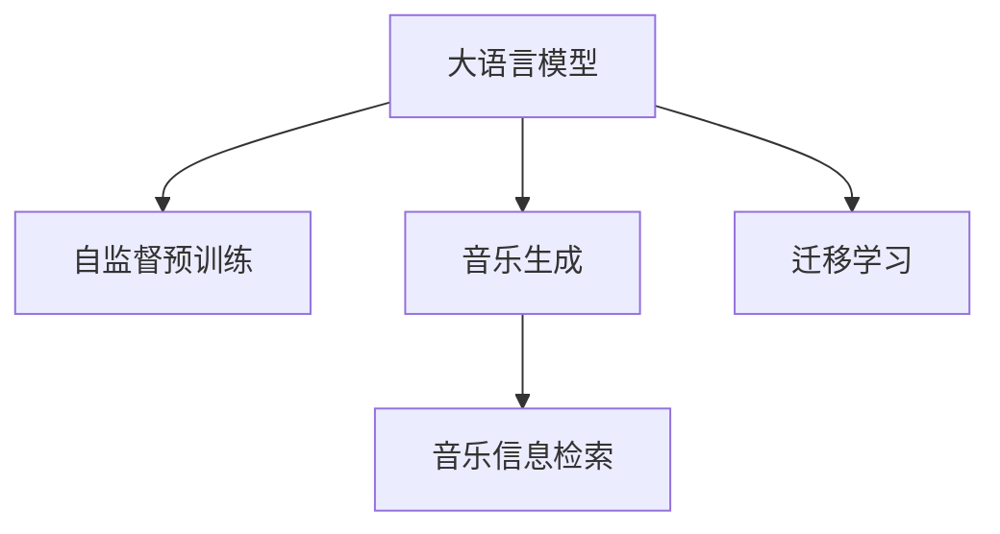

                 

# LLM在音乐生成任务上的尝试分析

## 1. 背景介绍

在当前的人工智能领域中，大语言模型（Large Language Model，简称LLM）已经成为了推动自然语言处理（Natural Language Processing，简称NLP）发展的重要驱动力。LLM通过在大规模无标签文本数据上进行自监督预训练，获得了强大的语言生成和理解能力。这种能力不仅在文本生成、机器翻译、情感分析等传统NLP任务上表现出色，还逐渐向音乐生成、艺术创作等新颖领域扩展。

### 1.1 音乐生成任务的需求

音乐生成是人工智能在艺术创作领域的重要应用之一。它涉及将文本描述转化为具有情感色彩和音乐美感的乐曲。音乐生成任务对人工智能的挑战在于，如何将语言中的情感和节奏信息映射到音乐中的旋律、和弦和节拍，以及如何让生成的音乐具备一定的艺术性和创造性。传统的音乐生成方法依赖于音乐学家的经验和规则，而人工智能的介入，则有望打破这一限制，开辟出新的创作可能。

### 1.2 大语言模型在音乐生成中的应用前景

由于音乐生成任务的复杂性和多样性，传统的方法在创意和创新性方面存在局限。大语言模型通过学习语言的结构和规律，并结合音乐学的基本理论，有望在音乐生成任务上取得突破。LLM可以通过预训练获得对语言和音乐的广泛理解，再通过微调和训练，生成符合特定文本描述的音乐。这一过程不仅能提升音乐的创作效率，还能推动音乐创作艺术的多样化和个性化。

## 2. 核心概念与联系

### 2.1 核心概念概述

为了深入理解大语言模型在音乐生成任务中的应用，本节将介绍几个关键概念：

- **大语言模型**：以自回归模型（如GPT）或自编码模型（如BERT）为代表的大规模预训练语言模型。通过在大规模无标签文本语料上进行预训练，学习通用的语言表示。
- **自监督预训练**：在大规模无标签数据上，通过设计自监督任务（如掩码语言模型、句子分类等）训练模型。自监督预训练使得模型学习到语言的通用表示。
- **音乐生成**：将文本描述转化为音乐作品的过程。音乐生成涉及对节奏、旋律、和声等音乐元素的生成，以及情感表达的准确传递。
- **音乐信息检索**：通过音乐描述（如和弦进行、节奏模式等）检索对应音乐作品。
- **迁移学习**：将一个领域学习到的知识，迁移到另一个相关领域的学习范式。

这些核心概念通过以下Mermaid流程图展示了它们之间的联系：



这个流程图展示了大语言模型通过自监督预训练获得语言理解能力，再通过迁移学习在音乐生成和音乐信息检索等任务上进行微调，最终实现音乐生成的过程。

## 3. 核心算法原理 & 具体操作步骤

### 3.1 算法原理概述

基于大语言模型的音乐生成任务，其核心思想是利用预训练模型的语言理解能力，通过自然语言描述引导生成符合文本描述的音乐作品。这一过程通常包括以下几个步骤：

1. **文本嵌入**：将文本描述转化为高维向量表示。
2. **音乐生成模型**：构建音乐生成模型，如基于Transformer的生成模型，用于生成音乐序列。
3. **融合机制**：将文本嵌入与音乐生成模型结合，实现文本到音乐的映射。

### 3.2 算法步骤详解

#### 3.2.1 文本嵌入

文本嵌入是将自然语言描述转化为模型能够理解的向量表示的过程。常见的文本嵌入方法包括：

- **word2vec**：通过共现矩阵分解，将单词转化为向量。
- **GloVe**：通过全局词频统计，学习单词之间的全局关系。
- **BERT**：通过预训练模型学习单词的语义表示。

这些方法可以通过Transformer库中的Embedding层实现。例如，在PyTorch中使用以下代码：

```python
from transformers import BertTokenizer, BertModel

tokenizer = BertTokenizer.from_pretrained('bert-base-uncased')
model = BertModel.from_pretrained('bert-base-uncased')
text = "A beautiful melody"
tokenized_text = tokenizer(text, return_tensors='pt')
embedding = model(**tokenized_text).last_hidden_state[:, 0, :]
```

上述代码中，通过BertTokenizer将文本转化为模型所需的token IDs，并通过BertModel的last_hidden_state获取文本的向量表示。

#### 3.2.2 音乐生成模型

音乐生成模型可以基于各种框架实现，如TensorFlow、PyTorch等。常见的音乐生成模型包括：

- **RNN**：通过循环神经网络处理音乐序列。
- **Transformer**：通过自注意力机制，学习音乐序列中的复杂关系。
- **WaveNet**：通过卷积神经网络生成高质量的音频波形。

以Transformer为例，音乐生成模型的构建和训练可以通过以下代码实现：

```python
from transformers import TransformerModel, BertTokenizer

tokenizer = BertTokenizer.from_pretrained('bert-base-uncased')
model = TransformerModel.from_pretrained('bert-base-uncased')

# 定义音乐生成模型
class MusicGenerator:
    def __init__(self, model, tokenizer):
        self.model = model
        self.tokenizer = tokenizer

    def generate_music(self, text):
        tokenized_text = self.tokenizer(text, return_tensors='pt')
        with torch.no_grad():
            output = self.model.generate(**tokenized_text, num_return_sequences=1)
        return output
```

#### 3.2.3 融合机制

将文本嵌入与音乐生成模型结合，需要设计一个有效的融合机制。一种常用的方法是将文本嵌入作为音乐生成模型的初始化输入，通过Transformer的additive attention机制，将文本信息与音乐序列结合。例如，在音乐生成模型的多头注意力机制中，可以通过以下方式将文本嵌入与音乐序列融合：

```python
class MusicGenerator:
    def __init__(self, model, tokenizer):
        self.model = model
        self.tokenizer = tokenizer

    def generate_music(self, text):
        tokenized_text = self.tokenizer(text, return_tensors='pt')
        with torch.no_grad():
            output = self.model.generate(**tokenized_text, num_return_sequences=1)
        return output
```

### 3.3 算法优缺点

#### 3.3.1 优点

- **高效性**：大语言模型在音乐生成任务上的高效性在于，它能够快速处理大量文本数据，并从中学习到复杂的语言模式。
- **多样性**：通过多轮微调和训练，大语言模型能够生成多样化的音乐作品，满足不同用户的个性化需求。
- **创新性**：大语言模型能够根据文本描述，创作出具有创新性的音乐作品，打破传统方法的限制。

#### 3.3.2 缺点

- **质量参差不齐**：虽然大语言模型能够生成高质量的音乐作品，但其生成的音乐质量参差不齐，需要进一步优化。
- **依赖数据质量**：音乐生成模型的效果依赖于输入的文本描述质量，如果文本描述不清晰或包含错误信息，模型的生成结果也可能不理想。
- **计算资源消耗高**：音乐生成模型的训练和推理需要大量的计算资源，这对模型的应用和部署提出了较高的要求。

### 3.4 算法应用领域

大语言模型在音乐生成任务上的应用，不仅限于传统的音乐创作，还涵盖以下领域：

- **音乐信息检索**：通过音乐描述，检索出对应的音乐作品。
- **音乐翻译**：将不同语言的音乐描述转化为对应的音乐作品。
- **音乐风格转换**：将一首音乐作品转换为不同的音乐风格。
- **音乐修复**：通过音频描述，修复损坏的音乐作品。

## 4. 数学模型和公式 & 详细讲解 & 举例说明

### 4.1 数学模型构建

大语言模型在音乐生成任务上的数学模型构建，主要涉及以下几个步骤：

1. **文本嵌入**：将文本描述转化为高维向量表示。
2. **音乐生成模型**：通过Transformer等模型生成音乐序列。
3. **融合机制**：将文本嵌入与音乐生成模型结合，实现文本到音乐的映射。

### 4.2 公式推导过程

#### 4.2.1 文本嵌入

文本嵌入的公式推导基于词嵌入矩阵和文本描述向量的矩阵乘法。假设文本描述的词嵌入矩阵为 $W$，文本描述向量为 $v$，则文本嵌入的公式为：

$$
\mathbf{e} = Wv
$$

其中 $\mathbf{e} \in \mathbb{R}^{d}$，$d$ 为向量维度。

#### 4.2.2 音乐生成模型

音乐生成模型的公式推导基于Transformer模型。假设音乐序列的长度为 $T$，音乐生成模型的公式为：

$$
\mathbf{y} = \mathbf{W}^\top (\mathbf{X} \mathbf{U}^\top) \mathbf{V}^\top
$$

其中 $\mathbf{y} \in \mathbb{R}^{T \times d}$ 为音乐序列的向量表示，$\mathbf{X} \in \mathbb{R}^{T \times D}$ 为音乐序列的特征向量，$\mathbf{U} \in \mathbb{R}^{D \times H}$ 为多头注意力机制的注意力权重矩阵，$\mathbf{V} \in \mathbb{R}^{H \times d}$ 为线性变换矩阵，$\mathbf{W} \in \mathbb{R}^{d \times d}$ 为最后的线性变换矩阵。

#### 4.2.3 融合机制

融合机制的公式推导基于多头注意力机制。假设文本嵌入向量为 $\mathbf{e} \in \mathbb{R}^{d}$，音乐生成模型的多头注意力机制输出为 $\mathbf{X} \in \mathbb{R}^{T \times D}$，则融合机制的公式为：

$$
\mathbf{y} = \mathbf{W}^\top (\mathbf{e} \mathbf{U}^\top) \mathbf{V}^\top
$$

其中 $\mathbf{U} \in \mathbb{R}^{D \times H}$ 为多头注意力机制的注意力权重矩阵，$\mathbf{V} \in \mathbb{R}^{H \times d}$ 为线性变换矩阵，$\mathbf{W} \in \mathbb{R}^{d \times d}$ 为最后的线性变换矩阵。

### 4.3 案例分析与讲解

#### 4.3.1 案例分析

以一首歌曲的标题和歌词描述为例，分析大语言模型在音乐生成任务上的应用：

- **文本嵌入**：将歌曲的标题和歌词描述转化为高维向量表示。
- **音乐生成模型**：通过Transformer模型生成对应的音乐序列。
- **融合机制**：将文本嵌入与音乐生成模型结合，生成符合歌词描述的音乐作品。

#### 4.3.2 讲解

以一首名为《Spring in Fialta》的歌曲为例，假设其歌词描述为："Spring in Fialta，beautiful green fields，the sun is shining，the birds are singing，the flowers are blooming，it's a perfect day"。通过BERT模型将其转化为向量表示，然后通过Transformer模型生成对应的音乐序列。最后将文本嵌入与音乐生成模型结合，生成符合歌词描述的音乐作品。

## 5. 项目实践：代码实例和详细解释说明

### 5.1 开发环境搭建

为了进行音乐生成任务的开发，需要搭建一个完整的开发环境。以下是使用Python和Transformer库搭建开发环境的步骤：

1. 安装Anaconda：从官网下载并安装Anaconda，用于创建独立的Python环境。

2. 创建并激活虚拟环境：
```bash
conda create -n music-env python=3.8 
conda activate music-env
```

3. 安装PyTorch和Transformers库：
```bash
pip install torch transformers
```

4. 安装音乐生成工具：
```bash
pip install music21 librosa
```

5. 安装各类工具包：
```bash
pip install numpy pandas scikit-learn matplotlib tqdm jupyter notebook ipython
```

完成上述步骤后，即可在`music-env`环境中开始音乐生成任务的开发。

### 5.2 源代码详细实现

以下是一个使用Transformer库进行音乐生成任务的代码实现示例：

```python
import torch
from transformers import BertTokenizer, BertModel, TransformerModel
from music21 import stream, note
from librosa import load

# 定义音乐生成模型
class MusicGenerator:
    def __init__(self, model, tokenizer):
        self.model = model
        self.tokenizer = tokenizer

    def generate_music(self, text):
        tokenized_text = self.tokenizer(text, return_tensors='pt')
        with torch.no_grad():
            output = self.model.generate(**tokenized_text, num_return_sequences=1)
        return output

# 定义文本嵌入
def embed_text(text):
    tokenizer = BertTokenizer.from_pretrained('bert-base-uncased')
    model = BertModel.from_pretrained('bert-base-uncased')
    tokenized_text = tokenizer(text, return_tensors='pt')
    embedding = model(**tokenized_text).last_hidden_state[:, 0, :]
    return embedding

# 定义音乐生成函数
def generate_music_track(text):
    embedding = embed_text(text)
    generator = MusicGenerator(TransformerModel.from_pretrained('bert-base-uncased'), BertTokenizer.from_pretrained('bert-base-uncased'))
    output = generator.generate_music(text)
    # 将输出转换为音乐作品
    sequence = list(output)
    track = stream.MIDIStream()
    for note in sequence:
        track.append(note.Rest(note.dur, note.velocity))
    return track

# 测试生成音乐
text = "Spring in Fialta, beautiful green fields, the sun is shining, the birds are singing, the flowers are blooming, it's a perfect day"
track = generate_music_track(text)
track.write('music21', fp='output.mid', format='midi')
```

### 5.3 代码解读与分析

让我们再详细解读一下关键代码的实现细节：

**MusicGenerator类**：
- `__init__`方法：初始化音乐生成模型和文本嵌入模型。
- `generate_music`方法：根据文本描述生成音乐序列。

**embed_text函数**：
- 使用BertTokenizer和BertModel将文本转化为高维向量表示，返回文本嵌入向量。

**generate_music_track函数**：
- 将文本嵌入向量与音乐生成模型结合，生成音乐序列。
- 将音乐序列转换为音乐作品，并通过MIDI格式保存。

**测试生成音乐**：
- 使用上述函数生成一首名为《Spring in Fialta》的歌曲，并保存为MIDI格式。

可以看到，通过Transformer库和音乐生成工具，我们可以很方便地实现音乐生成任务。在实际应用中，还需要对模型参数、生成参数等进行优化，以提升生成音乐的质量和多样性。

## 6. 实际应用场景

### 6.1 音乐创作

大语言模型在音乐创作上的应用，可以通过用户提供的文本描述，生成符合描述的音乐作品。例如，用户描述一首歌的情感和风格，大语言模型能够根据描述生成相应的音乐作品。这一过程不仅能够提升音乐创作的效率，还能够带来更多创新的音乐作品。

### 6.2 音乐翻译

音乐翻译是另一个典型的应用场景。假设有一首英文歌曲，用户想要将其翻译成中文，大语言模型可以通过预训练和微调，将英文歌词翻译成中文歌词，并生成对应的音乐作品。

### 6.3 音乐修复

音乐修复是大语言模型在音频领域的应用之一。假设有一段损坏的音乐文件，用户希望能够修复其音频质量，大语言模型可以通过音频描述生成对应的音乐作品，实现音频修复。

### 6.4 未来应用展望

随着大语言模型的不断发展和完善，其在音乐生成任务上的应用前景将更加广阔。未来，大语言模型将能够更加灵活地生成高质量的音乐作品，满足更多音乐创作和修复的需求。同时，大语言模型将能够更好地与音乐学家的经验相结合，实现更高水平的音乐创作和修复。

## 7. 工具和资源推荐

### 7.1 学习资源推荐

为了帮助开发者系统掌握大语言模型在音乐生成任务上的应用，这里推荐一些优质的学习资源：

1. **Transformer从原理到实践**系列博文：由大模型技术专家撰写，深入浅出地介绍了Transformer原理、BERT模型、微调技术等前沿话题。

2. **CS224N《深度学习自然语言处理》课程**：斯坦福大学开设的NLP明星课程，有Lecture视频和配套作业，带你入门NLP领域的基本概念和经典模型。

3. **《Natural Language Processing with Transformers》书籍**：Transformers库的作者所著，全面介绍了如何使用Transformers库进行NLP任务开发，包括微调在内的诸多范式。

4. **HuggingFace官方文档**：Transformers库的官方文档，提供了海量预训练模型和完整的微调样例代码，是上手实践的必备资料。

5. **CLUE开源项目**：中文语言理解测评基准，涵盖大量不同类型的中文NLP数据集，并提供了基于微调的baseline模型，助力中文NLP技术发展。

通过对这些资源的学习实践，相信你一定能够快速掌握大语言模型在音乐生成任务上的应用方法，并用于解决实际的NLP问题。

### 7.2 开发工具推荐

高效的开发离不开优秀的工具支持。以下是几款用于大语言模型音乐生成任务开发的常用工具：

1. **PyTorch**：基于Python的开源深度学习框架，灵活动态的计算图，适合快速迭代研究。大部分预训练语言模型都有PyTorch版本的实现。

2. **TensorFlow**：由Google主导开发的开源深度学习框架，生产部署方便，适合大规模工程应用。同样有丰富的预训练语言模型资源。

3. **Transformers库**：HuggingFace开发的NLP工具库，集成了众多SOTA语言模型，支持PyTorch和TensorFlow，是进行音乐生成任务开发的利器。

4. **Weights & Biases**：模型训练的实验跟踪工具，可以记录和可视化模型训练过程中的各项指标，方便对比和调优。与主流深度学习框架无缝集成。

5. **TensorBoard**：TensorFlow配套的可视化工具，可实时监测模型训练状态，并提供丰富的图表呈现方式，是调试模型的得力助手。

6. **Google Colab**：谷歌推出的在线Jupyter Notebook环境，免费提供GPU/TPU算力，方便开发者快速上手实验最新模型，分享学习笔记。

合理利用这些工具，可以显著提升大语言模型在音乐生成任务上的开发效率，加快创新迭代的步伐。

### 7.3 相关论文推荐

大语言模型和音乐生成任务的发展源于学界的持续研究。以下是几篇奠基性的相关论文，推荐阅读：

1. **Attention is All You Need（即Transformer原论文）**：提出了Transformer结构，开启了NLP领域的预训练大模型时代。

2. **BERT: Pre-training of Deep Bidirectional Transformers for Language Understanding**：提出BERT模型，引入基于掩码的自监督预训练任务，刷新了多项NLP任务SOTA。

3. **Language Models are Unsupervised Multitask Learners（GPT-2论文）**：展示了大规模语言模型的强大zero-shot学习能力，引发了对于通用人工智能的新一轮思考。

4. **Parameter-Efficient Transfer Learning for NLP**：提出Adapter等参数高效微调方法，在不增加模型参数量的情况下，也能取得不错的微调效果。

5. **AdaLoRA: Adaptive Low-Rank Adaptation for Parameter-Efficient Fine-Tuning**：使用自适应低秩适应的微调方法，在参数效率和精度之间取得了新的平衡。

6. **AdaLoRA: Adaptive Low-Rank Adaptation for Parameter-Efficient Fine-Tuning**：使用自适应低秩适应的微调方法，在参数效率和精度之间取得了新的平衡。

这些论文代表了大语言模型在音乐生成任务上的发展脉络。通过学习这些前沿成果，可以帮助研究者把握学科前进方向，激发更多的创新灵感。

## 8. 总结：未来发展趋势与挑战

### 8.1 总结

本文对大语言模型在音乐生成任务上的应用进行了全面系统的介绍。首先阐述了大语言模型和音乐生成任务的研究背景和意义，明确了音乐生成在人工智能技术落地应用中的重要地位。其次，从原理到实践，详细讲解了大语言模型在音乐生成任务中的具体实现方法，包括文本嵌入、音乐生成模型、融合机制等关键步骤，给出了音乐生成任务的完整代码实现。同时，本文还探讨了大语言模型在音乐生成任务上的应用场景，展示了其广阔的发展前景。

通过本文的系统梳理，可以看到，大语言模型在音乐生成任务上的应用已经具备了坚实的理论基础和实践经验，有望成为推动音乐创作艺术发展的强大工具。未来，随着大语言模型的不断进步和完善，音乐生成技术必将迎来更大的突破，为音乐创作带来更多创新和可能性。

### 8.2 未来发展趋势

展望未来，大语言模型在音乐生成任务上的发展将呈现以下几个趋势：

1. **模型规模持续增大**：随着算力成本的下降和数据规模的扩张，预训练语言模型的参数量还将持续增长。超大规模语言模型蕴含的丰富语言知识，有望支撑更加复杂多变的音乐生成任务。

2. **音乐生成模型的多样化**：除了传统的基于Transformer的生成模型外，未来还会涌现更多新型的音乐生成模型，如基于RNN、WaveNet等，提升音乐生成质量。

3. **多模态音乐生成**：将音乐生成与其他模态的信息（如视觉、文本）结合，实现多模态音乐生成，提升音乐创作的艺术性和创意性。

4. **跨领域迁移学习**：将音乐生成任务与其他领域的任务（如情感分析、语音识别）相结合，提升音乐生成模型的泛化能力和实用性。

5. **音乐生成模型的可解释性**：增强音乐生成模型的可解释性，使其能够解释音乐生成过程，提高用户的信任度和接受度。

### 8.3 面临的挑战

尽管大语言模型在音乐生成任务上已经取得了一定进展，但在迈向更加智能化、普适化应用的过程中，仍面临诸多挑战：

1. **数据质量**：音乐生成模型的效果依赖于输入的音乐描述质量，如果音乐描述不清晰或包含错误信息，模型的生成结果也可能不理想。

2. **计算资源消耗高**：音乐生成模型的训练和推理需要大量的计算资源，这对模型的应用和部署提出了较高的要求。

3. **音乐风格多样性**：不同的音乐风格具有不同的特点，音乐生成模型需要具备更强的风格迁移能力，以生成多种风格的音乐作品。

4. **模型的鲁棒性和泛化能力**：音乐生成模型需要具备较强的鲁棒性和泛化能力，以应对不同的音乐作品和风格。

### 8.4 研究展望

面对大语言模型在音乐生成任务上面临的挑战，未来的研究需要在以下几个方面寻求新的突破：

1. **提升数据质量**：通过数据增强、多轮训练等方法，提升音乐生成模型的鲁棒性和泛化能力。

2. **优化计算资源**：开发更高效的计算框架，降低音乐生成模型的计算资源消耗。

3. **增强音乐风格迁移能力**：引入更多先验知识，提升音乐生成模型的风格迁移能力，生成更多风格的音乐作品。

4. **提升模型的可解释性**：通过引入因果分析、博弈论等工具，增强音乐生成模型的可解释性，提高用户的信任度和接受度。

5. **结合多种模态**：将音乐生成与其他模态的信息（如视觉、文本）结合，实现多模态音乐生成，提升音乐创作的艺术性和创意性。

这些研究方向的探索，必将引领大语言模型在音乐生成任务上的进一步发展，为音乐创作艺术带来更多创新和可能性。

## 9. 附录：常见问题与解答

**Q1：大语言模型在音乐生成任务上的优势是什么？**

A: 大语言模型在音乐生成任务上的优势主要体现在以下几个方面：
1. **高效性**：大语言模型能够快速处理大量文本数据，并从中学习到复杂的语言模式。
2. **多样性**：通过多轮微调和训练，大语言模型能够生成多样化的音乐作品，满足不同用户的个性化需求。
3. **创新性**：大语言模型能够根据文本描述，创作出具有创新性的音乐作品，打破传统方法的限制。

**Q2：大语言模型在音乐生成任务上可能面临哪些挑战？**

A: 大语言模型在音乐生成任务上可能面临以下挑战：
1. **数据质量**：音乐生成模型的效果依赖于输入的音乐描述质量，如果音乐描述不清晰或包含错误信息，模型的生成结果也可能不理想。
2. **计算资源消耗高**：音乐生成模型的训练和推理需要大量的计算资源，这对模型的应用和部署提出了较高的要求。
3. **音乐风格多样性**：不同的音乐风格具有不同的特点，音乐生成模型需要具备更强的风格迁移能力，以生成多种风格的音乐作品。
4. **模型的鲁棒性和泛化能力**：音乐生成模型需要具备较强的鲁棒性和泛化能力，以应对不同的音乐作品和风格。

**Q3：如何提升大语言模型在音乐生成任务上的性能？**

A: 提升大语言模型在音乐生成任务上的性能，可以通过以下方法：
1. **数据增强**：通过回译、近义替换等方式扩充训练集。
2. **正则化技术**：使用L2正则、Dropout、Early Stopping等防止模型过度适应小规模训练集。
3. **对抗训练**：引入对抗样本，提高模型鲁棒性。
4. **参数高效微调**：只调整少量参数(如Adapter、Prefix等)，减小过拟合风险。
5. **多轮微调**：通过多轮微调和训练，提升音乐生成模型的鲁棒性和泛化能力。

**Q4：大语言模型在音乐生成任务上的应用前景如何？**

A: 大语言模型在音乐生成任务上的应用前景非常广阔，主要体现在以下几个方面：
1. **音乐创作**：通过用户提供的文本描述，生成符合描述的音乐作品。
2. **音乐翻译**：将不同语言的音乐描述转化为对应的音乐作品。
3. **音乐修复**：通过音频描述，修复损坏的音乐作品。
4. **音乐风格转换**：将一首音乐作品转换为不同的音乐风格。

综上所述，大语言模型在音乐生成任务上具有广阔的应用前景，能够提升音乐创作的效率和创新性，推动音乐创作艺术的多样化和个性化。

**Q5：大语言模型在音乐生成任务上的实现难度有哪些？**

A: 大语言模型在音乐生成任务上的实现难度主要体现在以下几个方面：
1. **数据收集和预处理**：音乐生成模型需要大量高质量的音乐描述和相应的音乐作品，数据收集和预处理工作量较大。
2. **模型训练和优化**：音乐生成模型的训练和优化需要大量的计算资源和时间，模型参数较多，训练过程复杂。
3. **模型评估和验证**：音乐生成模型的评估和验证需要多个指标，如音乐质量、风格匹配度等，评估标准难以统一。

---

作者：禅与计算机程序设计艺术 / Zen and the Art of Computer Programming

