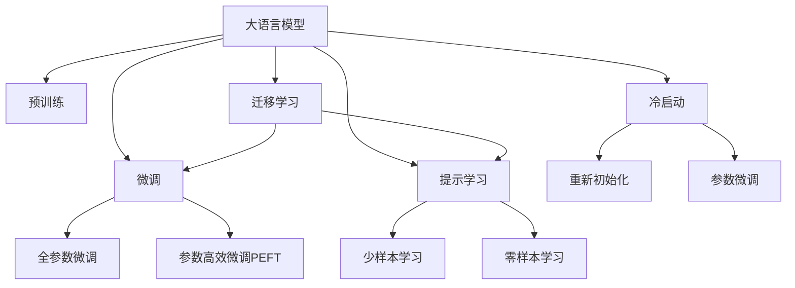
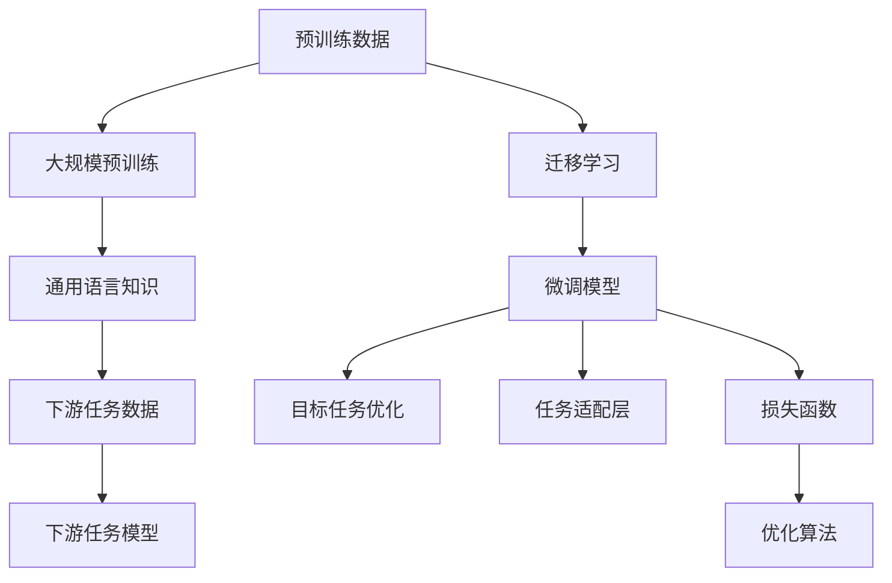

                 

# LLM处理冷启动问题的能力

在现代大语言模型（LLM）的日常应用中，冷启动（cold start）问题是一个常常遇到且颇具挑战性的难题。冷启动问题指的是在面对全新用户或数据时，系统无法利用历史知识，而是需要从零开始学习或适应的过程。本文将系统地探讨LLM在处理冷启动问题方面的能力，包括其核心概念、算法原理、具体操作步骤，并结合数学模型、实际项目案例和未来应用展望，提供全面的技术指导。

## 1. 背景介绍

### 1.1 问题由来
在当今数字化时代，大语言模型在各个领域的应用日趋广泛，从自然语言处理（NLP）到金融分析、法律咨询等几乎无所不包。然而，任何新应用或新用户的出现都可能引发冷启动问题。传统的机器学习模型通常依赖于大量的历史数据进行训练，但在大规模预训练的LLM中，这个问题尤其突出。

### 1.2 问题核心关键点
LLM的冷启动问题主要表现在两个方面：
- 新数据或新用户的数据域往往与预训练数据不同，模型无法直接应用预训练知识。
- 预训练模型参数过多，冷启动阶段需要重新训练，成本和时间投入较大。

解决冷启动问题，需要探索有效的迁移学习方法，以利用已有知识同时适应新数据或新用户。本文聚焦于如何在大语言模型中实现这一点。

### 1.3 问题研究意义
正确处理冷启动问题，对于提升LLM在不同场景下的应用效果、降低开发成本、加速模型部署具有重要意义：
- 增强LLM在不同领域和数据集上的适应能力。
- 降低新应用和新用户接入的门槛，使LLM技术更容易落地。
- 通过迁移学习的方式，减少从头训练模型的时间和计算资源需求。

## 2. 核心概念与联系

### 2.1 核心概念概述

要全面理解LLM在处理冷启动问题上的能力，首先需要梳理以下核心概念：

- **大语言模型（LLM）**：以Transformer为基础，通过大规模无标签数据预训练生成的强大自然语言处理模型，具备理解语言语境和生成自然语言的能力。
- **冷启动问题**：模型在面对全新数据或新用户时，无法利用已有知识，需要从头开始学习的挑战。
- **迁移学习**：利用已有知识来解决新问题，通过将模型在预训练任务上的学习迁移到新任务上，提高模型在新数据上的表现。
- **微调（Fine-Tuning）**：在预训练模型基础上，使用少量标注数据对模型进行有监督训练，优化其在新任务上的表现。

这些概念之间的逻辑关系通过以下Mermaid流程图进行展示：



### 2.2 核心概念原理和架构的 Mermaid 流程图



## 3. 核心算法原理 & 具体操作步骤
### 3.1 算法原理概述

在大语言模型处理冷启动问题时，主要依赖于迁移学习和微调两种策略。

**迁移学习**的基本思想是，在预训练模型上新增一个或多个下游任务，利用已有知识提高模型在新任务上的表现。在预训练阶段，模型通过大规模无标签数据学习通用的语言表示；在微调阶段，模型通过少量有标签数据进行有监督训练，适配下游任务。

**微调**是迁移学习的一种具体形式，通过在预训练模型上附加一个新的任务，有监督地训练模型以适应新数据或新用户的特征。微调通常涉及到模型的部分或全部参数更新，以确保模型能够适应新的数据分布。

### 3.2 算法步骤详解

基于LLM的冷启动问题处理通常包括以下步骤：

**Step 1: 准备预训练模型和数据集**
- 选择合适的预训练语言模型，如GPT、BERT等。
- 收集并准备下游任务的数据集，划分为训练集、验证集和测试集。

**Step 2: 添加任务适配层**
- 在预训练模型的基础上添加新的任务适配层，以适应新任务的输出需求。
- 定义任务相关的输出层和损失函数。

**Step 3: 设置微调超参数**
- 选择合适的优化器及其参数，如AdamW、SGD等，设置学习率、批大小、迭代轮数等。
- 设置正则化技术及强度，如L2正则、Dropout等。

**Step 4: 执行梯度训练**
- 将训练集数据分批次输入模型，前向传播计算损失函数。
- 反向传播计算参数梯度，根据设定的优化算法和学习率更新模型参数。
- 周期性在验证集上评估模型性能，根据性能指标决定是否触发Early Stopping。
- 重复上述步骤直到满足预设的迭代轮数或Early Stopping条件。

**Step 5: 测试和部署**
- 在测试集上评估微调后模型，对比微调前后的精度提升。
- 使用微调后的模型对新数据或新用户进行推理预测，集成到实际的应用系统中。

### 3.3 算法优缺点

基于LLM的冷启动处理方法具有以下优点：
- 快速适应新数据或新用户，无需从头训练。
- 能够利用预训练模型的通用知识，提高新任务上的性能。
- 适用性广，可以应用于各种NLP任务和应用场景。

然而，该方法也存在一定的局限性：
- 对标注数据的质量和数量有较高要求。
- 可能会受到预训练模型的固有偏见和有害信息影响。
- 部分预训练参数冻结，可能导致模型难以完全适应新任务。

### 3.4 算法应用领域

LLM的冷启动处理方法广泛应用于以下领域：

- **自然语言处理**：在文本分类、命名实体识别、关系抽取、问答系统、机器翻译等任务中，通过微调快速适配新任务。
- **智能客服**：在用户接入时，通过微调使模型快速适应新用户的交流风格。
- **医疗咨询**：在面对新病人时，通过微调使模型快速学习病史特征。
- **金融分析**：在面对新金融产品时，通过微调使模型快速适应新的市场数据。
- **法律咨询**：在面对新法律案例时，通过微调使模型快速适应新的法律规则。

## 4. 数学模型和公式 & 详细讲解 & 举例说明

### 4.1 数学模型构建

在处理冷启动问题时，可以采用监督学习的方法，构建如下数学模型：

假设预训练模型为 $M_{\theta}$，其中 $\theta$ 为预训练得到的模型参数。下游任务的标注数据集为 $D=\{(x_i,y_i)\}_{i=1}^N$，其中 $x_i$ 为输入，$y_i$ 为标签。

定义模型 $M_{\theta}$ 在输入 $x$ 上的损失函数为 $\ell(M_{\theta}(x),y)$，则经验风险为：

$$
\mathcal{L}(\theta) = \frac{1}{N}\sum_{i=1}^N \ell(M_{\theta}(x_i),y_i)
$$

微调的目标是最小化经验风险，即找到最优参数：

$$
\theta^* = \mathop{\arg\min}_{\theta} \mathcal{L}(\theta)
$$

使用梯度下降等优化算法，微调过程不断更新模型参数 $\theta$，最小化损失函数 $\mathcal{L}$，使得模型输出逼近真实标签。

### 4.2 公式推导过程

以二分类任务为例，假设模型 $M_{\theta}$ 在输入 $x$ 上的输出为 $\hat{y}=M_{\theta}(x) \in [0,1]$，表示样本属于正类的概率。真实标签 $y \in \{0,1\}$。

二分类交叉熵损失函数定义为：

$$
\ell(M_{\theta}(x),y) = -[y\log \hat{y} + (1-y)\log(1-\hat{y})]
$$

则经验风险为：

$$
\mathcal{L}(\theta) = -\frac{1}{N}\sum_{i=1}^N [y_i\log M_{\theta}(x_i)+(1-y_i)\log(1-M_{\theta}(x_i))]
$$

损失函数对参数 $\theta_k$ 的梯度为：

$$
\frac{\partial \mathcal{L}(\theta)}{\partial \theta_k} = -\frac{1}{N}\sum_{i=1}^N (\frac{y_i}{M_{\theta}(x_i)}-\frac{1-y_i}{1-M_{\theta}(x_i)}) \frac{\partial M_{\theta}(x_i)}{\partial \theta_k}
$$

其中 $\frac{\partial M_{\theta}(x_i)}{\partial \theta_k}$ 可进一步递归展开，利用自动微分技术完成计算。

### 4.3 案例分析与讲解

考虑一个特定的例子：在情感分析任务中，已知一个通用的BERT预训练模型，需要处理新的数据集。

**Step 1: 准备预训练模型和数据集**

选择BERT模型作为预训练模型，并收集包含情感标签的文本数据集。

**Step 2: 添加任务适配层**

在BERT模型基础上添加线性分类层和交叉熵损失函数。

**Step 3: 设置微调超参数**

使用AdamW优化器，学习率为 $2e-5$，批大小为 $16$，迭代轮数为 $5$。

**Step 4: 执行梯度训练**

将训练集数据分批次输入模型，前向传播计算损失函数。反向传播计算参数梯度，使用AdamW优化器更新模型参数。

**Step 5: 测试和部署**

在测试集上评估微调后模型，对比微调前后的精度提升，并进行实际部署。

## 5. 项目实践：代码实例和详细解释说明

### 5.1 开发环境搭建

在进行微调实践前，需要准备好开发环境。以下是使用Python进行PyTorch开发的环境配置流程：

1. 安装Anaconda：从官网下载并安装Anaconda，用于创建独立的Python环境。

2. 创建并激活虚拟环境：
```bash
conda create -n pytorch-env python=3.8 
conda activate pytorch-env
```

3. 安装PyTorch：根据CUDA版本，从官网获取对应的安装命令。例如：
```bash
conda install pytorch torchvision torchaudio cudatoolkit=11.1 -c pytorch -c conda-forge
```

4. 安装Transformers库：
```bash
pip install transformers
```

5. 安装各类工具包：
```bash
pip install numpy pandas scikit-learn matplotlib tqdm jupyter notebook ipython
```

完成上述步骤后，即可在`pytorch-env`环境中开始微调实践。

### 5.2 源代码详细实现

这里我们以情感分析任务为例，给出使用Transformers库对BERT模型进行微调的PyTorch代码实现。

```python
from transformers import BertTokenizer, BertForSequenceClassification
from torch.utils.data import Dataset
from torch.utils.data import DataLoader
from torch.nn import CrossEntropyLoss
from torch.optim import AdamW
import torch

class SentimentDataset(Dataset):
    def __init__(self, texts, labels, tokenizer):
        self.texts = texts
        self.labels = labels
        self.tokenizer = tokenizer

    def __len__(self):
        return len(self.texts)

    def __getitem__(self, item):
        text = self.texts[item]
        label = self.labels[item]

        encoding = self.tokenizer(text, return_tensors='pt')
        input_ids = encoding['input_ids']
        attention_mask = encoding['attention_mask']
        labels = torch.tensor(label, dtype=torch.long)

        return {'input_ids': input_ids, 
                'attention_mask': attention_mask,
                'labels': labels}

# 标签与id的映射
label2id = {'positive': 1, 'negative': 0}
id2label = {v: k for k, v in label2id.items()}

# 创建dataset
tokenizer = BertTokenizer.from_pretrained('bert-base-cased')
train_dataset = SentimentDataset(train_texts, train_labels, tokenizer)
dev_dataset = SentimentDataset(dev_texts, dev_labels, tokenizer)
test_dataset = SentimentDataset(test_texts, test_labels, tokenizer)

# 模型初始化
model = BertForSequenceClassification.from_pretrained('bert-base-cased', num_labels=len(label2id))

# 定义优化器、损失函数和评价指标
optimizer = AdamW(model.parameters(), lr=2e-5)
loss_fn = CrossEntropyLoss()
accuracy = 0.0

# 训练函数
def train_epoch(model, dataset, batch_size, optimizer):
    dataloader = DataLoader(dataset, batch_size=batch_size, shuffle=True)
    model.train()
    epoch_loss = 0
    for batch in dataloader:
        input_ids = batch['input_ids'].to(device)
        attention_mask = batch['attention_mask'].to(device)
        labels = batch['labels'].to(device)
        model.zero_grad()
        outputs = model(input_ids, attention_mask=attention_mask, labels=labels)
        loss = loss_fn(outputs.logits, labels)
        epoch_loss += loss.item()
        loss.backward()
        optimizer.step()
        epoch_loss /= len(dataloader)
        accuracy = accuracy + torch.sum(torch.argmax(outputs.logits, dim=1) == labels).item() / len(dataset)
    return epoch_loss, accuracy

# 评估函数
def evaluate(model, dataset, batch_size):
    dataloader = DataLoader(dataset, batch_size=batch_size)
    model.eval()
    preds, labels = [], []
    with torch.no_grad():
        for batch in dataloader:
            input_ids = batch['input_ids'].to(device)
            attention_mask = batch['attention_mask'].to(device)
            labels = batch['labels']
            outputs = model(input_ids, attention_mask=attention_mask)
            batch_preds = torch.argmax(outputs.logits, dim=1).to('cpu').tolist()
            batch_labels = labels.to('cpu').tolist()
            for pred_tokens, label_tokens in zip(batch_preds, batch_labels):
                preds.append(pred_tokens[:len(label_tokens)])
                labels.append(label_tokens)

    accuracy = sum([pred == label for pred, label in zip(preds, labels)]) / len(labels)
    return accuracy

# 训练循环
epochs = 5
batch_size = 16

for epoch in range(epochs):
    epoch_loss, accuracy = train_epoch(model, train_dataset, batch_size, optimizer)
    print(f"Epoch {epoch+1}, train loss: {epoch_loss:.3f}, train accuracy: {accuracy:.3f}")
    
    print(f"Epoch {epoch+1}, dev results:")
    dev_accuracy = evaluate(model, dev_dataset, batch_size)
    print(f"Dev accuracy: {dev_accuracy:.3f}")
    
print("Test results:")
test_accuracy = evaluate(model, test_dataset, batch_size)
print(f"Test accuracy: {test_accuracy:.3f}")
```

这段代码涵盖了预训练模型的加载、微调、评估和测试过程。通过逐步迭代训练，模型最终能够在新的情感分析任务上获得较高的精度。

### 5.3 代码解读与分析

让我们再详细解读一下关键代码的实现细节：

**SentimentDataset类**：
- `__init__`方法：初始化文本、标签、分词器等关键组件。
- `__len__`方法：返回数据集的样本数量。
- `__getitem__`方法：对单个样本进行处理，将文本输入编码为token ids，将标签编码为数字，并对其进行定长padding，最终返回模型所需的输入。

**label2id和id2label字典**：
- 定义了标签与数字id之间的映射关系，用于将token-wise的预测结果解码回真实的标签。

**训练和评估函数**：
- 使用PyTorch的DataLoader对数据集进行批次化加载，供模型训练和推理使用。
- 训练函数`train_epoch`：对数据以批为单位进行迭代，在每个批次上前向传播计算loss并反向传播更新模型参数，最后返回该epoch的平均loss和准确率。
- 评估函数`evaluate`：与训练类似，不同点在于不更新模型参数，并在每个batch结束后将预测和标签结果存储下来，最后使用准确率来评估模型性能。

**训练循环**：
- 定义总的epoch数和batch size，开始循环迭代
- 每个epoch内，先在训练集上训练，输出平均loss和准确率
- 在验证集上评估，输出验证集准确率
- 所有epoch结束后，在测试集上评估，给出最终测试准确率

可以看到，PyTorch配合Transformers库使得BERT微调的代码实现变得简洁高效。开发者可以将更多精力放在数据处理、模型改进等高层逻辑上，而不必过多关注底层的实现细节。

当然，工业级的系统实现还需考虑更多因素，如模型的保存和部署、超参数的自动搜索、更灵活的任务适配层等。但核心的微调范式基本与此类似。

## 6. 实际应用场景
### 6.1 智能客服系统

基于大语言模型微调技术的智能客服系统，可以有效地应对新用户的咨询。传统客服往往需要配备大量人力，高峰期响应缓慢，且一致性和专业性难以保证。而使用微调后的对话模型，可以7x24小时不间断服务，快速响应客户咨询，用自然流畅的语言解答各类常见问题。

在技术实现上，可以收集企业内部的历史客服对话记录，将问题和最佳答复构建成监督数据，在此基础上对预训练对话模型进行微调。微调后的对话模型能够自动理解用户意图，匹配最合适的答案模板进行回复。对于客户提出的新问题，还可以接入检索系统实时搜索相关内容，动态组织生成回答。如此构建的智能客服系统，能大幅提升客户咨询体验和问题解决效率。

### 6.2 金融舆情监测

金融机构需要实时监测市场舆论动向，以便及时应对负面信息传播，规避金融风险。传统的人工监测方式成本高、效率低，难以应对网络时代海量信息爆发的挑战。基于大语言模型微调的文本分类和情感分析技术，为金融舆情监测提供了新的解决方案。

具体而言，可以收集金融领域相关的新闻、报道、评论等文本数据，并对其进行主题标注和情感标注。在此基础上对预训练语言模型进行微调，使其能够自动判断文本属于何种主题，情感倾向是正面、中性还是负面。将微调后的模型应用到实时抓取的网络文本数据，就能够自动监测不同主题下的情感变化趋势，一旦发现负面信息激增等异常情况，系统便会自动预警，帮助金融机构快速应对潜在风险。

### 6.3 个性化推荐系统

当前的推荐系统往往只依赖用户的历史行为数据进行物品推荐，无法深入理解用户的真实兴趣偏好。基于大语言模型微调技术，个性化推荐系统可以更好地挖掘用户行为背后的语义信息，从而提供更精准、多样的推荐内容。

在实践中，可以收集用户浏览、点击、评论、分享等行为数据，提取和用户交互的物品标题、描述、标签等文本内容。将文本内容作为模型输入，用户的后续行为（如是否点击、购买等）作为监督信号，在此基础上微调预训练语言模型。微调后的模型能够从文本内容中准确把握用户的兴趣点。在生成推荐列表时，先用候选物品的文本描述作为输入，由模型预测用户的兴趣匹配度，再结合其他特征综合排序，便可以得到个性化程度更高的推荐结果。

### 6.4 未来应用展望

随着大语言模型微调技术的发展，未来将会有更多领域的应用场景。

- **智慧医疗**：基于微调的医疗问答、病历分析、药物研发等应用将提升医疗服务的智能化水平，辅助医生诊疗，加速新药开发进程。
- **智能教育**：微调技术可应用于作业批改、学情分析、知识推荐等方面，因材施教，促进教育公平，提高教学质量。
- **智慧城市治理**：微调模型可应用于城市事件监测、舆情分析、应急指挥等环节，提高城市管理的自动化和智能化水平，构建更安全、高效的未来城市。

此外，在企业生产、社会治理、文娱传媒等众多领域，基于大模型微调的人工智能应用也将不断涌现，为NLP技术带来新的突破。相信随着预训练模型和微调方法的持续演进，NLP技术必将在更广阔的应用领域大放异彩，深刻影响人类的生产生活方式。

## 7. 工具和资源推荐
### 7.1 学习资源推荐

为了帮助开发者系统掌握大语言模型微调的理论基础和实践技巧，这里推荐一些优质的学习资源：

1. 《Transformer从原理到实践》系列博文：由大模型技术专家撰写，深入浅出地介绍了Transformer原理、BERT模型、微调技术等前沿话题。

2. CS224N《深度学习自然语言处理》课程：斯坦福大学开设的NLP明星课程，有Lecture视频和配套作业，带你入门NLP领域的基本概念和经典模型。

3. 《Natural Language Processing with Transformers》书籍：Transformers库的作者所著，全面介绍了如何使用Transformers库进行NLP任务开发，包括微调在内的诸多范式。

4. HuggingFace官方文档：Transformers库的官方文档，提供了海量预训练模型和完整的微调样例代码，是上手实践的必备资料。

5. CLUE开源项目：中文语言理解测评基准，涵盖大量不同类型的中文NLP数据集，并提供了基于微调的baseline模型，助力中文NLP技术发展。

通过对这些资源的学习实践，相信你一定能够快速掌握大语言模型微调的精髓，并用于解决实际的NLP问题。
###  7.2 开发工具推荐

高效的开发离不开优秀的工具支持。以下是几款用于大语言模型微调开发的常用工具：

1. PyTorch：基于Python的开源深度学习框架，灵活动态的计算图，适合快速迭代研究。大部分预训练语言模型都有PyTorch版本的实现。

2. TensorFlow：由Google主导开发的开源深度学习框架，生产部署方便，适合大规模工程应用。同样有丰富的预训练语言模型资源。

3. Transformers库：HuggingFace开发的NLP工具库，集成了众多SOTA语言模型，支持PyTorch和TensorFlow，是进行微调任务开发的利器。

4. Weights & Biases：模型训练的实验跟踪工具，可以记录和可视化模型训练过程中的各项指标，方便对比和调优。与主流深度学习框架无缝集成。

5. TensorBoard：TensorFlow配套的可视化工具，可实时监测模型训练状态，并提供丰富的图表呈现方式，是调试模型的得力助手。

6. Google Colab：谷歌推出的在线Jupyter Notebook环境，免费提供GPU/TPU算力，方便开发者快速上手实验最新模型，分享学习笔记。

合理利用这些工具，可以显著提升大语言模型微调任务的开发效率，加快创新迭代的步伐。

### 7.3 相关论文推荐

大语言模型和微调技术的发展源于学界的持续研究。以下是几篇奠基性的相关论文，推荐阅读：

1. Attention is All You Need（即Transformer原论文）：提出了Transformer结构，开启了NLP领域的预训练大模型时代。

2. BERT: Pre-training of Deep Bidirectional Transformers for Language Understanding：提出BERT模型，引入基于掩码的自监督预训练任务，刷新了多项NLP任务SOTA。

3. Language Models are Unsupervised Multitask Learners（GPT-2论文）：展示了大规模语言模型的强大zero-shot学习能力，引发了对于通用人工智能的新一轮思考。

4. Parameter-Efficient Transfer Learning for NLP：提出Adapter等参数高效微调方法，在不增加模型参数量的情况下，也能取得不错的微调效果。

5. Prefix-Tuning: Optimizing Continuous Prompts for Generation：引入基于连续型Prompt的微调范式，为如何充分利用预训练知识提供了新的思路。

6. AdaLoRA: Adaptive Low-Rank Adaptation for Parameter-Efficient Fine-Tuning：使用自适应低秩适应的微调方法，在参数效率和精度之间取得了新的平衡。

这些论文代表了大语言模型微调技术的发展脉络。通过学习这些前沿成果，可以帮助研究者把握学科前进方向，激发更多的创新灵感。

## 8. 总结：未来发展趋势与挑战

### 8.1 总结

本文对基于LLM的冷启动问题处理进行了全面系统的介绍。首先阐述了LLM在处理冷启动问题上的基本原理和具体步骤，系统介绍了其核心概念和关键技术。其次，通过数学模型的详细构建和公式推导，加深了对LLM冷启动问题处理的理解。再次，结合项目实践，提供了完整的代码实现和详细的解释说明。最后，探讨了LLM冷启动问题处理的实际应用场景，展望了未来发展趋势。

通过本文的系统梳理，可以看到，基于LLM的冷启动处理方法在大规模NLP任务中的应用前景广阔，能够有效提升模型在未知领域或数据上的表现，具有重要的理论价值和实际意义。

### 8.2 未来发展趋势

展望未来，大语言模型在处理冷启动问题上可能呈现以下发展趋势：

1. **模型规模和训练数据的不断增长**：随着算力的提高和数据量的积累，预训练语言模型的规模将进一步扩大，能够在更广泛的数据域和任务上实现有效的迁移学习。
2. **自监督和半监督学习的应用**：在数据不足的情况下，通过自监督和半监督学习方法，利用大量无标签数据进行预训练，减少对标注数据的依赖。
3. **参数高效的微调技术**：开发更加参数高效的微调方法，在固定大部分预训练参数的情况下，只更新极少量的任务相关参数，提高微调效率。
4. **跨模态学习和融合**：将视觉、语音等多模态数据与文本数据结合，实现多模态信息融合，提升模型的泛化能力。
5. **知识图谱和规则的整合**：将结构化的知识图谱和规则与神经网络模型结合，提升模型的推理能力和准确性。
6. **主动学习和动态适应的微调**：通过主动学习方法和动态适应机制，使模型能够主动学习新知识，适应数据分布的变化。

这些趋势将进一步推动LLM在处理冷启动问题上的能力提升，使其能够更好地应用于各类新场景和任务。

### 8.3 面临的挑战

尽管大语言模型在处理冷启动问题上已经取得了显著进展，但仍面临诸多挑战：

1. **数据质量和数量的限制**：高质量标注数据获取成本高，新领域数据的获取难度大，限制了LLM在未知领域的泛化能力。
2. **模型的可解释性和透明性**：现有模型往往是"黑盒"系统，难以解释其内部工作机制和决策逻辑，对高风险应用带来挑战。
3. **模型的稳定性和鲁棒性**：在面对新数据和新任务时，模型容易发生性能波动，需要进一步提高模型的稳定性和鲁棒性。
4. **知识整合和扩展的难度**：将外部知识与模型结合需要大量的工程和算法支持，知识整合和扩展的难度较大。
5. **计算资源的限制**：大规模模型训练和推理需要高性能计算资源，如何优化资源使用是一个重要问题。

这些挑战需要研究者持续关注并寻找解决方案，以推动LLM在更广泛的领域和应用中发挥更大的作用。

### 8.4 研究展望

面向未来，大语言模型在处理冷启动问题上的研究展望包括：

1. **多模态和跨领域迁移学习**：开发能够跨领域、跨模态迁移学习的算法，提升模型在多变环境中的适应能力。
2. **主动学习和持续学习**：利用主动学习方法和持续学习机制，使模型能够不断学习新知识，适应数据分布的变化。
3. **知识的可解释性和透明性**：开发可解释性更强的模型和解释工具，使模型的工作机制和决策逻辑更透明，提升模型的可信度。
4. **跨领域知识的整合**：将符号化的知识与神经网络模型结合，提升模型的知识整合能力和推理能力。
5. **分布式和云环境下的训练和推理**：在分布式和云环境中进行高效训练和推理，提升模型的部署效率和资源利用率。

这些研究方向将推动LLM在处理冷启动问题上的能力提升，使其能够更好地应用于各类新场景和任务，推动人工智能技术的进一步发展。

## 9. 附录：常见问题与解答

**Q1：LLM在处理冷启动问题时，如何选择合适的预训练模型？**

A: 选择合适的预训练模型应考虑以下因素：
1. 数据域的相似性：选择与目标任务数据域相似的预训练模型，以提高迁移学习的效果。
2. 任务相关性：选择与目标任务相关性高的预训练模型，以更好地适应新任务。
3. 模型规模：选择规模适中的预训练模型，以平衡计算资源和模型性能。

**Q2：在微调过程中，如何避免过拟合？**

A: 避免过拟合的方法包括：
1. 数据增强：通过回译、近义替换等方式扩充训练集。
2. 正则化：使用L2正则、Dropout等方法。
3. 早停机制：在验证集性能不再提升时停止训练。
4. 参数高效微调：只更新少量任务相关参数。

**Q3：在微调过程中，如何评估模型性能？**

A: 评估模型性能的方法包括：
1. 准确率：计算模型在测试集上的准确率。
2. F1-score：计算模型在测试集上的精确率和召回率的调和平均值。
3. AUC-ROC曲线：绘制模型在不同阈值下的真阳性率与假阳性率的曲线。

**Q4：微调过程中，如何优化超参数？**

A: 优化超参数的方法包括：
1. 网格搜索：在预设的超参数范围内搜索最优组合。
2. 随机搜索：通过随机采样的方式搜索超参数空间。
3. 贝叶斯优化：利用贝叶斯方法对超参数进行优化。

这些超参数包括学习率、批大小、迭代轮数、正则化系数等，需要根据具体任务进行调优。

**Q5：LLM在处理冷启动问题时，如何应用对抗样本？**

A: 应用对抗样本的方法包括：
1. 生成对抗样本：使用对抗训练生成对模型有害的输入样本。
2. 对抗训练：在训练过程中加入对抗样本，提高模型的鲁棒性。
3. 对抗测试：在测试阶段检测对抗样本对模型输出的影响。

这些技术可以帮助提升LLM在面对未知数据和恶意输入时的鲁棒性。

---

作者：禅与计算机程序设计艺术 / Zen and the Art of Computer Programming

