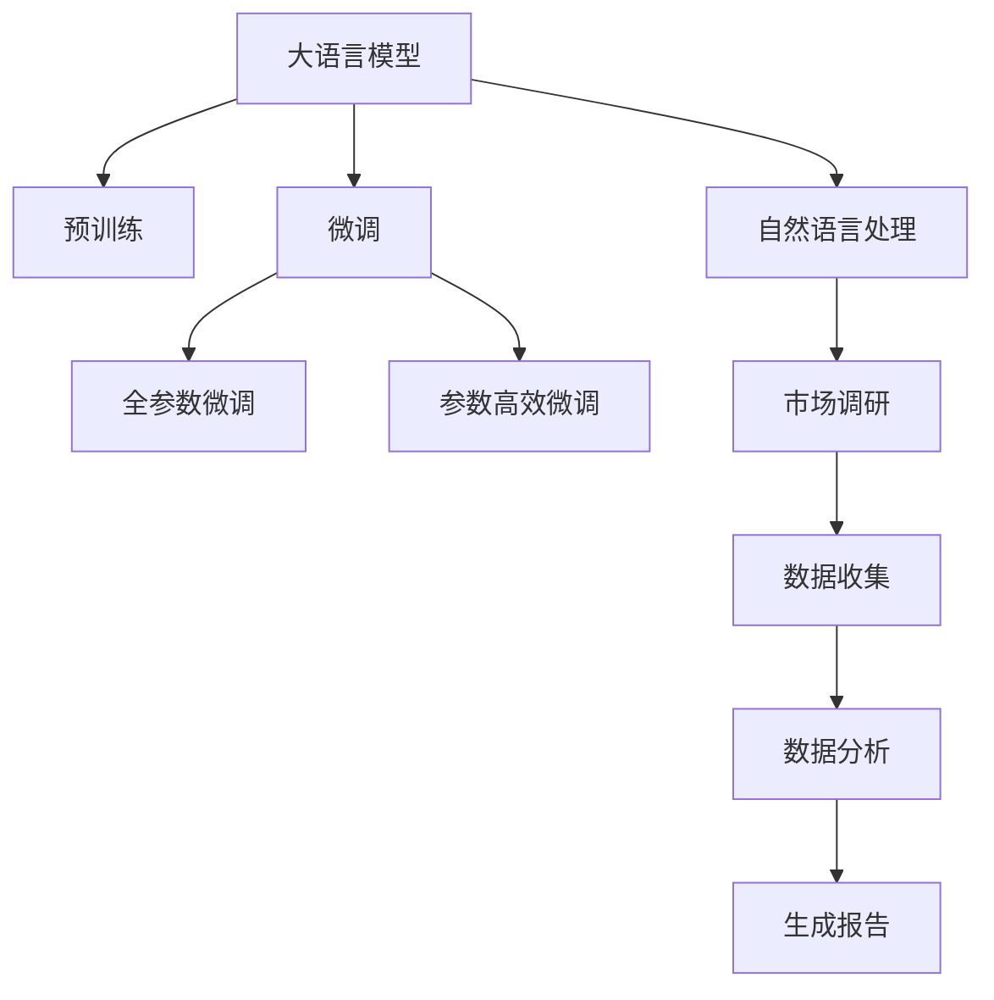

                 

## 1. 背景介绍

在数字化经济快速发展的背景下，传统的市场调研方式正面临着前所未有的挑战。传统市场调研主要依赖问卷调查、访谈等手段，通过人力收集消费者反馈，然后通过统计分析工具对数据进行归纳总结，以便为企业决策提供依据。但这种模式在数据收集、处理和分析上存在诸多局限性，而语言模型（如LLM，Large Language Models）的崛起为市场调研提供了全新的视角。

## 2. 核心概念与联系

### 2.1 核心概念概述

#### 2.1.1 大语言模型（LLM）

大语言模型是指通过大规模无标签文本数据进行预训练，然后通过微调针对特定任务进行优化的深度学习模型。这种模型具备强大的自然语言理解能力，可以用于文本分类、命名实体识别、情感分析等NLP任务。

#### 2.1.2 自然语言处理（NLP）

自然语言处理是计算机科学和人工智能的一个重要领域，旨在使计算机能够理解、处理、生成自然语言。NLP技术可以应用于文本分析、机器翻译、语音识别等领域。

#### 2.1.3 市场调研

市场调研是通过收集、分析和解释有关市场、消费者和竞争者的信息，以支持商业决策的过程。传统市场调研依赖于问卷调查、访谈等方法，成本高、效率低。

### 2.2 核心概念原理和架构的 Mermaid 流程图



## 3. 核心算法原理 & 具体操作步骤

### 3.1 算法原理概述

LLM在市场调研中的应用主要体现在数据分析和消费者情感分析上。LLM通过对大量文本数据进行训练，能够理解消费者的需求和情绪，从而为市场决策提供科学依据。

### 3.2 算法步骤详解

1. **数据收集**：通过网络爬虫、社交媒体分析等手段，收集与市场调研相关的文本数据，如消费者评论、社交媒体帖子等。

2. **预处理**：对收集到的文本数据进行清洗、分词、去停用词等处理，确保数据质量。

3. **预训练**：使用大规模无标签文本数据对LLM进行预训练，使其具备强大的语言理解能力。

4. **微调**：针对特定任务（如情感分析、消费者反馈分类等）对LLM进行微调，优化其在该任务上的性能。

5. **分析**：使用微调后的LLM对收集到的文本数据进行分析，生成消费者需求和情绪分析报告。

### 3.3 算法优缺点

#### 3.3.1 优点

- **高效性**：LLM可以快速处理大量文本数据，提高市场调研的效率。
- **准确性**：LLM能够理解文本的语义，准确分析消费者需求和情绪。
- **低成本**：相比于传统市场调研方式，LLM减少了人力和物力的投入。

#### 3.3.2 缺点

- **数据质量依赖**：LLM的效果很大程度上依赖于输入数据的质量，如果数据噪音较大，可能导致分析结果不准确。
- **缺乏人类直觉**：LLM无法像人类一样，理解文化背景、社会环境等因素对消费者行为的影响。
- **模型偏见**：LLM可能会学习到数据中的偏见，导致分析结果带有偏见。

### 3.4 算法应用领域

LLM在市场调研中的应用领域包括但不限于：

- **消费者情感分析**：分析消费者对品牌、产品的情感倾向，为品牌形象建设提供依据。
- **市场趋势预测**：通过分析社交媒体和新闻报道，预测市场趋势，指导企业决策。
- **竞争对手分析**：分析竞争对手的消费者反馈，了解其市场表现和竞争策略。
- **消费者需求分析**：识别消费者需求变化，指导产品设计和营销策略的调整。

## 4. 数学模型和公式 & 详细讲解 & 举例说明

### 4.1 数学模型构建

假设有一篇消费者评论 $x$，其情感标签为 $y \in \{1, -1\}$。定义LLM的输出为 $h_\theta(x)$，其中 $\theta$ 是模型的参数。定义情感分类任务的损失函数为：

$$
\mathcal{L}(\theta) = -\frac{1}{N}\sum_{i=1}^N[y_i\log h_\theta(x_i)+(1-y_i)\log(1-h_\theta(x_i))]
$$

其中 $N$ 为样本数。

### 4.2 公式推导过程

在微调过程中，使用梯度下降算法最小化损失函数：

$$
\theta \leftarrow \theta - \eta \nabla_{\theta}\mathcal{L}(\theta)
$$

其中 $\eta$ 是学习率。

### 4.3 案例分析与讲解

以消费者情感分析为例，假设我们收集到一篇关于某品牌的消费者评论：“我非常满意这个产品，质量非常好，性价比很高。”。使用LLM进行情感分类时，模型的输出 $h_\theta(x)$ 为0.9，表示该评论为正面情感。通过训练，模型最终将输出与情感标签的误差最小化。

## 5. 项目实践：代码实例和详细解释说明

### 5.1 开发环境搭建

#### 5.1.1 安装依赖

安装Python、PyTorch、Transformers等依赖包。

```bash
pip install torch transformers
```

#### 5.1.2 数据准备

准备市场调研所需的文本数据和情感标签，可以使用开源数据集，如IMDB电影评论数据集。

### 5.2 源代码详细实现

#### 5.2.1 数据预处理

```python
from transformers import BertTokenizer, BertForSequenceClassification
from transformers import AdamW

tokenizer = BertTokenizer.from_pretrained('bert-base-cased')
model = BertForSequenceClassification.from_pretrained('bert-base-cased', num_labels=2)

# 数据预处理
train_data = tokenizer(train_texts, return_tensors='pt', max_length=128, truncation=True, padding=True)
train_labels = train_labels
```

#### 5.2.2 模型微调

```python
device = torch.device('cuda' if torch.cuda.is_available() else 'cpu')
model.to(device)

optimizer = AdamW(model.parameters(), lr=2e-5)

for epoch in range(5):
    model.train()
    for i, (inputs, labels) in enumerate(train_loader):
        inputs = inputs.to(device)
        labels = labels.to(device)
        outputs = model(inputs)
        loss = outputs.loss
        loss.backward()
        optimizer.step()
        optimizer.zero_grad()
        print(f"Epoch {epoch+1}/{5}, Step {i+1}/{len(train_loader)}, Loss: {loss.item()}")
```

#### 5.2.3 结果展示

```python
model.eval()
with torch.no_grad():
    test_outputs = model(test_inputs)
    test_predictions = torch.argmax(test_outputs, dim=1)
    accuracy = (test_predictions == test_labels).float().mean()
    print(f"Test Accuracy: {accuracy:.2f}")
```

### 5.3 代码解读与分析

通过以上代码实现，我们可以使用Bert模型进行情感分析任务的微调。在微调过程中，我们将文本数据输入模型，通过计算损失函数进行反向传播，更新模型参数，最终得到情感分类的预测结果。

## 6. 实际应用场景

### 6.1 电子商务

在电子商务领域，使用LLM进行市场调研，可以分析消费者的购买行为、满意度、产品评价等，从而优化产品设计和营销策略，提升用户体验和销售业绩。

### 6.2 品牌管理

品牌管理方面，LLM可以分析社交媒体上的消费者情感，了解品牌形象和声誉，指导品牌战略调整，提高品牌价值。

### 6.3 市场营销

市场营销方面，LLM可以分析市场趋势和竞争对手的动态，预测市场需求，指导市场策略制定，提升市场竞争力。

### 6.4 未来应用展望

未来，LLM在市场调研中的应用将更加广泛和深入。通过与大数据、云计算等技术的结合，LLM将能够提供更精准的市场洞察和决策支持，帮助企业更好地应对市场变化。

## 7. 工具和资源推荐

### 7.1 学习资源推荐

- **《自然语言处理》课程**：斯坦福大学提供的自然语言处理课程，深入讲解NLP的基础知识和前沿技术。
- **Hugging Face官方文档**：提供详细的Transformers库使用说明和示例代码，适合初学者学习。
- **Kaggle平台**：提供丰富的数据集和竞赛项目，有助于实践和应用LLM进行市场调研。

### 7.2 开发工具推荐

- **PyTorch**：深度学习框架，支持动态计算图，适合快速迭代开发。
- **Transformers**：NLP工具库，包含多种预训练模型和微调方法。
- **Jupyter Notebook**：交互式编程环境，适合实验和分析。

### 7.3 相关论文推荐

- **Attention is All You Need**：Transformer论文，介绍Transformer结构和注意力机制。
- **BERT: Pre-training of Deep Bidirectional Transformers for Language Understanding**：BERT模型论文，介绍预训练语言模型的原理和应用。
- **BERT-Pretraining as Semi-supervised Sequence Labeling**：介绍预训练语言模型在半监督学习中的应用。

## 8. 总结：未来发展趋势与挑战

### 8.1 研究成果总结

LLM在市场调研中的应用，显著提高了数据处理和分析的效率，为企业的决策提供了科学依据。然而，LLM也面临着数据质量、模型偏见等问题，需要在实际应用中不断优化和改进。

### 8.2 未来发展趋势

1. **多模态融合**：LLM可以与其他模态的数据（如图像、视频）结合，提供更全面的市场洞察。
2. **跨领域迁移**：LLM在不同领域的应用中，可以借助迁移学习，提升模型泛化能力。
3. **零样本学习**：LLM可以通过任务描述，进行零样本学习，拓展应用范围。

### 8.3 面临的挑战

1. **数据隐私**：在使用消费者数据时，需注意数据隐私和合规问题。
2. **偏见消除**：LLM需要避免学习到数据中的偏见，确保分析结果的公正性。
3. **计算资源**：大规模数据和模型的训练和推理需要大量的计算资源，需要优化算法和硬件设备。

### 8.4 研究展望

未来，需要在数据隐私保护、模型偏见消除、计算资源优化等方面进一步研究和改进，以提升LLM在市场调研中的实际应用效果。

## 9. 附录：常见问题与解答

### 9.1 常见问题

#### Q1: 如何选择合适的LLM模型？

A: 选择LLM模型时，需考虑任务类型、数据规模和计算资源等因素。一般来说，GPT、BERT等大模型在情感分析、文本分类等任务上表现较好。

#### Q2: 如何进行数据预处理？

A: 数据预处理包括文本分词、去停用词、词形还原等步骤。使用transformers库中的BertTokenizer进行预处理。

#### Q3: 如何优化模型参数？

A: 模型参数优化主要通过梯度下降算法实现。学习率、批大小、迭代轮数等超参数需要根据具体任务进行调参。

#### Q4: 如何避免模型过拟合？

A: 过拟合可以通过数据增强、正则化、Early Stopping等技术进行缓解。在实际应用中，结合多种技术进行优化。

#### Q5: 如何提高模型鲁棒性？

A: 模型鲁棒性可以通过对抗训练、自适应学习等技术进行提升。确保模型在面对不同类型数据时仍能保持稳定的性能。

---

作者：禅与计算机程序设计艺术 / Zen and the Art of Computer Programming

