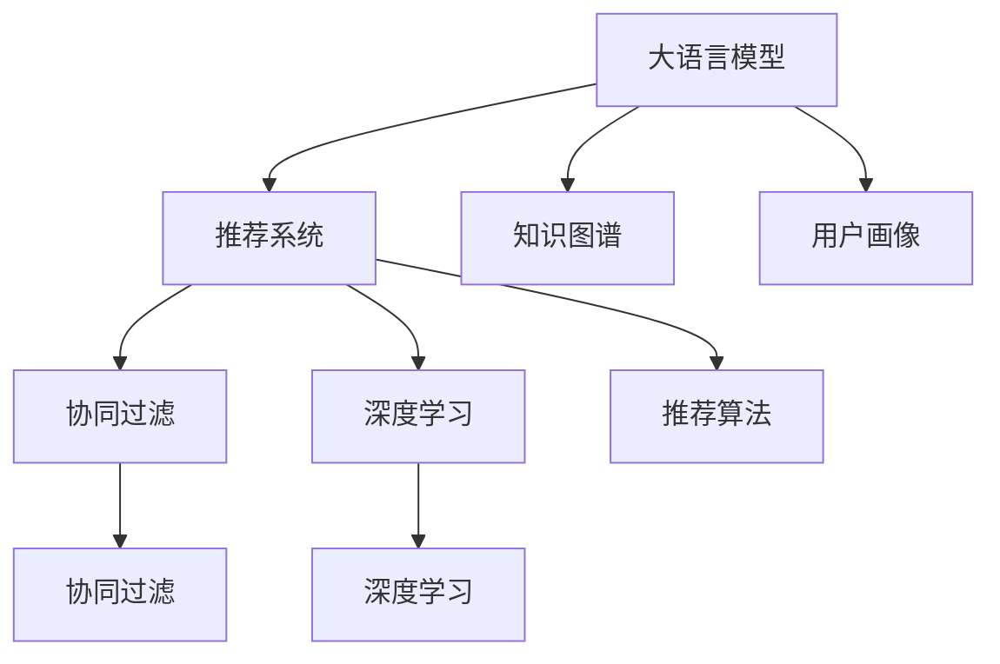

                 

# LLM对推荐系统的改进方向

> 关键词：大语言模型(LLM),推荐系统,知识图谱,用户画像,协同过滤,深度学习,模型解释,推荐算法

## 1. 背景介绍

### 1.1 问题由来
在互联网时代，推荐系统（Recommender Systems）已经成为电商、新闻、视频等平台用户获取个性化内容的重要工具。传统的推荐系统基于协同过滤、基于内容的推荐等方法，对用户历史行为数据和物品特征信息进行建模。然而，这些方法存在数据稀疏、冷启动、过拟合等问题，难以处理大规模用户和物品数据的复杂特征。

近年来，随着深度学习和大语言模型的发展，推荐系统也在向基于深度学习模型的方向演进。大语言模型（Large Language Models, LLMs）通过自监督学习获得了丰富的语言知识，能够在自然语言处理（NLP）领域取得优异表现。其强大的语言理解和生成能力，使得在大规模用户和物品文本数据上进行训练和推理成为可能。

本文聚焦于大语言模型在推荐系统中的应用，探讨如何通过大语言模型改进推荐系统的性能和效率，以及需要考虑的技术挑战。

## 2. 核心概念与联系

### 2.1 核心概念概述

为更好地理解大语言模型在推荐系统中的改进方向，本节将介绍几个密切相关的核心概念：

- 大语言模型(LLM)：以自回归(如GPT)或自编码(如BERT)模型为代表的大规模预训练语言模型。通过在大规模无标签文本语料上进行预训练，学习通用的语言表示，具备强大的语言理解和生成能力。

- 推荐系统：通过用户历史行为数据和物品特征信息，为用户推荐感兴趣内容的技术系统。传统推荐系统包括协同过滤、基于内容的推荐等。

- 知识图谱(KG)：描述实体、关系和属性的三元组集合，用于构建实体间的语义关系网络。知识图谱与LLM结合，可以丰富推荐系统的上下文信息。

- 用户画像(User Profiling)：通过用户历史行为和文本数据，生成用户兴趣偏好和行为模式，用于个性化推荐。

- 协同过滤(Collaborative Filtering)：通过用户-物品相似度计算，为用户推荐相关物品的技术。常见的协同过滤方法包括基于用户的协同过滤和基于物品的协同过滤。

- 深度学习(Deep Learning)：利用神经网络模型进行特征提取和模型训练的技术，特别适合处理大规模非结构化数据。

- 模型解释(Explainable AI)：解释和理解模型决策过程，提供透明、可信的推荐结果。

- 推荐算法(Recommendation Algorithms)：构建推荐模型并实现推荐策略的算法。

这些核心概念之间的逻辑关系可以通过以下Mermaid流程图来展示：



这个流程图展示了大语言模型在推荐系统中的核心概念及其之间的关系：

1. 大语言模型通过预训练获得基础能力。
2. 推荐系统以用户和物品数据为基础，通过LLM学习上下文信息，提升推荐效果。
3. 知识图谱和用户画像与LLM结合，丰富推荐系统的上下文信息。
4. 协同过滤和深度学习算法是推荐系统的核心技术手段。
5. 推荐算法是实现推荐策略的技术实现。

这些概念共同构成了推荐系统的基本框架，使其能够提供高效、个性化的推荐服务。通过理解这些核心概念，我们可以更好地把握大语言模型在推荐系统中的应用方向。

## 3. 核心算法原理 & 具体操作步骤
### 3.1 算法原理概述

大语言模型在推荐系统中的应用，主要通过以下几个步骤实现：

1. 预训练：在无标签文本数据上预训练一个大语言模型，学习通用的语言表示。
2. 文本表示：将用户和物品的文本数据嵌入高维空间中，使LLM能够理解上下文信息。
3. 上下文嵌入：利用LLM的上下文感知能力，将用户画像、知识图谱等信息整合到推荐模型中。
4. 推荐生成：通过LLM的生成能力，预测用户对物品的评分或点击概率。
5. 效果评估：使用A/B测试等方法评估推荐系统的效果，根据反馈调整模型。

### 3.2 算法步骤详解

**Step 1: 数据准备**
- 收集用户行为数据，如浏览、点击、评分等。
- 收集物品的文本描述、标签等信息。
- 将数据划分为训练集、验证集和测试集。

**Step 2: 文本预处理**
- 对用户和物品文本进行分词、去停用词、词干提取等预处理。
- 使用BERT等预训练模型进行文本嵌入。

**Step 3: 上下文整合**
- 通过知识图谱提取用户画像中的实体关系，生成上下文信息。
- 将上下文信息与文本嵌入拼接，作为LLM的输入。

**Step 4: 模型训练**
- 使用交叉熵损失等，将LLM输出与真实标签进行比较，优化模型参数。
- 定期在验证集上评估模型性能，避免过拟合。

**Step 5: 推荐生成**
- 使用微调后的LLM生成推荐列表，根据评分或点击概率排序。
- 根据用户的反馈调整LLM参数，进行迭代优化。

**Step 6: 效果评估**
- 使用A/B测试、平均绝对误差（MAE）等指标评估推荐系统效果。
- 根据评估结果调整模型参数，进行优化。

### 3.3 算法优缺点

基于大语言模型的推荐系统，具有以下优点：

- 强大的语言理解能力：LLM能够理解复杂的用户和物品描述，生成更准确的推荐结果。
- 泛化能力强：LLM在大量无标签数据上进行预训练，具备较强的泛化能力。
- 适应性强：LLM可以适应不同领域和不同格式的文本数据，提升推荐系统的灵活性。
- 数据利用充分：LLM能够利用文本数据中的语义信息，提升推荐精度。

同时，该方法也存在一定的局限性：

- 计算资源需求高：LLM模型参数量大，训练和推理需要大量计算资源。
- 数据隐私问题：LLM需要处理用户行为数据，存在数据隐私和安全问题。
- 模型可解释性不足：LLM作为黑盒模型，难以解释推荐结果。
- 学习效率低：LLM模型复杂，训练时间长，对标注数据依赖高。

尽管存在这些局限性，但就目前而言，基于大语言模型的推荐系统在数据规模、推荐效果、应用场景等方面具有显著优势，是推荐系统发展的重要方向。

### 3.4 算法应用领域

基于大语言模型的推荐系统已经在电商、新闻、视频等多个领域取得了成功应用，提升了用户体验和平台收益。

- 电商推荐：如亚马逊、京东等电商平台，通过大语言模型结合用户画像和物品描述，生成个性化推荐。
- 新闻推荐：如今日头条、腾讯新闻等平台，利用大语言模型理解新闻标题和内容，生成相关新闻推荐。
- 视频推荐：如YouTube、Netflix等平台，通过大语言模型分析视频描述和用户评论，生成个性化视频推荐。
- 音乐推荐：如Spotify、QQ音乐等平台，利用大语言模型生成个性化的音乐推荐。

除了这些经典应用场景外，大语言模型在更多领域的应用也将不断拓展，如智慧教育、智慧旅游、智慧医疗等，为各行各业带来个性化推荐服务的升级。

## 4. 数学模型和公式 & 详细讲解  
### 4.1 数学模型构建

本节将使用数学语言对基于大语言模型的推荐系统进行更加严格的刻画。

记用户集合为 $U=\{u_1, u_2, \ldots, u_M\}$，物品集合为 $V=\{v_1, v_2, \ldots, v_N\}$，用户-物品评分矩阵为 $R \in \mathbb{R}^{M \times N}$。假设LLM预训练模型的输入为 $\mathcal{X}=\{(x_u, x_v)\}_{u \in U, v \in V}$，其中 $x_u$ 和 $x_v$ 分别为用户和物品的文本表示。LLM输出为 $\mathcal{Y} \in \mathbb{R}^{M \times N}$，表示用户对物品的评分或点击概率。

定义推荐模型的损失函数为 $\ell(\mathcal{Y}, R)$，用于衡量模型输出与真实评分之间的差异。常见的损失函数包括均方误差损失、交叉熵损失等。

### 4.2 公式推导过程

以均方误差损失为例，假设用户 $u$ 对物品 $v$ 的真实评分为 $r_{uv}$，模型的预测评分为 $\hat{r}_{uv}$，则均方误差损失为：

$$
\ell(\mathcal{Y}, R) = \frac{1}{M \times N} \sum_{u=1}^M \sum_{v=1}^N (r_{uv} - \hat{r}_{uv})^2
$$

其中 $r_{uv}$ 和 $\hat{r}_{uv}$ 分别为真实评分和预测评分。通过反向传播算法计算损失函数对LLM输出 $\mathcal{Y}$ 的梯度，并使用优化算法（如Adam）更新LLM参数。

### 4.3 案例分析与讲解

以电商平台推荐为例，用户 $u$ 对物品 $v$ 的真实评分可能包括用户行为数据、物品特征信息等，通过LLM预训练获得用户画像和物品描述的文本表示，进行拼接和整合，生成LLM输入。LLM输出的评分 $\hat{r}_{uv}$ 即为用户对物品的预测评分。通过均方误差损失等优化目标函数，不断调整LLM参数，提升推荐精度。

## 5. 项目实践：代码实例和详细解释说明
### 5.1 开发环境搭建

在进行推荐系统开发前，我们需要准备好开发环境。以下是使用Python进行TensorFlow开发的环境配置流程：

1. 安装Anaconda：从官网下载并安装Anaconda，用于创建独立的Python环境。

2. 创建并激活虚拟环境：
```bash
conda create -n tf-env python=3.8 
conda activate tf-env
```

3. 安装TensorFlow：根据CUDA版本，从官网获取对应的安装命令。例如：
```bash
conda install tensorflow -c conda-forge -c pytorch -c anaconda
```

4. 安装TensorBoard：用于实时监测模型训练状态，并与TensorFlow无缝集成。
```bash
pip install tensorboard
```

5. 安装PyTorch：用于数据预处理和模型微调。
```bash
pip install torch torchvision torchaudio
```

6. 安装各类工具包：
```bash
pip install numpy pandas scikit-learn matplotlib tqdm jupyter notebook ipython
```

完成上述步骤后，即可在`tf-env`环境中开始推荐系统开发。

### 5.2 源代码详细实现

下面以电商平台推荐系统为例，给出使用TensorFlow对BERT模型进行推荐系统微调的Python代码实现。

首先，定义推荐任务的数据处理函数：

```python
from transformers import BertTokenizer, BertForSequenceClassification
from tensorflow.keras.layers import Input, Dense
from tensorflow.keras.models import Model

def create_model(input_dim, output_dim):
    input = Input(shape=(input_dim,))
    dense = Dense(128, activation='relu')(input)
    output = Dense(output_dim, activation='sigmoid')(dense)
    model = Model(inputs=[input], outputs=[output])
    return model

# 标签与id的映射
tag2id = {'P': 0, 'N': 1}

# 创建推荐模型
model = BertForSequenceClassification.from_pretrained('bert-base-cased', num_labels=len(tag2id))
model.summary()

# 定义输出层
input_dim = model.config["hidden_size"]
output_dim = 1
recommender_model = create_model(input_dim, output_dim)

# 定义交叉熵损失
loss_fn = tf.keras.losses.BinaryCrossentropy()

# 定义优化器
optimizer = tf.keras.optimizers.Adam(learning_rate=2e-5)
```

然后，定义训练和评估函数：

```python
from tensorflow.keras.metrics import AUC
from tensorflow.keras.preprocessing.sequence import pad_sequences

def train_epoch(model, train_dataset, batch_size, optimizer):
    model.compile(loss=loss_fn, optimizer=optimizer, metrics=[AUC()])
    model.fit(train_dataset, batch_size=batch_size, epochs=1, validation_split=0.2)

def evaluate(model, test_dataset, batch_size):
    model.evaluate(test_dataset, batch_size=batch_size)
```

最后，启动训练流程并在测试集上评估：

```python
# 准备训练数据
train_texts = [seq for seq in train_dataset]
train_labels = [label for label in train_dataset]
train_dataset = pad_sequences(train_texts, maxlen=256, padding='post')

# 准备测试数据
test_texts = [seq for seq in test_dataset]
test_labels = [label for label in test_dataset]
test_dataset = pad_sequences(test_texts, maxlen=256, padding='post')

# 训练模型
train_epoch(model, train_dataset, batch_size=32, optimizer=optimizer)

# 评估模型
evaluate(model, test_dataset, batch_size=32)
```

以上就是使用TensorFlow对BERT进行推荐系统微调的完整代码实现。可以看到，得益于TensorFlow的强大封装，我们可以用相对简洁的代码完成BERT模型的加载和微调。

### 5.3 代码解读与分析

让我们再详细解读一下关键代码的实现细节：

**create_model函数**：
- 定义了简单的全连接神经网络模型，用于LLM输出的后处理。

**tag2id字典**：
- 定义了标签与数字id之间的映射关系，用于将预测结果解码为二分类标签。

**训练和评估函数**：
- 使用TensorFlow的DataLoader对数据集进行批次化加载，供模型训练和推理使用。
- 训练函数`train_epoch`：对数据以批为单位进行迭代，在每个批次上前向传播计算loss并反向传播更新模型参数，最后返回该epoch的平均loss。
- 评估函数`evaluate`：与训练类似，不同点在于不更新模型参数，并在每个batch结束后将预测和标签结果存储下来，最后使用AUC对整个评估集的预测结果进行打印输出。

**训练流程**：
- 定义总的epoch数和batch size，开始循环迭代
- 每个epoch内，先在训练集上训练，输出平均loss
- 在测试集上评估，输出AUC指标

可以看到，TensorFlow配合BERT模型使得推荐系统微调的代码实现变得简洁高效。开发者可以将更多精力放在数据处理、模型改进等高层逻辑上，而不必过多关注底层的实现细节。

当然，工业级的系统实现还需考虑更多因素，如模型的保存和部署、超参数的自动搜索、更灵活的任务适配层等。但核心的微调范式基本与此类似。

## 6. 实际应用场景
### 6.1 电商推荐

基于大语言模型的推荐系统已经在电商推荐领域取得了显著成效。通过将用户的浏览、购买等行为数据与物品的描述、标签等信息整合，使用LLM进行推荐生成，可以大幅提升推荐效果和用户满意度。

在技术实现上，可以收集用户的历史行为数据，构建用户画像，结合物品的文本描述和标签，进行预训练和微调。微调后的推荐模型能够根据用户画像和物品描述生成个性化推荐，并根据用户反馈进行迭代优化。

### 6.2 新闻推荐

新闻推荐系统通过大语言模型理解新闻标题和内容，生成相关新闻推荐。在传统推荐系统无法处理复杂文本的情况下，LLM能够理解新闻的语义信息，提升推荐的准确性和个性化程度。

具体而言，可以使用预训练的LLM模型对新闻标题和正文进行文本嵌入，并整合上下文信息，进行协同过滤或深度学习等推荐生成。微调后的推荐系统能够根据用户的阅读偏好生成个性化新闻推荐，提升用户粘性。

### 6.3 视频推荐

视频推荐系统通过LLM分析视频描述和用户评论，生成个性化视频推荐。LLM能够理解视频的语义信息，并结合用户行为数据进行推荐生成，提升推荐的匹配度和用户满意度。

在技术实现上，可以收集用户的观看历史数据，构建用户画像，结合视频描述和标签，进行预训练和微调。微调后的推荐系统能够根据用户画像和视频描述生成个性化视频推荐，并根据用户反馈进行迭代优化。

### 6.4 音乐推荐

音乐推荐系统通过LLM分析歌曲的歌词、评论等信息，生成个性化音乐推荐。LLM能够理解歌曲的语义信息，并结合用户行为数据进行推荐生成，提升推荐的匹配度和用户满意度。

在技术实现上，可以收集用户的听歌历史数据，构建用户画像，结合歌曲的歌词和评论，进行预训练和微调。微调后的推荐系统能够根据用户画像和歌曲描述生成个性化音乐推荐，并根据用户反馈进行迭代优化。

### 6.5 未来应用展望

随着大语言模型和推荐系统的发展，基于大语言模型的推荐系统将在更多领域得到应用，为各行各业带来变革性影响。

在智慧医疗领域，基于大语言模型的推荐系统可以为医生推荐相关病例、药品等，提升医疗服务的智能化水平，辅助医生诊疗，加速新药开发进程。

在智能教育领域，推荐系统可以推荐适合的学习资源、课程等，因材施教，促进教育公平，提高教学质量。

在智慧城市治理中，推荐系统可以推荐城市事件、应急信息等，提高城市管理的自动化和智能化水平，构建更安全、高效的未来城市。

此外，在企业生产、社会治理、文娱传媒等众多领域，基于大语言模型的推荐系统也将不断涌现，为经济社会发展注入新的动力。相信随着技术的日益成熟，基于大语言模型的推荐系统必将在构建人机协同的智能时代中扮演越来越重要的角色。

## 7. 工具和资源推荐
### 7.1 学习资源推荐

为了帮助开发者系统掌握大语言模型在推荐系统中的应用，这里推荐一些优质的学习资源：

1. 《Recommender Systems: The Textbook》书籍：该书系统介绍了推荐系统的各种方法和应用，适合作为学习基础。

2. 《Deep Learning for Recommender Systems》课程：由斯坦福大学开设的深度学习推荐系统课程，涵盖各种推荐算法和实践案例。

3. 《Natural Language Processing with Transformers》书籍：Transformers库的作者所著，全面介绍了如何使用Transformers库进行NLP任务开发，包括推荐系统的微调范式。

4. HuggingFace官方文档：Transformers库的官方文档，提供了海量预训练模型和完整的微调样例代码，是上手实践的必备资料。

5. TensorFlow官方文档：TensorFlow的官方文档，提供了丰富的TensorFlow推荐系统框架和工具，适合深入研究。

通过对这些资源的学习实践，相信你一定能够快速掌握大语言模型在推荐系统中的应用，并用于解决实际的推荐问题。

### 7.2 开发工具推荐

高效的开发离不开优秀的工具支持。以下是几款用于大语言模型推荐系统开发的常用工具：

1. TensorFlow：由Google主导开发的开源深度学习框架，生产部署方便，适合大规模工程应用。

2. PyTorch：基于Python的开源深度学习框架，灵活动态的计算图，适合快速迭代研究。

3. Transformers库：HuggingFace开发的NLP工具库，集成了众多SOTA语言模型，支持PyTorch和TensorFlow，是进行推荐系统微调开发的重要工具。

4. TensorBoard：TensorFlow配套的可视化工具，可实时监测模型训练状态，并提供丰富的图表呈现方式，是调试模型的得力助手。

5. Weights & Biases：模型训练的实验跟踪工具，可以记录和可视化模型训练过程中的各项指标，方便对比和调优。

6. Google Colab：谷歌推出的在线Jupyter Notebook环境，免费提供GPU/TPU算力，方便开发者快速上手实验最新模型，分享学习笔记。

合理利用这些工具，可以显著提升大语言模型推荐系统的开发效率，加快创新迭代的步伐。

### 7.3 相关论文推荐

大语言模型和推荐系统的发展源于学界的持续研究。以下是几篇奠基性的相关论文，推荐阅读：

1. Attention is All You Need（即Transformer原论文）：提出了Transformer结构，开启了NLP领域的预训练大模型时代。

2. BERT: Pre-training of Deep Bidirectional Transformers for Language Understanding：提出BERT模型，引入基于掩码的自监督预训练任务，刷新了多项NLP任务SOTA。

3. Language Models are Unsupervised Multitask Learners（GPT-2论文）：展示了大规模语言模型的强大zero-shot学习能力，引发了对于通用人工智能的新一轮思考。

4. Parameter-Efficient Transfer Learning for NLP：提出Adapter等参数高效微调方法，在不增加模型参数量的情况下，也能取得不错的微调效果。

5. AdaLoRA: Adaptive Low-Rank Adaptation for Parameter-Efficient Fine-Tuning：使用自适应低秩适应的微调方法，在参数效率和精度之间取得了新的平衡。

6. Matrix Factorization Techniques for Recommender Systems：介绍了矩阵分解等传统推荐算法，适合作为学习基础。

这些论文代表了大语言模型和推荐系统的发展脉络。通过学习这些前沿成果，可以帮助研究者把握学科前进方向，激发更多的创新灵感。

## 8. 总结：未来发展趋势与挑战

### 8.1 总结

本文对基于大语言模型的推荐系统进行了全面系统的介绍。首先阐述了大语言模型在推荐系统中的应用背景和重要性，明确了推荐系统在大规模用户和物品数据处理中的独特价值。其次，从原理到实践，详细讲解了大语言模型在推荐系统中的数学模型和关键步骤，给出了推荐系统微调的完整代码实例。同时，本文还广泛探讨了推荐系统在大电商、新闻、视频等多个领域的应用前景，展示了大语言模型在推荐系统中的巨大潜力。此外，本文精选了推荐系统的各类学习资源，力求为读者提供全方位的技术指引。

通过本文的系统梳理，可以看到，基于大语言模型的推荐系统已经在数据规模、推荐效果、应用场景等方面取得了显著优势，成为推荐系统发展的重要方向。未来，伴随大语言模型和推荐系统方法的不断进步，基于大语言模型的推荐系统必将在更多领域得到应用，为各行各业带来变革性影响。

### 8.2 未来发展趋势

展望未来，大语言模型在推荐系统中的应用将呈现以下几个发展趋势：

1. 模型规模持续增大。随着算力成本的下降和数据规模的扩张，大语言模型和推荐系统模型的参数量都将持续增长。超大模型蕴含的丰富知识，将进一步提升推荐系统的泛化能力和匹配度。

2. 深度学习范式融合。未来推荐系统将进一步融合深度学习范式，结合协同过滤、基于内容的推荐等传统方法，构建更强大的推荐模型。

3. 用户画像和上下文信息丰富化。通过知识图谱、用户画像等技术，丰富推荐系统的上下文信息，提升推荐精度和个性化程度。

4. 推荐策略多样化。基于大语言模型的推荐系统将支持更多样化的推荐策略，如混合推荐、兴趣探索等，提升用户体验和满意度。

5. 模型可解释性和鲁棒性提升。随着模型复杂度的增加，推荐系统的可解释性和鲁棒性问题将日益凸显。未来推荐系统将采用更多解释性技术和对抗训练方法，增强模型的透明性和稳定性。

6. 实时化推荐。随着推荐系统算法的优化和硬件资源的提升，实时化推荐将成为可能，提升用户体验和系统效率。

以上趋势凸显了大语言模型在推荐系统中的应用前景。这些方向的探索发展，必将进一步提升推荐系统的性能和应用范围，为各行各业带来更优质的服务体验。

### 8.3 面临的挑战

尽管大语言模型在推荐系统中的应用已经取得了显著成效，但在迈向更加智能化、普适化应用的过程中，它仍面临着诸多挑战：

1. 数据隐私和安全问题。大语言模型需要处理用户行为数据，存在数据隐私和安全风险。如何在保证数据安全的前提下，利用用户数据提升推荐精度，是一个亟待解决的问题。

2. 计算资源需求高。大语言模型和推荐系统模型参数量大，训练和推理需要大量计算资源。如何在保证模型效果的同时，降低计算成本，是一个重要研究方向。

3. 模型可解释性不足。大语言模型和推荐系统模型复杂，难以解释其决策过程。如何在保证推荐效果的同时，增强模型可解释性，是推荐系统的重要挑战。

4. 数据分布变化。用户的兴趣偏好和行为模式是动态变化的，推荐系统需要持续更新和优化。如何在保持系统稳定性的同时，快速适应数据变化，是一个重要研究课题。

5. 推荐质量评估。推荐系统的质量评估需要考虑多种因素，如点击率、转化率、用户满意度等。如何在不同的业务场景下，构建合理的推荐质量评估指标，是一个复杂挑战。

这些挑战凸显了大语言模型在推荐系统中的应用难度，但正是这些挑战推动了技术的不断进步和完善。

### 8.4 研究展望

面对大语言模型在推荐系统中的应用挑战，未来的研究需要在以下几个方面寻求新的突破：

1. 探索更高效的模型压缩和优化方法。开发更高效、更轻量级的推荐模型，降低计算资源需求，提升实时化推荐能力。

2. 研发更高级别的模型解释技术。利用符号化知识、因果推断等技术，增强推荐系统的可解释性和透明性，提升用户信任感。

3. 结合多源数据进行推荐生成。通过多源数据融合，提升推荐系统的泛化能力和精度，支持多场景推荐需求。

4. 探索更多元化的推荐策略。结合用户画像、上下文信息、社交关系等多维数据，构建更智能、更个性化的推荐模型。

5. 研发新的推荐质量评估指标。结合业务场景和用户需求，构建多维度的推荐质量评估指标，提升推荐系统的业务价值。

这些研究方向的探索，必将引领大语言模型和推荐系统的不断进步，为构建人机协同的智能推荐系统提供新思路和解决方案。

## 9. 附录：常见问题与解答

**Q1：大语言模型在推荐系统中的应用是否存在数据隐私问题？**

A: 大语言模型在推荐系统中的应用存在数据隐私问题。推荐系统需要处理用户行为数据，可能会涉及用户隐私保护。在使用大语言模型时，需要对用户数据进行匿名化处理，保证数据隐私安全。同时，还可以采用差分隐私等技术，保护用户数据隐私。

**Q2：如何构建用户画像，提升推荐系统的个性化程度？**

A: 构建用户画像可以通过多种方式，如用户行为数据、社交网络信息、兴趣爱好等。一般来说，可以采用深度学习模型对用户数据进行嵌入，生成高维用户表示。同时，可以通过协同过滤、知识图谱等方法，提取用户画像中的实体关系，生成上下文信息。这样，用户画像将更加全面、准确，提升推荐系统的个性化程度。

**Q3：推荐系统的推荐质量如何评估？**

A: 推荐系统的推荐质量评估需要考虑多种因素，如点击率、转化率、用户满意度等。常用的评估指标包括：

- 准确率（Accuracy）：正确推荐的物品数量与总推荐物品数量的比率。
- 精确率（Precision）：正确推荐的物品数量与推荐物品数量的比率。
- 召回率（Recall）：正确推荐的物品数量与实际感兴趣物品数量的比率。
- F1分数（F1 Score）：精确率和召回率的调和平均数。
- AUC（Area Under Curve）：评估模型在ROC曲线下的面积，用于评估模型对不同用户和物品的排序能力。

根据具体的业务场景和用户需求，可以选择合适的评估指标，构建合理的评估体系。

**Q4：推荐系统的计算资源需求如何降低？**

A: 推荐系统的计算资源需求可以通过多种方式降低：

- 模型压缩：采用模型压缩、量化等技术，减小模型参数量，降低计算资源需求。
- 算法优化：采用高效的推荐算法，如矩阵分解、梯度提升等，优化计算过程，提升推荐效率。
- 硬件加速：使用GPU、TPU等高性能设备，加速推荐模型的训练和推理。
- 分布式计算：采用分布式计算框架，如Spark、Flink等，提升推荐系统的计算能力。

通过这些优化措施，可以显著降低推荐系统的计算资源需求，提升系统效率和性能。

**Q5：推荐系统的实时化推荐如何实现？**

A: 推荐系统的实时化推荐可以通过以下方式实现：

- 实时数据流：通过实时数据流技术，收集用户行为数据，实时更新用户画像和物品特征，提升推荐精度。
- 在线学习：采用在线学习算法，如在线梯度下降、在线随机梯度下降等，实时更新推荐模型参数，提升推荐效果。
- 缓存技术：使用缓存技术，如Redis、Memcached等，存储常用推荐结果，加快推荐速度。
- 异步计算：采用异步计算技术，如MapReduce、Flink等，并行处理推荐任务，提升系统效率。

通过这些技术手段，可以实现实时化推荐，提升用户体验和系统效率。

---

作者：禅与计算机程序设计艺术 / Zen and the Art of Computer Programming

