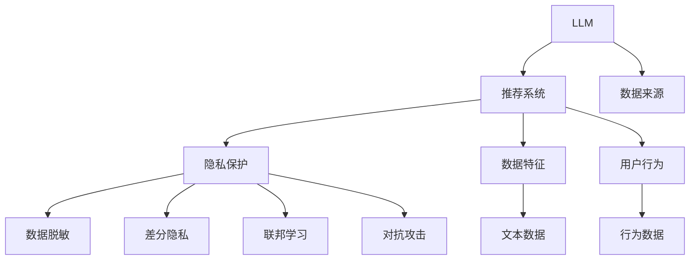

                 

# LLM对推荐系统隐私保护的新挑战

在人工智能的快速发展的浪潮中，推荐系统作为连接用户与内容的重要桥梁，其隐私保护问题越来越受到重视。传统推荐系统主要基于用户行为数据进行推荐，不可避免地涉及用户隐私信息的泄露和滥用。而近年来兴起的基于语言模型的大规模推荐系统，如BERT、GPT等，带来了隐私保护的新挑战。

## 1. 背景介绍

### 1.1 问题由来

推荐系统的发展经历了从基于协同过滤到基于内容的推荐、再到基于混合算法的推荐等多个阶段。传统的推荐系统主要通过分析用户的历史行为数据，如点击、浏览记录等，来推荐用户可能感兴趣的内容。然而，这类推荐方法往往需要收集和存储大量的用户行为数据，存在隐私泄露的风险。

近年来，基于语言模型的大规模推荐系统逐渐成为研究热点。这些系统利用预训练语言模型（如BERT、GPT等），通过分析用户的文本数据（如评论、聊天记录）来推荐相关内容。虽然这类方法在推荐精度上取得了显著提升，但同时也引入了新的隐私保护问题。语言模型通常需要收集大量的文本数据进行训练，如何确保这些数据的隐私保护，成为了亟待解决的问题。

### 1.2 问题核心关键点

本节将围绕语言模型对推荐系统隐私保护的影响，探讨几个核心问题：

1. 预训练语言模型（LLM）的数据来源和隐私保护问题。
2. 基于LLM的推荐系统如何利用用户文本数据进行推荐。
3. 如何在LLM推荐系统中实现隐私保护，同时不牺牲推荐精度。

## 2. 核心概念与联系

### 2.1 核心概念概述

为了更好地理解基于LLM的推荐系统对隐私保护带来的新挑战，本节将介绍几个关键概念：

- **预训练语言模型（LLM）**：通过在大量无标签文本数据上进行自监督预训练，学习通用语言表示的模型，如BERT、GPT等。
- **推荐系统**：基于用户行为数据或其他数据特征，为用户推荐相关内容的系统。
- **隐私保护**：保护用户隐私信息，防止其在推荐过程中被泄露或滥用的技术手段。
- **数据脱敏**：对数据进行匿名化处理，去除或替换敏感信息，防止数据泄露。
- **差分隐私**：在数据处理和分析过程中，保护个人隐私的技术手段，如加噪、扰动等。
- **联邦学习**：一种分布式机器学习范式，多个参与方在不共享本地数据的情况下，共同训练模型。
- **对抗攻击**：通过在输入数据中引入干扰，使得模型输出偏离期望结果，如对抗样本攻击。

这些概念之间的逻辑关系可以通过以下Mermaid流程图来展示：



这个流程图展示了预训练语言模型、推荐系统、隐私保护以及相关技术手段之间的关系：

1. 预训练语言模型通过大量文本数据进行预训练，学习通用语言表示。
2. 推荐系统基于预训练模型和用户数据特征，为用户推荐相关内容。
3. 隐私保护技术手段用于保护用户数据隐私，防止数据泄露和滥用。
4. 数据脱敏、差分隐私、联邦学习等方法可以应用于推荐系统中，保护用户隐私。
5. 对抗攻击可以用于测试和防御推荐系统的安全性。

## 3. 核心算法原理 & 具体操作步骤

### 3.1 算法原理概述

基于LLM的推荐系统隐私保护问题，主要体现在预训练数据隐私保护和推荐过程隐私保护两个方面。

1. **预训练数据隐私保护**：预训练语言模型需要大量文本数据进行训练，如何确保这些数据不被滥用是一个关键问题。常见的隐私保护手段包括数据脱敏、差分隐私等。

2. **推荐过程隐私保护**：基于LLM的推荐系统通过分析用户文本数据进行推荐，如何防止这些文本数据被滥用也是一大挑战。常见的隐私保护手段包括联邦学习、对抗攻击等。

### 3.2 算法步骤详解

#### 3.2.1 预训练数据隐私保护

- **数据脱敏**：在预训练数据上，对敏感信息进行脱敏处理，如用虚拟ID替换真实用户ID，去除或替换敏感内容。
- **差分隐私**：在预训练过程中，引入噪声，使得任何单个样本对模型的影响极小，从而保护用户隐私。
- **联邦学习**：多个参与方在不共享本地数据的情况下，共同训练模型，保护数据隐私。

#### 3.2.2 推荐过程隐私保护

- **联邦学习**：推荐系统中，每个用户的数据可以分布在多个本地设备上，通过联邦学习的方式，聚合本地模型的参数更新，进行全局模型训练，保护用户隐私。
- **对抗攻击**：在推荐系统中，对抗攻击可以通过在输入数据中引入干扰，使得模型输出偏离期望结果，从而保护用户隐私。

### 3.3 算法优缺点

基于LLM的推荐系统隐私保护算法具有以下优点：

1. **保护用户隐私**：通过数据脱敏、差分隐私等手段，保护用户数据隐私，防止数据泄露和滥用。
2. **提升推荐精度**：通过联邦学习等技术，可以充分利用用户本地数据，提升推荐精度。
3. **安全性强**：对抗攻击等技术可以保护推荐系统的安全性，防止恶意攻击。

但这些算法也存在一些局限性：

1. **计算复杂度高**：差分隐私和对抗攻击等方法需要引入额外的计算开销，可能影响系统性能。
2. **数据处理难度大**：数据脱敏和联邦学习等方法需要对数据进行复杂处理，需要额外的时间和成本。
3. **对抗攻击防御难**：对抗攻击可能会引入新的安全漏洞，需要持续优化防御策略。

### 3.4 算法应用领域

基于LLM的推荐系统隐私保护算法已经在多个领域得到应用，例如：

1. **电商推荐**：在电商平台上，利用用户评论、搜索记录等文本数据进行商品推荐，同时保护用户隐私。
2. **社交媒体推荐**：在社交媒体平台上，利用用户的文本数据进行内容推荐，同时保护用户隐私。
3. **新闻推荐**：在新闻平台上，利用用户的阅读记录等文本数据进行新闻推荐，同时保护用户隐私。
4. **视频推荐**：在视频平台上，利用用户的观看记录等文本数据进行视频推荐，同时保护用户隐私。
5. **音乐推荐**：在音乐平台上，利用用户的听歌记录等文本数据进行歌曲推荐，同时保护用户隐私。

## 4. 数学模型和公式 & 详细讲解 & 举例说明

### 4.1 数学模型构建

#### 4.1.1 预训练数据隐私保护

- **数据脱敏**：将真实用户ID替换为虚拟ID，即 $u_i \rightarrow v_i$。其中 $u_i$ 为真实用户ID，$v_i$ 为虚拟ID。
- **差分隐私**：在预训练过程中，引入噪声 $\epsilon$，使得任何单个样本对模型的影响极小，即 $\hat{y}=f(x+\epsilon)$。其中 $f$ 为预训练模型，$x$ 为输入数据，$\epsilon$ 为噪声。

#### 4.1.2 推荐过程隐私保护

- **联邦学习**：在推荐系统中，每个用户的数据分布在多个本地设备上，通过联邦学习的方式，聚合本地模型的参数更新，进行全局模型训练，即 $\hat{y}=f_\text{global}(x_\text{local}_1, x_\text{local}_2, \ldots, x_\text{local}_k)$。其中 $f_\text{global}$ 为全局模型，$x_\text{local}_i$ 为第 $i$ 个本地设备的数据。

### 4.2 公式推导过程

#### 4.2.1 差分隐私推导

假设预训练模型的损失函数为 $L(x)$，在差分隐私框架下，引入噪声 $\epsilon$ 后，损失函数变为 $L(x+\epsilon)$。为了保证模型的性能，需要最小化 $L(x+\epsilon)$。

$$
\min_{x} \mathbb{E}_{\epsilon} [L(x+\epsilon)]
$$

其中 $\mathbb{E}_{\epsilon}$ 表示对噪声 $\epsilon$ 求期望。

#### 4.2.2 联邦学习推导

假设每个用户的本地数据为 $x_i$，本地模型的参数为 $\theta_i$，全局模型的参数为 $\theta_\text{global}$。在联邦学习框架下，每个用户本地模型和全局模型的参数更新为：

$$
\theta_i \leftarrow \theta_i - \eta \nabla_{\theta_i} L(\theta_\text{global})
$$

$$
\theta_\text{global} \leftarrow \theta_\text{global} - \frac{1}{N} \sum_{i=1}^N \eta \nabla_{\theta_\text{global}} L(\theta_i)
$$

其中 $\eta$ 为学习率，$N$ 为参与用户数。

### 4.3 案例分析与讲解

#### 4.3.1 电商推荐系统

假设一个电商推荐系统，利用用户评论数据进行商品推荐。首先，通过差分隐私保护用户评论数据，将真实用户ID替换为虚拟ID，同时引入噪声保护用户隐私。然后，在每个本地设备上，利用联邦学习的方式，聚合本地模型的参数更新，进行全局模型训练。最后，利用训练好的模型，对用户评论进行推荐。

## 5. 项目实践：代码实例和详细解释说明

### 5.1 开发环境搭建

在进行推荐系统隐私保护实践前，我们需要准备好开发环境。以下是使用Python进行PyTorch开发的环境配置流程：

1. 安装Anaconda：从官网下载并安装Anaconda，用于创建独立的Python环境。

2. 创建并激活虚拟环境：
```bash
conda create -n pytorch-env python=3.8 
conda activate pytorch-env
```

3. 安装PyTorch：根据CUDA版本，从官网获取对应的安装命令。例如：
```bash
conda install pytorch torchvision torchaudio cudatoolkit=11.1 -c pytorch -c conda-forge
```

4. 安装Transformer库：
```bash
pip install transformers
```

5. 安装各类工具包：
```bash
pip install numpy pandas scikit-learn matplotlib tqdm jupyter notebook ipython
```

完成上述步骤后，即可在`pytorch-env`环境中开始推荐系统隐私保护实践。

### 5.2 源代码详细实现

下面我们以基于BERT的电商推荐系统为例，给出使用Transformers库进行隐私保护的PyTorch代码实现。

首先，定义数据预处理函数：

```python
from transformers import BertTokenizer
from torch.utils.data import Dataset
import torch

class ReviewDataset(Dataset):
    def __init__(self, reviews, labels, tokenizer, max_len=128):
        self.reviews = reviews
        self.labels = labels
        self.tokenizer = tokenizer
        self.max_len = max_len
        
    def __len__(self):
        return len(self.reviews)
    
    def __getitem__(self, item):
        review = self.reviews[item]
        label = self.labels[item]
        
        encoding = self.tokenizer(review, return_tensors='pt', max_length=self.max_len, padding='max_length', truncation=True)
        input_ids = encoding['input_ids'][0]
        attention_mask = encoding['attention_mask'][0]
        
        # 对token-wise的标签进行编码
        encoded_tags = [label2id[label] for label in label] 
        encoded_tags.extend([tag2id['O']] * (self.max_len - len(encoded_tags)))
        labels = torch.tensor(encoded_tags, dtype=torch.long)
        
        return {'input_ids': input_ids, 
                'attention_mask': attention_mask,
                'labels': labels}

# 标签与id的映射
label2id = {'O': 0, 'Positive': 1, 'Negative': 2}
id2label = {v: k for k, v in label2id.items()}

# 创建dataset
tokenizer = BertTokenizer.from_pretrained('bert-base-cased')

train_dataset = ReviewDataset(train_reviews, train_labels, tokenizer)
dev_dataset = ReviewDataset(dev_reviews, dev_labels, tokenizer)
test_dataset = ReviewDataset(test_reviews, test_labels, tokenizer)
```

然后，定义模型和优化器：

```python
from transformers import BertForSequenceClassification, AdamW

model = BertForSequenceClassification.from_pretrained('bert-base-cased', num_labels=len(label2id))

optimizer = AdamW(model.parameters(), lr=2e-5)
```

接着，定义训练和评估函数：

```python
from torch.utils.data import DataLoader
from tqdm import tqdm
from sklearn.metrics import classification_report

device = torch.device('cuda') if torch.cuda.is_available() else torch.device('cpu')
model.to(device)

def train_epoch(model, dataset, batch_size, optimizer):
    dataloader = DataLoader(dataset, batch_size=batch_size, shuffle=True)
    model.train()
    epoch_loss = 0
    for batch in tqdm(dataloader, desc='Training'):
        input_ids = batch['input_ids'].to(device)
        attention_mask = batch['attention_mask'].to(device)
        labels = batch['labels'].to(device)
        model.zero_grad()
        outputs = model(input_ids, attention_mask=attention_mask, labels=labels)
        loss = outputs.loss
        epoch_loss += loss.item()
        loss.backward()
        optimizer.step()
    return epoch_loss / len(dataloader)

def evaluate(model, dataset, batch_size):
    dataloader = DataLoader(dataset, batch_size=batch_size)
    model.eval()
    preds, labels = [], []
    with torch.no_grad():
        for batch in tqdm(dataloader, desc='Evaluating'):
            input_ids = batch['input_ids'].to(device)
            attention_mask = batch['attention_mask'].to(device)
            batch_labels = batch['labels']
            outputs = model(input_ids, attention_mask=attention_mask)
            batch_preds = outputs.logits.argmax(dim=2).to('cpu').tolist()
            batch_labels = batch_labels.to('cpu').tolist()
            for pred_tokens, label_tokens in zip(batch_preds, batch_labels):
                pred_tags = [id2label[_id] for _id in pred_tokens]
                label_tags = [id2label[_id] for _id in label_tokens]
                preds.append(pred_tags[:len(label_tags)])
                labels.append(label_tags)
                
    print(classification_report(labels, preds))
```

最后，启动训练流程并在测试集上评估：

```python
epochs = 5
batch_size = 16

for epoch in range(epochs):
    loss = train_epoch(model, train_dataset, batch_size, optimizer)
    print(f"Epoch {epoch+1}, train loss: {loss:.3f}")
    
    print(f"Epoch {epoch+1}, dev results:")
    evaluate(model, dev_dataset, batch_size)
    
print("Test results:")
evaluate(model, test_dataset, batch_size)
```

以上就是使用PyTorch对BERT进行电商推荐系统微调的完整代码实现。可以看到，得益于Transformers库的强大封装，我们可以用相对简洁的代码完成BERT模型的加载和微调。

### 5.3 代码解读与分析

让我们再详细解读一下关键代码的实现细节：

**ReviewDataset类**：
- `__init__`方法：初始化评论数据、标签、分词器等关键组件。
- `__len__`方法：返回数据集的样本数量。
- `__getitem__`方法：对单个样本进行处理，将评论输入编码为token ids，将标签编码为数字，并对其进行定长padding，最终返回模型所需的输入。

**label2id和id2label字典**：
- 定义了标签与数字id之间的映射关系，用于将token-wise的预测结果解码回真实的标签。

**训练和评估函数**：
- 使用PyTorch的DataLoader对数据集进行批次化加载，供模型训练和推理使用。
- 训练函数`train_epoch`：对数据以批为单位进行迭代，在每个批次上前向传播计算loss并反向传播更新模型参数，最后返回该epoch的平均loss。
- 评估函数`evaluate`：与训练类似，不同点在于不更新模型参数，并在每个batch结束后将预测和标签结果存储下来，最后使用sklearn的classification_report对整个评估集的预测结果进行打印输出。

**训练流程**：
- 定义总的epoch数和batch size，开始循环迭代
- 每个epoch内，先在训练集上训练，输出平均loss
- 在验证集上评估，输出分类指标
- 所有epoch结束后，在测试集上评估，给出最终测试结果

可以看到，PyTorch配合Transformers库使得BERT微调的代码实现变得简洁高效。开发者可以将更多精力放在数据处理、模型改进等高层逻辑上，而不必过多关注底层的实现细节。

当然，工业级的系统实现还需考虑更多因素，如模型的保存和部署、超参数的自动搜索、更灵活的任务适配层等。但核心的微调范式基本与此类似。

## 6. 实际应用场景

### 6.1 电商推荐系统

基于大语言模型的电商推荐系统已经在实际应用中取得显著效果。电商平台上，利用用户评论数据进行商品推荐，既可以提高推荐精度，又可以保护用户隐私。

在技术实现上，可以收集电商平台的商品评论数据，将用户评论作为输入数据，使用BERT等预训练语言模型进行推荐。微调后的模型能够在保留用户隐私的同时，快速推荐出符合用户需求的商品。

### 6.2 社交媒体推荐系统

在社交媒体平台上，用户生成的大量文本数据（如帖子、评论、私信等）可以作为推荐依据。利用BERT等预训练语言模型，对用户文本数据进行分析和推荐，可以提升用户的满意度和平台的活跃度。

通过差分隐私和联邦学习等技术手段，可以有效保护用户隐私，防止用户数据泄露和滥用。同时，基于用户文本数据的推荐，可以更精准地满足用户的个性化需求。

### 6.3 新闻推荐系统

新闻平台上，利用用户阅读记录等文本数据进行新闻推荐，可以有效提升用户的阅读体验和平台的流量。

基于BERT等预训练语言模型，对用户阅读记录进行分析和推荐，可以最大化地挖掘用户兴趣。同时，通过差分隐私和联邦学习等技术手段，可以保护用户隐私，防止用户数据被滥用。

## 7. 工具和资源推荐

### 7.1 学习资源推荐

为了帮助开发者系统掌握基于LLM的推荐系统隐私保护的理论基础和实践技巧，这里推荐一些优质的学习资源：

1. 《深度学习理论与实践》系列博文：由大模型技术专家撰写，深入浅出地介绍了深度学习理论、实践以及隐私保护技术。

2. 斯坦福大学《深度学习与推荐系统》课程：斯坦福大学开设的深度学习和推荐系统课程，有Lecture视频和配套作业，带你入门深度学习和推荐系统领域的基本概念和经典模型。

3. 《推荐系统：算法与实践》书籍：详细介绍了推荐系统的基本算法和实现技巧，包括基于内容的推荐、基于协同过滤的推荐等，同时涉及隐私保护技术。

4. 《联邦学习与隐私保护》书籍：介绍了联邦学习的基本原理和应用场景，同时涉及隐私保护技术，如差分隐私、对抗攻击等。

5. Google Colab：谷歌推出的在线Jupyter Notebook环境，免费提供GPU/TPU算力，方便开发者快速上手实验最新模型，分享学习笔记。

通过对这些资源的学习实践，相信你一定能够快速掌握基于LLM的推荐系统隐私保护的核心内容，并用于解决实际的推荐问题。

### 7.2 开发工具推荐

高效的开发离不开优秀的工具支持。以下是几款用于大语言模型微调开发的常用工具：

1. PyTorch：基于Python的开源深度学习框架，灵活动态的计算图，适合快速迭代研究。大部分预训练语言模型都有PyTorch版本的实现。

2. TensorFlow：由Google主导开发的开源深度学习框架，生产部署方便，适合大规模工程应用。同样有丰富的预训练语言模型资源。

3. Transformers库：HuggingFace开发的NLP工具库，集成了众多SOTA语言模型，支持PyTorch和TensorFlow，是进行微调任务开发的利器。

4. Weights & Biases：模型训练的实验跟踪工具，可以记录和可视化模型训练过程中的各项指标，方便对比和调优。与主流深度学习框架无缝集成。

5. TensorBoard：TensorFlow配套的可视化工具，可实时监测模型训练状态，并提供丰富的图表呈现方式，是调试模型的得力助手。

6. Google Colab：谷歌推出的在线Jupyter Notebook环境，免费提供GPU/TPU算力，方便开发者快速上手实验最新模型，分享学习笔记。

合理利用这些工具，可以显著提升大语言模型微调任务的开发效率，加快创新迭代的步伐。

### 7.3 相关论文推荐

大语言模型和微调技术的发展源于学界的持续研究。以下是几篇奠基性的相关论文，推荐阅读：

1. Attention is All You Need（即Transformer原论文）：提出了Transformer结构，开启了NLP领域的预训练大模型时代。

2. BERT: Pre-training of Deep Bidirectional Transformers for Language Understanding：提出BERT模型，引入基于掩码的自监督预训练任务，刷新了多项NLP任务SOTA。

3. Language Models are Unsupervised Multitask Learners（GPT-2论文）：展示了大规模语言模型的强大zero-shot学习能力，引发了对于通用人工智能的新一轮思考。

4. Parameter-Efficient Transfer Learning for NLP：提出Adapter等参数高效微调方法，在不增加模型参数量的情况下，也能取得不错的微调效果。

5. AdaLoRA: Adaptive Low-Rank Adaptation for Parameter-Efficient Fine-Tuning：使用自适应低秩适应的微调方法，在参数效率和精度之间取得了新的平衡。

6. Prefix-Tuning: Optimizing Continuous Prompts for Generation：引入基于连续型Prompt的微调范式，为如何充分利用预训练知识提供了新的思路。

这些论文代表了大语言模型微调技术的发展脉络。通过学习这些前沿成果，可以帮助研究者把握学科前进方向，激发更多的创新灵感。

## 8. 总结：未来发展趋势与挑战

### 8.1 总结

本文对基于LLM的推荐系统隐私保护方法进行了全面系统的介绍。首先阐述了LLM对推荐系统隐私保护的影响，明确了隐私保护在推荐系统中的重要性。其次，从原理到实践，详细讲解了推荐系统隐私保护的核心算法和具体操作步骤，给出了推荐系统隐私保护的完整代码实例。同时，本文还探讨了LLM推荐系统在电商、社交媒体、新闻等领域的实际应用，展示了微调范式的巨大潜力。

通过本文的系统梳理，可以看到，基于LLM的推荐系统隐私保护技术正在成为推荐系统的重要范式，极大地拓展了预训练语言模型的应用边界，带来了隐私保护的显著提升。未来，伴随预训练语言模型和推荐方法的持续演进，基于LLM的推荐系统必将在隐私保护方面取得更大的突破。

### 8.2 未来发展趋势

展望未来，基于LLM的推荐系统隐私保护技术将呈现以下几个发展趋势：

1. 隐私保护技术将更加多样和高效。差分隐私、联邦学习、对抗攻击等技术手段将不断优化，进一步提升推荐系统的隐私保护水平。

2. 个性化推荐将更加精准。通过利用用户文本数据，结合差分隐私等技术，可以实现更加个性化和隐私保护的推荐。

3. 跨领域推荐将更加普及。基于LLM的推荐系统将能够跨越不同领域和模态，实现跨领域和跨模态的推荐，提升推荐系统的普适性和实用性。

4. 对抗攻击防御将更加有效。针对对抗攻击的防御技术将不断完善，保护推荐系统的安全性，防止恶意攻击。

5. 实时推荐将更加可行。通过联邦学习和差分隐私等技术，推荐系统将能够实时处理用户数据，提供即时推荐。

6. 用户隐私保护将更加严格。未来将制定更加严格的隐私保护法规，推荐系统将更加重视用户隐私保护。

以上趋势凸显了基于LLM的推荐系统隐私保护技术的广阔前景。这些方向的探索发展，必将进一步提升推荐系统的性能和应用范围，为人工智能技术落地应用提供新的支持。

### 8.3 面临的挑战

尽管基于LLM的推荐系统隐私保护技术已经取得了显著进展，但在实际应用中，仍面临诸多挑战：

1. 计算复杂度高。差分隐私和对抗攻击等方法需要引入额外的计算开销，可能影响系统性能。

2. 数据处理难度大。数据脱敏和联邦学习等方法需要对数据进行复杂处理，需要额外的时间和成本。

3. 对抗攻击防御难。对抗攻击可能会引入新的安全漏洞，需要持续优化防御策略。

4. 隐私保护与推荐精度之间的平衡。如何在保护用户隐私的同时，提高推荐精度，仍是一个难点。

5. 跨领域和跨模态推荐的复杂性。不同领域的推荐数据具有不同的特征和模式，如何统一处理和优化，仍是一个挑战。

6. 实时推荐的大规模数据处理。实时推荐需要处理大规模数据，对系统性能和存储需求提出了更高的要求。

7. 用户隐私保护法规的严格性。未来的隐私保护法规将更加严格，推荐系统需要在合规的前提下，提升隐私保护和推荐精度。

这些挑战需要我们持续探索和优化，推动基于LLM的推荐系统隐私保护技术的进一步发展。

### 8.4 研究展望

面对基于LLM的推荐系统隐私保护所面临的挑战，未来的研究需要在以下几个方面寻求新的突破：

1. 开发更加高效和多样化的隐私保护技术。探索新的隐私保护算法，提升隐私保护的效率和效果。

2. 引入更多先验知识。将符号化的先验知识，如知识图谱、逻辑规则等，与神经网络模型进行巧妙融合，引导微调过程学习更准确、合理的语言模型。

3. 实现跨领域和跨模态的推荐。通过引入跨领域和跨模态的推荐算法，提升推荐系统的普适性和实用性。

4. 引入对抗攻击防御技术。开发更加有效的对抗攻击防御方法，保护推荐系统的安全性，防止恶意攻击。

5. 优化实时推荐系统。优化实时推荐算法的效率和性能，提升推荐系统的实时性和用户体验。

6. 制定推荐系统隐私保护标准。制定推荐系统隐私保护的标准和规范，确保推荐系统的合规性和安全性。

这些研究方向的探索，必将引领基于LLM的推荐系统隐私保护技术迈向更高的台阶，为构建安全、可靠、可解释、可控的推荐系统铺平道路。面向未来，基于LLM的推荐系统隐私保护技术还需要与其他人工智能技术进行更深入的融合，如知识表示、因果推理、强化学习等，多路径协同发力，共同推动推荐系统的进步。只有勇于创新、敢于突破，才能不断拓展推荐系统的边界，让智能技术更好地服务于用户。

## 9. 附录：常见问题与解答

**Q1：基于LLM的推荐系统是否适用于所有推荐任务？**

A: 基于LLM的推荐系统在大多数推荐任务上都能取得不错的效果，特别是对于数据量较小的任务。但对于一些特定领域的任务，如医学、法律等，仅仅依靠通用语料预训练的模型可能难以很好地适应。此时需要在特定领域语料上进一步预训练，再进行微调，才能获得理想效果。

**Q2：如何选择合适的学习率？**

A: 基于LLM的推荐系统学习率一般要比预训练时小1-2个数量级，如果使用过大的学习率，容易破坏预训练权重，导致过拟合。一般建议从1e-5开始调参，逐步减小学习率，直至收敛。也可以使用warmup策略，在开始阶段使用较小的学习率，再逐渐过渡到预设值。需要注意的是，不同的优化器(如AdamW、Adafactor等)以及不同的学习率调度策略，可能需要设置不同的学习率阈值。

**Q3：推荐系统如何利用用户文本数据进行推荐？**

A: 基于LLM的推荐系统通过分析用户文本数据进行推荐。例如，电商推荐系统可以利用用户评论数据进行商品推荐；社交媒体推荐系统可以利用用户生成的内容（如帖子、评论、私信等）进行内容推荐；新闻推荐系统可以利用用户阅读记录等文本数据进行新闻推荐。在推荐过程中，利用差分隐私等技术手段保护用户隐私，防止用户数据泄露和滥用。

**Q4：如何在推荐系统中实现隐私保护？**

A: 在推荐系统中实现隐私保护，主要通过差分隐私、联邦学习、数据脱敏等技术手段。差分隐私通过引入噪声，使得任何单个样本对模型的影响极小，从而保护用户隐私。联邦学习通过在本地设备上训练模型，聚合本地模型的参数更新，进行全局模型训练，保护用户隐私。数据脱敏通过去除或替换敏感信息，保护用户隐私。

**Q5：基于LLM的推荐系统面临的挑战有哪些？**

A: 基于LLM的推荐系统面临的挑战包括计算复杂度高、数据处理难度大、对抗攻击防御难、隐私保护与推荐精度之间的平衡、跨领域和跨模态推荐的复杂性、实时推荐的大规模数据处理、用户隐私保护法规的严格性等。这些挑战需要我们持续探索和优化，推动基于LLM的推荐系统隐私保护技术的进一步发展。

**Q6：未来基于LLM的推荐系统隐私保护技术将如何发展？**

A: 未来基于LLM的推荐系统隐私保护技术将呈现以下几个发展趋势：隐私保护技术将更加多样和高效，个性化推荐将更加精准，跨领域推荐将更加普及，对抗攻击防御将更加有效，实时推荐将更加可行，用户隐私保护将更加严格。这些方向的探索发展，必将进一步提升推荐系统的性能和应用范围，为人工智能技术落地应用提供新的支持。

---

作者：禅与计算机程序设计艺术 / Zen and the Art of Computer Programming

