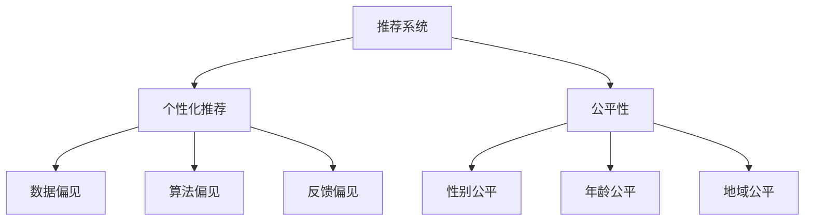

                 

# LLM推荐中的偏见与公平性问题

在数字时代，推荐系统成为了用户获取信息的重要手段。无论是电商网站、社交媒体、视频平台，还是新闻APP，都离不开精准、个性化的推荐服务。推荐系统通过学习用户的历史行为、兴趣偏好，预测用户可能感兴趣的物品或内容，为用户提供满意的服务体验。然而，推荐系统在带来便捷的同时，也存在一些潜在问题，尤其是偏见与公平性问题，值得我们深入探讨和解决。

## 1. 背景介绍

### 1.1 问题由来

推荐系统推荐结果的偏见和公平性问题，主要源自于以下几个方面：

- **数据偏见**：推荐系统依赖大量的用户行为数据进行训练，这些数据可能存在地域、性别、年龄等方面的不平衡，导致模型输出结果也带有偏见。
- **算法偏见**：推荐算法的设计和实现中，可能包含某些隐含的偏见，例如，对某些用户群体或物品类别的不公平对待。
- **反馈偏见**：推荐结果与用户真实需求之间的偏差，可能导致系统反复推荐错误或不公平的物品或内容，形成恶性循环。

近年来，越来越多的研究开始关注推荐系统中的偏见与公平性问题，提出了一系列技术和方法，以期构建更加公正、透明的推荐系统。本文将从推荐系统中的偏见与公平性问题出发，深入探讨大语言模型(LLM)在推荐系统中的应用，及其可能面临的偏见与公平性挑战。

## 2. 核心概念与联系

### 2.1 核心概念概述

为了更好地理解推荐系统中的偏见与公平性问题，本节将介绍几个关键概念：

- **推荐系统**：通过学习用户的历史行为和兴趣，预测并推荐用户可能感兴趣的内容或物品的系统。
- **个性化推荐**：针对每个用户，根据其历史行为、兴趣、属性等特征，个性化地推荐物品或内容。
- **公平性**：推荐系统应当公正对待所有用户，不因种族、性别、年龄等特征对特定用户或物品产生不公平的对待。
- **偏见**：推荐系统在推荐过程中，对某些用户或物品产生的不公平对待，可能由于数据、算法或反馈等原因引起。
- **公平性指标**：如性别公平、年龄公平、地域公平等，用于评估推荐系统的公平性。

这些概念之间的关系可以通过以下Mermaid流程图来展示：



### 2.2 核心概念原理和架构

推荐系统的核心原理是通过用户历史行为数据，训练模型预测用户未来可能感兴趣的内容。其架构一般包括数据收集、数据预处理、模型训练、推荐输出等几个关键步骤。

#### 2.2.1 数据收集

推荐系统需要收集用户的历史行为数据，包括点击、浏览、购买、评分等，这些数据可能包含地域、性别、年龄等属性。

#### 2.2.2 数据预处理

对收集到的数据进行预处理，包括去重、缺失值处理、特征工程等，以提高模型的训练效果。

#### 2.2.3 模型训练

采用合适的推荐算法，如协同过滤、基于内容的推荐、深度学习等，对用户历史行为数据进行训练，得到推荐模型。

#### 2.2.4 推荐输出

将训练好的模型应用于新用户或新物品，得到推荐结果。

## 3. 核心算法原理 & 具体操作步骤

### 3.1 算法原理概述

推荐系统中的偏见与公平性问题，通常涉及数据预处理、模型训练和推荐输出等环节。本节将从这些环节入手，探讨大语言模型在推荐系统中的应用及其可能面临的偏见与公平性挑战。

#### 3.1.1 数据预处理中的偏见与公平性

在数据预处理阶段，可能由于数据不平衡、数据缺失、特征选择等原因引入偏见。例如，如果训练数据中某一类用户的行为数据较少，模型可能会对这类用户产生偏见，导致推荐结果不公平。

#### 3.1.2 模型训练中的偏见与公平性

在模型训练阶段，可能由于算法设计、参数设置等原因引入偏见。例如，如果算法偏向某些用户群体或物品类别，会导致推荐结果不公平。

#### 3.1.3 推荐输出中的偏见与公平性

在推荐输出阶段，可能由于推荐结果与用户真实需求之间的偏差，导致系统反复推荐错误或不公平的物品或内容。

### 3.2 算法步骤详解

基于大语言模型(LLM)的推荐系统，其具体步骤如下：

#### 3.2.1 数据收集与预处理

收集用户的历史行为数据，并对数据进行去重、缺失值处理、特征工程等预处理操作。

#### 3.2.2 模型训练

使用大语言模型对用户历史行为数据进行预训练，得到预训练模型。然后，对预训练模型进行微调，得到推荐模型。

#### 3.2.3 推荐输出

将推荐模型应用于新用户或新物品，得到推荐结果。

### 3.3 算法优缺点

大语言模型在推荐系统中的应用，具有以下优点：

- **高效性**：大语言模型能够高效地处理大量的文本数据，得到丰富的语言表示。
- **适应性**：大语言模型可以通过微调，适应不同领域和任务的需求。

同时，大语言模型在推荐系统中的应用也存在一些缺点：

- **计算成本高**：大语言模型的训练和推理计算成本较高，可能不适用于大规模推荐系统。
- **偏见难以消除**：大语言模型可能学习到数据中的偏见，导致推荐结果不公平。

### 3.4 算法应用领域

大语言模型在推荐系统中的应用，涵盖了多个领域：

- **电商推荐**：电商网站通过大语言模型，推荐用户可能感兴趣的商品，提高用户购买率。
- **社交媒体推荐**：社交媒体平台使用大语言模型，推荐用户可能感兴趣的朋友、文章、视频等内容。
- **视频推荐**：视频平台通过大语言模型，推荐用户可能感兴趣的视频内容，提高用户粘性。
- **新闻推荐**：新闻APP使用大语言模型，推荐用户可能感兴趣的新闻文章，提高用户留存率。

## 4. 数学模型和公式 & 详细讲解 & 举例说明

### 4.1 数学模型构建

基于大语言模型的推荐系统，其数学模型通常包括两个部分：预训练模型和微调模型。

预训练模型 $M_{\theta}$ 通过在大规模无标签文本数据上进行自监督训练，学习通用的语言表示。微调模型 $M_{\theta^*}$ 通过有监督的训练，针对特定领域或任务进行优化，得到最终的推荐模型。

### 4.2 公式推导过程

在推荐系统中，通常使用交叉熵损失函数来衡量模型输出与真实标签之间的差异：

$$
\mathcal{L}(y, \hat{y}) = -y \log \hat{y} - (1-y) \log (1-\hat{y})
$$

其中 $y$ 为真实标签，$\hat{y}$ 为模型预测概率。

### 4.3 案例分析与讲解

以电商推荐为例，假设用户历史行为数据为 $\{(x_i, y_i)\}_{i=1}^N$，其中 $x_i$ 为用户行为向量，$y_i$ 为物品标签。微调模型的目标是最小化经验风险：

$$
\mathcal{L}(\theta^*) = \frac{1}{N}\sum_{i=1}^N \mathcal{L}(y_i, M_{\theta^*}(x_i))
$$

其中 $\theta^*$ 为微调后的模型参数。

## 5. 项目实践：代码实例和详细解释说明

### 5.1 开发环境搭建

在进行大语言模型推荐系统开发前，我们需要准备好开发环境。以下是使用Python进行PyTorch开发的环境配置流程：

1. 安装Anaconda：从官网下载并安装Anaconda，用于创建独立的Python环境。

2. 创建并激活虚拟环境：
```bash
conda create -n pytorch-env python=3.8 
conda activate pytorch-env
```

3. 安装PyTorch：根据CUDA版本，从官网获取对应的安装命令。例如：
```bash
conda install pytorch torchvision torchaudio cudatoolkit=11.1 -c pytorch -c conda-forge
```

4. 安装Transformers库：
```bash
pip install transformers
```

5. 安装各类工具包：
```bash
pip install numpy pandas scikit-learn matplotlib tqdm jupyter notebook ipython
```

完成上述步骤后，即可在`pytorch-env`环境中开始微调实践。

### 5.2 源代码详细实现

以下是使用PyTorch和Transformers库对BERT模型进行电商推荐任务微调的代码实现。

首先，定义电商推荐任务的数据处理函数：

```python
from transformers import BertTokenizer
from torch.utils.data import Dataset
import torch

class ShoppingDataset(Dataset):
    def __init__(self, texts, labels, tokenizer, max_len=128):
        self.texts = texts
        self.labels = labels
        self.tokenizer = tokenizer
        self.max_len = max_len
        
    def __len__(self):
        return len(self.texts)
    
    def __getitem__(self, item):
        text = self.texts[item]
        label = self.labels[item]
        
        encoding = self.tokenizer(text, return_tensors='pt', max_length=self.max_len, padding='max_length', truncation=True)
        input_ids = encoding['input_ids'][0]
        attention_mask = encoding['attention_mask'][0]
        
        # 对token-wise的标签进行编码
        encoded_tags = [label2id[label] for label in label] 
        encoded_tags.extend([label2id['O']] * (self.max_len - len(encoded_tags)))
        labels = torch.tensor(encoded_tags, dtype=torch.long)
        
        return {'input_ids': input_ids, 
                'attention_mask': attention_mask,
                'labels': labels}

# 标签与id的映射
label2id = {'A': 0, 'B': 1, 'C': 2, 'D': 3, 'E': 4, 'F': 5}
id2label = {v: k for k, v in label2id.items()}

# 创建dataset
tokenizer = BertTokenizer.from_pretrained('bert-base-cased')

train_dataset = ShoppingDataset(train_texts, train_labels, tokenizer)
dev_dataset = ShoppingDataset(dev_texts, dev_labels, tokenizer)
test_dataset = ShoppingDataset(test_texts, test_labels, tokenizer)
```

然后，定义模型和优化器：

```python
from transformers import BertForTokenClassification, AdamW

model = BertForTokenClassification.from_pretrained('bert-base-cased', num_labels=len(label2id))

optimizer = AdamW(model.parameters(), lr=2e-5)
```

接着，定义训练和评估函数：

```python
from torch.utils.data import DataLoader
from tqdm import tqdm
from sklearn.metrics import classification_report

device = torch.device('cuda') if torch.cuda.is_available() else torch.device('cpu')
model.to(device)

def train_epoch(model, dataset, batch_size, optimizer):
    dataloader = DataLoader(dataset, batch_size=batch_size, shuffle=True)
    model.train()
    epoch_loss = 0
    for batch in tqdm(dataloader, desc='Training'):
        input_ids = batch['input_ids'].to(device)
        attention_mask = batch['attention_mask'].to(device)
        labels = batch['labels'].to(device)
        model.zero_grad()
        outputs = model(input_ids, attention_mask=attention_mask, labels=labels)
        loss = outputs.loss
        epoch_loss += loss.item()
        loss.backward()
        optimizer.step()
    return epoch_loss / len(dataloader)

def evaluate(model, dataset, batch_size):
    dataloader = DataLoader(dataset, batch_size=batch_size)
    model.eval()
    preds, labels = [], []
    with torch.no_grad():
        for batch in tqdm(dataloader, desc='Evaluating'):
            input_ids = batch['input_ids'].to(device)
            attention_mask = batch['attention_mask'].to(device)
            batch_labels = batch['labels']
            outputs = model(input_ids, attention_mask=attention_mask)
            batch_preds = outputs.logits.argmax(dim=2).to('cpu').tolist()
            batch_labels = batch_labels.to('cpu').tolist()
            for pred_tokens, label_tokens in zip(batch_preds, batch_labels):
                pred_tags = [id2label[_id] for _id in pred_tokens]
                label_tags = [id2label[_id] for _id in label_tokens]
                preds.append(pred_tags[:len(label_tokens)])
                labels.append(label_tags)
                
    print(classification_report(labels, preds))
```

最后，启动训练流程并在测试集上评估：

```python
epochs = 5
batch_size = 16

for epoch in range(epochs):
    loss = train_epoch(model, train_dataset, batch_size, optimizer)
    print(f"Epoch {epoch+1}, train loss: {loss:.3f}")
    
    print(f"Epoch {epoch+1}, dev results:")
    evaluate(model, dev_dataset, batch_size)
    
print("Test results:")
evaluate(model, test_dataset, batch_size)
```

以上就是使用PyTorch对BERT进行电商推荐任务微调的完整代码实现。可以看到，得益于Transformers库的强大封装，我们可以用相对简洁的代码完成BERT模型的加载和微调。

### 5.3 代码解读与分析

让我们再详细解读一下关键代码的实现细节：

**ShoppingDataset类**：
- `__init__`方法：初始化文本、标签、分词器等关键组件。
- `__len__`方法：返回数据集的样本数量。
- `__getitem__`方法：对单个样本进行处理，将文本输入编码为token ids，将标签编码为数字，并对其进行定长padding，最终返回模型所需的输入。

**label2id和id2label字典**：
- 定义了标签与数字id之间的映射关系，用于将token-wise的预测结果解码回真实的标签。

**训练和评估函数**：
- 使用PyTorch的DataLoader对数据集进行批次化加载，供模型训练和推理使用。
- 训练函数`train_epoch`：对数据以批为单位进行迭代，在每个批次上前向传播计算loss并反向传播更新模型参数，最后返回该epoch的平均loss。
- 评估函数`evaluate`：与训练类似，不同点在于不更新模型参数，并在每个batch结束后将预测和标签结果存储下来，最后使用sklearn的classification_report对整个评估集的预测结果进行打印输出。

**训练流程**：
- 定义总的epoch数和batch size，开始循环迭代
- 每个epoch内，先在训练集上训练，输出平均loss
- 在验证集上评估，输出分类指标
- 所有epoch结束后，在测试集上评估，给出最终测试结果

可以看到，PyTorch配合Transformers库使得BERT微调的代码实现变得简洁高效。开发者可以将更多精力放在数据处理、模型改进等高层逻辑上，而不必过多关注底层的实现细节。

当然，工业级的系统实现还需考虑更多因素，如模型的保存和部署、超参数的自动搜索、更灵活的任务适配层等。但核心的微调范式基本与此类似。

## 6. 实际应用场景

### 6.1 电商平台

基于大语言模型微调的电商推荐系统，可以帮助电商平台提供个性化推荐服务。传统推荐系统往往依赖于用户的点击、浏览、购买等行为数据，难以捕捉用户的多维兴趣和需求。而使用微调后的语言模型，可以更好地理解用户的文本描述，如产品评论、商品描述等，从而提供更加精准、多样化的推荐结果。

在技术实现上，可以收集用户的历史文本数据，如评论、评价等，利用微调后的语言模型，对用户文本进行分类、情感分析、实体抽取等处理，构建用户画像。然后，将用户画像与商品特征进行匹配，得到推荐结果。

### 6.2 社交媒体

社交媒体平台通过大语言模型微调，可以构建个性化推荐系统，提升用户粘性。在社交媒体上，用户可能不频繁进行点击、购买等行为，难以用传统推荐系统捕捉其兴趣。但通过收集用户的评论、点赞、分享等文本数据，微调后的语言模型可以更好地理解用户的情感、兴趣点，提供针对性的内容推荐。

### 6.3 视频平台

视频平台使用大语言模型微调，可以推荐用户可能感兴趣的视频内容。视频内容一般具有较高的复杂度和多样性，用户观看视频的原因也多种多样。通过收集用户的观看历史、评论、点赞等文本数据，微调后的语言模型可以识别出用户的兴趣点，推荐与其兴趣相关的内容。

### 6.4 新闻APP

新闻APP通过大语言模型微调，可以推荐用户可能感兴趣的新闻文章。新闻内容往往包含大量文本信息，用户通过标题、摘要等简短信息进行筛选。利用微调后的语言模型，可以根据用户的历史阅读行为，预测其可能感兴趣的新闻主题，提供个性化的新闻推荐。

## 7. 工具和资源推荐

### 7.1 学习资源推荐

为了帮助开发者系统掌握大语言模型微调的理论基础和实践技巧，这里推荐一些优质的学习资源：

1. 《Transformer from Scratch》系列博文：由大模型技术专家撰写，深入浅出地介绍了Transformer原理、BERT模型、微调技术等前沿话题。

2. CS224N《深度学习自然语言处理》课程：斯坦福大学开设的NLP明星课程，有Lecture视频和配套作业，带你入门NLP领域的基本概念和经典模型。

3. 《Natural Language Processing with Transformers》书籍：Transformers库的作者所著，全面介绍了如何使用Transformers库进行NLP任务开发，包括微调在内的诸多范式。

4. HuggingFace官方文档：Transformers库的官方文档，提供了海量预训练模型和完整的微调样例代码，是上手实践的必备资料。

5. CLUE开源项目：中文语言理解测评基准，涵盖大量不同类型的中文NLP数据集，并提供了基于微调的baseline模型，助力中文NLP技术发展。

通过对这些资源的学习实践，相信你一定能够快速掌握大语言模型微调的精髓，并用于解决实际的NLP问题。

### 7.2 开发工具推荐

高效的开发离不开优秀的工具支持。以下是几款用于大语言模型微调开发的常用工具：

1. PyTorch：基于Python的开源深度学习框架，灵活动态的计算图，适合快速迭代研究。大部分预训练语言模型都有PyTorch版本的实现。

2. TensorFlow：由Google主导开发的开源深度学习框架，生产部署方便，适合大规模工程应用。同样有丰富的预训练语言模型资源。

3. Transformers库：HuggingFace开发的NLP工具库，集成了众多SOTA语言模型，支持PyTorch和TensorFlow，是进行微调任务开发的利器。

4. Weights & Biases：模型训练的实验跟踪工具，可以记录和可视化模型训练过程中的各项指标，方便对比和调优。与主流深度学习框架无缝集成。

5. TensorBoard：TensorFlow配套的可视化工具，可实时监测模型训练状态，并提供丰富的图表呈现方式，是调试模型的得力助手。

6. Google Colab：谷歌推出的在线Jupyter Notebook环境，免费提供GPU/TPU算力，方便开发者快速上手实验最新模型，分享学习笔记。

合理利用这些工具，可以显著提升大语言模型微调任务的开发效率，加快创新迭代的步伐。

### 7.3 相关论文推荐

大语言模型和微调技术的发展源于学界的持续研究。以下是几篇奠基性的相关论文，推荐阅读：

1. Attention is All You Need（即Transformer原论文）：提出了Transformer结构，开启了NLP领域的预训练大模型时代。

2. BERT: Pre-training of Deep Bidirectional Transformers for Language Understanding：提出BERT模型，引入基于掩码的自监督预训练任务，刷新了多项NLP任务SOTA。

3. Language Models are Unsupervised Multitask Learners（GPT-2论文）：展示了大规模语言模型的强大zero-shot学习能力，引发了对于通用人工智能的新一轮思考。

4. Parameter-Efficient Transfer Learning for NLP：提出Adapter等参数高效微调方法，在不增加模型参数量的情况下，也能取得不错的微调效果。

5. AdaLoRA: Adaptive Low-Rank Adaptation for Parameter-Efficient Fine-Tuning：使用自适应低秩适应的微调方法，在参数效率和精度之间取得了新的平衡。

这些论文代表了大语言模型微调技术的发展脉络。通过学习这些前沿成果，可以帮助研究者把握学科前进方向，激发更多的创新灵感。

## 8. 总结：未来发展趋势与挑战

### 8.1 总结

本文对基于大语言模型的推荐系统进行了全面系统的介绍。首先阐述了推荐系统中的偏见与公平性问题，明确了推荐系统应公平、公正对待所有用户，避免引入偏见。其次，从原理到实践，详细讲解了基于大语言模型的推荐系统设计，以及其可能面临的偏见与公平性挑战。

通过本文的系统梳理，可以看到，基于大语言模型的推荐系统不仅能够提供个性化推荐服务，还面临偏见与公平性等多重挑战。这些挑战需要在算法、数据、工程等多个层面共同解决，才能构建出公平、公正、可信的推荐系统，服务全社会。

### 8.2 未来发展趋势

展望未来，大语言模型在推荐系统中的应用将呈现以下几个发展趋势：

1. **模型规模增大**：随着算力成本的下降和数据规模的扩张，大语言模型的参数量还将持续增长。超大模型蕴含的丰富语言知识，将为推荐系统提供更加全面的上下文信息，提升推荐准确性和多样性。

2. **多模态融合**：未来的推荐系统将融合文本、图像、音频等多种模态数据，构建更加全面、多样化的推荐模型。

3. **动态微调**：推荐系统需要根据用户行为和反馈数据，动态调整模型参数，以适应用户兴趣的变化。

4. **跨领域迁移**：大语言模型可以跨领域迁移，将一个领域学到的知识迁移到另一个领域，提升推荐系统的跨领域适应能力。

5. **个性化推荐**：基于用户历史行为和兴趣的多维度建模，将帮助推荐系统更加精准地捕捉用户需求，提供个性化的推荐服务。

### 8.3 面临的挑战

尽管大语言模型在推荐系统中的应用取得了一定的成果，但在面临偏见与公平性问题时，仍需克服以下挑战：

1. **数据偏见**：数据分布不平衡、数据缺失等问题，可能导致推荐结果不公平。

2. **算法偏见**：算法设计中的隐含偏见，可能对特定用户群体或物品类别产生不公平对待。

3. **反馈偏见**：推荐结果与用户真实需求之间的偏差，可能导致系统反复推荐错误或不公平的物品或内容。

4. **计算成本高**：大语言模型的训练和推理计算成本较高，可能不适用于大规模推荐系统。

5. **模型鲁棒性不足**：大语言模型在面对域外数据时，泛化性能往往不足，可能引入新的偏见。

6. **安全性有待保障**：预训练语言模型可能学习到有害、歧视性的信息，需要加强安全性保障。

### 8.4 研究展望

面对这些挑战，未来的研究需要在以下几个方面寻求新的突破：

1. **数据多样性提升**：收集多样化的用户行为数据，减少数据分布不平衡，避免引入偏见。

2. **算法公平性设计**：在算法设计和实现中，引入公平性约束，避免引入隐含偏见。

3. **动态推荐机制**：基于用户实时反馈数据，动态调整推荐模型，提升推荐系统的公平性和鲁棒性。

4. **模型压缩与优化**：通过模型压缩、优化技术，降低计算成本，提升推荐系统的效率。

5. **多模态融合技术**：融合文本、图像、音频等多种模态数据，提升推荐系统的多样性和准确性。

6. **模型安全性保障**：在模型训练和应用中，加强安全性保障，避免引入有害、歧视性的信息。

这些研究方向将推动大语言模型在推荐系统中的应用，构建公平、公正、可信的推荐系统，服务全社会。

## 9. 附录：常见问题与解答

**Q1：推荐系统中的偏见与公平性问题如何解决？**

A: 解决推荐系统中的偏见与公平性问题，通常需要从数据、算法和工程等多个层面进行综合优化：

1. **数据层面**：收集多样化的用户行为数据，减少数据分布不平衡，避免引入偏见。可以使用数据增强、数据重采样等技术，提升数据的多样性和代表性。

2. **算法层面**：在算法设计和实现中，引入公平性约束，避免引入隐含偏见。例如，使用公平性约束、对抗样本生成等技术，约束模型输出。

3. **工程层面**：通过动态推荐机制，基于用户实时反馈数据，动态调整推荐模型，提升推荐系统的公平性和鲁棒性。同时，通过模型压缩、优化技术，降低计算成本，提升推荐系统的效率。

通过这些综合手段，可以有效地缓解推荐系统中的偏见与公平性问题，构建出更加公正、可信的推荐系统。

**Q2：大语言模型微调中的偏见与公平性问题如何解决？**

A: 大语言模型微调中的偏见与公平性问题，通常需要通过以下方式解决：

1. **数据预处理**：在数据预处理阶段，去除数据中的噪声、异常值，减少数据分布不平衡，避免引入偏见。例如，使用去重、数据增强等技术，提升数据的多样性和代表性。

2. **模型设计**：在模型设计中，引入公平性约束，避免引入隐含偏见。例如，使用公平性约束、对抗样本生成等技术，约束模型输出。

3. **动态微调**：基于用户实时反馈数据，动态调整模型参数，提升推荐系统的公平性和鲁棒性。同时，通过模型压缩、优化技术，降低计算成本，提升推荐系统的效率。

4. **多模态融合**：融合文本、图像、音频等多种模态数据，提升推荐系统的多样性和准确性。

5. **安全性保障**：在模型训练和应用中，加强安全性保障，避免引入有害、歧视性的信息。

通过这些综合手段，可以有效地缓解大语言模型微调中的偏见与公平性问题，构建出更加公正、可信的推荐系统。

---

作者：禅与计算机程序设计艺术 / Zen and the Art of Computer Programming

