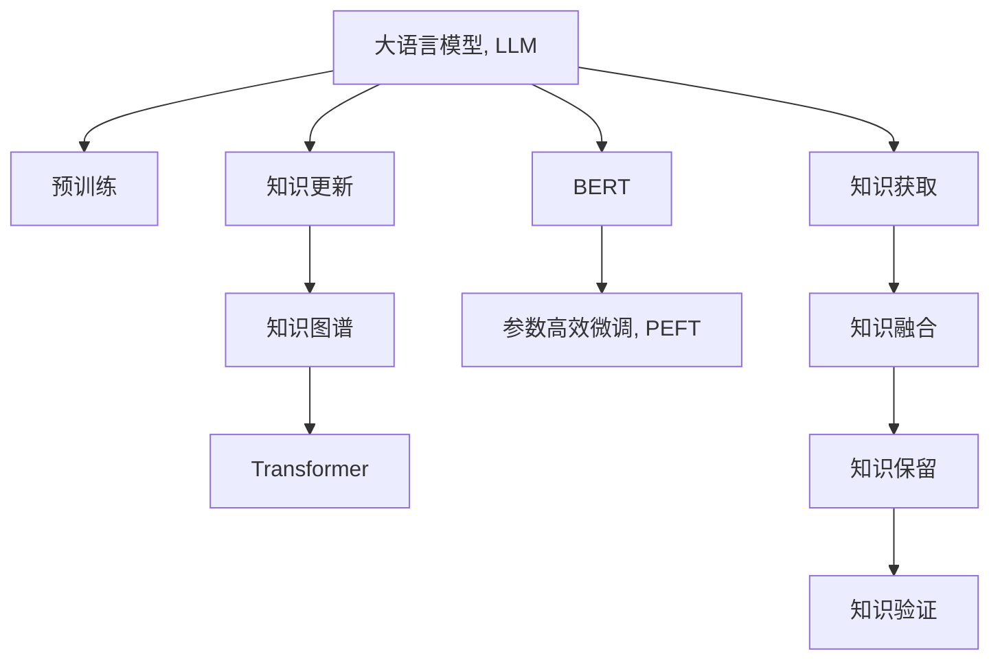

                 

# LLM的知识更新：保持AI信息的时效性

> 关键词：自然语言处理,知识更新,人工智能,机器学习,LLM,知识图谱,Transformer

## 1. 背景介绍

### 1.1 问题由来

在人工智能领域，特别是在自然语言处理（Natural Language Processing, NLP）领域，大语言模型（Large Language Models, LLMs）以其强大的语言理解和生成能力，成为了推动技术进步的重要力量。这些模型基于大规模无标签文本数据进行预训练，学习到了丰富的语言知识，能够胜任翻译、摘要、问答等多种复杂的NLP任务。

然而，随着知识的时效性不断增强，一个模型的知识更新能力显得尤为重要。在快速变化的信息时代，模型需要能够及时更新，以适应新的知识环境。例如，医学领域，随着新药的研发和疾病的发现，医疗模型需要不断地吸收新知识，以确保其诊断和治疗建议的准确性和时效性。同样，金融领域，模型需要追踪市场动态，预测金融趋势，保持最新的市场知识。

大语言模型的知识更新能力，已经成为评估其应用价值的重要指标之一。本文旨在探讨大语言模型知识更新的原理、方法和应用，为开发者和研究者提供全面的技术指导。

### 1.2 问题核心关键点

知识更新是大语言模型保持时效性的关键。其核心在于如何在已有知识的基础上，通过合理的机制吸收新知识，避免模型出现“老化”现象。具体来说，知识更新包括以下几个关键问题：

- **知识获取方式**：如何有效地从新数据源中提取知识？
- **知识融合方法**：如何将新知识融入已有模型，避免冲突和覆盖？
- **知识保留策略**：如何在更新知识的同时，保留模型的基础知识？
- **知识验证机制**：如何验证新知识的正确性和有效性？

本文将详细解答这些问题，并给出实用的知识更新方法，帮助大语言模型在不断变化的知识环境中持续提升性能。

## 2. 核心概念与联系

### 2.1 核心概念概述

为了更好地理解大语言模型的知识更新方法，我们需要首先掌握以下几个核心概念：

- **大语言模型（LLM）**：指基于Transformer架构的深度学习模型，能够学习到丰富的语言知识，并具备强大的语言生成能力。
- **知识更新**：指在已有知识的基础上，通过合理机制吸收新知识，以保持模型的时效性。
- **知识图谱**：以图结构形式组织的知识库，用于存储和推理知识。
- **Transformer**：一种基于自注意力机制的深度学习模型，具有高效的并行计算能力和优异的语言理解能力。
- **BERT**：一种基于自编码机制的预训练语言模型，通过掩码语言建模任务学习语言知识。
- **参数高效微调（PEFT）**：指仅微调模型的顶层，而不更新大部分预训练参数的方法，以提升模型更新效率。

这些核心概念之间的逻辑关系可以通过以下Mermaid流程图来展示：



这个流程图展示了大语言模型知识更新的核心概念及其之间的关系：

1. 大语言模型通过预训练获得基础能力。
2. 知识更新通过知识图谱、Transformer和BERT等技术实现。
3. 参数高效微调提升模型更新效率。
4. 知识获取、融合、保留和验证构成知识更新的全过程。

## 3. 核心算法原理 & 具体操作步骤
### 3.1 算法原理概述

大语言模型的知识更新过程可以视为一个有监督的学习过程。其核心思想是：在已有知识的基础上，通过引入新的标注数据，对模型进行有监督的微调，以更新模型的知识库。

具体而言，知识更新的过程包括以下几个步骤：

1. **数据收集**：从新数据源中收集与模型相关的知识。
2. **数据标注**：对收集到的知识进行标注，生成监督数据集。
3. **微调训练**：在监督数据集上对模型进行微调，更新其知识库。
4. **知识融合**：将新知识与已有知识进行融合，保留模型的基础知识和最新的知识更新。
5. **知识验证**：对新知识进行验证，确保其正确性和有效性。

### 3.2 算法步骤详解

#### 3.2.1 数据收集

知识获取是知识更新的第一步，也是最关键的一步。其目的是从新的数据源中提取有价值的信息，以丰富模型的知识库。

**步骤1：选择数据源**

首先需要确定知识获取的数据源。这些数据源可以是文本、图像、音频等多种类型的数据，取决于具体的应用场景。例如，在医学领域，可以从最新的医学文献、临床试验报告中获取新知识；在金融领域，可以从财经新闻、市场报告中获取最新的市场动态。

**步骤2：提取知识**

从数据源中提取知识的过程可以分为两个阶段：

- **文本数据处理**：将文本数据进行分词、词性标注、命名实体识别等预处理，以便后续分析。
- **知识抽取**：从处理后的文本中抽取有用的信息，如实体关系、事件、属性等。

知识抽取可以采用规则抽取、深度学习抽取和混合抽取等多种方法。例如，可以使用BERT等预训练语言模型对文本进行编码，然后通过分类器进行知识抽取。

#### 3.2.2 数据标注

数据标注是将收集到的知识转化为模型可用的监督信号。其目的是为模型提供有监督的训练数据，使其能够学习新知识。

**步骤1：定义标注格式**

定义好标注的格式，以便将知识转化为模型的输入和输出。例如，可以使用三元组形式表示实体关系，即(实体1, 关系, 实体2)。

**步骤2：标注数据**

对收集到的知识进行标注，生成监督数据集。标注过程可以由人工完成，也可以自动进行。自动标注方法包括：

- **规则标注**：使用规则库对文本进行抽取和标注。
- **半监督标注**：使用预训练模型对文本进行初步标注，然后由人工进行校正和完善。
- **主动学习**：从标注数据中挑选难例，进行主动标注，以提高标注效率。

#### 3.2.3 微调训练

微调训练是通过在监督数据集上训练模型，更新其知识库的过程。其目的是使模型能够利用新知识，提升其在特定任务上的性能。

**步骤1：选择合适的模型**

选择合适的预训练模型作为知识更新的起点。常见的预训练模型包括BERT、GPT等。

**步骤2：设计微调目标**

根据任务需求，设计合适的微调目标函数。例如，对于问答任务，可以将问题-答案对作为训练目标，优化模型的预测能力。

**步骤3：设定训练参数**

设定合适的学习率、批量大小、迭代轮数等训练参数，以确保模型能够稳定收敛。

**步骤4：执行微调训练**

在监督数据集上执行微调训练，更新模型的知识库。微调过程可以使用各种优化算法，如Adam、SGD等。

#### 3.2.4 知识融合

知识融合是将新知识与已有知识进行整合的过程，目的是保留模型的基础知识，同时吸收最新的知识更新。

**步骤1：选择合适的融合方法**

选择合适的知识融合方法，如向量拼接、注意力机制、知识图谱等。向量拼接是将新知识与已有知识的向量进行拼接，注意力机制则是将新知识引入已有模型的注意力机制中。知识图谱则是将新知识映射到图谱中，通过推理获取新知识。

**步骤2：执行知识融合**

执行选定的知识融合方法，更新模型的知识库。

#### 3.2.5 知识验证

知识验证是评估新知识正确性和有效性的过程，目的是确保知识更新不会引入错误或冗余信息。

**步骤1：设计验证数据集**

设计合适的验证数据集，用于评估新知识的性能。验证数据集应包含不同类型的任务，以全面评估新知识的表现。

**步骤2：执行验证**

在验证数据集上执行验证，评估新知识的性能。常见的评估指标包括精度、召回率、F1值等。

**步骤3：调整知识库**

根据验证结果，调整新知识的权重或引入更复杂的验证机制，以提高知识更新的效果。

### 3.3 算法优缺点

大语言模型的知识更新方法具有以下优点：

- **高效性**：相比从头训练模型，微调更新知识库更加高效，可以在较短时间内提升模型性能。
- **泛化能力**：知识更新可以使模型更灵活地适应新任务，提升模型的泛化能力。
- **可解释性**：知识更新过程透明，便于理解模型的变化和更新机制。

同时，该方法也存在一定的局限性：

- **依赖标注数据**：知识更新依赖高质量的标注数据，获取标注数据成本较高。
- **知识融合复杂**：选择合适的知识融合方法较为复杂，需要考虑多种因素。
- **知识验证难度**：知识验证需要设计合适的验证数据集和指标，验证过程较为复杂。

尽管存在这些局限性，但就目前而言，知识更新仍是保持大语言模型时效性的重要方法。未来相关研究的重点在于如何进一步降低对标注数据的依赖，提高知识融合和验证的效率和效果，同时兼顾模型的可解释性和伦理安全性等因素。

### 3.4 算法应用领域

大语言模型的知识更新方法在NLP领域已经得到了广泛的应用，覆盖了几乎所有常见任务，例如：

- **问答系统**：通过微调更新问答模型的知识库，使其能够更好地回答新问题。
- **文本摘要**：通过微调更新摘要模型的知识库，使其能够生成更加准确的摘要。
- **机器翻译**：通过微调更新翻译模型的知识库，使其能够更好地翻译新语言。
- **对话系统**：通过微调更新对话模型的知识库，使其能够更好地理解用户意图，提供更加准确的回复。
- **情感分析**：通过微调更新情感分析模型的知识库，使其能够更好地识别新文本的情感倾向。

除了上述这些经典任务外，知识更新还被创新性地应用到更多场景中，如可控文本生成、常识推理、代码生成、数据增强等，为NLP技术带来了全新的突破。随着知识更新方法的不断进步，相信NLP技术将在更广阔的应用领域大放异彩。

## 4. 数学模型和公式 & 详细讲解  
### 4.1 数学模型构建

本节将使用数学语言对大语言模型的知识更新过程进行更加严格的刻画。

记预训练语言模型为 $M_{\theta}$，其中 $\theta$ 为预训练得到的模型参数。假设新知识获取的数据集为 $D_{\text{new}}=\{(x_i,y_i)\}_{i=1}^N$，其中 $x_i$ 为新知识，$y_i$ 为知识标注。

定义模型 $M_{\theta}$ 在数据样本 $(x,y)$ 上的损失函数为 $\ell(M_{\theta}(x),y)$，则在数据集 $D_{\text{new}}$ 上的经验风险为：

$$
\mathcal{L}_{\text{new}}(\theta) = \frac{1}{N}\sum_{i=1}^N \ell(M_{\theta}(x_i),y_i)
$$

微调的优化目标是最小化经验风险，即找到最优参数：

$$
\theta^* = \mathop{\arg\min}_{\theta} \mathcal{L}_{\text{new}}(\theta)
$$

在实践中，我们通常使用基于梯度的优化算法（如Adam、SGD等）来近似求解上述最优化问题。设 $\eta$ 为学习率，$\lambda$ 为正则化系数，则参数的更新公式为：

$$
\theta \leftarrow \theta - \eta \nabla_{\theta}\mathcal{L}_{\text{new}}(\theta) - \eta\lambda\theta
$$

其中 $\nabla_{\theta}\mathcal{L}_{\text{new}}(\theta)$ 为损失函数对参数 $\theta$ 的梯度，可通过反向传播算法高效计算。

### 4.2 公式推导过程

以下我们以问答任务为例，推导微调更新知识库的损失函数及其梯度的计算公式。

假设模型 $M_{\theta}$ 在输入 $x$ 上的输出为 $\hat{y}=M_{\theta}(x) \in [0,1]$，表示样本属于正类的概率。真实标签 $y \in \{0,1\}$。则二分类交叉熵损失函数定义为：

$$
\ell(M_{\theta}(x),y) = -[y\log \hat{y} + (1-y)\log (1-\hat{y})]
$$

将其代入经验风险公式，得：

$$
\mathcal{L}_{\text{new}}(\theta) = -\frac{1}{N}\sum_{i=1}^N [y_i\log M_{\theta}(x_i)+(1-y_i)\log(1-M_{\theta}(x_i))]
$$

根据链式法则，损失函数对参数 $\theta_k$ 的梯度为：

$$
\frac{\partial \mathcal{L}_{\text{new}}(\theta)}{\partial \theta_k} = -\frac{1}{N}\sum_{i=1}^N (\frac{y_i}{M_{\theta}(x_i)}-\frac{1-y_i}{1-M_{\theta}(x_i)}) \frac{\partial M_{\theta}(x_i)}{\partial \theta_k}
$$

其中 $\frac{\partial M_{\theta}(x_i)}{\partial \theta_k}$ 可进一步递归展开，利用自动微分技术完成计算。

在得到损失函数的梯度后，即可带入参数更新公式，完成模型的迭代优化。重复上述过程直至收敛，最终得到适应新知识库的最优模型参数 $\theta^*$。

## 5. 项目实践：代码实例和详细解释说明
### 5.1 开发环境搭建

在进行知识更新实践前，我们需要准备好开发环境。以下是使用Python进行PyTorch开发的环境配置流程：

1. 安装Anaconda：从官网下载并安装Anaconda，用于创建独立的Python环境。

2. 创建并激活虚拟环境：
```bash
conda create -n pytorch-env python=3.8 
conda activate pytorch-env
```

3. 安装PyTorch：根据CUDA版本，从官网获取对应的安装命令。例如：
```bash
conda install pytorch torchvision torchaudio cudatoolkit=11.1 -c pytorch -c conda-forge
```

4. 安装Transformers库：
```bash
pip install transformers
```

5. 安装各类工具包：
```bash
pip install numpy pandas scikit-learn matplotlib tqdm jupyter notebook ipython
```

完成上述步骤后，即可在`pytorch-env`环境中开始知识更新实践。

### 5.2 源代码详细实现

这里我们以命名实体识别(NER)任务为例，给出使用Transformers库对BERT模型进行知识更新的PyTorch代码实现。

首先，定义NER任务的数据处理函数：

```python
from transformers import BertTokenizer
from torch.utils.data import Dataset
import torch

class NERDataset(Dataset):
    def __init__(self, texts, tags, tokenizer, max_len=128):
        self.texts = texts
        self.tags = tags
        self.tokenizer = tokenizer
        self.max_len = max_len
        
    def __len__(self):
        return len(self.texts)
    
    def __getitem__(self, item):
        text = self.texts[item]
        tags = self.tags[item]
        
        encoding = self.tokenizer(text, return_tensors='pt', max_length=self.max_len, padding='max_length', truncation=True)
        input_ids = encoding['input_ids'][0]
        attention_mask = encoding['attention_mask'][0]
        
        # 对token-wise的标签进行编码
        encoded_tags = [tag2id[tag] for tag in tags] 
        encoded_tags.extend([tag2id['O']] * (self.max_len - len(encoded_tags)))
        labels = torch.tensor(encoded_tags, dtype=torch.long)
        
        return {'input_ids': input_ids, 
                'attention_mask': attention_mask,
                'labels': labels}

# 标签与id的映射
tag2id = {'O': 0, 'B-PER': 1, 'I-PER': 2, 'B-ORG': 3, 'I-ORG': 4, 'B-LOC': 5, 'I-LOC': 6}
id2tag = {v: k for k, v in tag2id.items()}

# 创建dataset
tokenizer = BertTokenizer.from_pretrained('bert-base-cased')

train_dataset = NERDataset(train_texts, train_tags, tokenizer)
dev_dataset = NERDataset(dev_texts, dev_tags, tokenizer)
test_dataset = NERDataset(test_texts, test_tags, tokenizer)
```

然后，定义模型和优化器：

```python
from transformers import BertForTokenClassification, AdamW

model = BertForTokenClassification.from_pretrained('bert-base-cased', num_labels=len(tag2id))

optimizer = AdamW(model.parameters(), lr=2e-5)
```

接着，定义训练和评估函数：

```python
from torch.utils.data import DataLoader
from tqdm import tqdm
from sklearn.metrics import classification_report

device = torch.device('cuda') if torch.cuda.is_available() else torch.device('cpu')
model.to(device)

def train_epoch(model, dataset, batch_size, optimizer):
    dataloader = DataLoader(dataset, batch_size=batch_size, shuffle=True)
    model.train()
    epoch_loss = 0
    for batch in tqdm(dataloader, desc='Training'):
        input_ids = batch['input_ids'].to(device)
        attention_mask = batch['attention_mask'].to(device)
        labels = batch['labels'].to(device)
        model.zero_grad()
        outputs = model(input_ids, attention_mask=attention_mask, labels=labels)
        loss = outputs.loss
        epoch_loss += loss.item()
        loss.backward()
        optimizer.step()
    return epoch_loss / len(dataloader)

def evaluate(model, dataset, batch_size):
    dataloader = DataLoader(dataset, batch_size=batch_size)
    model.eval()
    preds, labels = [], []
    with torch.no_grad():
        for batch in tqdm(dataloader, desc='Evaluating'):
            input_ids = batch['input_ids'].to(device)
            attention_mask = batch['attention_mask'].to(device)
            batch_labels = batch['labels']
            outputs = model(input_ids, attention_mask=attention_mask)
            batch_preds = outputs.logits.argmax(dim=2).to('cpu').tolist()
            batch_labels = batch_labels.to('cpu').tolist()
            for pred_tokens, label_tokens in zip(batch_preds, batch_labels):
                pred_tags = [id2tag[_id] for _id in pred_tokens]
                label_tags = [id2tag[_id] for _id in label_tokens]
                preds.append(pred_tags[:len(label_tags)])
                labels.append(label_tags)
                
    print(classification_report(labels, preds))
```

最后，启动训练流程并在测试集上评估：

```python
epochs = 5
batch_size = 16

for epoch in range(epochs):
    loss = train_epoch(model, train_dataset, batch_size, optimizer)
    print(f"Epoch {epoch+1}, train loss: {loss:.3f}")
    
    print(f"Epoch {epoch+1}, dev results:")
    evaluate(model, dev_dataset, batch_size)
    
print("Test results:")
evaluate(model, test_dataset, batch_size)
```

以上就是使用PyTorch对BERT进行命名实体识别任务知识更新的完整代码实现。可以看到，得益于Transformers库的强大封装，我们可以用相对简洁的代码完成BERT模型的加载和知识更新。

### 5.3 代码解读与分析

让我们再详细解读一下关键代码的实现细节：

**NERDataset类**：
- `__init__`方法：初始化文本、标签、分词器等关键组件。
- `__len__`方法：返回数据集的样本数量。
- `__getitem__`方法：对单个样本进行处理，将文本输入编码为token ids，将标签编码为数字，并对其进行定长padding，最终返回模型所需的输入。

**tag2id和id2tag字典**：
- 定义了标签与数字id之间的映射关系，用于将token-wise的预测结果解码回真实的标签。

**训练和评估函数**：
- 使用PyTorch的DataLoader对数据集进行批次化加载，供模型训练和推理使用。
- 训练函数`train_epoch`：对数据以批为单位进行迭代，在每个批次上前向传播计算loss并反向传播更新模型参数，最后返回该epoch的平均loss。
- 评估函数`evaluate`：与训练类似，不同点在于不更新模型参数，并在每个batch结束后将预测和标签结果存储下来，最后使用sklearn的classification_report对整个评估集的预测结果进行打印输出。

**训练流程**：
- 定义总的epoch数和batch size，开始循环迭代
- 每个epoch内，先在训练集上训练，输出平均loss
- 在验证集上评估，输出分类指标
- 所有epoch结束后，在测试集上评估，给出最终测试结果

可以看到，PyTorch配合Transformers库使得BERT知识更新的代码实现变得简洁高效。开发者可以将更多精力放在数据处理、模型改进等高层逻辑上，而不必过多关注底层的实现细节。

当然，工业级的系统实现还需考虑更多因素，如模型的保存和部署、超参数的自动搜索、更灵活的任务适配层等。但核心的知识更新范式基本与此类似。

## 6. 实际应用场景
### 6.1 智能客服系统

基于大语言模型知识更新的对话技术，可以广泛应用于智能客服系统的构建。传统客服往往需要配备大量人力，高峰期响应缓慢，且一致性和专业性难以保证。而使用知识更新的对话模型，可以7x24小时不间断服务，快速响应客户咨询，用自然流畅的语言解答各类常见问题。

在技术实现上，可以收集企业内部的历史客服对话记录，将问题和最佳答复构建成监督数据，在此基础上对预训练对话模型进行知识更新。知识更新后的对话模型能够自动理解用户意图，匹配最合适的答案模板进行回复。对于客户提出的新问题，还可以接入检索系统实时搜索相关内容，动态组织生成回答。如此构建的智能客服系统，能大幅提升客户咨询体验和问题解决效率。

### 6.2 金融舆情监测

金融机构需要实时监测市场舆论动向，以便及时应对负面信息传播，规避金融风险。传统的人工监测方式成本高、效率低，难以应对网络时代海量信息爆发的挑战。基于大语言模型知识更新的文本分类和情感分析技术，为金融舆情监测提供了新的解决方案。

具体而言，可以收集金融领域相关的新闻、报道、评论等文本数据，并对其进行主题标注和情感标注。在此基础上对预训练语言模型进行知识更新，使其能够自动判断文本属于何种主题，情感倾向是正面、中性还是负面。将知识更新后的模型应用到实时抓取的网络文本数据，就能够自动监测不同主题下的情感变化趋势，一旦发现负面信息激增等异常情况，系统便会自动预警，帮助金融机构快速应对潜在风险。

### 6.3 个性化推荐系统

当前的推荐系统往往只依赖用户的历史行为数据进行物品推荐，无法深入理解用户的真实兴趣偏好。基于大语言模型知识更新的个性化推荐系统，可以更好地挖掘用户行为背后的语义信息，从而提供更精准、多样的推荐内容。

在实践中，可以收集用户浏览、点击、评论、分享等行为数据，提取和用户交互的物品标题、描述、标签等文本内容。将文本内容作为模型输入，用户的后续行为（如是否点击、购买等）作为监督信号，在此基础上微调预训练语言模型。知识更新后的模型能够从文本内容中准确把握用户的兴趣点。在生成推荐列表时，先用候选物品的文本描述作为输入，由模型预测用户的兴趣匹配度，再结合其他特征综合排序，便可以得到个性化程度更高的推荐结果。

### 6.4 未来应用展望

随着大语言模型知识更新方法的不断发展，其在更多领域的应用前景广阔。

在智慧医疗领域，基于知识更新的医疗问答、病历分析、药物研发等应用将提升医疗服务的智能化水平，辅助医生诊疗，加速新药开发进程。

在智能教育领域，知识更新技术可应用于作业批改、学情分析、知识推荐等方面，因材施教，促进教育公平，提高教学质量。

在智慧城市治理中，知识更新模型可应用于城市事件监测、舆情分析、应急指挥等环节，提高城市管理的自动化和智能化水平，构建更安全、高效的未来城市。

此外，在企业生产、社会治理、文娱传媒等众多领域，基于大语言模型知识更新的人工智能应用也将不断涌现，为经济社会发展注入新的动力。相信随着技术的日益成熟，知识更新方法将成为人工智能落地应用的重要范式，推动人工智能技术向更广阔的领域加速渗透。

## 7. 工具和资源推荐
### 7.1 学习资源推荐

为了帮助开发者系统掌握大语言模型知识更新的理论基础和实践技巧，这里推荐一些优质的学习资源：

1. 《Transformer从原理到实践》系列博文：由大模型技术专家撰写，深入浅出地介绍了Transformer原理、BERT模型、知识更新技术等前沿话题。

2. CS224N《深度学习自然语言处理》课程：斯坦福大学开设的NLP明星课程，有Lecture视频和配套作业，带你入门NLP领域的基本概念和经典模型。

3. 《Natural Language Processing with Transformers》书籍：Transformers库的作者所著，全面介绍了如何使用Transformers库进行NLP任务开发，包括知识更新在内的诸多范式。

4. HuggingFace官方文档：Transformers库的官方文档，提供了海量预训练模型和完整的知识更新样例代码，是上手实践的必备资料。

5. CLUE开源项目：中文语言理解测评基准，涵盖大量不同类型的中文NLP数据集，并提供了基于知识更新的baseline模型，助力中文NLP技术发展。

通过对这些资源的学习实践，相信你一定能够快速掌握大语言模型知识更新的精髓，并用于解决实际的NLP问题。
###  7.2 开发工具推荐

高效的开发离不开优秀的工具支持。以下是几款用于大语言模型知识更新的常用工具：

1. PyTorch：基于Python的开源深度学习框架，灵活动态的计算图，适合快速迭代研究。大部分预训练语言模型都有PyTorch版本的实现。

2. TensorFlow：由Google主导开发的开源深度学习框架，生产部署方便，适合大规模工程应用。同样有丰富的预训练语言模型资源。

3. Transformers库：HuggingFace开发的NLP工具库，集成了众多SOTA语言模型，支持PyTorch和TensorFlow，是进行知识更新任务开发的利器。

4. Weights & Biases：模型训练的实验跟踪工具，可以记录和可视化模型训练过程中的各项指标，方便对比和调优。与主流深度学习框架无缝集成。

5. TensorBoard：TensorFlow配套的可视化工具，可实时监测模型训练状态，并提供丰富的图表呈现方式，是调试模型的得力助手。

6. Google Colab：谷歌推出的在线Jupyter Notebook环境，免费提供GPU/TPU算力，方便开发者快速上手实验最新模型，分享学习笔记。

合理利用这些工具，可以显著提升大语言模型知识更新的开发效率，加快创新迭代的步伐。

### 7.3 相关论文推荐

大语言模型知识更新技术的发展源于学界的持续研究。以下是几篇奠基性的相关论文，推荐阅读：

1. Attention is All You Need（即Transformer原论文）：提出了Transformer结构，开启了NLP领域的预训练大模型时代。

2. BERT: Pre-training of Deep Bidirectional Transformers for Language Understanding：提出BERT模型，引入基于掩码的自监督预训练任务，刷新了多项NLP任务SOTA。

3. Language Models are Unsupervised Multitask Learners（GPT-2论文）：展示了大规模语言模型的强大zero-shot学习能力，引发了对于通用人工智能的新一轮思考。

4. Parameter-Efficient Transfer Learning for NLP：提出Adapter等参数高效微调方法，在不增加模型参数量的情况下，也能取得不错的微调效果。

5. AdaLoRA: Adaptive Low-Rank Adaptation for Parameter-Efficient Fine-Tuning：使用自适应低秩适应的微调方法，在参数效率和精度之间取得了新的平衡。

6. Prefix-Tuning: Optimizing Continuous Prompts for Generation：引入基于连续型Prompt的知识更新方法，为如何充分利用预训练知识提供了新的思路。

这些论文代表了大语言模型知识更新技术的发展脉络。通过学习这些前沿成果，可以帮助研究者把握学科前进方向，激发更多的创新灵感。

## 8. 总结：未来发展趋势与挑战
### 8.1 总结

本文对大语言模型知识更新的原理、方法和应用进行了全面系统的介绍。首先阐述了大语言模型知识更新的研究背景和意义，明确了知识更新在保持模型时效性方面的重要价值。其次，从原理到实践，详细讲解了知识更新的数学原理和关键步骤，给出了知识更新任务开发的完整代码实例。同时，本文还广泛探讨了知识更新方法在智能客服、金融舆情、个性化推荐等多个行业领域的应用前景，展示了知识更新范式的巨大潜力。此外，本文精选了知识更新技术的各类学习资源，力求为开发者提供全方位的技术指引。

通过本文的系统梳理，可以看到，基于大语言模型的知识更新方法正在成为NLP领域的重要范式，极大地拓展了预训练语言模型的应用边界，催生了更多的落地场景。受益于大规模语料的预训练和知识更新的优势，知识更新模型在NLP任务上取得了优异的性能，推动了NLP技术的产业化进程。未来，伴随知识更新方法的不断演进，大语言模型将能够在更广泛的应用领域持续提升性能，为人类认知智能的进化带来深远影响。

### 8.2 未来发展趋势

展望未来，大语言模型知识更新技术将呈现以下几个发展趋势：

1. **模型规模持续增大**：随着算力成本的下降和数据规模的扩张，预训练语言模型的参数量还将持续增长。超大规模语言模型蕴含的丰富语言知识，有望支撑更加复杂多变的知识更新。

2. **知识更新方法日趋多样**：除了传统的全参数微调外，未来会涌现更多参数高效的微调方法，如Prefix-Tuning、LoRA等，在节省计算资源的同时也能保证知识更新的精度。

3. **持续学习成为常态**：随着数据分布的不断变化，知识更新模型也需要持续学习新知识以保持性能。如何在不遗忘原有知识的同时，高效吸收新样本信息，将成为重要的研究课题。

4. **标注样本需求降低**：受启发于提示学习(Prompt-based Learning)的思路，未来的知识更新方法将更好地利用大模型的语言理解能力，通过更加巧妙的任务描述，在更少的标注样本上也能实现理想的知识更新效果。

5. **多模态知识更新崛起**：当前的知识更新主要聚焦于纯文本数据，未来会进一步拓展到图像、视频、语音等多种模态数据知识更新。多模态信息的融合，将显著提升语言模型对现实世界的理解和建模能力。

6. **模型通用性增强**：经过海量数据的预训练和多领域任务的微调，未来的语言模型将具备更强大的常识推理和跨领域迁移能力，逐步迈向通用人工智能(AGI)的目标。

以上趋势凸显了大语言模型知识更新技术的广阔前景。这些方向的探索发展，必将进一步提升大语言模型的知识更新效率和效果，为NLP技术的落地应用提供更有力的支撑。

### 8.3 面临的挑战

尽管大语言模型知识更新技术已经取得了瞩目成就，但在迈向更加智能化、普适化应用的过程中，它仍面临着诸多挑战：

1. **标注成本瓶颈**：尽管知识更新方法相比于从头训练模型效率更高，但获取高质量的标注数据仍然是一个瓶颈。如何进一步降低知识更新对标注数据的依赖，将是一大难题。

2. **知识融合复杂**：选择合适的知识融合方法较为复杂，需要考虑多种因素，如新知识的粒度、更新频率等。

3. **知识验证难度**：知识验证需要设计合适的验证数据集和指标，验证过程较为复杂，且验证结果可能存在误差。

4. **知识更新效果评估**：知识更新效果评估需要综合考虑多方面的因素，如新知识的时效性、模型在新知识上的性能等，难度较大。

5. **模型可解释性不足**：知识更新后的模型往往具有较深的层次，难以解释其内部工作机制和决策逻辑，对于高风险应用尤为重要。

6. **模型安全性有待保障**：知识更新模型可能会学习到有害信息，如何从数据和算法层面消除模型偏见，避免恶意用途，确保输出的安全性，也将是重要的研究课题。

正视知识更新面临的这些挑战，积极应对并寻求突破，将是大语言模型知识更新技术迈向成熟的必由之路。相信随着学界和产业界的共同努力，这些挑战终将一一被克服，大语言模型知识更新技术必将在构建智能交互系统的未来中扮演越来越重要的角色。

### 8.4 研究展望

面对大语言模型知识更新所面临的种种挑战，未来的研究需要在以下几个方面寻求新的突破：

1. **探索无监督和半监督知识更新方法**：摆脱对大规模标注数据的依赖，利用自监督学习、主动学习等无监督和半监督范式，最大限度利用非结构化数据，实现更加灵活高效的知识更新。

2. **研究参数高效和计算高效的更新范式**：开发更加参数高效的更新方法，在固定大部分预训练参数的同时，只更新极少量的任务相关参数。同时优化知识更新的计算图，减少前向传播和反向传播的资源消耗，实现更加轻量级、实时性的部署。

3. **融合因果和对比学习范式**：通过引入因果推断和对比学习思想，增强知识更新模型建立稳定因果关系的能力，学习更加普适、鲁棒的语言表征，从而提升模型泛化性和抗干扰能力。

4. **引入更多先验知识**：将符号化的先验知识，如知识图谱、逻辑规则等，与神经网络模型进行巧妙融合，引导知识更新过程学习更准确、合理的语言模型。同时加强不同模态数据的整合，实现视觉、语音等多模态信息与文本信息的协同建模。

5. **结合因果分析和博弈论工具**：将因果分析方法引入知识更新模型，识别出模型决策的关键特征，增强输出解释的因果性和逻辑性。借助博弈论工具刻画人机交互过程，主动探索并规避模型的脆弱点，提高系统稳定性。

6. **纳入伦理道德约束**：在模型训练目标中引入伦理导向的评估指标，过滤和惩罚有偏见、有害的输出倾向。同时加强人工干预和审核，建立模型行为的监管机制，确保输出符合人类价值观和伦理道德。

这些研究方向的探索，必将引领大语言模型知识更新技术迈向更高的台阶，为构建安全、可靠、可解释、可控的智能系统铺平道路。面向未来，大语言模型知识更新技术还需要与其他人工智能技术进行更深入的融合，如知识表示、因果推理、强化学习等，多路径协同发力，共同推动自然语言理解和智能交互系统的进步。只有勇于创新、敢于突破，才能不断拓展语言模型的边界，让智能技术更好地造福人类社会。

## 9. 附录：常见问题与解答

**Q1：大语言模型知识更新是否适用于所有NLP任务？**

A: 大语言模型知识更新在大多数NLP任务上都能取得不错的效果，特别是对于数据量较小的任务。但对于一些特定领域的任务，如医学、法律等，仅仅依靠通用语料预训练的模型可能难以很好地适应。此时需要在特定领域语料上进一步预训练，再进行知识更新，才能获得理想效果。此外，对于一些需要时效性、个性化很强的任务，如对话、推荐等，知识更新方法也需要针对性的改进优化。

**Q2：知识更新过程中如何选择合适的融合方法？**

A: 选择合适的知识融合方法需要考虑多个因素，如新知识的粒度、更新频率、模型的架构等。常见的融合方法包括向量拼接、注意力机制、知识图谱等。

- **向量拼接**：将新知识与已有知识的向量进行拼接，适用于文本数据。
- **注意力机制**：将新知识引入已有模型的注意力机制中，适用于图像、视频等模态数据。
- **知识图谱**：将新知识映射到图谱中，通过推理获取新知识，适用于需要结构化知识的任务。

需要根据具体任务的特点选择合适的融合方法。

**Q3：知识更新过程中如何验证新知识的正确性和有效性？**

A: 知识更新过程中的知识验证需要设计合适的验证数据集和指标，验证过程较为复杂，但至关重要。

- **验证数据集**：需要设计包含新知识的验证数据集，用于评估模型在新知识上的性能。
- **验证指标**：常见的评估指标包括精度、召回率、F1值等。
- **验证过程**：在验证数据集上执行验证，评估模型在新知识上的性能。

**Q4：知识更新过程中如何处理模型的过拟合问题？**

A: 知识更新过程中可能会遇到模型的过拟合问题，特别是在数据量较小的情况下。为避免过拟合，可以采用以下策略：

- **数据增强**：通过回译、近义替换等方式扩充训练集，增加数据多样性。
- **正则化**：使用L2正则、Dropout等技术，避免模型过拟合。
- **早停机制**：设定早停阈值，一旦验证集上的性能不再提升，立即停止训练。

这些策略可以有效缓解知识更新过程中的过拟合问题。

**Q5：知识更新后的模型在实际部署时需要注意哪些问题？**

A: 将知识更新后的模型转化为实际应用，还需要考虑以下因素：

- **模型裁剪**：去除不必要的层和参数，减小模型尺寸，加快推理速度。
- **量化加速**：将浮点模型转为定点模型，压缩存储空间，提高计算效率。
- **服务化封装**：将模型封装为标准化服务接口，便于集成调用。
- **弹性伸缩**：根据请求流量动态调整资源配置，平衡服务质量和成本。
- **监控告警**：实时采集系统指标，设置异常告警阈值，确保服务稳定性。

这些措施可以有效提升知识更新后模型的实际部署效率和效果。

