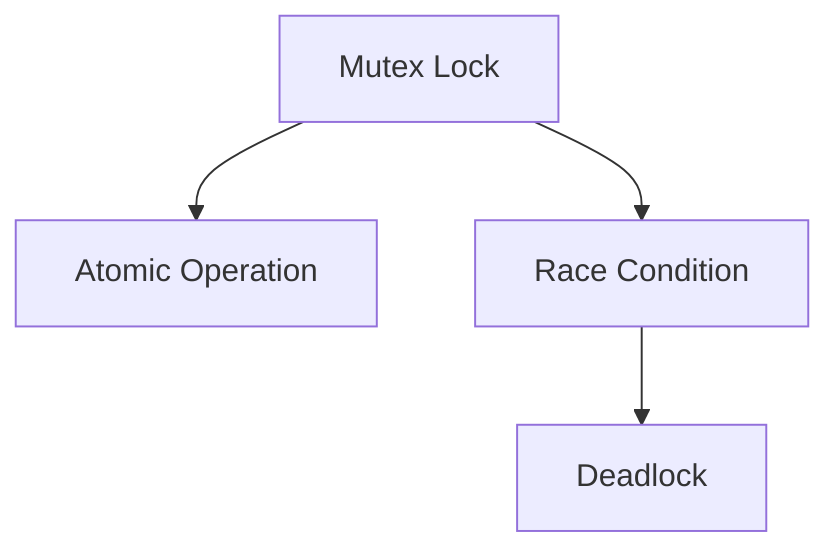

                 

# LLM的线程安全问题与解决思路

> 关键词：多线程安全, 语言模型, 并行计算, 分布式系统, 互斥锁, 原子操作

## 1. 背景介绍

在当今高性能计算和人工智能的迅猛发展中，多线程并行计算成为了提高算法执行效率的重要手段。特别是在大语言模型（Large Language Models, LLMs）中，由于模型通常拥有数十亿甚至数百亿的参数，通过多线程并行计算，可以显著加速模型的训练、推理和优化过程。然而，多线程并行计算也带来了线程安全问题，即多个线程之间可能同时访问和修改同一数据结构，导致数据不一致和计算结果错误。

多线程并行计算的线程安全问题通常会在以下场景中出现：
- 多个线程同时写入同一份共享数据，例如模型参数、训练数据、缓存等。
- 多线程间的数据交换和同步，例如共享内存、队列等。
- 多线程并发读写同一资源，例如文件、数据库等。

在多线程并行计算中，数据一致性问题通常会通过加锁机制来解决，即通过互斥锁（Mutex Lock）或者原子操作（Atomic Operation）等手段来保护共享资源的访问，确保同一时间只有一个线程能够访问和修改该资源。

## 2. 核心概念与联系

### 2.1 核心概念概述

为更好地理解多线程并行计算中的线程安全问题，我们首先介绍一些关键概念：

- 互斥锁（Mutex Lock）：一种同步机制，用于保护共享资源的访问，确保同一时间只有一个线程能够访问和修改该资源。
- 原子操作（Atomic Operation）：一种特殊的操作，保证在执行期间不会被其他线程中断，从而保证数据的一致性。
- 竞态条件（Race Condition）：多个线程同时访问和修改同一份共享数据，导致数据不一致和计算结果错误的现象。
- 死锁（Deadlock）：两个或多个线程相互等待对方释放资源，导致所有线程都无法继续执行的现象。

这些概念之间的逻辑关系可以通过以下Mermaid流程图来展示：



这个流程图展示了大语言模型多线程并行计算中的核心概念及其之间的关系：

1. 互斥锁用于保护共享资源的访问，防止竞态条件。
2. 原子操作保证在执行期间不会被其他线程中断，从而避免竞态条件。
3. 竞态条件是由于多个线程同时访问和修改同一份共享数据导致的现象。
4. 死锁是由于两个或多个线程相互等待对方释放资源导致的现象。

## 3. 核心算法原理 & 具体操作步骤

### 3.1 算法原理概述

在大语言模型中，通常采用分布式训练方式，通过多台计算节点进行并行计算。每个计算节点会通过共享数据和通信网络来协同工作。在多线程并行计算中，线程安全问题通常发生在对共享数据的访问和修改过程中。因此，多线程并行计算的线程安全问题需要通过加锁机制来解决。

在大语言模型的训练和推理过程中，通常会使用以下两种加锁机制：

- 互斥锁（Mutex Lock）：在访问共享资源前，使用互斥锁对资源进行加锁，确保同一时间只有一个线程能够访问和修改该资源。
- 原子操作（Atomic Operation）：在访问共享资源时，使用原子操作来保证操作期间不会被其他线程中断，从而保证数据的一致性。

### 3.2 算法步骤详解

多线程并行计算的线程安全问题主要通过以下步骤来解决：

**Step 1: 数据共享设计**
- 设计共享数据结构，明确各个线程对共享数据的访问和修改权限。
- 对于共享资源，确定线程之间的读写顺序和锁粒度。

**Step 2: 加锁机制选择**
- 根据共享数据的特点，选择合适的加锁机制。
- 对于需要频繁读写的共享资源，通常使用读写锁（Read-Write Lock）。
- 对于需要独占访问的共享资源，通常使用互斥锁。

**Step 3: 加锁操作编写**
- 在访问共享资源前，进行加锁操作。
- 在访问共享资源后，进行解锁操作。
- 使用条件变量（Condition Variable）进行线程同步，避免无意义的等待。

**Step 4: 加锁与解锁的正确性**
- 确保加锁和解锁操作符合原子性，避免死锁和竞态条件。
- 避免加锁和解锁操作顺序错误，导致数据不一致。

**Step 5: 性能优化**
- 使用读写锁来提高读操作的并发性能。
- 使用锁粒度最小的锁策略，避免过度加锁导致性能下降。
- 使用无锁算法（Lock-free Algorithm）来进一步提升性能。

### 3.3 算法优缺点

多线程并行计算的线程安全问题解决方案具有以下优点：

- 有效保证共享数据的一致性，避免竞态条件和死锁。
- 提供可靠的同步机制，确保多线程之间的协作。

同时，该方法也存在一定的局限性：

- 锁的粒度和范围需要仔细设计，否则可能导致性能下降。
- 死锁问题难以彻底避免，需要仔细分析和管理。
- 加锁和解锁操作增加了额外的开销，可能会影响性能。

## 4. 数学模型和公式 & 详细讲解

### 4.1 数学模型构建

在多线程并行计算中，通常使用读写锁来提高读操作的并发性能。读写锁的基本原理是：允许多个线程同时读取共享数据，但只允许一个线程进行写操作。以下是读写锁的数学模型：

$$
\text{Lock}_\text{read}(x): \text{若所有线程正在读操作}，\text{则返回True，否则等待并加锁}
$$

$$
\text{Lock}_\text{write}(x): \text{若所有线程正在写操作，则等待并加锁；否则加锁并返回True}
$$

$$
\text{Unlock}_\text{read}(x): \text{解锁并释放锁}
$$

$$
\text{Unlock}_\text{write}(x): \text{解锁并释放锁}
$$

### 4.2 公式推导过程

根据读写锁的定义，我们可以推导出读写锁的使用流程：

1. 读操作流程：
   - 线程A、B、C等多个线程同时进行读操作，则不需要加锁，直接访问共享数据。
   - 线程D尝试进行写操作，需要等待锁释放后进行加锁。
   - 线程E尝试进行写操作，需要等待锁释放后进行加锁。
   - 线程A、B、C结束读操作后，释放锁。
   - 线程D、E获取锁后，进行写操作。

2. 写操作流程：
   - 线程A、B、C等多个线程同时进行读操作，不需要加锁。
   - 线程D尝试进行写操作，需要等待锁释放后进行加锁。
   - 线程E尝试进行写操作，需要等待锁释放后进行加锁。
   - 线程D、E获取锁后，进行写操作。

### 4.3 案例分析与讲解

以大语言模型的参数更新为例，我们可以分析读写锁的实际应用。在大语言模型的训练过程中，每个线程需要更新模型参数，同时更新模型参数需要读取训练数据。因此，可以使用读写锁来保证参数更新的线程安全和读取数据的并发性能。

**示例代码**：

```python
import threading

class SharedModel:
    def __init__(self):
        self.mutex = threading.Lock()
        self.params = {}
        
    def update_params(self, param_name, value):
        with self.mutex:
            self.params[param_name] = value
            
    def read_params(self, param_name):
        with self.mutex:
            return self.params[param_name]
```

在上述代码中，`update_params`方法用于更新模型参数，使用`self.mutex`进行互斥锁保护。`read_params`方法用于读取模型参数，同样使用`self.mutex`进行互斥锁保护。在多个线程同时更新参数或读取参数时，可以避免竞态条件和死锁问题。

## 5. 项目实践：代码实例和详细解释说明

### 5.1 开发环境搭建

在进行多线程并行计算的线程安全问题实践前，我们需要准备好开发环境。以下是使用Python进行多线程计算的环境配置流程：

1. 安装Python：从官网下载并安装Python。
2. 安装多线程库：安装`threading`和`multiprocessing`库，用于多线程和分布式计算。
3. 安装共享内存库：安装`multiprocessing`和`multiprocessing.shared_memory`库，用于共享内存。
4. 安装调试工具：安装`pdb`库，用于调试和测试。

完成上述步骤后，即可在Python环境中进行多线程并行计算的线程安全问题实践。

### 5.2 源代码详细实现

下面以共享内存和读写锁为例，展示多线程并行计算的线程安全问题代码实现。

**共享内存实现**：

```python
import multiprocessing
import ctypes

def shared_mem_init():
    mem = multiprocessing.shared_memory.SharedMemory(name='shared_mem', size=10000)
    return mem

def write_shared_mem(mem, value):
    mem.value = ctypes.c_int(value)

def read_shared_mem(mem):
    return mem.value
```

在上述代码中，`shared_mem_init`函数用于创建共享内存，`write_shared_mem`函数用于写入共享内存，`read_shared_mem`函数用于读取共享内存。在多个进程之间，可以通过共享内存进行数据交换。

**读写锁实现**：

```python
import threading

class SharedLock:
    def __init__(self):
        self.read_lock = threading.Lock()
        self.write_lock = threading.Lock()
    
    def lock_read(self):
        self.read_lock.acquire()
        self.read_lock.release()
    
    def lock_write(self):
        self.write_lock.acquire()
        self.write_lock.release()
```

在上述代码中，`SharedLock`类用于创建读写锁，`lock_read`方法用于读取共享数据，`lock_write`方法用于写入共享数据。在读操作时，使用`self.read_lock`进行互斥锁保护，在写操作时，使用`self.write_lock`进行互斥锁保护。

### 5.3 代码解读与分析

让我们再详细解读一下关键代码的实现细节：

**共享内存实现**：
- `shared_mem_init`函数创建共享内存对象，并返回共享内存的句柄。
- `write_shared_mem`函数通过共享内存的句柄直接修改共享数据。
- `read_shared_mem`函数通过共享内存的句柄读取共享数据。

**读写锁实现**：
- `SharedLock`类定义了读写锁对象，包含`read_lock`和`write_lock`两个互斥锁。
- `lock_read`方法使用`self.read_lock`进行互斥锁保护，读取共享数据。
- `lock_write`方法使用`self.write_lock`进行互斥锁保护，写入共享数据。

可以看到，多线程并行计算的线程安全问题实践涉及到共享内存和读写锁等关键技术，需要仔细设计和实现。开发者应该根据具体任务，选择合适的加锁机制，确保多线程之间的协作和数据一致性。

## 6. 实际应用场景

### 6.1 分布式训练

在大规模语言模型的分布式训练中，多线程并行计算的线程安全问题尤为关键。由于多台计算节点需要通过网络通信进行数据交换，因此需要采用读写锁来保证数据的正确性和一致性。

在分布式训练中，通常会将训练数据划分为多个子集，每个计算节点负责处理一个子集的数据。在每个计算节点中，多线程并行计算可以显著提高训练效率。使用读写锁可以保证各个节点之间的数据同步和共享，避免竞态条件和死锁问题。

### 6.2 实时推理

在大语言模型的实时推理中，多线程并行计算的线程安全问题也非常重要。由于推理任务需要快速响应用户请求，因此需要采用读写锁来保证数据的一致性和计算的正确性。

在实时推理中，通常会将推理任务分配到多个计算线程中，每个线程负责处理一个用户请求。使用读写锁可以保证各个线程之间的数据同步和共享，避免竞态条件和死锁问题。

### 6.3 分布式预测

在大语言模型的分布式预测中，多线程并行计算的线程安全问题同样重要。由于预测任务需要快速响应用户请求，因此需要采用读写锁来保证数据的一致性和计算的正确性。

在分布式预测中，通常会将预测任务分配到多个计算线程中，每个线程负责处理一个用户请求。使用读写锁可以保证各个线程之间的数据同步和共享，避免竞态条件和死锁问题。

## 7. 工具和资源推荐

### 7.1 学习资源推荐

为了帮助开发者系统掌握多线程并行计算的线程安全问题，这里推荐一些优质的学习资源：

1. Python官方文档：详细介绍了`threading`和`multiprocessing`库的使用方法，提供了丰富的示例代码。
2. CPython官方文档：详细介绍了多线程和多进程的实现原理，提供了丰富的示例代码。
3. `multiprocessing`官方文档：详细介绍了`multiprocessing`库的使用方法，提供了丰富的示例代码。
4. 《Python并发编程实战》书籍：深入浅出地介绍了Python多线程和异步编程的技术细节，提供了大量的实用示例。
5. 《Python并行计算与分布式系统》书籍：全面介绍了Python多线程和分布式计算的技术细节，提供了大量的实用示例。

通过对这些资源的学习实践，相信你一定能够快速掌握多线程并行计算的线程安全问题，并用于解决实际的NLP问题。

### 7.2 开发工具推荐

高效的多线程并行计算离不开优秀的工具支持。以下是几款用于多线程并行计算的常用工具：

1. `threading`：Python内置的多线程库，提供简单易用的API。
2. `multiprocessing`：Python内置的多进程库，提供高效的并发计算能力。
3. `gunicorn`：一个基于`uWSGI`的多线程Web服务器，适用于高并发应用。
4. `Tornado`：一个基于`multiprocessing`的异步网络框架，适用于高并发的Web应用。
5. `cct`：一个基于`multiprocessing`的多线程任务调度器，适用于高并发的数据处理任务。
6. `ray`：一个基于`multiprocessing`和`actor`的分布式计算框架，适用于大规模的并行计算任务。

合理利用这些工具，可以显著提升多线程并行计算的效率和可靠性，加快创新迭代的步伐。

### 7.3 相关论文推荐

多线程并行计算的线程安全问题研究源于学界的持续研究。以下是几篇奠基性的相关论文，推荐阅读：

1. A Survey of Concurrent Programming：由Peter Pacheco和John Hennessy合著的论文，全面介绍了多线程并发编程的技术细节和经典算法。
2. The FreeLinx Framework：由Salamander Su和Naim Toomany合著的论文，提出了一种基于并发编程模型（CPM）的线程安全编程框架。
3. Memory Reclamation in Multi-threaded Programs：由Nadathur Sreedhar和James Park合著的论文，研究了多线程程序中内存回收的并发性和安全性问题。
4. Concurrency and Parallelism in Java：由Natasha Shreve和Luisa Martins合著的论文，介绍了Java多线程并发编程的技术细节和经典算法。
5. Concurrent Programming with Rust：由Kris Torres和Jacob Schneider合著的论文，介绍了一种基于Rust的并发编程模型和工具链。

这些论文代表了大语言模型微调技术的发展脉络。通过学习这些前沿成果，可以帮助研究者把握学科前进方向，激发更多的创新灵感。

## 8. 总结：未来发展趋势与挑战

### 8.1 总结

本文对多线程并行计算中的线程安全问题进行了全面系统的介绍。首先阐述了多线程并行计算的线程安全问题的背景和意义，明确了线程安全问题在多线程并行计算中的重要性和必要性。其次，从原理到实践，详细讲解了线程安全问题的数学模型和操作步骤，给出了多线程并行计算的线程安全问题代码实现。同时，本文还广泛探讨了线程安全问题在分布式训练、实时推理、分布式预测等多个领域的应用前景，展示了线程安全问题在多线程并行计算中的广泛应用。

通过本文的系统梳理，可以看到，多线程并行计算的线程安全问题在大语言模型的训练、推理和预测过程中起到了至关重要的作用。多线程并行计算的线程安全问题实践涉及到共享内存和读写锁等关键技术，需要仔细设计和实现。开发者应该根据具体任务，选择合适的加锁机制，确保多线程之间的协作和数据一致性。

### 8.2 未来发展趋势

展望未来，多线程并行计算的线程安全问题将呈现以下几个发展趋势：

1. 分布式计算和云计算的普及：随着分布式计算和云计算技术的不断发展，多线程并行计算的线程安全问题将在更多的场景下得到应用，例如大规模数据处理、分布式预测等。
2. 新型硬件设备的支持：随着新型硬件设备（如GPU、TPU等）的发展，多线程并行计算的线程安全问题将得到更高效的支持，从而提升计算效率和性能。
3. 自动化的调度算法：随着自动化算法和调度工具的发展，多线程并行计算的线程安全问题将得到更自动化的解决，例如自动调整线程数量、自动分配资源等。
4. 多线程并发编程框架的发展：随着多线程并发编程框架（如Java、Python等）的发展，多线程并行计算的线程安全问题将得到更便捷的支持，从而提升开发效率和代码质量。
5. 新兴的并发编程模型：随着新兴的并发编程模型（如Rust、Go等）的发展，多线程并行计算的线程安全问题将得到更全面的支持，从而提升并发编程的可靠性和安全性。

以上趋势凸显了多线程并行计算的线程安全问题在未来的重要性和广泛应用前景。这些方向的探索发展，必将进一步提升多线程并行计算的效率和可靠性，为构建高性能、可扩展的计算系统铺平道路。

### 8.3 面临的挑战

尽管多线程并行计算的线程安全问题已经取得了瞩目成就，但在迈向更加智能化、普适化应用的过程中，它仍面临着诸多挑战：

1. 并发编程的复杂性：多线程并行计算的线程安全问题涉及到并发编程的复杂性，开发人员需要具备高超的并发编程技巧和深入的并发编程知识。
2. 资源竞争问题：多线程并行计算的线程安全问题涉及到资源竞争的问题，例如锁粒度、资源分配等问题。
3. 死锁问题：多线程并行计算的线程安全问题涉及到死锁的问题，需要仔细分析和处理死锁问题。
4. 锁粒度和范围的问题：多线程并行计算的线程安全问题涉及到锁粒度和范围的问题，需要仔细设计和实现锁机制。
5. 多线程之间的协作问题：多线程并行计算的线程安全问题涉及到多线程之间的协作问题，需要仔细设计和实现协作机制。

这些挑战需要开发者不断学习和探索，才能在使用多线程并行计算时确保数据一致性和计算的正确性。

### 8.4 研究展望

面对多线程并行计算的线程安全问题所面临的种种挑战，未来的研究需要在以下几个方面寻求新的突破：

1. 探索无锁算法：开发更加高效的无锁算法，在保证数据一致性的同时，提升并发性能。
2. 研究更细粒度的锁策略：研究更细粒度的锁策略，避免过度加锁导致性能下降。
3. 引入更高级的并发编程框架：引入更高级的并发编程框架，提升并发编程的可靠性和安全性。
4. 结合更多的新型硬件设备：结合更多的新型硬件设备，提升多线程并行计算的效率和性能。
5. 优化资源调度算法：优化资源调度算法，提升资源利用率和系统性能。

这些研究方向的探索，必将引领多线程并行计算的线程安全问题走向更高的台阶，为构建高性能、可扩展的计算系统铺平道路。面向未来，多线程并行计算的线程安全问题还需要与其他人工智能技术进行更深入的融合，例如分布式系统、大数据处理等，多路径协同发力，共同推动人工智能技术的进步。只有勇于创新、敢于突破，才能不断拓展多线程并行计算的边界，让智能技术更好地造福人类社会。

## 9. 附录：常见问题与解答

**Q1：多线程并行计算的线程安全问题如何解决？**

A: 多线程并行计算的线程安全问题可以通过加锁机制来解决，例如互斥锁、读写锁等。在访问共享资源前，进行加锁操作；在访问共享资源后，进行解锁操作。使用条件变量进行线程同步，避免无意义的等待。

**Q2：如何选择加锁机制？**

A: 选择加锁机制需要根据共享数据的特点进行考虑。对于需要频繁读写的共享资源，通常使用读写锁；对于需要独占访问的共享资源，通常使用互斥锁。

**Q3：如何优化多线程并行计算的性能？**

A: 优化多线程并行计算的性能可以从以下几个方面入手：
1. 使用读写锁来提高读操作的并发性能。
2. 使用锁粒度最小的锁策略，避免过度加锁导致性能下降。
3. 使用无锁算法来进一步提升性能。

**Q4：如何避免死锁问题？**

A: 避免死锁问题可以从以下几个方面入手：
1. 避免循环等待，确保锁的获取顺序一致。
2. 使用超时机制，避免长时间等待。
3. 使用死锁检测工具，及时发现和解决死锁问题。

**Q5：如何保证多线程之间的协作？**

A: 保证多线程之间的协作可以从以下几个方面入手：
1. 使用共享内存和消息队列进行数据交换和同步。
2. 使用条件变量和信号量进行线程同步。
3. 使用任务调度器进行任务分配和调度。

这些策略往往需要根据具体任务和数据特点进行灵活组合，确保多线程之间的协作和数据一致性。

