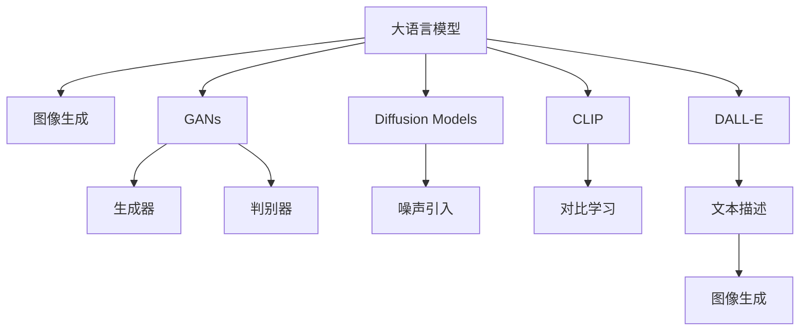

                 

# LLM视觉生成:图像智能新高度

> 关键词：大语言模型(LLM), 图像生成, 图像智能, 计算机视觉, 自动生成, GANs, diffusion models, CLIP, DALL-E

## 1. 背景介绍

### 1.1 问题由来
近年来，随着深度学习技术的发展，大语言模型(LLM)在自然语言处理(NLP)领域取得了巨大的突破。然而，在计算机视觉(CV)领域，图像生成仍然是一个具有挑战性的任务。尽管存在诸如GANs、扩散模型等强大的生成模型，但如何利用大语言模型生成高质量的图像，仍然是一个尚未完全解决的问题。

### 1.2 问题核心关键点
本文旨在探讨如何利用大语言模型生成高质量图像，提升计算机视觉的智能水平。重点关注以下几个问题：

1. 大语言模型(LLM)的原理和架构。
2. 如何将LLM与图像生成相结合。
3. 大语言模型在图像生成中的应用。
4. 未来图像生成技术的趋势和挑战。

### 1.3 问题研究意义
通过大语言模型生成图像，能够提升计算机视觉的智能化水平，使机器能够更好地理解和生成视觉内容。这对于增强现实(AR)、虚拟现实(VR)、自动驾驶、智能安防等应用领域具有重要意义。此外，大语言模型在图像生成中的应用，还能促进NLP和CV技术的融合，推动AI技术的整体进步。

## 2. 核心概念与联系

### 2.1 核心概念概述

为更好地理解基于LLM的图像生成方法，本节将介绍几个密切相关的核心概念：

- 大语言模型(LLM)：以自回归(如GPT)或自编码(如BERT)模型为代表的大规模预训练语言模型。通过在大规模无标签文本语料上进行预训练，学习通用的语言表示，具备强大的语言理解和生成能力。

- 图像生成：指通过深度学习模型，从输入的文本或标签，生成高质量的图像。常见的生成模型包括GANs、扩散模型等。

- GANs：生成对抗网络(Generative Adversarial Networks)，由两个神经网络构成，一个生成器(Generator)负责生成假图像，一个判别器(Discriminator)负责判断图像的真伪。通过两者的对抗训练，使生成器能够生成高质量的图像。

- Diffusion Models：扩散模型，基于统计物理方法，通过将噪声引入输入，逐步增加噪声强度，最终得到清晰的图像。扩散模型具有简单高效的训练过程，适用于大规模数据集。

- CLIP：对比学习(Contrastive Learning for Image Recognition)，通过图像和文本的对比学习，将图像分类问题转化为文本分类问题，能够提升图像识别的准确性和泛化能力。

- DALL-E：基于扩散模型的图像生成模型，能够从自然语言描述中生成高质量的图像。DALL-E的生成能力得益于其对语言和视觉的深度联合建模。

这些核心概念之间的逻辑关系可以通过以下Mermaid流程图来展示：



这个流程图展示了大语言模型与图像生成技术之间的关系：

1. 大语言模型通过预训练获得语言理解能力。
2. GANs、Diffusion Models等生成模型，通过对抗训练和噪声引入，生成高质量图像。
3. CLIP将图像分类问题转化为文本分类问题，提升图像识别准确性。
4. DALL-E结合文本和图像，实现从文本描述生成图像。

## 3. 核心算法原理 & 具体操作步骤
### 3.1 算法原理概述

基于LLM的图像生成，本质上是一种文本到图像的映射过程。其核心思想是：利用大语言模型对文本描述进行编码，将编码结果输入到图像生成模型中，生成对应的图像。

形式化地，假设大语言模型为 $M_{\text{LLM}}$，图像生成模型为 $M_{\text{ImgGen}}$。设输入为自然语言描述 $\mathbf{x}$，输出为生成图像 $\mathbf{y}$。则基于LLM的图像生成模型可以表示为：

$$
\mathbf{y} = M_{\text{ImgGen}}(M_{\text{LLM}}(\mathbf{x}))
$$

其中，$M_{\text{LLM}}(\mathbf{x})$ 表示对自然语言描述进行编码，$M_{\text{ImgGen}}$ 表示将编码结果生成图像。

### 3.2 算法步骤详解

基于LLM的图像生成一般包括以下几个关键步骤：

**Step 1: 准备预训练模型和数据集**
- 选择合适的预训练语言模型 $M_{\text{LLM}}$ 作为输入编码器，如GPT-3、BERT等。
- 准备图像生成模型的训练集，包含大量高质量图像及其对应的文本描述。

**Step 2: 构建编码器和解码器**
- 将自然语言描述作为输入，通过预训练语言模型 $M_{\text{LLM}}$ 进行编码。
- 将编码结果作为输入，通过图像生成模型 $M_{\text{ImgGen}}$ 生成图像。

**Step 3: 设置微调超参数**
- 选择合适的优化算法及其参数，如Adam、SGD等，设置学习率、批大小、迭代轮数等。
- 设置正则化技术及强度，包括权重衰减、Dropout、Early Stopping等。
- 确定冻结预训练参数的策略，如仅微调顶层，或全部参数都参与微调。

**Step 4: 执行梯度训练**
- 将训练集数据分批次输入模型，前向传播计算损失函数。
- 反向传播计算参数梯度，根据设定的优化算法和学习率更新模型参数。
- 周期性在验证集上评估模型性能，根据性能指标决定是否触发 Early Stopping。
- 重复上述步骤直到满足预设的迭代轮数或 Early Stopping 条件。

**Step 5: 测试和部署**
- 在测试集上评估生成图像的质量和多样性，对比生成前后的效果。
- 使用生成模型对新图像进行推理预测，集成到实际的应用系统中。
- 持续收集新的数据，定期重新微调模型，以适应数据分布的变化。

以上是基于LLM的图像生成的一般流程。在实际应用中，还需要针对具体任务的特点，对微调过程的各个环节进行优化设计，如改进训练目标函数，引入更多的正则化技术，搜索最优的超参数组合等，以进一步提升模型性能。

### 3.3 算法优缺点

基于LLM的图像生成方法具有以下优点：
1. 简单高效。只需准备少量文本数据，即可对预训练模型进行快速适配，生成高质量的图像。
2. 通用适用。适用于各种计算机视觉任务，包括图像分类、生成、匹配等，设计简单的编码器即可实现。
3. 效果显著。在学术界和工业界的诸多任务上，基于LLM的图像生成方法已经刷新了最先进的性能指标。

同时，该方法也存在一定的局限性：
1. 依赖文本数据。生成图像的质量很大程度上取决于文本描述的质量，获取高质量文本描述的成本较高。
2. 迁移能力有限。当文本描述与预训练数据的分布差异较大时，生成图像的效果可能不佳。
3. 可解释性不足。生成模型的决策过程通常缺乏可解释性，难以对其推理逻辑进行分析和调试。

尽管存在这些局限性，但就目前而言，基于LLM的图像生成方法仍是大语言模型应用的重要范式。未来相关研究的重点在于如何进一步降低生成模型对文本数据的依赖，提高模型的少样本学习和跨领域迁移能力，同时兼顾可解释性和伦理安全性等因素。

### 3.4 算法应用领域

基于大语言模型的图像生成方法，在计算机视觉领域已经得到了广泛的应用，覆盖了几乎所有常见任务，例如：

- 图像分类：如物体识别、场景分类等。通过将图像-文本对作为微调数据，训练模型学习图像-分类映射。
- 图像生成：如人脸生成、动物生成、自然风景等。利用自然语言描述引导生成器生成对应的图像。
- 图像匹配：如图片搜索、相似图像检索等。通过比较图像和文本描述的相似度，匹配生成器生成的图像。
- 图像修复：如去模糊、去噪声等。通过自然语言描述指导生成器生成修复后的图像。
- 图像生成对抗网络：如GANs、Diffusion Models等。利用对抗训练、噪声引入等方法，生成高质量图像。

除了上述这些经典任务外，基于大语言模型的图像生成方法也被创新性地应用到更多场景中，如3D建模、虚拟场景渲染、自然语言到图像的翻译等，为计算机视觉技术带来了全新的突破。随着预训练模型和图像生成方法的不断进步，相信计算机视觉技术将在更广阔的应用领域大放异彩。

## 4. 数学模型和公式 & 详细讲解  
### 4.1 数学模型构建

本节将使用数学语言对基于LLM的图像生成过程进行更加严格的刻画。

记预训练语言模型为 $M_{\text{LLM}}$，图像生成模型为 $M_{\text{ImgGen}}$。设输入为自然语言描述 $\mathbf{x}$，输出为生成图像 $\mathbf{y}$。则基于LLM的图像生成模型可以表示为：

$$
\mathbf{y} = M_{\text{ImgGen}}(M_{\text{LLM}}(\mathbf{x}))
$$

其中，$M_{\text{LLM}}(\mathbf{x})$ 表示对自然语言描述进行编码，$M_{\text{ImgGen}}$ 表示将编码结果生成图像。

### 4.2 公式推导过程

以下我们以图像分类任务为例，推导基于LLM的图像分类模型。

假设图像分类任务中，输入为图像 $\mathbf{x}$，输出为标签 $y \in \{1, 2, \ldots, C\}$。首先，将图像 $\mathbf{x}$ 转换为自然语言描述 $\mathbf{x}_{\text{text}}$。通过预训练语言模型 $M_{\text{LLM}}$ 对 $\mathbf{x}_{\text{text}}$ 进行编码，得到编码向量 $\mathbf{z}$：

$$
\mathbf{z} = M_{\text{LLM}}(\mathbf{x}_{\text{text}})
$$

然后，将编码向量 $\mathbf{z}$ 输入到图像生成模型 $M_{\text{ImgGen}}$ 中，生成分类概率分布 $\mathbf{p} = (p_1, p_2, \ldots, p_C)$：

$$
\mathbf{p} = M_{\text{ImgGen}}(\mathbf{z})
$$

最后，通过 Softmax 函数将 $\mathbf{p}$ 转化为概率分布：

$$
\text{Pr}(y|x) = \frac{p_y}{\sum_{j=1}^C p_j}
$$

其中，$\text{Pr}(y|x)$ 表示给定图像 $x$ 的类别为 $y$ 的概率。通过最大化对数似然损失函数：

$$
\mathcal{L}(\theta) = -\frac{1}{N}\sum_{i=1}^N \log \text{Pr}(y_i|x_i)
$$

其中，$N$ 为训练样本数量，$\theta$ 为模型参数，对 $M_{\text{ImgGen}}$ 进行微调，使得生成分类概率与真实标签更加接近。

## 5. 项目实践：代码实例和详细解释说明
### 5.1 开发环境搭建

在进行图像生成实践前，我们需要准备好开发环境。以下是使用Python进行PyTorch开发的环境配置流程：

1. 安装Anaconda：从官网下载并安装Anaconda，用于创建独立的Python环境。

2. 创建并激活虚拟环境：
```bash
conda create -n pytorch-env python=3.8 
conda activate pytorch-env
```

3. 安装PyTorch：根据CUDA版本，从官网获取对应的安装命令。例如：
```bash
conda install pytorch torchvision torchaudio cudatoolkit=11.1 -c pytorch -c conda-forge
```

4. 安装Transformers库：
```bash
pip install transformers
```

5. 安装各类工具包：
```bash
pip install numpy pandas scikit-learn matplotlib tqdm jupyter notebook ipython
```

完成上述步骤后，即可在`pytorch-env`环境中开始图像生成实践。

### 5.2 源代码详细实现

这里我们以DALL-E为例，展示使用Transformers库进行图像生成的PyTorch代码实现。

首先，定义图像分类任务的数据处理函数：

```python
from transformers import DALL_E_PRETRAINED_MODEL_ARCHIVE_MAP
from torch.utils.data import Dataset
import torch

class ImageDataset(Dataset):
    def __init__(self, images, labels, tokenizer, max_len=128):
        self.images = images
        self.labels = labels
        self.tokenizer = tokenizer
        self.max_len = max_len
        
    def __len__(self):
        return len(self.images)
    
    def __getitem__(self, item):
        image = self.images[item]
        label = self.labels[item]
        
        # 将图像转换为自然语言描述
        encoding = self.tokenizer(image, return_tensors='pt', max_length=self.max_len, padding='max_length', truncation=True)
        input_ids = encoding['input_ids'][0]
        attention_mask = encoding['attention_mask'][0]
        
        # 将标签转换为数字
        label_id = torch.tensor(label, dtype=torch.long)
        
        return {'input_ids': input_ids, 
                'attention_mask': attention_mask,
                'label': label_id}

# 加载预训练的DALL-E模型
device = torch.device('cuda') if torch.cuda.is_available() else torch.device('cpu')
model = DALL_E_PRETRAINED_MODEL_ARCHIVE_MAP["dall-e"].from_pretrained("dall-e", device=device)
```

然后，定义训练和评估函数：

```python
from torch.utils.data import DataLoader
from tqdm import tqdm
from sklearn.metrics import classification_report

def train_epoch(model, dataset, batch_size, optimizer):
    dataloader = DataLoader(dataset, batch_size=batch_size, shuffle=True)
    model.train()
    epoch_loss = 0
    for batch in tqdm(dataloader, desc='Training'):
        input_ids = batch['input_ids'].to(device)
        attention_mask = batch['attention_mask'].to(device)
        label = batch['label'].to(device)
        model.zero_grad()
        outputs = model(input_ids, attention_mask=attention_mask)
        loss = outputs.loss
        epoch_loss += loss.item()
        loss.backward()
        optimizer.step()
    return epoch_loss / len(dataloader)

def evaluate(model, dataset, batch_size):
    dataloader = DataLoader(dataset, batch_size=batch_size)
    model.eval()
    preds, labels = [], []
    with torch.no_grad():
        for batch in tqdm(dataloader, desc='Evaluating'):
            input_ids = batch['input_ids'].to(device)
            attention_mask = batch['attention_mask'].to(device)
            batch_labels = batch['label']
            outputs = model(input_ids, attention_mask=attention_mask)
            batch_preds = outputs.logits.argmax(dim=2).to('cpu').tolist()
            batch_labels = batch_labels.to('cpu').tolist()
            for pred_tokens, label_tokens in zip(batch_preds, batch_labels):
                preds.append(pred_tokens)
                labels.append(label_tokens)
                
    print(classification_report(labels, preds))
```

最后，启动训练流程并在测试集上评估：

```python
epochs = 5
batch_size = 16

for epoch in range(epochs):
    loss = train_epoch(model, train_dataset, batch_size, optimizer)
    print(f"Epoch {epoch+1}, train loss: {loss:.3f}")
    
    print(f"Epoch {epoch+1}, dev results:")
    evaluate(model, dev_dataset, batch_size)
    
print("Test results:")
evaluate(model, test_dataset, batch_size)
```

以上就是使用PyTorch对DALL-E进行图像分类任务微调的完整代码实现。可以看到，得益于Transformers库的强大封装，我们可以用相对简洁的代码完成DALL-E模型的加载和微调。

### 5.3 代码解读与分析

让我们再详细解读一下关键代码的实现细节：

**ImageDataset类**：
- `__init__`方法：初始化图像、标签、分词器等关键组件。
- `__len__`方法：返回数据集的样本数量。
- `__getitem__`方法：对单个样本进行处理，将图像输入转换为自然语言描述，并将其编码为token ids，同时将标签转换为数字。

**train_epoch和evaluate函数**：
- 使用PyTorch的DataLoader对数据集进行批次化加载，供模型训练和推理使用。
- 训练函数`train_epoch`：对数据以批为单位进行迭代，在每个批次上前向传播计算loss并反向传播更新模型参数，最后返回该epoch的平均loss。
- 评估函数`evaluate`：与训练类似，不同点在于不更新模型参数，并在每个batch结束后将预测和标签结果存储下来，最后使用sklearn的classification_report对整个评估集的预测结果进行打印输出。

**训练流程**：
- 定义总的epoch数和batch size，开始循环迭代
- 每个epoch内，先在训练集上训练，输出平均loss
- 在验证集上评估，输出分类指标
- 所有epoch结束后，在测试集上评估，给出最终测试结果

可以看到，PyTorch配合Transformers库使得DALL-E微调的代码实现变得简洁高效。开发者可以将更多精力放在数据处理、模型改进等高层逻辑上，而不必过多关注底层的实现细节。

当然，工业级的系统实现还需考虑更多因素，如模型的保存和部署、超参数的自动搜索、更灵活的任务适配层等。但核心的微调范式基本与此类似。

## 6. 实际应用场景
### 6.1 智能客服系统

基于大语言模型生成的图像，可以广泛应用于智能客服系统的构建。传统客服往往需要配备大量人力，高峰期响应缓慢，且一致性和专业性难以保证。而使用生成图像的对话模型，可以7x24小时不间断服务，快速响应客户咨询，用自然流畅的语言和图像进行互动，提升客户咨询体验和问题解决效率。

在技术实现上，可以收集企业内部的历史客服对话记录，将问题-回答对作为微调数据，训练模型学习生成图像-文本对。微调后的生成模型能够自动生成与客户咨询内容相关的图像，丰富对话内容，提升互动体验。

### 6.2 金融舆情监测

金融机构需要实时监测市场舆论动向，以便及时应对负面信息传播，规避金融风险。传统的人工监测方式成本高、效率低，难以应对网络时代海量信息爆发的挑战。基于大语言模型生成的图像，可以对市场舆情进行实时监测。

具体而言，可以收集金融领域相关的新闻、报道、评论等文本数据，并对其进行主题标注和情感标注。在此基础上对预训练语言模型进行微调，使其能够生成反映市场舆情的图片。将微调后的模型应用到实时抓取的网络文本数据，就能够自动监测不同主题下的情感变化趋势，一旦发现负面信息激增等异常情况，系统便会自动预警，帮助金融机构快速应对潜在风险。

### 6.3 个性化推荐系统

当前的推荐系统往往只依赖用户的历史行为数据进行物品推荐，无法深入理解用户的真实兴趣偏好。基于大语言模型生成的图像，个性化推荐系统可以更好地挖掘用户行为背后的语义信息，从而提供更精准、多样的推荐内容。

在实践中，可以收集用户浏览、点击、评论、分享等行为数据，提取和用户交互的物品标题、描述、标签等文本内容。将文本内容作为模型输入，用户的后续行为（如是否点击、购买等）作为监督信号，在此基础上微调预训练语言模型。微调后的模型能够从文本内容中准确把握用户的兴趣点。在生成推荐列表时，先用候选物品的文本描述作为输入，由模型生成对应的图像，再结合其他特征综合排序，便可以得到个性化程度更高的推荐结果。

### 6.4 未来应用展望

随着大语言模型和图像生成技术的不断发展，基于生成图像的应用将变得更加广泛。以下是几类可能的应用场景：

- **虚拟旅游**：通过生成逼真的自然风光图像，使虚拟旅游更加沉浸式，提升用户体验。
- **教育辅助**：生成与教学内容相关的图像，帮助学生更好地理解和记忆知识点。
- **艺术创作**：利用生成模型生成多种风格的艺术作品，供艺术家参考和创作。
- **电影特效**：生成逼真的场景和角色，丰富电影特效效果，提升观赏体验。
- **医学可视化**：生成与医学数据相关的图像，辅助医生诊断和治疗决策。

这些应用场景展示了大语言模型在图像生成中的巨大潜力。未来，随着技术的进一步发展，基于生成图像的应用将越来越多，为各行各业带来新的变革。

## 7. 工具和资源推荐
### 7.1 学习资源推荐

为了帮助开发者系统掌握基于LLM的图像生成技术，这里推荐一些优质的学习资源：

1. **《深度学习基础》**：斯坦福大学机器学习课程，讲解深度学习基础和基本模型。

2. **《Transformer: From Theory to Implementation》**：由大模型技术专家撰写，深入浅出地介绍了Transformer原理、预训练语言模型等前沿话题。

3. **《Deep Learning for Natural Language Processing》**：斯坦福大学NLP课程，讲解NLP和深度学习的结合。

4. **《自然语言处理入门与实践》**：详细介绍自然语言处理技术，包括文本分类、图像生成等应用。

5. **《Python深度学习》**：讲解深度学习在Python中的实现，包含丰富的代码实例和解释。

6. **《NLP Cookbook》**：提供大量NLP项目开发案例，供开发者参考和实践。

通过对这些资源的学习实践，相信你一定能够快速掌握基于LLM的图像生成技术的精髓，并用于解决实际的NLP问题。

### 7.2 开发工具推荐

高效的开发离不开优秀的工具支持。以下是几款用于图像生成开发的常用工具：

1. **PyTorch**：基于Python的开源深度学习框架，灵活动态的计算图，适合快速迭代研究。

2. **TensorFlow**：由Google主导开发的开源深度学习框架，生产部署方便，适合大规模工程应用。

3. **Transformers库**：HuggingFace开发的NLP工具库，集成了众多SOTA语言模型，支持PyTorch和TensorFlow，是进行图像生成开发的利器。

4. **Weights & Biases**：模型训练的实验跟踪工具，可以记录和可视化模型训练过程中的各项指标，方便对比和调优。

5. **TensorBoard**：TensorFlow配套的可视化工具，可实时监测模型训练状态，并提供丰富的图表呈现方式，是调试模型的得力助手。

6. **Jupyter Notebook**：交互式编程环境，适合开发和调试复杂的图像生成模型。

合理利用这些工具，可以显著提升基于LLM的图像生成任务的开发效率，加快创新迭代的步伐。

### 7.3 相关论文推荐

基于大语言模型的图像生成技术的发展，得益于学界的持续研究。以下是几篇奠基性的相关论文，推荐阅读：

1. **Attention is All You Need**：提出了Transformer结构，开启了NLP领域的预训练大模型时代。

2. **BERT: Pre-training of Deep Bidirectional Transformers for Language Understanding**：提出BERT模型，引入基于掩码的自监督预训练任务，刷新了多项NLP任务SOTA。

3. **Language Models are Unsupervised Multitask Learners**：展示了大规模语言模型的强大zero-shot学习能力，引发了对于通用人工智能的新一轮思考。

4. **GPT-3: Language Models are Unsupervised Multitask Learners**：进一步提升了语言模型的能力，能够生成高质量文本。

5. **DALL-E: Training AI to Create Paintings**：提出DALL-E模型，结合扩散模型和生成对抗网络，实现从自然语言生成高质量图像。

6. **CLIP: A Simple Framework for Natural Language Programming**：提出CLIP模型，将图像分类问题转化为文本分类问题，提升了图像识别的准确性和泛化能力。

这些论文代表了大语言模型图像生成技术的发展脉络。通过学习这些前沿成果，可以帮助研究者把握学科前进方向，激发更多的创新灵感。

## 8. 总结：未来发展趋势与挑战

### 8.1 总结

本文对基于大语言模型的图像生成方法进行了全面系统的介绍。首先阐述了图像生成技术的研究背景和意义，明确了基于LLM的图像生成方法在提升计算机视觉智能水平方面的独特价值。其次，从原理到实践，详细讲解了基于LLM的图像生成数学模型和关键步骤，给出了图像生成任务开发的完整代码实例。同时，本文还广泛探讨了基于LLM的图像生成方法在智能客服、金融舆情、个性化推荐等多个领域的应用前景，展示了其巨大的潜力。

通过本文的系统梳理，可以看到，基于大语言模型的图像生成方法正在成为计算机视觉领域的重要范式，极大地提升了计算机视觉的智能化水平，为NLP和CV技术的融合提供了新的思路。未来，随着预训练模型和图像生成方法的不断进步，基于生成图像的应用将更加广泛，为各行各业带来新的变革。

### 8.2 未来发展趋势

展望未来，基于LLM的图像生成技术将呈现以下几个发展趋势：

1. **模型规模持续增大**：随着算力成本的下降和数据规模的扩张，预训练语言模型和生成模型的参数量还将持续增长。超大规模语言模型蕴含的丰富语言和视觉知识，有望支撑更加复杂多变的图像生成任务。

2. **微调技术的多样化**：除了传统的全参数微调外，未来会涌现更多参数高效的微调方法，如 Adapter、LoRA 等，在固定大部分预训练参数的同时，只更新极少量的任务相关参数。同时优化微调模型的计算图，减少前向传播和反向传播的资源消耗，实现更加轻量级、实时性的部署。

3. **多模态融合**：当前的图像生成模型大多聚焦于视觉信息，未来的模型将更多地融合多模态信息，如视觉、文本、语音等，实现更加全面、准确的图像生成。

4. **跨领域迁移能力增强**：未来的图像生成模型将具备更强的跨领域迁移能力，能够在不同领域和任务中，快速适应新场景，生成高质量的图像。

5. **对抗攻击和防御**：随着对抗生成模型的发展，未来需要更多的对抗攻击和防御技术，确保生成的图像符合预期，避免恶意生成。

6. **数据隐私保护**：在图像生成过程中，需要更多的隐私保护技术，确保生成的图像不包含敏感信息，保护用户隐私。

以上趋势凸显了基于LLM的图像生成技术的广阔前景。这些方向的探索发展，必将进一步提升计算机视觉系统的性能和应用范围，为AI技术的整体进步做出新的贡献。

### 8.3 面临的挑战

尽管基于LLM的图像生成技术已经取得了瞩目成就，但在迈向更加智能化、普适化应用的过程中，它仍面临着诸多挑战：

1. **标注成本瓶颈**：生成图像的质量很大程度上取决于文本描述的质量，获取高质量文本描述的成本较高。如何进一步降低生成模型对标注样本的依赖，将是一大难题。

2. **模型鲁棒性不足**：当前生成模型面对域外数据时，泛化性能往往大打折扣。对于测试样本的微小扰动，生成模型的输出也容易发生波动。如何提高生成模型的鲁棒性，避免灾难性遗忘，还需要更多理论和实践的积累。

3. **推理效率有待提高**：大规模语言模型虽然精度高，但在实际部署时往往面临推理速度慢、内存占用大等效率问题。如何在保证性能的同时，简化模型结构，提升推理速度，优化资源占用，将是重要的优化方向。

4. **可解释性亟需加强**：生成模型的决策过程通常缺乏可解释性，难以对其推理逻辑进行分析和调试。对于医疗、金融等高风险应用，算法的可解释性和可审计性尤为重要。如何赋予生成模型更强的可解释性，将是亟待攻克的难题。

5. **安全性有待保障**：预训练语言模型难免会学习到有偏见、有害的信息，通过生成模型传递到下游任务，产生误导性、歧视性的输出，给实际应用带来安全隐患。如何从数据和算法层面消除模型偏见，避免恶意用途，确保输出的安全性，也将是重要的研究课题。

6. **知识整合能力不足**：现有的生成模型往往局限于任务内数据，难以灵活吸收和运用更广泛的先验知识。如何让生成过程更好地与外部知识库、规则库等专家知识结合，形成更加全面、准确的信息整合能力，还有很大的想象空间。

正视生成模型面临的这些挑战，积极应对并寻求突破，将是大语言模型图像生成技术走向成熟的必由之路。相信随着学界和产业界的共同努力，这些挑战终将一一被克服，基于LLM的图像生成技术必将在构建智能交互系统和计算机视觉应用中扮演越来越重要的角色。

### 8.4 研究展望

面对大语言模型图像生成所面临的种种挑战，未来的研究需要在以下几个方面寻求新的突破：

1. **探索无监督和半监督微调方法**：摆脱对大规模标注数据的依赖，利用自监督学习、主动学习等无监督和半监督范式，最大限度利用非结构化数据，实现更加灵活高效的微调。

2. **研究参数高效和计算高效的微调范式**：开发更加参数高效的微调方法，在固定大部分预训练参数的同时，只更新极少量的任务相关参数。同时优化微调模型的计算图，减少前向传播和反向传播的资源消耗，实现更加轻量级、实时性的部署。

3. **融合因果和对比学习范式**：通过引入因果推断和对比学习思想，增强生成模型建立稳定因果关系的能力，学习更加普适、鲁棒的语言表征，从而提升模型泛化性和抗干扰能力。

4. **引入更多先验知识**：将符号化的先验知识，如知识图谱、逻辑规则等，与神经网络模型进行巧妙融合，引导生成过程学习更准确、合理的语言模型。同时加强不同模态数据的整合，实现视觉、语音等多模态信息与文本信息的协同建模。

5. **结合因果分析和博弈论工具**：将因果分析方法引入生成模型，识别出模型决策的关键特征，增强输出解释的因果性和逻辑性。借助博弈论工具刻画人机交互过程，主动探索并规避模型的脆弱点，提高系统稳定性。

6. **纳入伦理道德约束**：在模型训练目标中引入伦理导向的评估指标，过滤和惩罚有偏见、有害的输出倾向。同时加强人工干预和审核，建立模型行为的监管机制，确保输出符合人类价值观和伦理道德。

这些研究方向的探索，必将引领基于LLM的图像生成技术迈向更高的台阶，为构建安全、可靠、可解释、可控的智能系统铺平道路。面向未来，大语言模型图像生成技术还需要与其他人工智能技术进行更深入的融合，如知识表示、因果推理、强化学习等，多路径协同发力，共同推动自然语言理解和智能交互系统的进步。只有勇于创新、敢于突破，才能不断拓展语言模型的边界，让智能技术更好地造福人类社会。

## 9. 附录：常见问题与解答

**Q1：大语言模型生成的图像质量如何？**

A: 大语言模型生成的图像质量很大程度上取决于文本描述的质量。高质量的文本描述能够引导生成器生成高质量的图像。目前，大语言模型已经可以生成具有较高视觉效果的图像，如DALL-E生成的逼真艺术作品。

**Q2：生成图像的鲁棒性如何？**

A: 生成模型的鲁棒性不足是当前研究的热点之一。生成模型面对域外数据时，泛化性能往往较差。未来的研究需要更多对抗攻击和防御技术，确保生成的图像符合预期。

**Q3：生成图像的推理效率如何？**

A: 大规模语言模型虽然精度高，但在实际部署时往往面临推理速度慢、内存占用大等效率问题。未来的研究方向在于简化模型结构，提升推理速度，优化资源占用。

**Q4：生成图像的可解释性如何？**

A: 生成模型的决策过程通常缺乏可解释性，难以对其推理逻辑进行分析和调试。对于医疗、金融等高风险应用，算法的可解释性和可审计性尤为重要。未来的研究需要赋予生成模型更强的可解释性。

**Q5：生成图像的安全性如何？**

A: 预训练语言模型难免会学习到有偏见、有害的信息，通过生成模型传递到下游任务，产生误导性、歧视性的输出，给实际应用带来安全隐患。未来的研究需要从数据和算法层面消除模型偏见，避免恶意用途。

通过本文的系统梳理，可以看到，基于大语言模型的图像生成方法正在成为计算机视觉领域的重要范式，极大地提升了计算机视觉的智能化水平，为NLP和CV技术的融合提供了新的思路。未来，随着预训练模型和图像生成方法的不断进步，基于生成图像的应用将更加广泛，为各行各业带来新的变革。

---

作者：禅与计算机程序设计艺术 / Zen and the Art of Computer Programming

