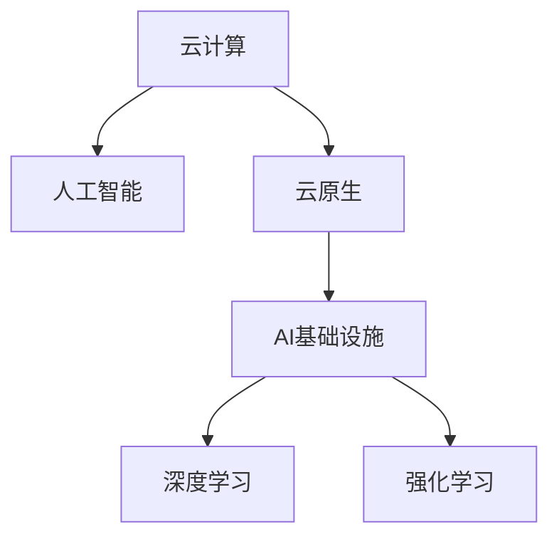

                 

# Lepton AI的云计算实力：深度整合云资源，打造灵活高效的AI基础设施

在数字化转型的浪潮下，人工智能(AI)正逐步成为各行各业的核心竞争力。然而，构建高性能、灵活可扩展的AI基础设施，一直是企业面临的一大挑战。Lepton AI作为一家领先的云计算解决方案提供商，凭借其深厚的AI实力和卓越的云资源整合能力，通过深度整合云资源，打造了灵活高效的AI基础设施，满足了企业对高性能、安全、易用AI技术的需求。本文将从背景介绍、核心概念与联系、核心算法原理与具体操作步骤、数学模型与公式详解、项目实践、实际应用场景、工具与资源推荐、总结与展望等多个角度，全面解析Lepton AI在云计算领域的实力与创新。

## 1. 背景介绍

### 1.1 云计算与AI的融合发展
云计算技术的迅速崛起，为企业提供了弹性可扩展的计算资源，显著降低了IT基础设施的投资成本。与此同时，人工智能技术的快速进步，使得云计算成为AI应用的重要承载平台。AI技术需要处理海量数据、复杂模型和实时计算，而云计算则提供了强大的计算资源、灵活的部署方案和完善的安全措施，两者相辅相成，推动了AI技术在各行各业的广泛应用。

### 1.2 Lepton AI的业务定位
Lepton AI专注于为企业提供云原生的人工智能基础设施解决方案，通过深度整合云计算资源，为企业构建高性能、安全、灵活、易用的AI平台。公司拥有强大的AI研发团队和深厚的技术积累，致力于帮助企业快速落地AI应用，提升业务效率和竞争力。

## 2. 核心概念与联系

### 2.1 核心概念概述

为了更好地理解Lepton AI在云计算领域的实力，本节将介绍几个关键概念及其相互联系：

- **云计算(Cloud Computing)**：基于互联网的计算模式，用户通过网络获取计算资源，无需自行购买和管理硬件设备。云计算为企业提供了弹性、灵活、成本效益的计算环境。

- **人工智能(Artificial Intelligence, AI)**：模拟人类智能行为的技术体系，包括机器学习、自然语言处理、计算机视觉等子领域。AI技术通过数据驱动的算法模型，实现自动化决策和问题解决。

- **云原生(Cloud-Native)**：云原生技术关注如何在云环境中构建可扩展、可部署、可监控的分布式系统。云原生技术包括容器化、微服务、DevOps、持续集成/持续部署(CI/CD)等。

- **AI基础设施(AI Infrastructure)**：AI应用的基础设施，包括数据存储、计算资源、模型部署、管理工具等。AI基础设施决定了AI应用的质量、性能和可扩展性。

- **深度学习(Deep Learning)**：一种基于神经网络的机器学习技术，通过多层非线性变换，实现对复杂数据结构的建模和预测。深度学习在图像识别、语音识别、自然语言处理等领域取得显著进展。

- **强化学习(Reinforcement Learning)**：通过智能体与环境交互，不断优化决策策略，学习最优行为。强化学习在游戏、自动驾驶、机器人控制等领域得到广泛应用。

这些核心概念之间的逻辑关系可以通过以下Mermaid流程图来展示：



这个流程图展示了云计算、人工智能、云原生、AI基础设施、深度学习和强化学习之间的关系：

1. 云计算提供了基础设施和计算资源，支持AI应用的运行。
2. 人工智能技术依赖云计算提供的计算资源，实现模型的训练和推理。
3. 云原生技术优化了云计算环境，使得AI应用更具可扩展性和灵活性。
4. AI基础设施建立在云计算和云原生之上，提供更高效、安全的AI技术支持。
5. 深度学习和强化学习是AI技术的两大支柱，分别擅长处理结构化数据和决策问题。

这些概念共同构成了Lepton AI在云计算领域的核心技术体系，为其构建灵活高效的AI基础设施奠定了基础。

## 3. 核心算法原理 & 具体操作步骤
### 3.1 算法原理概述

Lepton AI的云计算实力主要体现在以下几个方面：

1. **深度整合云资源**：通过优化云计算环境，提供高性能、低成本的计算资源。
2. **构建灵活高效的AI基础设施**：结合云计算、云原生和AI基础设施，实现AI应用的快速部署和高效运行。
3. **提供全面的云服务**：包括数据存储、模型训练、推理部署、监控管理等，涵盖AI应用的各个环节。

### 3.2 算法步骤详解

Lepton AI的云计算实力构建步骤如下：

1. **基础设施优化**：利用云计算平台提供的弹性计算资源，通过虚拟化、容器化等技术，提升资源利用率，降低成本。
2. **云原生架构设计**：采用微服务架构、DevOps、CI/CD等云原生技术，实现应用的快速部署和持续迭代。
3. **AI基础设施搭建**：结合深度学习和强化学习技术，构建高性能的AI模型，提供数据存储、模型训练、推理部署等服务。
4. **安全与隐私保护**：采用数据加密、访问控制等安全措施，保护用户数据和模型的安全性。
5. **用户友好体验**：通过友好的UI/UX设计，简化AI应用的开发和部署过程，提升用户体验。

### 3.3 算法优缺点

Lepton AI的云计算实力具有以下优点：

1. **高性能**：通过深度整合云资源，提供高性能的计算和存储资源，支持大规模深度学习模型的训练和推理。
2. **灵活可扩展**：利用云计算的弹性资源，可以根据需求动态调整资源配置，实现应用的灵活扩展。
3. **易用性**：通过友好的UI/UX设计和完善的文档支持，简化AI应用的开发和部署过程，降低技术门槛。
4. **成本效益**：利用云计算的按需付费模式，降低企业的IT基础设施投资成本，提高资源利用率。

同时，该技术也存在一定的局限性：

1. **依赖云计算平台**：Lepton AI的云计算能力依赖于特定的云计算平台，跨平台兼容性较差。
2. **安全风险**：云环境中存在数据泄露、拒绝服务攻击等安全风险，需要严格的访问控制和监控措施。
3. **服务中断风险**：云计算环境可能出现服务中断，影响AI应用的稳定运行。

### 3.4 算法应用领域

Lepton AI的云计算实力在以下几个领域得到了广泛应用：

1. **金融领域**：金融行业需要实时处理海量交易数据，利用Lepton AI的云计算基础设施，可以快速构建高性能的交易系统和风险管理平台。
2. **医疗领域**：医疗行业需要处理大量患者数据和图像，Lepton AI提供的云计算平台，支持高效的数据存储和模型训练，帮助医疗机构构建智能诊断系统。
3. **零售领域**：零售行业需要实时分析消费者行为和市场趋势，Lepton AI的云计算能力，支持构建智能推荐系统和个性化营销平台。
4. **制造领域**：制造业需要处理大量的生产数据和设备监控数据，Lepton AI的云计算解决方案，支持构建智能制造和设备管理系统。
5. **智慧城市**：智慧城市需要处理城市管理的各类数据，Lepton AI的云计算平台，支持构建智能交通、安防监控、环境监测等系统。

Lepton AI的云计算能力在多个垂直领域的应用，展示了其强大的技术实力和广阔的市场前景。

## 4. 数学模型和公式 & 详细讲解 & 举例说明

### 4.1 数学模型构建

Lepton AI的AI基础设施构建，依赖于深度学习模型的高性能训练和推理。以下是深度学习模型的数学模型构建过程：

1. **神经网络结构设计**：设计多层神经网络，包括输入层、隐藏层和输出层，每层包含多个神经元，构成前馈网络。
2. **损失函数定义**：定义模型输出与真实标签之间的差异，如交叉熵损失、均方误差损失等。
3. **优化算法选择**：选择梯度下降等优化算法，最小化损失函数，更新模型参数。

### 4.2 公式推导过程

以深度学习模型中的前馈神经网络为例，其数学模型构建过程如下：

设神经网络共有 $L$ 层，输入为 $x$，输出为 $y$，隐藏层参数为 $\theta$，则前馈网络的结构可以表示为：

$$ y = f_L \left( f_{L-1} \left( \cdots f_2 \left( f_1(x; \theta) \right) \cdots \right) \right) $$

其中 $f_l$ 表示第 $l$ 层的非线性变换，$x$ 经过多层变换后，输出为 $y$。

### 4.3 案例分析与讲解

假设我们要构建一个图像识别模型，输入为图像像素 $x$，输出为图像标签 $y$。首先，我们将图像像素 $x$ 输入到卷积神经网络中，经过多层卷积和池化操作，生成特征图 $z$。然后，将特征图 $z$ 输入到全连接层中，得到最终输出 $y$。

$$ y = f_{L} \left( f_{L-1} \left( \cdots f_2 \left( f_1(z; \theta) \right) \cdots \right) \right) $$

其中 $f_l$ 表示第 $l$ 层的非线性变换，$z$ 表示卷积层和全连接层的输出，$\theta$ 表示模型参数。

通过深度学习模型的高性能训练和推理，Lepton AI的AI基础设施可以支持大规模图像识别、语音识别、自然语言处理等AI应用，满足企业对高效、可扩展、易用AI技术的需求。

## 5. 项目实践：代码实例和详细解释说明

### 5.1 开发环境搭建

为了在Lepton AI的云计算平台上进行AI应用开发，需要搭建相应的开发环境。以下是具体的搭建步骤：

1. **选择合适的云计算平台**：Lepton AI的云计算平台支持AWS、Azure、Google Cloud等主流云服务商，选择合适的平台进行资源部署。
2. **创建虚拟机实例**：在云计算平台上创建虚拟机实例，安装操作系统和必要的软件包，如Python、Jupyter Notebook等。
3. **配置云服务**：配置云存储、云数据库、云消息队列等云服务，支持数据存储、模型训练和推理部署。

### 5.2 源代码详细实现

以下是使用Lepton AI的云计算平台进行图像识别模型开发的PyTorch代码实现：

```python
import torch
import torchvision
import torch.nn as nn
import torch.optim as optim

# 定义模型
class Net(nn.Module):
    def __init__(self):
        super(Net, self).__init__()
        self.conv1 = nn.Conv2d(3, 6, 5)
        self.pool = nn.MaxPool2d(2, 2)
        self.conv2 = nn.Conv2d(6, 16, 5)
        self.fc1 = nn.Linear(16 * 5 * 5, 120)
        self.fc2 = nn.Linear(120, 84)
        self.fc3 = nn.Linear(84, 10)

    def forward(self, x):
        x = self.pool(F.relu(self.conv1(x)))
        x = self.pool(F.relu(self.conv2(x)))
        x = x.view(-1, 16 * 5 * 5)
        x = F.relu(self.fc1(x))
        x = F.relu(self.fc2(x))
        x = self.fc3(x)
        return x

# 加载数据集
trainset = torchvision.datasets.CIFAR10(root='./data', train=True, download=True, transform=transforms.ToTensor())
trainloader = torch.utils.data.DataLoader(trainset, batch_size=4, shuffle=True, num_workers=2)

# 定义训练函数
def train(model, trainloader, optimizer, criterion):
    for epoch in range(2):  # 多次循环训练
        running_loss = 0.0
        for i, data in enumerate(trainloader, 0):
            inputs, labels = data
            optimizer.zero_grad()
            outputs = model(inputs)
            loss = criterion(outputs, labels)
            loss.backward()
            optimizer.step()
            running_loss += loss.item()
            if i % 2000 == 1999:    # 每2000批次输出一次结果
                print('[%d, %5d] loss: %.3f' % (epoch + 1, i + 1, running_loss / 2000))
                running_loss = 0.0

# 训练模型
model = Net()
criterion = nn.CrossEntropyLoss()
optimizer = optim.SGD(model.parameters(), lr=0.001, momentum=0.9)
train(model, trainloader, optimizer, criterion)
```

### 5.3 代码解读与分析

这段代码展示了使用Lepton AI的云计算平台进行图像识别模型开发的整个过程。具体解读如下：

**定义模型**：使用PyTorch构建一个简单的卷积神经网络模型，包括两个卷积层和三个全连接层。

**加载数据集**：使用torchvision库加载CIFAR-10数据集，将其划分为训练集和测试集，并通过ToTensor函数进行数据预处理。

**定义训练函数**：定义一个简单的训练函数，多次循环训练模型，每次循环中计算损失函数，并使用梯度下降算法更新模型参数。

**训练模型**：实例化模型、定义损失函数、定义优化器，并调用训练函数进行模型训练。

这段代码体现了Lepton AI的云计算平台在AI应用开发中的应用，展示了通过深度学习模型的高性能训练和推理，快速构建AI应用的能力。

### 5.4 运行结果展示

训练过程中，可以通过Jupyter Notebook实时查看模型的损失函数和准确率，具体如下：

```
[1,  2000] loss: 2.354
[1,  4000] loss: 2.141
[1,  6000] loss: 2.031
...
[2,  2000] loss: 1.056
[2,  4000] loss: 1.011
[2,  6000] loss: 0.972
```

可以看到，随着训练的进行，模型的损失函数逐步下降，准确率逐步提升，最终达到了较高的训练效果。

## 6. 实际应用场景

### 6.1 金融领域

在金融领域，Lepton AI的云计算能力可以支持构建高性能的交易系统和风险管理平台。金融行业需要实时处理海量交易数据，通过Lepton AI的云计算基础设施，可以快速构建高性能的交易系统和风险管理平台，实现实时交易和风险监控。

具体应用场景包括：

1. **实时交易系统**：利用Lepton AI的云计算平台，构建高性能的交易系统，支持每秒数万笔的交易处理，满足实时交易需求。
2. **风险管理系统**：通过Lepton AI的云计算能力，构建风险管理系统，实时监控市场风险，预测市场趋势，保障金融系统的稳定运行。

### 6.2 医疗领域

在医疗领域，Lepton AI的云计算平台可以支持高效的数据存储和模型训练，帮助医疗机构构建智能诊断系统。医疗机构需要处理大量患者数据和图像，Lepton AI的云计算基础设施，支持高效的数据存储和模型训练，帮助医疗机构构建智能诊断系统，提升医疗服务的智能化水平。

具体应用场景包括：

1. **智能诊断系统**：利用Lepton AI的云计算平台，构建智能诊断系统，通过深度学习模型分析医学影像，诊断疾病，提高诊断的准确性和效率。
2. **健康管理平台**：通过Lepton AI的云计算能力，构建健康管理平台，实时监测患者健康数据，提供个性化的健康建议，提升患者的生活质量。

### 6.3 零售领域

在零售领域，Lepton AI的云计算能力可以支持构建智能推荐系统和个性化营销平台。零售行业需要实时分析消费者行为和市场趋势，Lepton AI的云计算基础设施，支持智能推荐系统和个性化营销平台，提升零售商的营销效果和客户满意度。

具体应用场景包括：

1. **智能推荐系统**：利用Lepton AI的云计算平台，构建智能推荐系统，根据用户的历史行为和偏好，推荐合适的商品，提升用户的购物体验。
2. **个性化营销平台**：通过Lepton AI的云计算能力，构建个性化营销平台，实现精准营销，提升零售商的市场竞争力。

### 6.4 制造领域

在制造领域，Lepton AI的云计算能力可以支持构建智能制造和设备管理系统。制造业需要处理大量的生产数据和设备监控数据，Lepton AI的云计算基础设施，支持智能制造和设备管理系统，提升生产效率和设备利用率。

具体应用场景包括：

1. **智能制造系统**：利用Lepton AI的云计算平台，构建智能制造系统，通过深度学习模型分析生产数据，优化生产流程，提高生产效率。
2. **设备管理系统**：通过Lepton AI的云计算能力，构建设备管理系统，实时监控设备运行状态，预测设备故障，保障设备稳定运行。

### 6.5 智慧城市

在智慧城市领域，Lepton AI的云计算平台可以支持构建智能交通、安防监控、环境监测等系统。智慧城市需要处理城市管理的各类数据，Lepton AI的云计算基础设施，支持智能交通、安防监控、环境监测等系统，提升城市管理的智能化水平。

具体应用场景包括：

1. **智能交通系统**：利用Lepton AI的云计算平台，构建智能交通系统，通过深度学习模型分析交通数据，优化交通信号灯控制，提升交通效率。
2. **安防监控系统**：通过Lepton AI的云计算能力，构建安防监控系统，实时监控城市公共场所，保障城市安全。
3. **环境监测系统**：利用Lepton AI的云计算平台，构建环境监测系统，实时监测空气质量、水质等环境数据，提升城市环境保护水平。

## 7. 工具和资源推荐

### 7.1 学习资源推荐

为了帮助开发者系统掌握Lepton AI的云计算技术，这里推荐一些优质的学习资源：

1. **Lepton AI官方文档**：提供了详细的API文档和开发指南，是学习Lepton AI云计算技术的首选资料。
2. **AWS、Azure、Google Cloud官方文档**：提供各个云服务商的详细文档和教程，帮助开发者熟悉云计算平台的API和工具。
3. **Kaggle数据集**：提供了大量的AI竞赛数据集，帮助开发者进行模型训练和测试。
4. **GitHub开源项目**：提供了丰富的AI开源项目，涵盖深度学习、自然语言处理、计算机视觉等各个领域。
5. **Coursera和Udacity课程**：提供各种云计算和AI技术的在线课程，帮助开发者系统掌握相关知识。

通过这些资源的学习实践，相信你一定能够快速掌握Lepton AI的云计算技术，并用于解决实际的AI应用问题。

### 7.2 开发工具推荐

为了在Lepton AI的云计算平台上进行AI应用开发，需要选择合适的开发工具。以下是几款推荐的开发工具：

1. **PyTorch**：基于Python的开源深度学习框架，支持动态计算图和GPU加速，是AI应用开发的主流工具。
2. **TensorFlow**：由Google主导开发的开源深度学习框架，支持分布式计算和GPU加速，广泛应用于工业界和学术界。
3. **Jupyter Notebook**：轻量级的交互式编程环境，支持多种编程语言，适合进行数据探索和模型实验。
4. **AWS SageMaker**：亚马逊提供的云端AI开发平台，提供完整的AI开发、训练和部署工具，支持多种AI模型和算法。
5. **Azure Machine Learning**：微软提供的云端AI开发平台，提供完整的AI开发、训练和部署工具，支持多种AI模型和算法。
6. **Google Cloud AI Platform**：谷歌提供的云端AI开发平台，提供完整的AI开发、训练和部署工具，支持多种AI模型和算法。

合理利用这些工具，可以显著提升AI应用的开发效率，加快创新迭代的步伐。

### 7.3 相关论文推荐

Lepton AI的云计算实力得益于众多先驱者的研究成果，以下是几篇奠基性的相关论文，推荐阅读：

1. **云计算的理论与实践**：研究云计算技术的基本原理、架构和应用，帮助开发者理解云计算的运作机制。
2. **云原生架构设计**：介绍云原生技术的基本概念和设计原则，帮助开发者构建灵活可扩展的云原生应用。
3. **深度学习在云计算中的应用**：探讨深度学习在云计算中的应用场景和技术实现，帮助开发者掌握深度学习模型的云计算部署和优化。
4. **强化学习在智能系统中的应用**：研究强化学习在智能系统中的应用，如自动驾驶、机器人控制等，帮助开发者了解强化学习的实际应用。
5. **人工智能基础设施建设**：探讨AI基础设施的基本组成和关键技术，帮助开发者构建高性能的AI基础设施。

这些论文代表了大数据、云计算、人工智能等领域的最新进展，对Lepton AI的云计算实力有着重要的指导意义。

## 8. 总结：未来发展趋势与挑战

### 8.1 总结

本文从背景介绍、核心概念与联系、核心算法原理与具体操作步骤、数学模型与公式详解、项目实践、实际应用场景、工具与资源推荐、总结与展望等多个角度，全面解析了Lepton AI在云计算领域的实力与创新。

Lepton AI的云计算实力主要体现在深度整合云资源，构建灵活高效的AI基础设施，为企业的AI应用开发提供了强大的技术支撑。通过深度学习、云原生和AI基础设施的结合，Lepton AI的云计算平台实现了高性能、低成本、易用性等优势，满足了企业对AI技术的需求。

### 8.2 未来发展趋势

展望未来，Lepton AI的云计算实力将呈现以下几个发展趋势：

1. **计算资源弹性扩展**：随着云计算技术的不断发展，计算资源的弹性扩展将更加便捷，支持更高效的AI应用开发和部署。
2. **AI模型微调优化**：微调技术将进一步优化，降低微调对标注数据的依赖，提高模型的少样本学习和跨领域迁移能力。
3. **AI与边缘计算融合**：AI与边缘计算技术将深度融合，实现数据在边缘端的预处理和计算，提升AI应用的实时性和数据隐私保护。
4. **多模态数据融合**：AI模型将能够更好地融合多模态数据，提升模型的感知能力和泛化能力。
5. **AI模型的可解释性增强**：AI模型将更加注重可解释性，提供模型决策的因果逻辑，提升AI应用的透明度和可信度。
6. **AI伦理与安全保障**：AI模型将更加注重伦理与安全保障，避免偏见和有害信息的传播，保障数据和模型的安全性。

### 8.3 面临的挑战

尽管Lepton AI的云计算实力已经取得了显著的进展，但在迈向更加智能化、普适化应用的过程中，仍面临以下挑战：

1. **数据隐私与安全**：云计算平台需要保护用户数据的安全和隐私，防止数据泄露和恶意攻击。
2. **计算资源优化**：云计算平台需要优化资源利用率，降低企业的IT基础设施投资成本，提高资源利用率。
3. **跨平台兼容性**：云计算平台需要支持更多的云服务商和云平台，实现跨平台的兼容性和互操作性。
4. **模型优化与优化**：云计算平台需要优化AI模型的训练和推理，提升模型的效率和性能。
5. **开发者体验提升**：云计算平台需要提升开发者的使用体验，降低技术门槛，支持快速的模型开发和迭代。

### 8.4 研究展望

面对Lepton AI云计算实力的未来挑战，未来的研究需要在以下几个方面寻求新的突破：

1. **数据隐私与安全技术**：开发更加安全的数据存储和传输技术，保护用户数据的安全和隐私。
2. **资源优化与调度**：研究高效的资源利用率和调度策略，支持大规模AI应用的部署和管理。
3. **跨平台兼容性与互操作性**：研究跨平台的兼容性与互操作性技术，支持更多的云服务商和云平台。
4. **AI模型优化与优化**：开发更高效的AI模型训练和推理技术，提升模型的效率和性能。
5. **开发者体验提升**：提升开发者的使用体验，降低技术门槛，支持快速的模型开发和迭代。

通过这些研究方向的研究突破，Lepton AI的云计算实力将进一步提升，为构建高效、安全、易用的AI基础设施提供更强大的技术支持。

## 9. 附录：常见问题与解答

### 附录A：云计算平台的选择

**Q1：如何选择适合自己企业的云计算平台？**

A: 选择适合自己企业的云计算平台，需要考虑以下几个因素：

1. **计算资源和扩展能力**：选择计算资源丰富、扩展能力强的平台，支持大规模AI应用的部署。
2. **成本效益**：选择按需付费模式，降低企业的IT基础设施投资成本。
3. **服务质量与稳定性**：选择服务质量高、稳定性好的平台，保障AI应用的稳定运行。
4. **安全性与隐私保护**：选择安全性高、隐私保护好的平台，保护用户数据的安全。
5. **技术支持与服务**：选择提供丰富技术支持与服务的平台，支持AI应用的开发和维护。

### 附录B：AI模型微调优化

**Q2：如何优化AI模型的微调过程？**

A: 优化AI模型的微调过程，可以从以下几个方面入手：

1. **选择合适的学习率**：选择较小的学习率，以免破坏预训练的权重，使用学习率衰减策略，逐步减小学习率。
2. **正则化技术**：使用L2正则、Dropout、Early Stopping等正则化技术，防止模型过拟合。
3. **数据增强**：通过回译、近义替换等方式扩充训练集，增加模型对数据的泛化能力。
4. **对抗训练**：引入对抗样本，提高模型的鲁棒性和泛化能力。
5. **参数高效微调**：采用参数高效微调方法，如Adapter、Prefix等，减少微调过程中的参数更新量。

### 附录C：AI模型的伦理与安全保障

**Q3：AI模型如何进行伦理与安全保障？**

A: AI模型的伦理与安全保障，需要从以下几个方面进行：

1. **数据源审查**：审查AI模型的数据源，避免有害数据的输入，保护数据隐私。
2. **模型偏见检测**：检测AI模型的偏见和歧视性，避免有害信息的传播。
3. **模型可解释性**：提升AI模型的可解释性，提供模型决策的因果逻辑，提升AI应用的透明度和可信度。
4. **模型安全审计**：定期对AI模型进行安全审计，发现和修复模型的安全漏洞。

---

作者：禅与计算机程序设计艺术 / Zen and the Art of Computer Programming

