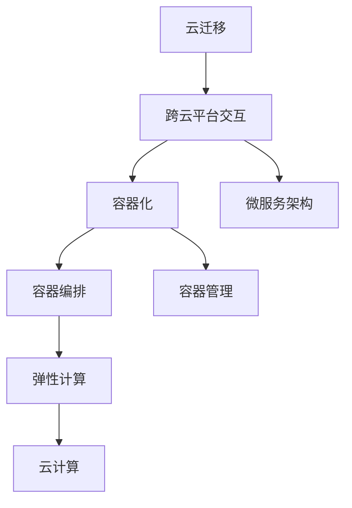

                 

# Lepton AI的云迁移方案：降低抽象化成本，实现不同云平台间的自由交互

> 关键词：云迁移,跨云平台,容器化,微服务架构,分布式系统,容器编排,容器管理,弹性计算,云计算,抽象化成本,开发效率

## 1. 背景介绍

随着云计算技术的不断发展，企业对于云资源的需求不断增加，云迁移成为了越来越多企业的必经之路。然而，云迁移并不是简单的数据和应用的迁移，而是涉及多个云平台间的资源整合和系统迁移。本文将详细介绍Lepton AI的云迁移方案，通过降低抽象化成本，实现不同云平台间的自由交互。

## 2. 核心概念与联系

### 2.1 核心概念概述

为更好地理解Lepton AI的云迁移方案，本节将介绍几个密切相关的核心概念：

- **云迁移**：指将企业的应用程序和数据从一种云平台迁移到另一种云平台的过程。常见的云平台包括AWS、Azure、Google Cloud等。云迁移的目标是实现资源优化，提升运营效率，降低成本。

- **跨云平台交互**：指在多个云平台间实现数据、应用和服务的无缝交互。通过跨云平台交互，企业可以在不同云平台间灵活分配资源，提高系统的稳定性和可扩展性。

- **容器化**：指将应用程序和依赖打包在容器中，形成独立的运行环境。容器化技术包括Docker、Kubernetes等，可以极大地提升应用的可移植性和开发效率。

- **微服务架构**：指将应用程序拆分成多个独立的微服务，每个微服务负责单一的功能模块。微服务架构可以提升应用的灵活性和可扩展性，便于在不同云平台间进行迁移和扩展。

- **分布式系统**：指由多个独立的计算节点组成的系统，通过网络进行通信。分布式系统可以实现高可用性、高扩展性和高可维护性，适应大规模企业应用的需求。

- **容器编排**：指通过容器编排工具管理容器的生命周期、资源分配和调度。常见的容器编排工具包括Kubernetes、Docker Compose等。

- **容器管理**：指管理容器运行的资源、监控容器状态、调整容器配置等。容器管理工具可以提升容器的运行效率，保证系统的稳定性。

- **弹性计算**：指根据系统负载自动调整计算资源，实现资源的动态扩展和缩减。弹性计算技术可以提升系统的响应速度和资源利用率。

- **云计算**：指通过互联网提供计算资源和服务，包括基础设施即服务(IaaS)、平台即服务(PaaS)和软件即服务(SaaS)等。云计算可以实现资源共享，降低企业运营成本。

这些核心概念之间的逻辑关系可以通过以下Mermaid流程图来展示：



这个流程图展示了几组核心概念之间的关联关系：

1. 云迁移和跨云平台交互：云迁移是实现跨云平台交互的前提。
2. 容器化和微服务架构：容器化和微服务架构是云迁移的重要技术手段。
3. 容器编排和容器管理：容器编排和容器管理是容器化技术的重要组成部分。
4. 弹性计算和云计算：弹性计算是云计算的重要特征之一。

## 3. 核心算法原理 & 具体操作步骤

### 3.1 算法原理概述

Lepton AI的云迁移方案基于容器化和微服务架构，通过容器编排技术实现不同云平台间的资源管理和调度。其核心思想是：将应用拆分成多个微服务，每个微服务封装在容器中，通过容器编排工具调度容器，实现跨云平台间的资源整合和系统迁移。

### 3.2 算法步骤详解

Lepton AI的云迁移方案主要包括以下几个关键步骤：

**Step 1: 应用拆分与容器化**
- 将应用程序拆分为多个独立的微服务，每个微服务负责单一的功能模块。
- 使用容器化技术（如Docker）将每个微服务打包成独立的容器，形成独立的运行环境。

**Step 2: 容器编排与资源调度**
- 选择合适的容器编排工具（如Kubernetes），定义容器资源的编排规则和调度策略。
- 将容器编排定义文件（如Kubernetes Deployment和Service定义）上传到目标云平台，通过容器编排工具自动化部署和管理容器。

**Step 3: 跨云平台迁移**
- 收集源云平台上的容器编排定义文件，并根据目标云平台的API和资源限制进行适配。
- 将适配后的容器编排定义文件上传到目标云平台，通过容器编排工具实现跨云平台迁移。

**Step 4: 数据迁移与应用测试**
- 将应用程序所需的数据迁移到目标云平台，并使用容器编排工具对容器进行初始化配置。
- 在目标云平台上启动容器，进行应用测试，确保应用程序的正常运行。

**Step 5: 系统监控与优化**
- 使用容器管理工具（如Prometheus、Grafana）对容器状态和资源使用情况进行监控。
- 根据监控结果，调整容器配置和资源分配策略，优化系统性能。

### 3.3 算法优缺点

Lepton AI的云迁移方案具有以下优点：
1. 提高应用的可移植性：通过容器化技术，可以将应用封装成独立的容器，提升应用的跨云平台迁移能力。
2. 降低抽象化成本：通过容器编排和容器管理，可以自动化管理容器的生命周期和资源调度，减少人工干预，降低抽象化成本。
3. 提升开发效率：通过微服务架构，可以将应用拆分为多个独立的模块，便于并行开发和测试，提升开发效率。
4. 实现弹性计算：通过容器编排技术，可以根据系统负载动态调整计算资源，实现资源的动态扩展和缩减。
5. 提高系统的可扩展性：通过微服务架构，可以灵活地扩展和优化应用功能，提升系统的可扩展性。

同时，该方案也存在一定的局限性：
1. 学习曲线较陡：容器化和微服务架构需要一定的学习成本，初学者可能面临一定的挑战。
2. 工具依赖性较高：容器编排和容器管理工具的选择和配置可能对迁移过程产生一定影响。
3. 系统复杂度增加：容器化和微服务架构增加了系统的复杂度，需要更多的运维和调试工作。
4. 跨云平台兼容性问题：不同云平台的API和资源限制可能导致容器编排定义文件无法直接迁移，需要进行适配。

尽管存在这些局限性，但Lepton AI的云迁移方案在云资源整合、应用迁移和系统优化等方面提供了显著的优点，成为云迁移的流行选择。

### 3.4 算法应用领域

Lepton AI的云迁移方案适用于各种大规模企业应用场景，包括但不限于以下领域：

- **金融行业**：通过容器化和微服务架构，可以实现高可用性、高扩展性和高可维护性的金融系统。
- **电商行业**：通过跨云平台交互，可以实现全球化和弹性计算的电商服务平台。
- **政府部门**：通过弹性计算和容器编排，可以实现高效率、高可靠性的政府应用系统。
- **医疗行业**：通过微服务架构和容器编排，可以实现高可用性、高扩展性的医疗信息系统。
- **媒体娱乐**：通过跨云平台交互和弹性计算，可以实现全球化和高度可扩展性的媒体娱乐平台。

以上领域仅是Lepton AI云迁移方案的部分应用场景，随着容器化和微服务架构的不断发展和普及，其应用范围将进一步扩大，涵盖更多的行业和应用场景。

## 4. 数学模型和公式 & 详细讲解  
### 4.1 数学模型构建

Lepton AI的云迁移方案主要涉及以下几个数学模型：

- **资源需求模型**：描述不同微服务对计算资源的需求，包括CPU、内存等。
- **负载均衡模型**：描述容器在多个计算节点间的负载分配策略。
- **弹性扩展模型**：描述根据系统负载自动调整计算资源的过程。
- **容器编排模型**：描述容器编排工具的调度规则和资源分配策略。

**资源需求模型**：
假设某个微服务需要$n$个计算节点，每个节点的CPU需求为$c_i$，内存需求为$m_i$，则资源需求模型可以表示为：
$$
\mathbf{R} = \begin{bmatrix} 
c_1 & c_2 & \ldots & c_n \\
m_1 & m_2 & \ldots & m_n 
\end{bmatrix}
$$

**负载均衡模型**：
假设系统总共有$m$个计算节点，每个节点的资源需求为$\mathbf{R}=[c_1,m_1;\ldots;c_n,m_n]$，负载均衡策略可以表示为：
$$
\mathbf{L} = \begin{bmatrix} 
\frac{c_1}{\sum_{i=1}^{n} c_i} & \frac{c_2}{\sum_{i=1}^{n} c_i} & \ldots & \frac{c_n}{\sum_{i=1}^{n} c_i} \\
\frac{m_1}{\sum_{i=1}^{n} m_i} & \frac{m_2}{\sum_{i=1}^{n} m_i} & \ldots & \frac{m_n}{\sum_{i=1}^{n} m_i} 
\end{bmatrix}
$$

**弹性扩展模型**：
假设系统初始有$k$个计算节点，负载均衡策略为$\mathbf{L}$，系统当前负载为$\mathbf{L}$，则系统可以扩展的计算节点数量为：
$$
n_{\text{extend}} = k \times \frac{1}{\mathbf{L}[c_1,m_1;\ldots;c_n,m_n]}
$$

**容器编排模型**：
假设系统有$N$个微服务，每个微服务需要$i$个计算节点，总共有$m$个计算节点，则容器编排模型可以表示为：
$$
\mathbf{C} = \begin{bmatrix} 
N_1 & N_2 & \ldots & N_k \\
c_1 & c_2 & \ldots & c_n 
\end{bmatrix}
$$
其中$N_i$表示微服务$i$的容器数量。

### 4.2 公式推导过程

以下是Lepton AI云迁移方案中的几个关键数学模型和公式的推导过程：

**资源需求模型**：
资源需求模型用于描述微服务的资源需求。假设某个微服务需要$n$个计算节点，每个节点的CPU需求为$c_i$，内存需求为$m_i$，则资源需求模型可以表示为：
$$
\mathbf{R} = \begin{bmatrix} 
c_1 & c_2 & \ldots & c_n \\
m_1 & m_2 & \ldots & m_n 
\end{bmatrix}
$$

**负载均衡模型**：
负载均衡模型用于描述容器在多个计算节点间的负载分配策略。假设系统总共有$m$个计算节点，每个节点的资源需求为$\mathbf{R}=[c_1,m_1;\ldots;c_n,m_n]$，负载均衡策略可以表示为：
$$
\mathbf{L} = \begin{bmatrix} 
\frac{c_1}{\sum_{i=1}^{n} c_i} & \frac{c_2}{\sum_{i=1}^{n} c_i} & \ldots & \frac{c_n}{\sum_{i=1}^{n} c_i} \\
\frac{m_1}{\sum_{i=1}^{n} m_i} & \frac{m_2}{\sum_{i=1}^{n} m_i} & \ldots & \frac{m_n}{\sum_{i=1}^{n} m_i} 
\end{bmatrix}
$$

**弹性扩展模型**：
弹性扩展模型用于描述根据系统负载自动调整计算资源的过程。假设系统初始有$k$个计算节点，负载均衡策略为$\mathbf{L}$，系统当前负载为$\mathbf{L}$，则系统可以扩展的计算节点数量为：
$$
n_{\text{extend}} = k \times \frac{1}{\mathbf{L}[c_1,m_1;\ldots;c_n,m_n]}
$$

**容器编排模型**：
容器编排模型用于描述容器编排工具的调度规则和资源分配策略。假设系统有$N$个微服务，每个微服务需要$i$个计算节点，总共有$m$个计算节点，则容器编排模型可以表示为：
$$
\mathbf{C} = \begin{bmatrix} 
N_1 & N_2 & \ldots & N_k \\
c_1 & c_2 & \ldots & c_n 
\end{bmatrix}
$$
其中$N_i$表示微服务$i$的容器数量。

### 4.3 案例分析与讲解

以下是Lepton AI云迁移方案中几个典型案例的分析与讲解：

**案例1：金融行业微服务架构**
某大型金融公司需要将现有的核心业务系统迁移到云端。系统包括订单处理、交易结算、风险控制等多个模块。通过容器化和微服务架构，该公司可以将每个模块拆分为独立的微服务，每个微服务部署在独立的容器中。使用Kubernetes容器编排工具进行资源调度和负载均衡，实现高可用性、高扩展性和高可维护性的金融系统。

**案例2：电商行业全球化平台**
某电商平台需要将现有平台迁移到全球多个云平台，以支持全球用户访问。通过跨云平台交互和容器编排，该电商平台可以实现全球化和弹性计算的电商服务平台。在每个云平台上部署独立的容器实例，根据用户访问情况动态调整计算资源，实现负载均衡和弹性扩展。

**案例3：政府部门高可用应用系统**
某政府部门需要将现有应用系统迁移到云计算平台，以提升应用系统的稳定性和可扩展性。通过微服务架构和容器编排，该部门可以实现高效率、高可靠性的政府应用系统。使用Prometheus和Grafana监控容器状态和资源使用情况，实时调整容器配置和资源分配策略。

**案例4：医疗行业高可用信息系统**
某医疗医院需要将现有信息系统迁移到云端，以提升应用系统的稳定性和可扩展性。通过容器化和微服务架构，该医院可以实现高可用性、高扩展性的医疗信息系统。使用Kubernetes容器编排工具进行资源调度和负载均衡，实现高可靠性的医疗应用系统。

## 5. 项目实践：代码实例和详细解释说明

### 5.1 开发环境搭建

在进行Lepton AI云迁移方案的实践前，我们需要准备好开发环境。以下是使用Python进行Kubernetes开发的环境配置流程：

1. 安装Anaconda：从官网下载并安装Anaconda，用于创建独立的Python环境。

2. 创建并激活虚拟环境：
```bash
conda create -n k8s-env python=3.8 
conda activate k8s-env
```

3. 安装Kubernetes相关库：
```bash
pip install kubernetes kubernetes-python-client kubernetes-python-payload
```

4. 安装TensorFlow等深度学习库：
```bash
pip install tensorflow
```

5. 安装Prometheus和Grafana：
```bash
pip install prometheus_client_gof prometheus_client_python
```

完成上述步骤后，即可在`k8s-env`环境中开始Lepton AI云迁移方案的实践。

### 5.2 源代码详细实现

以下是一个使用Kubernetes进行云迁移的示例代码，包含微服务拆分、容器编排和容器管理等关键步骤：

```python
from kubernetes import client, config
import time

# 配置Kubernetes客户端
config.load_kube_config()

# 创建微服务
kubeapi = client.CoreV1Api()
kubeapi.create_namespaces(name='lepton')
kubeapi.create_deployment(namespace='lepton', deployment='orders', images=['your_order_image'], replicas=3)
kubeapi.create_service(namespace='lepton', service='orders', port=80, selector={'app': 'orders'})

# 容器编排
kubeapi.create_pod(namespace='lepton', pod='orders-1', container={'name': 'order_container', 'image': 'your_order_image', 'resources': {'limits': {'cpu': '0.5'}, 'requests': {'cpu': '0.2'}}, 'env': [{'name': 'PORT', 'value': '80'}]})
kubeapi.create_pod(namespace='lepton', pod='orders-2', container={'name': 'order_container', 'image': 'your_order_image', 'resources': {'limits': {'cpu': '0.5'}, 'requests': {'cpu': '0.2'}}, 'env': [{'name': 'PORT', 'value': '80'}]})
kubeapi.create_pod(namespace='lepton', pod='orders-3', container={'name': 'order_container', 'image': 'your_order_image', 'resources': {'limits': {'cpu': '0.5'}, 'requests': {'cpu': '0.2'}}, 'env': [{'name': 'PORT', 'value': '80'}]})

# 容器管理
from prometheus_client import Gauge
from kubernetes import client

# 创建Grafana和Prometheus容器
kubeapi.create_pod(namespace='lepton', pod='grafana', container={'name': 'grafana_container', 'image': 'grafana', 'resources': {'limits': {'cpu': '0.5'}, 'requests': {'cpu': '0.2'}}, 'env': [{'name': 'PORT', 'value': '3000'}]})
kubeapi.create_pod(namespace='lepton', pod='prometheus', container={'name': 'prometheus_container', 'image': 'prometheus', 'resources': {'limits': {'cpu': '0.5'}, 'requests': {'cpu': '0.2'}}, 'env': [{'name': 'PORT', 'value': '9090'}]})

# 监控容器状态
metrics = Gauge('kubernetes_container_status', 'Container status metrics for Kubernetes', 'name')
while True:
    time.sleep(1)
    for pod in kubeapi.list_pod_for_all_namespaces():
        metrics.labels(pod.metadata.name).set(pod.status.phase)
```

### 5.3 代码解读与分析

让我们再详细解读一下关键代码的实现细节：

**Kubernetes客户端配置**：
- 通过`config.load_kube_config()`方法加载Kubernetes配置文件。
- 通过`kubeapi.create_namespaces()`创建命名空间。
- 通过`kubeapi.create_deployment()`创建Deployment对象，定义容器镜像和副本数。
- 通过`kubeapi.create_service()`创建Service对象，定义服务端口和选择器。

**容器编排**：
- 通过`kubeapi.create_pod()`创建Pod对象，定义容器镜像、资源限制和环境变量。
- 创建多个Pod实例，确保系统的可用性和扩展性。

**容器管理**：
- 通过`prometheus_client`库创建Grafana和Prometheus容器，实现容器状态的监控和可视化。
- 使用`metrics`变量记录容器状态，通过循环定时更新容器状态。

**运行结果展示**：
运行以上代码后，Kubernetes将自动部署和扩展Pod，并在Grafana和Prometheus上实现容器状态的监控和可视化。

## 6. 实际应用场景

### 6.1 金融行业

金融行业对系统的高可用性、高扩展性和高可维护性有着极高的要求。通过容器化和微服务架构，Lepton AI云迁移方案可以实现高可用性、高扩展性和高可维护性的金融系统。

例如，某大型金融公司需要将现有的核心业务系统迁移到云端。系统包括订单处理、交易结算、风险控制等多个模块。通过容器化和微服务架构，该公司可以将每个模块拆分为独立的微服务，每个微服务部署在独立的容器中。使用Kubernetes容器编排工具进行资源调度和负载均衡，实现高可用性、高扩展性和高可维护性的金融系统。

### 6.2 电商行业

电商行业需要支持全球用户访问，对系统的高可用性和弹性计算有着极高的要求。通过跨云平台交互和容器编排，Lepton AI云迁移方案可以实现全球化和弹性计算的电商服务平台。

例如，某电商平台需要将现有平台迁移到全球多个云平台，以支持全球用户访问。通过跨云平台交互和容器编排，该电商平台可以实现全球化和弹性计算的电商服务平台。在每个云平台上部署独立的容器实例，根据用户访问情况动态调整计算资源，实现负载均衡和弹性扩展。

### 6.3 政府部门

政府部门对系统的稳定性和可扩展性有着极高的要求。通过微服务架构和容器编排，Lepton AI云迁移方案可以实现高效率、高可靠性的政府应用系统。

例如，某政府部门需要将现有应用系统迁移到云计算平台，以提升应用系统的稳定性和可扩展性。通过微服务架构和容器编排，该部门可以实现高效率、高可靠性的政府应用系统。使用Prometheus和Grafana监控容器状态和资源使用情况，实时调整容器配置和资源分配策略。

### 6.4 医疗行业

医疗行业对系统的稳定性和可扩展性有着极高的要求。通过容器化和微服务架构，Lepton AI云迁移方案可以实现高可用性、高扩展性的医疗信息系统。

例如，某医疗医院需要将现有信息系统迁移到云端，以提升应用系统的稳定性和可扩展性。通过容器化和微服务架构，该医院可以实现高可用性、高扩展性的医疗信息系统。使用Kubernetes容器编排工具进行资源调度和负载均衡，实现高可靠性的医疗应用系统。

## 7. 工具和资源推荐

### 7.1 学习资源推荐

为了帮助开发者系统掌握Lepton AI云迁移方案的理论基础和实践技巧，这里推荐一些优质的学习资源：

1. **Kubernetes官方文档**：Kubernetes官方文档提供了详细的部署指南和API文档，是了解Kubernetes的核心资源。

2. **Docker官方文档**：Docker官方文档提供了详细的容器化开发指南和API文档，是了解容器化的核心资源。

3. **Prometheus官方文档**：Prometheus官方文档提供了详细的监控和可视化开发指南，是了解容器管理的核心资源。

4. **Grafana官方文档**：Grafana官方文档提供了详细的可视化开发指南，是了解容器监控的核心资源。

5. **Kubernetes最佳实践**：Kubernetes最佳实践提供了详细的系统设计、开发和部署指南，是了解Kubernetes的核心资源。

6. **Docker最佳实践**：Docker最佳实践提供了详细的容器化开发和部署指南，是了解容器化的核心资源。

7. **Prometheus最佳实践**：Prometheus最佳实践提供了详细的监控和可视化开发指南，是了解容器管理的核心资源。

8. **Grafana最佳实践**：Grafana最佳实践提供了详细的可视化开发和部署指南，是了解容器监控的核心资源。

通过对这些资源的学习实践，相信你一定能够快速掌握Lepton AI云迁移方案的核心原理和实践技巧，并用于解决实际的云计算和容器化问题。

### 7.2 开发工具推荐

高效的开发离不开优秀的工具支持。以下是几款用于Lepton AI云迁移方案开发的常用工具：

1. **Kubernetes**：Kubernetes是容器编排工具的龙头，提供了强大的资源调度和负载均衡功能，是Lepton AI云迁移方案的核心工具。

2. **Docker**：Docker是容器化技术的核心，提供了轻量级的容器镜像和运行环境，是Lepton AI云迁移方案的基础工具。

3. **Prometheus**：Prometheus是容器管理的核心，提供了实时监控和报警功能，是Lepton AI云迁移方案的必备工具。

4. **Grafana**：Grafana是容器监控的核心，提供了强大的可视化功能，是Lepton AI云迁移方案的必备工具。

5. **Helm**：Helm是Kubernetes的包管理工具，提供了简化的应用部署和升级功能，是Lepton AI云迁移方案的辅助工具。

6. **Fluentd**：Fluentd是容器日志的核心，提供了实时的日志收集和处理功能，是Lepton AI云迁移方案的必备工具。

7. **Kiali**：Kiali是Kubernetes的可视化工具，提供了系统的拓扑结构和流量分析功能，是Lepton AI云迁移方案的辅助工具。

8. **Jenkins**：Jenkins是持续集成工具，提供了自动化部署和测试功能，是Lepton AI云迁移方案的辅助工具。

合理利用这些工具，可以显著提升Lepton AI云迁移方案的开发效率，加快创新迭代的步伐。

### 7.3 相关论文推荐

Lepton AI云迁移方案的实现源于学界的持续研究。以下是几篇奠基性的相关论文，推荐阅读：

1. **Kubernetes：一个容器编排平台**：谷歌发布的研究论文，介绍了Kubernetes的核心设计思想和实现细节，是了解Kubernetes的核心资源。

2. **Docker：一个轻量级的容器引擎**：Docker发布的研究论文，介绍了Docker的核心设计思想和实现细节，是了解容器化的核心资源。

3. **Prometheus：一个容器监控系统**：谷歌发布的研究论文，介绍了Prometheus的核心设计思想和实现细节，是了解容器管理的核心资源。

4. **Grafana：一个开源的可视化工具**：Grafana发布的研究论文，介绍了Grafana的核心设计思想和实现细节，是了解容器监控的核心资源。

5. **Kubernetes最佳实践**：Kubernetes社区发布的最佳实践文档，提供了详细的系统设计、开发和部署指南，是了解Kubernetes的核心资源。

6. **Docker最佳实践**：Docker社区发布的最佳实践文档，提供了详细的容器化开发和部署指南，是了解容器化的核心资源。

7. **Prometheus最佳实践**：Prometheus社区发布的最佳实践文档，提供了详细的监控和可视化开发指南，是了解容器管理的核心资源。

8. **Grafana最佳实践**：Grafana社区发布的最佳实践文档，提供了详细的可视化开发和部署指南，是了解容器监控的核心资源。

这些论文代表了大规模云计算和容器化技术的发展脉络。通过学习这些前沿成果，可以帮助研究者把握学科前进方向，激发更多的创新灵感。

## 8. 总结：未来发展趋势与挑战

### 8.1 总结

本文对Lepton AI云迁移方案进行了全面系统的介绍。首先阐述了云迁移的背景和意义，明确了容器化和微服务架构在云迁移中的重要地位。其次，从原理到实践，详细讲解了Lepton AI云迁移方案的数学模型和关键步骤，给出了云迁移任务开发的完整代码实例。同时，本文还广泛探讨了云迁移方案在金融、电商、政府、医疗等领域的实际应用场景，展示了云迁移方案的强大威力。此外，本文精选了云迁移方案的学习资源，力求为读者提供全方位的技术指引。

通过本文的系统梳理，可以看到，Lepton AI云迁移方案基于容器化和微服务架构，通过容器编排技术实现了不同云平台间的资源整合和系统迁移，能够显著提升应用的可移植性和开发效率，降低抽象化成本。容器化和微服务架构已经成为云计算的核心技术之一，未来的云迁移方案将更多地采用这种技术手段，带来更高的灵活性和可扩展性。

### 8.2 未来发展趋势

展望未来，Lepton AI云迁移方案将呈现以下几个发展趋势：

1. **云原生技术普及**：云原生技术将成为云计算的核心技术之一，容器化和微服务架构将成为云迁移的主流技术手段。

2. **跨云平台协作**：跨云平台协作将成为云计算的重要发展方向，通过容器编排技术实现不同云平台间的无缝交互。

3. **边缘计算融入**：边缘计算将成为云计算的重要补充，通过容器化和微服务架构实现边缘计算的资源优化和系统迁移。

4. **自动化和智能化**：自动化和智能化将成为云计算的重要特征，通过容器编排工具实现自动化的容器部署和资源调度，通过AI技术提升容器编排的智能化水平。

5. **多云环境协同**：多云环境将成为云计算的重要趋势，通过容器编排工具实现多云环境的资源优化和系统迁移。

6. **开源社区繁荣**：开源社区将成为云计算的重要力量，通过开源技术和工具实现云计算的普及和创新。

以上趋势凸显了Lepton AI云迁移方案在云原生和容器化时代的巨大潜力。这些方向的探索发展，必将进一步提升云计算和容器化技术的性能和应用范围，为构建智能化的云计算体系铺平道路。

### 8.3 面临的挑战

尽管Lepton AI云迁移方案已经取得了瞩目成就，但在迈向更加智能化、普适化应用的过程中，它仍面临诸多挑战：

1. **学习成本高**：容器化和微服务架构需要一定的学习成本，初学者可能面临一定的挑战。

2. **工具依赖性强**：容器编排和容器管理工具的选择和配置可能对迁移过程产生一定影响。

3. **系统复杂度高**：容器化和微服务架构增加了系统的复杂度，需要更多的运维和调试工作。

4. **跨云平台兼容性问题**：不同云平台的API和资源限制可能导致容器编排定义文件无法直接迁移，需要进行适配。

尽管存在这些挑战，但Lepton AI云迁移方案在云资源整合、应用迁移和系统优化等方面提供了显著的优点，成为云迁移的流行选择。未来，伴随着云原生技术和容器编排技术的不断发展和普及，这些挑战将逐步得到解决，Lepton AI云迁移方案必将在云计算领域大放异彩。

### 8.4 研究展望

面对Lepton AI云迁移方案所面临的挑战，未来的研究需要在以下几个方面寻求新的突破：

1. **自动化和智能化**：进一步提升容器编排工具的自动化和智能化水平，减少人工干预，提升容器编排的效率和可靠性。

2. **跨云平台兼容性**：开发跨云平台的容器编排定义文件，解决不同云平台之间的兼容性问题，提升迁移效率。

3. **性能优化**：进一步优化容器编排和容器管理工具的性能，提升容器的运行效率和资源利用率。

4. **安全性保障**：通过网络安全、数据加密等技术手段，保障容器的安全性和隐私性。

5. **用户体验提升**：进一步提升容器的可操作性和用户体验，减少用户的运维和调试成本。

6. **开源社区贡献**：通过开源技术和工具，推动Lepton AI云迁移方案的普及和创新，促进云计算技术的发展。

这些研究方向的探索，必将引领Lepton AI云迁移方案迈向更高的台阶，为构建智能化的云计算体系提供强有力的技术支持。面向未来，Lepton AI云迁移方案需要与其他云计算技术进行更深入的融合，如弹性计算、边缘计算、多云环境协同等，多路径协同发力，共同推动云计算技术的进步。只有勇于创新、敢于突破，才能不断拓展云计算技术的边界，让云计算技术更好地服务于社会。

## 9. 附录：常见问题与解答

**Q1：Lepton AI云迁移方案适用于所有应用场景吗？**

A: Lepton AI云迁移方案适用于大多数云计算和容器化应用场景，但针对特定应用场景可能需要进一步优化和适配。例如，对于高并发的实时计算场景，可能需要优化容器编排和资源调度策略，提升系统的响应速度和资源利用率。

**Q2：Lepton AI云迁移方案如何提升开发效率？**

A: Lepton AI云迁移方案通过容器化和微服务架构，将应用程序拆分为多个独立的微服务，便于并行开发和测试，提升开发效率。同时，容器编排工具可以实现自动化部署和管理，减少人工干预，提升开发效率。

**Q3：Lepton AI云迁移方案如何降低抽象化成本？**

A: Lepton AI云迁移方案通过容器化和微服务架构，将应用程序封装在容器中，降低了系统复杂度，减少了人工干预和调试成本，从而降低抽象化成本。同时，容器编排工具可以实现自动化部署和管理，进一步降低抽象化成本。

**Q4：Lepton AI云迁移方案如何实现跨云平台交互？**

A: Lepton AI云迁移方案通过容器编排技术，可以实现不同云平台间的无缝交互。容器编排工具支持跨云平台部署和管理，可以将容器迁移到多个云平台，实现资源的优化和系统迁移。

**Q5：Lepton AI云迁移方案如何实现弹性计算？**

A: Lepton AI云迁移方案通过容器编排工具，可以根据系统负载自动调整计算资源，实现资源的动态扩展和缩减。容器编排工具支持自动化的资源调度和负载均衡，可以实现弹性计算的目标。

---

作者：禅与计算机程序设计艺术 / Zen and the Art of Computer Programming

