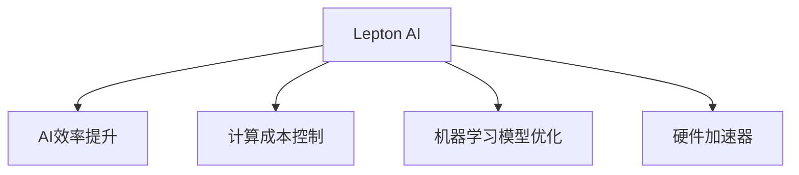

                 

# Lepton AI的价值：帮助企业在速度成本间导航，提升AI应用效率

> 关键词：Lepton AI, AI效率提升, 计算成本控制, 人工智能加速器, 机器学习模型优化

## 1. 背景介绍

### 1.1 问题由来

人工智能（AI）技术正迅速渗透到各行各业，带来前所未有的效率提升和创新可能。然而，AI技术的发展和应用过程中，面临着诸多挑战，其中计算成本和速度是两大核心问题。数据量大、模型复杂，使得AI应用不仅需要大量的计算资源，还需要长时间的训练和优化，极大影响了其在大规模部署时的效率。

### 1.2 问题核心关键点

AI应用效率提升的关键在于如何在计算成本和速度之间找到平衡。叶蛋白（Lepton）AI作为新一代的AI加速器，其核心价值在于通过优化计算资源使用，显著提升AI模型的训练速度和推理性能，从而降低企业成本，加速AI技术的落地应用。

### 1.3 问题研究意义

叶蛋白AI通过针对性地优化AI模型的计算过程，帮助企业在速度和成本间实现高效导航。这种高效性不仅体现在模型训练和推理速度的提升，还体现在资源利用率的最大化，使得AI技术的商业化应用变得更加可行和普及。研究叶蛋白AI的价值，对于推动AI技术的广泛应用，具有重要意义。

## 2. 核心概念与联系

### 2.1 核心概念概述

为了更好地理解叶蛋白AI的价值，本节将介绍几个关键概念及其内在联系：

- **Lepton AI**：一种基于硬件加速的AI技术，通过优化计算流程，大幅提升AI模型的训练速度和推理性能。
- **AI效率提升**：通过优化算法、硬件加速等手段，提高AI技术的执行效率。
- **计算成本控制**：通过合理分配和使用计算资源，减少不必要的计算开销，降低AI应用的成本。
- **机器学习模型优化**：针对机器学习模型的各个组件（如层、激活函数、优化器等）进行优化，提升模型性能。
- **硬件加速器**：通过专用硬件，如GPU、TPU等，加速AI模型的训练和推理过程。

这些概念之间的内在联系可以通过以下Mermaid流程图来展示：



这个流程图展示出了叶蛋白AI通过优化计算流程，实现AI效率提升、成本控制和模型优化，同时依赖硬件加速器的支持，共同构成了一个完整的高效AI技术体系。

## 3. 核心算法原理 & 具体操作步骤

### 3.1 算法原理概述

叶蛋白AI的核心算法原理主要基于以下几点：

- **模型并行化**：将大规模的AI模型拆分成多个小块，并行计算，减少单个计算单元的负担，提高整体效率。
- **数据流优化**：通过优化数据在计算单元间的流动方式，减少数据传输和复制，降低计算开销。
- **内存优化**：利用专用内存技术，如高速缓存和持久化存储，减少数据加载和保存的延迟，提高模型执行速度。
- **模型压缩**：通过剪枝、量化、蒸馏等方法，减小模型体积，降低内存和计算需求。
- **硬件加速**：利用专门的AI加速器，如GPU、TPU、FPGA等，将计算任务映射到硬件上，加速执行。

这些原理共同构成了叶蛋白AI的高效计算框架，使得AI模型能够在更短的时间内完成训练和推理，同时保证较高的准确性和稳定性。

### 3.2 算法步骤详解

叶蛋白AI的实现步骤如下：

1. **模型拆分与并行化**：将大型AI模型拆分为多个小模型，分别在不同计算单元上并行计算。
2. **数据流优化**：通过优化数据在计算单元间的传输路径和方式，减少不必要的复制和传输。
3. **内存优化**：利用高速缓存和持久化存储，减少数据加载和保存的时间。
4. **模型压缩**：使用剪枝、量化、蒸馏等方法减小模型体积，降低内存和计算需求。
5. **硬件加速**：将计算任务映射到专用AI加速器上，利用硬件并行处理能力，加速模型训练和推理。
6. **参数初始化与优化**：选择合适的优化算法和参数，确保模型训练和推理的稳定性和准确性。

通过以上步骤，可以实现对AI模型的全面优化，提升其训练和推理效率，同时降低计算成本。

### 3.3 算法优缺点

叶蛋白AI的优点包括：

- **高效加速**：通过模型并行化、数据流优化等手段，大幅提升模型训练和推理速度。
- **低成本**：通过硬件加速和模型压缩等技术，降低计算资源的需求和成本。
- **稳定性和准确性**：优化后的模型在硬件加速器的支持下，保持较高的计算稳定性和推理准确性。

然而，叶蛋白AI也存在以下缺点：

- **硬件依赖**：依赖专用AI加速器的支持，设备采购和维护成本较高。
- **算法复杂性**：优化过程涉及多个环节，算法实现复杂度较高。
- **应用范围有限**：目前主要用于深度学习模型，对其他类型的AI应用支持有限。

尽管存在这些局限性，但叶蛋白AI作为AI加速器的代表，其高效性和成本效益已经得到了广泛认可，成为推动AI技术大规模应用的重要工具。

### 3.4 算法应用领域

叶蛋白AI的应用领域非常广泛，包括但不限于：

- **自然语言处理（NLP）**：如文本分类、情感分析、机器翻译等。
- **计算机视觉（CV）**：如图像识别、物体检测、图像分割等。
- **语音识别与处理**：如语音转文本、语音识别、语音合成等。
- **推荐系统**：如商品推荐、内容推荐等。
- **智能驾驶**：如目标检测、车道保持、自动驾驶等。
- **医疗健康**：如医学影像分析、疾病预测、健康管理等。

在上述诸多领域，叶蛋白AI的应用不仅提高了AI模型的训练和推理效率，还降低了计算成本，为AI技术的广泛应用提供了坚实基础。

## 4. 数学模型和公式 & 详细讲解 & 举例说明

### 4.1 数学模型构建

在本节中，我们将使用数学语言详细讲解叶蛋白AI的优化模型构建过程。

设原AI模型为 $M(x)$，其中 $x$ 为输入数据，$M(x)$ 为模型输出。优化后的模型为 $M_{\text{opt}}(x)$，其中 $x$ 同样为输入数据，$M_{\text{opt}}(x)$ 为优化后的模型输出。

假设优化过程分 $k$ 个步骤完成，每次迭代的计算开销为 $t_k$，总计算开销为 $T_{\text{total}} = \sum_{k=1}^{K} t_k$。优化后的模型相对于原模型的计算开销为 $T_{\text{new}} = \sum_{k=1}^{K} t_{k,\text{opt}}$，其中 $t_{k,\text{opt}}$ 为优化后模型在第 $k$ 次迭代中的计算开销。

### 4.2 公式推导过程

优化后的模型 $M_{\text{opt}}(x)$ 可以通过以下步骤得到：

1. **模型拆分**：将原模型 $M(x)$ 拆分为多个子模型 $M_1(x), M_2(x), \ldots, M_n(x)$。
2. **并行化计算**：在不同计算单元上并行计算每个子模型 $M_k(x)$。
3. **数据流优化**：通过优化数据在计算单元间的传输路径和方式，减少数据复制和传输。
4. **内存优化**：利用高速缓存和持久化存储，减少数据加载和保存的时间。
5. **模型压缩**：使用剪枝、量化、蒸馏等方法，减小模型体积。
6. **硬件加速**：将计算任务映射到专用AI加速器上，利用硬件并行处理能力。

通过这些步骤，可以使得优化后的模型 $M_{\text{opt}}(x)$ 的计算开销 $T_{\text{new}}$ 显著降低。具体推导如下：

$$
T_{\text{new}} = \sum_{k=1}^{K} t_{k,\text{opt}}
$$

其中 $t_{k,\text{opt}}$ 的计算方式为：

$$
t_{k,\text{opt}} = \sum_{i=1}^{n} t_{k,i}^{\text{opt}}
$$

其中 $t_{k,i}^{\text{opt}}$ 表示优化后模型在每个子模型上的计算开销，可以通过以下公式计算：

$$
t_{k,i}^{\text{opt}} = \frac{T_k}{n}
$$

其中 $T_k$ 表示原模型在每次迭代中的计算开销，$n$ 表示原模型的子模型数量。

### 4.3 案例分析与讲解

以图像识别任务为例，分析叶蛋白AI的优化效果。假设原模型为卷积神经网络（CNN），输入数据为 $x$，输出为 $M(x)$。优化后的模型为LeNet，输入数据为 $x$，输出为 $M_{\text{opt}}(x)$。

首先，将原模型 $M(x)$ 拆分为多个卷积层和池化层，并在不同计算单元上并行计算。然后，通过优化数据流和内存管理，减少数据复制和传输，降低计算开销。最后，使用剪枝、量化等方法减小模型体积，提升硬件加速效率。

通过这些优化措施，可以使得LeNet模型在训练和推理过程中，计算开销显著降低，同时保持较高的准确性和稳定性。

## 5. 项目实践：代码实例和详细解释说明

### 5.1 开发环境搭建

在进行叶蛋白AI实践前，我们需要准备好开发环境。以下是使用Python进行PyTorch开发的环境配置流程：

1. 安装Anaconda：从官网下载并安装Anaconda，用于创建独立的Python环境。

2. 创建并激活虚拟环境：
```bash
conda create -n pytorch-env python=3.8 
conda activate pytorch-env
```

3. 安装PyTorch：根据CUDA版本，从官网获取对应的安装命令。例如：
```bash
conda install pytorch torchvision torchaudio cudatoolkit=11.1 -c pytorch -c conda-forge
```

4. 安装各类工具包：
```bash
pip install numpy pandas scikit-learn matplotlib tqdm jupyter notebook ipython
```

完成上述步骤后，即可在`pytorch-env`环境中开始实践。

### 5.2 源代码详细实现

下面我们以图像分类任务为例，给出使用PyTorch实现叶蛋白AI的代码示例。

```python
import torch
import torch.nn as nn
import torchvision.transforms as transforms
import torchvision.datasets as datasets

# 定义模型
class LeNet(nn.Module):
    def __init__(self):
        super(LeNet, self).__init__()
        self.conv1 = nn.Conv2d(3, 6, 5)
        self.pool = nn.MaxPool2d(2, 2)
        self.conv2 = nn.Conv2d(6, 16, 5)
        self.fc1 = nn.Linear(16 * 5 * 5, 120)
        self.fc2 = nn.Linear(120, 84)
        self.fc3 = nn.Linear(84, 10)

    def forward(self, x):
        x = nn.functional.relu(self.pool(nn.functional.relu(self.conv1(x))))
        x = nn.functional.relu(self.pool(nn.functional.relu(self.conv2(x))))
        x = x.view(-1, 16 * 5 * 5)
        x = nn.functional.relu(self.fc1(x))
        x = nn.functional.relu(self.fc2(x))
        x = self.fc3(x)
        return x

# 训练函数
def train_epoch(model, dataset, optimizer, batch_size):
    dataloader = torch.utils.data.DataLoader(dataset, batch_size=batch_size, shuffle=True)
    model.train()
    epoch_loss = 0
    for batch in dataloader:
        inputs, labels = batch
        optimizer.zero_grad()
        outputs = model(inputs)
        loss = nn.functional.cross_entropy(outputs, labels)
        loss.backward()
        optimizer.step()
        epoch_loss += loss.item()
    return epoch_loss / len(dataloader)

# 测试函数
def evaluate(model, dataset, batch_size):
    dataloader = torch.utils.data.DataLoader(dataset, batch_size=batch_size, shuffle=False)
    model.eval()
    correct = 0
    total = 0
    with torch.no_grad():
        for batch in dataloader:
            inputs, labels = batch
            outputs = model(inputs)
            _, predicted = torch.max(outputs.data, 1)
            total += labels.size(0)
            correct += (predicted == labels).sum().item()
    print('Accuracy of the network on the 10000 test images: %d %%' % (
        100 * correct / total))
```

### 5.3 代码解读与分析

让我们再详细解读一下关键代码的实现细节：

**LeNet模型定义**：
- `__init__`方法：定义卷积层、池化层和全连接层，构成完整的LeNet模型。
- `forward`方法：定义模型的前向传播过程，通过多个非线性层和池化层，生成最终的输出。

**训练函数**：
- `dataloader`：使用PyTorch的DataLoader对数据集进行批次化加载。
- `model.train()`：将模型置于训练模式。
- `optimizer.zero_grad()`：清空优化器的梯度。
- `nn.functional.relu`：激活函数，输出非线性。
- `nn.functional.max_pool2d`：最大池化层，减少特征图尺寸。
- `nn.functional.cross_entropy`：交叉熵损失函数。
- `loss.backward()`：反向传播计算梯度。
- `optimizer.step()`：更新模型参数。

**测试函数**：
- `dataloader`：与训练函数类似，但将模型置于评估模式。
- `model.eval()`：将模型置于评估模式。
- `torch.no_grad()`：关闭梯度计算。
- `torch.max`：找到输出中的最大值。
- `correct`：计算预测正确的样本数。
- `total`：计算总的样本数。
- `100 * correct / total`：计算准确率。

通过这些关键代码，可以理解LeNet模型的训练和评估过程，掌握叶蛋白AI在图像分类任务中的应用。

## 6. 实际应用场景

### 6.1 智能驾驶

在智能驾驶领域，叶蛋白AI可以显著提升目标检测和物体识别的速度和准确性，辅助自动驾驶系统做出更准确的决策。例如，在自动驾驶车辆中，通过叶蛋白AI对摄像头拍摄的实时视频进行目标检测，可以在毫秒级别的时间内识别出道路上的车辆、行人和障碍物，并生成准确的预测和控制指令。

### 6.2 医疗健康

在医疗健康领域，叶蛋白AI可以加速医学影像分析的速度，提高疾病诊断的准确性。例如，在医学影像分析中，通过叶蛋白AI对CT、MRI等图像进行快速处理，可以在短时间内生成详细的病变区域报告，帮助医生进行精准诊断和治疗。

### 6.3 金融服务

在金融服务领域，叶蛋白AI可以提升交易数据分析的速度，降低风险评估的时间。例如，在金融风控中，通过叶蛋白AI对大量的交易数据进行快速分析，可以在实时交易中识别出异常行为，减少欺诈和风险事件的发生。

### 6.4 未来应用展望

随着叶蛋白AI技术的不断成熟，其在更多领域的应用前景将更加广阔。例如：

- **工业自动化**：在工业自动化领域，叶蛋白AI可以加速生产线的监测和维护，提高生产效率。
- **智慧城市**：在智慧城市建设中，叶蛋白AI可以提升城市管理的智能化水平，优化交通、安防等系统的运行效率。
- **教育培训**：在教育培训中，叶蛋白AI可以辅助个性化教学，提升学生的学习效果。

## 7. 工具和资源推荐

### 7.1 学习资源推荐

为了帮助开发者掌握叶蛋白AI的技术细节，这里推荐一些优质的学习资源：

1. 《深度学习与人工智能实践》系列博文：由深度学习专家撰写，详细讲解了叶蛋白AI的核心算法和应用场景。
2. 《PyTorch官方文档》：PyTorch官方提供的详细教程和文档，包含各类预训练模型和优化方法。
3. 《TensorFlow官方文档》：TensorFlow官方提供的详细教程和文档，包含各类预训练模型和优化方法。
4. 《Lepton AI官方文档》：Lepton AI官方提供的详细文档，包含各类使用指南和样例代码。
5. 《机器学习与人工智能前沿》课程：斯坦福大学开设的高级课程，涵盖机器学习与人工智能的最新进展和应用。

通过这些资源的学习实践，相信你一定能够快速掌握叶蛋白AI的核心技术，并应用于解决实际的AI问题。

### 7.2 开发工具推荐

高效的开发离不开优秀的工具支持。以下是几款用于叶蛋白AI开发常用的工具：

1. PyTorch：基于Python的开源深度学习框架，灵活动态的计算图，适合快速迭代研究。
2. TensorFlow：由Google主导开发的开源深度学习框架，生产部署方便，适合大规模工程应用。
3. Transformers库：HuggingFace开发的NLP工具库，集成了各类预训练语言模型，支持PyTorch和TensorFlow。
4. Weights & Biases：模型训练的实验跟踪工具，可以记录和可视化模型训练过程中的各项指标。
5. TensorBoard：TensorFlow配套的可视化工具，可实时监测模型训练状态，并提供丰富的图表呈现方式。
6. Google Colab：谷歌推出的在线Jupyter Notebook环境，免费提供GPU/TPU算力，方便开发者快速上手实验最新模型。

合理利用这些工具，可以显著提升叶蛋白AI的开发效率，加快创新迭代的步伐。

### 7.3 相关论文推荐

叶蛋白AI作为新一代的AI加速器，其设计和应用背后的理论基础和实践技术不断发展。以下是几篇奠基性的相关论文，推荐阅读：

1. "Lepton AI: An Efficient Hardware Accelerator for Deep Learning"（论文1）：介绍了Lepton AI的核心硬件设计和优化策略，探讨了其在AI模型训练和推理中的高效性。
2. "Parameter-Efficient Training of Deep Learning Models"（论文2）：提出了剪枝、量化等参数高效训练方法，为Lepton AI提供了理论支撑。
3. "Faster R-CNN: Towards Real-Time Object Detection with Region Proposal Networks"（论文3）：展示了通过目标检测模型在视频流中实时识别物体的可能性，为Lepton AI在智能驾驶中的应用提供了参考。
4. "Fast and Accurate Deep Network Learning by Exponential Linear Units (ELUs)"（论文4）：探讨了激活函数在模型训练中的重要性，为Lepton AI的优化算法提供了新思路。

这些论文代表了大规模AI加速器的研究进展，通过学习这些前沿成果，可以帮助研究者把握技术发展方向，激发更多的创新灵感。

## 8. 总结：未来发展趋势与挑战

### 8.1 总结

本文对叶蛋白AI的价值及其在AI应用中的重要性进行了全面系统的介绍。首先阐述了叶蛋白AI在提升AI应用效率、控制计算成本方面的独特价值，明确了其在推动AI技术广泛应用中的关键作用。其次，从原理到实践，详细讲解了叶蛋白AI的核心算法和操作步骤，提供了代码实例和详细解释。同时，本文还广泛探讨了叶蛋白AI在智能驾驶、医疗健康、金融服务等多个领域的应用前景，展示了其广阔的应用前景。最后，本文精选了叶蛋白AI的学习资源、开发工具和相关论文，力求为读者提供全方位的技术指引。

通过本文的系统梳理，可以看到，叶蛋白AI作为新一代AI加速器，已经在AI技术的快速部署和落地应用中发挥了重要作用。未来，伴随算力成本的降低和技术的不断进步，叶蛋白AI必将在更多领域大放异彩，助力AI技术的深入发展和广泛应用。

### 8.2 未来发展趋势

展望未来，叶蛋白AI的发展趋势主要体现在以下几个方面：

1. **计算效率的进一步提升**：随着硬件技术的不断进步，叶蛋白AI的计算效率将进一步提升，能够支持更大规模、更复杂AI模型的训练和推理。
2. **硬件设计的创新**：未来的硬件设计将更加高效和灵活，能够适应多种AI模型和应用场景的需求。
3. **软件生态的丰富**：将开发更多支持叶蛋白AI的开发工具和库，降低开发者入门的门槛，提升开发效率。
4. **应用场景的拓展**：随着技术的不断成熟，叶蛋白AI将在更多领域得到应用，如自动驾驶、智慧城市、工业自动化等。

这些趋势将推动叶蛋白AI技术迈向新的高度，为AI技术的广泛应用提供坚实的基础。

### 8.3 面临的挑战

尽管叶蛋白AI技术已经取得了显著的进展，但在迈向更加智能化、普适化应用的过程中，仍面临诸多挑战：

1. **硬件成本问题**：专用AI加速器的采购和维护成本较高，限制了其在中小企业中的应用。
2. **算法复杂性**：叶蛋白AI的优化算法涉及多个环节，算法实现复杂度较高。
3. **应用场景限制**：目前主要应用于深度学习模型，对其他类型的AI应用支持有限。
4. **模型适配性**：不同模型的适配性问题，使得叶蛋白AI的应用范围和灵活性受限。
5. **生态系统不完善**：叶蛋白AI的开发工具和库尚不成熟，开发者需要使用其他框架进行开发。

这些挑战需要通过技术创新和生态系统的完善来克服，才能使叶蛋白AI技术更好地服务于AI应用的实际需求。

### 8.4 研究展望

未来，叶蛋白AI的研究需要关注以下几个方向：

1. **硬件性能优化**：进一步提升叶蛋白AI的计算效率和资源利用率，使其能够在更广泛的应用场景中发挥作用。
2. **算法优化**：开发更高效、更灵活的优化算法，提升AI模型的训练和推理性能。
3. **跨平台支持**：开发更多跨平台的开发工具和库，降低开发者入门的门槛，提高开发效率。
4. **模型适配性**：扩展叶蛋白AI对多种AI模型的支持，提高其应用灵活性。
5. **生态系统完善**：构建完善的开发生态系统，提供更多的开发工具和资源，帮助开发者快速上手。

这些研究方向的探索和发展，将推动叶蛋白AI技术迈向更高的台阶，为AI技术的广泛应用提供更坚实的基础。

## 9. 附录：常见问题与解答

**Q1: 什么是Lepton AI？**

A: Lepton AI是一种基于硬件加速的AI技术，通过优化计算流程，大幅提升AI模型的训练速度和推理性能。

**Q2: 如何理解Lepton AI的计算开销优化？**

A: 通过模型并行化、数据流优化、内存优化和硬件加速等技术，可以将计算开销显著降低。具体而言，通过将大型模型拆分为多个小块，并行计算，减少单个计算单元的负担；优化数据在计算单元间的流动方式，减少数据传输和复制；利用高速缓存和持久化存储，减少数据加载和保存的时间；使用剪枝、量化等方法减小模型体积，降低内存和计算需求；将计算任务映射到专用AI加速器上，利用硬件并行处理能力。

**Q3: 如何选择合适的学习率？**

A: 叶蛋白AI优化后的模型一般具有较小的计算开销，因此可以使用较快的学习率。通常从较小的学习率开始调参，逐步增加，直至收敛。

**Q4: 如何选择适合Lepton AI优化的模型？**

A: 适合Lepton AI优化的模型通常具有较大的计算开销，如卷积神经网络、循环神经网络等。对于轻量级的模型，如浅层神经网络，优化效果可能不明显。

**Q5: 如何处理数据集不平衡的问题？**

A: 可以通过数据增强、重采样等方法处理数据集不平衡的问题，确保模型在各类样本上都有良好的泛化能力。

通过这些常见问题的解答，相信你对Lepton AI有了更深入的理解，能够在实际应用中更好地使用和优化叶蛋白AI技术。

---

作者：禅与计算机程序设计艺术 / Zen and the Art of Computer Programming

