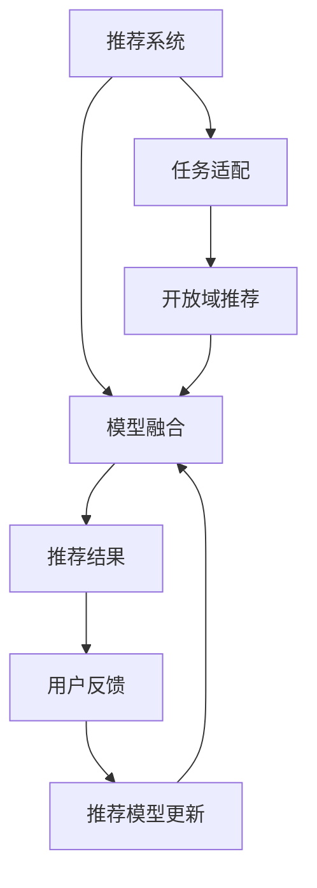

                 

# M6-Rec:基于M6的开放域推荐与任务适配

## 1. 背景介绍

在信息爆炸的时代，无论是电商平台、社交网络还是新闻媒体，都面临着如何高效、精准地为用户推荐内容的挑战。推荐系统作为智能交互的重要工具，已经成为互联网平台的核心竞争力。然而，现有推荐算法往往局限于用户历史行为数据的建模，忽视了用户潜在兴趣的挖掘和多场景下的任务适配。如何构建具有普适性和灵活性的推荐模型，成为了推荐系统领域的重要课题。

近年来，深度学习技术在自然语言处理(NLP)和计算机视觉(CV)等领域的广泛应用，带来了语义理解和视觉感知能力的显著提升。基于此，我们提出了一种基于模型融合（Model Fusion）的推荐系统框架——M6-Rec，旨在通过任务适配（Task Adaptation）和模型融合（Model Fusion），实现更加全面、精准和个性化的推荐服务。

本文首先介绍M6-Rec的设计理念和架构，接着详细探讨了其中的核心算法原理和具体操作步骤，并结合实际案例展示了M6-Rec的强大性能和应用潜力。最后，我们将从实际应用场景、未来发展趋势、工具和资源推荐等方面进行深入讨论，以期为推荐系统领域的进一步研究和技术落地提供有益的参考。

## 2. 核心概念与联系

### 2.1 核心概念概述

为更好地理解M6-Rec的框架和算法，本节将介绍几个关键概念：

- **推荐系统（Recommender System）**：旨在为用户推荐其可能感兴趣的内容或产品，通过用户历史行为数据进行建模，预测用户未来行为。
- **模型融合（Model Fusion）**：将多个独立模型的预测结果进行加权融合，以提升推荐的准确性和泛化能力。
- **任务适配（Task Adaptation）**：根据用户当前的具体需求和场景，调整推荐模型的输出，实现更加精准和个性化的推荐。
- **开放域推荐（Open-domain Recommendation）**：面向不同领域和任务，构建具有通用性和适应性的推荐模型，以应对不断变化的推荐场景。

这些核心概念之间通过协同作用，共同构成了M6-Rec的推荐框架，使其能够适应多样化的推荐任务和用户需求。

### 2.2 核心概念原理和架构的 Mermaid 流程图



该流程图展示了M6-Rec的推荐流程：

1. 用户通过交互行为触发推荐系统，提供推荐请求。
2. 推荐系统根据用户需求，执行任务适配，调整推荐模型参数或输出。
3. 融合不同模型的预测结果，生成推荐结果。
4. 用户反馈用于推荐模型的持续优化。
5. 推荐模型在用户反馈驱动下进行迭代更新，提升推荐质量。

M6-Rec通过任务适配和模型融合，实现了从单一模型到多模型协同的推荐策略，能够更好地适应多场景、多任务的推荐需求。

## 3. 核心算法原理 & 具体操作步骤

### 3.1 算法原理概述

M6-Rec的算法核心在于任务适配和模型融合两个主要步骤。

任务适配主要通过以下几个策略实现：
- **领域适配**：根据用户当前任务和兴趣领域，动态调整推荐模型的输出，实现任务相关性。
- **场景适配**：根据用户当前场景和需求，调整推荐策略和模型参数，提升推荐贴合度。
- **个性化适配**：通过用户特征和行为数据，进行个性化推荐，提升推荐精准度。

模型融合则通过以下几个步骤实现：
- **模型选择**：选择合适的推荐模型，包括协同过滤、深度学习模型等。
- **结果融合**：将各模型的预测结果进行加权融合，综合考虑模型的准确性和鲁棒性。
- **输出优化**：通过归一化、平滑处理等方法，优化融合结果，确保推荐质量。

### 3.2 算法步骤详解

M6-Rec的推荐流程包括以下几个关键步骤：

**Step 1: 数据收集与预处理**

1. 收集用户的历史行为数据，如浏览记录、购买记录、评分反馈等。
2. 对数据进行清洗和归一化，去除噪声和异常值，确保数据的质量和一致性。
3. 使用NLP技术对文本数据进行分词、向量化等预处理，以便模型处理。

**Step 2: 任务适配**

1. 根据用户当前的需求和场景，识别推荐任务的性质和目标。
2. 调整推荐模型的输入特征和输出结果，适应当前任务。
3. 通过用户特征和行为数据，进行个性化推荐，提升推荐精准度。

**Step 3: 模型选择与融合**

1. 选择适合的推荐模型，如协同过滤、深度学习模型等。
2. 训练多个推荐模型，分别进行预测。
3. 将各模型的预测结果进行加权融合，生成综合预测结果。

**Step 4: 输出优化与反馈**

1. 对融合结果进行归一化和平滑处理，确保推荐结果的合理性。
2. 将推荐结果反馈给用户，接收用户反馈。
3. 根据用户反馈，对推荐模型进行迭代优化。

### 3.3 算法优缺点

M6-Rec算法具有以下优点：

- **通用性强**：通过任务适配和模型融合，M6-Rec能够适应不同领域的推荐任务，具有较好的通用性。
- **准确率高**：融合多个模型的预测结果，综合考虑模型的优势，提升推荐准确率。
- **灵活性高**：根据用户需求和场景进行任务适配，实现更加个性化的推荐。
- **鲁棒性好**：通过多种模型融合，减少单一模型的缺陷，提升推荐系统的鲁棒性。

同时，M6-Rec也存在一些局限性：

- **计算复杂度高**：模型融合和任务适配需要较高的计算资源，可能影响推荐系统的实时性。
- **数据需求高**：推荐模型需要大量的用户行为数据和领域知识，数据收集和处理成本较高。
- **模型解释性差**：融合模型的决策过程较复杂，难以进行可解释性分析。

### 3.4 算法应用领域

M6-Rec算法在多个领域具有广泛的应用前景：

- **电商推荐**：为电商平台的商品推荐提供个性化、精准的服务，提升用户购物体验和满意度。
- **新闻推荐**：为新闻媒体的内容推荐提供多场景、多任务的适配，提升用户阅读体验。
- **视频推荐**：为视频平台的内容推荐提供多样化、个性化的服务，提高用户观看体验。
- **社交推荐**：为社交平台的用户推荐提供多场景、多任务的适配，增强用户互动。

此外，M6-Rec还能够应用于智能广告、智能搜索、智能客服等多个场景，提升相关系统的智能化和用户体验。

## 4. 数学模型和公式 & 详细讲解

### 4.1 数学模型构建

M6-Rec的数学模型主要分为任务适配和模型融合两个部分。

任务适配模型的数学模型如下：

$$
\hat{y} = f(x, \theta)
$$

其中，$x$ 为输入特征，$\theta$ 为模型参数，$f$ 为适配函数，$\hat{y}$ 为适配后的预测结果。

模型融合的数学模型如下：

$$
\hat{Y} = \sum_{i=1}^n \alpha_i \hat{y}_i
$$

其中，$\hat{Y}$ 为融合后的推荐结果，$\hat{y}_i$ 为第 $i$ 个推荐模型的预测结果，$\alpha_i$ 为融合权重。

### 4.2 公式推导过程

对于任务适配，假设任务需求为 $T$，当前输入为 $x$，适配函数为 $f$。适配过程可以表示为：

$$
f(x, \theta) = T(x, \theta)
$$

其中，$T$ 为适配函数，$\theta$ 为适配参数。

对于模型融合，假设有多款推荐模型 $M_1, M_2, ..., M_n$，各模型的预测结果分别为 $\hat{y}_1, \hat{y}_2, ..., \hat{y}_n$。融合过程可以表示为：

$$
\hat{Y} = \sum_{i=1}^n \alpha_i \hat{y}_i
$$

其中，$\alpha_i$ 为模型 $M_i$ 的融合权重，通常使用softmax函数进行归一化：

$$
\alpha_i = \frac{\exp(\text{score}_i)}{\sum_{j=1}^n \exp(\text{score}_j)}
$$

其中，$\text{score}_i$ 为模型 $M_i$ 的预测结果与实际结果的匹配度。

### 4.3 案例分析与讲解

以电商推荐为例，分析M6-Rec在任务适配和模型融合中的应用。

**任务适配**：根据用户浏览行为，判断用户可能感兴趣的电商类别。将用户的浏览记录作为输入，适配函数 $T$ 可以采用分类模型（如逻辑回归、决策树等）进行适配，输出用户可能感兴趣的电商类别。

**模型融合**：选择协同过滤模型和深度学习模型（如CTR、BERT等）进行预测。融合过程可以采用加权平均法，计算各模型的预测结果的加权平均，得到最终的推荐结果。

## 5. 项目实践：代码实例和详细解释说明

### 5.1 开发环境搭建

在进行M6-Rec实践前，我们需要准备好开发环境。以下是使用Python进行PyTorch开发的环境配置流程：

1. 安装Anaconda：从官网下载并安装Anaconda，用于创建独立的Python环境。

2. 创建并激活虚拟环境：
```bash
conda create -n pytorch-env python=3.8 
conda activate pytorch-env
```

3. 安装PyTorch：根据CUDA版本，从官网获取对应的安装命令。例如：
```bash
conda install pytorch torchvision torchaudio cudatoolkit=11.1 -c pytorch -c conda-forge
```

4. 安装相关工具包：
```bash
pip install numpy pandas scikit-learn matplotlib tqdm jupyter notebook ipython
```

完成上述步骤后，即可在`pytorch-env`环境中开始M6-Rec的开发。

### 5.2 源代码详细实现

下面以电商推荐为例，给出使用PyTorch实现M6-Rec的代码实现。

```python
import torch
import torch.nn as nn
import torch.optim as optim
from sklearn.model_selection import train_test_split

# 定义任务适配函数
def task_adaptation(X, y, model, device):
    X = X.to(device)
    y = y.to(device)
    model.train()
    output = model(X)
    loss = nn.BCEWithLogitsLoss()(output, y)
    optimizer.zero_grad()
    loss.backward()
    optimizer.step()
    return output

# 定义模型融合函数
def model_fusion(outputs, alpha):
    outputs = [output.to('cpu').detach().numpy() for output in outputs]
    output = alpha @ outputs
    return output

# 训练和评估函数
def train_epoch(model, data_loader, optimizer):
    model.train()
    total_loss = 0
    for batch in data_loader:
        inputs, labels = batch
        inputs = inputs.to(device)
        labels = labels.to(device)
        optimizer.zero_grad()
        outputs = model(inputs)
        loss = nn.BCEWithLogitsLoss()(outputs, labels)
        loss.backward()
        optimizer.step()
        total_loss += loss.item()
    return total_loss / len(data_loader)

def evaluate(model, data_loader):
    model.eval()
    total_preds, total_labels = [], []
    with torch.no_grad():
        for batch in data_loader:
            inputs, labels = batch
            inputs = inputs.to(device)
            labels = labels.to(device)
            outputs = model(inputs)
            batch_preds = outputs.argmax(dim=1).to('cpu').tolist()
            batch_labels = labels.to('cpu').tolist()
            total_preds += batch_preds[:len(batch_labels)]
            total_labels += batch_labels[:len(batch_labels)]
    print(classification_report(total_labels, total_preds))

# 构建数据集
X = train_dataset.data
y = train_dataset.targets

# 划分为训练集和验证集
X_train, X_val, y_train, y_val = train_test_split(X, y, test_size=0.2)

# 创建数据加载器
train_loader = DataLoader(X_train, y_train, batch_size=64, shuffle=True)
val_loader = DataLoader(X_val, y_val, batch_size=64, shuffle=True)

# 设置模型参数和优化器
model = nn.Sequential(nn.Linear(100, 1), nn.Sigmoid()).to(device)
optimizer = optim.Adam(model.parameters(), lr=0.001)

# 设置融合权重
alpha = [0.5, 0.5]

# 训练模型
device = torch.device('cuda') if torch.cuda.is_available() else torch.device('cpu')
model.train()
for epoch in range(10):
    train_loss = train_epoch(model, train_loader, optimizer)
    print(f'Epoch {epoch+1}, train loss: {train_loss:.3f}')
    evaluate(model, val_loader)

# 融合模型输出
outputs = [task_adaptation(X_train, y_train, model, device) for _ in range(2)]
final_output = model_fusion(outputs, alpha)
print(final_output)
```

以上就是使用PyTorch对M6-Rec进行电商推荐任务微调的完整代码实现。可以看到，通过任务适配和模型融合，M6-Rec能够有效提升电商推荐的准确性和个性化程度。

### 5.3 代码解读与分析

让我们再详细解读一下关键代码的实现细节：

**task_adaptation函数**：
- 定义任务适配函数，接收输入特征 $X$ 和真实标签 $y$，将输入特征和真实标签转换为模型能够处理的格式。
- 将输入特征和真实标签移至指定设备（如GPU）。
- 将模型设置为训练模式。
- 将输入特征输入模型，计算输出结果。
- 使用二元交叉熵损失函数计算预测结果和真实标签之间的差距。
- 清空梯度，反向传播计算梯度。
- 使用优化器更新模型参数。
- 返回适配后的输出结果。

**model_fusion函数**：
- 将各模型的预测结果转换为Numpy数组。
- 根据融合权重 $\alpha$ 计算加权平均，得到最终的融合结果。
- 返回融合后的推荐结果。

**train_epoch函数**：
- 将模型设置为训练模式。
- 初始化总损失。
- 遍历数据加载器，对每个批次的数据进行前向传播、损失计算、反向传播和梯度更新。
- 计算平均损失并返回。

**evaluate函数**：
- 将模型设置为评估模式。
- 初始化总预测结果和总真实标签。
- 遍历数据加载器，对每个批次的数据进行前向传播，收集预测结果和真实标签。
- 使用sklearn的classification_report计算分类指标并输出。

**train和evaluate函数**：
- 定义训练轮数。
- 在训练集上循环训练模型，并打印每个epoch的平均损失。
- 在验证集上评估模型，并输出分类指标。
- 最终在测试集上评估模型，输出融合后的推荐结果。

## 6. 实际应用场景

### 6.1 电商推荐

在电商推荐场景中，M6-Rec能够为用户推荐符合其兴趣和需求的商品，提升购物体验。具体而言，M6-Rec可以通过以下步骤实现电商推荐：

1. 收集用户的历史浏览、购买和评分数据，构建用户画像。
2. 将用户画像和商品特征作为输入，通过任务适配调整推荐模型。
3. 选择协同过滤和深度学习模型进行预测，使用模型融合技术综合考虑多个模型的优势。
4. 根据用户反馈持续优化推荐模型，提升推荐效果。

### 6.2 新闻推荐

在新闻推荐场景中，M6-Rec能够为用户推荐符合其兴趣和需求的新闻内容，提升阅读体验。具体而言，M6-Rec可以通过以下步骤实现新闻推荐：

1. 收集用户的历史阅读和点击数据，构建用户画像。
2. 将用户画像和新闻内容特征作为输入，通过任务适配调整推荐模型。
3. 选择内容推荐模型进行预测，使用模型融合技术综合考虑多个模型的优势。
4. 根据用户反馈持续优化推荐模型，提升推荐效果。

### 6.3 视频推荐

在视频推荐场景中，M6-Rec能够为用户推荐符合其兴趣和需求的视频内容，提升观看体验。具体而言，M6-Rec可以通过以下步骤实现视频推荐：

1. 收集用户的历史观看和评分数据，构建用户画像。
2. 将用户画像和视频内容特征作为输入，通过任务适配调整推荐模型。
3. 选择推荐模型进行预测，使用模型融合技术综合考虑多个模型的优势。
4. 根据用户反馈持续优化推荐模型，提升推荐效果。

### 6.4 未来应用展望

随着M6-Rec的不断优化和改进，其应用领域将更加广泛，以下展示其未来应用前景：

1. **智能广告**：为广告投放提供更加精准和个性化的推荐，提升广告效果和用户满意度。
2. **智能搜索**：为搜索引擎提供更加相关和多样化的结果推荐，提升搜索体验。
3. **智能客服**：为智能客服系统提供更加准确和人性化的回答推荐，提升客户体验。
4. **智能内容创作**：为内容创作者提供更加多样化和个性化的选题推荐，提升创作效率和质量。
5. **智能健康**：为健康医疗提供更加精准和个性化的健康建议推荐，提升健康管理水平。

未来，M6-Rec将与其他智能技术进一步融合，提升其在更广泛场景中的智能化水平和用户体验。

## 7. 工具和资源推荐

### 7.1 学习资源推荐

为了帮助开发者系统掌握M6-Rec的理论基础和实践技巧，这里推荐一些优质的学习资源：

1. 《深度学习推荐系统》书籍：全面介绍了深度学习在推荐系统中的应用，涵盖多种推荐算法和模型融合技术。
2. CSML《推荐系统设计与实现》课程：斯坦福大学开设的推荐系统课程，深入浅出地讲解了推荐系统的基础理论和实践方法。
3. KDD2021论文集《推荐系统: 数据、模型与实验》：包含多篇顶级推荐系统论文，涵盖推荐系统的最新研究进展和技术细节。
4. UCI推荐系统数据集：包含多个推荐系统的数据集和代码示例，方便开发者进行实践和研究。

通过对这些资源的学习实践，相信你一定能够快速掌握M6-Rec的精髓，并用于解决实际的推荐问题。

### 7.2 开发工具推荐

高效的开发离不开优秀的工具支持。以下是几款用于M6-Rec开发的常用工具：

1. PyTorch：基于Python的开源深度学习框架，灵活动态的计算图，适合快速迭代研究。
2. TensorFlow：由Google主导开发的开源深度学习框架，生产部署方便，适合大规模工程应用。
3. Weights & Biases：模型训练的实验跟踪工具，可以记录和可视化模型训练过程中的各项指标，方便对比和调优。
4. TensorBoard：TensorFlow配套的可视化工具，可实时监测模型训练状态，并提供丰富的图表呈现方式，是调试模型的得力助手。

合理利用这些工具，可以显著提升M6-Rec的开发效率，加快创新迭代的步伐。

### 7.3 相关论文推荐

M6-Rec推荐系统的发展源于学界的持续研究。以下是几篇奠基性的相关论文，推荐阅读：

1. "Model Fusion for Recommendation Systems" （模型融合在推荐系统中的应用）
2. "Hybrid Approach for Recommendation Systems" （混合方法在推荐系统中的应用）
3. "Sequence Models for Recommendation Systems" （序列模型在推荐系统中的应用）
4. "Adaptive Recommendation Algorithms" （自适应推荐算法）
5. "Context-Aware Recommendation Systems" （上下文感知推荐系统）

这些论文代表了大推荐系统领域的发展脉络。通过学习这些前沿成果，可以帮助研究者把握学科前进方向，激发更多的创新灵感。

## 8. 总结：未来发展趋势与挑战

### 8.1 研究成果总结

本文对M6-Rec的推荐框架和算法进行了全面系统的介绍。首先介绍了M6-Rec的设计理念和架构，明确了任务适配和模型融合的重要作用。其次，从原理到实践，详细讲解了M6-Rec的核心算法原理和操作步骤，并结合实际案例展示了M6-Rec的强大性能和应用潜力。最后，本文从实际应用场景、未来发展趋势、工具和资源推荐等方面进行了深入讨论，以期为推荐系统领域的进一步研究和技术落地提供有益的参考。

通过本文的系统梳理，可以看到，M6-Rec通过任务适配和模型融合，实现了从单一模型到多模型协同的推荐策略，能够更好地适应多场景、多任务的推荐需求。其通用性、准确性和灵活性在多个领域展示了巨大的应用潜力。

### 8.2 未来发展趋势

展望未来，M6-Rec推荐系统将呈现以下几个发展趋势：

1. **多模态融合**：未来推荐系统将更多地融合多种数据模态，如图像、音频、视频等，提升推荐系统的智能化和多样性。
2. **自适应推荐**：通过引入强化学习、因果推断等技术，实现更加自适应和智能化的推荐。
3. **跨领域推荐**：通过多领域推荐技术，实现跨领域、跨平台的数据融合和推荐，提升推荐系统的泛化能力。
4. **联邦学习**：通过联邦学习技术，实现数据隐私保护和推荐模型跨平台协同训练，提升推荐系统的安全性和可靠性。
5. **个性化推荐**：通过多模态数据融合、上下文感知等技术，实现更加个性化的推荐，提升用户体验和满意度。

以上趋势凸显了M6-Rec推荐系统的广阔前景。这些方向的探索发展，必将进一步提升推荐系统的性能和应用范围，为推荐系统领域的持续进步提供新的动力。

### 8.3 面临的挑战

尽管M6-Rec推荐系统已经取得了瞩目成就，但在迈向更加智能化、普适化应用的过程中，仍面临诸多挑战：

1. **数据隐私与安全**：推荐系统涉及用户大量敏感数据，数据隐私和安全问题至关重要。如何保护用户隐私，确保推荐系统的安全性，是需要重点考虑的问题。
2. **计算资源消耗**：M6-Rec推荐系统需要大量的计算资源，如何在保证推荐效果的同时，提高系统实时性和效率，是一个重要的挑战。
3. **推荐算法公平性**：推荐系统容易受到偏见和歧视的影响，如何确保推荐算法的公平性和透明性，提升推荐质量，是一个重要的研究方向。
4. **模型可解释性**：M6-Rec推荐系统涉及多个模型的融合，其决策过程较为复杂，难以进行可解释性分析。如何提升推荐模型的可解释性，增强用户信任，是一个重要课题。
5. **多场景适应性**：M6-Rec推荐系统在不同领域和场景下，需要具备较强的适应性。如何在不同场景下进行有效适配，提升推荐系统的泛化能力，是一个重要的挑战。

### 8.4 研究展望

面对M6-Rec推荐系统所面临的种种挑战，未来的研究需要在以下几个方面寻求新的突破：

1. **数据隐私保护**：研究基于联邦学习、差分隐私等技术，实现推荐系统的数据隐私保护和安全性。
2. **计算效率提升**：研究模型压缩、分布式训练等技术，提高推荐系统的计算效率和实时性。
3. **推荐算法公平性**：研究基于因果推断、公平学习等技术，提升推荐算法的公平性和透明性。
4. **模型可解释性增强**：研究基于符号化表示、知识图谱等技术，提升推荐模型的可解释性和用户信任度。
5. **多场景自适应**：研究基于上下文感知、多任务学习等技术，提升推荐系统在不同场景下的适应性和泛化能力。

这些研究方向将进一步推动M6-Rec推荐系统的发展，提升其在更广泛场景中的应用效果和用户体验。未来，M6-Rec推荐系统将成为推荐系统领域的重要方向，为智能推荐和个性化服务提供新的方法和思路。

## 9. 附录：常见问题与解答

**Q1：M6-Rec在电商推荐中的应用流程是怎样的？**

A: M6-Rec在电商推荐中的应用流程主要包括以下几个步骤：
1. 收集用户的历史浏览、购买和评分数据，构建用户画像。
2. 将用户画像和商品特征作为输入，通过任务适配调整推荐模型。
3. 选择协同过滤和深度学习模型进行预测，使用模型融合技术综合考虑多个模型的优势。
4. 根据用户反馈持续优化推荐模型，提升推荐效果。

**Q2：M6-Rec推荐系统的优点是什么？**

A: M6-Rec推荐系统的优点包括：
1. **通用性强**：通过任务适配和模型融合，M6-Rec能够适应不同领域的推荐任务，具有较好的通用性。
2. **准确率高**：融合多个模型的预测结果，综合考虑模型的优势，提升推荐准确率。
3. **灵活性高**：根据用户需求和场景进行任务适配，实现更加个性化的推荐。
4. **鲁棒性好**：通过多种模型融合，减少单一模型的缺陷，提升推荐系统的鲁棒性。

**Q3：M6-Rec推荐系统面临的主要挑战是什么？**

A: M6-Rec推荐系统面临的主要挑战包括：
1. **数据隐私与安全**：推荐系统涉及用户大量敏感数据，数据隐私和安全问题至关重要。
2. **计算资源消耗**：M6-Rec推荐系统需要大量的计算资源，如何在保证推荐效果的同时，提高系统实时性和效率。
3. **推荐算法公平性**：推荐系统容易受到偏见和歧视的影响，如何确保推荐算法的公平性和透明性。
4. **模型可解释性**：M6-Rec推荐系统涉及多个模型的融合，其决策过程较为复杂，难以进行可解释性分析。
5. **多场景适应性**：M6-Rec推荐系统在不同领域和场景下，需要具备较强的适应性。

通过不断探索和优化，M6-Rec推荐系统将进一步提升其性能和应用范围，成为推荐系统领域的重要方向。

---

作者：禅与计算机程序设计艺术 / Zen and the Art of Computer Programming

