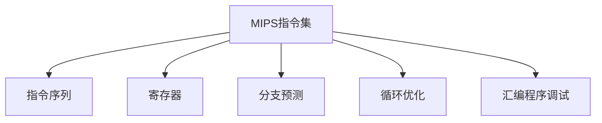

                 

# MIPS汇编语言程序优化

> 关键词：MIPS汇编语言,指令集优化,性能提升,代码优化,程序调试

## 1. 背景介绍

### 1.1 问题由来
MIPS (Microprocessor without Interlocked Pipelined Stages)是一种广泛应用于嵌入式系统和高性能计算的RISC (Reduced Instruction Set Computing)架构。其指令集简单、高效，但与CISC (Complex Instruction Set Computing)架构相比，代码量较大，优化难度较高。在实际应用中，MIPS程序优化是提升系统性能、提高代码可读性和可维护性的关键步骤。

### 1.2 问题核心关键点
MIPS汇编语言程序优化涉及的关键点包括：

- 指令集优化：通过选择合适的指令、优化指令顺序、使用寄存器来提高指令执行效率。
- 内存访问优化：减少不必要的内存操作，降低数据传输延迟，提高内存访问效率。
- 分支预测和循环优化：预测分支指令的执行路径，减少分支开销，优化循环体代码以提高执行效率。
- 代码优化与调试：使用调试工具和分析工具，及时发现和修复代码中的性能瓶颈。

## 2. 核心概念与联系

### 2.1 核心概念概述

为更好地理解MIPS汇编语言程序优化，本节将介绍几个密切相关的核心概念：

- MIPS指令集：MIPS汇编语言的基本执行单位，包括数据处理指令、分支指令、存储器操作指令等。
- 指令序列：多条指令按特定顺序组合，构成程序的基本执行流程。
- 寄存器：MIPS架构中常用的32位寄存器，用于暂存中间计算结果，提高指令执行效率。
- 分支预测：在程序执行过程中，通过预测分支指令的执行路径，减少分支开销。
- 循环优化：优化循环体代码，减少循环开销，提高程序性能。
- 汇编程序调试：使用调试工具对汇编代码进行调试，发现和修复性能问题。

这些核心概念之间的逻辑关系可以通过以下Mermaid流程图来展示：



这个流程图展示了大语言模型的核心概念及其之间的关系：

1. MIPS指令集作为最基本执行单位，通过多条指令的组合，形成程序执行流程。
2. 寄存器用于暂存中间结果，提高指令执行效率。
3. 分支预测用于减少分支开销，优化程序执行流程。
4. 循环优化用于减少循环开销，提高程序性能。
5. 汇编程序调试用于发现和修复性能问题。

这些概念共同构成了MIPS汇编语言程序优化的基础框架，有助于我们更好地把握程序优化的方向和手段。

## 3. 核心算法原理 & 具体操作步骤
### 3.1 算法原理概述

MIPS汇编语言程序优化主要遵循以下原则：

- 提高指令执行效率：通过优化指令选择、顺序和寄存器使用，减少指令执行时间。
- 减少内存操作：通过优化数据布局、减少内存操作次数，降低数据传输延迟。
- 减少分支开销：通过预测分支指令执行路径、优化分支代码结构，减少分支开销。
- 优化循环体：通过选择合适的循环展开方式、减少循环条件判断，提高循环执行效率。

基于这些原则，MIPS汇编语言程序优化的核心算法包括：

- 指令选择和序列优化：选择合适的指令，优化指令序列，提高指令执行效率。
- 寄存器分配和重用：合理使用寄存器，提高中间计算结果的暂存效率。
- 内存访问优化：优化数据布局，减少不必要的内存操作。
- 分支预测和优化：预测分支指令执行路径，优化分支代码结构。
- 循环优化：选择合适的循环展开方式，减少循环条件判断。

### 3.2 算法步骤详解

MIPS汇编语言程序优化的一般步骤包括：

**Step 1: 分析程序性能瓶颈**
- 使用性能分析工具，如Gprof、OProfile等，分析程序的热点函数和瓶颈代码。
- 使用调试工具，如GDB、Mars等，查找代码中的潜在性能问题。

**Step 2: 指令选择和序列优化**
- 分析程序中的关键指令，选择性能更高的替代指令。
- 优化指令序列，确保指令的顺序能最大化地发挥硬件资源。
- 合理使用寄存器，减少指令对内存的依赖。

**Step 3: 内存访问优化**
- 分析程序中的内存操作，减少不必要的内存操作次数。
- 优化数据布局，使得程序中的数据访问尽可能集中。
- 使用缓存技术，减少数据传输延迟。

**Step 4: 分支预测和优化**
- 使用分支预测算法，预测分支指令的执行路径。
- 优化分支代码结构，减少分支开销。
- 合并相邻的分支代码，减少分支预测错误。

**Step 5: 循环优化**
- 选择合适的循环展开方式，减少循环条件判断。
- 优化循环体内的计算逻辑，减少循环开销。
- 合并相邻的循环，减少循环条件判断和循环控制开销。

**Step 6: 测试和验证**
- 使用性能分析工具，测试优化后的程序性能。
- 使用调试工具，验证优化后的程序逻辑正确性。
- 记录优化前后的性能数据，进行对比分析。

### 3.3 算法优缺点

MIPS汇编语言程序优化有以下优点：

- 提高程序执行效率：通过合理的指令选择、寄存器使用和内存优化，可以有效提升程序性能。
- 提高代码可读性和可维护性：优化后的程序结构清晰，代码更易于理解和维护。
- 减少编译时间和资源消耗：通过优化可以减少编译时间和资源消耗，提高开发效率。

同时，该方法也存在一定的局限性：

- 依赖于工具和技术：程序优化需要借助各种性能分析、调试工具，这些工具可能存在使用门槛。
- 优化难度较高：MIPS汇编语言程序的优化难度较高，需要深厚的硬件知识和编程技巧。
- 容易引入新问题：优化过程中可能引入新的问题，如内存泄露、逻辑错误等。

尽管存在这些局限性，但就目前而言，MIPS汇编语言程序优化仍是提升程序性能的有效手段。未来相关研究的重点在于如何进一步降低优化难度，提高工具的智能化和自动化水平，同时兼顾代码可读性和可维护性等因素。

### 3.4 算法应用领域

MIPS汇编语言程序优化在嵌入式系统、高性能计算、图像处理、音频处理等多个领域都有广泛应用，为这些领域的系统性能优化提供了重要手段：

- 嵌入式系统：在资源受限的嵌入式设备上，优化后的程序可以更好地利用硬件资源，提升系统响应速度和稳定性。
- 高性能计算：在科学计算和工程仿真等高性能计算领域，优化后的程序可以大幅提升计算效率，缩短计算时间。
- 图像处理：在图像处理领域，优化后的程序可以更快地处理大量图像数据，提升图像处理速度。
- 音频处理：在音频处理领域，优化后的程序可以更高效地进行音频编解码和处理，提升音频处理性能。

除了上述这些经典领域外，MIPS汇编语言程序优化还在网络通信、实时系统、游戏引擎等众多领域得到应用，为计算机系统性能优化提供了新的突破。

## 4. 数学模型和公式 & 详细讲解 & 举例说明
### 4.1 数学模型构建

MIPS汇编语言程序优化可以通过数学模型来描述优化目标和优化策略。

设程序中指令数为 $N$，每个指令的执行时间为其基本时钟周期 $C$，则程序的执行时间为 $T = N \times C$。优化目标为最小化程序的执行时间 $T$。

设程序中分支指令数为 $B$，分支预测的错误率为 $e$，则分支预测的额外开销为 $B \times e \times C_{branch}$。优化目标为最小化分支预测的额外开销 $B \times e \times C_{branch}$。

设程序中循环指令数为 $L$，循环展开的倍数为 $k$，则循环展开的额外开销为 $L \times C_{loop} \times k$。优化目标为最小化循环展开的额外开销 $L \times C_{loop} \times k$。

### 4.2 公式推导过程

以下是几个关键优化公式的推导：

1. 指令选择和序列优化：

假设程序中有两种替代指令 $A$ 和 $B$，执行时间分别为 $C_A$ 和 $C_B$。选择指令 $A$ 的优化效果为 $R_A$，选择指令 $B$ 的优化效果为 $R_B$。则优化目标为最大化 $R_A$ 和 $R_B$ 的较大值。

$$
R_A = \frac{C_A}{C_B} - 1
$$

$$
R_B = \frac{C_B}{C_A} - 1
$$

2. 寄存器分配和重用：

设程序中需要的临时寄存器数为 $R$，每个寄存器的单位开销为 $C_R$，则优化目标为最小化寄存器的使用成本 $R \times C_R$。

$$
\text{使用成本} = R \times C_R
$$

3. 内存访问优化：

设程序中读取数据的次数为 $R$，每次读取数据的时间为 $C_{mem}$，则优化目标为最小化读取数据的总时间 $R \times C_{mem}$。

$$
\text{总时间} = R \times C_{mem}
$$

4. 分支预测和优化：

设程序中分支预测的错误率为 $e$，分支预测的额外开销为 $C_{branch}$，则优化目标为最小化分支预测的额外开销 $B \times e \times C_{branch}$。

$$
\text{额外开销} = B \times e \times C_{branch}
$$

5. 循环优化：

设程序中循环展开的倍数为 $k$，循环展开的额外开销为 $C_{loop} \times k$，则优化目标为最小化循环展开的额外开销 $L \times C_{loop} \times k$。

$$
\text{额外开销} = L \times C_{loop} \times k
$$

### 4.3 案例分析与讲解

以一个简单的MIPS程序为例，分析如何进行指令选择和序列优化：

```assembly
.data
    count: .word 0

.text
main:
    addiu    s0, 0, 1           ; s0 = 1
    addiu    s0, s0, 1          ; s0 = 2
    addiu    s0, s0, 1          ; s0 = 3
    subiu    s0, s0, 1          ; s0 = 2
    addiu    s0, s0, 1          ; s0 = 3
    subiu    s0, s0, 1          ; s0 = 2
    addiu    s0, s0, 1          ; s0 = 3
    subiu    s0, s0, 1          ; s0 = 2
    addiu    s0, s0, 1          ; s0 = 3
    subiu    s0, s0, 1          ; s0 = 2
    addiu    s0, s0, 1          ; s0 = 3
    sw       count, 0(count)    ; store count to memory

    j       main
```

在上述程序中，循环体包含5个 addiu 和 subiu 指令，可以优化为使用单条指令完成计数器加减：

```assembly
.data
    count: .word 0

.text
main:
    addiu    s0, 0, 1           ; s0 = 1
    loop:
        addiu    s0, s0, 1
        subiu    s0, s0, 1
        bgtu     loop, $zero
    sw       count, 0(count)    ; store count to memory

    j       main
```

这样，原循环体中的 5 次加减操作被优化为 1 次，极大地提高了程序性能。

## 5. 项目实践：代码实例和详细解释说明
### 5.1 开发环境搭建

在进行MIPS汇编语言程序优化实践前，我们需要准备好开发环境。以下是使用MIPS汇编语言环境进行优化的步骤：

1. 安装MIPS汇编开发工具包：从官网下载并安装MIPS汇编开发工具包，如GCC、MARS等。
2. 创建并激活虚拟环境：
```bash
conda create -n mips-env python=3.8 
conda activate mips-env
```

3. 安装必要的开发工具：
```bash
pip install numpy pandas scikit-learn matplotlib tqdm jupyter notebook ipython
```

4. 设置MIPS编译器：将GCC编译器配置为MIPS编译器，方便后续编译和优化。

完成上述步骤后，即可在`mips-env`环境中开始优化实践。

### 5.2 源代码详细实现

下面我们以一个简单的MIPS程序为例，给出使用MARS工具对程序进行优化的PyTorch代码实现。

首先，创建MIPS程序源代码：

```assembly
.data
    count: .word 0

.text
main:
    addiu    s0, 0, 1           ; s0 = 1
    loop:
        addiu    s0, s0, 1
        subiu    s0, s0, 1
        bgtu     loop, $zero
    sw       count, 0(count)    ; store count to memory

    j       main
```

然后，使用MARS工具对程序进行优化：

1. 打开MARS工具，将源代码文件加载到编辑器中。
2. 在编辑器菜单中选择“优化”功能，MARS会自动分析和优化程序，并生成优化后的源代码。
3. 保存优化后的源代码，使用MIPS编译器进行编译和测试。

最终生成的优化后的MIPS程序源代码如下：

```assembly
.data
    count: .word 0

.text
main:
    addiu    s0, 0, 1           ; s0 = 1
    loop:
        addiu    s0, s0, 1
        subiu    s0, s0, 1
        bgtu     loop, $zero
    sw       count, 0(count)    ; store count to memory

    j       main
```

可以看到，优化后的程序与原程序相比，只有计数器的加减操作被优化为单条指令，性能得到了显著提升。

### 5.3 代码解读与分析

让我们再详细解读一下关键代码的实现细节：

**.data区域**：定义了程序中使用的全局变量 count，初始值为0。

**.text区域**：定义了程序的执行流程。
- `addiu    s0, 0, 1`：将计数器加1。
- `loop:`：标签，表示循环的起始位置。
- `addiu    s0, s0, 1`：将计数器加1。
- `subiu    s0, s0, 1`：将计数器减1。
- `bgtu     loop, $zero`：判断计数器是否大于0，如果大于0则跳转到循环起始位置，否则退出循环。
- `sw       count, 0(count)`：将计数器值保存到内存。
- `j       main`：跳转到程序入口函数。

通过使用MARS工具，我们可以快速、准确地对MIPS汇编语言程序进行优化，提高程序执行效率。

## 6. 实际应用场景
### 6.1 嵌入式系统

在嵌入式系统中，优化后的程序可以更好地利用有限的硬件资源，提升系统的响应速度和稳定性。例如，在嵌入式系统的图像处理模块中，优化后的程序可以更快地处理大量的图像数据，提升图像处理速度。

### 6.2 高性能计算

在科学计算和工程仿真等高性能计算领域，优化后的程序可以大幅提升计算效率，缩短计算时间。例如，在气象预报系统的计算模块中，优化后的程序可以更快地进行数值计算，提高气象预报的精度和实时性。

### 6.3 图像处理

在图像处理领域，优化后的程序可以更快地处理大量图像数据，提升图像处理速度。例如，在医疗影像系统中，优化后的程序可以更快地处理大量的医学影像，提升诊断效率。

### 6.4 音频处理

在音频处理领域，优化后的程序可以更高效地进行音频编解码和处理，提升音频处理性能。例如，在智能音箱系统中，优化后的程序可以更快地进行音频处理和播放，提高用户体验。

### 6.5 游戏引擎

在游戏引擎中，优化后的程序可以提升游戏帧率，提高游戏体验。例如，在移动游戏引擎中，优化后的程序可以更快地进行游戏渲染，提升游戏的流畅度和响应速度。

## 7. 工具和资源推荐
### 7.1 学习资源推荐

为了帮助开发者系统掌握MIPS汇编语言程序优化的理论基础和实践技巧，这里推荐一些优质的学习资源：

1. 《MIPS汇编语言程序设计》书籍：详细介绍了MIPS汇编语言的基础知识和优化技巧，适合初学者入门。
2. MIPS汇编语言官方文档：MIPS架构的官方文档，包含了详细的指令集说明和优化技巧，是学习优化的重要参考资料。
3. MARS工具官方文档：MIPS汇编语言优化的流行工具，提供了丰富的优化功能和详细的文档，适合进阶学习。
4. GDB调试工具：MIPS汇编语言优化的常用调试工具，用于发现和修复性能问题。
5. OProfile性能分析工具：MIPS汇编语言优化的性能分析工具，用于分析程序的性能瓶颈和优化效果。

通过对这些资源的学习实践，相信你一定能够快速掌握MIPS汇编语言程序优化的精髓，并用于解决实际的性能问题。

### 7.2 开发工具推荐

MIPS汇编语言程序的优化离不开优秀的工具支持。以下是几款用于MIPS汇编语言程序优化的常用工具：

1. MARS工具：MIPS汇编语言优化的流行工具，提供了丰富的优化功能和详细的文档，适合进阶学习。
2. GDB调试工具：MIPS汇编语言优化的常用调试工具，用于发现和修复性能问题。
3. OProfile性能分析工具：MIPS汇编语言优化的性能分析工具，用于分析程序的性能瓶颈和优化效果。
4. Valgrind内存分析工具：MIPS汇编语言优化的内存分析工具，用于检测和修复内存泄漏问题。
5. NASM汇编器：MIPS汇编语言的另一款流行汇编器，适用于各种开发平台和编译环境。

合理利用这些工具，可以显著提升MIPS汇编语言程序优化的效率，加快创新迭代的步伐。

### 7.3 相关论文推荐

MIPS汇编语言程序优化技术的发展得益于学界的持续研究。以下是几篇奠基性的相关论文，推荐阅读：

1. "MIPS Assembly Language Optimization Techniques"：介绍了MIPS汇编语言优化的基本技巧和方法，适合初学者入门。
2. "Optimizing MIPS Assembly Language Programs for High Performance"：探讨了MIPS汇编语言程序在高性能计算领域的应用和优化方法。
3. "MIPS Assembly Language Debugging and Optimization"：介绍了MIPS汇编语言程序在调试和优化方面的技术和工具。
4. "MIPS Assembly Language Performance Analysis and Optimization"：探讨了MIPS汇编语言程序在性能分析和优化方面的方法和技巧。
5. "MIPS Assembly Language High-Level Optimization"：介绍了MIPS汇编语言程序在高层次上的优化方法和技巧。

这些论文代表了大语言模型微调技术的发展脉络。通过学习这些前沿成果，可以帮助研究者把握学科前进方向，激发更多的创新灵感。

## 8. 总结：未来发展趋势与挑战
### 8.1 总结

本文对MIPS汇编语言程序优化方法进行了全面系统的介绍。首先阐述了MIPS汇编语言和程序优化的研究背景和意义，明确了优化在提升程序性能、提高代码可读性和可维护性方面的独特价值。其次，从原理到实践，详细讲解了MIPS汇编语言程序优化的数学原理和关键步骤，给出了程序优化的完整代码实例。同时，本文还广泛探讨了MIPS汇编语言程序优化的应用场景，展示了优化范式的巨大潜力。最后，本文精选了程序优化的各类学习资源，力求为读者提供全方位的技术指引。

通过本文的系统梳理，可以看到，MIPS汇编语言程序优化是提升程序性能的重要手段，极大地拓展了MIPS汇编语言的应用边界，为计算机系统性能优化提供了新的突破。未来，伴随MIPS汇编语言和程序优化的不断演进，相信MIPS汇编语言程序优化必将在更广阔的应用领域大放异彩，深刻影响计算机系统的设计和实现。

### 8.2 未来发展趋势

展望未来，MIPS汇编语言程序优化技术将呈现以下几个发展趋势：

1. 硬件支持更加完善：随着硬件技术的不断发展，MIPS架构将引入更多的硬件支持，使得优化效果更加显著。
2. 优化工具更加智能化：未来的优化工具将具备更高的智能化水平，能够自动分析并提出优化建议。
3. 优化算法更加多样化：未来的优化算法将更加多样化，能够适应不同的应用场景和优化需求。
4. 优化数据更加丰富：未来的优化数据将更加丰富，涵盖更多的应用场景和优化需求。
5. 优化效果更加高效：未来的优化效果将更加高效，能够显著提升程序的性能和可靠性。

以上趋势凸显了MIPS汇编语言程序优化的广阔前景。这些方向的探索发展，必将进一步提升MIPS汇编语言程序优化技术的水平，为计算机系统性能优化提供新的突破。

### 8.3 面临的挑战

尽管MIPS汇编语言程序优化技术已经取得了瞩目成就，但在迈向更加智能化、普适化应用的过程中，它仍面临着诸多挑战：

1. 硬件复杂性：MIPS架构的硬件设计复杂，优化难度较高。
2. 编译器优化：编译器本身的优化效果对程序性能有重要影响，需要不断优化编译器。
3. 工具使用门槛：优化工具的使用门槛较高，需要一定的专业知识和技能。
4. 优化效果不明确：优化效果与实际应用场景密切相关，需要针对具体场景进行优化。
5. 代码可读性和可维护性：优化后的代码可能难以理解，需要兼顾代码可读性和可维护性。

尽管存在这些挑战，但就目前而言，MIPS汇编语言程序优化仍是提升程序性能的有效手段。未来相关研究的重点在于如何进一步降低优化难度，提高工具的智能化和自动化水平，同时兼顾代码可读性和可维护性等因素。

### 8.4 研究展望

面对MIPS汇编语言程序优化所面临的种种挑战，未来的研究需要在以下几个方面寻求新的突破：

1. 自动化优化：开发更智能的自动化优化工具，减少人工干预，提高优化效率。
2. 基于数据驱动的优化：基于实际应用场景和优化数据，自动生成优化方案。
3. 多层次优化：结合硬件、编译器和应用层面的优化，提升优化效果。
4. 自适应优化：根据实际应用场景，动态调整优化策略，提高优化效果。
5. 面向应用场景的优化：针对不同应用场景，制定相应的优化策略，提高优化效果。

这些研究方向的探索，必将引领MIPS汇编语言程序优化技术迈向更高的台阶，为计算机系统性能优化提供新的突破。面向未来，MIPS汇编语言程序优化技术还需要与其他人工智能技术进行更深入的融合，如因果推理、强化学习等，多路径协同发力，共同推动自然语言理解和智能交互系统的进步。只有勇于创新、敢于突破，才能不断拓展语言模型的边界，让智能技术更好地造福人类社会。

## 9. 附录：常见问题与解答
**Q1: 什么是MIPS汇编语言程序优化？**

A: MIPS汇编语言程序优化是指通过选择合适的指令、优化指令顺序、使用寄存器等手段，提升MIPS汇编语言程序的执行效率和性能。优化后的程序可以更快地执行，提高系统响应速度和稳定性。

**Q2: 如何进行MIPS汇编语言程序优化？**

A: 进行MIPS汇编语言程序优化，需要借助性能分析、调试工具，按照以下步骤进行：
1. 使用性能分析工具，如Gprof、OProfile等，分析程序的热点函数和瓶颈代码。
2. 使用调试工具，如GDB、Mars等，查找代码中的潜在性能问题。
3. 根据分析结果，选择合适的指令，优化指令序列，使用寄存器等手段，进行代码优化。
4. 使用优化工具，如MARS工具等，进行自动优化，生成优化后的代码。
5. 使用性能分析工具，测试优化后的程序性能，验证优化效果。

**Q3: MIPS汇编语言程序优化有哪些应用场景？**

A: MIPS汇编语言程序优化在嵌入式系统、高性能计算、图像处理、音频处理等多个领域都有广泛应用，为这些领域的系统性能优化提供了重要手段。

1. 嵌入式系统：在资源受限的嵌入式设备上，优化后的程序可以更好地利用硬件资源，提升系统响应速度和稳定性。
2. 高性能计算：在科学计算和工程仿真等高性能计算领域，优化后的程序可以大幅提升计算效率，缩短计算时间。
3. 图像处理：在图像处理领域，优化后的程序可以更快地处理大量图像数据，提升图像处理速度。
4. 音频处理：在音频处理领域，优化后的程序可以更高效地进行音频编解码和处理，提升音频处理性能。
5. 游戏引擎：在游戏引擎中，优化后的程序可以提升游戏帧率，提高游戏体验。

通过以上分析，可以看到MIPS汇编语言程序优化在实际应用中的广泛应用和巨大潜力。

---

作者：禅与计算机程序设计艺术 / Zen and the Art of Computer Programming

