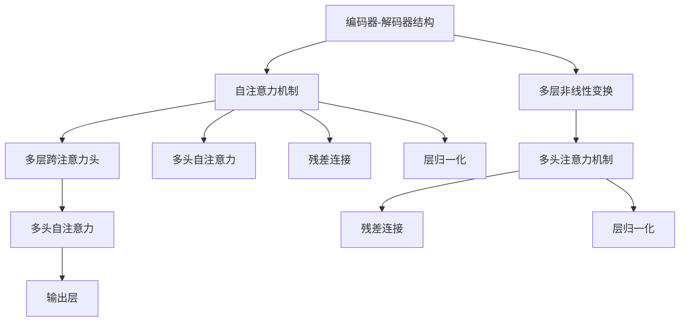

                 

# NLP领域的大模型标准：参数、能力、应用场景总结

> 关键词：大语言模型，Transformer，BERT，GPT，参数高效微调，自然语言处理，深度学习，应用场景

## 1. 背景介绍

### 1.1 问题由来
在自然语言处理(NLP)领域，大模型已经成为主流技术。尤其是以Transformer为架构的预训练语言模型，通过在大规模无标签文本数据上进行预训练，学习到了丰富的语言知识和常识。这些模型在各种下游任务上均取得了优异的性能，为NLP技术的发展提供了强有力的支撑。

### 1.2 问题核心关键点
尽管大模型在NLP任务上表现出色，但其应用范围和性能仍需进一步拓展。特别是对于特定领域或任务，大模型在微调时需要考虑模型参数、计算资源、模型复杂度、应用场景等多方面的因素。

### 1.3 问题研究意义
深入了解大语言模型的参数、能力和应用场景，对于指导模型微调和选择合适的大模型，提升NLP任务的性能和效率，具有重要意义。

## 2. 核心概念与联系

### 2.1 核心概念概述

在NLP领域，大语言模型指的是以Transformer为架构，通过大规模无标签文本数据预训练得到的语言模型。其核心组件包括编码器-解码器结构、自注意力机制、多层非线性变换等。

常见的预训练语言模型包括BERT、GPT系列、XLNet等。这些模型在预训练阶段分别采用了掩码语言模型、自回归语言模型、双向编码器等任务，学习到了泛化的语言表示。

### 2.2 核心概念原理和架构的 Mermaid 流程图



这个流程图展示了Transformer模型的基本结构：

1. 编码器-解码器结构：包含多个自注意力和全连接层。
2. 自注意力机制：通过多头注意力实现局部关注，捕捉长距离依赖。
3. 多层非线性变换：通过残差连接和层归一化，提升模型的非线性表达能力。
4. 多头注意力机制：并行处理多个注意力头，提高模型的感知范围和能力。
5. 残差连接：利用残差学习保留信息流动，避免梯度消失。
6. 层归一化：保持每一层的激活值分布稳定，加速模型收敛。

## 3. 核心算法原理 & 具体操作步骤
### 3.1 算法原理概述

基于大语言模型的NLP任务微调，本质上是将预训练模型作为特征提取器，通过有监督的微调过程，调整模型参数，使其适应特定任务。微调的目标是最大化模型在特定任务上的性能，通常使用交叉熵损失函数。

### 3.2 算法步骤详解

1. **数据预处理**：将下游任务的数据集进行清洗、分词、标注等处理。
2. **模型选择**：根据任务类型选择合适的预训练语言模型。
3. **参数初始化**：加载预训练模型的权重，设置冻结或微调的策略。
4. **损失函数设计**：根据任务类型设计损失函数。
5. **优化器选择**：选择合适的优化器及其参数，如Adam、SGD等。
6. **训练过程**：前向传播计算损失，反向传播更新参数。
7. **评估与调优**：在验证集上评估模型性能，调整学习率、批次大小等超参数。
8. **测试与部署**：在测试集上评估最终模型性能，部署到实际应用中。

### 3.3 算法优缺点

**优点**：
- 预训练模型具有广泛的语料支持，泛化能力强。
- 微调过程相对简单高效，可显著提升模型性能。
- 可适应多种NLP任务，通用性强。

**缺点**：
- 依赖标注数据，标注成本高。
- 模型复杂度大，计算资源消耗高。
- 过拟合风险较高，需要有效防止。

### 3.4 算法应用领域

大语言模型在NLP领域具有广泛的应用，包括文本分类、命名实体识别、机器翻译、情感分析、问答系统等。此外，大模型在跨领域迁移学习、少样本学习、知识图谱构建等方面也有显著表现。

## 4. 数学模型和公式 & 详细讲解

### 4.1 数学模型构建

假设预训练语言模型为$M_{\theta}$，下游任务为$T$。微调的目标是在任务$T$的标注数据$D$上进行微调，使得模型$M_{\hat{\theta}}$能够最小化任务$T$上的损失函数$\mathcal{L}(\hat{\theta}, D)$。

### 4.2 公式推导过程

以文本分类任务为例，设预训练语言模型的输出为$\hat{y}=M_{\theta}(x)$，真实标签为$y \in \{0,1\}$。则交叉熵损失函数为：

$$
\mathcal{L}(\hat{\theta}, D) = -\frac{1}{N}\sum_{i=1}^N [y_i\log \hat{y}_i + (1-y_i)\log (1-\hat{y}_i)]
$$

### 4.3 案例分析与讲解

以命名实体识别任务为例，假设有标注数据集$D=\{(x_i,y_i)\}_{i=1}^N$，其中$x_i$为输入文本，$y_i$为标签。对于每个样本$x_i$，我们首先进行分词和标注，然后将其输入到预训练模型$M_{\theta}$中，得到隐层表示$h$。接着，我们使用softmax函数将$h$映射到标签空间，得到$\hat{y}_i$，最后计算交叉熵损失：

$$
\mathcal{L}(\hat{\theta}, D) = -\frac{1}{N}\sum_{i=1}^N [y_i\log \hat{y}_i + (1-y_i)\log (1-\hat{y}_i)]
$$

## 5. 项目实践：代码实例和详细解释说明
### 5.1 开发环境搭建

安装必要的Python环境和工具包，如Anaconda、PyTorch、Transformers库等。

### 5.2 源代码详细实现

以下是一个简单的命名实体识别任务的微调代码实现：

```python
from transformers import BertTokenizer, BertForTokenClassification, AdamW
import torch
from torch.utils.data import Dataset, DataLoader

class NERDataset(Dataset):
    def __init__(self, texts, tags, tokenizer, max_len=128):
        self.texts = texts
        self.tags = tags
        self.tokenizer = tokenizer
        self.max_len = max_len
        
    def __len__(self):
        return len(self.texts)
    
    def __getitem__(self, item):
        text = self.texts[item]
        tags = self.tags[item]
        
        encoding = self.tokenizer(text, return_tensors='pt', max_length=self.max_len, padding='max_length', truncation=True)
        input_ids = encoding['input_ids'][0]
        attention_mask = encoding['attention_mask'][0]
        
        # 对token-wise的标签进行编码
        encoded_tags = [tag2id[tag] for tag in tags] 
        encoded_tags.extend([tag2id['O']] * (self.max_len - len(encoded_tags)))
        labels = torch.tensor(encoded_tags, dtype=torch.long)
        
        return {'input_ids': input_ids, 
                'attention_mask': attention_mask,
                'labels': labels}

# 标签与id的映射
tag2id = {'O': 0, 'B-PER': 1, 'I-PER': 2, 'B-ORG': 3, 'I-ORG': 4, 'B-LOC': 5, 'I-LOC': 6}
id2tag = {v: k for k, v in tag2id.items()}

# 创建dataset
tokenizer = BertTokenizer.from_pretrained('bert-base-cased')

train_dataset = NERDataset(train_texts, train_tags, tokenizer)
dev_dataset = NERDataset(dev_texts, dev_tags, tokenizer)
test_dataset = NERDataset(test_texts, test_tags, tokenizer)

# 定义模型和优化器
model = BertForTokenClassification.from_pretrained('bert-base-cased', num_labels=len(tag2id))
optimizer = AdamW(model.parameters(), lr=2e-5)

# 训练过程
device = torch.device('cuda') if torch.cuda.is_available() else torch.device('cpu')
model.to(device)

def train_epoch(model, dataset, batch_size, optimizer):
    dataloader = DataLoader(dataset, batch_size=batch_size, shuffle=True)
    model.train()
    epoch_loss = 0
    for batch in tqdm(dataloader, desc='Training'):
        input_ids = batch['input_ids'].to(device)
        attention_mask = batch['attention_mask'].to(device)
        labels = batch['labels'].to(device)
        model.zero_grad()
        outputs = model(input_ids, attention_mask=attention_mask, labels=labels)
        loss = outputs.loss
        epoch_loss += loss.item()
        loss.backward()
        optimizer.step()
    return epoch_loss / len(dataloader)

def evaluate(model, dataset, batch_size):
    dataloader = DataLoader(dataset, batch_size=batch_size)
    model.eval()
    preds, labels = [], []
    with torch.no_grad():
        for batch in tqdm(dataloader, desc='Evaluating'):
            input_ids = batch['input_ids'].to(device)
            attention_mask = batch['attention_mask'].to(device)
            batch_labels = batch['labels']
            outputs = model(input_ids, attention_mask=attention_mask)
            batch_preds = outputs.logits.argmax(dim=2).to('cpu').tolist()
            batch_labels = batch_labels.to('cpu').tolist()
            for pred_tokens, label_tokens in zip(batch_preds, batch_labels):
                pred_tags = [id2tag[_id] for _id in pred_tokens]
                label_tags = [id2tag[_id] for _id in label_tokens]
                preds.append(pred_tags[:len(label_tags)])
                labels.append(label_tags)
                
    print(classification_report(labels, preds))

epochs = 5
batch_size = 16

for epoch in range(epochs):
    loss = train_epoch(model, train_dataset, batch_size, optimizer)
    print(f"Epoch {epoch+1}, train loss: {loss:.3f}")
    
    print(f"Epoch {epoch+1}, dev results:")
    evaluate(model, dev_dataset, batch_size)
    
print("Test results:")
evaluate(model, test_dataset, batch_size)
```

### 5.3 代码解读与分析

- 数据处理：使用`BertTokenizer`对文本进行分词和编码，将文本转换为模型可以处理的张量。
- 模型加载：使用`BertForTokenClassification`加载预训练模型，并设置输出层和损失函数。
- 训练过程：使用AdamW优化器，在训练集上进行多轮迭代，计算并更新模型参数。
- 评估过程：在验证集和测试集上计算模型性能指标，如准确率、F1-score等。

## 6. 实际应用场景
### 6.1 智能客服系统

智能客服系统可以使用大模型进行微调，使其能够理解客户咨询并自动回复。通过预训练模型学习通用语言知识，再结合特定的训练数据进行微调，系统能够快速响应客户问题，并提供合适的解决方案。

### 6.2 金融舆情监测

金融舆情监测系统需要实时监测网络上的金融相关内容，评估市场情绪和风险趋势。利用大模型进行微调，可以在处理大量数据时保持高效和准确，帮助金融机构及时应对市场变化。

### 6.3 个性化推荐系统

个性化推荐系统可以利用大模型进行微调，学习用户偏好和行为，生成个性化推荐内容。通过引入多种数据源，包括用户行为数据、文本数据、标签数据等，可以提升推荐系统的精准度和覆盖面。

### 6.4 未来应用展望

未来，随着大语言模型的不断演进，其在NLP领域的应用将更加广泛。智能客服、金融舆情监测、个性化推荐等场景只是冰山一角。

在医疗领域，大模型可以用于病历分析、诊断支持等任务，提升医疗服务水平。在教育领域，大模型可以用于智能辅助教学、作业批改等，提高教育质量。在智慧城市治理中，大模型可以用于城市事件监测、应急响应等，提升城市管理效率。

## 7. 工具和资源推荐
### 7.1 学习资源推荐

- 《自然语言处理综述》：介绍NLP的基本概念和技术，适合入门学习。
- 《深度学习与NLP》课程：斯坦福大学开设的NLP相关课程，涵盖最新NLP技术。
- 《NLP中的Transformer》系列博文：介绍Transformer模型及其在NLP中的应用。
- HuggingFace官方文档：提供丰富的预训练模型和微调示例，是实践NLP任务的重要参考。
- CLUE开源项目：涵盖多类型中文NLP任务的数据集和基线模型，助力中文NLP研究。

### 7.2 开发工具推荐

- PyTorch：灵活的深度学习框架，支持动态图和静态图。
- TensorFlow：Google主导的深度学习框架，适合大规模生产部署。
- Transformers库：HuggingFace提供的NLP工具库，涵盖多种预训练模型。
- Weights & Biases：实验跟踪工具，记录和可视化模型训练过程。
- TensorBoard：可视化工具，监测模型训练状态和性能指标。

### 7.3 相关论文推荐

- Attention is All You Need：提出Transformer模型，奠定了大语言模型的基础。
- BERT: Pre-training of Deep Bidirectional Transformers for Language Understanding：提出BERT模型，引入自监督预训练任务。
- Language Models are Unsupervised Multitask Learners：展示大语言模型的通用学习能力。
- Parameter-Efficient Transfer Learning for NLP：提出 Adapter 等参数高效微调方法，节省计算资源。
- AdaLoRA: Adaptive Low-Rank Adaptation for Parameter-Efficient Fine-Tuning：使用自适应低秩适应的微调方法，提升微调效果。
- Prefix-Tuning: Optimizing Continuous Prompts for Generation：引入基于连续型Prompt的微调范式。

## 8. 总结：未来发展趋势与挑战

### 8.1 总结

本文对基于大语言模型的NLP任务微调进行了系统介绍，包括参数、能力和应用场景。通过学习本文，读者可以了解大语言模型的基本原理和微调流程，掌握常用的微调方法和技术。

### 8.2 未来发展趋势

未来，大语言模型将继续发展，呈现出以下趋势：
- 模型规模不断增大，参数量将达到数十亿。
- 参数高效微调方法将得到广泛应用，优化计算资源消耗。
- 跨领域迁移学习将更加普及，提升模型泛化能力。
- 知识图谱和先验知识将得到更多整合，增强模型的理解能力。
- 多模态学习将逐步普及，提升模型的感知范围和能力。

### 8.3 面临的挑战

尽管大语言模型在NLP任务上表现优异，但仍面临以下挑战：
- 标注成本高昂，难以获取充足的高质量标注数据。
- 模型复杂度高，计算资源消耗大。
- 过拟合风险高，需要有效防止。
- 模型的可解释性不足，缺乏透明性。
- 模型可能引入偏见和有害信息，需要伦理约束。

### 8.4 研究展望

为了应对挑战，未来的研究需要在以下方面进行突破：
- 探索无监督和半监督微调方法，降低标注成本。
- 研究参数高效和计算高效的微调方法，优化资源消耗。
- 引入因果推断和对比学习，提升模型泛化能力。
- 整合知识图谱和先验知识，增强理解能力。
- 引入博弈论和多模态学习，提升感知范围和能力。
- 强化模型可解释性和伦理约束，保障模型安全。

## 9. 附录：常见问题与解答

**Q1: 大语言模型微调是否适用于所有NLP任务？**

A: 大语言模型微调在大多数NLP任务上均能取得不错的效果，但对于特定领域任务，可能需要进行预训练和微调相结合，才能达到理想效果。

**Q2: 微调过程中如何选择合适的学习率？**

A: 微调学习率通常比预训练小，建议从1e-5开始，逐步减小，防止破坏预训练权重。可以使用warmup策略，逐步调整学习率。

**Q3: 采用大模型微调时会面临哪些资源瓶颈？**

A: 大模型计算资源消耗大，内存和显存需求高。需采用梯度积累、混合精度训练、模型并行等技术进行优化。

**Q4: 如何缓解微调过程中的过拟合问题？**

A: 数据增强、正则化、对抗训练、参数高效微调等方法可以有效缓解过拟合。需要根据具体情况选择合适的方法。

**Q5: 微调模型在落地部署时需要注意哪些问题？**

A: 模型裁剪、量化加速、服务化封装、弹性伸缩、监控告警、安全防护等是微调模型部署时需要注意的问题。

---

作者：禅与计算机程序设计艺术 / Zen and the Art of Computer Programming

