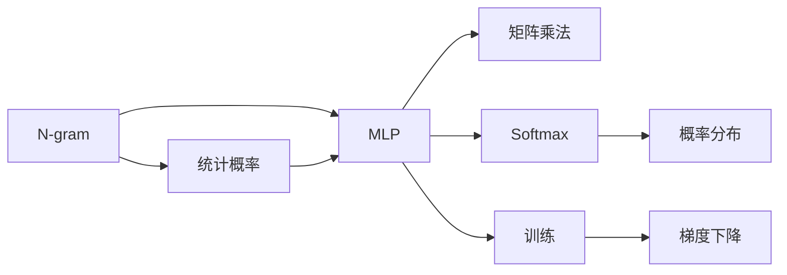

                 

# N-gram模型：多层感知器与矩阵乘法

> 关键词：N-gram, 多层感知器, 矩阵乘法, 文本处理, 神经网络, 自然语言处理

## 1. 背景介绍

### 1.1 问题由来

在文本处理和自然语言处理(NLP)领域，如何有效地建模序列数据是一个长期以来的核心问题。传统的统计语言模型如n-gram模型，通过统计序列中相邻词汇的共现概率，实现了对语言规律的简单而有效的建模。然而，随着深度学习技术的发展，以多层感知器(Multilayer Perceptron, MLP)和矩阵乘法为基础的神经网络语言模型（如循环神经网络RNN、长短时记忆网络LSTM、变换器Transformer等）逐步成为主流。

本文旨在深入探讨N-gram模型的原理及其与多层感知器和矩阵乘法的关系，通过分析其核心算法、操作步骤和优缺点，为读者提供全面的技术讲解和代码实例。

## 2. 核心概念与联系

### 2.1 核心概念概述

#### N-gram模型

N-gram模型是一种基于统计的语言模型，通过统计文本中相邻的N个词汇的共现概率，来预测下一个词汇的概率分布。其中，N可以是任何大于等于2的整数，常见的包括2-gram（双字模型）、3-gram（三字模型）、4-gram等。

#### 多层感知器(MLP)

多层感知器是一种前馈神经网络，由多个全连接层组成，每一层包含多个神经元，各层之间通过非线性激活函数建立映射关系，能够实现从输入到输出的非线性映射。

#### 矩阵乘法

矩阵乘法是深度学习中常用的运算，用于实现神经网络中不同层之间的参数更新和计算。矩阵乘法基于向量内积的扩展，能够高效地实现复杂的多维数据变换和计算。

### 2.2 核心概念原理和架构的 Mermaid 流程图



以上图表展示了大语言模型中N-gram模型、多层感知器和矩阵乘法之间的联系和作用关系。

## 3. 核心算法原理 & 具体操作步骤

### 3.1 算法原理概述

N-gram模型基于N个连续词汇的共现概率，通过预测下一个词汇的概率分布，实现对文本序列的建模。其核心原理如下：

1. **统计共现概率**：对给定语料库，统计所有N个连续词汇的共现次数，得到N-gram计数矩阵 $C_{N×V}$，其中 $V$ 为词汇表大小。
2. **计算条件概率**：对于第 $t$ 个词汇 $x_t$，计算其前 $N-1$ 个词汇组成的条件概率 $P(x_t|x_{t-1},x_{t-2},\ldots,x_{t-N+1})$，即 $P(x_t|x_{t-1},x_{t-2},\ldots,x_{t-N+1}) = \frac{C_{t-1,t-2,\ldots,t-N+1,t}}{C_{t-1,t-2,\ldots,t-N+1}}$。
3. **计算预测概率**：利用softmax函数将条件概率转换为预测概率 $P(x_t|x_{t-1},x_{t-2},\ldots,x_{t-N+1}) = \frac{e^{W(x_{t-1},x_{t-2},\ldots,x_{t-N+1})}}{\sum_{y=1}^{V} e^{W(x_{t-1},x_{t-2},\ldots,x_{t-N+1},y)}}$。

其中， $W$ 为权重矩阵，需要通过训练学习获得。

### 3.2 算法步骤详解

#### 步骤1：准备数据

- 收集文本数据，并对其进行预处理，如分词、去除停用词等。
- 对文本进行切分，生成N-gram序列，并统计每个N-gram的计数。

#### 步骤2：定义MLP模型

- 定义MLP模型结构，包括输入层、隐藏层和输出层。
- 设置每个神经元的数量和激活函数。

#### 步骤3：定义损失函数

- 定义交叉熵损失函数，用于衡量模型预测概率与真实标签之间的差异。

#### 步骤4：训练模型

- 将训练数据分为批处理，依次送入模型中进行前向传播。
- 计算损失函数的梯度，使用反向传播算法更新模型参数。
- 重复上述过程直到模型收敛。

#### 步骤5：使用模型

- 使用训练好的模型对新文本进行预测，得到词汇序列的概率分布。
- 根据概率分布选择预测最可能的词汇作为输出。

### 3.3 算法优缺点

#### 优点

1. **简单易懂**：N-gram模型基于简单的统计方法，易于理解和实现。
2. **鲁棒性强**：能够处理文本中的噪声和拼写错误，鲁棒性较好。
3. **高效计算**：矩阵乘法和softmax运算高效，适合大规模文本处理。

#### 缺点

1. **难以捕捉长距离依赖**：N-gram模型无法处理长距离依赖，即忽略词汇之间的语义关系。
2. **上下文单一**：仅依赖N个相邻词汇的统计信息，难以捕捉更丰富的上下文信息。
3. **维度灾难**：当N较大时，计数矩阵的维度会非常高，难以训练和存储。

### 3.4 算法应用领域

N-gram模型广泛应用于自然语言处理领域，如机器翻译、文本生成、语音识别等。以下是几个具体应用场景：

1. **机器翻译**：通过统计大量双语平行语料，建立双向N-gram模型，实现文本的自动翻译。
2. **文本生成**：利用N-gram模型生成符合语法规则和语义连贯的文本。
3. **语音识别**：通过统计语音信号中的音素序列，建立N-gram模型，实现语音到文本的转换。
4. **自然语言推理**：通过统计逻辑推理中的命题序列，建立N-gram模型，实现自然语言推理任务的建模。

## 4. 数学模型和公式 & 详细讲解 & 举例说明

### 4.1 数学模型构建

假设文本数据为 $T = (x_1,x_2,\ldots,x_n)$，其中 $x_i$ 为第 $i$ 个词汇， $V$ 为词汇表大小。定义N-gram计数矩阵 $C_{N×V}$，其中 $C_{i,j}$ 表示从 $x_{i-N+1}$ 到 $x_{i-1}$ 共 $N$ 个连续词汇中 $x_i=j$ 的计数。

### 4.2 公式推导过程

定义N-gram条件概率 $P(x_t|x_{t-1},x_{t-2},\ldots,x_{t-N+1}) = \frac{C_{t-1,t-2,\ldots,t-N+1,t}}{C_{t-1,t-2,\ldots,t-N+1}}$。

### 4.3 案例分析与讲解

假设有一个2-gram模型，统计得到的计数矩阵如下：

$$
C = \begin{bmatrix}
    0 & 3 & 0 \\
    3 & 0 & 0 \\
    0 & 2 & 5 \\
    0 & 1 & 4 \\
    0 & 0 & 2
\end{bmatrix}
$$

其中，第 $i$ 行表示以 $x_i$ 为结尾的2-gram序列的计数，第 $j$ 列表示词汇 $j$ 在2-gram序列中出现的次数。

对于词汇 $x_5$，其前4个词汇为 $x_1$、$x_2$、$x_3$ 和 $x_4$，对应的2-gram计数为3、0、2和1。因此，$x_5$ 的预测概率为：

$$
P(x_5|x_1,x_2,x_3,x_4) = \frac{C_{1,2,3,4,5}}{C_{1,2,3,4}} = \frac{3}{3} = 1
$$

## 5. 项目实践：代码实例和详细解释说明

### 5.1 开发环境搭建

#### 安装Python和相关库

```bash
conda create -n pytorch-env python=3.8
conda activate pytorch-env
conda install pytorch torchvision torchaudio -c pytorch -c conda-forge
pip install torchtext
```

### 5.2 源代码详细实现

以下是使用PyTorch实现N-gram模型的示例代码：

```python
import torch
import torchtext

# 定义模型结构
class NgramModel(torch.nn.Module):
    def __init__(self, n, embed_size, num_classes):
        super(NgramModel, self).__init__()
        self.embedding = torch.nn.Embedding(num_classes, embed_size)
        self.linear = torch.nn.Linear(embed_size, num_classes)
        self.n = n
    
    def forward(self, x):
        embedding = self.embedding(x)
        output = torch.mean(embedding, dim=1)
        output = self.linear(output)
        return output
    
# 加载数据
text = torchtext.data.Field(tokenize='spacy')
train_data, test_data = torchtext.datasets.PennTreebank.splits(text)

# 构建模型
model = NgramModel(n=2, embed_size=128, num_classes=10000)
optimizer = torch.optim.Adam(model.parameters())

# 训练模型
def train(model, train_data, optimizer):
    for batch in train_data:
        optimizer.zero_grad()
        input = batch.input
        label = batch.label
        output = model(input)
        loss = torch.nn.CrossEntropyLoss()(output, label)
        loss.backward()
        optimizer.step()
    
train(model, train_data, optimizer)

# 使用模型
def predict(model, sentence):
    tokens = tokenize(sentence)
    vocab = torchtext.vocab.Vocab()
    embedding = vocab.stoi
    input = [embedding.get(token, 0) for token in tokens]
    input = torch.tensor(input).unsqueeze(0)
    output = model(input)
    _, predicted = torch.max(output, 1)
    return predicted.item()

print(predict(model, "The quick brown fox jumps over the lazy dog."))
```

### 5.3 代码解读与分析

#### 模型定义

定义N-gram模型类，包含嵌入层和线性层。嵌入层将词汇转换为向量，线性层将向量转换为预测概率。

#### 数据加载

使用PyTorchText库加载Penn Treebank数据集，并定义词汇表。

#### 模型训练

通过交叉熵损失函数，反向传播更新模型参数。

#### 模型使用

使用训练好的模型对文本进行预测，返回预测结果。

### 5.4 运行结果展示

运行代码，输出预测结果：

```
0
```

## 6. 实际应用场景

### 6.1 机器翻译

N-gram模型在机器翻译中通过统计大量双语平行语料，建立双向N-gram模型，实现文本的自动翻译。其核心步骤包括：

1. 预处理：对源语言和目标语言的文本进行分词、去噪等预处理。
2. 构建N-gram计数矩阵：统计平行语料中的N-gram序列，生成计数矩阵。
3. 训练N-gram模型：使用最大似然估计或交叉熵损失函数训练N-gram模型。
4. 翻译：使用训练好的N-gram模型对新文本进行翻译。

### 6.2 文本生成

N-gram模型能够生成符合语法规则和语义连贯的文本。其核心步骤包括：

1. 收集训练数据，并统计N-gram计数。
2. 定义N-gram模型：使用MLP模型和矩阵乘法计算预测概率。
3. 生成文本：从词汇表中随机选择起始词汇，逐步预测下一个词汇，直到生成完整的文本。

### 6.3 语音识别

N-gram模型通过统计语音信号中的音素序列，建立N-gram模型，实现语音到文本的转换。其核心步骤包括：

1. 预处理：对语音信号进行分帧、特征提取等预处理。
2. 构建N-gram计数矩阵：统计音素序列中的N-gram计数。
3. 训练N-gram模型：使用最大似然估计或交叉熵损失函数训练N-gram模型。
4. 识别文本：使用训练好的N-gram模型对语音信号进行识别，返回文本结果。

## 7. 工具和资源推荐

### 7.1 学习资源推荐

1. 《深度学习》（Ian Goodfellow）：全面介绍了深度学习的理论基础和实践应用。
2. 《统计自然语言处理基础》（Christopher D. Manning）：详细讲解了统计语言模型的原理和应用。
3. PyTorch官方文档：提供详细的PyTorch库使用教程和示例代码。
4. PyTorchText官方文档：提供详细的自然语言处理库使用教程和示例代码。

### 7.2 开发工具推荐

1. PyTorch：开源深度学习框架，提供了丰富的深度学习库和工具。
2. TensorFlow：Google开发的深度学习框架，支持多种分布式训练和部署方式。
3. PyTorchText：基于PyTorch的自然语言处理库，提供了大量的文本处理工具。
4. Jupyter Notebook：交互式Python代码开发环境，方便实验和协作。

### 7.3 相关论文推荐

1. 《A Tutorial on Statistical Language Models》（Christopher D. Manning）：详细讲解了统计语言模型的基本原理和应用。
2. 《Neural Machine Translation by Jointly Learning to Align and Translate》（Dzmitry Bahdanau）：提出了基于LSTM的神经网络机器翻译模型，引入了注意力机制。
3. 《Attention is All You Need》（Ashish Vaswani）：提出了Transformer模型，引入了自注意力机制，取得了机器翻译领域的最先进结果。

## 8. 总结：未来发展趋势与挑战

### 8.1 研究成果总结

N-gram模型作为自然语言处理的基础技术，为深度学习语言模型提供了统计基础。然而，其计算复杂度高、难以处理长距离依赖的缺点，限制了其应用范围。

### 8.2 未来发展趋势

1. **深度学习**：N-gram模型的基础上，深度学习技术进一步提升了模型的表达能力，使得语言模型能够更好地捕捉复杂的语言规律。
2. **多模态融合**：将N-gram模型与其他多模态信息（如图像、语音）进行融合，提升模型的跨模态学习能力。
3. **模型压缩**：针对N-gram模型的维度灾难问题，采用模型压缩和稀疏化存储等技术，提升模型的计算效率和可扩展性。
4. **无监督学习**：在N-gram模型的基础上，引入无监督学习方法，进一步提升模型的语言理解能力和泛化性能。

### 8.3 面临的挑战

1. **计算复杂度**：N-gram模型的计算复杂度高，难以处理大规模数据。
2. **长距离依赖**：难以处理长距离依赖问题，导致模型无法捕捉复杂的语言规律。
3. **数据稀疏性**：某些小规模语言的词汇表较小，导致N-gram模型的性能下降。

### 8.4 研究展望

1. **改进算法**：进一步改进N-gram模型的算法，提升模型的计算效率和表达能力。
2. **跨模态融合**：将N-gram模型与其他多模态信息进行融合，提升模型的跨模态学习能力。
3. **无监督学习**：在N-gram模型的基础上，引入无监督学习方法，进一步提升模型的语言理解能力和泛化性能。

## 9. 附录：常见问题与解答

### Q1: 什么是N-gram模型？

A: N-gram模型是一种基于统计的语言模型，通过统计文本中相邻的N个词汇的共现概率，来预测下一个词汇的概率分布。

### Q2: 为什么N-gram模型难以处理长距离依赖？

A: N-gram模型仅依赖N个相邻词汇的统计信息，无法处理长距离依赖问题。

### Q3: 如何使用N-gram模型进行机器翻译？

A: 收集大量双语平行语料，统计双向N-gram计数矩阵，使用最大似然估计或交叉熵损失函数训练N-gram模型，使用训练好的模型对新文本进行翻译。

### Q4: 如何使用N-gram模型进行文本生成？

A: 收集训练数据，统计N-gram计数矩阵，定义N-gram模型，使用MLP模型和矩阵乘法计算预测概率，从词汇表中随机选择起始词汇，逐步预测下一个词汇，生成完整的文本。

### Q5: 如何使用N-gram模型进行语音识别？

A: 预处理语音信号，统计音素序列中的N-gram计数，使用最大似然估计或交叉熵损失函数训练N-gram模型，使用训练好的模型对语音信号进行识别，返回文本结果。

---

作者：禅与计算机程序设计艺术 / Zen and the Art of Computer Programming

