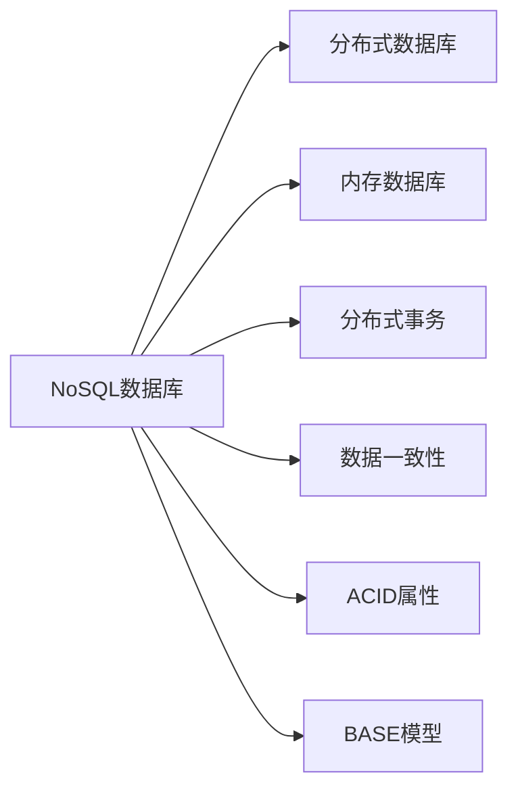

                 

## 1. 背景介绍

### 1.1 问题由来

随着互联网的飞速发展和数据量的爆炸式增长，传统关系型数据库(Relational Database)在处理海量、多源、异构数据时暴露出许多局限性。其中最突出的问题便是数据的结构性限制，传统关系型数据库对数据的类型和结构有严格的约束，要求数据必须按照预定义的表结构进行存储，这在处理半结构化、非结构化数据时显得捉襟见肘。

此外，关系型数据库的扩展性和可扩展性也成为大企业和互联网应用的一大挑战。单节点关系型数据库的扩展性受限于硬件资源，而分布式关系型数据库的扩展性则受限于分布式架构的设计和优化。相比之下，NoSQL数据库因其灵活的数据模型和分布式设计，在处理非结构化数据和海量数据时具备更高的扩展性和灵活性。

### 1.2 问题核心关键点

NoSQL数据库作为处理非结构化数据的解决方案，其核心优势在于：

- 非结构化数据模型：NoSQL数据库采用键值对、文档、图、列族等非结构化数据模型，能够灵活存储各类数据类型，包括字符串、图像、视频、音频等。

- 高可扩展性：NoSQL数据库基于分布式架构设计，能够水平扩展，支持海量数据的处理和存储。

- 高性能：NoSQL数据库使用内存数据库或分布式存储，能够提供更高的读写速度和更低的延迟。

- 高可用性：NoSQL数据库通常采用冗余和容错机制，能够保证数据的高可用性和系统的高可靠性。

- 灵活性：NoSQL数据库提供了丰富的事务处理和一致性保障机制，能够满足不同业务场景的定制需求。

### 1.3 问题研究意义

研究NoSQL数据库的处理方法，对于拓展大数据应用场景，提升数据处理的效率和灵活性，降低数据管理成本，具有重要意义：

1. 处理海量非结构化数据：传统关系型数据库难以存储海量非结构化数据，NoSQL数据库提供灵活的数据模型，能够高效存储和处理各类非结构化数据。

2. 支持分布式计算：NoSQL数据库通过分布式存储和计算，能够支持大规模、高并发的数据处理任务，提升数据处理的效率和吞吐量。

3. 降低开发和运维成本：NoSQL数据库以其简单易用的API和丰富的插件库，降低了开发和运维成本，提高了数据管理的效率和便捷性。

4. 提升数据治理水平：NoSQL数据库提供数据访问控制、数据生命周期管理、数据质量监控等数据治理功能，帮助企业建立更完善的数据管理体系。

5. 推动数字化转型：NoSQL数据库的灵活性和可扩展性，支持企业构建更高效、智能、灵活的数字化应用系统，推动产业升级和经济转型。

## 2. 核心概念与联系

### 2.1 核心概念概述

为更好地理解NoSQL数据库的处理方法，本节将介绍几个密切相关的核心概念：

- NoSQL数据库：一种非关系型数据库，支持键值对、文档、列族、图等非结构化数据模型。能够高效存储和处理海量非结构化数据，支持水平扩展和分布式计算。

- 分布式数据库：通过分布式存储和计算，提升数据处理能力和系统可用性，支持大规模、高并发的数据处理任务。

- 内存数据库：将数据存储在内存中，能够提供极高的读写速度和低延迟，适合处理实时数据和分析任务。

- 分布式事务：支持跨节点的事务处理，能够保证分布式系统的一致性和可靠性。

- 数据一致性：指数据库中数据的一致性状态，通常分为强一致性、最终一致性和可持久性等。

- ACID属性：传统关系型数据库中的原子性(Atomicity)、一致性(Consistency)、隔离性(Isolation)和持久性(Durability)属性。

- BASE模型：基于可用性(Availability)、软状态(Soft State)和最终一致性(Eventual Consistency)模型的非关系型数据库设计理念。

这些核心概念之间的逻辑关系可以通过以下Mermaid流程图来展示：



这个流程图展示了大语言模型的核心概念及其之间的关系：

1. NoSQL数据库支持非结构化数据模型，能够高效存储和处理各类数据。
2. 分布式数据库是NoSQL数据库的架构基础，通过分布式存储和计算，提升系统可用性和扩展性。
3. 内存数据库提供高读写速度和低延迟，适用于实时数据处理和分析任务。
4. 分布式事务支持跨节点的事务处理，保证分布式系统的一致性和可靠性。
5. 数据一致性指数据库中数据的一致性状态，是系统可靠性的重要保证。
6. ACID属性是传统关系型数据库的重要属性，通常适用于对一致性和可靠性要求较高的场景。
7. BASE模型是NoSQL数据库的设计理念，强调可用性和最终一致性，适用于对性能要求较高的场景。

## 3. 核心算法原理 & 具体操作步骤

### 3.1 算法原理概述

NoSQL数据库的核心算法原理基于分布式数据存储和计算，主要包括以下几个关键概念：

- 分布式存储：通过多节点存储，实现数据冗余和负载均衡，提升系统可扩展性和容错性。

- 分布式计算：通过多节点并行计算，实现数据处理任务的分布式执行，提升系统处理能力和吞吐量。

- 一致性协议：设计合理的一致性协议，保证分布式系统在各种网络条件下的一致性，常见的包括Paxos、Raft等。

- 容错机制：通过冗余和容错机制，保证系统在单节点故障情况下的可用性。

- 数据分区和索引：通过数据分区和索引，提升数据访问和查询的效率。

### 3.2 算法步骤详解

NoSQL数据库的典型处理流程一般包括以下几个步骤：

**Step 1: 数据分区**

- 根据数据特征将数据进行分区，实现数据的分布式存储。
- 常用的分区方式包括范围分区、哈希分区、列表分区等。
- 在分区的基础上设计分布式计算任务，提升数据处理的效率。

**Step 2: 数据分布式计算**

- 将数据分区存储到不同的节点上，通过并行计算任务处理数据。
- 在分布式计算中，需要考虑数据一致性和负载均衡问题。
- 采用多副本机制确保数据一致性，通过分布式调度算法实现负载均衡。

**Step 3: 一致性协议**

- 设计一致性协议确保分布式系统的一致性，常见协议包括Paxos、Raft等。
- 在分布式事务处理中，需要保证跨节点的事务一致性。
- 通过分布式锁、版本控制等方式，实现分布式一致性。

**Step 4: 容错机制**

- 设计冗余和容错机制，保证系统在单节点故障情况下的可用性。
- 采用主从复制、多副本机制等方式，实现系统的容错和冗余。

**Step 5: 数据查询和索引**

- 设计合适的数据索引，提升数据查询的效率。
- 常用的索引方式包括B树索引、哈希索引、倒排索引等。
- 在索引的基础上设计高效的数据查询算法，提升系统的查询性能。

### 3.3 算法优缺点

NoSQL数据库的优点在于：

1. 非结构化数据模型：支持存储各种类型的数据，包括字符串、图像、视频等，灵活性高。

2. 高可扩展性：采用分布式架构设计，能够水平扩展，支持海量数据的存储和处理。

3. 高性能：通过内存数据库和分布式存储，能够提供更高的读写速度和更低的延迟。

4. 高可用性：采用冗余和容错机制，保证数据的高可用性和系统的高可靠性。

5. 灵活性：提供丰富的数据一致性和事务处理机制，满足不同业务场景的定制需求。

NoSQL数据库的缺点在于：

1. 缺乏标准化：不同的NoSQL数据库有不同的数据模型和API，难以进行跨系统的数据迁移和互操作。

2. 事务处理难度大：分布式数据库的事务处理和一致性保障复杂，难以保证强一致性。

3. 数据一致性问题：采用最终一致性机制的NoSQL数据库，可能在数据一致性上存在一些争议。

4. 复杂度高：系统设计和运维复杂度较高，需要具备较高的技术水平和经验。

5. 缺乏复杂查询支持：部分NoSQL数据库对复杂的SQL查询支持不足，需要额外进行二次开发。

### 3.4 算法应用领域

NoSQL数据库的应用领域非常广泛，以下列举了几个典型应用场景：

1. 大数据存储：通过NoSQL数据库存储海量非结构化数据，支持数据仓库、数据湖等数据存储系统。

2. 实时数据处理：通过NoSQL数据库的内存存储和分布式计算，实现实时数据处理和分析，支持流计算、日志分析等场景。

3. 分布式系统：通过NoSQL数据库的分布式架构，实现分布式系统的高可用性和扩展性，支持微服务架构、分布式缓存等场景。

4. 物联网应用：通过NoSQL数据库支持设备数据存储和处理，实现物联网设备和系统的高效管理和数据分析。

5. 移动应用：通过NoSQL数据库支持移动应用的数据存储和处理，实现离线缓存、数据同步等场景。

6. 企业应用：通过NoSQL数据库支持企业应用的数据管理和分析，实现客户关系管理、供应链管理、电子商务等场景。

## 4. 数学模型和公式 & 详细讲解 & 举例说明

### 4.1 数学模型构建

为了更好地理解NoSQL数据库的算法原理，我们将介绍几个常用的数学模型，并给出对应的公式推导。

- **主从复制模型(Master-Slave Replication)**

主从复制是一种常见的数据冗余和容错机制，通过在多个节点上复制数据，实现系统的冗余和高可用性。主从复制的数学模型可以表示为：

$$
R = M + S
$$

其中，$R$ 表示系统的总冗余，$M$ 表示主节点的数据量，$S$ 表示从节点的数据量。

- **Paxos算法**

Paxos是一种一致性协议，用于在分布式系统中保证一致性。Paxos算法的数学模型可以表示为：

$$
Consistency = Agreement \times Acceptance \times Replication
$$

其中，$Agreement$ 表示系统中的节点达成一致的概率，$Acceptance$ 表示系统中的节点接受提案的概率，$Replication$ 表示数据在多个节点上的冗余量。

- **分片分区算法**

分片分区是NoSQL数据库常用的数据分区方法，通过将数据按照某个维度进行分片，实现数据的分布式存储。分片分区的数学模型可以表示为：

$$
Sharding = Partition + Replication
$$

其中，$Partition$ 表示数据分片的数量，$Replication$ 表示每个分片在多个节点上的冗余量。

### 4.2 公式推导过程

以下是几个核心算法的公式推导过程：

**主从复制模型**

$$
R = M + S
$$

在主从复制模型中，主节点负责数据写入，从节点负责数据复制和冗余。主节点的数据量为 $M$，从节点的数据量为 $S$，系统的总冗余为 $R$。

**Paxos算法**

$$
Consistency = Agreement \times Acceptance \times Replication
$$

在Paxos算法中，系统中的节点达成一致的概率为 $Agreement$，节点接受提案的概率为 $Acceptance$，数据的冗余量为 $Replication$。系统的最终一致性 $Consistency$ 可以通过这三个因素的乘积计算得到。

**分片分区算法**

$$
Sharding = Partition + Replication
$$

在分片分区算法中，数据被分片为 $Partition$ 个分片，每个分片在多个节点上复制 $Replication$ 次。系统的分片分区效果 $Sharding$ 可以通过这两个因素的加和计算得到。

### 4.3 案例分析与讲解

下面我们以MongoDB数据库为例，分析其实现细节和关键算法。

**MongoDB**

MongoDB是一种典型的NoSQL数据库，采用分布式架构设计，支持键值对、文档等非结构化数据模型。MongoDB的实现主要依赖以下几个核心算法：

- 主从复制

MongoDB采用主从复制机制，通过在多个节点上复制数据，实现系统的冗余和高可用性。主节点负责数据写入和同步，从节点负责数据的冗余和容错。

- Paxos算法

MongoDB使用基于Paxos算法的一致性协议，确保在分布式系统中的数据一致性。MongoDB的Paxos算法通过多个节点达成一致性，并通过日志记录确保数据的一致性。

- 分片分区

MongoDB采用分片分区算法，通过将数据按照哈希值进行分片，实现数据的分布式存储。MongoDB的分片分区效果可以通过数据分片数量和每个分片在多个节点上的冗余量计算得到。

## 5. 项目实践：代码实例和详细解释说明

### 5.1 开发环境搭建

在进行NoSQL数据库的实践前，我们需要准备好开发环境。以下是使用Python进行PyMongo开发的环境配置流程：

1. 安装Anaconda：从官网下载并安装Anaconda，用于创建独立的Python环境。

2. 创建并激活虚拟环境：
```bash
conda create -n pymongo-env python=3.8 
conda activate pymongo-env
```

3. 安装MongoDB：从官网下载并安装MongoDB，根据操作系统和配置要求完成安装。

4. 安装PyMongo：
```bash
pip install pymongo
```

5. 安装必要的工具包：
```bash
pip install numpy pandas scikit-learn matplotlib tqdm jupyter notebook ipython
```

完成上述步骤后，即可在`pymongo-env`环境中开始NoSQL数据库的实践。

### 5.2 源代码详细实现

下面我们以MongoDB数据库为例，给出使用PyMongo进行数据存储和操作的PyTorch代码实现。

首先，定义MongoDB数据库的连接对象：

```python
from pymongo import MongoClient

client = MongoClient('mongodb://localhost:27017/')
db = client['mydatabase']
collection = db['mycollection']
```

然后，定义数据插入和查询函数：

```python
def insert_data(collection, data):
    result = collection.insert_one(data)
    return result.inserted_id

def query_data(collection, query, projection=None):
    result = collection.find(query, projection)
    return list(result)
```

接着，定义数据更新和删除函数：

```python
def update_data(collection, filter, update):
    result = collection.update_one(filter, update)
    return result.modified_count

def delete_data(collection, filter):
    result = collection.delete_one(filter)
    return result.deleted_count
```

最后，启动MongoDB数据操作流程：

```python
# 插入数据
data = {'name': 'John', 'age': 30}
insert_data(collection, data)

# 查询数据
query = {'age': {'$gt': 25}}
projection = {'name': 1, 'age': 1}
result = query_data(collection, query, projection)
print(result)

# 更新数据
update = {'$set': {'age': 35}}
filter = {'name': 'John'}
update_data(collection, filter, update)

# 删除数据
filter = {'name': 'John'}
delete_data(collection, filter)
```

以上就是使用PyMongo对MongoDB数据库进行数据存储和操作的完整代码实现。可以看到，得益于PyMongo的强大封装，我们可以用相对简洁的代码完成MongoDB的连接、数据插入、查询、更新和删除等基本操作。

### 5.3 代码解读与分析

让我们再详细解读一下关键代码的实现细节：

**MongoDB连接对象**

- `MongoClient`：用于连接MongoDB服务器，需要指定MongoDB服务器的地址和端口号。
- `db`：指定数据库名称。
- `collection`：指定集合名称。

**数据插入函数**

- `insert_data`：将数据插入到指定集合中，返回插入的文档ID。

**数据查询函数**

- `query_data`：查询符合条件的数据，并指定投影字段。

**数据更新函数**

- `update_data`：更新符合条件的数据，使用指定的更新操作。

**数据删除函数**

- `delete_data`：删除符合条件的数据，使用指定的过滤条件。

可以看到，MongoDB操作的核心在于连接对象和集合对象的封装，使得数据操作变得简洁高效。开发者可以通过简单的函数调用，完成数据插入、查询、更新和删除等基本操作。

当然，工业级的系统实现还需考虑更多因素，如数据同步、事务处理、索引优化等。但核心的NoSQL数据库操作流程基本与此类似。

## 6. 实际应用场景

### 6.1 智能搜索系统

NoSQL数据库的分布式存储和计算能力，使其成为构建智能搜索系统的理想选择。智能搜索系统通过NoSQL数据库存储海量数据，并通过分布式计算对数据进行高效处理和分析，能够提供快速准确的搜索结果。

例如，搜索引擎可以使用NoSQL数据库存储网页内容、用户行为数据等，通过分布式索引和搜索算法，实现快速的全文检索和关键词匹配。NoSQL数据库的分布式架构能够支持高并发、高吞吐量的查询需求，提升搜索系统的性能和响应速度。

### 6.2 大数据分析平台

NoSQL数据库的高性能和大容量存储能力，使其成为构建大数据分析平台的理想选择。大数据分析平台通过NoSQL数据库存储海量非结构化数据，并通过分布式计算对数据进行高效处理和分析，能够提供实时、灵活的数据分析能力。

例如，Hadoop、Spark等大数据分析框架通常与NoSQL数据库集成，利用NoSQL数据库的分布式存储和计算能力，实现大数据的实时处理和分析。NoSQL数据库的高可用性和容错性，能够保证大数据分析平台的稳定性和可靠性。

### 6.3 实时流处理系统

NoSQL数据库的分布式存储和计算能力，使其成为构建实时流处理系统的理想选择。实时流处理系统通过NoSQL数据库存储实时数据流，并通过分布式计算对数据进行高效处理和分析，能够实现低延迟、高吞吐量的实时数据处理。

例如，Apache Kafka等实时流处理框架通常与NoSQL数据库集成，利用NoSQL数据库的分布式存储和计算能力，实现实时数据的高效处理和分析。NoSQL数据库的高可用性和容错性，能够保证实时流处理系统的稳定性和可靠性。

### 6.4 未来应用展望

随着NoSQL数据库的不断发展，其在更多领域的应用前景将更加广阔。

在智慧城市治理中，NoSQL数据库能够存储和处理海量传感器数据，实现实时数据监控和分析，提升城市管理的自动化和智能化水平。

在金融交易中，NoSQL数据库能够存储和处理海量交易数据，实现实时交易分析和风险监控，提升金融系统的稳定性和安全性。

在医疗健康领域，NoSQL数据库能够存储和处理海量医疗数据，实现实时健康监测和数据分析，提升医疗服务的智能化和精准化水平。

此外，在企业数据管理、物联网设备管理、社交网络分析等诸多领域，NoSQL数据库的应用也将不断深入，为数字化转型提供强有力的数据支持。

## 7. 工具和资源推荐

### 7.1 学习资源推荐

为了帮助开发者系统掌握NoSQL数据库的处理方法，这里推荐一些优质的学习资源：

1. MongoDB官方文档：MongoDB的官方文档详细介绍了MongoDB的数据模型、数据存储、数据查询、数据索引、数据分片等核心功能，是入门MongoDB的最佳资源。

2. NoSQL数据库实战：一本介绍NoSQL数据库原理和应用的书籍，涵盖MySQL、MongoDB、Redis等主流NoSQL数据库的实现原理和应用场景，适合开发者深入学习。

3. Google Cloud NoSQL数据库：Google Cloud提供的NoSQL数据库服务，涵盖多种NoSQL数据库，如MongoDB、Cassandra、Bigtable等，提供了丰富的实例和文档，适合实战练习。

4. NoSQL数据库课程：各大在线教育平台提供的NoSQL数据库课程，如Coursera、Udemy等，涵盖NoSQL数据库的原理、设计和应用，适合系统学习。

5. NoSQL数据库社区：各大NoSQL数据库的官方社区和论坛，如MongoDB社区、Cassandra社区等，提供了丰富的技术交流和支持，适合技术交流和问题解答。

通过对这些资源的学习实践，相信你一定能够快速掌握NoSQL数据库的处理方法，并用于解决实际的业务问题。

### 7.2 开发工具推荐

高效的开发离不开优秀的工具支持。以下是几款用于NoSQL数据库开发的常用工具：

1. PyMongo：Python官方提供的MongoDB操作库，提供了简洁易用的API，适合进行MongoDB的连接、数据插入、查询、更新和删除等基本操作。

2. Apache Cassandra：Apache基金会提供的分布式NoSQL数据库，支持高可用性和高扩展性，适合大规模数据存储和处理。

3. Redis：一个高性能的内存数据库，支持多种数据结构和操作，适合进行高性能的数据缓存和实时计算。

4. Amazon DynamoDB：Amazon云服务提供的NoSQL数据库服务，支持多种数据模型和查询方式，适合进行云端的分布式数据存储和处理。

5. Couchbase：一个分布式NoSQL数据库，支持高可用性和高扩展性，适合进行企业级的数据管理和分析。

合理利用这些工具，可以显著提升NoSQL数据库的开发效率，加快创新迭代的步伐。

### 7.3 相关论文推荐

NoSQL数据库的发展源于学界的持续研究。以下是几篇奠基性的相关论文，推荐阅读：

1. The Google Spanner Architecture：Google Spanner是一种分布式数据库，通过多层架构设计，支持强一致性和高可用性，代表了大规模分布式数据库的设计思路。

2. NoSQL：The Unusual Subset of SQL：一篇探讨NoSQL数据库与SQL数据库区别的文章，详细介绍了NoSQL数据库的设计理念和优势。

3. MongoDB: Declarative Document Database：MongoDB的作者之一Wesley Chun发表的博客文章，详细介绍了MongoDB的设计思路和实现原理，适合深入理解MongoDB的核心算法。

4. Cassandra: A Decentralized Operations-Data Store for Social Networks：Facebook公司发表的论文，介绍了Cassandra的设计思路和实现原理，适合理解分布式数据库的底层设计。

5. Redis: In-Memory Data Structure Store：Redis的作者之一Salvatore Sanfilippo发表的博客文章，详细介绍了Redis的设计思路和实现原理，适合深入理解Redis的核心算法。

这些论文代表了大语言模型微调技术的发展脉络。通过学习这些前沿成果，可以帮助研究者把握学科前进方向，激发更多的创新灵感。

## 8. 总结：未来发展趋势与挑战

### 8.1 总结

本文对NoSQL数据库的处理方法进行了全面系统的介绍。首先阐述了NoSQL数据库的研究背景和意义，明确了其在处理非结构化数据中的独特价值。其次，从原理到实践，详细讲解了NoSQL数据库的数学模型和关键算法，给出了NoSQL数据库的代码实现。同时，本文还广泛探讨了NoSQL数据库在智能搜索、大数据分析、实时流处理等多个领域的应用前景，展示了NoSQL数据库的巨大潜力。此外，本文精选了NoSQL数据库的学习资源，力求为读者提供全方位的技术指引。

通过本文的系统梳理，可以看到，NoSQL数据库在处理非结构化数据中具备显著的优势，能够高效存储和处理各类数据，支持水平扩展和分布式计算，适合各类大数据应用场景。未来，随着NoSQL数据库的不断发展，其在更多领域的应用前景将更加广阔，有望成为大数据处理的重要基础。

### 8.2 未来发展趋势

展望未来，NoSQL数据库的发展趋势主要包括以下几个方面：

1. 分布式架构的持续优化：随着大数据和分布式计算的不断发展，NoSQL数据库的分布式架构将不断优化，提升系统的扩展性和可靠性。

2. 数据一致性的提升：通过Paxos、Raft等一致性协议，NoSQL数据库将不断提升数据一致性和容错性，确保系统的高可用性。

3. 数据处理能力的增强：通过引入内存数据库和流计算等技术，NoSQL数据库将不断提升数据处理能力和实时性，支持更多高并发的数据处理任务。

4. 数据模型的多样性：NoSQL数据库将支持更多类型的数据模型，如时序数据库、图形数据库等，提供更丰富的数据处理能力。

5. 自动化管理能力的提升：通过自动化运维和管理系统，NoSQL数据库将不断提升系统的管理和监控能力，降低运维成本。

6. 与云平台的深度融合：NoSQL数据库将与云平台深度融合，提供更丰富的云服务和管理工具，支持更多云原生应用。

这些趋势凸显了NoSQL数据库的强大生命力和广阔前景。NoSQL数据库将继续推动大数据处理和应用的发展，为各行各业提供高效、灵活、可靠的数据存储和处理能力。

### 8.3 面临的挑战

尽管NoSQL数据库已经取得了显著成就，但在其发展和应用过程中仍面临诸多挑战：

1. 数据一致性的保证：部分NoSQL数据库采用最终一致性机制，可能在数据一致性上存在争议，如何平衡一致性和可用性，仍然是一个重要问题。

2. 分布式系统的管理：NoSQL数据库的分布式架构带来了管理复杂性，如何设计合理的数据分片、分布式计算和容错机制，仍然是一个重要问题。

3. 数据模型的不一致性：不同NoSQL数据库支持不同的数据模型，数据迁移和互操作性仍然是一个重要问题。

4. 数据查询的复杂性：部分NoSQL数据库对复杂的SQL查询支持不足，如何优化查询性能，仍然是一个重要问题。

5. 高性能的实现：NoSQL数据库需要在大规模数据上提供高性能的读写和查询能力，如何优化系统性能，仍然是一个重要问题。

6. 安全性和隐私保护：NoSQL数据库需要保护数据安全性和隐私，如何设计安全机制，仍然是一个重要问题。

这些挑战需要学界和产业界共同努力，不断创新和优化NoSQL数据库的设计和实现，才能充分发挥其优势，满足不断增长的数据处理需求。

### 8.4 研究展望

面对NoSQL数据库所面临的挑战，未来的研究需要在以下几个方面寻求新的突破：

1. 探索更高效的一致性算法：设计更高效的数据一致性算法，保证分布式系统的可靠性和一致性。

2. 优化分布式计算和存储：优化分布式计算和存储机制，提升系统的扩展性和容错性。

3. 支持更复杂的数据模型：支持更复杂的数据模型和查询方式，提供更丰富的数据处理能力。

4. 引入机器学习和AI技术：引入机器学习和AI技术，提升数据处理和分析能力，支持更智能的数据应用场景。

5. 提升系统的管理和监控能力：提升系统的自动化管理能力，降低运维成本，提升系统的稳定性和可靠性。

6. 加强数据安全性和隐私保护：加强数据安全性和隐私保护，设计合理的数据访问控制和加密机制，确保数据安全。

这些研究方向的探索，必将引领NoSQL数据库的发展方向，为构建高效、灵活、可靠的数据处理系统铺平道路。面向未来，NoSQL数据库需要与其他AI、大数据等技术进行更深入的融合，多路径协同发力，共同推动大数据处理和应用的进步。

## 9. 附录：常见问题与解答

**Q1：NoSQL数据库和传统关系型数据库有何区别？**

A: NoSQL数据库和传统关系型数据库的主要区别在于数据模型和处理方式的不同。

- 数据模型：传统关系型数据库采用表格模型，每张表包含多个列和行，数据类型固定，结构化程度高。NoSQL数据库采用非结构化数据模型，如键值对、文档、列族、图等，数据类型多样，灵活性高。

- 处理方式：传统关系型数据库通过SQL语言进行数据查询和处理，适用于结构化数据。NoSQL数据库通过API进行数据查询和处理，适用于非结构化数据。

**Q2：NoSQL数据库在数据一致性上有何优势？**

A: NoSQL数据库在数据一致性上有多种选择，如强一致性、最终一致性和可持久性等。其优势在于：

- 强一致性：强一致性保障系统在任何情况下都能保证数据一致性，适用于对数据一致性要求较高的场景。

- 最终一致性：最终一致性保证系统在大部分情况下数据一致，适用于对数据延迟和可用性要求较高的场景。

- 可持久性：可持久性保障系统在任何情况下都能保证数据的持久性，适用于对数据丢失要求较高的场景。

**Q3：NoSQL数据库在数据存储上有何优势？**

A: NoSQL数据库在数据存储上有多种优势，如高可扩展性、高性能、高可用性等。

- 高可扩展性：NoSQL数据库支持水平扩展，通过增加节点提升系统的存储和计算能力，适用于海量数据的存储和处理。

- 高性能：NoSQL数据库支持内存数据库和分布式存储，能够提供更高的读写速度和更低的延迟，适用于实时数据处理和分析。

- 高可用性：NoSQL数据库通过冗余和容错机制，保证数据的高可用性和系统的高可靠性，适用于高并发和高并发的数据处理任务。

**Q4：NoSQL数据库在数据查询上有何优势？**

A: NoSQL数据库在数据查询上有多种优势，如灵活性、分布式查询、高效索引等。

- 灵活性：NoSQL数据库支持多种数据模型，能够灵活存储和查询各类数据，适用于非结构化数据的查询。

- 分布式查询：NoSQL数据库支持分布式查询，能够实现跨节点的数据查询和聚合，提升查询效率和响应速度。

- 高效索引：NoSQL数据库支持高效索引，如B树索引、哈希索引、倒排索引等，能够提升查询性能和查询速度。

**Q5：NoSQL数据库在分布式系统上有何优势？**

A: NoSQL数据库在分布式系统上有多种优势，如高可扩展性、高可用性、高效计算等。

- 高可扩展性：NoSQL数据库支持水平扩展，通过增加节点提升系统的存储和计算能力，适用于海量数据的存储和处理。

- 高可用性：NoSQL数据库通过冗余和容错机制，保证数据的高可用性和系统的高可靠性，适用于高并发和高并发的数据处理任务。

- 高效计算：NoSQL数据库支持分布式计算，通过多节点并行计算，实现数据处理任务的分布式执行，提升系统处理能力和吞吐量。

---

作者：禅与计算机程序设计艺术 / Zen and the Art of Computer Programming

