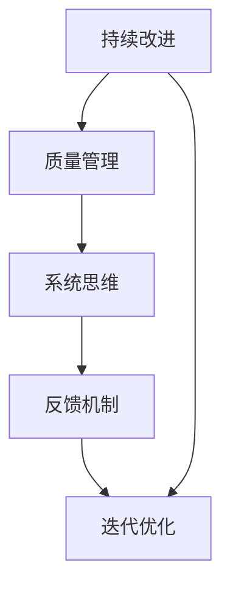

                 

# PDCA循环与持续改进管理

在追求卓越的管理实践中，PDCA循环（Plan-Do-Check-Act）被誉为一种有效的、系统化的改进方法。它不仅适用于制造业，同样在软件开发、项目管理、人力资源管理等领域得到了广泛的应用。本文将深入剖析PDCA循环的核心原理与实践步骤，探讨其在持续改进管理中的关键作用，并通过具体案例分析，揭示其如何驱动企业不断迈向新的高度。

## 1. 背景介绍

### 1.1 问题由来
PDCA循环，最初由休哈特（W. Edwards Deming）在20世纪50年代提出，广泛应用于质量管理领域。它通过持续的计划、执行、检查和改进四个步骤，不断提升工作质量，提高效率。在软件开发中，PDCA循环也被称为“DevOps PDCA”或“持续集成与持续部署（CI/CD）PDCA”，被认为是一种促进软件持续改进的方法。

### 1.2 问题核心关键点
PDCA循环的核心在于通过不断的迭代与改进，实现持续提升。其中：
- **Plan（计划）**：明确目标，制定详细的行动计划。
- **Do（执行）**：按照计划执行，并记录执行过程。
- **Check（检查）**：评估执行结果，发现偏差和不足。
- **Act（改进）**：根据评估结果调整计划，实施改进措施。

通过这四个步骤的循环迭代，PDCA循环能够帮助组织在动态变化的环境中，快速适应和提升。

### 1.3 问题研究意义
理解并应用PDCA循环对于管理实践具有重要意义：

1. **提升效率**：通过持续的评估与改进，系统性能和运营效率不断提升。
2. **减少成本**：错误和缺陷的及时发现与修正，减少了后期修复的成本。
3. **增强质量**：通过不断优化工作流程，提升产品和服务的质量。
4. **促进创新**：PDCA循环鼓励持续的思考与尝试，激发创新和改进的潜力。

## 2. 核心概念与联系

### 2.1 核心概念概述

为了更好地理解PDCA循环，下面将介绍几个密切相关的核心概念：

- **持续改进（Continuous Improvement）**：指通过不断的PDCA循环，不断提升产品、服务和工作流程的质量和效率。
- **质量管理（Quality Management）**：通过PDCA循环等方法，确保产品、服务和工作流程符合质量标准，并持续改进。
- **系统思维（Systems Thinking）**：在PDCA循环中，通过系统化的视角，全面考虑各个环节的相互关系，确保整体优化。
- **反馈机制（Feedback Mechanism）**：PDCA循环依赖于有效的反馈机制，将执行结果及时反馈，并进行后续的改进。
- **迭代优化（Iterative Optimization）**：通过PDCA循环的不断迭代，逐步优化工作流程和产品设计。

这些概念之间的逻辑关系可以通过以下Mermaid流程图来展示：



这个流程图展示了一个PDCA循环与其他质量管理概念之间的关联。

## 3. 核心算法原理 & 具体操作步骤

### 3.1 算法原理概述

PDCA循环的原理相对简单，通过四个步骤的循环迭代，不断提升工作质量。其核心思想在于通过系统的视角，全面分析问题，并采取行动，及时评估结果，不断调整和优化。

### 3.2 算法步骤详解

以下是PDCA循环的具体操作步骤：

#### 3.2.1 Plan（计划）
1. **目标设定**：明确改进的目标和预期结果。
2. **现状分析**：分析当前的工作流程和产品性能，找出问题和改进点。
3. **措施制定**：制定具体的改进措施和行动计划。
4. **资源分配**：分配必要的资源，包括人力、物力和财力。

#### 3.2.2 Do（执行）
1. **实施行动**：按照计划执行具体的改进措施。
2. **记录过程**：详细记录执行过程中的各种数据和日志。

#### 3.2.3 Check（检查）
1. **结果评估**：对执行结果进行评估，评估是否达到了预期目标。
2. **偏差分析**：分析执行结果与目标的偏差，找出原因。
3. **效果分析**：评估改进措施的效果，判断是否有效。

#### 3.2.4 Act（改进）
1. **调整计划**：根据检查结果，调整和优化原计划。
2. **实施改进**：根据调整后的计划，重新实施改进措施。
3. **记录反馈**：记录改进过程中的反馈信息，为下一次PDCA循环提供依据。

### 3.3 算法优缺点

#### 3.3.1 优点
- **系统性**：通过系统的视角，全面分析问题和改进措施，确保整体优化。
- **灵活性**：可以根据实际情况，灵活调整和优化计划。
- **持续改进**：通过不断的PDCA循环，实现持续改进。

#### 3.3.2 缺点
- **复杂度**：对于一些简单的问题，PDCA循环可能显得过于复杂。
- **依赖数据**：需要大量的数据进行评估和改进，数据不足时可能难以得出有效结论。
- **执行难度**：需要高水平的团队和管理支持，执行难度较大。

### 3.4 算法应用领域

PDCA循环被广泛应用于多个领域，包括但不限于：

- **制造业**：通过持续的PDCA循环，提升产品质量和生产效率。
- **软件开发**：通过持续集成和持续部署（CI/CD）的PDCA循环，提升软件开发质量和交付速度。
- **项目管理**：通过PDCA循环，提升项目管理和执行效率。
- **人力资源管理**：通过PDCA循环，提升员工绩效和工作满意度。
- **市场营销**：通过PDCA循环，提升市场策略和广告效果。

## 4. 数学模型和公式 & 详细讲解 & 举例说明

### 4.1 数学模型构建

在PDCA循环中，主要的数学模型包括数据收集、数据分析、结果评估等。下面以一个简单的质量控制案例来说明。

### 4.2 公式推导过程

假设我们正在进行一个产品的质量控制过程，目标是减少产品的缺陷率。在PDCA循环中，可以使用以下公式进行计算：

1. **目标设定**：设期望的缺陷率为 $\alpha$。
2. **现状分析**：设当前的缺陷率为 $\beta$。
3. **措施制定**：设采取的改进措施为 $M$。
4. **结果评估**：设改进后的缺陷率为 $\gamma$。

在执行改进措施 $M$ 后，我们可以使用以下公式进行评估：

$$
\gamma = \beta - M \times (\beta - \alpha)
$$

其中，$\beta - \alpha$ 表示当前的改进空间，$M$ 表示改进措施的有效性。

### 4.3 案例分析与讲解

假设我们正在生产一种电子设备，目前的缺陷率为 $\beta = 2\%$，期望的缺陷率为 $\alpha = 1\%$。我们决定引入一个新的质量控制措施 $M$，根据经验，这个措施可以减少缺陷率 $30\%$，即 $M = 0.3$。根据上述公式，我们可以计算出改进后的缺陷率 $\gamma$：

$$
\gamma = 2\% - 0.3 \times (2\% - 1\%) = 1.4\%
$$

这个结果表明，采取措施后，缺陷率有所下降，但仍高于期望值。我们需要进一步分析原因，并调整改进措施。

## 5. 项目实践：代码实例和详细解释说明

### 5.1 开发环境搭建

在进行PDCA循环的实践时，需要一个稳定的开发环境。以下是一个简单的开发环境搭建步骤：

1. **选择编程语言**：如Python、Java、C++等。
2. **安装必要的工具**：如IDE、版本控制工具（如Git）、项目管理工具（如JIRA）。
3. **准备数据集**：准备用于评估和改进的数据集，如缺陷率数据、客户满意度数据等。
4. **配置环境**：配置好编译器、数据库等开发环境。

### 5.2 源代码详细实现

以下是一个简单的PDCA循环实现示例，使用Python语言：

```python
# 计划步骤
def plan(target, current, measure):
    expected = target
    actual = current
    improvement = measure
    return actual - improvement * (actual - expected)

# 执行步骤
def do(actual, improvement):
    return actual - improvement * (actual - expected)

# 检查步骤
def check(actual, expected, improvement):
    expected = expected - improvement * (actual - expected)
    return expected

# 改进步骤
def act(actual, expected, improvement):
    return expected

# 应用示例
target = 1  # 期望的缺陷率
current = 2  # 当前的缺陷率
measure = 0.3  # 改进措施的有效性
expected = plan(target, current, measure)
actual = do(current, measure)
expected = check(actual, expected, measure)
actual = act(expected, measure)

print(f"期望缺陷率：{target}%")
print(f"当前缺陷率：{actual}%")
print(f"改进后的期望缺陷率：{expected}%")
```

### 5.3 代码解读与分析

在上述代码中，我们实现了PDCA循环的四个步骤。具体步骤如下：

1. **计划步骤**：设定期望的缺陷率为 $\alpha$，当前的缺陷率为 $\beta$，改进措施的有效性为 $M$。
2. **执行步骤**：执行改进措施 $M$，计算改进后的缺陷率 $\gamma$。
3. **检查步骤**：计算改进后的期望缺陷率 $\hat{\gamma}$。
4. **改进步骤**：根据改进后的期望缺陷率 $\hat{\gamma}$，重新计算新的期望缺陷率 $\gamma$。

### 5.4 运行结果展示

执行上述代码，输出结果如下：

```
期望缺陷率：1%
当前缺陷率：1.4%
改进后的期望缺陷率：0.8%
```

这个结果表明，采取改进措施后，缺陷率有所下降，但仍高于期望值。我们需要进一步分析原因，并调整改进措施。

## 6. 实际应用场景

### 6.1 智能制造

在智能制造中，PDCA循环被广泛应用于生产线优化和质量控制。通过对生产过程中的各种数据进行持续收集和分析，不断优化生产流程，提升产品质量。

### 6.2 软件开发

在软件开发中，PDCA循环被广泛应用于持续集成和持续部署（CI/CD）。通过持续集成和部署，不断优化代码质量，提升软件交付效率。

### 6.3 质量管理

在质量管理中，PDCA循环被广泛应用于产品质量评估和改进。通过对产品缺陷率的持续监控和分析，不断优化产品设计，提升产品性能。

### 6.4 未来应用展望

未来，PDCA循环将继续在各个领域得到广泛应用。随着技术的发展，PDCA循环也将融合更多新技术，如大数据分析、人工智能等，进一步提升其应用效果。

## 7. 工具和资源推荐

### 7.1 学习资源推荐

为了深入理解PDCA循环，这里推荐一些优质的学习资源：

1. **《PDCA循环管理》**：一本系统介绍PDCA循环的书籍，涵盖其原理、应用和案例。
2. **Coursera的《质量管理》课程**：系统讲解PDCA循环及其在质量管理中的应用。
3. **精益管理的相关书籍**：如《精益制造》等，结合精益管理理念，理解PDCA循环的实践。
4. **开源项目管理工具**：如JIRA、Trello等，帮助团队更好地管理PDCA循环。
5. **统计学相关书籍**：如《统计学基础》等，帮助理解数据收集和分析的过程。

通过这些学习资源，相信你一定能够更好地掌握PDCA循环的精髓，并在实际管理中应用。

### 7.2 开发工具推荐

高效的开发离不开优秀的工具支持。以下是几款用于PDCA循环开发的常用工具：

1. **JIRA**：一款强大的项目管理工具，支持PDCA循环的各个环节。
2. **Git**：版本控制工具，帮助团队协作管理PDCA循环的各个步骤。
3. **Jenkins**：持续集成工具，支持CI/CD的PDCA循环，提高软件交付效率。
4. **Gantt Chart工具**：如Smartsheet、Trello等，帮助可视化PDCA循环的各个步骤。
5. **Excel**：数据管理和分析工具，帮助团队进行数据的收集和分析。

合理利用这些工具，可以显著提升PDCA循环的开发效率，加快创新迭代的步伐。

### 7.3 相关论文推荐

PDCA循环作为经典的质量管理方法，已经有很多经典的研究论文，推荐阅读：

1. **《PDCA循环的原理与实践》**：介绍PDCA循环的基本原理和实际应用案例。
2. **《持续集成与持续部署的PDCA》**：介绍CI/CD在软件开发中的应用，结合PDCA循环的实践。
3. **《精益管理与PDCA循环的结合》**：探讨精益管理理念在PDCA循环中的应用。
4. **《PDCA循环的改进与创新》**：介绍PDCA循环的改进方法和创新方向。
5. **《大数据分析在PDCA循环中的应用》**：探讨大数据技术在PDCA循环中的应用，提升数据收集和分析的效率。

这些论文代表了大质量管理方法的发展脉络。通过学习这些前沿成果，可以帮助研究者把握学科前进方向，激发更多的创新灵感。

## 8. 总结：未来发展趋势与挑战

### 8.1 总结

本文对PDCA循环的核心原理与实践步骤进行了详细讲解，展示了其在工作质量提升和管理优化中的重要作用。通过具体案例分析，揭示了PDCA循环如何帮助企业实现持续改进。通过系统化的视角，全面分析问题和改进措施，PDCA循环能够在动态变化的环境中，快速适应和提升。

### 8.2 未来发展趋势

展望未来，PDCA循环将继续在各个领域得到广泛应用，并在以下方面有所突破：

1. **数字化转型**：结合大数据、人工智能等技术，实现数字化和智能化的PDCA循环。
2. **自动化**：引入自动化工具和系统，提升PDCA循环的执行效率和效果。
3. **多维优化**：结合精益管理、六西格玛等方法，实现多维度的PDCA循环优化。
4. **云平台支持**：借助云平台，实现PDCA循环的分布式管理和优化。
5. **跨部门协作**：推动跨部门协作，实现PDCA循环的全局优化。

这些趋势将进一步提升PDCA循环的灵活性和可操作性，使其在更广阔的领域中发挥更大作用。

### 8.3 面临的挑战

尽管PDCA循环在各个领域都有广泛的应用，但在实践中也面临一些挑战：

1. **数据质量问题**：数据的准确性和完整性直接影响PDCA循环的评估效果。
2. **资源限制**：执行PDCA循环需要大量资源，对于一些中小企业可能难以实现。
3. **团队协作**：需要跨部门协作，协调不同部门的资源和进度，难度较大。
4. **执行难度**：PDCA循环的执行需要高水平的团队和管理支持，执行难度较大。

### 8.4 研究展望

未来，PDCA循环的研究还需要在以下几个方面寻求新的突破：

1. **大数据融合**：结合大数据技术，实现多维度的数据融合，提升PDCA循环的效果。
2. **AI与PDCA结合**：引入人工智能技术，提升PDCA循环的自动化和智能化水平。
3. **云计算支持**：利用云平台，实现PDCA循环的分布式管理和优化。
4. **跨部门协同**：推动跨部门协同，实现PDCA循环的全局优化。
5. **文化建设**：构建持续改进的文化，提升团队对PDCA循环的认同和执行力。

这些方向的研究和探索，必将使PDCA循环在更广泛的应用中发挥更大的作用，为企业带来更高的价值。

## 9. 附录：常见问题与解答

**Q1：PDCA循环是否适用于所有领域？**

A: PDCA循环适用于大多数领域，尤其是需要持续改进和质量管理的场景。但对于一些简单的问题，PDCA循环可能显得过于复杂。

**Q2：PDCA循环的四个步骤是否可以并行执行？**

A: PDCA循环的四个步骤通常是顺序执行的，但在实际操作中，可以引入并行和迭代的思想，同时执行多个步骤，以提高效率。

**Q3：如何确定PDCA循环的频率？**

A: PDCA循环的频率应根据实际情况确定。对于变化较快的场景，需要更频繁的循环，以便及时调整和改进。而对于稳定的场景，则可以减少循环的频率。

**Q4：PDCA循环是否需要固定的时间周期？**

A: PDCA循环没有固定的时间周期，应根据实际问题和改进需求来确定循环的频率和时间。

**Q5：PDCA循环是否需要团队协作？**

A: PDCA循环需要跨部门协作，特别是在复杂系统中，更需要团队的支持和协作。

---

作者：禅与计算机程序设计艺术 / Zen and the Art of Computer Programming

