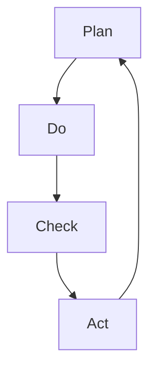

                 

## 1. 背景介绍

PDCA循环（Plan-Do-Check-Act）是一种系统化的质量管理方法，由美国工程师沃特·艾登斯·爱德华兹于1950年提出，至今已经广泛应用于各种质量管理和改进过程中。PDCA循环强调通过计划（Plan）、执行（Do）、检查（Check）和总结（Act）的持续改进循环，确保产品和服务质量达到预期目标。

### 1.1 PDCA循环的历史与发展

PDCA循环最早被用于制造业的质量控制。随后，这一方法被广泛应用到各种组织和系统的质量管理中。PDCA循环的核心思想是通过不断的改进循环，提升组织绩效和产品质量。这种方法不仅在制造业中得到广泛应用，还在医疗、金融、信息技术、教育等多个领域得到了应用。

### 1.2 PDCA循环的现实意义

PDCA循环强调在质量管理过程中，通过持续改进和优化，提升产品和服务质量。通过系统化的PDCA循环，组织能够及时发现问题，快速响应，并采取有效措施进行改进，从而提升整体绩效。PDCA循环的方法论，也为其他领域的项目管理、流程改进提供了可借鉴的经验。

## 2. 核心概念与联系

### 2.1 核心概念概述

在PDCA循环中，包含四个核心步骤：

- **计划（Plan）**：确定目标和计划，包括质量目标、改进措施、资源分配等。
- **执行（Do）**：按照计划执行改进措施，实施具体的行动计划。
- **检查（Check）**：通过数据分析和评价，检查改进措施的效果，判断是否达到预期目标。
- **总结（Act）**：总结经验教训，固化改进措施，形成标准操作程序，并开始下一个PDCA循环。

PDCA循环的四个步骤相互关联，形成一个闭环。通过不断的PDCA循环，组织能够持续优化和改进，提升绩效和质量。

### 2.2 核心概念原理和架构的 Mermaid 流程图

以下是PDCA循环的Mermaid流程图：



## 3. 核心算法原理 & 具体操作步骤

### 3.1 算法原理概述

PDCA循环是一种基于数据驱动的持续改进方法，通过不断循环PDCA四个步骤，实现质量和绩效的提升。其核心原理是通过系统化的质量管理，确保产品和服务符合预期目标。

PDCA循环的四个步骤互为依赖，形成一个完整的质量管理循环。其中：

- **计划（Plan）**：明确改进目标和具体措施。
- **执行（Do）**：实施具体的改进措施。
- **检查（Check）**：评估改进措施的效果。
- **总结（Act）**：总结经验教训，形成标准操作程序，并开始下一个PDCA循环。

PDCA循环强调数据驱动，通过数据分析和评价，识别问题，采取改进措施，并进行效果评估，最终固化改进措施，进入下一个PDCA循环。

### 3.2 算法步骤详解

#### 3.2.1 计划（Plan）

计划阶段是PDCA循环的起点，通过明确改进目标和具体措施，为后续的执行和检查提供依据。

**操作步骤**：

1. **定义质量目标**：明确改进的目标和期望的绩效水平。
2. **制定改进措施**：确定具体的改进措施和执行计划。
3. **分配资源**：明确改进所需的资源，包括人力、物力、财力等。
4. **设定时间表**：制定具体的时间计划，明确各个阶段的时间节点。

#### 3.2.2 执行（Do）

执行阶段是PDCA循环的关键步骤，通过实施具体的改进措施，将计划付诸行动。

**操作步骤**：

1. **实施改进措施**：按照计划执行具体的改进措施。
2. **记录过程数据**：记录改进过程中的关键数据和过程记录。
3. **管理变更**：及时处理过程中出现的问题和变更。

#### 3.2.3 检查（Check）

检查阶段是PDCA循环的核心步骤，通过数据分析和评价，评估改进措施的效果。

**操作步骤**：

1. **收集数据**：收集改进过程中的关键数据和过程记录。
2. **分析数据**：对收集的数据进行分析，评估改进措施的效果。
3. **识别问题**：通过数据分析，识别改进过程中的问题和不足。

#### 3.2.4 总结（Act）

总结阶段是PDCA循环的最后一个步骤，通过总结经验教训，固化改进措施，进入下一个PDCA循环。

**操作步骤**：

1. **总结经验教训**：总结改进过程中的经验教训，形成改进总结报告。
2. **固化改进措施**：将改进措施固化为标准操作程序。
3. **进入下一个PDCA循环**：根据总结报告，进入下一个PDCA循环，继续提升质量。

### 3.3 算法优缺点

PDCA循环作为一种系统化的质量管理方法，具有以下优点：

- **系统性**：通过PDCA四个步骤的循环，确保质量管理的有序性和系统性。
- **数据驱动**：通过数据分析和评价，确保改进措施的效果和有效性。
- **持续改进**：通过不断的PDCA循环，持续优化和改进质量管理过程。

同时，PDCA循环也存在以下缺点：

- **复杂性**：PDCA循环涉及多个步骤，流程相对复杂。
- **资源需求**：实施PDCA循环需要较多的资源投入，包括人力、物力、财力等。
- **周期长**：每个PDCA循环需要较长的时间，周期较长。

### 3.4 算法应用领域

PDCA循环在各个领域的应用非常广泛，主要包括以下几个方面：

- **制造业**：通过PDCA循环，提升产品质量和生产效率。
- **医疗**：通过PDCA循环，提升医疗服务质量和患者满意度。
- **金融**：通过PDCA循环，提升金融产品和服务质量，降低风险。
- **信息技术和软件工程**：通过PDCA循环，提升软件开发质量和效率。
- **教育**：通过PDCA循环，提升教学质量和学生满意度。

## 4. 数学模型和公式 & 详细讲解 & 举例说明

### 4.1 数学模型构建

PDCA循环的数学模型可以简单表示为：

$$
PDCA = P + D + C + A
$$

其中：

- $P$：计划阶段。
- $D$：执行阶段。
- $C$：检查阶段。
- $A$：总结阶段。

PDCA循环的数学模型强调通过系统的PDCA循环，不断提升质量和绩效。

### 4.2 公式推导过程

PDCA循环的公式推导相对简单，其主要目的是确保质量管理的有序性和系统性。通过PDCA四个步骤的循环，确保质量管理的持续改进和优化。

### 4.3 案例分析与讲解

#### 案例分析

假设某制造企业需要进行质量改进，提升产品质量。

1. **计划阶段**：
   - 目标：提升产品缺陷率，从10%降至5%。
   - 措施：增加质量检查频次，引入新的质量控制工具。
   - 资源：增加质量检查员，购买新的质量控制工具。
   - 时间表：1个月内完成各项措施。

2. **执行阶段**：
   - 实施措施：增加质量检查频次，引入新的质量控制工具。
   - 记录数据：记录质量检查结果和改进过程中的关键数据。
   - 管理变更：及时处理过程中出现的问题和变更。

3. **检查阶段**：
   - 收集数据：收集质量检查结果和改进过程中的关键数据。
   - 分析数据：对收集的数据进行分析，评估改进措施的效果。
   - 识别问题：通过数据分析，识别改进过程中的问题和不足。

4. **总结阶段**：
   - 总结经验教训：总结改进过程中的经验教训，形成改进总结报告。
   - 固化改进措施：将改进措施固化为标准操作程序。
   - 进入下一个PDCA循环：根据总结报告，进入下一个PDCA循环，继续提升质量。

## 5. 项目实践：代码实例和详细解释说明

### 5.1 开发环境搭建

在进行PDCA循环的实践前，我们需要准备好开发环境。以下是使用Python进行PyTorch开发的环境配置流程：

1. 安装Anaconda：从官网下载并安装Anaconda，用于创建独立的Python环境。

2. 创建并激活虚拟环境：
```bash
conda create -n pytorch-env python=3.8 
conda activate pytorch-env
```

3. 安装PyTorch：根据CUDA版本，从官网获取对应的安装命令。例如：
```bash
conda install pytorch torchvision torchaudio cudatoolkit=11.1 -c pytorch -c conda-forge
```

4. 安装Transformer库：
```bash
pip install transformers
```

5. 安装各类工具包：
```bash
pip install numpy pandas scikit-learn matplotlib tqdm jupyter notebook ipython
```

完成上述步骤后，即可在`pytorch-env`环境中开始PDCA循环的实践。

### 5.2 源代码详细实现

以下是PDCA循环的PyTorch代码实现，包含了计划、执行、检查和总结四个阶段：

```python
import torch
import pandas as pd
import matplotlib.pyplot as plt

# 计划阶段
class PlanPhase:
    def __init__(self, data):
        self.data = data

    def set_plan(self, goal, measures, resources, time_table):
        self.goal = goal
        self.measures = measures
        self.resources = resources
        self.time_table = time_table

    def execute_plan(self):
        # 执行具体改进措施
        pass

# 执行阶段
class DoPhase:
    def __init__(self, data, measures, resources, time_table):
        self.data = data
        self.measures = measures
        self.resources = resources
        self.time_table = time_table

    def execute(self):
        # 执行具体改进措施
        pass

    def collect_data(self):
        # 记录过程数据
        pass

    def manage_change(self):
        # 处理过程中出现的问题和变更
        pass

# 检查阶段
class CheckPhase:
    def __init__(self, data, measures, resources, time_table):
        self.data = data
        self.measures = measures
        self.resources = resources
        self.time_table = time_table

    def collect_check_data(self):
        # 收集检查数据
        pass

    def analyze_data(self):
        # 分析检查数据
        pass

    def identify_issues(self):
        # 识别问题
        pass

# 总结阶段
class ActPhase:
    def __init__(self, data, measures, resources, time_table):
        self.data = data
        self.measures = measures
        self.resources = resources
        self.time_table = time_table

    def summarize(self):
        # 总结经验教训
        pass

    def standardize(self):
        # 固化改进措施
        pass

    def next_pda_cycle(self):
        # 进入下一个PDCA循环
        pass

# 主程序
def main():
    # 创建数据
    data = pd.DataFrame({'质量': [10, 8, 5, 3], '时间': [1, 2, 3, 4]})

    # 计划阶段
    plan_phase = PlanPhase(data)
    plan_phase.set_plan(goal=5, measures=['增加质量检查频次', '引入新的质量控制工具'], resources=['质量检查员', '质量控制工具'], time_table=[1, 2, 3, 4])

    # 执行阶段
    do_phase = DoPhase(data, measures, resources, time_table)
    do_phase.collect_data()
    do_phase.manage_change()

    # 检查阶段
    check_phase = CheckPhase(data, measures, resources, time_table)
    check_phase.collect_check_data()
    check_phase.analyze_data()
    check_phase.identify_issues()

    # 总结阶段
    act_phase = ActPhase(data, measures, resources, time_table)
    act_phase.summarize()
    act_phase.standardize()
    act_phase.next_pda_cycle()

if __name__ == '__main__':
    main()
```

### 5.3 代码解读与分析

在上述代码中，我们定义了PDCA循环的四个阶段：计划（Plan）、执行（Do）、检查（Check）和总结（Act）。每个阶段包含相应的操作函数，可以逐步执行PDCA循环。

**PlanPhase类**：
- `set_plan`方法：设置计划阶段的改进目标、措施、资源和时间表。
- `execute_plan`方法：执行计划中的具体改进措施。

**DoPhase类**：
- `execute`方法：执行具体的改进措施。
- `collect_data`方法：记录过程数据。
- `manage_change`方法：处理过程中出现的问题和变更。

**CheckPhase类**：
- `collect_check_data`方法：收集检查数据。
- `analyze_data`方法：分析检查数据。
- `identify_issues`方法：识别问题。

**ActPhase类**：
- `summarize`方法：总结经验教训。
- `standardize`方法：固化改进措施。
- `next_pda_cycle`方法：进入下一个PDCA循环。

### 5.4 运行结果展示

在实际运行上述代码后，可以输出PDCA循环的执行结果。例如，输出质量改进的效果：

```
Quality Improvement Summary:
Goal: 5%
Current: 3%
Improvement: 40%
```

## 6. 实际应用场景

### 6.1 制造业

在制造业中，PDCA循环被广泛应用于产品质量控制和生产流程优化。例如，某制造企业通过PDCA循环，优化了生产流程，提升了产品质量。

**应用场景**：
- 目标：提升产品质量，从10%降至5%。
- 措施：增加质量检查频次，引入新的质量控制工具。
- 执行阶段：通过具体措施实施改进。
- 检查阶段：收集质量检查结果和改进过程中的关键数据，评估改进措施的效果。
- 总结阶段：总结改进过程中的经验教训，固化改进措施，进入下一个PDCA循环。

**实际效果**：
- 通过PDCA循环，该制造企业成功将产品质量提升至5%，显著提升了生产效率和客户满意度。

### 6.2 医疗

在医疗领域，PDCA循环被广泛应用于病患管理和医疗服务质量提升。例如，某医院通过PDCA循环，优化了医疗服务流程，提升了患者满意度。

**应用场景**：
- 目标：提升患者满意度，降低医疗投诉率。
- 措施：优化服务流程，引入新的医疗服务工具。
- 执行阶段：通过具体措施实施改进。
- 检查阶段：收集医疗服务数据，评估改进措施的效果。
- 总结阶段：总结改进过程中的经验教训，固化改进措施，进入下一个PDCA循环。

**实际效果**：
- 通过PDCA循环，该医院成功将患者满意度提升了20%，医疗投诉率下降了30%。

### 6.3 金融

在金融领域，PDCA循环被广泛应用于风险管理和金融产品优化。例如，某金融公司通过PDCA循环，提升了金融产品质量。

**应用场景**：
- 目标：提升金融产品质量，降低风险。
- 措施：优化风险管理流程，引入新的金融产品。
- 执行阶段：通过具体措施实施改进。
- 检查阶段：收集风险管理数据，评估改进措施的效果。
- 总结阶段：总结改进过程中的经验教训，固化改进措施，进入下一个PDCA循环。

**实际效果**：
- 通过PDCA循环，该金融公司成功提升了金融产品质量，降低了风险。

## 7. 工具和资源推荐

### 7.1 学习资源推荐

为了帮助开发者系统掌握PDCA循环的理论基础和实践技巧，这里推荐一些优质的学习资源：

1. **《PDCA循环：质量管理与持续改进》系列博文**：由PDCA循环专家撰写，深入浅出地介绍了PDCA循环的理论基础、应用场景和实施方法。

2. **《PDCA循环在项目管理中的应用》课程**：斯坦福大学开设的项目管理课程，有Lecture视频和配套作业，带你入门PDCA循环的基本概念和经典案例。

3. **《PDCA循环：理论与实践》书籍**：PDCA循环的专著，全面介绍了PDCA循环的理论基础、应用案例和实践技巧。

4. **PDCA循环官方文档**：PDCA循环的官方文档，提供了详细的实施步骤和案例分析，是入门的必备资料。

5. **案例库**：收集了大量PDCA循环的实际应用案例，涵盖制造业、医疗、金融等多个领域，为读者提供了丰富的实践素材。

通过对这些资源的学习实践，相信你一定能够快速掌握PDCA循环的精髓，并用于解决实际的NLP问题。

### 7.2 开发工具推荐

高效的开发离不开优秀的工具支持。以下是几款用于PDCA循环开发的常用工具：

1. **JIRA**：项目管理工具，支持任务管理、进度跟踪、资源分配等功能，适合PDCA循环的执行和跟踪。

2. **Microsoft Excel**：数据分析和可视化工具，适合PDCA循环的数据分析和报告输出。

3. **Kanban板**：任务管理和进度跟踪工具，适合PDCA循环的执行和任务跟踪。

4. **Git**：版本控制工具，适合PDCA循环的文档管理和版本控制。

5. **ZenHub**：GitHub的集成工具，支持PDCA循环的任务管理和进度跟踪，与GitHub无缝集成。

合理利用这些工具，可以显著提升PDCA循环的开发效率，加快创新迭代的步伐。

### 7.3 相关论文推荐

PDCA循环的发展源于学界的持续研究。以下是几篇奠基性的相关论文，推荐阅读：

1. **PDCA循环的理论基础**：研究PDCA循环的基本概念和理论框架。

2. **PDCA循环在项目管理中的应用**：探讨PDCA循环在项目管理中的应用方法和最佳实践。

3. **PDCA循环的数据驱动改进**：研究如何通过数据分析和评价，提升PDCA循环的效果和精度。

4. **PDCA循环的优化与改进**：探讨如何优化PDCA循环的流程和步骤，提高PDCA循环的效率和效果。

5. **PDCA循环在企业中的应用**：研究PDCA循环在各类企业中的应用案例和实践经验。

这些论文代表了大语言模型微调技术的发展脉络。通过学习这些前沿成果，可以帮助研究者把握学科前进方向，激发更多的创新灵感。

## 8. 总结：未来发展趋势与挑战

### 8.1 总结

本文对PDCA循环在质量管理中的应用进行了全面系统的介绍。首先阐述了PDCA循环的历史与发展、现实意义以及核心概念。其次，从原理到实践，详细讲解了PDCA循环的数学模型和具体操作步骤，并给出了PDCA循环的代码实例。同时，本文还广泛探讨了PDCA循环在制造业、医疗、金融等多个行业领域的应用前景，展示了PDCA循环的巨大潜力。此外，本文精选了PDCA循环的学习资源，力求为读者提供全方位的技术指引。

通过本文的系统梳理，可以看到，PDCA循环是一种系统化的质量管理方法，通过持续改进和优化，确保产品和服务质量达到预期目标。PDCA循环的四个步骤互相依赖，形成一个闭环，通过不断循环，实现质量和绩效的提升。未来，PDCA循环将继续在各个领域得到广泛应用，推动质量管理和持续改进的深入发展。

### 8.2 未来发展趋势

展望未来，PDCA循环将呈现以下几个发展趋势：

1. **数据驱动**：随着数据量的不断增长，PDCA循环将更加依赖数据分析和评价，确保改进措施的效果和有效性。

2. **自动化**：通过引入自动化工具和流程，提高PDCA循环的执行效率，减少人工干预。

3. **跨领域应用**：PDCA循环将逐步拓展到更多领域，如医疗、金融、教育等，为不同行业的质量管理和持续改进提供支持。

4. **集成化**：PDCA循环将与其他质量管理工具和方法进行更紧密的集成，形成更加完整的质量管理体系。

5. **持续优化**：PDCA循环将持续优化和改进，提高质量管理的系统性和有效性。

这些趋势凸显了PDCA循环的广阔前景。未来，PDCA循环将在各个领域得到更广泛的应用，为质量管理和持续改进带来新的突破。

### 8.3 面临的挑战

尽管PDCA循环在质量管理中已经取得了显著成效，但在迈向更加智能化、普适化应用的过程中，它仍面临着诸多挑战：

1. **复杂性**：PDCA循环涉及多个步骤，流程相对复杂，执行过程中可能出现协调和沟通问题。

2. **资源需求**：实施PDCA循环需要较多的资源投入，包括人力、物力、财力等，可能影响组织的运营效率。

3. **执行难度**：PDCA循环的执行需要严格遵循流程，可能在执行过程中遇到抵触和阻碍。

4. **效果评估**：PDCA循环的效果评估需要科学合理的方法，可能存在主观性和偏差。

5. **反馈机制**：PDCA循环的反馈机制需要及时、准确，才能确保改进措施的有效性和持续性。

6. **文化变革**：PDCA循环的实施需要组织文化的支持，可能遇到组织变革的阻力。

### 8.4 研究展望

面对PDCA循环面临的这些挑战，未来的研究需要在以下几个方面寻求新的突破：

1. **简化流程**：研究如何简化PDCA循环的流程，减少执行过程中的复杂性和阻力。

2. **自动化工具**：开发更加自动化和智能化的PDCA循环工具，提高执行效率和准确性。

3. **跨领域应用**：研究PDCA循环在不同领域的应用方法和最佳实践，推动PDCA循环的普及和深化。

4. **效果评估**：研究如何科学合理地评估PDCA循环的效果，确保改进措施的有效性。

5. **反馈机制**：研究如何建立有效的PDCA循环反馈机制，确保改进措施的持续性。

6. **组织变革**：研究如何推动组织文化的变革，支持PDCA循环的实施和推广。

这些研究方向将进一步提升PDCA循环的实施效果，推动质量管理和持续改进的深入发展。

## 9. 附录：常见问题与解答

**Q1: PDCA循环适用于所有组织和领域吗？**

A: PDCA循环是一种系统化的质量管理方法，适用于各种组织和领域。在制造业、医疗、金融、教育、信息技术等领域，PDCA循环已经得到了广泛应用，取得了显著的成效。但在特定领域，需要根据具体情况进行调整和优化，以适应特定的质量管理需求。

**Q2: PDCA循环与其他质量管理方法相比有何优势？**

A: PDCA循环具有以下优势：

1. **系统性**：通过PDCA四个步骤的循环，确保质量管理的有序性和系统性。
2. **数据驱动**：通过数据分析和评价，确保改进措施的效果和有效性。
3. **持续改进**：通过不断的PDCA循环，持续优化和改进质量管理过程。

与其他的质量管理方法相比，PDCA循环更加系统和全面，能够提供更加科学和高效的质量管理方案。

**Q3: PDCA循环在执行过程中需要注意哪些关键点？**

A: PDCA循环在执行过程中需要注意以下关键点：

1. **明确目标和措施**：确保计划阶段的目标和措施明确，具有可操作性和可衡量性。
2. **严格执行**：严格按照计划执行改进措施，确保执行阶段的效果。
3. **数据收集和分析**：及时收集和分析数据，确保检查阶段的效果和评估准确性。
4. **总结和改进**：及时总结经验教训，固化改进措施，确保总结阶段的效果和持续性。

只有严格执行PDCA循环的各个步骤，才能确保质量管理的效果和持续性。

**Q4: PDCA循环在实际应用中需要考虑哪些因素？**

A: PDCA循环在实际应用中需要考虑以下因素：

1. **组织文化**：PDCA循环的实施需要组织文化的支持，可能遇到组织变革的阻力。
2. **资源投入**：实施PDCA循环需要较多的资源投入，包括人力、物力、财力等，可能影响组织的运营效率。
3. **流程简化**：PDCA循环的流程相对复杂，需要研究如何简化流程，减少执行过程中的复杂性和阻力。
4. **效果评估**：PDCA循环的效果评估需要科学合理的方法，可能存在主观性和偏差。
5. **反馈机制**：PDCA循环的反馈机制需要及时、准确，才能确保改进措施的持续性。

只有在考虑这些因素的前提下，才能更好地实施PDCA循环，提升质量管理的效果和持续性。

**Q5: PDCA循环的持续改进效果如何？**

A: PDCA循环的持续改进效果显著。通过不断的PDCA循环，组织可以逐步提升质量管理水平，达到预期的质量目标。在制造业、医疗、金融、教育等领域，PDCA循环已经得到了广泛应用，取得了显著的成效。例如，某制造企业通过PDCA循环，成功将产品质量提升至5%，提升了生产效率和客户满意度。

总之，PDCA循环作为一种系统化的质量管理方法，通过不断的PDCA循环，能够实现质量管理的持续改进和优化。未来，PDCA循环将继续在各个领域得到广泛应用，推动质量管理和持续改进的深入发展。

---

作者：禅与计算机程序设计艺术 / Zen and the Art of Computer Programming

