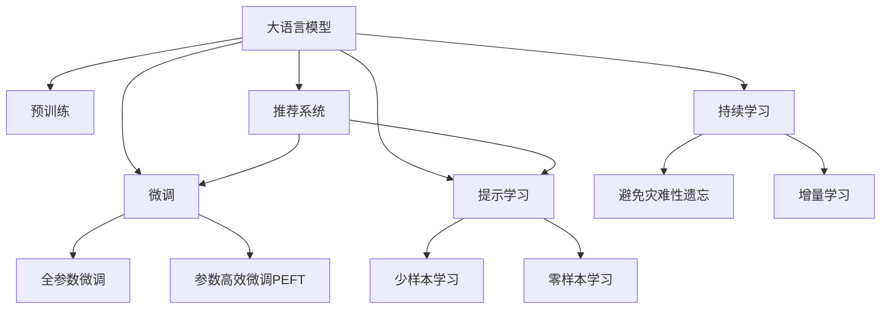

                 

## 1. 背景介绍

推荐系统是当前互联网产业的重要技术之一，广泛应用于电子商务、视频流媒体、社交网络等领域，为用户提供了个性化的内容推荐。然而，传统的推荐系统主要基于用户行为数据进行推荐，往往忽略了用户意图和情境信息，难以应对复杂的推荐场景。

近年来，基于大语言模型的推荐系统逐步受到关注。大语言模型通过预训练获得了丰富的语言知识，具备了较强的语义理解和生成能力。通过对模型的微调，可以使其根据用户的描述，生成个性化的推荐结果，从而提升推荐系统的质量和用户满意度。

## 2. 核心概念与联系

### 2.1 核心概念概述

为更好地理解基于提示学习的大语言模型推荐方法，本节将介绍几个密切相关的核心概念：

- 大语言模型(Large Language Model, LLM)：以自回归(如GPT)或自编码(如BERT)模型为代表的大规模预训练语言模型。通过在大规模无标签文本语料上进行预训练，学习通用的语言表示，具备强大的语言理解和生成能力。

- 预训练(Pre-training)：指在大规模无标签文本语料上，通过自监督学习任务训练通用语言模型的过程。常见的预训练任务包括言语建模、遮挡语言模型等。预训练使得模型学习到语言的通用表示。

- 微调(Fine-tuning)：指在预训练模型的基础上，使用下游任务的少量标注数据，通过有监督学习优化模型在特定任务上的性能。通常只需要调整顶层分类器或解码器，并以较小的学习率更新全部或部分的模型参数。

- 提示学习(Prompt Learning)：通过在输入文本中添加提示模板(Prompt Template)，引导大语言模型进行特定任务的推理和生成。可以在不更新模型参数的情况下，实现零样本或少样本学习。

- 推荐系统(Recommendation System)：通过算法预测用户可能感兴趣的商品、内容等，为用户推荐个性化结果的技术。目标是在大规模数据下高效精准地生成推荐列表。

- 少样本学习(Few-shot Learning)：指在只有少量标注样本的情况下，模型能够快速适应新任务的学习方法。在大语言模型中，通常通过在输入中提供少量示例来实现，无需更新模型参数。

- 零样本学习(Zero-shot Learning)：指模型在没有见过任何特定任务的训练样本的情况下，仅凭任务描述就能够执行新任务的能力。大语言模型通过预训练获得的广泛知识，使其能够理解任务指令并生成相应输出。

- 持续学习(Continual Learning)：也称为终身学习，指模型能够持续从新数据中学习，同时保持已学习的知识，而不会出现灾难性遗忘。这对于保持大语言模型的时效性和适应性至关重要。

这些核心概念之间的逻辑关系可以通过以下Mermaid流程图来展示：



这个流程图展示了大语言模型的核心概念及其之间的关系：

1. 大语言模型通过预训练获得基础能力。
2. 微调是对预训练模型进行任务特定的优化，可以分为全参数微调和参数高效微调（PEFT）。
3. 提示学习是一种不更新模型参数的方法，可以实现少样本学习和零样本学习。
4. 推荐系统是利用微调模型进行个性化推荐的应用场景。
5. 持续学习旨在使模型能够不断学习新知识，同时避免遗忘旧知识。

这些概念共同构成了大语言模型的学习和应用框架，使其能够在各种场景下发挥强大的语言理解和生成能力。通过理解这些核心概念，我们可以更好地把握大语言模型的工作原理和优化方向。

## 3. 核心算法原理 & 具体操作步骤
### 3.1 算法原理概述

基于提示学习的大语言模型推荐方法，本质上是一种利用大语言模型的语言理解和生成能力，进行推荐结果生成和优化的技术。其核心思想是：将预训练的大语言模型视作一个强大的"特征提取器"，通过在输入中添加精心的提示，使得模型能够理解和生成特定的推荐结果，从而达到个性化推荐的目的。

形式化地，假设预训练语言模型为 $M_{\theta}$，其中 $\theta$ 为预训练得到的模型参数。给定推荐任务 $T$ 的输入数据 $I$，预训练模型作为特征提取器，通过与输入 $I$ 交互，生成推荐结果 $R$。推荐系统的优化目标是最小化推荐结果 $R$ 与用户真实偏好 $P$ 之间的差异，即：

$$
\hat{R}=\mathop{\arg\min}_{R} \mathcal{L}(R,P)
$$

其中 $\mathcal{L}$ 为推荐损失函数，用于衡量推荐结果 $R$ 与用户偏好 $P$ 的匹配程度。常见的推荐损失函数包括均方误差损失、交叉熵损失等。

### 3.2 算法步骤详解

基于提示学习的大语言模型推荐方法一般包括以下几个关键步骤：

**Step 1: 准备预训练模型和数据集**
- 选择合适的预训练语言模型 $M_{\theta}$ 作为初始化参数，如 BERT、GPT 等。
- 准备推荐任务 $T$ 的数据集 $D=\{(I_i,P_i)\}_{i=1}^N$，其中 $I_i$ 为输入数据，$P_i$ 为真实偏好。

**Step 2: 设计提示模板**
- 根据推荐任务的特点，设计合适的提示模板 $P$，用于引导模型生成推荐结果。提示模板可以是固定的，也可以是动态生成的。

**Step 3: 添加任务适配层**
- 根据任务类型，在预训练模型顶层设计合适的输出层和损失函数。
- 对于分类推荐任务，通常在顶层添加线性分类器和交叉熵损失函数。
- 对于生成推荐任务，通常使用语言模型的解码器输出概率分布，并以负对数似然为损失函数。

**Step 4: 设置微调超参数**
- 选择合适的优化算法及其参数，如 AdamW、SGD 等，设置学习率、批大小、迭代轮数等。
- 设置正则化技术及强度，包括权重衰减、Dropout、Early Stopping 等。
- 确定冻结预训练参数的策略，如仅微调顶层，或全部参数都参与微调。

**Step 5: 执行梯度训练**
- 将输入数据 $I_i$ 和真实偏好 $P_i$ 分批次输入模型，前向传播计算推荐结果 $R$。
- 反向传播计算参数梯度，根据设定的优化算法和学习率更新模型参数。
- 周期性在验证集上评估模型性能，根据性能指标决定是否触发 Early Stopping。
- 重复上述步骤直到满足预设的迭代轮数或 Early Stopping 条件。

**Step 6: 测试和部署**
- 在测试集上评估微调后模型 $M_{\hat{\theta}}$ 的性能，对比微调前后的推荐精度提升。
- 使用微调后的模型对新用户和商品生成推荐，集成到实际的应用系统中。
- 持续收集用户反馈，更新提示模板和模型参数，以适应数据分布的变化。

以上是基于提示学习的大语言模型推荐方法的一般流程。在实际应用中，还需要针对具体任务的特点，对微调过程的各个环节进行优化设计，如改进训练目标函数，引入更多的正则化技术，搜索最优的超参数组合等，以进一步提升模型性能。

### 3.3 算法优缺点

基于提示学习的大语言模型推荐方法具有以下优点：
1. 简单高效。只需设计合适的提示模板，即可在少样本条件下对预训练模型进行快速适配，生成推荐结果。
2. 通用适用。适用于各种推荐场景，包括电商推荐、新闻推荐、视频推荐等，设计简单的提示模板即可实现推荐。
3. 参数高效。利用提示模板，可以在固定大部分预训练参数的情况下，仍可取得不错的推荐效果。
4. 推荐质量高。提示学习使得模型能够根据用户的个性化描述，生成更加符合用户偏好的推荐结果。

同时，该方法也存在一定的局限性：
1. 提示模板设计难度大。提示模板的设计需要一定的领域知识和语言处理经验，否则模型可能无法理解用户描述，生成不相关或质量低的推荐。
2. 依赖任务描述。推荐任务的成功很大程度上取决于用户描述的质量和数量，低质量的任务描述可能影响模型性能。
3. 鲁棒性不足。对于用户描述中包含噪音、歧义的情况，模型的输出可能不够稳定，需要进行额外的预处理。
4. 可解释性不足。提示学习生成的推荐过程缺乏可解释性，难以对其推荐逻辑进行分析和调试。

尽管存在这些局限性，但就目前而言，基于提示学习的推荐方法仍是大语言模型应用的重要范式。未来相关研究的重点在于如何进一步降低对任务描述的依赖，提高模型的少样本学习和跨领域迁移能力，同时兼顾可解释性和伦理安全性等因素。

### 3.4 算法应用领域

基于大语言模型提示学习的推荐方法，在推荐系统领域已经得到了广泛的应用，覆盖了几乎所有常见场景，例如：

- 电商推荐：推荐商品、服务、广告等。通过用户输入的搜索关键词或商品描述，生成个性化推荐列表。
- 新闻推荐：推荐新闻文章、视频等。根据用户阅读历史或评论，生成个性化的内容列表。
- 视频推荐：推荐电影、电视剧、纪录片等。通过用户观影历史和评分，生成个性化视频列表。
- 音乐推荐：推荐歌曲、专辑等。通过用户听歌历史和评论，生成个性化的音乐列表。
- 社交推荐：推荐好友、动态、群组等。通过用户社交行为和兴趣标签，生成个性化的社交内容。

除了上述这些经典场景外，大语言模型提示学习也被创新性地应用到更多场景中，如个性化搜索、智能导航、智能家居等，为推荐技术带来了全新的突破。随着预训练模型和提示学习的不断进步，相信推荐技术将在更广阔的应用领域大放异彩。

## 4. 数学模型和公式 & 详细讲解  
### 4.1 数学模型构建

本节将使用数学语言对基于提示学习的大语言模型推荐过程进行更加严格的刻画。

记预训练语言模型为 $M_{\theta}$，其中 $\theta$ 为预训练得到的模型参数。假设推荐任务 $T$ 的训练集为 $D=\{(I_i,P_i)\}_{i=1}^N$，其中 $I_i$ 为输入数据，$P_i$ 为真实偏好。

定义模型 $M_{\theta}$ 在输入 $I$ 上的推荐结果为 $R=M_{\theta}(I)$，推荐损失函数为 $\mathcal{L}(R,P)$，用于衡量推荐结果 $R$ 与用户偏好 $P$ 的匹配程度。常见的推荐损失函数包括均方误差损失、交叉熵损失等。

在实践中，我们通常使用基于梯度的优化算法（如SGD、Adam等）来近似求解上述最优化问题。设 $\eta$ 为学习率，$\lambda$ 为正则化系数，则参数的更新公式为：

$$
\theta \leftarrow \theta - \eta \nabla_{\theta}\mathcal{L}(\theta) - \eta\lambda\theta
$$

其中 $\nabla_{\theta}\mathcal{L}(\theta)$ 为损失函数对参数 $\theta$ 的梯度，可通过反向传播算法高效计算。

### 4.2 公式推导过程

以下我们以电商推荐任务为例，推导交叉熵损失函数及其梯度的计算公式。

假设模型 $M_{\theta}$ 在输入 $I$ 上的推荐结果为 $\hat{R}=M_{\theta}(I)$，真实偏好 $P$ 为 $[0,1]$ 之间的概率向量。推荐损失函数定义为：

$$
\mathcal{L}(R,P) = -\sum_{i=1}^N P_i\log R_i
$$

将其代入经验风险公式，得：

$$
\mathcal{L}(\theta) = -\frac{1}{N}\sum_{i=1}^N [P_i\log M_{\theta}(I_i)]
$$

根据链式法则，损失函数对参数 $\theta_k$ 的梯度为：

$$
\frac{\partial \mathcal{L}(\theta)}{\partial \theta_k} = -\frac{1}{N}\sum_{i=1}^N \frac{P_i}{M_{\theta}(I_i)} \frac{\partial M_{\theta}(I_i)}{\partial \theta_k}
$$

其中 $\frac{\partial M_{\theta}(I_i)}{\partial \theta_k}$ 可进一步递归展开，利用自动微分技术完成计算。

在得到损失函数的梯度后，即可带入参数更新公式，完成模型的迭代优化。重复上述过程直至收敛，最终得到适应推荐任务的最优模型参数 $\theta^*$。

## 5. 项目实践：代码实例和详细解释说明
### 5.1 开发环境搭建

在进行提示学习实践前，我们需要准备好开发环境。以下是使用Python进行PyTorch开发的环境配置流程：

1. 安装Anaconda：从官网下载并安装Anaconda，用于创建独立的Python环境。

2. 创建并激活虚拟环境：
```bash
conda create -n pytorch-env python=3.8 
conda activate pytorch-env
```

3. 安装PyTorch：根据CUDA版本，从官网获取对应的安装命令。例如：
```bash
conda install pytorch torchvision torchaudio cudatoolkit=11.1 -c pytorch -c conda-forge
```

4. 安装Transformers库：
```bash
pip install transformers
```

5. 安装各类工具包：
```bash
pip install numpy pandas scikit-learn matplotlib tqdm jupyter notebook ipython
```

完成上述步骤后，即可在`pytorch-env`环境中开始提示学习实践。

### 5.2 源代码详细实现

这里我们以电商推荐任务为例，给出使用Transformers库对BERT模型进行提示学习的PyTorch代码实现。

首先，定义推荐任务的数据处理函数：

```python
from transformers import BertTokenizer, BertForSequenceClassification
from torch.utils.data import Dataset
import torch

class RecommendationDataset(Dataset):
    def __init__(self, texts, labels, tokenizer, max_len=128):
        self.texts = texts
        self.labels = labels
        self.tokenizer = tokenizer
        self.max_len = max_len
        
    def __len__(self):
        return len(self.texts)
    
    def __getitem__(self, item):
        text = self.texts[item]
        label = self.labels[item]
        
        encoding = self.tokenizer(text, return_tensors='pt', max_length=self.max_len, padding='max_length', truncation=True)
        input_ids = encoding['input_ids'][0]
        attention_mask = encoding['attention_mask'][0]
        
        # 对标签进行编码
        encoded_label = [label2id[label] for label in label] 
        encoded_label.extend([label2id['O']] * (self.max_len - len(encoded_label)))
        labels = torch.tensor(encoded_label, dtype=torch.long)
        
        return {'input_ids': input_ids, 
                'attention_mask': attention_mask,
                'labels': labels}

# 标签与id的映射
label2id = {'O': 0, 'B': 1, 'I': 2}
id2label = {v: k for k, v in label2id.items()}

# 创建dataset
tokenizer = BertTokenizer.from_pretrained('bert-base-cased')

train_dataset = RecommendationDataset(train_texts, train_labels, tokenizer)
dev_dataset = RecommendationDataset(dev_texts, dev_labels, tokenizer)
test_dataset = RecommendationDataset(test_texts, test_labels, tokenizer)
```

然后，定义模型和优化器：

```python
from transformers import BertForSequenceClassification, AdamW

model = BertForSequenceClassification.from_pretrained('bert-base-cased', num_labels=len(label2id))

optimizer = AdamW(model.parameters(), lr=2e-5)
```

接着，定义训练和评估函数：

```python
from torch.utils.data import DataLoader
from tqdm import tqdm
from sklearn.metrics import classification_report

device = torch.device('cuda') if torch.cuda.is_available() else torch.device('cpu')
model.to(device)

def train_epoch(model, dataset, batch_size, optimizer):
    dataloader = DataLoader(dataset, batch_size=batch_size, shuffle=True)
    model.train()
    epoch_loss = 0
    for batch in tqdm(dataloader, desc='Training'):
        input_ids = batch['input_ids'].to(device)
        attention_mask = batch['attention_mask'].to(device)
        labels = batch['labels'].to(device)
        model.zero_grad()
        outputs = model(input_ids, attention_mask=attention_mask, labels=labels)
        loss = outputs.loss
        epoch_loss += loss.item()
        loss.backward()
        optimizer.step()
    return epoch_loss / len(dataloader)

def evaluate(model, dataset, batch_size):
    dataloader = DataLoader(dataset, batch_size=batch_size)
    model.eval()
    preds, labels = [], []
    with torch.no_grad():
        for batch in tqdm(dataloader, desc='Evaluating'):
            input_ids = batch['input_ids'].to(device)
            attention_mask = batch['attention_mask'].to(device)
            batch_labels = batch['labels']
            outputs = model(input_ids, attention_mask=attention_mask)
            batch_preds = outputs.logits.argmax(dim=2).to('cpu').tolist()
            batch_labels = batch_labels.to('cpu').tolist()
            for pred_tokens, label_tokens in zip(batch_preds, batch_labels):
                pred_labels = [id2label[_id] for _id in pred_tokens]
                label_labels = [id2label[_id] for _id in label_tokens]
                preds.append(pred_labels[:len(label_labels)])
                labels.append(label_labels)
                
    print(classification_report(labels, preds))
```

最后，启动训练流程并在测试集上评估：

```python
epochs = 5
batch_size = 16

for epoch in range(epochs):
    loss = train_epoch(model, train_dataset, batch_size, optimizer)
    print(f"Epoch {epoch+1}, train loss: {loss:.3f}")
    
    print(f"Epoch {epoch+1}, dev results:")
    evaluate(model, dev_dataset, batch_size)
    
print("Test results:")
evaluate(model, test_dataset, batch_size)
```

以上就是使用PyTorch对BERT进行电商推荐任务提示学习的完整代码实现。可以看到，得益于Transformers库的强大封装，我们可以用相对简洁的代码完成BERT模型的加载和提示学习。

### 5.3 代码解读与分析

让我们再详细解读一下关键代码的实现细节：

**RecommendationDataset类**：
- `__init__`方法：初始化输入文本、标签、分词器等关键组件。
- `__len__`方法：返回数据集的样本数量。
- `__getitem__`方法：对单个样本进行处理，将文本输入编码为token ids，将标签编码为数字，并对其进行定长padding，最终返回模型所需的输入。

**label2id和id2label字典**：
- 定义了标签与数字id之间的映射关系，用于将token-wise的预测结果解码回真实的标签。

**训练和评估函数**：
- 使用PyTorch的DataLoader对数据集进行批次化加载，供模型训练和推理使用。
- 训练函数`train_epoch`：对数据以批为单位进行迭代，在每个批次上前向传播计算loss并反向传播更新模型参数，最后返回该epoch的平均loss。
- 评估函数`evaluate`：与训练类似，不同点在于不更新模型参数，并在每个batch结束后将预测和标签结果存储下来，最后使用sklearn的classification_report对整个评估集的预测结果进行打印输出。

**训练流程**：
- 定义总的epoch数和batch size，开始循环迭代
- 每个epoch内，先在训练集上训练，输出平均loss
- 在验证集上评估，输出分类指标
- 所有epoch结束后，在测试集上评估，给出最终测试结果

可以看到，PyTorch配合Transformers库使得BERT提示学习的代码实现变得简洁高效。开发者可以将更多精力放在数据处理、模型改进等高层逻辑上，而不必过多关注底层的实现细节。

当然，工业级的系统实现还需考虑更多因素，如模型的保存和部署、超参数的自动搜索、更灵活的任务适配层等。但核心的提示学习范式基本与此类似。

## 6. 实际应用场景
### 6.1 电商推荐

基于大语言模型提示学习的电商推荐系统，可以显著提升用户的购物体验。传统的推荐系统主要基于用户行为数据进行推荐，无法捕捉用户真正的兴趣和需求。而使用提示学习的推荐模型，可以根据用户的文字描述，生成更加个性化、有意义的推荐结果，从而提升用户的购物兴趣和满意度。

在技术实现上，可以收集用户填写的搜索关键词、商品描述、评论等信息，将其作为输入数据 $I$，对预训练模型进行提示学习。微调后的模型能够理解用户的描述，生成符合用户期望的推荐商品列表 $R$，进一步提升用户对推荐结果的认可度。例如，用户描述“喜欢绿色食品”，提示学习模型可以生成包括绿色蔬菜、绿色护肤品等商品的推荐列表。

### 6.2 新闻推荐

基于大语言模型提示学习的新闻推荐系统，可以为用户提供更加个性化、高质量的新闻内容。传统的新闻推荐系统主要基于用户的历史阅读记录进行推荐，无法捕捉用户的深层次兴趣。而使用提示学习的推荐模型，可以根据用户对新闻内容的描述和情感，生成符合用户期望的新闻列表 $R$，进一步提升用户的阅读体验。

在技术实现上，可以收集用户的阅读记录和评论，将其作为输入数据 $I$，对预训练模型进行提示学习。微调后的模型能够理解用户的描述和情感，生成符合用户期望的新闻列表 $R$，进一步提升用户对推荐结果的认可度。例如，用户描述“喜欢深度分析的新闻”，提示学习模型可以生成包括深度分析文章的新闻推荐列表。

### 6.3 视频推荐

基于大语言模型提示学习的视频推荐系统，可以为用户推荐更加个性化、有趣的视频内容。传统的视频推荐系统主要基于用户的历史观看记录进行推荐，无法捕捉用户对视频内容的深层次兴趣。而使用提示学习的推荐模型，可以根据用户对视频内容的描述和情感，生成符合用户期望的视频列表 $R$，进一步提升用户的观看体验。

在技术实现上，可以收集用户的观看记录和评论，将其作为输入数据 $I$，对预训练模型进行提示学习。微调后的模型能够理解用户的描述和情感，生成符合用户期望的视频列表 $R$，进一步提升用户对推荐结果的认可度。例如，用户描述“喜欢动作片”，提示学习模型可以生成包括动作片的视频推荐列表。

### 6.4 未来应用展望

随着大语言模型和提示学习的不断发展，基于提示学习的推荐方法将在更多领域得到应用，为推荐技术带来新的突破。

在智慧医疗领域，基于提示学习的推荐系统可以推荐个性化的医疗信息、治疗方案等，辅助医生进行诊疗决策，提升医疗服务的智能化水平。

在智能教育领域，提示学习技术可应用于个性化作业批改、知识推荐等方面，因材施教，促进教育公平，提高教学质量。

在智慧城市治理中，提示学习模型可应用于城市事件监测、舆情分析、应急指挥等环节，提高城市管理的自动化和智能化水平，构建更安全、高效的未来城市。

此外，在企业生产、社会治理、文娱传媒等众多领域，基于大语言模型提示学习的推荐系统也将不断涌现，为经济社会发展注入新的动力。相信随着技术的日益成熟，提示学习技术将成为推荐系统的重要范式，推动推荐技术向更广阔的领域加速渗透。

## 7. 工具和资源推荐
### 7.1 学习资源推荐

为了帮助开发者系统掌握大语言模型提示学习的理论基础和实践技巧，这里推荐一些优质的学习资源：

1. 《Transformer从原理到实践》系列博文：由大模型技术专家撰写，深入浅出地介绍了Transformer原理、BERT模型、提示学习等前沿话题。

2. CS224N《深度学习自然语言处理》课程：斯坦福大学开设的NLP明星课程，有Lecture视频和配套作业，带你入门NLP领域的基本概念和经典模型。

3. 《Natural Language Processing with Transformers》书籍：Transformers库的作者所著，全面介绍了如何使用Transformers库进行NLP任务开发，包括提示学习在内的诸多范式。

4. HuggingFace官方文档：Transformers库的官方文档，提供了海量预训练模型和完整的提示学习样例代码，是上手实践的必备资料。

5. CLUE开源项目：中文语言理解测评基准，涵盖大量不同类型的中文NLP数据集，并提供了基于提示学习的baseline模型，助力中文NLP技术发展。

通过对这些资源的学习实践，相信你一定能够快速掌握大语言模型提示学习的精髓，并用于解决实际的NLP问题。
###  7.2 开发工具推荐

高效的开发离不开优秀的工具支持。以下是几款用于大语言模型提示学习开发的常用工具：

1. PyTorch：基于Python的开源深度学习框架，灵活动态的计算图，适合快速迭代研究。大部分预训练语言模型都有PyTorch版本的实现。

2. TensorFlow：由Google主导开发的开源深度学习框架，生产部署方便，适合大规模工程应用。同样有丰富的预训练语言模型资源。

3. Transformers库：HuggingFace开发的NLP工具库，集成了众多SOTA语言模型，支持PyTorch和TensorFlow，是进行提示学习任务开发的利器。

4. Weights & Biases：模型训练的实验跟踪工具，可以记录和可视化模型训练过程中的各项指标，方便对比和调优。与主流深度学习框架无缝集成。

5. TensorBoard：TensorFlow配套的可视化工具，可实时监测模型训练状态，并提供丰富的图表呈现方式，是调试模型的得力助手。

6. Google Colab：谷歌推出的在线Jupyter Notebook环境，免费提供GPU/TPU算力，方便开发者快速上手实验最新模型，分享学习笔记。

合理利用这些工具，可以显著提升大语言模型提示学习的开发效率，加快创新迭代的步伐。

### 7.3 相关论文推荐

大语言模型和提示学习的发展源于学界的持续研究。以下是几篇奠基性的相关论文，推荐阅读：

1. Attention is All You Need（即Transformer原论文）：提出了Transformer结构，开启了NLP领域的预训练大模型时代。

2. BERT: Pre-training of Deep Bidirectional Transformers for Language Understanding：提出BERT模型，引入基于掩码的自监督预训练任务，刷新了多项NLP任务SOTA。

3. Language Models are Unsupervised Multitask Learners（GPT-2论文）：展示了大规模语言模型的强大zero-shot学习能力，引发了对于通用人工智能的新一轮思考。

4. Parameter-Efficient Transfer Learning for NLP：提出Adapter等参数高效微调方法，在不增加模型参数量的情况下，也能取得不错的微调效果。

5. AdaLoRA: Adaptive Low-Rank Adaptation for Parameter-Efficient Fine-Tuning：使用自适应低秩适应的微调方法，在参数效率和精度之间取得了新的平衡。

这些论文代表了大语言模型提示学习的发展脉络。通过学习这些前沿成果，可以帮助研究者把握学科前进方向，激发更多的创新灵感。

## 8. 总结：未来发展趋势与挑战

### 8.1 总结

本文对基于提示学习的大语言模型推荐方法进行了全面系统的介绍。首先阐述了大语言模型和提示学习的背景知识，明确了提示学习在推荐系统中的应用价值。其次，从原理到实践，详细讲解了提示学习的数学原理和关键步骤，给出了提示学习任务开发的完整代码实例。同时，本文还广泛探讨了提示学习方法在电商、新闻、视频等推荐场景中的应用前景，展示了提示学习范式的巨大潜力。此外，本文精选了提示学习技术的各类学习资源，力求为读者提供全方位的技术指引。

通过本文的系统梳理，可以看到，基于大语言模型的提示学习推荐方法正在成为推荐系统的重要范式，极大地拓展了推荐技术的适用范围，提升了推荐系统的效果和用户满意度。未来，伴随预训练语言模型和提示学习的不断演进，基于提示学习的推荐方法必将在更多领域得到应用，为推荐技术带来新的突破。

### 8.2 未来发展趋势

展望未来，大语言模型提示学习推荐方法将呈现以下几个发展趋势：

1. 模型规模持续增大。随着算力成本的下降和数据规模的扩张，预训练语言模型的参数量还将持续增长。超大批次的训练和推理也可能遇到显存不足的问题。如何设计更加轻量级的提示模板，优化模型结构，减小内存占用，是未来研究的重要方向。

2. 提示模板设计更加灵活。提示模板是提示学习模型的核心，设计好的提示模板能够显著提升推荐效果。未来将有更多基于领域知识和用户行为数据的提示模板生成技术，使得提示学习模型更加个性化、精准。

3. 融合多模态数据。推荐系统不仅需要文本数据，还需要利用图像、视频、音频等多模态数据。如何将这些多模态数据与文本数据融合，提高推荐系统的效果，也是未来研究的重要方向。

4. 强化与因果学习范式。在推荐系统中，利用强化学习、因果推断等技术，增强模型的自主学习能力和因果推理能力，提高推荐的个性化和公平性。

5. 引入先验知识。将符号化的先验知识，如知识图谱、逻辑规则等，与神经网络模型进行巧妙融合，引导模型学习更加全面、准确的知识表示。

6. 优化推荐过程。通过算法优化和模型优化，提升推荐系统的效率和效果。例如，利用排序算法、缓存技术等优化推荐结果的排序和展示，提升用户体验。

以上趋势凸显了大语言模型提示学习推荐方法的广阔前景。这些方向的探索发展，必将进一步提升推荐系统的效果和用户体验，为智能推荐技术带来新的突破。

### 8.3 面临的挑战

尽管大语言模型提示学习推荐技术已经取得了瞩目成就，但在迈向更加智能化、普适化应用的过程中，它仍面临着诸多挑战：

1. 提示模板设计难度大。提示模板的设计需要一定的领域知识和语言处理经验，否则模型可能无法理解用户描述，生成不相关或质量低的推荐。

2. 依赖任务描述。推荐任务的成功很大程度上取决于用户描述的质量和数量，低质量的任务描述可能影响模型性能。

3. 鲁棒性不足。对于用户描述中包含噪音、歧义的情况，模型的输出可能不够稳定，需要进行额外的预处理。

4. 可解释性不足。提示学习生成的推荐过程缺乏可解释性，难以对其推荐逻辑进行分析和调试。

5. 数据和标签稀缺。提示学习模型需要大量的标注数据进行训练，而标注数据获取难度大，成本高。

尽管存在这些挑战，但就目前而言，基于提示学习的推荐方法仍是大语言模型应用的重要范式。未来相关研究的重点在于如何进一步降低对任务描述的依赖，提高模型的少样本学习和跨领域迁移能力，同时兼顾可解释性和伦理安全性等因素。

### 8.4 研究展望

面对大语言模型提示学习推荐所面临的种种挑战，未来的研究需要在以下几个方面寻求新的突破：

1. 探索无监督和半监督推荐方法。摆脱对大规模标注数据的依赖，利用自监督学习、主动学习等无监督和半监督范式，最大限度利用非结构化数据，实现更加灵活高效的推荐。

2. 研究参数高效和计算高效的推荐方法。开发更加参数高效的推荐方法，在固定大部分预训练参数的同时，只更新极少量的任务相关参数。同时优化推荐模型的计算图，减少前向传播和反向传播的资源消耗，实现更加轻量级、实时性的部署。

3. 引入更多先验知识。将符号化的先验知识，如知识图谱、逻辑规则等，与神经网络模型进行巧妙融合，引导提示学习模型学习更全面、准确的知识表示。同时加强不同模态数据的整合，实现视觉、语音等多模态信息与文本信息的协同建模。

4. 引入因果分析和博弈论工具。将因果分析方法引入推荐模型，识别出模型决策的关键特征，增强推荐结果的因果性和逻辑性。借助博弈论工具刻画人机交互过程，主动探索并规避模型的脆弱点，提高系统稳定性。

5. 纳入伦理道德约束。在推荐模型训练目标中引入伦理导向的评估指标，过滤和惩罚有偏见、有害的输出倾向。同时加强人工干预和审核，建立模型行为的监管机制，确保输出符合人类价值观和伦理道德。

这些研究方向的探索，必将引领大语言模型提示学习推荐技术迈向更高的台阶，为构建安全、可靠、可解释、可控的智能推荐系统铺平道路。面向未来，大语言模型提示学习推荐技术还需要与其他人工智能技术进行更深入的融合，如知识表示、因果推理、强化学习等，多路径协同发力，共同推动智能推荐系统的进步。只有勇于创新、敢于突破，才能不断拓展推荐技术的边界，让智能推荐技术更好地造福人类社会。

## 9. 附录：常见问题与解答

**Q1：提示学习与传统推荐系统的区别是什么？**

A: 提示学习与传统推荐系统的主要区别在于其输入数据和模型训练方式。传统推荐系统主要基于用户的历史行为数据，如浏览记录、点击记录、评分等，通过协同过滤、矩阵分解等技术进行推荐。而提示学习系统则通过用户的文字描述作为输入，利用大语言模型生成个性化的推荐结果。提示学习系统不需要用户历史数据，可以处理更加灵活和个性化的输入，适用于用户对商品或内容描述较为清晰的场景。

**Q2：提示学习推荐系统是否需要标注数据？**

A: 提示学习推荐系统通常不需要标注数据。提示学习系统通过用户的文字描述作为输入，模型会自动学习生成推荐结果。相比传统的推荐系统，提示学习系统能够处理更加个性化的输入，适用于用户对商品或内容描述较为清晰的场景。

**Q3：提示学习推荐系统在实际应用中是否存在数据隐私问题？**

A: 提示学习推荐系统在实际应用中需要收集用户的文字描述，这可能会涉及到用户的隐私保护问题。为了避免数据隐私泄露，可以在用户输入时进行匿名化处理，或者使用差分隐私等技术保护用户隐私。同时，需要遵循相关的法律法规和隐私保护政策，确保用户数据的安全和隐私。

**Q4：提示学习推荐系统是否能够处理多语言输入？**

A: 提示学习推荐系统可以处理多语言输入。大语言模型通常支持多种语言，可以通过多语言版本的预训练模型进行提示学习，生成多语言的推荐结果。提示学习系统适用于不同语言的用户输入，能够提供更加个性化和多语言支持的推荐服务。

**Q5：提示学习推荐系统是否能够实时响应用户需求？**

A: 提示学习推荐系统可以实现实时响应用户需求。通过大语言模型的快速推理能力和高并发性能，提示学习系统可以实时处理用户的文字描述，快速生成推荐结果。提示学习系统适用于需要快速响应用户需求的应用场景，如实时新闻推荐、即时视频推荐等。

这些问题的解答，希望能帮助读者更好地理解基于提示学习的大语言模型推荐方法，掌握其实现技术要点，提升其实际应用能力。

