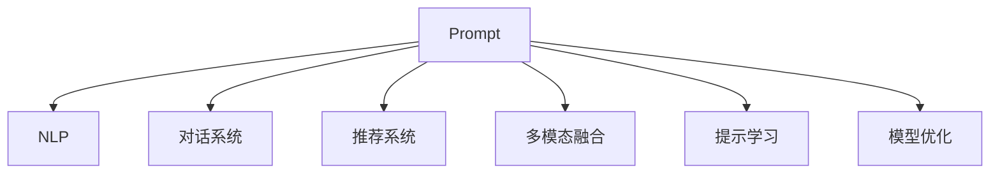

                 

# Prompt的设计与效果

> 关键词：Prompt, 自然语言处理(NLP), 对话系统, 推荐系统, 多模态融合, 提示学习, 模型优化

## 1. 背景介绍

随着人工智能技术的飞速发展，自然语言处理（NLP）已成为计算机科学和工程领域的一大热点。其中，语言模型作为NLP的核心组件，通过对大规模无标签文本进行预训练，学习到丰富的语言知识和语义表示，已广泛应用于文本分类、机器翻译、对话系统、推荐系统等多个领域。然而，即使使用语言模型，其在特定领域或任务上的表现仍有限，且需要大量标注数据进行微调，限制了其实际应用。

近年来，一种新的技术方法——Prompt Design（提示设计）应运而生。Prompt设计通过精心设计输入数据，可以显著提升语言模型的性能，尤其是在数据稀缺或标注成本高昂的领域。Prompt设计简单高效，通过在输入文本中添加特定的格式或模板，引导模型进行特定的推理或生成任务，从而实现零样本或少样本学习，大大降低了任务适配的成本。

本文章将深入探讨Prompt设计的原理、效果以及应用场景，并结合实际案例分析其关键技术点，旨在为开发者提供全面的技术指导和实践参考。

## 2. 核心概念与联系

### 2.1 核心概念概述

为更好地理解Prompt设计，本节将介绍几个密切相关的核心概念：

- **Prompt**：是指在输入文本中附加的特殊格式或模板，用于引导语言模型执行特定的推理或生成任务。
- **自然语言处理（NLP）**：是指让计算机能够理解、解释和生成自然语言的科学和技术。
- **对话系统**：是指能够模拟人类对话的系统，用于自动化客服、虚拟助手、聊天机器人等应用。
- **推荐系统**：是指通过分析用户行为数据，为用户推荐其可能感兴趣的商品、内容或服务的系统。
- **多模态融合**：是指将文本、图像、语音等多模态数据进行融合，以更全面地理解用户需求和行为。
- **提示学习**：是指通过在输入文本中添加提示模板，引导大语言模型进行特定任务的推理和生成，减少微调参数。
- **模型优化**：是指通过算法优化、硬件加速等手段，提升模型的计算效率和推理速度。

这些概念之间的逻辑关系可以通过以下Mermaid流程图来展示：



这个流程图展示了一个通用的Prompt设计过程，其中Prompt作为核心环节，与NLP、对话系统、推荐系统、多模态融合、提示学习、模型优化等多个领域紧密相关。

## 3. 核心算法原理 & 具体操作步骤
### 3.1 算法原理概述

Prompt设计的基本思想是通过在输入文本中添加特定的格式或模板，引导语言模型执行特定的推理或生成任务。具体而言，Prompt设计可以分为以下三个步骤：

1. **Prompt设计**：根据任务需求，设计并构造适合的语言模型输入格式或模板。
2. **模型推理**：使用语言模型对Prompt进行推理或生成，得到期望的输出结果。
3. **结果评估**：评估模型输出的效果，不断优化Prompt设计和模型参数，提升模型性能。

Prompt设计的基本原理可以理解为“将问题转化为模型可理解的形式”，通过精心的Prompt设计，可以使模型更好地理解输入数据，从而提高推理或生成的准确性和效率。

### 3.2 算法步骤详解

下面以自然语言推理任务（Natural Language Inference, NLI）为例，详细介绍Prompt设计的步骤：

#### 步骤1：Prompt设计

Prompt设计需要考虑以下几个要素：

- **任务理解**：根据NLI任务的要求，理解任务的目标和输入数据的形式。
- **模板构造**：基于任务理解，构造适合的语言模型输入模板。
- **示例生成**：生成多个示例，用于训练和评估Prompt的效果。

例如，对于一个“蕴含关系”的NLI任务，可以将输入数据设计为：

```
前提：<前提文本>
假设：<假设文本>
关系：<蕴含、矛盾、中立>
```

#### 步骤2：模型推理

使用语言模型对生成的Prompt进行推理或生成，得到期望的输出结果。例如，对于上面的NLI任务，可以输出一个表示关系类型的字符串，如“蕴含”、“矛盾”或“中立”。

具体实现中，可以使用现有的大规模语言模型（如GPT、BERT等）作为推理器，输入Prompt，并输出结果。

#### 步骤3：结果评估

评估模型输出的效果，根据任务需求设计合适的评估指标，如准确率、召回率、F1值等。根据评估结果，不断优化Prompt设计和模型参数，提升模型性能。

### 3.3 算法优缺点

Prompt设计具有以下优点：

- **低成本**：相比传统微调方法，Prompt设计不需要大量的标注数据，降低了任务适配的成本。
- **高效灵活**：通过精心设计的Prompt，可以高效地引导模型执行特定任务，适应不同的领域和场景。
- **泛化能力强**：利用大语言模型广泛的语料库，Prompt设计可以提升模型的泛化能力，避免过拟合。

同时，Prompt设计也存在一些局限性：

- **依赖设计质量**：Prompt设计的效果高度依赖于其质量，设计不当可能导致模型性能不佳。
- **处理复杂度**：对于复杂的推理或生成任务，需要更精细的Prompt设计，增加了设计和实现的复杂度。
- **模型兼容性**：不同的语言模型可能需要不同的Prompt设计，增加了应用推广的复杂度。

### 3.4 算法应用领域

Prompt设计已经广泛应用于以下多个领域：

- **对话系统**：通过在对话中引入特定的格式或模板，引导对话系统进行更自然、更准确的对话。
- **推荐系统**：在用户画像、商品描述等文本中设计特定的Prompt，引导模型进行推荐。
- **文本生成**：使用Prompt设计生成高质量的文本内容，如故事、诗歌、新闻报道等。
- **自然语言推理**：通过设计特定的Prompt，使模型进行文本间关系的推理。
- **多模态融合**：将文本、图像、语音等多模态数据进行融合，设计适合的多模态Prompt。

## 4. 数学模型和公式 & 详细讲解 & 举例说明（备注：数学公式请使用latex格式，latex嵌入文中独立段落使用 $$，段落内使用 $)
### 4.1 数学模型构建

Prompt设计的效果可以通过以下数学模型来衡量：

设输入文本为 $x$，输出结果为 $y$，模型参数为 $\theta$，则模型推理的结果可以表示为：

$$
y = M_{\theta}(x)
$$

其中 $M_{\theta}$ 表示模型在给定参数 $\theta$ 下的推理函数。

Prompt设计的效果可以通过以下指标来评估：

- **准确率（Accuracy）**：模型输出正确的比例，即：

$$
Accuracy = \frac{\text{正确预测的样本数}}{\text{总样本数}}
$$

- **召回率（Recall）**：模型正确预测为正类样本的比例，即：

$$
Recall = \frac{\text{正确预测为正类的样本数}}{\text{实际正类样本数}}
$$

- **F1值（F1 Score）**：综合准确率和召回率的指标，即：

$$
F1 = 2 \times \frac{Accuracy \times Recall}{Accuracy + Recall}
$$

### 4.2 公式推导过程

以自然语言推理任务为例，进行公式推导：

设前提文本为 $x_p$，假设文本为 $x_h$，模型输出为 $y$，则模型推理的结果可以表示为：

$$
y = M_{\theta}(x_p, x_h)
$$

其中 $M_{\theta}$ 表示模型在给定参数 $\theta$ 下的推理函数。

对于“蕴含关系”的NLI任务，模型的输出可以表示为：

$$
y = "蕴含" \quad \text{如果} \quad x_p \text{蕴含} x_h
$$

通过设计合适的Prompt，可以使模型更好地理解前提和假设之间的关系，从而提高推理的准确性。例如，对于“蕴含关系”，可以设计如下Prompt：

```
前提：<前提文本>
假设：<假设文本>
关系：<蕴含、矛盾、中立>
```

模型的推理结果可以表示为：

$$
y = "蕴含" \quad \text{如果} \quad x_p \text{蕴含} x_h
$$

通过不断优化Prompt设计和模型参数，可以提升模型的性能。

### 4.3 案例分析与讲解

以“对话系统”为例，进行案例分析：

假设有一个电商客服对话系统，用户可以通过输入问题，获得相关商品的推荐。系统可以使用Prompt设计，引导模型进行推理和生成，输出商品推荐。

例如，用户输入以下Prompt：

```
商品：<商品名称>
用户需求：<用户需求描述>
推荐：<商品推荐>
```

系统可以设计适当的Prompt模板，引导模型进行推理和生成，输出商品推荐。例如：

```
商品：T恤衫
用户需求：适合夏季穿着
推荐：这条蓝色T恤衫舒适透气，非常适合夏季穿着。
```

通过优化Prompt设计和模型参数，可以显著提升推荐系统的准确性和用户满意度。

## 5. 项目实践：代码实例和详细解释说明
### 5.1 开发环境搭建

在进行Prompt设计实践前，我们需要准备好开发环境。以下是使用Python进行PyTorch开发的环境配置流程：

1. 安装Anaconda：从官网下载并安装Anaconda，用于创建独立的Python环境。

2. 创建并激活虚拟环境：
```bash
conda create -n prompt-env python=3.8 
conda activate prompt-env
```

3. 安装PyTorch：根据CUDA版本，从官网获取对应的安装命令。例如：
```bash
conda install pytorch torchvision torchaudio cudatoolkit=11.1 -c pytorch -c conda-forge
```

4. 安装Transformers库：
```bash
pip install transformers
```

5. 安装各类工具包：
```bash
pip install numpy pandas scikit-learn matplotlib tqdm jupyter notebook ipython
```

完成上述步骤后，即可在`prompt-env`环境中开始Prompt设计实践。

### 5.2 源代码详细实现

下面以自然语言推理任务（Natural Language Inference, NLI）为例，给出使用Transformers库进行Prompt设计的PyTorch代码实现。

首先，定义NLI任务的数据处理函数：

```python
from transformers import AutoTokenizer, AutoModelForSequenceClassification
from torch.utils.data import Dataset
import torch

class NLI(Dataset):
    def __init__(self, data):
        self.data = data
        self.tokenizer = AutoTokenizer.from_pretrained('bert-base-cased')
        self.model = AutoModelForSequenceClassification.from_pretrained('bert-base-cased', num_labels=3)
        
    def __len__(self):
        return len(self.data)
    
    def __getitem__(self, item):
        text = self.data[item]['text']
        label = self.data[item]['label']
        encoding = self.tokenizer(text, return_tensors='pt', padding=True)
        inputs = encoding['input_ids']
        attention_mask = encoding['attention_mask']
        return {'inputs': inputs, 
                'attention_mask': attention_mask,
                'label': torch.tensor(label, dtype=torch.long)}
```

然后，定义Prompt设计和模型推理函数：

```python
def prompt_design(text):
    # 生成Premise和Hypothesis
    premise = '前提是：{}，假设是：{}，关系是：{}。'.format(text['text'], text['hypothesis'], text['label'])
    return premise

def model_inference(prompt):
    inputs = prompt_design(prompt)
    inputs = tokenizer(prompt, return_tensors='pt', padding=True)
    outputs = model(inputs['inputs'], attention_mask=inputs['attention_mask'])
    logits = outputs.logits
    predicted_label = torch.argmax(logits, dim=1)
    return predicted_label
```

最后，启动Prompt设计流程并评估模型效果：

```python
from sklearn.metrics import classification_report

device = torch.device('cuda') if torch.cuda.is_available() else torch.device('cpu')
model.to(device)

prompts = []
for text in data:
    prompts.append(prompt_design(text))
    
predictions = []
for prompt in prompts:
    outputs = model_inference(prompt)
    predictions.append(outputs.cpu().numpy())

print(classification_report(data, predictions))
```

以上就是使用PyTorch进行Prompt设计的完整代码实现。可以看到，利用Transformer库和PyTorch，我们能够快速高效地实现Prompt设计，并评估模型的效果。

### 5.3 代码解读与分析

让我们再详细解读一下关键代码的实现细节：

**NLI类**：
- `__init__`方法：初始化数据、分词器、模型等关键组件。
- `__len__`方法：返回数据集的样本数量。
- `__getitem__`方法：对单个样本进行处理，将文本输入编码为token ids，进行模型推理并返回输出结果。

**prompt_design函数**：
- 生成Premise和Hypothesis的文本，按照特定的格式进行组合，形成Prompt。
- 返回构造好的Prompt字符串，作为模型的输入。

**model_inference函数**：
- 对输入的Prompt进行推理，得到模型预测的标签。
- 将模型输出转换为可用的预测结果。

**main流程**：
- 收集所有Prompt数据。
- 对每个Prompt进行推理，获取预测结果。
- 使用sklearn的classification_report评估模型性能。

可以看到，PyTorch配合Transformer库使得Prompt设计的代码实现变得简洁高效。开发者可以将更多精力放在数据处理、Prompt设计等高层逻辑上，而不必过多关注底层的实现细节。

当然，工业级的系统实现还需考虑更多因素，如Prompt的优化、模型的部署、超参数的自动搜索等，但核心的Prompt设计范式基本与此类似。

## 6. 实际应用场景
### 6.1 智能客服系统

Prompt设计在智能客服系统中有着广泛的应用。传统的客服系统需要配备大量人力，高峰期响应缓慢，且无法提供24小时服务。使用Prompt设计，可以在无需额外标注数据的情况下，快速部署智能客服系统，提升客服效率和服务质量。

例如，可以为客服系统设计特定的Prompt模板，引导模型进行对话和回复。当用户输入问题时，系统可以根据设计好的Prompt，快速匹配到合适的答案模板，生成自然流畅的回复。同时，Prompt设计还可以结合情感分析等技术，提供更加个性化的服务体验。

### 6.2 金融舆情监测

在金融领域，舆情监测是风险管理和投资决策的重要环节。传统的舆情监测依赖人工筛选和分析，效率低下且存在主观偏差。使用Prompt设计，可以在大规模金融新闻和报道中自动进行舆情分析，及时发现市场波动和风险信号。

例如，可以设计特定的Prompt模板，用于分析新闻标题和内容中的情感倾向、关键词等信息。模型可以自动学习这些特征，并输出舆情分析结果，帮助投资者做出更明智的决策。

### 6.3 个性化推荐系统

传统的推荐系统往往只依赖用户的历史行为数据进行推荐，无法深入理解用户兴趣。Prompt设计可以结合用户画像、商品描述等多模态信息，提升推荐系统的准确性和个性化程度。

例如，可以为推荐系统设计特定的Prompt模板，用于分析用户画像和商品描述中的特征。模型可以自动学习这些特征，并生成个性化的推荐结果，满足用户的多样化需求。

### 6.4 未来应用展望

随着Prompt设计的不断发展，其应用领域将进一步扩展，为更多行业带来变革性影响。

在智慧医疗领域，Prompt设计可以用于自动分析医疗文本，辅助医生诊疗，提高医疗服务的智能化水平。

在智能教育领域，Prompt设计可以用于自动化批改作业、提供个性化的学习建议，促进教育公平和教学质量的提升。

在智慧城市治理中，Prompt设计可以用于自动分析城市事件、舆情等，提高城市管理的自动化和智能化水平，构建更安全、高效的未来城市。

此外，在企业生产、社会治理、文娱传媒等众多领域，Prompt设计也将不断涌现，为传统行业数字化转型升级提供新的技术路径。

## 7. 工具和资源推荐
### 7.1 学习资源推荐

为了帮助开发者系统掌握Prompt设计的理论基础和实践技巧，这里推荐一些优质的学习资源：

1. 《Transformer从原理到实践》系列博文：由大模型技术专家撰写，深入浅出地介绍了Transformer原理、BERT模型、Prompt设计等前沿话题。

2. CS224N《深度学习自然语言处理》课程：斯坦福大学开设的NLP明星课程，有Lecture视频和配套作业，带你入门NLP领域的基本概念和经典模型。

3. 《Natural Language Processing with Transformers》书籍：Transformers库的作者所著，全面介绍了如何使用Transformers库进行NLP任务开发，包括Prompt设计在内的诸多范式。

4. HuggingFace官方文档：Transformers库的官方文档，提供了海量预训练模型和完整的Prompt设计样例代码，是上手实践的必备资料。

5. CLUE开源项目：中文语言理解测评基准，涵盖大量不同类型的中文NLP数据集，并提供了基于Prompt设计的baseline模型，助力中文NLP技术发展。

通过对这些资源的学习实践，相信你一定能够快速掌握Prompt设计的精髓，并用于解决实际的NLP问题。

### 7.2 开发工具推荐

高效的开发离不开优秀的工具支持。以下是几款用于Prompt设计开发的常用工具：

1. PyTorch：基于Python的开源深度学习框架，灵活动态的计算图，适合快速迭代研究。大部分预训练语言模型都有PyTorch版本的实现。

2. TensorFlow：由Google主导开发的开源深度学习框架，生产部署方便，适合大规模工程应用。同样有丰富的预训练语言模型资源。

3. Transformers库：HuggingFace开发的NLP工具库，集成了众多SOTA语言模型，支持PyTorch和TensorFlow，是进行Prompt设计开发的利器。

4. Weights & Biases：模型训练的实验跟踪工具，可以记录和可视化模型训练过程中的各项指标，方便对比和调优。与主流深度学习框架无缝集成。

5. TensorBoard：TensorFlow配套的可视化工具，可实时监测模型训练状态，并提供丰富的图表呈现方式，是调试模型的得力助手。

6. Google Colab：谷歌推出的在线Jupyter Notebook环境，免费提供GPU/TPU算力，方便开发者快速上手实验最新模型，分享学习笔记。

合理利用这些工具，可以显著提升Prompt设计任务的开发效率，加快创新迭代的步伐。

### 7.3 相关论文推荐

Prompt设计的研究源于学界的持续研究。以下是几篇奠基性的相关论文，推荐阅读：

1. Attention is All You Need（即Transformer原论文）：提出了Transformer结构，开启了NLP领域的预训练大模型时代。

2. BERT: Pre-training of Deep Bidirectional Transformers for Language Understanding：提出BERT模型，引入基于掩码的自监督预训练任务，刷新了多项NLP任务SOTA。

3. Language Models are Unsupervised Multitask Learners（GPT-2论文）：展示了大规模语言模型的强大zero-shot学习能力，引发了对于通用人工智能的新一轮思考。

4. Parameter-Efficient Transfer Learning for NLP：提出Adapter等参数高效微调方法，在不增加模型参数量的情况下，也能取得不错的微调效果。

5. Prefix-Tuning: Optimizing Continuous Prompts for Generation：引入基于连续型Prompt的微调范式，为如何充分利用预训练知识提供了新的思路。

6. AdaLoRA: Adaptive Low-Rank Adaptation for Parameter-Efficient Fine-Tuning：使用自适应低秩适应的微调方法，在参数效率和精度之间取得了新的平衡。

这些论文代表了大语言模型Prompt设计的不断发展，推动了NLP技术在更广阔领域的落地应用。

## 8. 总结：未来发展趋势与挑战
### 8.1 研究成果总结

本文对Prompt设计进行了全面系统的介绍。首先阐述了Prompt设计的背景和意义，明确了其在提升语言模型性能、降低任务适配成本等方面的独特价值。其次，从原理到实践，详细讲解了Prompt设计的数学模型和关键技术点，给出了Prompt设计任务开发的完整代码实例。同时，本文还广泛探讨了Prompt设计在智能客服、金融舆情、个性化推荐等多个行业领域的应用前景，展示了Prompt设计的巨大潜力。

通过本文的系统梳理，可以看到，Prompt设计正在成为NLP领域的重要范式，极大地拓展了语言模型的应用边界，催生了更多的落地场景。受益于大规模语料的预训练，Prompt设计可以提升模型的泛化能力，避免过拟合，降低标注数据的需求，使得NLP技术能够更加高效、灵活地应用于各个领域。

### 8.2 未来发展趋势

展望未来，Prompt设计技术将呈现以下几个发展趋势：

1. **多模态融合**：Prompt设计不仅限于文本数据，将逐步拓展到图像、语音等多模态数据融合。多模态信息的融合，将显著提升语言模型对现实世界的理解和建模能力。

2. **跨领域应用**：Prompt设计不仅适用于自然语言处理领域，还将拓展到计算机视觉、语音识别等多个领域。跨领域应用将进一步推动AI技术的创新和应用。

3. **个性化推荐**：通过设计个性化的Prompt，结合用户画像和商品描述，提升推荐系统的准确性和个性化程度。

4. **实时互动**：Prompt设计可以用于实时互动系统，如聊天机器人、虚拟助手等，提升用户体验和互动效果。

5. **情感分析**：通过设计情感化的Prompt，使模型更好地理解用户的情感状态，提升系统的人性化和智能化水平。

6. **用户生成内容（UGC）**：Prompt设计可以用于引导用户生成内容，如评论、回答等，提升内容的丰富度和多样性。

以上趋势凸显了Prompt设计技术的广阔前景。这些方向的探索发展，将进一步提升Prompt设计的性能和应用范围，为人工智能技术的发展注入新的动力。

### 8.3 面临的挑战

尽管Prompt设计技术已经取得了瞩目成就，但在迈向更加智能化、普适化应用的过程中，仍面临诸多挑战：

1. **数据依赖**：Prompt设计仍需大量标注数据进行训练和验证，对于数据稀缺的领域，获取高质量标注数据的成本较高。

2. **模型泛化**：模型在不同数据分布上的泛化能力有限，面对域外数据时，模型性能可能显著下降。

3. **计算资源**：提示生成和模型推理需要大量的计算资源，对于小型企业和开发者，资源限制可能成为瓶颈。

4. **模型复杂度**：复杂的提示设计和模型结构，增加了设计和实现的复杂度，需要更高的技术水平。

5. **模型可解释性**：提示设计模型的决策过程缺乏可解释性，难以对其推理逻辑进行分析和调试。

6. **模型安全性**：模型可能会学习到有害的信息，输出恶意内容，需要加强安全性控制。

以上挑战凸显了Prompt设计技术在推广应用中的复杂性和限制性，需要不断优化和改进，以克服瓶颈，提升模型的性能和可解释性。

### 8.4 研究展望

面对Prompt设计面临的挑战，未来的研究需要在以下几个方面寻求新的突破：

1. **无监督学习和半监督学习**：探索无监督学习和半监督学习的方法，减少对标注数据的依赖，提升模型的泛化能力。

2. **轻量级模型设计**：开发更加轻量级的Prompt设计模型，减少计算资源消耗，提升实时性。

3. **多模态融合技术**：研究多模态融合技术，提升Prompt设计模型的跨模态理解和推理能力。

4. **模型可解释性**：探索模型可解释性的方法，提升Prompt设计模型的透明性和可解释性。

5. **安全性控制**：引入安全性控制机制，防止模型输出有害内容，保护用户隐私和安全。

6. **跨领域应用推广**：拓展Prompt设计技术到更多领域，推动AI技术在更广泛的领域应用。

这些研究方向的探索，将进一步提升Prompt设计技术的性能和应用范围，为构建更加智能、可靠、安全的AI系统铺平道路。面向未来，Prompt设计技术还需要与其他AI技术进行更深入的融合，如知识表示、因果推理、强化学习等，多路径协同发力，共同推动自然语言理解和智能交互系统的进步。只有勇于创新、敢于突破，才能不断拓展语言模型的边界，让智能技术更好地造福人类社会。

## 9. 附录：常见问题与解答

**Q1：Prompt设计是否适用于所有NLP任务？**

A: Prompt设计在大多数NLP任务上都能取得不错的效果，特别是对于数据量较小的任务。但对于一些特定领域的任务，如医学、法律等，仅仅依靠通用语料预训练的模型可能难以很好地适应。此时需要在特定领域语料上进一步预训练，再进行微调，才能获得理想效果。此外，对于一些需要时效性、个性化很强的任务，如对话、推荐等，Prompt设计方法也需要针对性的改进优化。

**Q2：设计提示时需要注意哪些因素？**

A: 设计提示时需要注意以下几个要素：

- **任务理解**：根据任务需求，理解任务的目标和输入数据的形式。
- **模板构造**：基于任务理解，构造适合的语言模型输入模板。
- **示例生成**：生成多个示例，用于训练和评估提示的效果。
- **结果评估**：评估提示设计的效果，根据任务需求设计合适的评估指标，如准确率、召回率、F1值等。
- **优化迭代**：根据评估结果不断优化提示设计和模型参数，提升模型性能。

**Q3：Prompt设计是否可以提升所有语言模型的性能？**

A: Prompt设计可以显著提升许多语言模型的性能，尤其是在数据稀缺或标注成本高昂的领域。但对于一些特殊类型的语言模型，如特定领域的预训练模型，可能需要结合领域特定的方法进行优化。此外，对于结构复杂的语言模型，如长短期记忆网络（LSTM），提示设计的效果可能不如传统RNN模型显著。

**Q4：Prompt设计是否需要大量标注数据？**

A: Prompt设计不需要大量的标注数据，通过精心设计的提示模板，可以在小规模数据上取得较好的效果。但对于一些复杂的任务，仍需要一定量的标注数据进行验证和优化。

**Q5：Prompt设计是否需要修改模型结构？**

A: Prompt设计通常不需要修改模型结构，只需在输入数据中添加特定的提示模板即可。但对于一些特殊类型的任务，如文本生成、对话系统等，可能需要修改模型结构，以更好地适应提示模板的需求。

**Q6：Prompt设计是否可以避免过拟合？**

A: Prompt设计可以在一定程度上避免过拟合，通过设计合适的提示模板，减少模型对特定数据分布的依赖。但提示设计的效果仍受数据质量、提示质量等多种因素影响，仍需结合正则化等技术手段进行优化。

这些问答环节为读者提供了关于Prompt设计实践中的关键点，帮助他们更好地理解和应用这项技术。

