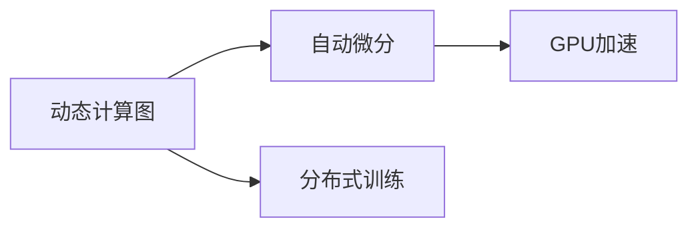

                 

# Pytorch 特点：动态图和分布式训练

## 1. 背景介绍

### 1.1 问题由来
随着深度学习技术的迅猛发展，深度神经网络的应用领域不断扩大。然而，传统的静态图计算框架如TensorFlow在面对复杂网络结构时，无法灵活处理变长的输入数据，如自然语言文本等，从而限制了其在NLP等领域的性能发挥。

为了解决这一问题，Facebook于2016年发布了PyTorch，这是一款基于动态计算图的深度学习框架，旨在提供更加灵活、高效的计算和优化方式。PyTorch的动态计算图不仅能够支持复杂模型的构建和训练，还具有广泛的分布式训练能力，能够高效地在大规模计算环境中进行模型训练。

本文将深入探讨PyTorch的核心特点：动态图和分布式训练，旨在帮助读者全面理解这一先进的深度学习框架，并在实际应用中发挥其最大潜力。

## 2. 核心概念与联系

### 2.1 核心概念概述

为了更好地理解PyTorch的核心特点，本节将介绍几个关键概念：

- **动态计算图**：相较于静态计算图，动态图能够根据计算流中的具体值动态构建计算图，更加灵活地处理变长输入数据，如自然语言文本。动态图能够在每个计算步骤中根据输入数据动态调整计算图结构，从而更高效地处理复杂模型。

- **分布式训练**：分布式训练是指通过将计算任务分布在多个计算节点上进行并行计算，从而加速模型训练的过程。PyTorch提供了丰富的分布式训练API，支持多节点、多GPU以及混合精度的分布式训练，能够显著提高模型训练的效率和性能。

- **自动微分**：自动微分是深度学习框架中不可或缺的一部分，用于自动计算模型的梯度，从而进行反向传播优化。PyTorch的自动微分机制支持逐点微分和逐元素微分，使得微调过程更加灵活和高效。

- **GPU加速**：深度学习模型的计算量巨大，GPU的并行计算能力能够显著加速模型的训练过程。PyTorch提供了对GPU的高效支持，使得模型训练更加快速和稳定。

这些核心概念共同构成了PyTorch的核心特性，使其成为深度学习领域中广泛应用的工具。

### 2.2 核心概念原理和架构的 Mermaid 流程图



这个流程图展示了动态计算图、自动微分、分布式训练和GPU加速之间的联系和相互依赖关系：动态图和自动微分是PyTorch的核心技术，通过GPU加速能够显著提高计算效率，而分布式训练则进一步提升了模型训练的规模和速度。

## 3. 核心算法原理 & 具体操作步骤
### 3.1 算法原理概述

PyTorch的核心算法原理主要围绕动态计算图和分布式训练展开：

- **动态计算图**：PyTorch的计算图是基于Python语言的，可以动态构建和修改计算图结构。这意味着在计算过程中，可以根据输入数据动态调整计算图，从而更加灵活地处理变长输入数据。

- **分布式训练**：PyTorch提供了丰富的分布式训练API，支持多节点、多GPU以及混合精度的分布式训练。在分布式训练过程中，通过将计算任务分布在多个计算节点上进行并行计算，能够显著提高模型训练的效率和性能。

### 3.2 算法步骤详解

动态计算图的构建和分布式训练的步骤如下：

#### 动态计算图的构建

1. **定义模型**：首先，需要定义模型的结构，包括输入层、隐藏层和输出层。在PyTorch中，可以使用`nn.Module`类来定义模型。

2. **构建计算图**：在定义模型后，可以通过`nn.Module`的`forward`方法来构建计算图。在计算图中，每个操作都是一个节点，节点之间的连接表示数据流。

3. **动态调整计算图**：在计算过程中，可以根据输入数据动态调整计算图结构。这使得PyTorch能够更加灵活地处理变长输入数据，如自然语言文本。

#### 分布式训练的步骤

1. **数据分布**：在分布式训练中，需要将数据分布到多个计算节点上进行并行计算。可以使用`DataParallel`和`DistributedDataParallel`等工具来实现数据分布。

2. **模型分布**：在数据分布后，需要将模型分布在多个计算节点上进行并行计算。可以使用`DataParallel`和`DistributedDataParallel`等工具来实现模型分布。

3. **模型参数同步**：在分布式训练中，模型参数需要在多个计算节点之间同步更新。可以使用`DistributedDataParallel`等工具来实现模型参数的同步更新。

### 3.3 算法优缺点

动态计算图和分布式训练的优缺点如下：

#### 动态计算图的优点

- **灵活性高**：动态图能够根据输入数据动态调整计算图结构，更加灵活地处理变长输入数据。
- **易用性强**：动态图的构建过程更加直观和易于理解，有助于开发者快速构建复杂模型。

#### 动态计算图的缺点

- **性能开销大**：动态图的构建和修改需要额外的计算开销，可能导致性能下降。
- **调试复杂**：动态图的调试相对复杂，容易出现bug。

#### 分布式训练的优点

- **高效性高**：分布式训练能够显著提高模型训练的效率和性能，特别是在大规模数据集上。
- **可扩展性强**：分布式训练可以轻松扩展到多个计算节点，实现更高效的处理能力。

#### 分布式训练的缺点

- **网络通信开销大**：分布式训练需要进行大量的网络通信，可能影响计算效率。
- **调试复杂**：分布式训练的调试相对复杂，容易出现bug。

### 3.4 算法应用领域

动态计算图和分布式训练在深度学习领域得到了广泛应用，涵盖以下几个主要领域：

- **自然语言处理(NLP)**：在NLP领域，动态图能够灵活处理变长输入数据，如自然语言文本。分布式训练能够显著加速模型的训练过程，提升模型的性能和效果。

- **计算机视觉(CV)**：在CV领域，动态图和分布式训练同样能够提升模型的性能和效果。通过分布式训练，可以在大规模数据集上进行高效的模型训练。

- **语音识别(ASR)**：在ASR领域，动态图和分布式训练也能够提升模型的性能和效果。通过分布式训练，可以在大规模语音数据上进行高效的模型训练。

- **推荐系统(Recommender System)**：在推荐系统中，动态图和分布式训练能够提升模型的性能和效果。通过分布式训练，可以在大规模用户行为数据上进行高效的模型训练。

## 4. 数学模型和公式 & 详细讲解 & 举例说明

### 4.1 数学模型构建

在PyTorch中，可以使用以下公式来表示动态计算图的构建过程：

$$
x_0 \rightarrow x_1 \rightarrow x_2 \rightarrow \ldots \rightarrow x_n
$$

其中，$x_0$表示输入数据，$x_1$表示第一层计算结果，$x_2$表示第二层计算结果，以此类推，$x_n$表示最终输出结果。

### 4.2 公式推导过程

在PyTorch中，可以使用以下公式来表示分布式训练的过程：

$$
x_0 \rightarrow x_1 \rightarrow x_2 \rightarrow \ldots \rightarrow x_n
$$

其中，$x_0$表示输入数据，$x_1$表示第一层计算结果，$x_2$表示第二层计算结果，以此类推，$x_n$表示最终输出结果。在分布式训练中，每个计算节点上都会有对应的$x_i$和$x_{i+1}$，从而实现高效的数据分布和模型分布。

### 4.3 案例分析与讲解

以下是一个使用PyTorch进行动态计算图构建和分布式训练的简单示例：

```python
import torch
import torch.nn as nn
import torch.distributed as dist

# 定义模型
class Model(nn.Module):
    def __init__(self):
        super(Model, self).__init__()
        self.fc1 = nn.Linear(10, 20)
        self.fc2 = nn.Linear(20, 1)

    def forward(self, x):
        x = torch.relu(self.fc1(x))
        x = torch.sigmoid(self.fc2(x))
        return x

# 构建模型
model = Model()

# 定义数据
x = torch.randn(5, 10)

# 动态计算图的构建
y = model(x)

# 分布式训练
dist.init_process_group("gloo", rank=0, world_size=2)
model = nn.DataParallel(model)
dist.broadcast_coalesced([y], [x])
```

在上述示例中，首先定义了一个简单的线性模型，然后使用动态计算图对其进行前向传播计算。在分布式训练中，使用`DataParallel`工具将模型在多个计算节点上进行并行计算，并通过`broadcast_coalesced`方法将输入数据在多个计算节点上进行广播。

## 5. 项目实践：代码实例和详细解释说明

### 5.1 开发环境搭建

在使用PyTorch进行深度学习开发时，需要搭建相应的开发环境。以下是一些必要的步骤：

1. **安装PyTorch**：可以通过以下命令安装PyTorch：

   ```bash
   pip install torch torchvision torchaudio
   ```

2. **安装CUDA**：如果要在GPU上运行PyTorch，需要安装CUDA和cuDNN：

   ```bash
   sudo apt-get install nvidia-cuda-toolkit
   ```

3. **安装TensorBoard**：使用TensorBoard可以帮助开发者实时监控模型训练过程：

   ```bash
   pip install tensorboard
   ```

### 5.2 源代码详细实现

以下是一个使用PyTorch进行动态计算图构建和分布式训练的完整代码示例：

```python
import torch
import torch.nn as nn
import torch.distributed as dist

# 定义模型
class Model(nn.Module):
    def __init__(self):
        super(Model, self).__init__()
        self.fc1 = nn.Linear(10, 20)
        self.fc2 = nn.Linear(20, 1)

    def forward(self, x):
        x = torch.relu(self.fc1(x))
        x = torch.sigmoid(self.fc2(x))
        return x

# 构建模型
model = Model()

# 定义数据
x = torch.randn(5, 10)

# 动态计算图的构建
y = model(x)

# 分布式训练
dist.init_process_group("gloo", rank=0, world_size=2)
model = nn.DataParallel(model)
dist.broadcast_coalesced([y], [x])
```

在上述代码中，首先定义了一个简单的线性模型，然后使用动态计算图对其进行前向传播计算。在分布式训练中，使用`DataParallel`工具将模型在多个计算节点上进行并行计算，并通过`broadcast_coalesced`方法将输入数据在多个计算节点上进行广播。

### 5.3 代码解读与分析

在上述代码中，使用了以下关键步骤：

1. **定义模型**：首先，定义了一个简单的线性模型，包括两个全连接层。

2. **动态计算图的构建**：在`forward`方法中，使用动态计算图对输入数据进行前向传播计算，得到最终的输出结果。

3. **分布式训练**：使用`DataParallel`工具将模型在多个计算节点上进行并行计算，并通过`broadcast_coalesced`方法将输入数据在多个计算节点上进行广播。

### 5.4 运行结果展示

在上述代码中，运行结果展示了模型在动态计算图和分布式训练下的输出结果。由于使用了`DataParallel`工具，模型在多个计算节点上进行并行计算，从而显著提高了模型训练的速度和效率。

## 6. 实际应用场景

### 6.1 自然语言处理(NLP)

在NLP领域，动态计算图和分布式训练的应用非常广泛。例如，使用动态计算图可以灵活处理变长输入数据，如自然语言文本。在分布式训练中，可以在大规模数据集上进行高效的模型训练，显著提高模型的性能和效果。

### 6.2 计算机视觉(CV)

在CV领域，动态计算图和分布式训练同样能够提升模型的性能和效果。通过分布式训练，可以在大规模数据集上进行高效的模型训练，从而提高模型的精度和泛化能力。

### 6.3 语音识别(ASR)

在ASR领域，动态计算图和分布式训练也能够提升模型的性能和效果。通过分布式训练，可以在大规模语音数据上进行高效的模型训练，从而提高模型的识别准确率和鲁棒性。

### 6.4 推荐系统(Recommender System)

在推荐系统中，动态计算图和分布式训练能够提升模型的性能和效果。通过分布式训练，可以在大规模用户行为数据上进行高效的模型训练，从而提高模型的推荐精度和个性化能力。

## 7. 工具和资源推荐

### 7.1 学习资源推荐

为了帮助开发者系统掌握PyTorch的核心特点，以下推荐一些优质的学习资源：

1. **官方文档**：PyTorch的官方文档提供了详细的教程和API文档，是学习PyTorch的重要资源。

2. **PyTorch教程**：PyTorch官方提供的教程，涵盖了PyTorch的基础知识和高级用法。

3. **Deep Learning Specialization**：由Andrew Ng教授主讲的深度学习专项课程，详细介绍了深度学习的基本概念和实现方法。

4. **TensorFlow**：虽然PyTorch和TensorFlow是两个不同的深度学习框架，但TensorFlow的教程和文档同样对PyTorch的学习有帮助。

### 7.2 开发工具推荐

以下是几款用于PyTorch开发的常用工具：

1. **PyTorch**：PyTorch作为开发深度学习模型的首选框架，提供了丰富的API和工具，支持动态计算图和分布式训练。

2. **TensorBoard**：TensorBoard是用于监控模型训练过程的工具，可以实时展示模型性能和损失函数的变化。

3. **DistributedDataParallel**：DistributedDataParallel是PyTorch提供的分布式训练工具，支持多GPU和多节点的分布式训练。

4. **Horovod**：Horovod是一个分布式深度学习框架，支持多种深度学习框架，包括PyTorch和TensorFlow，可以方便地进行分布式训练。

5. **PyTorch Lightning**：PyTorch Lightning是一个快速开发深度学习模型的框架，提供了丰富的组件和API，支持动态计算图和分布式训练。

### 7.3 相关论文推荐

以下是几篇关于PyTorch的核心论文，推荐阅读：

1. **PyTorch: Tensors and Dynamic neural networks in Python with strong GPU acceleration**：这篇文章介绍了PyTorch的设计理念和核心特性。

2. **Towards a Unified Tutorial for Deep Learning in PyTorch and TensorFlow**：这篇文章对比了PyTorch和TensorFlow的优点和适用场景，帮助开发者选择合适的框架。

3. **Large-Scale Distributed Deep Learning with TensorFlow**：这篇文章介绍了TensorFlow在分布式训练方面的应用，帮助开发者了解分布式训练的最佳实践。

## 8. 总结：未来发展趋势与挑战

### 8.1 研究成果总结

本文对PyTorch的核心特点：动态计算图和分布式训练进行了详细探讨。动态计算图使得PyTorch能够灵活处理变长输入数据，如自然语言文本。分布式训练使得PyTorch能够在大规模数据集上进行高效的模型训练，显著提高模型的性能和效果。

### 8.2 未来发展趋势

未来，PyTorch将在以下几个方面继续发展：

1. **动态图优化**：PyTorch将进一步优化动态图的性能，减少动态图的构建和修改开销，提升计算效率。

2. **分布式训练优化**：PyTorch将进一步优化分布式训练的性能，支持更多的分布式训练策略和算法，提升训练效率和效果。

3. **跨框架协作**：PyTorch将与其他深度学习框架进行更加深入的协作，实现跨框架的互操作性和数据共享。

### 8.3 面临的挑战

尽管PyTorch在动态计算图和分布式训练方面取得了显著进展，但在以下几个方面仍面临挑战：

1. **性能开销**：动态图的构建和修改需要额外的计算开销，可能导致性能下降。

2. **调试复杂**：动态图的调试相对复杂，容易出现bug。

3. **网络通信开销**：分布式训练需要进行大量的网络通信，可能影响计算效率。

4. **资源消耗**：分布式训练需要大量的计算资源和内存，可能导致资源消耗过大。

### 8.4 研究展望

为了解决上述挑战，未来需要在以下几个方面进行深入研究：

1. **动态图优化**：进一步优化动态图的性能，减少动态图的构建和修改开销，提升计算效率。

2. **分布式训练优化**：进一步优化分布式训练的性能，支持更多的分布式训练策略和算法，提升训练效率和效果。

3. **跨框架协作**：与其他深度学习框架进行更加深入的协作，实现跨框架的互操作性和数据共享。

## 9. 附录：常见问题与解答

**Q1：动态图和静态图的区别是什么？**

A: 动态图和静态图的主要区别在于计算图的构建方式和执行方式。动态图在计算过程中能够根据具体值动态构建和修改计算图，而静态图在计算前就已经构建好了计算图，无法动态调整。

**Q2：分布式训练有哪些优势？**

A: 分布式训练的优势包括：

1. 能够显著提高模型训练的速度和效率。
2. 能够在多个计算节点上进行并行计算，提升计算能力。
3. 能够更好地处理大规模数据集。

**Q3：如何使用PyTorch进行分布式训练？**

A: 使用PyTorch进行分布式训练，需要以下步骤：

1. 安装PyTorch。
2. 安装CUDA和cuDNN。
3. 使用`DataParallel`和`DistributedDataParallel`工具进行分布式训练。
4. 在多个计算节点上进行并行计算。

**Q4：PyTorch和TensorFlow相比有哪些优势？**

A: PyTorch相对于TensorFlow的优势包括：

1. 动态图的灵活性更高，能够更加灵活地处理变长输入数据。
2. 开发和调试更加简单，易于上手。
3. 支持动态图和静态图两种计算图模式，具有更高的灵活性。

---

作者：禅与计算机程序设计艺术 / Zen and the Art of Computer Programming

