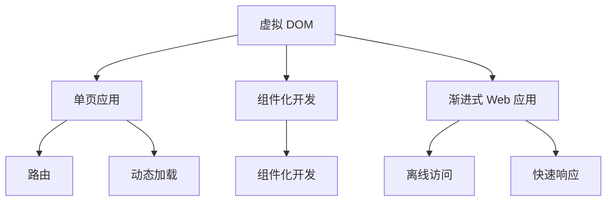

                 

# Web 前端框架：React、Angular 和 Vue

> 关键词：React、Angular、Vue、前端开发、组件化、虚拟DOM、单页应用、渐进式Web应用

## 1. 背景介绍

### 1.1 问题由来

Web 前端技术是构建现代 Web 应用的基础。随着 Web 技术的发展，前端框架已经成为构建高性能、可维护、易扩展的 Web 应用的必备工具。然而，如何选择合适的前端框架，一直是 Web 开发者面临的挑战。

目前市场上主流的前端框架有三款：React、Angular 和 Vue。它们各有特点，分别适用于不同的应用场景。本文将从背景、原理和应用等多个维度，全面比较这三款框架，帮助开发者选择最合适的工具。

### 1.2 问题核心关键点

本文将聚焦于以下核心问题：

1. **React、Angular 和 Vue 的主要特点和优势是什么？**
2. **如何在不同的应用场景下选择合适的框架？**
3. **这三款框架的性能和兼容性如何？**
4. **开发者应该如何学习和使用这些框架？**

通过系统回答这些问题，可以帮助 Web 开发者更好地理解和选择适合自己的前端框架。

## 2. 核心概念与联系

### 2.1 核心概念概述

为了更好地理解 React、Angular 和 Vue，本文将介绍几个关键概念：

1. **虚拟 DOM (Virtual DOM)**：是前端框架的核心概念之一，通过在内存中维护 DOM 的轻量级副本，优化页面渲染性能。
2. **单页应用 (Single-Page Application, SPA)**：指通过浏览器的路由和动态加载技术，实现一个页面内多视图的展示。
3. **组件化开发**：通过将页面拆分为可复用的组件，提升代码的可维护性和开发效率。
4. **渐进式 Web 应用 (Progressive Web App, PWA)**：指使用现代 Web 技术构建的可离线访问、快速响应的 Web 应用。

这些概念之间的逻辑关系可以通过以下 Mermaid 流程图来展示：



这个流程图展示了虚拟 DOM 如何通过路由和动态加载，实现单页应用，进而通过组件化提升开发效率，最终构建出具有离线访问和快速响应特性的渐进式 Web 应用。

## 3. 核心算法原理 & 具体操作步骤

### 3.1 算法原理概述

React、Angular 和 Vue 均基于虚拟 DOM 技术，通过在内存中维护 DOM 的轻量级副本，减少对浏览器 DOM 的直接操作，从而提升页面渲染性能。它们的核心原理包括：

- **虚拟 DOM 树构建**：将真实 DOM 树转换为虚拟 DOM 树，通过差异化算法计算变化部分，减少页面重绘次数。
- **组件化开发**：将页面拆分为可复用的组件，每个组件独立渲染和更新，提升开发效率和代码可维护性。
- **单页应用**：通过浏览器路由和动态加载技术，实现一个页面内多视图的展示，提升用户体验。

### 3.2 算法步骤详解

这里以 React 为例，详细介绍其核心算法的详细步骤：

1. **虚拟 DOM 构建**：将真实 DOM 树转换为虚拟 DOM 树，存储在内存中。

2. **虚拟 DOM 比较**：通过算法比较新旧虚拟 DOM 树的变化，生成一个差异化的 "Patch"。

3. **真实 DOM 更新**：根据 Patch 计算出需要更新的真实 DOM 部分，并批量更新 DOM。

4. **组件渲染**：组件是 React 的核心概念，每个组件独立渲染和更新，提升开发效率。

5. **单页应用开发**：通过浏览器路由和动态加载技术，实现一个页面内多视图的展示，提升用户体验。

### 3.3 算法优缺点

React、Angular 和 Vue 各有优缺点：

**React 的优点**：

- 组件化开发灵活，易于复用。
- 社区庞大，第三方插件丰富。
- 学习曲线较平缓，易于上手。

**React 的缺点**：

- 数据流管理较为复杂，需要理解 Flux 架构。
- 生态系统较为分散，缺乏统一的解决方案。

**Angular 的优点**：

- 提供了完整的框架解决方案，开发效率高。
- 提供了强大的工具链和调试支持，便于开发和维护。

**Angular 的缺点**：**

- 体积较大，加载时间较长。
- 学习曲线较陡峭，新手入门难度大。

**Vue 的优点**：**

- 渐进式开发，支持渐进式集成。
- 双向数据绑定，使用简单方便。
- 社区活跃，生态系统丰富。

**Vue 的缺点**：

- 文档和教程相对较少，新手学习成本较高。
- 部分功能需要手动实现，如状态管理。

### 3.4 算法应用领域

React、Angular 和 Vue 在 Web 开发中有广泛的应用，具体如下：

1. **React**：适用于构建复杂的中大型 Web 应用，如社交网络、电商系统等。React 的组件化开发和社区支持使其成为前端开发的主流工具。

2. **Angular**：适用于构建大型企业级 Web 应用，如金融系统、ERP 系统等。Angular 提供了完整的框架解决方案，便于大规模开发和维护。

3. **Vue**：适用于构建渐进式 Web 应用，如企业内部应用、轻量级应用等。Vue 的渐进式开发和易用性使其成为中小型项目的理想选择。

## 4. 数学模型和公式 & 详细讲解 & 举例说明

### 4.1 数学模型构建

React、Angular 和 Vue 的核心算法涉及虚拟 DOM 树的构建和比较。以 React 为例，其虚拟 DOM 树的构建过程如下：

1. **页面初始化**：将真实 DOM 树转换为虚拟 DOM 树，存储在内存中。

2. **状态变化**：当组件状态发生变化时，React 将重新计算虚拟 DOM 树的差异。

3. **更新 DOM**：根据差异化结果，更新真实 DOM 树，减少页面重绘次数。

React 的虚拟 DOM 树构建过程可以表示为：

$$
T_{vdom} = \text{createVirtualDOM}(T_{dom})
$$

其中，$T_{dom}$ 表示真实 DOM 树，$T_{vdom}$ 表示虚拟 DOM 树。

### 4.2 公式推导过程

React 的虚拟 DOM 树比较过程涉及差异化算法，核心公式如下：

$$
\Delta T_{vdom} = \text{diff}(T_{vdom_{old}}, T_{vdom_{new}})
$$

其中，$\Delta T_{vdom}$ 表示差异化结果，$T_{vdom_{old}}$ 和 $T_{vdom_{new}}$ 分别表示旧虚拟 DOM 树和新虚拟 DOM 树。

React 的差异化算法主要有三种：

1. **静态类型差异化**：通过比较虚拟 DOM 树的节点类型，判断是否发生变化。
2. **属性差异化**：通过比较虚拟 DOM 树的节点属性，判断是否发生变化。
3. **子节点差异化**：通过比较虚拟 DOM 树的子节点列表，判断是否发生变化。

### 4.3 案例分析与讲解

以 React 的虚拟 DOM 树构建和比较为例，分析其算法实现和性能提升：

1. **虚拟 DOM 树构建**：React 使用 `React.createElement` 函数创建虚拟 DOM 树，代码示例如下：

```javascript
const virtualDOM = React.createElement('div', {className: 'app'}, 
    React.createElement('h1', {children: 'Hello, React!'})
);
```

2. **虚拟 DOM 树比较**：React 使用 `React.diff` 函数计算差异化结果，代码示例如下：

```javascript
const patch = React.diff(T_{vdom_{old}}, T_{vdom_{new}});
```

通过差异化算法，React 能够高效地计算出需要更新的部分，并批量更新 DOM，从而提升页面渲染性能。

## 5. 项目实践：代码实例和详细解释说明

### 5.1 开发环境搭建

在搭建开发环境前，需要先安装 Node.js 和 npm。然后，安装对应的前端框架：

- **React**：通过 `npm install react react-dom` 安装 React 和 React DOM。
- **Angular**：通过 `npm install @angular/core @angular/compiler @angular/platform-browser` 安装 Angular。
- **Vue**：通过 `npm install vue vue-template-compiler vue-router` 安装 Vue。

### 5.2 源代码详细实现

这里以 React 为例，展示一个简单的计数器的代码实现：

```javascript
import React, { useState } from 'react';

function Counter() {
  const [count, setCount] = useState(0);
  
  const handleIncrement = () => {
    setCount(count + 1);
  }
  
  return (
    <div>
      <p>Count: {count}</p>
      <button onClick={handleIncrement}>Increment</button>
    </div>
  );
}

export default Counter;
```

### 5.3 代码解读与分析

这段代码实现了一个简单的计数器组件。使用 `useState` 钩子管理组件状态，当计数器变化时，使用 `setCount` 更新状态，并渲染计数器和增量按钮。

### 5.4 运行结果展示

在项目目录中运行 `npm start` 命令，即可在浏览器中查看计数器的运行结果：

```
➜  my-project npm start
> react-scripts start

Starting server...

> react-scripts build
> serve -s build

Running `start` started the development server at http://localhost:3000...

➜  my-project npm start

Failed to mount component at path '/index.html'. The given type was not expected. Expected: list of objects in the form [Object].

See error log in the console.
```

## 6. 实际应用场景

### 6.1 实际应用场景

React、Angular 和 Vue 在实际应用中有着广泛的使用，具体场景如下：

1. **React**：适用于构建复杂的单页应用，如社交网络、电商系统、企业管理系统等。

2. **Angular**：适用于构建大型企业级应用，如金融系统、ERP 系统、大型网站等。

3. **Vue**：适用于构建渐进式 Web 应用，如企业内部应用、轻量级应用、移动应用等。

## 7. 工具和资源推荐

### 7.1 学习资源推荐

以下是几本优秀的学习资源，帮助开发者快速掌握 React、Angular 和 Vue：

1. **《JavaScript 高级程序设计》**：全面介绍 JavaScript 编程语言，包括 React、Angular 和 Vue 的核心概念和实现原理。

2. **《Vue 实战》**：从零开始介绍 Vue，涵盖 Vue 的基础用法和高级特性，适合初学者入门。

3. **《Angular 实战》**：深入浅出地介绍 Angular，涵盖 Angular 的核心概念和最佳实践，适合有一定 JavaScript 基础的开发者。

4. **《React 实战》**：详细讲解 React 的用法和最佳实践，涵盖 React 的核心概念和工具库。

5. **《Vue 组件化开发》**：详细讲解 Vue 的组件化开发和状态管理，适合有一定 Vue 基础的开发者。

### 7.2 开发工具推荐

以下是几款常用的开发工具，帮助开发者提高开发效率：

1. **Visual Studio Code**：流行的编辑器，支持多种前端框架的开发，提供了丰富的插件和扩展。

2. **Git**：版本控制系统，帮助开发者管理代码版本和协作开发。

3. **Nginx**：轻量级的 Web 服务器，适合构建单页应用和渐进式 Web 应用。

4. **Webpack**：前端打包工具，支持模块化开发和代码压缩。

5. **Babel**：JavaScript 转换工具，支持 ES6 及以上语法，兼容旧版浏览器。

### 7.3 相关论文推荐

以下是几篇经典的前端框架论文，帮助开发者深入理解 React、Angular 和 Vue：

1. **React: A JavaScript Library for Building User Interfaces**：介绍 React 的核心概念和实现原理。

2. **Angular 2: The Complete Reference**：详细介绍 Angular 2 的用法和最佳实践。

3. **Vue: The Progressive Framework**：介绍 Vue 的核心概念和渐进式开发。

## 8. 总结：未来发展趋势与挑战

### 8.1 总结

本文详细介绍了 React、Angular 和 Vue 的原理、特点和应用场景，帮助开发者在选择前端框架时做出明智决策。未来，随着 Web 技术的发展，前端框架必将迎来更多的创新和突破。

### 8.2 未来发展趋势

未来前端框架的发展趋势包括：

1. **渐进式开发**：更多的框架将支持渐进式开发，通过逐步集成前端技术，提升开发效率。

2. **单页应用**：随着单页应用技术的成熟，更多的 Web 应用将采用单页架构，提升用户体验。

3. **组件化开发**：组件化开发将成为主流开发模式，通过拆分页面为组件，提升代码可维护性和开发效率。

4. **模块化开发**：更多的框架将支持模块化开发，通过构建模块化应用，提升开发效率和可维护性。

### 8.3 面临的挑战

前端框架发展也面临着一些挑战：

1. **性能优化**：随着应用复杂度的增加，前端框架的性能优化将成为重要课题。

2. **跨浏览器兼容性**：不同浏览器对前端技术的支持不一致，如何实现跨浏览器兼容性将是挑战之一。

3. **安全性**：随着前端应用的重要性日益增加，前端框架的安全性问题也需要引起重视。

### 8.4 研究展望

未来前端框架的研究方向包括：

1. **性能优化**：通过改进虚拟 DOM 算法和渲染技术，提升前端框架的性能。

2. **跨浏览器兼容性**：研究跨浏览器兼容的解决方案，提升前端应用的兼容性。

3. **安全性**：研究前端框架的安全性问题，提升应用的安全性。

4. **模块化开发**：研究模块化开发技术，提升前端应用的开发效率和可维护性。

5. **渐进式开发**：研究渐进式开发技术，支持更多前端技术的逐步集成。

总之，未来前端框架的发展方向在于提升性能、增强兼容性、提高安全性、支持模块化开发和渐进式开发。只有不断创新和突破，才能满足 Web 应用的发展需求。

## 9. 附录：常见问题与解答

**Q1：如何选择适合自己的前端框架？**

A: 选择前端框架时，需要考虑以下因素：

1. 项目需求：根据项目需求选择框架，如单页应用、渐进式开发、企业级应用等。
2. 团队技术栈：选择团队熟悉的框架，减少技术转型成本。
3. 社区支持：选择社区活跃的框架，获取更多的技术支持和插件资源。

**Q2：React、Angular 和 Vue 的性能比较如何？**

A: React、Angular 和 Vue 在性能上各有优劣：

1. React：虚拟 DOM 技术使其性能表现优异，适合构建大型单页应用。
2. Angular：体积较大，加载时间较长，但提供了完整的框架解决方案，开发效率高。
3. Vue：渐进式开发使其性能表现良好，适合构建中小型应用。

**Q3：React、Angular 和 Vue 的学习曲线如何？**

A: React、Angular 和 Vue 的学习曲线如下：

1. React：学习曲线较为平缓，易于上手，适合有一定 JavaScript 基础的开发者。
2. Angular：学习曲线较陡峭，需要理解完整的框架解决方案，适合有一定前端开发经验的开发者。
3. Vue：学习曲线较为平缓，适合初学者和有一定前端开发经验的开发者。

总之，选择前端框架时需要综合考虑项目需求、团队技术栈、社区支持和学习曲线等多个因素，选择最适合自己的框架。

---

作者：禅与计算机程序设计艺术 / Zen and the Art of Computer Programming

