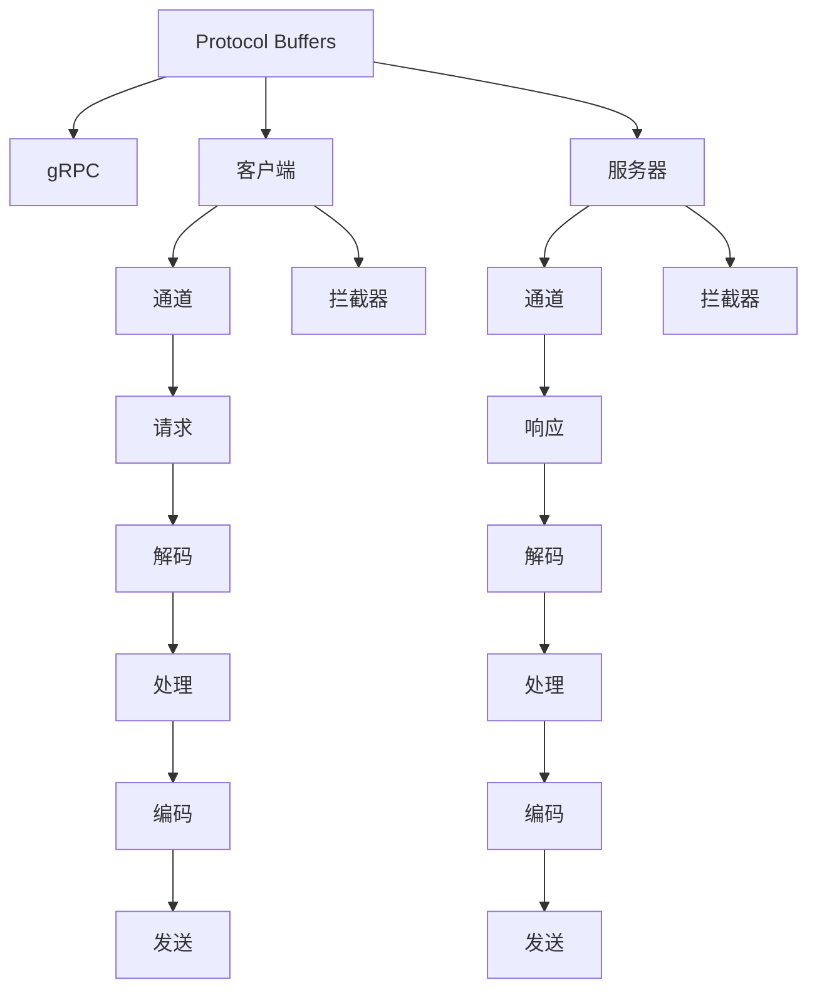

                 

## 1. 背景介绍

### 1.1 问题由来

随着互联网应用的快速发展，网络服务架构变得越来越复杂。为了实现不同服务之间的通信和协调，RPC（Remote Procedure Call，远程过程调用）成为了一种不可或缺的机制。然而，传统的基于HTTP的RPC框架存在许多问题，如性能瓶颈、协议复杂、跨语言支持不充分等。这些问题严重制约了RPC技术的发展和应用。

### 1.2 问题核心关键点

在当前的技术生态中，gRPC（Google Protocol Buffers for RPC）作为一种新兴的高性能跨语言RPC框架，逐渐取代了传统的HTTP+JSON框架，成为新一代网络服务架构的基础。其主要优势包括：

- **高性能**：使用Protocol Buffers序列化格式，具有更高的序列化和反序列化效率。
- **跨语言支持**：支持多种编程语言，包括C++、Java、Go、Python等，方便开发者跨语言开发。
- **协议简洁**：使用Protocol Buffers定义接口，协议本身非常简洁，易于理解和实现。
- **服务发现与负载均衡**：内置支持服务发现和负载均衡机制，提升系统可用性和可扩展性。
- **安全性**：支持TLS加密传输，提供客户端和服务端的双向认证。

本文将系统介绍gRPC的核心概念、架构原理以及具体实现，帮助读者深入理解这一高效、简洁的跨语言RPC框架。

## 2. 核心概念与联系

### 2.1 核心概念概述

为了更好地理解gRPC，首先介绍几个核心概念：

- **Protocol Buffers (Protocol Buffers)**：Google设计的一种序列化协议，用于序列化和反序列化数据结构。Protocol Buffers具有高效、简洁、跨平台等优点，是gRPC框架的基础。
- **gRPC**：Google开源的基于Protocol Buffers的高性能跨语言RPC框架，提供高效、简洁、跨语言的通信机制。
- **客户端**：使用gRPC框架的客户端，负责发起RPC请求。
- **服务器**：使用gRPC框架的服务器，负责处理RPC请求，并返回响应。
- **通道 (Channel)**：用于建立客户端与服务器之间的通信通道，支持多种传输方式（如HTTP/1.1、gRPC等）。
- **拦截器 (Interceptor)**：用于在RPC请求和响应过程中添加额外的处理逻辑，如身份验证、日志记录等。

这些概念之间的联系可以通过以下Mermaid流程图来展示：



这个流程图展示了gRPC的核心组件及其交互流程：

1. 客户端和服务器分别使用Protocol Buffers定义接口，进行通信。
2. 客户端和服务器通过通道建立通信连接，支持多种传输方式。
3. 客户端和服务器分别应用拦截器，处理额外的逻辑和请求/响应过程。
4. 客户端发送请求，经过解码和处理后发送给服务器。
5. 服务器处理请求，生成响应，并经过编码和发送后返回给客户端。

## 3. 核心算法原理 & 具体操作步骤

### 3.1 算法原理概述

gRPC的核心算法原理主要包括两个部分：Protocol Buffers和gRPC框架。下面分别介绍这两部分的原理。

#### 3.1.1 Protocol Buffers

Protocol Buffers是一种高效、简洁、跨平台的序列化协议。其原理如下：

- **数据结构定义**：使用.proto文件定义数据结构，包括消息、枚举、服务等。
- **编译生成代码**：使用Protocol Buffers编译器生成对应的编程语言代码，支持Java、C++、Python等多种语言。
- **序列化和反序列化**：使用生成的代码对数据进行序列化和反序列化，实现高效、简洁的数据传输。

#### 3.1.2 gRPC框架

gRPC框架的核心算法原理包括以下几个部分：

- **客户端和服务端设计**：使用Protocol Buffers定义接口，并在客户端和服务端使用gRPC框架进行通信。
- **通道管理**：gRPC框架提供通道管理机制，用于建立和管理客户端与服务器之间的通信通道。
- **拦截器**：gRPC框架提供拦截器机制，用于在请求和响应过程中添加额外的逻辑，如身份验证、日志记录等。
- **负载均衡**：gRPC框架内置支持负载均衡机制，用于根据负载情况动态分配请求到不同的服务器。

### 3.2 算法步骤详解

#### 3.2.1 数据结构定义

首先，使用.proto文件定义数据结构。例如，定义一个简单的Person消息：

```proto
syntax = "proto3";

message Person {
    string name = 1;
    int32 id = 2;
    string email = 3;
}
```

使用Protocol Buffers编译器（protoc）生成对应的Java代码：

```bash
protoc --java_out=. person.proto
```

生成的Java代码如下：

```java
package com.example.proto;

public final class Person {
    private String name;
    private int id;
    private String email;

    // getters and setters
}
```

#### 3.2.2 客户端和服务端设计

接下来，设计客户端和服务端。服务端定义一个简单的接口：

```proto
syntax = "proto3";

service PersonService {
    rpc GetPersonById(int32 id) returns (Person);
}
```

服务端实现：

```java
package com.example.server;

import com.example.proto.Person;
import com.google.protobuf.InvalidProtocolBufferException;
import io.grpc.stub.StreamObserver;

public class PersonServiceStub extends PersonServiceGrpc.PersonServiceStub {

    public PersonServiceStub(Channel channel) {
        super(channel);
    }

    @Override
    public void getPersonById(int32 id, StreamObserver<Person> responseObserver) {
        Person.Builder personBuilder = Person.newBuilder();
        personBuilder.setId(id);
        personBuilder.setName("Alice");
        personBuilder.setEmail("alice@example.com");
        responseObserver.onNext(personBuilder.build());
        responseObserver.onCompleted();
    }
}
```

客户端代码：

```java
package com.example.client;

import com.example.proto.Person;
import io.grpc.ManagedChannel;
import io.grpc.ManagedChannelBuilder;

public class GrpcClient {

    private ManagedChannel channel;

    public GrpcClient(String host, int port) {
        this.channel = ManagedChannelBuilder.forAddress(host, port).build();
    }

    public Person getPersonById(int32 id) {
        PersonRequest request = PersonRequest.newBuilder().setId(id).build();
        PersonResponse response = getPersonById(request);
        return response.getPerson();
    }

    private PersonResponse getPersonById(PersonRequest request) {
        StubStubPersonServiceBlockingStub personServiceBlockingStub =StubStubPersonServiceBlockingStub.newBlockingStub(channel);
        return personServiceBlockingStub.getPersonById(request);
    }
}
```

#### 3.2.3 通道管理

gRPC框架提供通道管理机制，用于建立和管理客户端与服务器之间的通信通道。通道的建立可以使用以下代码：

```java
ManagedChannel channel = ManagedChannelBuilder.forAddress("localhost", 8080).build();
```

#### 3.2.4 拦截器

gRPC框架提供拦截器机制，用于在请求和响应过程中添加额外的逻辑。例如，添加日志记录的拦截器：

```java
class LogInterceptor implements Interceptor {
    @Override
    public <ReqT, RespT> ClientCall<ReqT, RespT> interceptCall(ClientCall<ReqT, RespT> call, Metadata metadata, CallOptions options) {
        return new ForwardingClientCall.SimpleForwardingClientCall<ReqT, RespT>(call) {
            @Override
            public void start(Listener<RespT> responseListener) {
                System.out.println("Starting client call");
                super.start(responseListener);
            }
        };
    }
}
```

使用拦截器时，需要在客户端和服务端都应用：

```java
ClientCall<RequestMessage, ResponseMessage> clientCall = stub.getPersonById(request, new LogInterceptor());
```

#### 3.2.5 负载均衡

gRPC框架内置支持负载均衡机制，用于根据负载情况动态分配请求到不同的服务器。默认使用轮询算法，也可以通过配置自定义负载均衡策略：

```java
ClientChannel channel = ManagedChannelBuilder.forAddress("localhost", 8080).build();
LoadBalancingStrategy loadBalancingStrategy = new LeastRequestsLoadBalancingStrategy();
channel = ManagedChannelBuilder.forAddress("localhost", 8080)
    .loadBalancingStrategy(loadBalancingStrategy)
    .build();
```

### 3.3 算法优缺点

#### 3.3.1 优点

1. **高性能**：Protocol Buffers序列化格式具有高效、简洁的特点，gRPC框架在序列化和反序列化方面具有显著优势。
2. **跨语言支持**：支持多种编程语言，方便开发者跨语言开发。
3. **协议简洁**：使用Protocol Buffers定义接口，协议本身非常简洁，易于理解和实现。
4. **内置支持**：内置支持服务发现、负载均衡、安全性等机制，提升系统可用性和可扩展性。

#### 3.3.2 缺点

1. **复杂性**：虽然gRPC框架本身简洁，但需要定义.proto文件，并进行编译生成代码，增加了一定的复杂性。
2. **学习曲线**：对于初学者而言，需要学习Protocol Buffers和gRPC框架的语法和用法，有一定的学习曲线。
3. **版本兼容性**：Protocol Buffers和gRPC框架的协议版本有兼容性问题，需要进行版本管理。

### 3.4 算法应用领域

gRPC框架广泛应用于各种网络服务架构，例如：

- **微服务架构**：gRPC框架支持微服务架构，使不同服务之间能够高效、简洁地通信。
- **分布式系统**：gRPC框架支持分布式系统，使多个服务节点能够协同工作，提升系统可用性和可扩展性。
- **大数据平台**：gRPC框架支持大数据平台，使多个大数据节点能够高效地交换数据。
- **实时系统**：gRPC框架支持实时系统，使多个实时节点能够协同工作，提升系统响应速度。

## 4. 数学模型和公式 & 详细讲解 & 举例说明

### 4.1 数学模型构建

gRPC的数学模型主要涉及Protocol Buffers的序列化和反序列化过程。序列化和反序列化过程主要涉及以下几个步骤：

1. **消息构建**：将数据结构转化为Protocol Buffers消息。
2. **序列化**：将消息转化为二进制数据。
3. **反序列化**：将二进制数据转化为数据结构。

Protocol Buffers的序列化和反序列化过程可以表示为以下公式：

$$
\text{Message} \rightarrow \text{Bytes} \leftarrow \text{Message}
$$

### 4.2 公式推导过程

下面以Person消息为例，推导序列化和反序列化的过程：

#### 4.2.1 消息构建

首先，使用Java代码构建Person消息：

```java
Person person = Person.newBuilder()
        .setId(1)
        .setName("Alice")
        .setEmail("alice@example.com")
        .build();
```

#### 4.2.2 序列化

使用Java代码将Person消息序列化为二进制数据：

```java
byte[] data = person.toByteArray();
```

#### 4.2.3 反序列化

使用Java代码将二进制数据反序列化为Person消息：

```java
Person person = Person.parseFrom(data);
```

### 4.3 案例分析与讲解

以gRPC框架的客户端和服务端设计为例，分析其原理和实现。

#### 4.3.1 客户端设计

客户端设计主要包括以下几个步骤：

1. **定义接口**：使用.proto文件定义客户端和服务端的接口。
2. **编译生成代码**：使用Protocol Buffers编译器生成对应的Java代码。
3. **建立通道**：使用ManagedChannelBuilder建立客户端与服务器之间的通信通道。
4. **调用接口**：使用StubStubPersonServiceBlockingStub调用服务端的接口。

#### 4.3.2 服务端设计

服务端设计主要包括以下几个步骤：

1. **定义接口**：使用.proto文件定义客户端和服务端的接口。
2. **编译生成代码**：使用Protocol Buffers编译器生成对应的Java代码。
3. **实现接口**：使用PersonServiceStub实现服务端的接口。
4. **发布服务**：使用ServerBuilder发布服务端。

## 5. 项目实践：代码实例和详细解释说明

### 5.1 开发环境搭建

#### 5.1.1 环境配置

为了搭建gRPC项目环境，需要安装Protocol Buffers编译器（protoc）和gRPC框架。以下是在Linux系统中安装的步骤：

1. 安装Protocol Buffers编译器：

   ```bash
   sudo apt-get install protobuf-compiler
   ```

2. 安装gRPC框架：

   ```bash
   git clone https://github.com/grpc/grpc.git
   cd grpc
   make -C out/bazel-bin
   ```

#### 5.1.2 代码结构

gRPC项目的代码结构如下：

```
- src
  - client
    - client.proto
    - client.java
  - server
    - server.proto
    - server.java
  - stubs
    - client.proto
    - server.proto
- proto
  - client.proto
  - server.proto
- protoc
  - makefile
- build.sh
```

### 5.2 源代码详细实现

#### 5.2.1 定义接口

定义client.proto和server.proto：

```proto
syntax = "proto3";

message Person {
    string name = 1;
    int32 id = 2;
    string email = 3;
}

service PersonService {
    rpc GetPersonById(int32 id) returns (Person);
}
```

#### 5.2.2 编译生成代码

使用Protocol Buffers编译器生成对应的Java代码：

```bash
protoc --java_out=. proto
```

生成的Java代码如下：

```java
package com.example.proto;

public final class Person {
    private String name;
    private int32 id;
    private String email;
    // getters and setters
}

package com.example.proto;

public final class PersonService {
    rpc GetPersonById(int32 id) returns (Person);
}
```

#### 5.2.3 客户端设计

定义客户端接口和实现：

```java
package com.example.client;

import com.example.proto.PersonServiceGrpc.PersonServiceStub;
import io.grpc.ManagedChannel;
import io.grpc.ManagedChannelBuilder;

public class GrpcClient {

    private ManagedChannel channel;

    public GrpcClient(String host, int port) {
        this.channel = ManagedChannelBuilder.forAddress(host, port).build();
    }

    public Person getPersonById(int32 id) {
        PersonRequest request = PersonRequest.newBuilder().setId(id).build();
        PersonResponse response = getPersonById(request);
        return response.getPerson();
    }

    private PersonResponse getPersonById(PersonRequest request) {
        PersonServiceStub personServiceStub = PersonServiceStub.newBlockingStub(channel);
        return personServiceStub.getPersonById(request);
    }
}
```

#### 5.2.4 服务端设计

定义服务端接口和实现：

```java
package com.example.server;

import com.example.proto.PersonServiceGrpc.PersonServiceImplBase;
import com.google.protobuf.InvalidProtocolBufferException;
import io.grpc.stub.StreamObserver;

public class PersonServiceImpl extends PersonServiceImplBase {

    @Override
    public void getPersonById(int32 id, StreamObserver<Person> responseObserver) {
        Person.Builder personBuilder = Person.newBuilder();
        personBuilder.setId(id);
        personBuilder.setName("Alice");
        personBuilder.setEmail("alice@example.com");
        responseObserver.onNext(personBuilder.build());
        responseObserver.onCompleted();
    }
}
```

### 5.3 代码解读与分析

#### 5.3.1 客户端解读

客户端的实现主要包括以下几个步骤：

1. 建立通道：使用ManagedChannelBuilder建立客户端与服务器之间的通信通道。
2. 调用接口：使用StubStubPersonServiceBlockingStub调用服务端的接口。
3. 获取响应：从服务端获取响应，并进行解码。

#### 5.3.2 服务端解读

服务端的实现主要包括以下几个步骤：

1. 实现接口：使用PersonServiceStub实现服务端的接口。
2. 处理请求：处理客户端发送的请求，并生成响应。
3. 发送响应：将响应发送回客户端，并完成响应。

### 5.4 运行结果展示

运行客户端和服务端代码，可以通过以下命令启动服务端：

```bash
java -jar server.jar
```

运行客户端代码，可以通过以下代码调用服务端的接口：

```java
GrpcClient client = new GrpcClient("localhost", 8080);
Person person = client.getPersonById(1);
System.out.println(person.getName());
```

## 6. 实际应用场景

### 6.1 微服务架构

在微服务架构中，gRPC框架被广泛应用。例如，在微服务架构中，不同服务之间的通信使用gRPC框架进行，可以显著提升系统性能和可扩展性。

#### 6.1.1 设计思路

1. 定义接口：使用.proto文件定义接口。
2. 编译生成代码：使用Protocol Buffers编译器生成对应的Java代码。
3. 发布服务：使用ServerBuilder发布服务端。
4. 调用接口：使用StubStubPersonServiceBlockingStub调用服务端的接口。

#### 6.1.2 应用场景

例如，在电商系统中，可以使用gRPC框架进行订单管理和商品管理等服务的通信。订单管理系统和服务端通信的代码如下：

```java
package com.example.order;

import com.example.proto.OrderServiceGrpc.OrderServiceStub;
import io.grpc.ManagedChannel;
import io.grpc.ManagedChannelBuilder;

public class OrderServiceClient {

    private ManagedChannel channel;

    public OrderServiceClient(String host, int port) {
        this.channel = ManagedChannelBuilder.forAddress(host, port).build();
    }

    public Order getOrderById(int32 id) {
        OrderRequest request = OrderRequest.newBuilder().setId(id).build();
        OrderResponse response = getOrderById(request);
        return response.getOrder();
    }

    private OrderResponse getOrderById(OrderRequest request) {
        OrderServiceStub orderServiceStub = OrderServiceStub.newBlockingStub(channel);
        return orderServiceStub.getOrderById(request);
    }
}
```

### 6.2 分布式系统

在分布式系统中，gRPC框架被广泛应用。例如，在分布式系统中，多个服务节点需要协同工作，使用gRPC框架进行通信，可以提升系统性能和可扩展性。

#### 6.2.1 设计思路

1. 定义接口：使用.proto文件定义接口。
2. 编译生成代码：使用Protocol Buffers编译器生成对应的Java代码。
3. 发布服务：使用ServerBuilder发布服务端。
4. 调用接口：使用StubStubPersonServiceBlockingStub调用服务端的接口。

#### 6.2.2 应用场景

例如，在分布式系统中，可以使用gRPC框架进行数据存储和数据检索等服务节点的通信。数据存储系统和服务端通信的代码如下：

```java
package com.example.storage;

import com.example.proto.StorageServiceGrpc.StorageServiceStub;
import io.grpc.ManagedChannel;
import io.grpc.ManagedChannelBuilder;

public class StorageServiceClient {

    private ManagedChannel channel;

    public StorageServiceClient(String host, int port) {
        this.channel = ManagedChannelBuilder.forAddress(host, port).build();
    }

    public Storage getStorageById(int32 id) {
        StorageRequest request = StorageRequest.newBuilder().setId(id).build();
        StorageResponse response = getStorageById(request);
        return response.getStorage();
    }

    private StorageResponse getStorageById(StorageRequest request) {
        StorageServiceStub storageServiceStub = StorageServiceStub.newBlockingStub(channel);
        return storageServiceStub.getStorageById(request);
    }
}
```

### 6.3 大数据平台

在大数据平台上，gRPC框架被广泛应用。例如，在大数据平台上，多个大数据节点需要协同工作，使用gRPC框架进行通信，可以提升系统性能和可扩展性。

#### 6.3.1 设计思路

1. 定义接口：使用.proto文件定义接口。
2. 编译生成代码：使用Protocol Buffers编译器生成对应的Java代码。
3. 发布服务：使用ServerBuilder发布服务端。
4. 调用接口：使用StubStubPersonServiceBlockingStub调用服务端的接口。

#### 6.3.2 应用场景

例如，在大数据平台上，可以使用gRPC框架进行数据导入和数据导出等大数据节点的通信。数据导入系统和服务端通信的代码如下：

```java
package com.example import;

import com.example.proto.ImportServiceGrpc.ImportServiceStub;
import io.grpc.ManagedChannel;
import io.grpc.ManagedChannelBuilder;

public class ImportServiceClient {

    private ManagedChannel channel;

    public ImportServiceClient(String host, int port) {
        this.channel = ManagedChannelBuilder.forAddress(host, port).build();
    }

    public void importData(byte[] data) {
        ImportRequest request = ImportRequest.newBuilder().setData(data).build();
        importData(request);
    }

    private void importData(ImportRequest request) {
        ImportServiceStub importServiceStub = ImportServiceStub.newBlockingStub(channel);
        importServiceStub.importData(request);
    }
}
```

### 6.4 实时系统

在实时系统中，gRPC框架被广泛应用。例如，在实时系统中，多个实时节点需要协同工作，使用gRPC框架进行通信，可以提升系统响应速度。

#### 6.4.1 设计思路

1. 定义接口：使用.proto文件定义接口。
2. 编译生成代码：使用Protocol Buffers编译器生成对应的Java代码。
3. 发布服务：使用ServerBuilder发布服务端。
4. 调用接口：使用StubStubPersonServiceBlockingStub调用服务端的接口。

#### 6.4.2 应用场景

例如，在实时系统中，可以使用gRPC框架进行实时消息处理和实时数据处理等服务节点的通信。实时消息处理系统和服务端通信的代码如下：

```java
package com.example.messaging;

import com.example.proto.MessagingServiceGrpc.MessagingServiceStub;
import io.grpc.ManagedChannel;
import io.grpc.ManagedChannelBuilder;

public class MessagingServiceClient {

    private ManagedChannel channel;

    public MessagingServiceClient(String host, int port) {
        this.channel = ManagedChannelBuilder.forAddress(host, port).build();
    }

    public void publishMessage(String message) {
        PublishRequest request = PublishRequest.newBuilder().setMessage(message).build();
        publishMessage(request);
    }

    private void publishMessage(PublishRequest request) {
        MessagingServiceStub messagingServiceStub = MessagingServiceStub.newBlockingStub(channel);
        messagingServiceStub.publishMessage(request);
    }
}
```

## 7. 工具和资源推荐

### 7.1 学习资源推荐

为了帮助开发者系统掌握gRPC的核心概念和实现细节，这里推荐一些优质的学习资源：

1. Google官方文档：https://grpc.io/docs/
   Google官方提供的gRPC文档，详细介绍了gRPC框架的原理、API和使用方法。

2. gRPC GitHub仓库：https://github.com/grpc
   gRPC项目的GitHub仓库，包含最新的版本、代码示例和开发文档。

3. Protocol Buffers文档：https://developers.google.com/protocol-buffers/
   Google官方提供的Protocol Buffers文档，详细介绍了Protocol Buffers的原理、API和使用方法。

4. 《gRPC: Communication on the Internet for Every Language》书籍：
   一本关于gRPC的书籍，全面介绍了gRPC框架的原理、API和使用方法。

5. Udemy在线课程：《gRPC with Java and Google Protocol Buffers》
   Udemy提供的在线课程，通过实例讲解gRPC的原理和实现细节。

### 7.2 开发工具推荐

为了提高gRPC项目的开发效率，推荐以下开发工具：

1. IDEA：一个功能强大的Java开发工具，支持gRPC框架的开发和调试。

2. Visual Studio Code：一个轻量级的开发工具，支持gRPC框架的开发和调试。

3. IntelliJ IDEA：一个功能强大的Java开发工具，支持gRPC框架的开发和调试。

4. Eclipse：一个功能强大的Java开发工具，支持gRPC框架的开发和调试。

5. Protoc：Google官方提供的Protocol Buffers编译器，用于生成Java代码和Protocol Buffers文件。

### 7.3 相关论文推荐

为了深入理解gRPC框架的设计思想和实现细节，推荐以下相关论文：

1. "gRPC: A Unified, High Performance RPC Framework for All Languages"（Google I/O 2015）
   Google I/O 2015上发布的gRPC框架的介绍，详细介绍了gRPC的设计思想和实现细节。

2. "gRPC: A Pattern for HTTP/2-First Microservices"（2016）
   2016年发表的gRPC框架的学术论文，详细介绍了gRPC的设计思想和实现细节。

3. "Protocol Buffers for mobile, desktop, and IoT"（2019）
   2019年发表的Protocol Buffers的学术论文，详细介绍了Protocol Buffers的设计思想和实现细节。

4. "Protocol Buffers: The Google's data interchange format"（2018）
   2018年发表的Protocol Buffers的学术论文，详细介绍了Protocol Buffers的设计思想和实现细节。

## 8. 总结：未来发展趋势与挑战

### 8.1 研究成果总结

gRPC框架作为新一代高性能跨语言RPC框架，已经在微服务架构、分布式系统、大数据平台、实时系统等多个领域得到了广泛应用，展示了其高效、简洁、跨语言的优越性。

### 8.2 未来发展趋势

展望未来，gRPC框架将继续在各个领域得到广泛应用，其发展趋势如下：

1. **跨语言支持**：gRPC框架将继续支持更多的编程语言，使跨语言开发更加便捷。
2. **自动化工具**：gRPC框架将继续提供更多的自动化工具，使开发效率进一步提升。
3. **扩展性增强**：gRPC框架将继续增强扩展性，支持更多的服务发现、负载均衡等机制。
4. **性能优化**：gRPC框架将继续优化序列化和反序列化效率，提升系统性能。

### 8.3 面临的挑战

尽管gRPC框架已经取得了显著的成就，但在未来发展过程中仍面临以下挑战：

1. **复杂性**：gRPC框架虽然简洁，但仍然需要定义.proto文件，并进行编译生成代码，增加了一定的复杂性。
2. **兼容性**：gRPC框架的版本兼容性问题，需要进行版本管理。
3. **扩展性**：gRPC框架需要继续增强扩展性，支持更多的服务发现、负载均衡等机制。
4. **性能优化**：gRPC框架需要继续优化序列化和反序列化效率，提升系统性能。

### 8.4 研究展望

为了应对未来发展中的挑战，gRPC框架需要在以下几个方面进行研究：

1. **简化配置**：简化gRPC框架的配置和部署，减少开发者的工作量。
2. **优化性能**：进一步优化序列化和反序列化效率，提升系统性能。
3. **增强扩展性**：增强gRPC框架的扩展性，支持更多的服务发现、负载均衡等机制。
4. **支持更多语言**：支持更多的编程语言，使跨语言开发更加便捷。

总之，gRPC框架作为新一代高性能跨语言RPC框架，已经展现出了强大的生命力和应用前景，将继续在各个领域得到广泛应用，为构建高性能、高可扩展性的网络服务架构提供强有力的支持。

