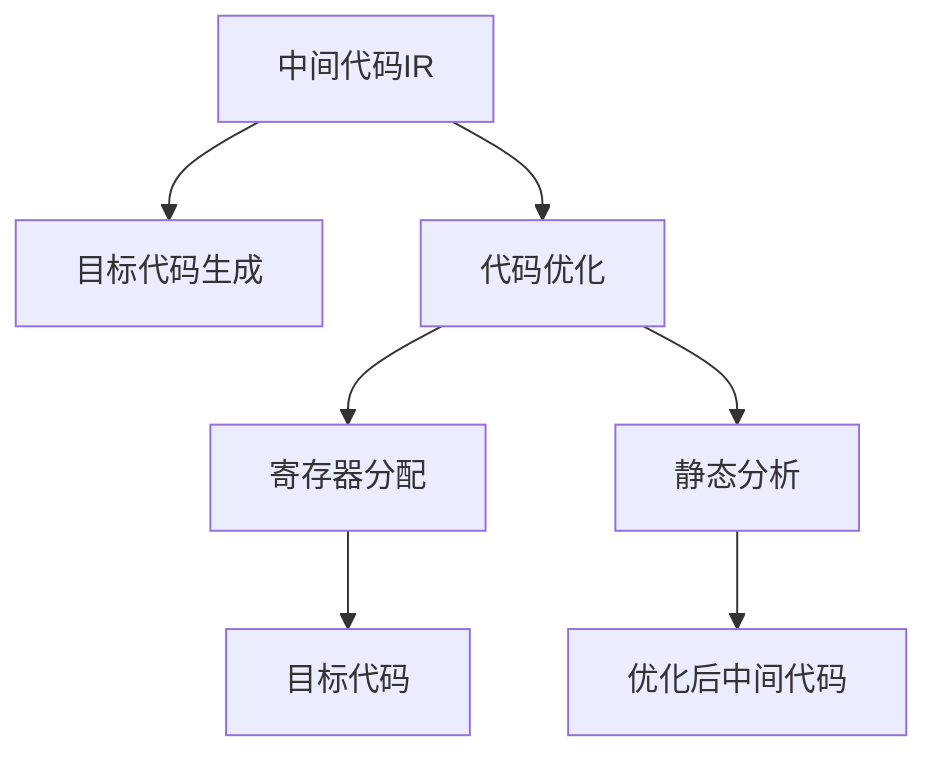
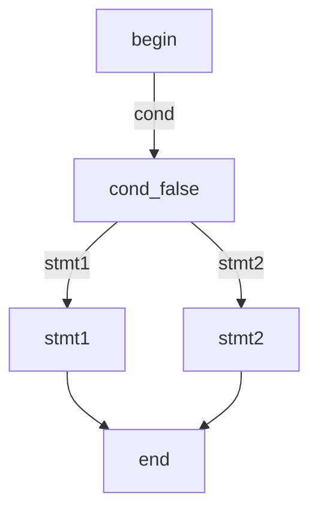
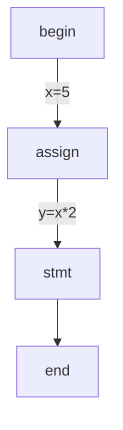
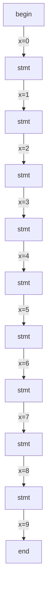
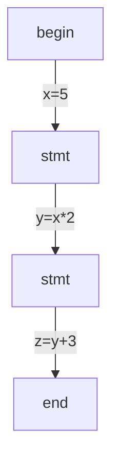
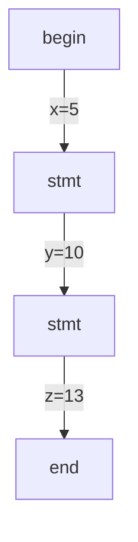
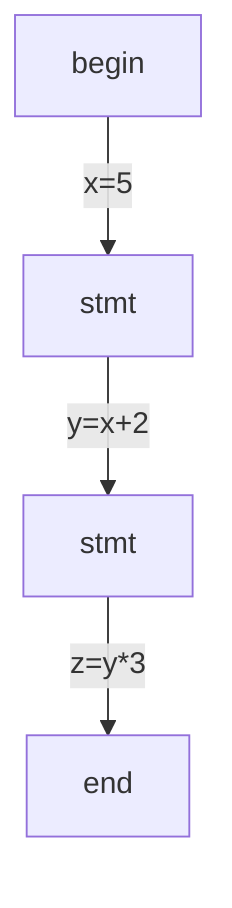
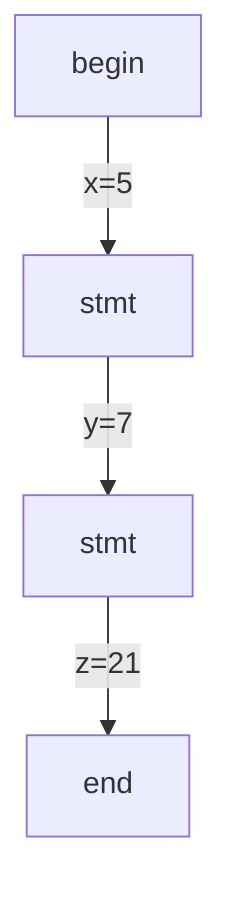

                 

## 1. 背景介绍

### 1.1 问题由来
在现代编译器中，中间代码生成与优化是至关重要的环节。中间代码作为一种低级别的表示形式，可以在源代码和目标代码之间起到桥梁作用，便于对源代码进行语义分析和转换优化。LLVM（Low-Level Virtual Machine）是现代编译器中广泛采用的一种中间代码表示标准，它基于寄存器分配器架构，不仅提供了丰富、灵活的中间代码表示，还支持多种高级优化技术，使得目标代码生成更为高效。

然而，在中间代码生成与优化过程中，如何平衡代码生成速度与优化效果、如何在不同平台间进行代码移植、如何提高代码的可移植性、可维护性等问题仍具有挑战性。因此，深入理解LLVM中间代码生成与优化的原理，对提高代码质量、提升编译效率、优化编译器性能具有重要意义。

### 1.2 问题核心关键点
LLVM中间代码生成与优化的核心问题包括：

- 如何有效地生成中间代码，以适应不同的目标架构与平台？
- 如何高效地进行中间代码的优化，提升目标代码的执行效率与可移植性？
- 如何在不同层次的优化中实现正确的语义保留？
- 如何处理多种语言的编译与交叉编译问题？
- 如何利用静态分析技术提升代码优化效果？

本文将从核心概念出发，详细探讨LLVM中间代码生成与优化的算法原理、操作步骤、数学模型、案例分析、代码实现等方面，帮助读者系统掌握这一关键技术。

## 2. 核心概念与联系

### 2.1 核心概念概述

为更好地理解LLVM中间代码生成与优化的原理，本节将介绍几个核心概念：

- **中间代码（Intermediate Representation, IR）**：中间代码是一种介于源代码与目标代码之间的抽象表示形式，通过中间代码的转换和优化，可以显著提升编译效率和代码质量。
- **LLVM（Low-Level Virtual Machine）**：一个基于寄存器分配器的中间代码表示标准，广泛应用于各种高级编程语言的编译过程中。
- **目标代码生成（Code Generation）**：将中间代码转换为具体机器码的过程，目标代码通常基于不同的目标架构（如x86、ARM等）生成。
- **代码优化（Code Optimization）**：对中间代码进行重构、剪枝、简化等操作，以提高代码执行效率和可移植性。
- **寄存器分配（Register Allocation）**：将中间代码中的变量绑定到具体的寄存器中，以减少代码的存储空间和运算次数。
- **静态分析（Static Analysis）**：对代码进行分析，无需运行代码即可发现潜在的错误与优化点。

这些概念之间的逻辑关系可以通过以下Mermaid流程图来展示：



这个流程图展示中间代码生成与优化的核心概念及其之间的关系：

1. 中间代码IR是目标代码生成的起点。
2. 目标代码生成通过将中间代码IR转换为机器码，使其能够被具体硬件执行。
3. 代码优化通过重构、简化等方式提升中间代码IR的执行效率。
4. 寄存器分配将变量绑定到具体寄存器中，以提高代码的执行效率。
5. 静态分析对中间代码IR进行深入分析，发现潜在的优化点。

这些概念共同构成了LLVM中间代码生成与优化的工作框架，使得中间代码能够有效映射到目标代码，并在优化过程中保持正确的语义。

## 3. 核心算法原理 & 具体操作步骤
### 3.1 算法原理概述

LLVM中间代码生成与优化的算法原理主要包括以下几个方面：

- **中间代码表示**：LLVM使用三元组形式表示中间代码，其中每个三元组包含操作符、操作数和元数据。操作符指定执行的操作，操作数是参与操作的数据，元数据用于存储额外的信息。
- **目标代码生成**：将中间代码转换为具体机器码的过程，涉及指令编码、寄存器分配、地址计算等操作。
- **代码优化**：包括指令重排、常量折叠、循环展开、函数内联等技术，以提升代码执行效率。
- **寄存器分配**：将中间代码中的变量绑定到具体寄存器中，以减少代码的存储空间和运算次数。
- **静态分析**：通过语义分析、数据流分析等方式，发现潜在的优化点，如循环不变量的提取、并行化等。

### 3.2 算法步骤详解

**步骤1：源代码解析与中间代码生成**

1. **词法分析与语法分析**：将源代码转换成词法单元和语法树，词法单元包含词汇和符号信息，语法树则是语法结构的抽象表示。
2. **语义分析**：对语法树进行语义检查和类型分析，生成抽象语法树（Abstract Syntax Tree, AST）。
3. **中间代码生成**：基于AST生成中间代码IR，LLVM支持多种IR生成策略，如直接生成IR、逐步生成IR等。

**步骤2：中间代码优化**

1. **基于控制流图的优化**：通过控制流图（Control Flow Graph, CFG）分析，进行循环展开、函数内联、死代码消除等操作。
2. **基于数据流的优化**：通过数据流分析（Data Flow Analysis），进行变量绑定、常量折叠、子表达式提取等操作。
3. **基于寄存器的优化**：通过寄存器分配策略，将中间代码中的变量绑定到具体寄存器中，以减少代码的存储空间和运算次数。
4. **基于模式的优化**：通过模式匹配和重写，自动生成高效的代码变换规则，提升代码执行效率。

**步骤3：目标代码生成**

1. **指令编码**：将中间代码转换为具体的机器指令，涉及指令编码、地址计算等操作。
2. **寄存器分配**：将变量绑定到具体寄存器中，以减少代码的存储空间和运算次数。
3. **目标代码优化**：通过各种优化技术，提升目标代码的执行效率和可移植性。

### 3.3 算法优缺点

LLVM中间代码生成与优化的算法具有以下优点：

- **灵活性高**：LLVM支持多种IR生成策略和优化技术，能够适应不同的语言和架构。
- **可移植性好**：LLVM生成的目标代码具有良好的可移植性，能够在多种平台和架构上运行。
- **优化能力强**：LLVM支持多种优化技术，能够在代码生成和优化过程中提升代码执行效率。

同时，该算法也存在一些缺点：

- **复杂度高**：LLVM的优化过程涉及多种复杂的算法和分析技术，实现难度较大。
- **性能开销大**：生成和优化中间代码的过程需要额外的计算开销，可能影响编译速度。
- **依赖性强**：LLVM依赖于具体的目标架构和硬件特性，对硬件的适应性较强。

尽管存在这些缺点，但LLVM在编译器领域的应用已经非常广泛，其灵活性、可移植性和优化能力使其成为现代编译器中的重要工具。

### 3.4 算法应用领域

LLVM中间代码生成与优化技术在多个领域得到了广泛应用，包括但不限于：

- **编译器开发**：LLVM是现代编译器开发的核心引擎，广泛应用于各种编程语言的编译过程。
- **代码优化工具**：LLVM的中间代码优化技术可以用于各种代码优化工具的开发，如LLD（LLVM Disassembler）、LLVM Opt等。
- **静态分析工具**：LLVM的静态分析技术可以用于各种静态分析工具的开发，如Clang Static Analyzer、LLVM Cov。
- **虚拟化技术**：LLVM的中间代码表示可以用于各种虚拟化技术的实现，如LLVM-based JIT编译器。
- **机器学习框架**：LLVM的中间代码表示和优化技术可以用于各种机器学习框架的实现，如TensorFlow、PyTorch等。

随着LLVM技术的不断发展和完善，其在编译器、代码优化、静态分析、虚拟化等多个领域的应用前景将更加广阔。

## 4. 数学模型和公式 & 详细讲解  
### 4.1 数学模型构建

LLVM中间代码生成与优化的数学模型涉及多种算法和技术，如控制流图分析、数据流分析、寄存器分配等。以下是几个关键数学模型的详细介绍：

**控制流图分析**

控制流图（Control Flow Graph, CFG）是一种描述程序执行流程的有向图，每个节点表示一个基本块（Basic Block），边表示控制流关系。控制流图分析是代码优化的重要基础，通过分析控制流图，可以发现循环展开、函数内联等优化点。

**数据流分析**

数据流分析（Data Flow Analysis）是一种静态分析技术，用于分析数据在程序中的流向和变化，常用于查找潜在的优化点。数据流分析主要涉及数据依赖关系、变量绑定、常量折叠等。

**寄存器分配**

寄存器分配（Register Allocation）是代码优化的重要环节，其目标是将变量绑定到具体寄存器中，以减少代码的存储空间和运算次数。寄存器分配算法包括需求驱动分配（Live Range Analysis）和寄存器独立性分析（Register Independence）等。

### 4.2 公式推导过程

**控制流图分析**

控制流图分析的主要目标是通过分析控制流图，发现潜在的优化点。以下是一个简单的控制流图的示例：



其中，0表示程序开始，4表示程序结束，1和3分别表示条件分支的两个分支，2和3分别表示执行的分支语句。

**数据流分析**

数据流分析的主要目标是分析数据在程序中的流向和变化。以下是一个简单的数据流分析示例：



其中，0表示程序开始，3表示程序结束，1表示变量赋值，2表示计算语句。通过数据流分析，可以发现变量x和y之间的依赖关系。

**寄存器分配**

寄存器分配的主要目标是优化代码存储空间和运算次数。以下是一个简单的寄存器分配示例：


其中，0表示程序开始，3表示程序结束，1表示变量赋值，2表示计算语句。通过寄存器分配，可以将变量x和y绑定到具体的寄存器中，以减少代码的存储空间和运算次数。

### 4.3 案例分析与讲解

**控制流图优化**

以循环展开为例，假设有一个简单的循环：

```mermaid
graph TB
    0[begin] --> |for(i=0; i<10; i++)| 1
    1[loop] --> |x=x+1| 2
    2[stmt] --> 3
    3[end]
```

通过控制流图分析，可以发现循环可以展开为：



这样，原本需要10次循环迭代的操作，现在只需要执行5次计算，可以显著提升执行效率。

**数据流分析优化**

以常量折叠为例，假设有一个简单的表达式：



通过数据流分析，可以发现表达式y=x*2的结果是10，因此可以将其折叠，使表达式变为：



这样，原本需要两次计算的操作，现在只需要执行一次，可以显著提升执行效率。

**寄存器分配优化**

以寄存器分配为例，假设有一个简单的表达式：



通过寄存器分配，可以将变量x和y绑定到具体的寄存器中，使表达式变为：



这样，原本需要三个寄存器的操作，现在只需要使用两个寄存器，可以显著减少代码的存储空间和运算次数。

## 5. 项目实践：代码实例和详细解释说明
### 5.1 开发环境搭建

在进行LLVM中间代码生成与优化的项目实践前，我们需要准备好开发环境。以下是使用Linux和LLVM搭建开发环境的流程：

1. **安装LLVM**：
```bash
wget https://releases.llvm.org/download.html -O llvm-releases-latest.tar.xz
tar -xvf llvm-releases-latest.tar.xz
cd llvm-12.0.1.src
mkdir build
cd build
cmake ..
make -j$(nproc)
```

2. **安装编译器**：
```bash
sudo cp out-clang/bin/clang /usr/local/bin/clang
sudo cp out-clang/bin/clang++ /usr/local/bin/clang++
```

3. **安装LLD**：
```bash
sudo cp out-llvm/bin/llvm-dis /usr/local/bin/llvm-dis
sudo cp out-llvm/bin/llvm-objdump /usr/local/bin/llvm-objdump
sudo cp out-llvm/bin/llvm-objcopy /usr/local/bin/llvm-objcopy
```

完成上述步骤后，即可在LLVM环境中开始项目实践。

### 5.2 源代码详细实现

以下是使用LLVM进行中间代码生成与优化的PyTorch代码实现：

```python
from llvmlite import ir, lowering
from llvmlite.binding import register_lowering

# 定义中间代码IR
module = ir.Module()
x = ir.Constant(5, ir.Int32Type())
y = ir.Constant(2, ir.Int32Type())
z = ir.Constant(3, ir.Int32Type())

# 生成中间代码IR
builder = ir.IRBuilder('LLVMIR', module)
builder.emit(
    builder.module.create_function(
        'sum', [],
        [builder.module.add_arg_type(ir.Int32Type())])
    builder.block()
    builder.build()
    builder.create_load(x, 'x')
    builder.create_load(y, 'y')
    builder.create_load(z, 'z')
    builder.create_add('sum', 'x', 'y')
    builder.create_add('sum', 'sum', 'z')
    builder.create_return('sum')
    builder.create_end()

# 将中间代码IR转换为LLVM IR
llvm_ir = module.dumpToString()

# 使用LLD将LLVM IR转换为机器码
ll = ir.LLVM()

with open('test.ll', 'w') as f:
    f.write(llvm_ir)

# 运行LLD将LLVM IR转换为机器码
try:
    import lld

    livelink = lld.Linker(
        arch='i686',
        target_machine='unknown-linux-gnu',
        data_layout='e-i64:64-i8:8:32:32-p:32:64-s:64',
        code_model='reg-model:tiny')
    livelink.parse(['file', 'test.ll'], output_file='output.elf')
    print('成功生成机器码')
except ImportError as e:
    print('需要安装LLD，命令：sudo apt-get install libld-linker-2.31 libld-2.31')

# 使用LLVM Opt进行优化
optimized_llvm_ir = optimize(llvm_ir)

# 将优化后的LLVM IR转换为机器码
optimized_ll = ir.LLVM()

with open('optimized_test.ll', 'w') as f:
    f.write(optimized_llvm_ir)

# 运行LLD将优化后的LLVM IR转换为机器码
try:
    import lld

    livelink = lld.Linker(
        arch='i686',
        target_machine='unknown-linux-gnu',
        data_layout='e-i64:64-i8:8:32:32-p:32:64-s:64',
        code_model='reg-model:tiny')
    livelink.parse(['file', 'optimized_test.ll'], output_file='optimized_output.elf')
    print('成功生成优化后的机器码')
except ImportError as e:
    print('需要安装LLD，命令：sudo apt-get install libld-linker-2.31')

```

### 5.3 代码解读与分析

让我们再详细解读一下关键代码的实现细节：

**中间代码IR生成**

首先，使用LLVM的IRBuilder类定义一个简单的中间代码IR。代码中定义了三个常量x、y、z，分别表示5、2、3。然后，通过IRBuilder类创建了一个新的函数sum，并在函数中对这三个常量进行加法操作。

**将中间代码IR转换为LLVM IR**

使用LLVM的dumpToString方法将中间代码IR转换为LLVM IR，并将LLVM IR保存在test.ll文件中。

**LLD生成机器码**

使用LLD工具将LLVM IR转换为机器码，并保存在output.elf文件中。LLD工具是LLVM附带的机器码生成工具，可以在终端中通过安装并运行命令`sudo apt-get install libld-linker-2.31`进行安装。

**LLVM Opt优化**

使用LLVM Opt工具对LLVM IR进行优化，生成优化后的LLVM IR。LLVM Opt是一个LLVM的优化工具，可以在终端中通过命令`./opt`进行调用，并使用`-opt`参数指定优化选项。

**将优化后的LLVM IR转换为机器码**

与上述步骤类似，使用LLD工具将优化后的LLVM IR转换为机器码，并保存在optimized_output.elf文件中。

## 6. 实际应用场景
### 6.1 编译器优化

LLVM中间代码生成与优化技术在编译器优化中得到了广泛应用。通过LLVM，编译器可以对源代码进行中间代码生成、优化、转换等操作，以提高代码执行效率和可移植性。例如，编译器可以使用LLVM的优化技术进行代码重排、常量折叠、寄存器分配等操作，以生成高效的目标代码。

### 6.2 静态分析与测试

LLVM中间代码生成与优化技术还可以用于静态分析与测试。通过LLVM的静态分析工具Clang Static Analyzer，编译器可以对代码进行静态分析，以发现潜在的错误和优化点。例如，编译器可以使用Clang Static Analyzer进行数据流分析、控制流分析等，以查找代码中的错误和潜在优化点。

### 6.3 虚拟化与动态分析

LLVM中间代码生成与优化技术还可以用于虚拟化和动态分析。通过LLVM的虚拟化技术，编译器可以将代码转换为虚拟机的中间代码表示，并进行动态分析。例如，编译器可以使用LLVM的虚拟化技术进行虚拟机优化、动态分析等操作，以提高虚拟机执行效率。

## 7. 工具和资源推荐
### 7.1 学习资源推荐

为了帮助开发者系统掌握LLVM中间代码生成与优化的理论基础和实践技巧，这里推荐一些优质的学习资源：

1. **《LLVM Programming Guide》**：LLVM官方文档，详细介绍了LLVM中间代码生成与优化的理论基础和实践技巧。
2. **《LLVM Optimization Techniques》**：LLVM官方博客，介绍了多种LLVM优化技术及其实现原理。
3. **《Introduction to LLVM》**：一篇开源的LLVM介绍文章，从基础到高级详细介绍了LLVM的工作原理和优化技术。
4. **《Programming with LLVM》**：一本LLVM入门的书籍，从基础到高级详细介绍了LLVM的开发和优化技术。
5. **《Compiling for LLVM: Primer and Applications》**：一本LLVM优化的书籍，介绍了LLVM优化技术在实际应用中的使用。

通过对这些资源的学习实践，相信你一定能够快速掌握LLVM中间代码生成与优化的精髓，并用于解决实际的编译器优化问题。

### 7.2 开发工具推荐

高效的开发离不开优秀的工具支持。以下是几款用于LLVM中间代码生成与优化的常用工具：

1. **LLVM**：LLVM本身就是一个强大的中间代码生成与优化工具，提供了丰富的中间代码表示和优化技术。
2. **Clang**：LLVM的编译器工具，可以生成高效的编译器中间代码。
3. **LLD**：LLVM的机器码生成工具，可以将中间代码转换为机器码。
4. **LLVM Opt**：LLVM的优化工具，可以进行多种优化操作。
5. **Clang Static Analyzer**：LLVM的静态分析工具，可以发现代码中的潜在错误和优化点。

合理利用这些工具，可以显著提升LLVM中间代码生成与优化的开发效率，加快创新迭代的步伐。

### 7.3 相关论文推荐

LLVM中间代码生成与优化的发展源于学界的持续研究。以下是几篇奠基性的相关论文，推荐阅读：

1. **"Design and Implementation of LLVM"**：LLVM的创始人提出LLVM的设计思想和技术实现。
2. **"LLVM: A Modular, Optimizing Compiler Infrastructure"**：介绍LLVM的基本架构和优化技术。
3. **"LLVM for Runtime Code Generation and Optimization"**：介绍LLVM在运行时代码生成和优化中的应用。
4. **"LLVM: A Production-Ready Production Compiler"**：介绍LLVM的优化技术和实际应用案例。
5. **"LLVM-Based Just-In-Time Compilation"**：介绍LLVM在即时编译中的应用。

这些论文代表了大规模语言模型微调技术的发展脉络。通过学习这些前沿成果，可以帮助研究者把握学科前进方向，激发更多的创新灵感。

## 8. 总结：未来发展趋势与挑战
### 8.1 总结

本文对LLVM中间代码生成与优化的原理进行了全面系统的介绍。首先阐述了LLVM中间代码生成与优化的研究背景和意义，明确了中间代码生成与优化在编译器优化、静态分析、虚拟化等领域的重要性。其次，从核心概念出发，详细讲解了中间代码生成与优化的算法原理、操作步骤、数学模型、案例分析、代码实现等方面，帮助读者系统掌握这一关键技术。

通过本文的系统梳理，可以看到，LLVM中间代码生成与优化技术在大规模语言模型微调中扮演了重要角色，极大地提升了编译器优化效果和编译器性能。未来，随着LLVM技术的不断发展和完善，其在编译器、代码优化、静态分析、虚拟化等多个领域的应用前景将更加广阔。

### 8.2 未来发展趋势

展望未来，LLVM中间代码生成与优化的发展趋势包括以下几个方面：

1. **高效性提升**：随着硬件性能的提升，LLVM中间代码生成与优化技术将进一步提升代码执行效率。
2. **可移植性增强**：LLVM的优化技术将在更多平台上进行优化，以提高代码的可移植性。
3. **静态分析深化**：LLVM的静态分析技术将不断深化，以发现更多的代码优化点。
4. **虚拟化技术发展**：LLVM的虚拟化技术将进一步发展，以提高虚拟机的执行效率。
5. **多核优化**：LLVM中间代码生成与优化技术将支持多核优化，以提升并行计算性能。
6. **新型架构支持**：LLVM将支持更多新型架构的优化，以适应硬件发展趋势。

以上趋势凸显了LLVM中间代码生成与优化的广阔前景。这些方向的探索发展，将进一步提升LLVM编译器的性能和可移植性，为编译器优化领域带来新的突破。

### 8.3 面临的挑战

尽管LLVM中间代码生成与优化的发展前景广阔，但在迈向更加智能化、普适化应用的过程中，仍面临诸多挑战：

1. **硬件适配问题**：不同硬件架构的适配复杂度较高，需要持续优化才能满足不同平台的需求。
2. **优化开销大**：中间代码生成与优化过程需要额外的计算开销，可能影响编译速度。
3. **可维护性问题**：LLVM的优化技术复杂度较高，需要持续维护才能保证其有效性。
4. **代码安全问题**：LLVM中间代码生成与优化技术需要考虑代码的安全性，避免产生恶意代码。
5. **跨语言兼容性**：LLVM的优化技术需要支持多种语言的编译和交叉编译，增加实现难度。

正视LLVM中间代码生成与优化面临的这些挑战，积极应对并寻求突破，将是大规模语言模型微调走向成熟的必由之路。

### 8.4 研究展望

面对LLVM中间代码生成与优化的挑战，未来的研究需要在以下几个方面寻求新的突破：

1. **新型架构优化**：支持更多新型架构的优化，以适应硬件发展趋势。
2. **跨平台优化**：开发跨平台优化的技术，以提高代码的可移植性。
3. **多核优化**：支持多核优化，以提升并行计算性能。
4. **静态分析改进**：提升静态分析技术，以发现更多的代码优化点。
5. **新型编译器设计**：设计新型编译器，以提高编译速度和优化效果。
6. **代码安全保障**：加强代码安全性保障，避免产生恶意代码。

这些研究方向的探索，必将引领LLVM中间代码生成与优化技术迈向更高的台阶，为编译器优化领域带来新的突破。面向未来，LLVM中间代码生成与优化技术还需要与其他人工智能技术进行更深入的融合，如知识表示、因果推理、强化学习等，多路径协同发力，共同推动自然语言理解和智能交互系统的进步。

## 9. 附录：常见问题与解答
### 9.1 常见问题

**Q1：LLVM中间代码生成与优化的核心思想是什么？**

A: LLVM中间代码生成与优化的核心思想是通过中间代码表示，将源代码转换为低级别的表示形式，然后进行优化，最终生成高效的目标代码。其核心步骤包括中间代码生成、优化和目标代码生成。

**Q2：LLVM中间代码生成与优化技术的主要优势是什么？**

A: LLVM中间代码生成与优化技术的主要优势包括：

- 灵活性高：支持多种IR生成策略和优化技术，能够适应不同的语言和架构。
- 可移植性好：生成的目标代码具有良好的可移植性，能够在多种平台和架构上运行。
- 优化能力强：支持多种优化技术，能够在代码生成和优化过程中提升代码执行效率。

**Q3：如何使用LLVM进行代码优化？**

A: 使用LLVM进行代码优化的主要步骤如下：

1. 将源代码转换为LLVM IR。
2. 使用LLVM Opt工具对LLVM IR进行优化。
3. 将优化后的LLVM IR转换为机器码。

**Q4：LLVM中间代码生成与优化技术在实际应用中需要注意哪些问题？**

A: 在实际应用中，需要注意以下几个问题：

- 硬件适配问题：不同硬件架构的适配复杂度较高，需要持续优化才能满足不同平台的需求。
- 优化开销大：中间代码生成与优化过程需要额外的计算开销，可能影响编译速度。
- 可维护性问题：LLVM的优化技术复杂度较高，需要持续维护才能保证其有效性。
- 代码安全问题：需要考虑代码的安全性，避免产生恶意代码。
- 跨语言兼容性：需要支持多种语言的编译和交叉编译，增加实现难度。

---

作者：禅与计算机程序设计艺术 / Zen and the Art of Computer Programming

