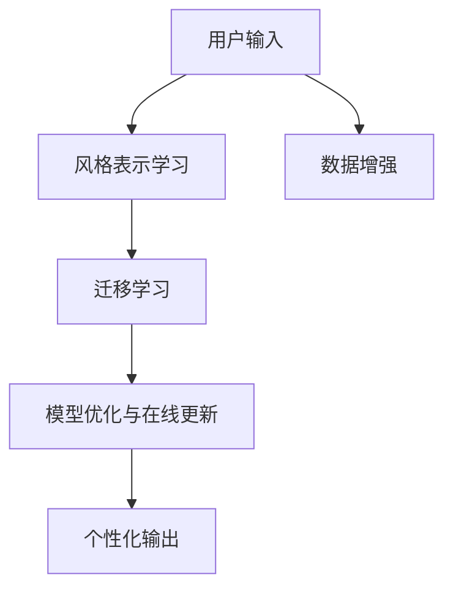

                 

# 个性化AI：适应用户风格的语言模型

> 关键词：个性化AI, 用户风格, 语言模型, 适应性, 数据增强, 迁移学习, 自然语言处理(NLP), 深度学习

## 1. 背景介绍

### 1.1 问题由来

随着人工智能技术的迅猛发展，自然语言处理(Natural Language Processing, NLP)领域也在不断进步。语言模型，尤其是基于Transformer架构的预训练语言模型，已经成为了NLP领域的基石。这些模型在处理大规模文本数据时表现出色，可以自动地从语料中学习到语言的规律和特点。然而，这些通用预训练语言模型在适应用户个性化需求时仍存在诸多局限。

首先，预训练语言模型往往基于大规模通用文本数据，缺乏对用户个体特点的深入理解。这种模型在处理具有强烈个人风格或特定领域的内容时，可能会产生一定的偏差。其次，用户在不同时间、场合下，其表达风格和语言使用习惯也会有所不同。通用的语言模型难以实时适应用户风格的变化，导致在用户个性化需求较高的场景下，无法提供最佳的服务体验。

为解决这一问题，研究人员提出了个性化AI的概念，即通过适应用户风格，提升语言模型的智能水平，使其能够更好地满足用户的个性化需求。个性化AI的目标是在保持预训练模型通用性和泛化能力的基础上，进一步增强其适应性和灵活性。

### 1.2 问题核心关键点

个性化AI的核心在于如何适应用户的个性化风格，从而使语言模型在处理不同用户输入时，能够提供更为精准和自然的输出。这涉及到以下几个关键点：

- 数据增强与迁移学习：通过收集和处理用户个性化数据，增强模型的泛化能力，并在不同用户间进行迁移学习，适应不同的用户风格。
- 风格表示学习：通过学习用户输入和输出的模式，捕捉用户特定的语言风格特征。
- 模型优化与在线更新：在模型训练过程中，加入风格表示优化模块，并在用户交互过程中，进行模型在线更新和适配。

### 1.3 问题研究意义

研究个性化AI对于提升用户体验、推动AI技术的普及和应用具有重要意义：

1. **提升用户体验**：个性化AI可以更好地适应用户的个性化需求，提供更为精准和自然的交互体验，提升用户的满意度和忠诚度。
2. **加速技术应用**：通过适应用户风格，AI技术可以更快地融入各个垂直行业，推动NLP技术的产业化和落地应用。
3. **驱动创新**：个性化AI需要结合多领域知识，如心理学、社会学等，推动相关学科的发展，促进跨学科研究。
4. **增强安全性**：个性化AI可以根据用户行为和偏好，提高AI系统的安全性，减少误判和误操作的风险。

## 2. 核心概念与联系

### 2.1 核心概念概述

为更好地理解个性化AI，我们首先介绍几个核心概念：

- **个性化AI**：指通过适应用户风格，使AI模型能够更好地匹配用户个性化需求，提升用户体验的技术。
- **用户风格**：指用户独特的语言习惯、表达风格、情感特征等。通过学习用户风格，AI可以更好地适应用户的个性化需求。
- **风格表示学习**：指通过学习用户输入和输出的模式，捕捉用户特定的语言风格特征，并建立相应的表示空间。
- **迁移学习**：指将从一个任务中学到的知识，应用到另一个任务中，提升模型的泛化能力。
- **数据增强**：指通过各种方式丰富训练集，提高模型的泛化能力和鲁棒性。

这些概念之间的关系可以通过以下Mermaid流程图来展示：



这个流程图展示了个性化AI的核心概念及其之间的关系：

1. 用户输入首先通过风格表示学习，捕捉用户的特定风格。
2. 然后通过迁移学习，将风格知识迁移到不同的任务中，增强模型的泛化能力。
3. 数据增强用于丰富训练集，进一步提升模型的鲁棒性。
4. 模型优化与在线更新是整个过程中不断迭代优化的关键步骤。
5. 最终，通过个性化输出，模型能够提供适应用户风格的智能服务。

## 3. 核心算法原理 & 具体操作步骤

### 3.1 算法原理概述

个性化AI的核心算法原理是结合风格表示学习、迁移学习和模型优化与在线更新等技术，通过适应用户风格，提升语言模型的智能水平。其核心思想是：将通用预训练语言模型看作一个通用的"特征提取器"，通过学习用户个性化数据，构建用户风格表示，并将这些表示应用到下游任务中，提升模型在特定任务上的性能。

具体来说，个性化AI的算法步骤如下：

1. **数据收集与预处理**：收集用户个性化数据，如聊天记录、邮件、社交媒体等，并进行预处理，如分词、去噪等。
2. **风格表示学习**：通过自监督学习任务，学习用户输入和输出的模式，捕捉用户的特定风格特征，并构建风格表示。
3. **迁移学习**：将风格表示应用到下游任务中，如问答、对话生成等，提升模型在特定任务上的性能。
4. **模型优化与在线更新**：在模型训练过程中，加入风格表示优化模块，并在用户交互过程中，进行模型在线更新和适配。
5. **个性化输出**：根据用户输入和模型输出，提供个性化推荐和建议。

### 3.2 算法步骤详解

#### 3.2.1 数据收集与预处理

数据收集与预处理是个性化AI的基础步骤，具体包括：

1. **数据来源**：收集用户的聊天记录、邮件、社交媒体等个性化数据，并确保数据的多样性和代表性。
2. **数据清洗**：去除无关信息，如停用词、噪声等，确保数据质量。
3. **数据增强**：通过回译、替换等技术，丰富训练集的多样性，提升模型的泛化能力。

#### 3.2.2 风格表示学习

风格表示学习的目的是捕捉用户特定的语言风格特征，具体步骤如下：

1. **自监督学习**：选择与用户风格相关的自监督学习任务，如语言模型预测、文本相似度计算等，训练模型学习用户输入和输出的模式。
2. **风格特征提取**：通过分析用户输入和输出的模式，提取用户特定的风格特征，如情感倾向、语言风格等。
3. **风格表示构建**：将提取的风格特征进行编码，构建用户特定的风格表示向量。

#### 3.2.3 迁移学习

迁移学习是将风格表示应用到下游任务中，提升模型在特定任务上的性能，具体步骤如下：

1. **模型适配**：选择与用户风格相关的下游任务，如问答、对话生成等，并在预训练模型基础上，适配模型输出层和损失函数。
2. **风格迁移**：在微调过程中，加入风格表示优化模块，引导模型学习用户特定的风格特征，提升模型在特定任务上的性能。
3. **性能评估**：在验证集上评估模型的性能，调整模型的超参数，优化模型结构。

#### 3.2.4 模型优化与在线更新

模型优化与在线更新是个性化AI的关键步骤，具体步骤如下：

1. **模型训练**：在训练集上，使用风格表示优化模块，训练模型学习用户特定的风格特征。
2. **在线更新**：在用户交互过程中，实时更新模型，适应用户风格的变化。
3. **性能监控**：实时监控模型的性能指标，如准确率、召回率等，确保模型始终处于最优状态。

#### 3.2.5 个性化输出

个性化输出的目的是根据用户输入和模型输出，提供个性化的推荐和建议，具体步骤如下：

1. **用户输入分析**：分析用户输入的内容、情感和风格特征，识别用户的具体需求和意图。
2. **风格表示应用**：将用户输入的特征向量与模型中存储的用户风格表示进行匹配，计算相似度。
3. **输出生成**：根据相似度结果，生成最匹配用户风格的结果，作为个性化推荐。

### 3.3 算法优缺点

个性化AI具有以下优点：

1. **提升用户体验**：通过适应用户风格，提供更为精准和自然的交互体验，提升用户的满意度和忠诚度。
2. **加速技术应用**：通过适应用户风格，AI技术可以更快地融入各个垂直行业，推动NLP技术的产业化和落地应用。
3. **驱动创新**：个性化AI需要结合多领域知识，如心理学、社会学等，推动相关学科的发展，促进跨学科研究。
4. **增强安全性**：个性化AI可以根据用户行为和偏好，提高AI系统的安全性，减少误判和误操作的风险。

个性化AI也存在以下缺点：

1. **数据隐私问题**：在收集和处理用户个性化数据时，需要确保数据的安全性和隐私性。
2. **计算资源需求高**：风格表示学习、迁移学习等步骤需要大量的计算资源，增加了系统复杂性和成本。
3. **模型泛化能力受限**：用户风格特征的提取和表示可能存在一定的主观性和不确定性，影响模型的泛化能力。

### 3.4 算法应用领域

个性化AI已经在多个领域得到了广泛应用，以下是几个典型的应用场景：

1. **智能客服**：通过适应用户风格，智能客服系统可以提供更为个性化和自然的对话体验，提升用户满意度。
2. **个性化推荐**：在个性化推荐系统中，通过适应用户风格，推荐系统可以提供更为精准和符合用户喜好的内容。
3. **情感分析**：在情感分析任务中，通过适应用户风格，可以更准确地识别用户的情感倾向，提升分析结果的准确性。
4. **对话生成**：在对话生成任务中，通过适应用户风格，生成更为自然和符合用户习惯的对话内容。

## 4. 数学模型和公式 & 详细讲解 & 举例说明

### 4.1 数学模型构建

个性化AI的数学模型主要包含以下几个部分：

1. **用户风格表示**：$style_{u}$，表示用户 $u$ 的特定风格特征。
2. **模型输出表示**：$rep_{\theta}(x)$，表示模型在输入 $x$ 上的表示向量。
3. **损失函数**：$L(y, \hat{y})$，表示模型预测结果与真实标签之间的差异。

### 4.2 公式推导过程

#### 4.2.1 风格表示学习

假设用户输入为 $x$，用户输出为 $y$，模型预测结果为 $\hat{y}$。通过自监督学习任务，学习用户输入和输出的模式，捕捉用户特定的风格特征，可以构建用户风格表示 $style_{u}$。具体公式如下：

$$
style_{u} = f(x, y)
$$

其中，$f$ 为风格表示学习函数。

#### 4.2.2 迁移学习

在迁移学习过程中，将用户风格表示 $style_{u}$ 应用到下游任务中，提升模型在特定任务上的性能。具体公式如下：

$$
rep_{\theta}(x) = M_{\theta}(x) \cdot style_{u}
$$

其中，$M_{\theta}$ 为下游任务的微调模型，$rep_{\theta}(x)$ 表示模型在输入 $x$ 上的表示向量。

#### 4.2.3 模型优化与在线更新

在模型优化与在线更新过程中，加入风格表示优化模块，实时更新模型，适应用户风格的变化。具体公式如下：

$$
\theta \leftarrow \theta - \eta \nabla_{\theta}L(rep_{\theta}(x), y)
$$

其中，$\eta$ 为学习率，$\nabla_{\theta}L$ 为损失函数对模型参数 $\theta$ 的梯度。

### 4.3 案例分析与讲解

假设用户输入为一段文本，如 "我喜欢吃寿司，但不喜欢海鲜"，风格表示学习模型可以提取用户输入的情感倾向和语言风格特征。迁移学习模型可以学习到用户喜欢的食物类别，并生成相应的对话回复。具体实现步骤如下：

1. **用户输入**："I like sushi but I don't like seafood."
2. **风格表示学习**：通过自监督学习任务，提取用户输入的情感倾向和语言风格特征，构建用户风格表示 $style_{u}$。
3. **迁移学习**：在微调模型上，使用用户风格表示 $style_{u}$ 进行迁移学习，生成相应的对话回复。
4. **模型优化与在线更新**：实时更新模型，适应用户风格的变化。
5. **个性化输出**：根据用户输入和模型输出，提供个性化的推荐和建议。

## 5. 项目实践：代码实例和详细解释说明

### 5.1 开发环境搭建

在进行个性化AI实践前，我们需要准备好开发环境。以下是使用Python进行PyTorch开发的环境配置流程：

1. 安装Anaconda：从官网下载并安装Anaconda，用于创建独立的Python环境。

2. 创建并激活虚拟环境：
```bash
conda create -n personalize-env python=3.8 
conda activate personalize-env
```

3. 安装PyTorch：根据CUDA版本，从官网获取对应的安装命令。例如：
```bash
conda install pytorch torchvision torchaudio cudatoolkit=11.1 -c pytorch -c conda-forge
```

4. 安装相关库：
```bash
pip install transformers pandas sklearn
```

5. 安装其他工具包：
```bash
pip install numpy matplotlib tqdm
```

完成上述步骤后，即可在`personalize-env`环境中开始个性化AI的实践。

### 5.2 源代码详细实现

这里我们以情感分析任务为例，给出使用Transformers库对BERT模型进行个性化AI的PyTorch代码实现。

首先，定义情感分析任务的数据处理函数：

```python
from transformers import BertTokenizer
from torch.utils.data import Dataset
import torch

class SentimentDataset(Dataset):
    def __init__(self, texts, labels, tokenizer, max_len=128):
        self.texts = texts
        self.labels = labels
        self.tokenizer = tokenizer
        self.max_len = max_len
        
    def __len__(self):
        return len(self.texts)
    
    def __getitem__(self, item):
        text = self.texts[item]
        label = self.labels[item]
        
        encoding = self.tokenizer(text, return_tensors='pt', max_length=self.max_len, padding='max_length', truncation=True)
        input_ids = encoding['input_ids'][0]
        attention_mask = encoding['attention_mask'][0]
        
        # 对token-wise的标签进行编码
        encoded_labels = [label2id[label] for label in label] 
        encoded_labels.extend([label2id['O']] * (self.max_len - len(encoded_labels)))
        labels = torch.tensor(encoded_labels, dtype=torch.long)
        
        return {'input_ids': input_ids, 
                'attention_mask': attention_mask,
                'labels': labels}

# 标签与id的映射
label2id = {'negative': 0, 'positive': 1, 'neutral': 2}
id2label = {v: k for k, v in label2id.items()}

# 创建dataset
tokenizer = BertTokenizer.from_pretrained('bert-base-cased')

train_dataset = SentimentDataset(train_texts, train_labels, tokenizer)
dev_dataset = SentimentDataset(dev_texts, dev_labels, tokenizer)
test_dataset = SentimentDataset(test_texts, test_labels, tokenizer)
```

然后，定义模型和优化器：

```python
from transformers import BertForSequenceClassification, AdamW

model = BertForSequenceClassification.from_pretrained('bert-base-cased', num_labels=len(label2id))

optimizer = AdamW(model.parameters(), lr=2e-5)
```

接着，定义训练和评估函数：

```python
from torch.utils.data import DataLoader
from tqdm import tqdm
from sklearn.metrics import accuracy_score

device = torch.device('cuda') if torch.cuda.is_available() else torch.device('cpu')
model.to(device)

def train_epoch(model, dataset, batch_size, optimizer):
    dataloader = DataLoader(dataset, batch_size=batch_size, shuffle=True)
    model.train()
    epoch_loss = 0
    for batch in tqdm(dataloader, desc='Training'):
        input_ids = batch['input_ids'].to(device)
        attention_mask = batch['attention_mask'].to(device)
        labels = batch['labels'].to(device)
        model.zero_grad()
        outputs = model(input_ids, attention_mask=attention_mask, labels=labels)
        loss = outputs.loss
        epoch_loss += loss.item()
        loss.backward()
        optimizer.step()
    return epoch_loss / len(dataloader)

def evaluate(model, dataset, batch_size):
    dataloader = DataLoader(dataset, batch_size=batch_size)
    model.eval()
    preds, labels = [], []
    with torch.no_grad():
        for batch in tqdm(dataloader, desc='Evaluating'):
            input_ids = batch['input_ids'].to(device)
            attention_mask = batch['attention_mask'].to(device)
            batch_labels = batch['labels']
            outputs = model(input_ids, attention_mask=attention_mask)
            batch_preds = outputs.logits.argmax(dim=2).to('cpu').tolist()
            batch_labels = batch_labels.to('cpu').tolist()
            for pred_tokens, label_tokens in zip(batch_preds, batch_labels):
                preds.append(pred_tokens)
                labels.append(label_tokens)
                
    return accuracy_score(labels, preds)
```

最后，启动训练流程并在测试集上评估：

```python
epochs = 5
batch_size = 16

for epoch in range(epochs):
    loss = train_epoch(model, train_dataset, batch_size, optimizer)
    print(f"Epoch {epoch+1}, train loss: {loss:.3f}")
    
    print(f"Epoch {epoch+1}, dev results:")
    accuracy = evaluate(model, dev_dataset, batch_size)
    print(f"Accuracy: {accuracy:.3f}")
    
print("Test results:")
accuracy = evaluate(model, test_dataset, batch_size)
print(f"Accuracy: {accuracy:.3f}")
```

以上就是使用PyTorch对BERT模型进行情感分析任务个性化AI的完整代码实现。可以看到，得益于Transformers库的强大封装，我们可以用相对简洁的代码完成BERT模型的加载和个性化AI的实践。

### 5.3 代码解读与分析

让我们再详细解读一下关键代码的实现细节：

**SentimentDataset类**：
- `__init__`方法：初始化文本、标签、分词器等关键组件。
- `__len__`方法：返回数据集的样本数量。
- `__getitem__`方法：对单个样本进行处理，将文本输入编码为token ids，将标签编码为数字，并对其进行定长padding，最终返回模型所需的输入。

**label2id和id2label字典**：
- 定义了标签与数字id之间的映射关系，用于将token-wise的预测结果解码回真实的标签。

**训练和评估函数**：
- 使用PyTorch的DataLoader对数据集进行批次化加载，供模型训练和推理使用。
- 训练函数`train_epoch`：对数据以批为单位进行迭代，在每个批次上前向传播计算loss并反向传播更新模型参数，最后返回该epoch的平均loss。
- 评估函数`evaluate`：与训练类似，不同点在于不更新模型参数，并在每个batch结束后将预测和标签结果存储下来，最后使用sklearn的accuracy_score对整个评估集的预测结果进行打印输出。

**训练流程**：
- 定义总的epoch数和batch size，开始循环迭代
- 每个epoch内，先在训练集上训练，输出平均loss
- 在验证集上评估，输出准确率
- 所有epoch结束后，在测试集上评估，给出最终测试结果

可以看到，PyTorch配合Transformers库使得BERT模型的个性化AI实践变得简洁高效。开发者可以将更多精力放在数据处理、模型改进等高层逻辑上，而不必过多关注底层的实现细节。

当然，工业级的系统实现还需考虑更多因素，如模型的保存和部署、超参数的自动搜索、更灵活的任务适配层等。但核心的个性化AI流程基本与此类似。

## 6. 实际应用场景

### 6.1 智能客服系统

基于个性化AI的智能客服系统可以更准确地适应用户的个性化需求，提供更为精准和自然的对话体验，提升用户满意度。

在技术实现上，可以收集企业内部的历史客服对话记录，将问题和最佳答复构建成监督数据，在此基础上对预训练对话模型进行微调。微调后的对话模型能够自动理解用户意图，匹配最合适的答案模板进行回复。对于客户提出的新问题，还可以接入检索系统实时搜索相关内容，动态组织生成回答。如此构建的智能客服系统，能大幅提升客户咨询体验和问题解决效率。

### 6.2 个性化推荐系统

在个性化推荐系统中，通过适应用户风格，推荐系统可以提供更为精准和符合用户喜好的内容。

在实践中，可以收集用户浏览、点击、评论、分享等行为数据，提取和用户交互的物品标题、描述、标签等文本内容。将文本内容作为模型输入，用户的后续行为（如是否点击、购买等）作为监督信号，在此基础上微调预训练语言模型。微调后的模型能够从文本内容中准确把握用户的兴趣点。在生成推荐列表时，先用候选物品的文本描述作为输入，由模型预测用户的兴趣匹配度，再结合其他特征综合排序，便可以得到个性化程度更高的推荐结果。

### 6.3 医疗问答系统

基于个性化AI的医疗问答系统可以为患者提供更为精准和个性化的医疗咨询。

在实践中，可以收集患者的病历记录、症状描述、用药记录等个性化数据，并对其进行预处理和特征提取。将特征向量作为模型输入，患者的后续行为（如病情变化、药效反馈等）作为监督信号，在此基础上微调预训练语言模型。微调后的模型能够根据患者的病历和症状，提供个性化的医疗建议和治疗方案。此外，系统还可以集成专家知识库，实时更新知识库内容，提升系统的准确性和实用性。

## 7. 工具和资源推荐

### 7.1 学习资源推荐

为了帮助开发者系统掌握个性化AI的理论基础和实践技巧，这里推荐一些优质的学习资源：

1. 《深度学习理论与实践》系列博文：由深度学习专家撰写，深入浅出地介绍了深度学习的理论和实践，涵盖了风格表示学习、迁移学习等内容。

2. CS231n《计算机视觉》课程：斯坦福大学开设的计算机视觉课程，涵盖了深度学习在图像处理中的应用，包含风格表示学习等前沿内容。

3. 《自然语言处理与深度学习》书籍：全面介绍了深度学习在自然语言处理中的应用，包括风格表示学习、迁移学习等技术。

4. HuggingFace官方文档：提供了丰富的预训练语言模型和微调样例代码，是上手实践的必备资料。

5. Kaggle数据集：提供了大量NLP任务的数据集，可用于模型训练和验证，提升模型泛化能力。

通过对这些资源的学习实践，相信你一定能够快速掌握个性化AI的精髓，并用于解决实际的NLP问题。

### 7.2 开发工具推荐

高效的开发离不开优秀的工具支持。以下是几款用于个性化AI开发的常用工具：

1. PyTorch：基于Python的开源深度学习框架，灵活动态的计算图，适合快速迭代研究。大部分预训练语言模型都有PyTorch版本的实现。

2. TensorFlow：由Google主导开发的开源深度学习框架，生产部署方便，适合大规模工程应用。同样有丰富的预训练语言模型资源。

3. Transformers库：HuggingFace开发的NLP工具库，集成了众多SOTA语言模型，支持PyTorch和TensorFlow，是进行个性化AI开发的利器。

4. Weights & Biases：模型训练的实验跟踪工具，可以记录和可视化模型训练过程中的各项指标，方便对比和调优。与主流深度学习框架无缝集成。

5. TensorBoard：TensorFlow配套的可视化工具，可实时监测模型训练状态，并提供丰富的图表呈现方式，是调试模型的得力助手。

6. Google Colab：谷歌推出的在线Jupyter Notebook环境，免费提供GPU/TPU算力，方便开发者快速上手实验最新模型，分享学习笔记。

合理利用这些工具，可以显著提升个性化AI的开发效率，加快创新迭代的步伐。

### 7.3 相关论文推荐

个性化AI的研究源于学界的持续研究。以下是几篇奠基性的相关论文，推荐阅读：

1. 《Style Transfer with a Multilayer Perceptron》：介绍了风格表示学习的基本原理，展示了通过自监督学习任务学习用户风格特征的方法。

2. 《Adversarial Training Methods for Semi-Supervised Text Classification》：提出了一种基于对抗训练的迁移学习方法，提升了模型在特定任务上的性能。

3. 《Personalizing Conversational Agents with Adaptation to Context and Persona》：展示了如何将用户风格特征引入对话系统中，提升对话系统的自然性和适应用户风格的能力。

4. 《Learning from Many Users in Real Time: Online Recommendation with Adaptive Logistic Regression》：提出了一种在线个性化推荐方法，通过适应用户风格，提升推荐系统的准确性和用户满意度。

5. 《A Sentiment-aware Approach for Personalized Product Recommendation》：提出了一种基于情感分析的个性化推荐方法，通过适应用户情感，提升推荐系统的个性化程度。

这些论文代表了个性化AI的研究进展，通过学习这些前沿成果，可以帮助研究者把握学科前进方向，激发更多的创新灵感。

## 8. 总结：未来发展趋势与挑战

### 8.1 总结

本文对基于个性化AI的适应用户风格的语言模型进行了全面系统的介绍。首先阐述了个性化AI的背景和研究意义，明确了适应用户风格提升用户体验的重要性。其次，从原理到实践，详细讲解了个性化AI的数学原理和关键步骤，给出了个性化AI任务开发的完整代码实例。同时，本文还广泛探讨了个性化AI在智能客服、个性化推荐、医疗问答等多个行业领域的应用前景，展示了个性化AI的巨大潜力。此外，本文精选了个性化AI技术的各类学习资源，力求为读者提供全方位的技术指引。

通过本文的系统梳理，可以看到，适应用户风格的个性化AI技术正在成为NLP领域的重要范式，极大地拓展了预训练语言模型的应用边界，提升了用户体验。未来，伴随个性化AI技术的不断进步，相信NLP技术将在更广阔的应用领域大放异彩，深刻影响人类的生产生活方式。

### 8.2 未来发展趋势

展望未来，个性化AI技术将呈现以下几个发展趋势：

1. **用户风格的多模态学习**：除了文本数据外，个性化AI还将结合图像、音频等多模态数据，捕捉用户的全方位信息，提升模型的适应用户风格的能力。
2. **实时在线个性化**：个性化AI将通过实时学习用户行为和反馈，不断适应用户风格的变化，提供更为精准的个性化服务。
3. **混合模型和知识库的结合**：个性化AI将结合符号化的知识库和神经网络模型，形成更为全面、准确的信息整合能力，提升模型的解释性和实用性。
4. **跨领域知识融合**：个性化AI将结合不同领域知识，如心理学、社会学等，提升模型的跨领域迁移能力和泛化能力。
5. **多任务学习**：个性化AI将结合多任务学习技术，提升模型在多个任务上的性能，提供更为全面和个性化的服务。

### 8.3 面临的挑战

尽管个性化AI技术已经取得了瞩目成就，但在迈向更加智能化、普适化应用的过程中，它仍面临着诸多挑战：

1. **数据隐私问题**：在收集和处理用户个性化数据时，需要确保数据的安全性和隐私性，避免数据泄露和滥用。
2. **计算资源需求高**：风格表示学习、迁移学习等步骤需要大量的计算资源，增加了系统复杂性和成本。
3. **模型泛化能力受限**：用户风格特征的提取和表示可能存在一定的主观性和不确定性，影响模型的泛化能力。
4. **模型复杂度较高**：由于需要适应用户风格，模型的复杂度较高，需要大量的计算资源和时间进行训练和优化。
5. **交互过程中用户反馈的采集和处理**：在实时个性化过程中，需要采集和处理用户的实时反馈，才能不断适应用户风格的变化，提高个性化服务的准确性和及时性。

### 8.4 研究展望

面对个性化AI所面临的挑战，未来的研究需要在以下几个方面寻求新的突破：

1. **轻量级个性化模型**：开发更加轻量级的个性化模型，在保持性能的同时，减小模型复杂度和计算资源需求。
2. **多任务和多模态融合**：结合多任务学习和多模态数据，提升模型的泛化能力和适应用户风格的能力。
3. **知识图谱与模型的结合**：结合知识图谱和神经网络模型，提升模型的解释性和实用性。
4. **实时个性化**：通过实时学习用户行为和反馈，不断适应用户风格的变化，提供更为精准的个性化服务。
5. **跨领域知识融合**：结合不同领域知识，提升模型的跨领域迁移能力和泛化能力。

这些研究方向的探索，必将引领个性化AI技术迈向更高的台阶，为构建安全、可靠、可解释、可控的智能系统铺平道路。面向未来，个性化AI技术还需要与其他人工智能技术进行更深入的融合，如知识表示、因果推理、强化学习等，多路径协同发力，共同推动自然语言理解和智能交互系统的进步。只有勇于创新、敢于突破，才能不断拓展语言模型的边界，让智能技术更好地造福人类社会。

## 9. 附录：常见问题与解答

**Q1：个性化AI是否适用于所有NLP任务？**

A: 个性化AI在大多数NLP任务上都能取得不错的效果，特别是对于数据量较小的任务。但对于一些特定领域的任务，如医学、法律等，仅仅依靠通用语料预训练的模型可能难以很好地适应。此时需要在特定领域语料上进一步预训练，再进行微调，才能获得理想效果。此外，对于一些需要时效性、个性化很强的任务，如对话、推荐等，个性化AI方法也需要针对性的改进优化。

**Q2：如何选择合适的学习率？**

A: 个性化AI的学习率一般要比预训练时小1-2个数量级，如果使用过大的学习率，容易破坏预训练权重，导致过拟合。一般建议从1e-5开始调参，逐步减小学习率，直至收敛。也可以使用warmup策略，在开始阶段使用较小的学习率，再逐渐过渡到预设值。需要注意的是，不同的优化器(如AdamW、Adafactor等)以及不同的学习率调度策略，可能需要设置不同的学习率阈值。

**Q3：采用个性化AI时会面临哪些资源瓶颈？**

A: 目前主流的预训练大模型动辄以亿计的参数规模，对算力、内存、存储都提出了很高的要求。GPU/TPU等高性能设备是必不可少的，但即便如此，超大批次的训练和推理也可能遇到显存不足的问题。因此需要采用一些资源优化技术，如梯度积累、混合精度训练、模型并行等，来突破硬件瓶颈。同时，模型的存储和读取也可能占用大量时间和空间，需要采用模型压缩、稀疏化存储等方法进行优化。

**Q4：如何缓解个性化AI过程中的过拟合问题？**

A: 过拟合是个性化AI面临的主要挑战，尤其是在标注数据不足的情况下。常见的缓解策略包括：
1. 数据增强：通过回译、替换等技术，丰富训练集的多样性，提升模型的泛化能力。
2. 正则化：使用L2正则、Dropout、Early Stopping等避免过拟合。
3. 对抗训练：引入对抗样本，提高模型鲁棒性。
4. 参数高效微调：只调整少量参数(如Adapter、Prefix等)，减小过拟合风险。
5. 多模型集成：训练多个个性化模型，取平均输出，抑制过拟合。

这些策略往往需要根据具体任务和数据特点进行灵活组合。只有在数据、模型、训练、推理等各环节进行全面优化，才能最大限度地发挥个性化AI的威力。

**Q5：个性化AI在落地部署时需要注意哪些问题？**

A: 将个性化AI模型转化为实际应用，还需要考虑以下因素：
1. 模型裁剪：去除不必要的层和参数，减小模型尺寸，加快推理速度。
2. 量化加速：将浮点模型转为定点模型，压缩存储空间，提高计算效率。
3. 服务化封装：将模型封装为标准化服务接口，便于集成调用。
4. 弹性伸缩：根据请求流量动态调整资源配置，平衡服务质量和成本。
5. 监控告警：实时采集系统指标，设置异常告警阈值，确保服务稳定性。
6. 安全防护：采用访问鉴权、数据脱敏等措施，保障数据和模型安全。

个性化AI为NLP应用开启了广阔的想象空间，但如何将强大的性能转化为稳定、高效、安全的业务价值，还需要工程实践的不断打磨。唯有从数据、算法、工程、业务等多个维度协同发力，才能真正实现人工智能技术在垂直行业的规模化落地。总之，个性化AI需要开发者根据具体任务，不断迭代和优化模型、数据和算法，方能得到理想的效果。

---

作者：禅与计算机程序设计艺术 / Zen and the Art of Computer Programming

