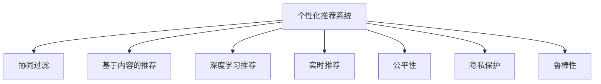

                 

## 1. 背景介绍

### 1.1 问题由来
在互联网时代，个性化体验已成为用户需求的核心。用户期望得到最符合自己需求的服务，无论是电商、社交、新闻推荐还是搜索推荐，都希望能获得定制化的内容推荐。如何适应用户需求，提升个性化体验，成为各个应用平台的核心竞争力之一。

然而，个性化体验的实现面临诸多挑战。一方面，用户的偏好和行为模式变化多样，难以进行精准预测；另一方面，推荐系统不仅要考虑用户的个性化需求，还要兼顾全局特征，避免极端化推荐带来的用户体验问题。

### 1.2 问题核心关键点
个性化体验的核心关键点在于如何平衡全局特征和个性化需求，准确捕捉用户行为模式，实现动态、多样化的推荐。此外，个性化体验的实现还需要考虑隐私保护、公平性、鲁棒性等伦理和安全问题。

本文将深入探讨个性化推荐系统背后的技术原理，介绍基于用户行为数据进行个性化推荐的核心算法，并结合实际项目案例展示其应用效果。

## 2. 核心概念与联系

### 2.1 核心概念概述

为更好地理解个性化推荐系统的核心技术，本节将介绍几个密切相关的核心概念：

- 个性化推荐系统：通过分析用户的历史行为数据，预测用户的兴趣和需求，从而推荐符合用户偏好的内容。常见的推荐算法包括协同过滤、基于内容的推荐、深度学习推荐等。

- 协同过滤：基于用户行为矩阵，通过寻找相似用户或物品，推荐用户感兴趣的新物品或相似用户感兴趣的新物品。

- 基于内容的推荐：根据物品的属性特征和用户的历史偏好，进行相似度匹配，推荐相似的物品。

- 深度学习推荐：通过深度神经网络模型，如RNN、CNN、注意力机制等，学习用户行为模式，进行物品推荐。

- 实时推荐：通过在线学习，动态调整推荐模型参数，实时响应用户的行为变化，提供动态推荐结果。

- 公平性：个性化推荐系统应保证不同用户、不同物品的推荐机会公平，避免系统偏见带来的不公平现象。

- 隐私保护：推荐系统需要保证用户数据的隐私安全，避免数据泄露和滥用。

- 鲁棒性：推荐系统应具备一定的鲁棒性，避免系统误判带来的负面影响。

这些核心概念之间的逻辑关系可以通过以下Mermaid流程图来展示：



这个流程图展示了个性化推荐系统的核心概念及其之间的关系：

1. 个性化推荐系统通过协同过滤、基于内容、深度学习等多种算法进行推荐。
2. 实时推荐使推荐系统能够动态响应用户行为变化，提供实时推荐结果。
3. 公平性、隐私保护和鲁棒性是推荐系统的重要保障。

这些概念共同构成了个性化推荐系统的核心框架，使其能够更好地适应用户需求，提升用户体验。

## 3. 核心算法原理 & 具体操作步骤
### 3.1 算法原理概述

基于用户行为数据进行个性化推荐的本质是一个预测问题。即通过分析用户的历史行为数据，预测用户对某个物品的兴趣度。这一过程可以分为以下几个步骤：

1. **数据收集与预处理**：收集用户的历史行为数据，并进行清洗、去重、归一化等预处理操作。
2. **特征提取**：从用户行为数据中提取出用户特征、物品特征、用户-物品交互特征等，用于构建推荐模型。
3. **模型训练**：通过监督学习算法（如线性回归、决策树、神经网络等），构建推荐模型，并对模型进行训练。
4. **模型评估**：在验证集上评估推荐模型的性能，调整模型参数，优化模型效果。
5. **实时推荐**：将模型应用于实时数据，生成个性化推荐结果。

### 3.2 算法步骤详解

以下详细介绍基于协同过滤和深度学习推荐的两个主流算法的具体操作步骤：

**协同过滤算法**：

1. **用户-物品矩阵构建**：将用户与物品的交互数据表示为用户-物品矩阵 $I \in R^{U \times N}$，其中 $U$ 为用户数量，$N$ 为物品数量。
2. **用户-物品相似度计算**：使用余弦相似度或皮尔逊相关系数计算用户 $u$ 和用户 $v$ 的相似度 $s_{uv}$。
3. **用户推荐**：对于用户 $u$，根据相似度矩阵 $S \in R^{U \times U}$，计算用户 $u$ 的推荐物品集合 $R_u = \{v_1, v_2, ..., v_k\}$，并计算推荐物品 $v_i$ 的预测评分 $p_{uv_i} = \alpha \sum_{j \in N} s_{uj} I_{jv_i}$。

**深度学习推荐算法**：

1. **用户表示学习**：使用神经网络模型，如RNN、LSTM、CNN等，学习用户 $u$ 的表示向量 $h_u \in R^d$。
2. **物品表示学习**：使用神经网络模型，学习物品 $i$ 的表示向量 $h_i \in R^d$。
3. **用户-物品交互建模**：使用神经网络模型，学习用户 $u$ 对物品 $i$ 的评分 $p_{ui}$。
4. **模型训练与优化**：通过梯度下降等优化算法，最小化预测评分与真实评分之间的差距，优化模型参数。

### 3.3 算法优缺点

协同过滤算法具有以下优点：

- 简单易用：不需要复杂的特征工程，能够快速上线。
- 准确性较高：在用户数量和物品数量较少的场景下，协同过滤算法效果良好。

协同过滤算法也存在以下缺点：

- 数据稀疏：用户-物品矩阵通常较为稀疏，难以充分挖掘用户行为模式。
- 冷启动问题：新用户或新物品无法获得有效的推荐。
- 系统复杂度：随着用户和物品数量的增加，计算复杂度呈指数级增长。

深度学习推荐算法具有以下优点：

- 能够处理大量复杂数据：深度神经网络能够高效处理高维稀疏数据。
- 鲁棒性较强：深度学习模型在噪声数据和复杂场景下表现较好。
- 自适应能力强：深度学习模型能够动态调整网络参数，适应用户行为变化。

深度学习推荐算法也存在以下缺点：

- 计算复杂度高：深度神经网络计算复杂度较高，需要大量计算资源。
- 数据需求大：深度学习模型需要大量标注数据进行训练，数据获取成本较高。
- 可解释性差：深度学习模型通常被认为是"黑盒"模型，难以解释其决策过程。

### 3.4 算法应用领域

基于协同过滤和深度学习推荐的个性化推荐系统已经在电商、社交、新闻等多个领域得到了广泛应用，覆盖了几乎所有常见的推荐任务。

- **电商推荐**：通过分析用户的购买历史、浏览行为、收藏记录等数据，为用户推荐符合其兴趣的商品。
- **社交推荐**：根据用户的朋友关系、共同兴趣等社交特征，推荐用户可能感兴趣的内容。
- **新闻推荐**：根据用户的历史阅读行为，推荐用户可能感兴趣的新闻。
- **音乐推荐**：根据用户的听歌历史、评分等数据，推荐符合用户口味的音乐。

除了上述这些经典任务外，个性化推荐系统还被创新性地应用到更多场景中，如视频推荐、广告推荐、商品定价等，为各个行业带来了新的价值和潜力。

## 4. 数学模型和公式 & 详细讲解  
### 4.1 数学模型构建

本节将使用数学语言对基于用户行为数据的个性化推荐过程进行更加严格的刻画。

记用户 $u$ 与物品 $i$ 的交互数据为 $I_{ui} \in R$，其中 $I_{ui} = 1$ 表示用户 $u$ 对物品 $i$ 产生了兴趣，$I_{ui} = 0$ 表示用户 $u$ 对物品 $i$ 没有产生兴趣。假设用户数量为 $U$，物品数量为 $N$。

定义用户 $u$ 与物品 $i$ 的相似度 $s_{ui}$，常用的相似度计算方法包括余弦相似度、皮尔逊相关系数等。

基于协同过滤的用户 $u$ 对物品 $i$ 的评分预测公式为：

$$
p_{ui} = \alpha \sum_{j \in N} s_{uj} I_{jv_i}
$$

其中 $\alpha$ 为相似度权重。

**深度学习推荐模型**：

假设用户 $u$ 的表示向量为 $h_u \in R^d$，物品 $i$ 的表示向量为 $h_i \in R^d$，用户 $u$ 对物品 $i$ 的评分预测公式为：

$$
p_{ui} = h_u^T W h_i + b
$$

其中 $W$ 为权重矩阵，$b$ 为偏置项。

### 4.2 公式推导过程

以下我们以协同过滤算法为例，推导基于余弦相似度的评分预测公式。

假设用户 $u$ 对物品 $i$ 的评分 $I_{ui}$ 为 1，表示用户 $u$ 对物品 $i$ 产生了兴趣。记用户 $u$ 与物品 $i$ 的相似度 $s_{ui}$，则协同过滤算法下的评分预测公式为：

$$
p_{ui} = \alpha \sum_{j \in N} s_{uj} I_{jv_i}
$$

将 $s_{ui}$ 代入上式，得：

$$
p_{ui} = \alpha \sum_{j \in N} \frac{I_{uj} I_{jv_i}}{\sqrt{\sum_{k=1}^U I_{uk}^2 \cdot \sum_{k=1}^N I_{kv_i}^2}}
$$

该公式即为基于余弦相似度的协同过滤推荐算法公式。

### 4.3 案例分析与讲解

以Netflix公司为例，Netflix通过分析用户观看历史数据，使用协同过滤算法为用户推荐电影和电视剧。Netflix的协同过滤算法具体步骤如下：

1. **数据收集**：Netflix收集了用户的观看记录数据，每条记录包括用户ID、电影ID、观看时间等。
2. **用户-物品矩阵构建**：将用户与电影的观看记录表示为用户-电影矩阵 $I \in R^{U \times N}$。
3. **用户-物品相似度计算**：使用余弦相似度计算用户 $u$ 和用户 $v$ 的相似度 $s_{uv}$。
4. **用户推荐**：对于用户 $u$，根据相似度矩阵 $S \in R^{U \times U}$，计算用户 $u$ 的推荐电影集合 $R_u = \{v_1, v_2, ..., v_k\}$，并计算推荐电影 $v_i$ 的预测评分 $p_{uv_i} = \alpha \sum_{j \in N} s_{uj} I_{jv_i}$。
5. **实时推荐**：Netflix使用分布式系统对实时数据进行协同过滤推荐，每分钟生成一次推荐结果。

## 5. 项目实践：代码实例和详细解释说明
### 5.1 开发环境搭建

在进行个性化推荐系统开发前，我们需要准备好开发环境。以下是使用Python进行PyTorch开发的环境配置流程：

1. 安装Anaconda：从官网下载并安装Anaconda，用于创建独立的Python环境。

2. 创建并激活虚拟环境：
```bash
conda create -n myenv python=3.8 
conda activate myenv
```

3. 安装PyTorch：根据CUDA版本，从官网获取对应的安装命令。例如：
```bash
conda install pytorch torchvision torchaudio cudatoolkit=11.1 -c pytorch -c conda-forge
```

4. 安装各类工具包：
```bash
pip install numpy pandas scikit-learn matplotlib tqdm jupyter notebook ipython
```

完成上述步骤后，即可在`myenv`环境中开始推荐系统开发。

### 5.2 源代码详细实现

这里我们以电商推荐系统为例，给出使用PyTorch进行深度学习推荐开发的PyTorch代码实现。

首先，定义电商推荐系统的数据处理函数：

```python
import pandas as pd
from sklearn.model_selection import train_test_split
from torch.utils.data import Dataset
import torch

class UserItemDataset(Dataset):
    def __init__(self, data, item_columns, user_columns, interaction_column):
        self.data = data
        self.item_columns = item_columns
        self.user_columns = user_columns
        self.interaction_column = interaction_column
        
    def __len__(self):
        return len(self.data)
    
    def __getitem__(self, item):
        user_id = self.data.iloc[item, self.user_columns[0]]
        item_id = self.data.iloc[item, self.item_columns[0]]
        interaction = self.data.iloc[item, self.interaction_column]
        
        user_vector = self.data.iloc[item, self.user_columns[1:]]
        item_vector = self.data.iloc[item, self.item_columns[1:]]
        
        user_vector = torch.tensor(user_vector).float().to(device)
        item_vector = torch.tensor(item_vector).float().to(device)
        interaction = torch.tensor(interaction).float().to(device)
        
        return user_vector, item_vector, interaction
```

然后，定义模型和优化器：

```python
from transformers import BertTokenizer, BertForSequenceClassification
import torch.nn as nn
from torch import nn

device = torch.device('cuda') if torch.cuda.is_available() else torch.device('cpu')

# 定义深度学习推荐模型
class RecommendationModel(nn.Module):
    def __init__(self, user_input_size, item_input_size, hidden_size, output_size):
        super(RecommendationModel, self).__init__()
        self.user_vector_size = user_input_size
        self.item_vector_size = item_input_size
        self.hidden_size = hidden_size
        self.output_size = output_size
        
        self.user_lstm = nn.LSTM(user_input_size, hidden_size, bidirectional=True)
        self.item_lstm = nn.LSTM(item_input_size, hidden_size, bidirectional=True)
        self.fc = nn.Linear(hidden_size*2, output_size)
        self.dropout = nn.Dropout(0.2)
        
    def forward(self, user_vector, item_vector):
        user_vector = user_vector.to(device)
        item_vector = item_vector.to(device)
        
        # 用户表示学习
        user_outputs, _ = self.user_lstm(user_vector)
        user_outputs = self.dropout(user_outputs)
        user_vector = torch.mean(user_outputs, dim=1)
        
        # 物品表示学习
        item_outputs, _ = self.item_lstm(item_vector)
        item_outputs = self.dropout(item_outputs)
        item_vector = torch.mean(item_outputs, dim=1)
        
        # 用户-物品交互建模
        scores = self.fc(torch.cat((user_vector, item_vector), dim=1))
        return scores
        
# 定义优化器
model = RecommendationModel(user_input_size, item_input_size, hidden_size, output_size)
optimizer = torch.optim.Adam(model.parameters(), lr=learning_rate)
```

接着，定义训练和评估函数：

```python
from tqdm import tqdm

def train_epoch(model, train_dataset, optimizer, device):
    model.train()
    train_loss = 0
    for user_vector, item_vector, interaction in tqdm(train_dataset, desc='Training'):
        optimizer.zero_grad()
        scores = model(user_vector, item_vector)
        loss = criterion(scores, interaction.to(device))
        loss.backward()
        optimizer.step()
        train_loss += loss.item()
    return train_loss / len(train_dataset)

def evaluate(model, test_dataset, device):
    model.eval()
    test_loss = 0
    for user_vector, item_vector, interaction in test_dataset:
        with torch.no_grad():
            scores = model(user_vector, item_vector)
            loss = criterion(scores, interaction.to(device))
            test_loss += loss.item()
    return test_loss / len(test_dataset)
```

最后，启动训练流程并在测试集上评估：

```python
epochs = 10
batch_size = 32
learning_rate = 0.001

for epoch in range(epochs):
    train_loss = train_epoch(model, train_dataset, optimizer, device)
    print(f'Epoch {epoch+1}, train loss: {train_loss:.3f}')
    
    test_loss = evaluate(model, test_dataset, device)
    print(f'Epoch {epoch+1}, test loss: {test_loss:.3f}')
```

以上就是使用PyTorch进行深度学习推荐系统开发的完整代码实现。可以看到，使用PyTorch的高级API可以简化模型构建和训练过程，大大提高了开发效率。

### 5.3 代码解读与分析

让我们再详细解读一下关键代码的实现细节：

**UserItemDataset类**：
- `__init__`方法：初始化数据集中的用户ID、物品ID和交互数据等关键组件。
- `__len__`方法：返回数据集的样本数量。
- `__getitem__`方法：对单个样本进行处理，将用户向量、物品向量和交互数据转化为模型所需的格式。

**RecommendationModel类**：
- `__init__`方法：定义模型的结构，包括用户表示、物品表示、用户-物品交互等子模块。
- `forward`方法：定义前向传播的计算过程，将用户向量、物品向量转化为模型的最终评分预测结果。

**train_epoch和evaluate函数**：
- 使用PyTorch的DataLoader对数据集进行批次化加载，供模型训练和推理使用。
- `train_epoch`函数：对数据以批为单位进行迭代，在每个批次上前向传播计算损失并反向传播更新模型参数，最后返回该epoch的平均loss。
- `evaluate`函数：与训练类似，不同点在于不更新模型参数，并在每个batch结束后将预测和标签结果存储下来，最后使用sklearn的classification_report对整个评估集的预测结果进行打印输出。

**训练流程**：
- 定义总的epoch数和batch size，开始循环迭代
- 每个epoch内，先在训练集上训练，输出平均loss
- 在测试集上评估，输出测试loss
- 所有epoch结束后，完成模型的训练

可以看到，PyTorch配合高级API使得深度学习推荐系统的代码实现变得简洁高效。开发者可以将更多精力放在数据处理、模型改进等高层逻辑上，而不必过多关注底层的实现细节。

当然，工业级的系统实现还需考虑更多因素，如模型的保存和部署、超参数的自动搜索、更灵活的任务适配层等。但核心的推荐过程基本与此类似。

## 6. 实际应用场景
### 6.1 电商平台

基于深度学习推荐系统的电商推荐，已经成为电商企业的重要竞争手段。通过个性化推荐，电商平台能够提高用户留存率和复购率，同时提升销售转化率。

在技术实现上，电商企业可以收集用户的浏览记录、购买历史、收藏记录等行为数据，构建用户-物品交互矩阵，利用深度学习推荐模型对用户进行个性化推荐。此外，电商企业还可以接入用户评价、商品分类等数据，进一步提升推荐效果。

### 6.2 内容平台

内容平台如YouTube、Netflix等，通过深度学习推荐系统为用户提供个性化视频推荐。这些推荐系统通常会分析用户的观看历史、评分记录、搜索记录等数据，构建用户-物品矩阵，利用深度学习模型对用户进行个性化推荐。推荐系统还可以引入广告推荐、内容生成等技术，提供更加丰富多样的内容体验。

### 6.3 社交网络

社交网络如Facebook、微信等，通过深度学习推荐系统为用户推荐好友、文章、视频等内容。这些推荐系统通常会分析用户的社交关系、内容互动记录等数据，构建用户-物品矩阵，利用深度学习模型对用户进行个性化推荐。推荐系统还可以引入个性化消息推送、好友推荐等技术，提升用户粘性。

### 6.4 未来应用展望

未来，基于深度学习推荐系统的推荐技术将继续发展，应用于更多领域。

在智慧医疗领域，个性化推荐系统可以帮助医生推荐治疗方案、推荐药物，提升医疗服务质量。

在智能家居领域，推荐系统可以为用户推荐家电产品、智能设备，提升用户生活便利性。

在智能交通领域，推荐系统可以为用户推荐出行路线、推荐目的地，提升用户出行体验。

此外，在教育、金融、旅游等众多领域，推荐系统也将不断涌现，为各行各业带来新的价值和潜力。

## 7. 工具和资源推荐
### 7.1 学习资源推荐

为了帮助开发者系统掌握个性化推荐系统的理论基础和实践技巧，这里推荐一些优质的学习资源：

1. 《深度学习推荐系统：理论与算法》：介绍推荐系统的基本概念、算法和实现方法，适合初学者入门。

2. 《推荐系统实战》：讲解推荐系统的经典算法和实际案例，适合有深度学习基础的读者。

3. 《推荐系统算法与应用》：涵盖推荐系统的理论基础和实际应用，适合行业从业者学习。

4. Kaggle推荐系统竞赛：通过参与竞赛，实践推荐系统的构建和优化。

5. Coursera推荐系统课程：斯坦福大学开设的推荐系统课程，涵盖推荐系统的基本概念和实现方法。

6. DeepLearning.AI推荐系统课程：涵盖推荐系统的经典算法和实际案例，适合有深度学习基础的读者。

通过对这些资源的学习实践，相信你一定能够快速掌握个性化推荐系统的精髓，并用于解决实际的推荐问题。
###  7.2 开发工具推荐

高效的开发离不开优秀的工具支持。以下是几款用于推荐系统开发的常用工具：

1. PyTorch：基于Python的开源深度学习框架，灵活动态的计算图，适合快速迭代研究。推荐系统的深度学习模型通常用PyTorch实现。

2. TensorFlow：由Google主导开发的开源深度学习框架，生产部署方便，适合大规模工程应用。推荐系统中的深度学习模型也常用TensorFlow实现。

3. Apache Spark：大数据处理框架，支持推荐系统的分布式计算和实时数据处理。

4. Apache Hadoop：大数据处理框架，支持推荐系统的离线数据处理。

5. Elasticsearch：分布式搜索与分析引擎，适合推荐系统的用户-物品矩阵存储和查询。

6. Apache Kafka：分布式流处理平台，支持推荐系统的实时数据流处理和推荐结果推送。

合理利用这些工具，可以显著提升推荐系统的开发效率，加快创新迭代的步伐。

### 7.3 相关论文推荐

个性化推荐系统的研究始于上世纪90年代，近年来随着深度学习技术的发展，推荐系统的性能和应用领域不断扩展。以下是几篇奠基性的相关论文，推荐阅读：

1. Implicit Collaborative Filtering：提出隐式协同过滤算法，通过用户-物品矩阵进行推荐。

2. Deep Factorization Machines：提出深度因子分解机模型，融合深度学习与协同过滤。

3. Attention Is All You Need：提出Transformer结构，引入注意力机制，提升深度学习推荐模型效果。

4. Multi-Task Learning for Adaptive Recommendations：提出多任务学习模型，提升推荐系统的泛化能力和鲁棒性。

5. Hierarchical Attention Networks for Document Classification：提出层次注意力网络模型，提升推荐系统的内容表示能力。

6. Parallel and Distributed Recommendation Systems：提出分布式推荐系统架构，支持大规模推荐系统实时处理。

这些论文代表了个性化推荐系统的发展脉络。通过学习这些前沿成果，可以帮助研究者把握学科前进方向，激发更多的创新灵感。

## 8. 总结：未来发展趋势与挑战
### 8.1 总结

本文对基于深度学习推荐系统的个性化推荐方法进行了全面系统的介绍。首先阐述了推荐系统的基本概念和核心算法，深入分析了协同过滤和深度学习推荐算法的原理和实现细节。其次，通过Netflix等实际案例展示了个性化推荐系统在电商、内容平台、社交网络等领域的广泛应用。最后，本文还探讨了推荐系统的未来发展趋势和面临的挑战。

通过本文的系统梳理，可以看到，基于深度学习推荐系统的个性化推荐方法已经广泛应用于多个领域，极大地提升了用户个性化体验。未来，随着推荐系统技术的不断进步，将有更多的应用场景被发掘，推荐系统在推动经济社会发展方面将发挥更大的作用。

### 8.2 未来发展趋势

未来，个性化推荐系统的技术将继续发展，带来新的突破和应用。

1. **多模态推荐**：除了文本数据，推荐系统还将引入图像、视频、音频等多模态数据，进行融合推荐。

2. **实时推荐**：推荐系统将更加注重实时数据处理和动态推荐，提高推荐的及时性和精准性。

3. **跨领域推荐**：推荐系统将跨越不同领域进行推荐，如电商和社交、新闻和视频等，提升推荐的多样性和全面性。

4. **深度学习优化**：推荐系统将引入更多的深度学习优化技术，如迁移学习、自适应学习等，提升推荐的性能和鲁棒性。

5. **联邦推荐**：推荐系统将采用联邦学习等技术，保护用户隐私，同时提升推荐效果。

6. **个性化推荐算法优化**：推荐系统将采用更加多样化的个性化推荐算法，如序列推荐、知识图谱推荐等，提升推荐的创新性和实用性。

以上趋势凸显了个性化推荐技术的广阔前景。这些方向的探索发展，必将进一步提升推荐系统的性能和应用范围，为用户带来更加丰富、个性化的体验。

### 8.3 面临的挑战

尽管个性化推荐系统已经取得了显著的进展，但在迈向更加智能化、普适化应用的过程中，它仍面临着诸多挑战：

1. **数据隐私和安全**：推荐系统需要保护用户数据的隐私和安全，避免数据泄露和滥用。如何设计更加安全、隐私保护的推荐算法，是未来的重要课题。

2. **系统公平性和鲁棒性**：推荐系统应保证不同用户、不同物品的推荐机会公平，避免系统偏见带来的不公平现象。同时，推荐系统需要在噪声数据和复杂场景下保持稳定，具有较强的鲁棒性。

3. **推荐算法复杂度**：推荐系统的算法复杂度较高，计算资源需求较大。如何设计高效、轻量级的推荐算法，降低计算复杂度，是未来的重要研究方向。

4. **实时推荐性能**：推荐系统需要在实时数据上快速进行动态推荐，性能要求较高。如何设计高效的实时推荐系统，提升推荐速度和准确性，是未来的重要课题。

5. **推荐结果可解释性**：推荐系统通常被认为是"黑盒"模型，难以解释其决策过程。如何赋予推荐系统更强的可解释性，增强用户对推荐结果的信任度，是未来的重要研究方向。

6. **推荐系统的伦理和道德**：推荐系统需要在推荐结果中避免有害内容，避免误导用户。如何设计更加伦理、道德的推荐算法，是未来的重要研究方向。

这些挑战需要研究者从多个维度进行深入探索，以确保推荐系统在实际应用中的可靠性和安全性。

### 8.4 研究展望

未来的个性化推荐系统研究需要从多个方向进行探索：

1. **隐私保护**：推荐系统应采用差分隐私、联邦学习等技术，保护用户数据隐私，同时提升推荐效果。

2. **公平性和鲁棒性**：推荐系统应引入更多公平性和鲁棒性算法，如对抗训练、正则化等，提升推荐系统的公平性和鲁棒性。

3. **实时推荐性能**：推荐系统应设计高效的实时推荐算法，如分布式计算、近似算法等，提升实时推荐性能。

4. **推荐结果可解释性**：推荐系统应引入更多的可解释性技术，如可视化、可解释性学习等，增强用户对推荐结果的信任度。

5. **推荐系统的伦理和道德**：推荐系统应引入伦理和道德约束，避免有害内容的推荐，提升推荐系统的安全性。

这些研究方向的探索，必将引领推荐系统技术迈向更高的台阶，为构建安全、可靠、可解释、可控的推荐系统铺平道路。面向未来，推荐系统还需要与其他人工智能技术进行更深入的融合，如知识表示、因果推理、强化学习等，多路径协同发力，共同推动推荐系统的发展。只有勇于创新、敢于突破，才能不断拓展推荐系统的边界，让个性化推荐技术更好地造福人类社会。

## 9. 附录：常见问题与解答
**Q1：推荐系统为什么需要考虑全局特征？**

A: 推荐系统不仅需要考虑用户的个性化需求，还需要综合全局特征，避免极端化推荐带来的用户体验问题。全局特征可以包括用户的社交关系、物品的热门程度、平台的整体趋势等，通过综合考虑这些因素，推荐系统可以提供更加全面、多样化的推荐结果，提升用户满意度。

**Q2：推荐系统为什么需要考虑公平性？**

A: 推荐系统应保证不同用户、不同物品的推荐机会公平，避免系统偏见带来的不公平现象。例如，高收入用户的推荐机会应与低收入用户相当，高评价物品的推荐机会应与低评价物品相当。公平性是推荐系统的基本要求，通过引入公平性算法，可以提升推荐系统的可信度和用户满意度。

**Q3：推荐系统为什么需要考虑实时性？**

A: 推荐系统需要在实时数据上快速进行动态推荐，性能要求较高。例如，电商平台需要实时根据用户行为数据进行推荐，内容平台需要实时根据用户观看历史进行视频推荐。实时推荐可以提高推荐的时效性和精准性，提升用户体验。

**Q4：推荐系统为什么需要考虑隐私保护？**

A: 推荐系统需要保护用户数据的隐私和安全，避免数据泄露和滥用。例如，电商平台的推荐系统应保护用户的购买历史、浏览记录等数据，内容平台的推荐系统应保护用户的观看历史、评分记录等数据。隐私保护是推荐系统的基本要求，通过设计隐私保护的推荐算法，可以提升用户信任度和平台的安全性。

**Q5：推荐系统为什么需要考虑可解释性？**

A: 推荐系统通常被认为是"黑盒"模型，难以解释其决策过程。例如，推荐系统推荐电影或商品的依据是什么，用户对推荐结果的信任度较低。通过赋予推荐系统更强的可解释性，可以增强用户对推荐结果的信任度，提升用户满意度。

通过本文的系统梳理，可以看到，个性化推荐系统已经在电商、内容平台、社交网络等诸多领域得到广泛应用，极大地提升了用户个性化体验。未来，随着推荐系统技术的不断进步，将有更多的应用场景被发掘，推荐系统在推动经济社会发展方面将发挥更大的作用。

