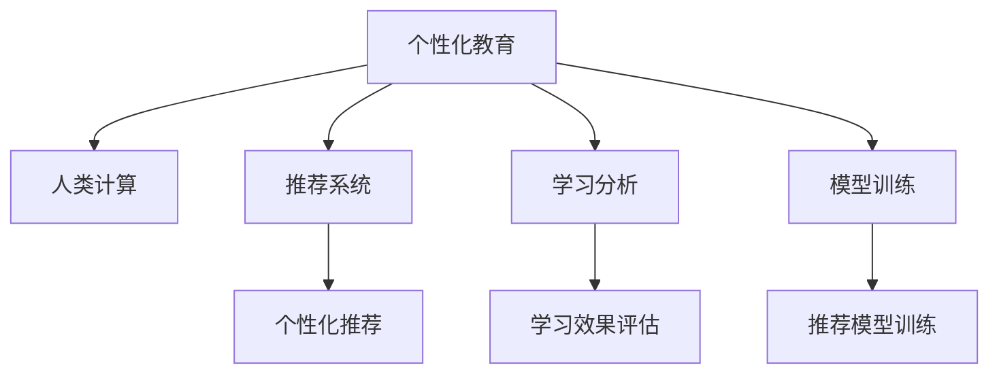

                 

# 个性化教育：利用人类计算实现定制化学习

## 1. 背景介绍

### 1.1 问题由来

随着信息技术的发展和教育的数字化转型，个性化教育逐渐成为教育领域的一个热门话题。传统的批量化教育模式无法满足学生个性化需求，导致很多学生学习效率低下，甚至产生厌学情绪。而个性化教育旨在通过数据驱动的方式，为每位学生量身定制学习方案，使其在最短的时间内达到最佳的学习效果。

然而，在个性化教育实践中，如何有效地获取和分析学生数据，为每位学生定制化学习方案，仍然是一个难题。传统的个性化推荐系统往往基于学生的历史学习记录进行推荐，但这种推荐方式存在一定的局限性。它无法考虑到学生的当前学习状态、实时反馈等信息，因此无法真正实现个性化教育的目标。

## 1.2 问题核心关键点

当前个性化教育面临的核心挑战包括：
- 数据来源多样，如何有效地整合和利用这些数据，是一个难题。
- 个性化推荐系统缺乏对学生学习状态的实时监测和分析，无法实现真正的定制化学习。
- 教师工作负担重，如何通过技术手段减轻其工作量，提高教育效果。

## 1.3 问题研究意义

个性化教育是教育公平和优质化发展的关键路径。通过技术手段实现个性化教育，可以大大提高学生的学习效果，减少教师的工作负担，为教育公平带来新的突破。研究如何利用人类计算技术，实现个性化教育，将有助于推动教育的数字化、智能化转型，提高教育质量，促进社会公平。

## 2. 核心概念与联系

### 2.1 核心概念概述

为更好地理解个性化教育，本节将介绍几个密切相关的核心概念：

- 个性化教育(Personalized Education)：根据学生个体的学习需求、兴趣爱好、学习风格等特征，为其量身定制个性化的学习方案。
- 人类计算(Human-Computer Interaction)：通过计算机辅助，使人类能够更高效、更准确地完成复杂任务的技术。
- 推荐系统(Recommendation System)：通过分析用户的历史行为数据，为其推荐合适的产品、内容、服务等。
- 学习分析(Learning Analytics)：通过分析学生在学习过程中的数据，为教师和学生提供决策支持，以优化学习效果。
- 模型训练(Model Training)：通过收集和分析大量数据，训练机器学习模型，以实现自动化决策和推荐。

这些核心概念之间的逻辑关系可以通过以下Mermaid流程图来展示：



这个流程图展示了个性化教育的核心概念及其之间的关系：

1. 个性化教育通过人类计算和推荐系统等技术，实现学生个性化学习方案的定制。
2. 学习分析通过数据分析，为教师和学生提供实时反馈，优化学习效果。
3. 模型训练利用机器学习技术，训练推荐模型，提高个性化推荐的准确性。

这些概念共同构成了个性化教育的框架，使其能够为每位学生提供最佳的学习体验。通过理解这些核心概念，我们可以更好地把握个性化教育的工作原理和优化方向。

## 3. 核心算法原理 & 具体操作步骤

### 3.1 算法原理概述

个性化教育的核心算法原理是基于机器学习的推荐系统。通过分析学生的历史学习数据、行为数据、实时反馈等信息，训练出能够为学生推荐个性化学习内容的推荐模型。具体而言，算法流程如下：

1. 数据收集：从学生学习管理系统、在线课程平台、社交媒体等渠道收集学生的学习数据。
2. 特征提取：从收集到的数据中提取学生的学习特征，如学习习惯、知识水平、兴趣爱好等。
3. 模型训练：使用机器学习算法，训练推荐模型，预测学生可能感兴趣的学习内容。
4. 推荐生成：根据模型的预测结果，为学生推荐个性化学习内容。
5. 效果评估：通过评估学生对推荐内容的反馈，不断调整模型，优化推荐效果。

### 3.2 算法步骤详解

以下是一个完整的个性化教育推荐系统设计流程：

**Step 1: 数据收集**
- 学生基本信息：姓名、年龄、性别、家庭背景等。
- 学习行为数据：在线学习时间、观看视频时长、参加测试成绩等。
- 兴趣和偏好：兴趣爱好、喜欢的学科、喜爱的主题等。
- 实时反馈数据：学习过程中的表情、点击率、评论等。

**Step 2: 特征提取**
- 学生特征提取：包括基本属性、学习习惯、知识水平等。
- 学习内容特征提取：包括视频时长、难度等级、知识点分布等。

**Step 3: 模型训练**
- 选择推荐算法：常用的推荐算法包括协同过滤、内容推荐、混合推荐等。
- 数据预处理：对数据进行归一化、缺失值填充等预处理操作。
- 模型训练：使用优化算法(如梯度下降)，最小化推荐误差。
- 模型评估：使用评估指标(如准确率、召回率、F1值)评估模型的效果。

**Step 4: 推荐生成**
- 获取学生的实时数据。
- 根据推荐模型预测学生的兴趣内容。
- 根据预测结果生成个性化推荐列表。

**Step 5: 效果评估**
- 收集学生对推荐内容的反馈。
- 分析反馈数据，评估推荐效果。
- 根据反馈调整模型参数，优化推荐算法。

### 3.3 算法优缺点

个性化教育推荐系统的优点包括：
1. 个性化程度高：通过学习学生的行为数据，能够为其推荐合适的学习内容。
2. 实时性高：能够根据学生的实时反馈，动态调整推荐内容。
3. 自动化程度高：能够自动完成数据收集、特征提取、模型训练和推荐生成等步骤，减轻教师工作负担。

同时，该方法也存在一定的局限性：
1. 数据隐私问题：如何保护学生的隐私数据，是一个难题。
2. 数据质量问题：学生数据的质量和完整性直接影响推荐效果。
3. 推荐模型复杂：如何设计高效的推荐模型，提高推荐精度，是一个重要问题。
4. 个性化程度有限：推荐系统无法考虑学生的情感状态、学习动机等复杂因素。

尽管存在这些局限性，但就目前而言，基于推荐系统的个性化教育推荐方法仍是一个主流范式。未来相关研究的重点在于如何进一步降低数据隐私和质量问题，提高推荐模型的复杂度，同时兼顾推荐系统的实时性和个性化程度。

### 3.4 算法应用领域

个性化教育推荐系统已经被广泛应用于在线教育、智能辅导、个性化学习计划等多个领域。例如：

- 在线教育平台：根据学生的学习行为和反馈，推荐适合的学习内容和资源。
- 智能辅导系统：实时监测学生的学习状态，提供个性化辅导。
- 个性化学习计划：为学生制定个性化的学习路径，提供学习建议。

除了上述这些经典应用外，个性化教育推荐系统也被创新性地应用到更多场景中，如虚拟课堂、游戏化学习、社会化学习等，为教育提供了更多的创新可能性。

## 4. 数学模型和公式 & 详细讲解 & 举例说明

### 4.1 数学模型构建

本节将使用数学语言对基于推荐系统的个性化教育算法进行更加严格的刻画。

记个性化教育推荐系统的训练集为 $D=\{(x_i,y_i)\}_{i=1}^N$，其中 $x_i$ 为学生学习数据，$y_i$ 为对应的推荐内容。定义推荐模型为 $f(x)$，其预测结果为学生对推荐内容的偏好程度。

推荐模型的优化目标是最小化预测误差，即找到最优的 $f(x)$：

$$
\theta^* = \mathop{\arg\min}_{\theta} \sum_{i=1}^N \ell(f(x_i),y_i)
$$

其中 $\ell$ 为损失函数，用于衡量预测结果与真实标签之间的差异。常见的损失函数包括均方误差损失、交叉熵损失等。

### 4.2 公式推导过程

以下我们以协同过滤算法为例，推导推荐模型的损失函数及其梯度的计算公式。

假设推荐模型为 $f(x) = w^T\phi(x)$，其中 $w$ 为模型参数，$\phi(x)$ 为特征映射函数。设训练集中第 $i$ 个样本的损失为 $L_i = \ell(f(x_i),y_i)$，则推荐模型的损失函数为：

$$
\mathcal{L}(w) = \frac{1}{N}\sum_{i=1}^N L_i = \frac{1}{N}\sum_{i=1}^N \ell(f(x_i),y_i)
$$

根据链式法则，损失函数对参数 $w_k$ 的梯度为：

$$
\frac{\partial \mathcal{L}(w)}{\partial w_k} = \frac{1}{N}\sum_{i=1}^N \frac{\partial \ell(f(x_i),y_i)}{\partial f(x_i)} \frac{\partial f(x_i)}{\partial w_k}
$$

其中 $\frac{\partial f(x_i)}{\partial w_k}$ 可进一步递归展开，利用自动微分技术完成计算。

### 4.3 案例分析与讲解

以KNN推荐算法为例，分析其在个性化教育中的应用。KNN算法通过计算用户之间的相似度，为用户推荐相似用户喜欢的内容。具体而言，算法流程如下：

1. 收集用户的历史学习行为数据，构建用户-物品评分矩阵 $R$。
2. 选取目标用户 $u$，计算其与所有用户 $v$ 之间的相似度 $s_{uv}$。
3. 根据相似度排序，选择与目标用户最相似的前 $k$ 个用户。
4. 根据这 $k$ 个用户对物品的评分，预测目标用户对物品的评分，推荐评分最高的物品。

该算法简单易懂，容易实现，但其主要缺点在于需要计算用户之间的相似度，计算量大，且对数据分布的要求较高。在个性化教育推荐系统中，可以通过改进数据预处理和特征提取技术，提高KNN算法的计算效率和推荐效果。

## 5. 项目实践：代码实例和详细解释说明

### 5.1 开发环境搭建

在进行个性化教育推荐系统开发前，我们需要准备好开发环境。以下是使用Python进行Scikit-learn开发的开发环境配置流程：

1. 安装Anaconda：从官网下载并安装Anaconda，用于创建独立的Python环境。

2. 创建并激活虚拟环境：
```bash
conda create -n recommendation-env python=3.8 
conda activate recommendation-env
```

3. 安装Scikit-learn：
```bash
conda install scikit-learn 
```

4. 安装Pandas：
```bash
conda install pandas 
```

5. 安装Numpy：
```bash
conda install numpy 
```

完成上述步骤后，即可在`recommendation-env`环境中开始开发。

### 5.2 源代码详细实现

下面我们以协同过滤算法为例，给出使用Scikit-learn库进行个性化教育推荐系统的PyTorch代码实现。

首先，定义推荐系统的数据处理函数：

```python
from sklearn.neighbors import NearestNeighbors
import pandas as pd
import numpy as np

def get_neighbors(user_data, k):
    # 构建用户-物品评分矩阵
    user_item_matrix = user_data.pivot_table(values='rating', index='user_id', columns='item_id')
    user_item_matrix = user_item_matrix.fillna(0)
    
    # 构建用户邻域
    knn = NearestNeighbors(n_neighbors=k, algorithm='brute')
    knn.fit(user_item_matrix.to_numpy())
    
    # 计算用户邻域的相似度
    distances, indices = knn.kneighbors(user_data[['item_id']])
    
    # 根据相似度排序，返回最相似的前k个物品
    return user_item_matrix[indices].to_numpy()
```

然后，定义推荐生成函数：

```python
def recommend_items(user_data, item_data, k=5):
    # 获取用户邻域
    neighbors = get_neighbors(user_data, k)
    
    # 计算邻域内物品的评分
    neighbor_ratings = np.mean(neighbors, axis=0)
    
    # 根据评分排序，推荐评分最高的物品
    recommended_items = item_data[item_data['rating'] >= neighbor_ratings].sort_values(by='rating', ascending=False)
    
    return recommended_items
```

最后，启动推荐系统：

```python
# 加载用户数据
user_data = pd.read_csv('user_data.csv')

# 加载物品数据
item_data = pd.read_csv('item_data.csv')

# 启动推荐系统
recommended_items = recommend_items(user_data, item_data, k=5)

# 输出推荐结果
print(recommended_items)
```

以上就是使用Scikit-learn库进行协同过滤算法个性化教育推荐系统的完整代码实现。可以看到，得益于Scikit-learn库的强大封装，我们可以用相对简洁的代码完成推荐系统的构建。

### 5.3 代码解读与分析

让我们再详细解读一下关键代码的实现细节：

**get_neighbors函数**：
- 构建用户-物品评分矩阵：使用`pivot_table`方法，将用户数据转换为评分矩阵。
- 构建用户邻域：使用`NearestNeighbors`方法，计算用户之间的相似度，并返回最相似的前k个物品。

**recommend_items函数**：
- 获取用户邻域：调用`get_neighbors`函数，获取用户最相似的邻域。
- 计算邻域内物品的评分：对邻域内物品的评分进行平均，得到目标用户的评分。
- 根据评分排序，推荐评分最高的物品：使用`sort_values`方法，根据评分对物品进行排序，返回评分最高的前5个物品。

**推荐系统启动流程**：
- 加载用户数据：从CSV文件中读取用户数据。
- 加载物品数据：从CSV文件中读取物品数据。
- 启动推荐系统：调用`recommend_items`函数，获取用户的推荐物品列表。
- 输出推荐结果：将推荐结果打印输出。

可以看到，Scikit-learn库使得协同过滤算法的实现变得简洁高效。开发者可以将更多精力放在数据处理、模型改进等高层逻辑上，而不必过多关注底层的实现细节。

当然，工业级的系统实现还需考虑更多因素，如推荐结果的反馈机制、推荐模型的更新机制、推荐系统的扩展性等。但核心的推荐范式基本与此类似。

## 6. 实际应用场景

### 6.1 在线教育平台

在线教育平台可以根据学生的学习行为数据，为其推荐适合的课程和资源。通过个性化教育推荐系统，在线教育平台能够为每位学生提供定制化的学习方案，提高学习效果和用户满意度。

在技术实现上，可以收集学生在学习平台上的行为数据，如观看视频时长、参加测试成绩等，构建学生的学习行为模型。然后，根据该模型，为学生推荐适合的课程和视频资源。对于推荐效果不佳的课程，可以进一步引入人工审核和调整机制，以优化推荐算法。

### 6.2 智能辅导系统

智能辅导系统通过个性化教育推荐技术，为学生提供个性化的辅导方案。当学生遇到学习难题时，系统可以自动推荐合适的学习材料和视频资源，帮助学生解决问题。

在技术实现上，可以收集学生在学习过程中提出的问题，提取问题的关键词和难点。然后，根据学生的学习历史和兴趣偏好，推荐相应的学习资源。对于复杂的问题，可以引入人工专家进行解答，以提供更全面的辅导服务。

### 6.3 个性化学习计划

个性化学习计划可以根据学生的学习目标和进度，为其制定个性化的学习路径。通过推荐系统，可以为学生推荐合适的学习材料和计划，确保其学习目标的实现。

在技术实现上，可以收集学生的学习历史、学习目标、时间安排等信息，构建学习计划推荐模型。然后，根据学生的学习情况，动态调整推荐策略，为学生提供更合理的学习计划。

### 6.4 未来应用展望

随着个性化教育推荐技术的发展，其在更多领域的应用前景可期：

1. 虚拟课堂：基于虚拟现实技术，为学生提供沉浸式学习体验。个性化教育推荐系统可以根据学生的学习状态和兴趣，为其推荐虚拟课堂中的学习资源和活动。
2. 游戏化学习：将游戏元素融入学习过程中，提高学生的学习兴趣和积极性。推荐系统可以根据学生的游戏行为和成绩，推荐合适的游戏内容和奖励。
3. 社会化学习：将学生之间的互动和学习交流引入学习过程中，培养学生的团队合作能力和社交技能。推荐系统可以根据学生的学习行为和社交网络，推荐合适的学习伙伴和交流活动。

这些未来应用场景，将进一步拓展个性化教育推荐系统的应用边界，提升教育的质量和效果。

## 7. 工具和资源推荐

### 7.1 学习资源推荐

为了帮助开发者系统掌握个性化教育推荐技术的理论基础和实践技巧，这里推荐一些优质的学习资源：

1. 《推荐系统实践》系列博文：由推荐系统领域专家撰写，深入浅出地介绍了推荐系统的原理、算法和应用，是初学者和进阶者的必备资料。
2. 《机器学习》书籍：斯坦福大学机器学习课程的教材，全面介绍了机器学习的基本概念和算法。
3. 《深度学习》书籍：由深度学习领域的专家所写，介绍了深度学习的基础理论和应用。
4. 《自然语言处理综述》系列论文：涵盖了自然语言处理领域的最新进展和前沿技术。
5. 《推荐系统基础》书籍：详细介绍了推荐系统的基础理论和算法，是推荐系统开发者的必备读物。

通过对这些资源的学习实践，相信你一定能够快速掌握个性化教育推荐技术的精髓，并用于解决实际的个性化教育问题。

### 7.2 开发工具推荐

高效的开发离不开优秀的工具支持。以下是几款用于个性化教育推荐系统开发的常用工具：

1. Scikit-learn：基于Python的机器学习库，包含丰富的推荐算法实现，简单易用，适合快速迭代开发。
2. TensorFlow：由Google主导开发的开源深度学习框架，支持分布式计算，适合大规模模型训练和部署。
3. PyTorch：基于Python的开源深度学习框架，灵活动态的计算图，适合快速迭代研究。
4. Weights & Biases：模型训练的实验跟踪工具，可以记录和可视化模型训练过程中的各项指标，方便对比和调优。
5. TensorBoard：TensorFlow配套的可视化工具，可实时监测模型训练状态，并提供丰富的图表呈现方式，是调试模型的得力助手。

合理利用这些工具，可以显著提升个性化教育推荐系统的开发效率，加快创新迭代的步伐。

### 7.3 相关论文推荐

个性化教育推荐技术的发展源于学界的持续研究。以下是几篇奠基性的相关论文，推荐阅读：

1. Collaborative Filtering for Implicit Feedback Datasets：介绍协同过滤算法的基本原理和实现方法。
2. Fast Matrix Factorization Techniques for Recommender Systems：介绍矩阵分解算法的基本原理和实现方法。
3. Item-based Collaborative Filtering Recommendation Algorithms: Algorithmic Complexity and Performance：介绍基于物品的协同过滤算法的基本原理和性能分析。
4. BPR: Bayesian Personalized Ranking from Pairwise Preferences：介绍基于贝叶斯排序的协同过滤算法的基本原理和实现方法。
5. Deep Rank: A Ranking Ranker with Deep Learning：介绍基于深度学习的排序算法的基本原理和实现方法。

这些论文代表了个性化教育推荐技术的发展脉络。通过学习这些前沿成果，可以帮助研究者把握学科前进方向，激发更多的创新灵感。

## 8. 总结：未来发展趋势与挑战

### 8.1 总结

本文对基于机器学习的个性化教育推荐系统进行了全面系统的介绍。首先阐述了个性化教育和推荐系统的研究背景和意义，明确了推荐系统在个性化教育中的核心作用。其次，从原理到实践，详细讲解了推荐系统的数学原理和关键步骤，给出了推荐系统任务开发的完整代码实例。同时，本文还广泛探讨了推荐系统在在线教育、智能辅导、个性化学习计划等多个行业领域的应用前景，展示了推荐系统范式的巨大潜力。此外，本文精选了推荐系统的各类学习资源，力求为读者提供全方位的技术指引。

通过本文的系统梳理，可以看到，基于机器学习的个性化教育推荐系统已经在多个领域得到了广泛的应用，为个性化教育带来了新的可能性。未来，伴随推荐算法的发展和优化，个性化教育推荐系统必将在更多领域发挥更大的作用。

### 8.2 未来发展趋势

展望未来，个性化教育推荐系统将呈现以下几个发展趋势：

1. 推荐算法日趋多样。随着推荐算法的不断进步，未来的个性化教育推荐系统将使用更高效、更准确的推荐算法，实现更精准的个性化推荐。
2. 推荐内容更加丰富。未来的个性化教育推荐系统将不仅仅局限于学习内容，还可能包括游戏、社交等多种内容。
3. 推荐过程更加智能。未来的个性化教育推荐系统将能够更好地理解和预测学生的学习需求和兴趣，实现更智能的个性化推荐。
4. 推荐系统更加可解释。未来的个性化教育推荐系统将能够提供更可解释的推荐理由，帮助教师和学生理解推荐过程。
5. 推荐系统更加个性化。未来的个性化教育推荐系统将能够更好地考虑学生的情感状态、学习动机等复杂因素，实现更加个性化的推荐。

以上趋势凸显了个性化教育推荐技术的广阔前景。这些方向的探索发展，必将进一步提升个性化教育推荐系统的性能和应用范围，为教育领域带来更多的创新可能性。

### 8.3 面临的挑战

尽管个性化教育推荐技术已经取得了瞩目成就，但在迈向更加智能化、普适化应用的过程中，它仍面临着诸多挑战：

1. 数据隐私问题：如何保护学生的隐私数据，是一个难题。
2. 数据质量问题：学生数据的质量和完整性直接影响推荐效果。
3. 推荐模型复杂：如何设计高效的推荐模型，提高推荐精度，是一个重要问题。
4. 推荐系统普及率低：如何推动推荐系统在教育领域的普及，是一个亟待解决的问题。
5. 推荐系统效果不稳定：不同学生对推荐内容的反馈差异大，如何提高推荐系统的稳定性和普适性，是一个挑战。

尽管存在这些挑战，但通过学界和产业界的共同努力，相信这些问题终将一一被克服，个性化教育推荐系统必将在教育领域发挥更大的作用。

### 8.4 研究展望

未来个性化教育推荐系统的研究需要在以下几个方面寻求新的突破：

1. 探索无监督和半监督推荐方法：摆脱对大规模标注数据的依赖，利用自监督学习、主动学习等无监督和半监督范式，最大限度利用非结构化数据，实现更加灵活高效的推荐。
2. 研究参数高效和计算高效的推荐范式：开发更加参数高效的推荐方法，在固定大部分推荐参数的情况下，只更新极少量的任务相关参数。同时优化推荐模型的计算图，减少前向传播和反向传播的资源消耗，实现更加轻量级、实时性的部署。
3. 引入更多先验知识：将符号化的先验知识，如知识图谱、逻辑规则等，与推荐模型进行巧妙融合，引导推荐过程学习更准确、合理的推荐内容。同时加强不同模态数据的整合，实现视觉、语音等多模态信息与文本信息的协同建模。
4. 结合因果分析和博弈论工具：将因果分析方法引入推荐模型，识别出推荐决策的关键特征，增强推荐结果的因果性和逻辑性。借助博弈论工具刻画人机交互过程，主动探索并规避推荐模型的脆弱点，提高系统稳定性。
5. 纳入伦理道德约束：在推荐目标中引入伦理导向的评估指标，过滤和惩罚有害的推荐内容，确保推荐系统符合人类价值观和伦理道德。

这些研究方向的探索，必将引领个性化教育推荐技术迈向更高的台阶，为教育领域带来更多的创新可能性。相信随着技术的不断发展，个性化教育推荐系统必将在构建更加公平、优质、高效的教育体系中扮演越来越重要的角色。

## 9. 附录：常见问题与解答

**Q1：如何衡量个性化教育推荐系统的推荐效果？**

A: 个性化教育推荐系统的推荐效果通常通过以下指标来衡量：
- 准确率(Accuracy)：推荐系统推荐的物品是否与用户的历史行为一致。
- 召回率(Recall)：推荐系统是否为用户推荐了所有感兴趣的物品。
- 覆盖率(Coverage)：推荐系统推荐的物品覆盖面是否广泛。
- 新颖性(Freshness)：推荐系统推荐物品的新颖性，避免重复推荐。
- 满意度(Satisfaction)：用户对推荐结果的满意度，通常通过用户反馈或A/B测试等方法评估。

**Q2：如何在个性化教育推荐系统中加入情感分析技术？**

A: 在个性化教育推荐系统中加入情感分析技术，可以更好地理解学生的情感状态，从而提供更加个性化的推荐。具体而言，可以收集学生的表情、语调、评论等情感数据，通过情感分析技术识别出学生的情感状态，然后根据情感状态调整推荐策略。例如，如果学生感到焦虑或困惑，可以推荐一些轻松有趣的学习内容，帮助其放松心情。

**Q3：个性化教育推荐系统如何处理长尾问题？**

A: 长尾问题是指个性化推荐系统推荐稀少但质量较高的物品，例如一些专业课程或冷门书籍。处理长尾问题的方法包括：
1. 冷启动策略：对于新用户或新物品，使用一些启发式算法推荐一些热门物品，帮助用户快速积累反馈数据。
2. 多维度推荐：除了基于行为数据推荐，还可以引入其他维度数据，如学习目标、兴趣爱好等，丰富推荐策略。
3. 动态更新策略：根据用户反馈，动态调整推荐模型，提高推荐效果。

**Q4：个性化教育推荐系统如何处理推荐系统的冷启动问题？**

A: 推荐系统的冷启动问题是指对于新用户或新物品，由于缺乏历史数据，无法为其提供个性化推荐。处理冷启动问题的方法包括：
1. 基于内容的推荐：使用物品本身的属性信息，如学科、难度等级等，为物品打标签，帮助新用户快速发现合适的推荐。
2. 基于模式的推荐：通过分析新用户的行为模式，预测其可能感兴趣的内容。
3. 基于社交网络的推荐：利用社交网络数据，为新用户推荐其好友喜欢的物品。

这些方法可以有效地解决个性化教育推荐系统的冷启动问题，提升系统的覆盖面和推荐效果。

通过本文的系统梳理，可以看到，基于机器学习的个性化教育推荐系统已经在多个领域得到了广泛的应用，为个性化教育带来了新的可能性。未来，伴随推荐算法的发展和优化，个性化教育推荐系统必将在更多领域发挥更大的作用。相信随着技术的不断发展，个性化教育推荐系统必将在构建更加公平、优质、高效的教育体系中扮演越来越重要的角色。

