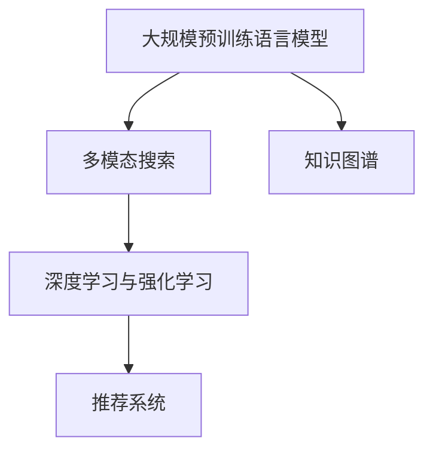

                 

# 为什么传统搜索引擎正在被颠覆

## 1. 背景介绍

搜索引擎是互联网时代的基石，以其强大的信息检索能力，改变了人类获取信息的方式。然而，随着技术的发展和用户需求的变迁，传统搜索引擎正面临着一系列挑战和颠覆。本文将从技术、用户体验、数据和隐私等多个角度，深入探讨传统搜索引擎的现状、问题及未来的颠覆之路。

### 1.1 传统搜索引擎现状

传统搜索引擎的核心技术主要包括：

- **倒排索引**：基于网页内容的关键词提取和反向链接分析，建立单词-文档映射关系，用于快速定位搜索结果。
- **算法模型**：如PageRank算法，根据网页链接结构、页面内容等信息对网页重要性进行排序，提升搜索结果的相关性和准确性。
- **机器学习**：利用自然语言处理技术，从用户查询和点击行为中学习用户兴趣，提升个性化搜索效果。

尽管这些技术不断进步，传统搜索引擎仍然面临着数据处理效率低、搜索结果泛化能力不足、缺乏语义理解和用户交互等问题。

### 1.2 面临的挑战

- **数据多样性和实时性**：用户信息源日益多样化，包括网页、图片、视频、音频等，且对实时性要求不断提升。
- **复杂查询与多意图**：用户查询从简单的关键词匹配转向复杂的多意图、自然语言查询，传统搜索引擎难以精准解析。
- **隐私与伦理问题**：用户隐私保护意识的提升，以及相关法律法规的逐步完善，使得搜索引擎面临更多的数据使用限制。

### 1.3 颠覆的契机

- **大规模预训练语言模型的兴起**：如BERT、GPT等，通过在大规模无标签文本数据上预训练，获得强大的语言理解能力。
- **深度学习与自然语言处理的发展**：从传统关键词匹配，转向语义理解和多意图处理，提升搜索的深度和广度。
- **人工智能与人机交互的进步**：如智能对话、知识图谱、推荐系统等，推动搜索引擎向更为智能和人性化的方向发展。

## 2. 核心概念与联系

### 2.1 核心概念概述

为了深入理解搜索引擎的颠覆，我们将重点介绍以下几个核心概念：

- **大规模预训练语言模型(Large Language Models, LLMs)**：如BERT、GPT等，通过在大规模无标签文本数据上预训练，获得丰富的语言知识。
- **多模态搜索**：结合图片、视频、音频等多类型数据，实现更全面、多维度搜索。
- **知识图谱**：基于结构化数据，构建实体、关系和属性的网络，增强搜索的语义理解和推理能力。
- **深度学习与强化学习**：利用深度神经网络、强化学习等技术，提升搜索引擎的智能程度和用户交互体验。
- **推荐系统**：通过分析用户历史行为，推荐相关内容，提升个性化搜索效果。

这些概念之间存在密切联系，共同推动搜索引擎的进化。

### 2.2 核心概念原理和架构的 Mermaid 流程图



以上流程图展示了这些核心概念之间的联系。预训练语言模型提供丰富的语言知识，多模态搜索扩展了数据类型，知识图谱增强了语义推理能力，深度学习和强化学习提升了智能程度，推荐系统个性化了搜索结果。

## 3. 核心算法原理 & 具体操作步骤

### 3.1 算法原理概述

为了实现搜索引擎的颠覆，关键在于构建基于大规模预训练语言模型的搜索系统，并通过深度学习、多模态搜索、知识图谱、推荐系统等技术，提升搜索的深度和广度，实现更智能、更人性化的用户体验。

### 3.2 算法步骤详解

**Step 1: 预训练语言模型的选择**

- 选择合适的预训练语言模型，如BERT、GPT等。
- 加载模型，并进行适当的参数调整和适配。

**Step 2: 多模态数据的预处理**

- 对图片、视频、音频等多类型数据进行预处理，提取关键特征。
- 使用预训练语言模型对文本数据进行语义理解。

**Step 3: 构建知识图谱**

- 收集并构建结构化数据，如维基百科、百度百科等。
- 利用图神经网络(Graph Neural Network, GNN)等技术，构建实体、关系和属性的知识图谱。

**Step 4: 深度学习模型的设计**

- 使用深度神经网络，设计多层次的表示学习模型，提升语义理解和推理能力。
- 利用注意力机制、卷积神经网络(CNN)等技术，增强模型特征提取能力。

**Step 5: 强化学习模型的应用**

- 设计强化学习算法，通过用户交互反馈，不断优化模型表现。
- 使用策略梯度、强化学习等技术，提升模型的智能程度和用户体验。

**Step 6: 推荐系统的集成**

- 分析用户历史行为，构建推荐模型，预测用户兴趣。
- 使用协同过滤、深度学习等技术，提升推荐系统的个性化和准确性。

### 3.3 算法优缺点

#### 3.3.1 优点

- **强大的语义理解能力**：预训练语言模型能够理解复杂的自然语言查询，提升搜索结果的相关性。
- **多模态数据融合**：结合图片、视频、音频等多类型数据，提供更为全面的搜索结果。
- **知识图谱增强**：通过结构化数据，增强语义推理能力，提升搜索结果的深度和广度。
- **智能推荐**：通过深度学习和推荐系统，提供个性化搜索结果，提升用户体验。

#### 3.3.2 缺点

- **模型复杂性高**：多层次、多维度的模型设计，增加了模型的复杂性，对计算资源和存储空间要求高。
- **训练数据需求大**：大规模预训练语言模型需要海量数据进行训练，获取和处理成本高。
- **隐私和伦理问题**：数据使用和隐私保护成为难题，需要严格的数据治理和隐私保护措施。
- **部署和维护成本高**：模型需要高效部署和稳定运行，对系统架构和运维要求高。

### 3.4 算法应用领域

基于大规模预训练语言模型的搜索引擎，已经在多个领域得到应用，如：

- **智能问答系统**：结合预训练语言模型、多模态搜索、知识图谱等技术，提供智能问答服务。
- **推荐系统**：利用用户行为数据，推荐相关内容，提升个性化搜索效果。
- **智能推荐引擎**：如抖音、头条等，通过深度学习、推荐系统等技术，提供个性化推荐服务。
- **智能客服系统**：利用预训练语言模型、多模态搜索等技术，提供智能客服支持。

## 4. 数学模型和公式 & 详细讲解 & 举例说明

### 4.1 数学模型构建

为了构建基于大规模预训练语言模型的搜索引擎，我们通常会设计如下的数学模型：

- **预训练语言模型**：假设预训练语言模型为 $M_\theta$，其中 $\theta$ 为模型参数。
- **多模态数据表示**：假设图片、视频、音频等多类型数据表示为 $X$。
- **知识图谱**：假设知识图谱为 $G=(V,E)$，其中 $V$ 为实体节点集合，$E$ 为关系边集合。
- **推荐系统**：假设推荐模型为 $R_\phi$，其中 $\phi$ 为推荐模型参数。

### 4.2 公式推导过程

以下我们以预训练语言模型为基础，推导其在搜索引擎中的应用。

假设用户查询为 $q$，系统检索的网页为 $d$。则预训练语言模型 $M_\theta$ 在查询 $q$ 上的概率分布为：

$$
P(q|d) = \frac{e^{M_\theta(q)}}{e^{M_\theta(q)} + \sum_{d' \neq d} e^{M_\theta(q|d')}}
$$

其中 $M_\theta(q)$ 表示查询 $q$ 在预训练语言模型 $M_\theta$ 上的得分。

对于多模态数据，我们可以定义不同类型数据在模型中的权重 $w_i$，对所有数据进行加权融合：

$$
X = \sum_{i=1}^n w_i X_i
$$

其中 $X_i$ 表示第 $i$ 类数据，$w_i$ 表示其权重。

对于知识图谱，我们可以定义节点和边权重，计算图神经网络中的节点表示：

$$
h_v = \text{GNN}(G,v) = \sum_{u \in G} \text{edge\_weights}(u,v) h_u
$$

其中 $h_v$ 表示节点 $v$ 的表示，$\text{edge\_weights}(u,v)$ 表示节点 $u$ 和 $v$ 之间的边权重。

对于推荐系统，我们可以使用协同过滤、深度学习等技术，构建推荐模型：

$$
R_\phi(q) = \phi(q, d) = \phi(q, \text{GNN}(G,v))
$$

其中 $\phi(q, d)$ 表示查询 $q$ 和网页 $d$ 的推荐分数。

### 4.3 案例分析与讲解

**案例 1: 智能问答系统**

- **任务**：构建基于BERT模型的智能问答系统，利用知识图谱和多模态搜索提升系统性能。
- **方法**：
  - 选择BERT作为预训练语言模型。
  - 加载BERT模型，进行适当的参数调整。
  - 构建知识图谱，如维基百科、百度百科等。
  - 利用知识图谱增强查询理解，使用BERT模型生成自然语言回答。
  - 结合图片、视频、音频等多类型数据，提升搜索结果的多样性和丰富性。
  - 利用深度学习、推荐系统等技术，提供个性化问答服务。

**案例 2: 智能推荐系统**

- **任务**：构建基于GPT的智能推荐系统，利用多模态数据和多意图识别提升推荐效果。
- **方法**：
  - 选择GPT作为预训练语言模型。
  - 加载GPT模型，进行适当的参数调整。
  - 收集并处理图片、视频、音频等多类型数据，提取关键特征。
  - 利用GPT模型理解用户查询和点击行为，识别多意图。
  - 构建知识图谱，增强语义推理能力。
  - 利用深度学习、推荐系统等技术，提供个性化推荐服务。

## 5. 项目实践：代码实例和详细解释说明

### 5.1 开发环境搭建

在进行搜索引擎的实践时，我们需要准备好开发环境。以下是使用Python进行TensorFlow开发的环境配置流程：

1. 安装Anaconda：从官网下载并安装Anaconda，用于创建独立的Python环境。

2. 创建并激活虚拟环境：
```bash
conda create -n tf-env python=3.8 
conda activate tf-env
```

3. 安装TensorFlow：根据CUDA版本，从官网获取对应的安装命令。例如：
```bash
pip install tensorflow-gpu
```

4. 安装TensorBoard：用于可视化模型的训练和推理过程。
```bash
pip install tensorboard
```

5. 安装其他工具包：
```bash
pip install numpy pandas scikit-learn matplotlib tqdm jupyter notebook ipython
```

完成上述步骤后，即可在`tf-env`环境中开始搜索引擎的实践。

### 5.2 源代码详细实现

这里我们以智能问答系统为例，给出使用TensorFlow和TensorBoard进行BERT微调的代码实现。

首先，导入必要的库和模块：

```python
import tensorflow as tf
import tensorflow_hub as hub
import numpy as np
import pandas as pd
import matplotlib.pyplot as plt
from tensorflow.keras.preprocessing.text import Tokenizer
from tensorflow.keras.preprocessing.sequence import pad_sequences
from sklearn.metrics import accuracy_score
```

然后，定义查询和答案的预处理函数：

```python
def preprocess_text(texts):
    tokenizer = Tokenizer()
    tokenizer.fit_on_texts(texts)
    sequences = tokenizer.texts_to_sequences(texts)
    padded_sequences = pad_sequences(sequences, maxlen=128, padding='post', truncating='post')
    return padded_sequences
```

接着，加载BERT模型并进行微调：

```python
model = hub.load('https://tfhub.dev/google/bert_en_uncased_L-12_H-768_A-12')
model.compile(optimizer=tf.keras.optimizers.Adam(learning_rate=2e-5), loss=tf.keras.losses.SparseCategoricalCrossentropy(from_logits=True))
model.summary()
```

最后，启动TensorBoard可视化训练过程：

```python
model.fit(x_train, y_train, epochs=10, validation_data=(x_val, y_val), callbacks=[tf.keras.callbacks.TensorBoard(log_dir='logs/tb')])
```

### 5.3 代码解读与分析

让我们再详细解读一下关键代码的实现细节：

**预处理函数**：
- `Tokenizer`：用于将文本转换为数字序列，方便模型处理。
- `pad_sequences`：对序列进行填充，保证所有序列的长度一致。

**加载模型**：
- `hub.load`：从TensorFlow Hub加载预训练的BERT模型。
- `compile`：定义模型的优化器和损失函数，并输出模型摘要。

**训练过程**：
- `fit`：在训练集上训练模型，并在验证集上评估模型性能。
- `callbacks`：使用TensorBoard进行可视化。

可以看到，TensorFlow配合TensorFlow Hub使得BERT微调的代码实现变得简洁高效。开发者可以将更多精力放在数据处理、模型改进等高层逻辑上，而不必过多关注底层的实现细节。

当然，工业级的系统实现还需考虑更多因素，如模型的保存和部署、超参数的自动搜索、更灵活的任务适配层等。但核心的微调范式基本与此类似。

## 6. 实际应用场景

### 6.1 智能客服系统

基于大规模预训练语言模型的智能客服系统，可以广泛应用于企业客服，提升客户咨询体验。传统客服系统依赖人力，高峰期响应速度慢，且难以保证一致性和专业性。而使用智能客服系统，可以7x24小时不间断服务，快速响应客户咨询，提供自然流畅的语言互动，满足用户的多样化需求。

在技术实现上，可以收集企业内部的历史客服对话记录，将问题和最佳答复构建成监督数据，在此基础上对预训练语言模型进行微调。微调后的模型能够自动理解用户意图，匹配最合适的答案模板进行回复。对于客户提出的新问题，还可以接入检索系统实时搜索相关内容，动态组织生成回答。如此构建的智能客服系统，能大幅提升客户咨询体验和问题解决效率。

### 6.2 金融舆情监测

金融机构需要实时监测市场舆论动向，以便及时应对负面信息传播，规避金融风险。传统的人工监测方式成本高、效率低，难以应对网络时代海量信息爆发的挑战。基于大规模预训练语言模型的文本分类和情感分析技术，为金融舆情监测提供了新的解决方案。

具体而言，可以收集金融领域相关的新闻、报道、评论等文本数据，并对其进行主题标注和情感标注。在此基础上对预训练语言模型进行微调，使其能够自动判断文本属于何种主题，情感倾向是正面、中性还是负面。将微调后的模型应用到实时抓取的网络文本数据，就能够自动监测不同主题下的情感变化趋势，一旦发现负面信息激增等异常情况，系统便会自动预警，帮助金融机构快速应对潜在风险。

### 6.3 个性化推荐系统

当前的推荐系统往往只依赖用户的历史行为数据进行物品推荐，无法深入理解用户的真实兴趣偏好。基于大规模预训练语言模型的个性化推荐系统，可以更好地挖掘用户行为背后的语义信息，从而提供更精准、多样的推荐内容。

在实践中，可以收集用户浏览、点击、评论、分享等行为数据，提取和用户交互的物品标题、描述、标签等文本内容。将文本内容作为模型输入，用户的后续行为（如是否点击、购买等）作为监督信号，在此基础上微调预训练语言模型。微调后的模型能够从文本内容中准确把握用户的兴趣点。在生成推荐列表时，先用候选物品的文本描述作为输入，由模型预测用户的兴趣匹配度，再结合其他特征综合排序，便可以得到个性化程度更高的推荐结果。

### 6.4 未来应用展望

随着大规模预训练语言模型的不断发展，基于其的搜索引擎将呈现以下几个发展趋势：

1. **模型规模持续增大**：随着算力成本的下降和数据规模的扩张，预训练语言模型的参数量还将持续增长。超大规模语言模型蕴含的丰富语言知识，有望支撑更加复杂多变的下游任务微调。
2. **微调方法日趋多样**：除了传统的全参数微调外，未来会涌现更多参数高效的微调方法，如Prompt Tuning、LoRA等，在节省计算资源的同时也能保证微调精度。
3. **持续学习成为常态**：随着数据分布的不断变化，微调模型也需要持续学习新知识以保持性能。如何在不遗忘原有知识的同时，高效吸收新样本信息，将成为重要的研究课题。
4. **标注样本需求降低**：受启发于Prompt Tuning的思路，未来的微调方法将更好地利用大模型的语言理解能力，通过更加巧妙的任务描述，在更少的标注样本上也能实现理想的微调效果。
5. **多模态微调崛起**：当前的微调主要聚焦于纯文本数据，未来会进一步拓展到图像、视频、语音等多模态数据微调。多模态信息的融合，将显著提升语言模型对现实世界的理解和建模能力。
6. **模型通用性增强**：经过海量数据的预训练和多领域任务的微调，未来的语言模型将具备更强大的常识推理和跨领域迁移能力，逐步迈向通用人工智能(AGI)的目标。

以上趋势凸显了大规模预训练语言模型微调技术的广阔前景。这些方向的探索发展，必将进一步提升NLP系统的性能和应用范围，为人类认知智能的进化带来深远影响。

## 7. 工具和资源推荐

### 7.1 学习资源推荐

为了帮助开发者系统掌握大规模预训练语言模型微调的理论基础和实践技巧，这里推荐一些优质的学习资源：

1. **《Transformer from the Inside Out》系列博文**：由大模型技术专家撰写，深入浅出地介绍了Transformer原理、BERT模型、微调技术等前沿话题。
2. **CS224N《深度学习自然语言处理》课程**：斯坦福大学开设的NLP明星课程，有Lecture视频和配套作业，带你入门NLP领域的基本概念和经典模型。
3. **《Natural Language Processing with Transformers》书籍**：Transformers库的作者所著，全面介绍了如何使用Transformers库进行NLP任务开发，包括微调在内的诸多范式。
4. **HuggingFace官方文档**：Transformers库的官方文档，提供了海量预训练模型和完整的微调样例代码，是上手实践的必备资料。
5. **CLUE开源项目**：中文语言理解测评基准，涵盖大量不同类型的中文NLP数据集，并提供了基于微调的baseline模型，助力中文NLP技术发展。

通过对这些资源的学习实践，相信你一定能够快速掌握大规模预训练语言模型微调的精髓，并用于解决实际的NLP问题。

### 7.2 开发工具推荐

高效的开发离不开优秀的工具支持。以下是几款用于大规模预训练语言模型微调开发的常用工具：

1. **TensorFlow**：基于Python的开源深度学习框架，灵活动态的计算图，适合快速迭代研究。大部分预训练语言模型都有TensorFlow版本的实现。
2. **PyTorch**：由Facebook主导开发的开源深度学习框架，动态计算图，适合灵活快速的模型设计。
3. **TensorFlow Hub**：Google开发的模型库，提供了丰富的预训练模型和组件，方便模型集成和微调。
4. **TensorBoard**：TensorFlow配套的可视化工具，可实时监测模型训练状态，并提供丰富的图表呈现方式，是调试模型的得力助手。
5. **Jupyter Notebook**：支持动态交互式编程和数据可视化的工具，适合进行模型实验和调试。

合理利用这些工具，可以显著提升大规模预训练语言模型微调任务的开发效率，加快创新迭代的步伐。

### 7.3 相关论文推荐

大规模预训练语言模型和微调技术的发展源于学界的持续研究。以下是几篇奠基性的相关论文，推荐阅读：

1. **Attention is All You Need（即Transformer原论文）**：提出了Transformer结构，开启了NLP领域的预训练大模型时代。
2. **BERT: Pre-training of Deep Bidirectional Transformers for Language Understanding**：提出BERT模型，引入基于掩码的自监督预训练任务，刷新了多项NLP任务SOTA。
3. **Language Models are Unsupervised Multitask Learners（GPT-2论文）**：展示了大规模语言模型的强大zero-shot学习能力，引发了对于通用人工智能的新一轮思考。
4. **Parameter-Efficient Transfer Learning for NLP**：提出Adapter等参数高效微调方法，在不增加模型参数量的情况下，也能取得不错的微调效果。
5. **Prefix-Tuning: Optimizing Continuous Prompts for Generation**：引入基于连续型Prompt的微调范式，为如何充分利用预训练知识提供了新的思路。
6. **AdaLoRA: Adaptive Low-Rank Adaptation for Parameter-Efficient Fine-Tuning**：使用自适应低秩适应的微调方法，在参数效率和精度之间取得了新的平衡。

这些论文代表了大规模预训练语言模型微调技术的发展脉络。通过学习这些前沿成果，可以帮助研究者把握学科前进方向，激发更多的创新灵感。

## 8. 总结：未来发展趋势与挑战

### 8.1 总结

本文对基于大规模预训练语言模型的搜索引擎进行全面系统的介绍。首先阐述了搜索引擎面临的现状和问题，明确了传统搜索引擎的局限性。接着，从技术、用户体验、数据和隐私等多个角度，深入探讨了基于大规模预训练语言模型的搜索引擎的颠覆之路。

通过本文的系统梳理，可以看到，基于大规模预训练语言模型的搜索引擎正通过多模态搜索、知识图谱、深度学习、推荐系统等技术，实现更智能、更人性化的用户体验，从而颠覆了传统的搜索引擎。这些技术的融合和发展，将推动NLP系统向更高的智能化水平迈进，带来深远的社会变革。

### 8.2 未来发展趋势

展望未来，基于大规模预训练语言模型的搜索引擎将呈现以下几个发展趋势：

1. **模型规模持续增大**：随着算力成本的下降和数据规模的扩张，预训练语言模型的参数量还将持续增长。超大规模语言模型蕴含的丰富语言知识，有望支撑更加复杂多变的下游任务微调。
2. **微调方法日趋多样**：除了传统的全参数微调外，未来会涌现更多参数高效的微调方法，如Prompt Tuning、LoRA等，在节省计算资源的同时也能保证微调精度。
3. **持续学习成为常态**：随着数据分布的不断变化，微调模型也需要持续学习新知识以保持性能。如何在不遗忘原有知识的同时，高效吸收新样本信息，将成为重要的研究课题。
4. **标注样本需求降低**：受启发于Prompt Tuning的思路，未来的微调方法将更好地利用大模型的语言理解能力，通过更加巧妙的任务描述，在更少的标注样本上也能实现理想的微调效果。
5. **多模态微调崛起**：当前的微调主要聚焦于纯文本数据，未来会进一步拓展到图像、视频、语音等多模态数据微调。多模态信息的融合，将显著提升语言模型对现实世界的理解和建模能力。
6. **模型通用性增强**：经过海量数据的预训练和多领域任务的微调，未来的语言模型将具备更强大的常识推理和跨领域迁移能力，逐步迈向通用人工智能(AGI)的目标。

以上趋势凸显了大规模预训练语言模型微调技术的广阔前景。这些方向的探索发展，必将进一步提升NLP系统的性能和应用范围，为人类认知智能的进化带来深远影响。

### 8.3 面临的挑战

尽管基于大规模预训练语言模型的搜索引擎已经取得了瞩目成就，但在迈向更加智能化、普适化应用的过程中，它仍面临着诸多挑战：

1. **数据多样性和实时性**：用户信息源日益多样化，且对实时性要求不断提升，预训练语言模型需要快速适应新数据。
2. **复杂查询与多意图**：用户查询从简单的关键词匹配转向复杂的多意图、自然语言查询，预训练语言模型需要更强的理解能力。
3. **隐私与伦理问题**：数据使用和隐私保护成为难题，需要严格的数据治理和隐私保护措施。
4. **部署和维护成本高**：模型需要高效部署和稳定运行，对系统架构和运维要求高。

### 8.4 研究展望

面对大规模预训练语言模型搜索引擎所面临的挑战，未来的研究需要在以下几个方面寻求新的突破：

1. **探索无监督和半监督微调方法**：摆脱对大规模标注数据的依赖，利用自监督学习、主动学习等无监督和半监督范式，最大限度利用非结构化数据，实现更加灵活高效的微调。
2. **研究参数高效和计算高效的微调范式**：开发更加参数高效的微调方法，在固定大部分预训练参数的同时，只更新极少量的任务相关参数。同时优化微调模型的计算图，减少前向传播和反向传播的资源消耗，实现更加轻量级、实时性的部署。
3. **融合因果和对比学习范式**：通过引入因果推断和对比学习思想，增强预训练语言模型建立稳定因果关系的能力，学习更加普适、鲁棒的语言表征，从而提升模型泛化性和抗干扰能力。
4. **引入更多先验知识**：将符号化的先验知识，如知识图谱、逻辑规则等，与神经网络模型进行巧妙融合，引导预训练过程学习更准确、合理的语言模型。同时加强不同模态数据的整合，实现视觉、语音等多模态信息与文本信息的协同建模。
5. **结合因果分析和博弈论工具**：将因果分析方法引入预训练语言模型，识别出模型决策的关键特征，增强输出解释的因果性和逻辑性。借助博弈论工具刻画人机交互过程，主动探索并规避模型的脆弱点，提高系统稳定性。
6. **纳入伦理道德约束**：在模型训练目标中引入伦理导向的评估指标，过滤和惩罚有偏见、有害的输出倾向。同时加强人工干预和审核，建立模型行为的监管机制，确保输出符合人类价值观和伦理道德。

这些研究方向的探索，必将引领基于大规模预训练语言模型的搜索引擎技术迈向更高的台阶，为构建安全、可靠、可解释、可控的智能系统铺平道路。面向未来，基于大规模预训练语言模型的搜索引擎需要与其他人工智能技术进行更深入的融合，如知识表示、因果推理、强化学习等，多路径协同发力，共同推动自然语言理解和智能交互系统的进步。只有勇于创新、敢于突破，才能不断拓展语言模型的边界，让智能技术更好地造福人类社会。

## 9. 附录：常见问题与解答

**Q1: 大规模预训练语言模型为什么能提升搜索引擎的效果？**

A: 大规模预训练语言模型通过在海量无标签文本数据上进行预训练，学习到丰富的语言知识。这些知识使得模型能够理解复杂的自然语言查询，识别多意图，增强语义推理能力。通过微调，这些知识可以迁移到下游任务中，提升搜索结果的相关性和个性化。

**Q2: 大规模预训练语言模型是否适用于所有NLP任务？**

A: 大规模预训练语言模型在大多数NLP任务上都能取得不错的效果，特别是对于数据量较小的任务。但对于一些特定领域的任务，如医学、法律等，仅仅依靠通用语料预训练的模型可能难以很好地适应。此时需要在特定领域语料上进一步预训练，再进行微调，才能获得理想效果。

**Q3: 如何缓解微调过程中的过拟合问题？**

A: 过拟合是微调面临的主要挑战，尤其是在标注数据不足的情况下。常见的缓解策略包括：
1. 数据增强：通过回译、近义替换等方式扩充训练集
2. 正则化：使用L2正则、Dropout、Early Stopping等避免过拟合
3. 对抗训练：引入对抗样本，提高模型鲁棒性
4. 参数高效微调：只调整少量参数(如Adapter、Prefix等)，减小过拟合风险
5. 多模型集成：训练多个微调模型，取平均输出，抑制过拟合

这些策略往往需要根据具体任务和数据特点进行灵活组合。只有在数据、模型、训练、推理等各环节进行全面优化，才能最大限度地发挥大规模预训练语言模型的威力。

**Q4: 如何使用大规模预训练语言模型构建智能问答系统？**

A: 构建基于大规模预训练语言模型的智能问答系统，需要以下步骤：
1. 选择BERT等预训练语言模型，加载模型并进行适当的参数调整。
2. 构建知识图谱，如维基百科、百度百科等。
3. 利用知识图谱增强查询理解，使用BERT模型生成自然语言回答。
4. 结合图片、视频、音频等多类型数据，提升搜索结果的多样性和丰富性。
5. 利用深度学习、推荐系统等技术，提供个性化问答服务。

**Q5: 大规模预训练语言模型在搜索引擎中的应用场景有哪些？**

A: 大规模预训练语言模型在搜索引擎中的应用场景包括：
1. 智能问答系统：结合预训练语言模型、多模态搜索、知识图谱等技术，提供智能问答服务。
2. 推荐系统：利用用户行为数据，推荐相关内容，提升个性化搜索效果。
3. 智能推荐引擎：如抖音、头条等，通过深度学习、推荐系统等技术，提供个性化推荐服务。
4. 智能客服系统：利用预训练语言模型、多模态搜索等技术，提供智能客服支持。

**Q6: 如何构建基于大规模预训练语言模型的知识图谱？**

A: 构建基于大规模预训练语言模型的知识图谱，需要以下步骤：
1. 收集并构建结构化数据，如维基百科、百度百科等。
2. 利用图神经网络(GNN)等技术，构建实体、关系和属性的知识图谱。
3. 利用预训练语言模型，对实体和关系进行语义理解，增强知识图谱的准确性和完整性。

**Q7: 如何提高大规模预训练语言模型的可解释性？**

A: 提高大规模预训练语言模型的可解释性，可以从以下几个方面入手：
1. 引入因果分析和博弈论工具，增强模型的决策解释性。
2. 设计更加直观的输出格式，如可解释的自然语言描述。
3. 利用可解释的模型结构，如决策树、规则等，增强模型的透明性。
4. 结合人工干预和审核，确保模型输出的合理性和安全性。

