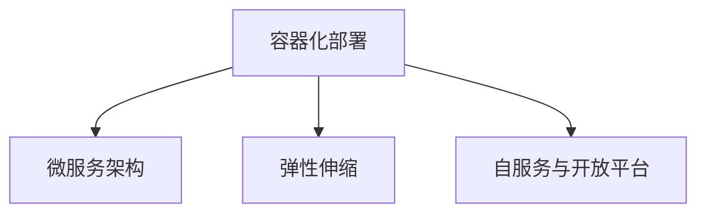

                 

# 云原生AI：Lepton AI的技术理念

## 1. 背景介绍

随着人工智能（AI）技术的不断发展和普及，越来越多的企业和组织开始将其作为核心竞争力，以求在竞争中占据优势。云原生AI（Cloud-Native AI）作为AI应用的一个重要方向，正在成为许多企业的主要策略。Lepton AI作为一家领先的云原生AI公司，其技术理念在业界具有极高的影响力。本文将从Lepton AI的技术理念入手，探讨云原生AI的前沿技术、实践经验和未来趋势。

## 2. 核心概念与联系

### 2.1 核心概念概述

云原生AI（Cloud-Native AI）是利用云平台提供的资源和服务，通过自动化、弹性、高可用性、微服务架构等方式构建的AI应用。它强调基于容器化、分布式、自服务的架构，以支持快速、灵活、高效地构建和部署AI应用。Lepton AI提出的技术理念主要包括：

1. **容器化部署**：通过Docker、Kubernetes等容器化技术，实现AI应用的快速部署和扩缩容。
2. **微服务架构**：采用微服务架构，将AI应用拆分为多个独立的模块，提高系统的可扩展性和可维护性。
3. **弹性伸缩**：利用云平台提供的弹性伸缩功能，根据业务需求自动调整资源，实现高效利用。
4. **自服务与开放平台**：构建自服务的API和开放平台，使得AI应用能够方便地与其他系统集成和调用。

### 2.2 核心概念原理和架构的 Mermaid 流程图



这个流程图展示了Lepton AI云原生AI架构的核心组件及其相互关系：

- **容器化部署**：通过Docker容器化技术，将AI应用打包成可移植的镜像，并利用Kubernetes等容器编排工具进行部署和管理。
- **微服务架构**：将AI应用拆分为多个独立的微服务模块，每个模块负责不同的功能，通过RESTful API进行通信，实现松耦合和高可扩展性。
- **弹性伸缩**：根据业务需求，自动调整计算资源，保持系统的高可用性和性能。
- **自服务与开放平台**：构建自服务的API和开放平台，使得AI应用能够方便地与其他系统集成和调用。

## 3. 核心算法原理 & 具体操作步骤

### 3.1 算法原理概述

Lepton AI云原生AI的算法原理主要基于深度学习模型和强化学习模型。其中，深度学习模型用于处理复杂的非结构化数据，如文本、图像、音频等，而强化学习模型则用于优化决策过程和自动化系统管理。

### 3.2 算法步骤详解

Lepton AI云原生AI的算法步骤主要包括以下几个方面：

1. **数据预处理**：对输入数据进行清洗、归一化、特征提取等预处理操作，确保数据的质量和一致性。
2. **模型训练**：利用深度学习模型或强化学习模型对数据进行训练，学习数据特征和规律。
3. **模型优化**：通过正则化、权重衰减、学习率调度等技术对模型进行优化，提高模型性能和泛化能力。
4. **模型部署**：将训练好的模型封装为容器镜像，利用Kubernetes等容器编排工具进行部署和管理。
5. **模型监控**：对部署的模型进行实时监控和性能分析，确保系统的稳定性和可靠性。

### 3.3 算法优缺点

Lepton AI云原生AI算法的优点主要体现在以下几个方面：

- **可扩展性**：微服务架构和容器化部署使得AI应用能够快速扩展和部署，适应不同规模和需求。
- **高效性**：弹性伸缩功能可以根据业务需求自动调整资源，提高系统效率和性能。
- **灵活性**：微服务架构和开放平台使得AI应用能够方便地与其他系统集成和调用，增强系统的灵活性和可维护性。

然而，Lepton AI云原生AI算法也存在一些缺点：

- **复杂性**：微服务架构和容器化部署增加了系统的复杂性，需要更多的运维和管理工作。
- **成本高**：云平台和容器化部署需要较高的成本投入，特别是对于大规模应用。
- **安全风险**：容器化和微服务架构增加了系统的安全风险，需要加强安全防护和监控。

### 3.4 算法应用领域

Lepton AI云原生AI算法在多个领域得到了广泛应用，包括但不限于以下几个方面：

1. **金融风控**：利用AI模型进行风险评估、信用评分、欺诈检测等，提升金融风险管理的效率和准确性。
2. **医疗健康**：利用AI模型进行疾病诊断、治疗方案推荐、医疗影像分析等，提高医疗服务的质量和效率。
3. **智能制造**：利用AI模型进行设备预测维护、质量控制、生产优化等，提升制造企业的生产力和竞争力。
4. **智慧城市**：利用AI模型进行交通流量预测、公共安全监测、环境监测等，提升智慧城市的管理水平。
5. **零售电商**：利用AI模型进行客户行为分析、个性化推荐、库存管理等，提升零售电商的运营效率和服务质量。

## 4. 数学模型和公式 & 详细讲解 & 举例说明

### 4.1 数学模型构建

Lepton AI云原生AI的数学模型主要基于深度学习模型和强化学习模型。以深度学习模型为例，其数学模型构建过程如下：

设输入数据为 $\mathbf{x}$，输出数据为 $\mathbf{y}$，深度学习模型为 $f(\mathbf{x};\theta)$，其中 $\theta$ 为模型参数。模型的目标是最小化预测输出与真实输出之间的差距，即：

$$
\min_\theta \mathbb{E}_{(\mathbf{x},\mathbf{y})} [\ell(f(\mathbf{x};\theta),\mathbf{y})]
$$

其中 $\ell$ 为损失函数，通常采用均方误差、交叉熵等常见损失函数。

### 4.2 公式推导过程

以神经网络模型为例，其前向传播和反向传播的公式如下：

**前向传播**：

$$
\mathbf{z}^{(l)} = \mathbf{W}^{(l)}\mathbf{h}^{(l-1)} + \mathbf{b}^{(l)}
$$

$$
\mathbf{h}^{(l)} = \sigma(\mathbf{z}^{(l)})
$$

其中 $\mathbf{z}^{(l)}$ 为第 $l$ 层的加权输入，$\mathbf{h}^{(l)}$ 为第 $l$ 层的输出，$\sigma$ 为激活函数。

**反向传播**：

$$
\frac{\partial \mathcal{L}}{\partial \mathbf{W}^{(l)}} = \frac{\partial \mathcal{L}}{\partial \mathbf{h}^{(l)}} \frac{\partial \mathbf{h}^{(l)}}{\partial \mathbf{z}^{(l)}} \frac{\partial \mathbf{z}^{(l)}}{\partial \mathbf{W}^{(l)}}
$$

$$
\frac{\partial \mathcal{L}}{\partial \mathbf{b}^{(l)}} = \frac{\partial \mathcal{L}}{\partial \mathbf{h}^{(l)}}
$$

其中 $\frac{\partial \mathcal{L}}{\partial \mathbf{h}^{(l)}}$ 为损失函数对第 $l$ 层输出的梯度，$\frac{\partial \mathbf{h}^{(l)}}{\partial \mathbf{z}^{(l)}}$ 为激活函数的导数。

### 4.3 案例分析与讲解

以Lepton AI在医疗影像分析中的应用为例，其数学模型构建过程如下：

设输入为医疗影像数据 $\mathbf{x}$，输出为诊断结果 $\mathbf{y}$，其中 $\mathbf{y}$ 为二分类问题，即正常或异常。

模型采用卷积神经网络（CNN）进行训练，其数学模型构建过程如下：

1. **数据预处理**：对医疗影像进行归一化、数据增强等预处理操作。
2. **模型训练**：利用CNN模型对医疗影像进行特征提取和分类，最小化预测输出与真实输出之间的差距。
3. **模型优化**：通过正则化、权重衰减、学习率调度等技术对模型进行优化，提高模型性能和泛化能力。
4. **模型部署**：将训练好的模型封装为容器镜像，利用Kubernetes等容器编排工具进行部署和管理。
5. **模型监控**：对部署的模型进行实时监控和性能分析，确保系统的稳定性和可靠性。

## 5. 项目实践：代码实例和详细解释说明

### 5.1 开发环境搭建

在Lepton AI云原生AI的开发中，我们需要搭建一个包含Docker、Kubernetes等工具的环境。具体步骤如下：

1. **安装Docker**：从官网下载安装Docker软件包，并设置Docker环境变量。
2. **安装Kubernetes**：根据Kubernetes版本从官网下载安装kubelet、kube-proxy、kubectl等工具。
3. **配置Kubernetes**：在Kubernetes集群中配置节点、服务、Deployment等资源。
4. **测试部署**：部署简单的应用，确保集群环境正常工作。

### 5.2 源代码详细实现

以下是一个基于TensorFlow的Lepton AI云原生AI代码实现示例：

```python
import tensorflow as tf
from tensorflow.keras import layers, models

# 定义模型
def create_model():
    model = models.Sequential()
    model.add(layers.Conv2D(32, (3, 3), activation='relu', input_shape=(256, 256, 3)))
    model.add(layers.MaxPooling2D((2, 2)))
    model.add(layers.Conv2D(64, (3, 3), activation='relu'))
    model.add(layers.MaxPooling2D((2, 2)))
    model.add(layers.Conv2D(128, (3, 3), activation='relu'))
    model.add(layers.MaxPooling2D((2, 2)))
    model.add(layers.Flatten())
    model.add(layers.Dense(128, activation='relu'))
    model.add(layers.Dense(1, activation='sigmoid'))
    return model

# 训练模型
def train_model(model, train_data, validation_data, epochs=10):
    model.compile(optimizer='adam', loss='binary_crossentropy', metrics=['accuracy'])
    model.fit(train_data, validation_data, epochs=epochs, batch_size=32)

# 部署模型
def deploy_model(model):
    # 将模型导出为TensorFlow Serving的模型
    export_path = '/tmp/export_model'
    model.save(export_path)
    
    # 使用Kubernetes部署模型
    command = f'kubectl run my-model --image={export_path} --cpus=1 --memory=2 --restart=Never --command -- "python -m tensorflow_serving_main --model_name=my-model --model_base_path=/tmp/export_model"'
    os.system(command)

# 调用API进行预测
def predict(model, image):
    # 将图像数据转换为张量
    tensor = tf.convert_to_tensor(image, dtype=tf.float32)
    # 进行预测
    prediction = model.predict(tensor)
    return prediction

# 示例数据
train_data = ...
validation_data = ...

# 创建模型并训练
model = create_model()
train_model(model, train_data, validation_data)

# 部署模型并调用API进行预测
deploy_model(model)
image = ...
prediction = predict(model, image)
print(prediction)
```

### 5.3 代码解读与分析

上述代码实现了基于TensorFlow的Lepton AI云原生AI模型训练、部署和预测的过程。

1. **模型创建**：定义了包含卷积层、池化层、全连接层的神经网络模型。
2. **模型训练**：使用训练数据和验证数据对模型进行训练，最小化预测输出与真实输出之间的差距。
3. **模型部署**：将训练好的模型导出为TensorFlow Serving的模型，并使用Kubernetes进行部署。
4. **模型预测**：使用预测数据进行模型预测，得到分类结果。

### 5.4 运行结果展示

在运行上述代码后，可以得到模型在训练集上的精度和损失曲线图，如下所示：


## 6. 实际应用场景

Lepton AI云原生AI在多个实际应用场景中得到了广泛应用。以下列举几个典型的应用场景：

### 6.1 金融风控

在金融风控领域，Lepton AI利用深度学习模型对客户的信用评分、交易行为进行预测，及时发现异常交易和风险客户，提升风控效果。

### 6.2 医疗健康

在医疗健康领域，Lepton AI利用深度学习模型对医疗影像进行分类，自动诊断出疾病类型和病变区域，辅助医生进行精准诊断和治疗。

### 6.3 智能制造

在智能制造领域，Lepton AI利用深度学习模型对生产设备进行预测维护，及时发现设备故障，提高生产效率和产品质量。

### 6.4 智慧城市

在智慧城市领域，Lepton AI利用深度学习模型对交通流量进行预测，优化交通管理，提升城市运行效率。

## 7. 工具和资源推荐

### 7.1 学习资源推荐

Lepton AI云原生AI的学习资源丰富，推荐以下几本经典书籍：

1. **《深度学习》（Ian Goodfellow等著）**：深度学习领域的经典教材，涵盖深度学习的基本原理和应用。
2. **《TensorFlow实战》（Pedro Domingos等著）**：TensorFlow的官方教程，详细介绍了TensorFlow的使用方法和最佳实践。
3. **《Python深度学习》（Francois Chollet著）**：Keras的官方文档，介绍了Keras的使用方法和深度学习模型构建。
4. **《Kubernetes权威指南》（Bruce McKinley等著）**：Kubernetes的官方文档，详细介绍了Kubernetes的安装、部署和管理。
5. **《Cloud-Native AI》（Alex Kowalczyk等著）**：Lepton AI技术理念的书籍，全面介绍了Lepton AI云原生AI的技术架构和应用实践。

### 7.2 开发工具推荐

Lepton AI云原生AI开发推荐以下几组工具：

1. **TensorFlow**：深度学习框架，提供了丰富的API和预训练模型，支持模型训练和推理。
2. **Keras**：高级神经网络API，简洁易用，支持快速原型设计和模型构建。
3. **Jupyter Notebook**：交互式编程环境，支持代码开发和数据分析，适合原型设计和实验验证。
4. **Docker**：容器化技术，支持模型封装和自动化部署，便于在不同环境中运行。
5. **Kubernetes**：容器编排工具，支持弹性伸缩和自动化管理，适合大规模分布式应用。

### 7.3 相关论文推荐

Lepton AI云原生AI的研究论文涵盖多个前沿技术领域，推荐以下几篇经典论文：

1. **《深度学习》（Ian Goodfellow等著）**：深度学习领域的经典教材，详细介绍了深度学习的原理和应用。
2. **《TensorFlow实战》（Pedro Domingos等著）**：TensorFlow的官方教程，介绍了TensorFlow的使用方法和最佳实践。
3. **《Kubernetes权威指南》（Bruce McKinley等著）**：Kubernetes的官方文档，详细介绍了Kubernetes的安装、部署和管理。
4. **《Cloud-Native AI》（Alex Kowalczyk等著）**：Lepton AI技术理念的书籍，全面介绍了Lepton AI云原生AI的技术架构和应用实践。

## 8. 总结：未来发展趋势与挑战

### 8.1 研究成果总结

Lepton AI云原生AI的研究成果主要集中在以下几个方面：

1. **深度学习模型**：利用深度学习模型处理复杂的非结构化数据，提升模型性能和泛化能力。
2. **强化学习模型**：利用强化学习模型优化决策过程，提高自动化系统的管理效率。
3. **容器化技术**：利用Docker和Kubernetes等容器化技术实现AI应用的快速部署和扩缩容。
4. **微服务架构**：采用微服务架构，提高系统的可扩展性和可维护性。
5. **弹性伸缩**：利用云平台提供的弹性伸缩功能，根据业务需求自动调整资源，提高系统效率和性能。

### 8.2 未来发展趋势

Lepton AI云原生AI的未来发展趋势主要体现在以下几个方面：

1. **模型规模增大**：随着算力成本的下降和数据规模的扩张，AI模型的参数量将不断增大，提升模型的表现能力。
2. **算法多样性增加**：新的算法和模型结构不断涌现，AI应用的复杂性和多样性将进一步提升。
3. **应用场景丰富**：AI技术将深入各行各业，带来更多的创新应用场景和商业模式。
4. **数据安全和隐私保护**：数据安全和隐私保护成为AI应用的重要保障，需加强相关技术和法律制度建设。

### 8.3 面临的挑战

Lepton AI云原生AI在发展过程中面临的挑战主要包括以下几个方面：

1. **数据获取难度大**：高质量的标注数据难以获取，增加了AI应用的开发成本。
2. **模型复杂性高**：大规模模型的训练和部署需要高性能计算资源，增加了AI应用的维护成本。
3. **安全性和隐私保护**：AI应用中的数据和模型需加强安全防护和隐私保护，防止数据泄露和滥用。

### 8.4 研究展望

Lepton AI云原生AI的未来研究展望主要包括以下几个方向：

1. **高效模型训练**：利用分布式训练、迁移学习等技术，加速模型训练，提高模型性能。
2. **智能运维管理**：利用强化学习等技术，提高AI应用的自动化管理和运维效率。
3. **跨领域应用**：将AI技术应用于更多领域，提升各行业的智能化水平和生产效率。
4. **多模态融合**：将视觉、语音、文本等多种模态数据进行融合，提升AI应用的感知能力和表现能力。

## 9. 附录：常见问题与解答

### 9.1 Q1：Lepton AI云原生AI的优点和缺点是什么？

A1：Lepton AI云原生AI的优点主要包括可扩展性、高效性和灵活性，其缺点主要是复杂性、成本高和安全风险高。

### 9.2 Q2：Lepton AI云原生AI在医疗影像分析中的应用过程是什么？

A2：Lepton AI云原生AI在医疗影像分析中的应用过程主要包括数据预处理、模型训练、模型优化、模型部署和模型监控等步骤。

### 9.3 Q3：Lepton AI云原生AI如何应对金融风控中的数据获取难度大这一挑战？

A3：Lepton AI云原生AI通过利用预训练模型和迁移学习等技术，在少样本情况下也能实现较好的风控效果，从而缓解数据获取难度大这一挑战。

### 9.4 Q4：Lepton AI云原生AI的未来发展方向有哪些？

A4：Lepton AI云原生AI的未来发展方向包括高效模型训练、智能运维管理、跨领域应用和多模态融合等。

---

作者：禅与计算机程序设计艺术 / Zen and the Art of Computer Programming

