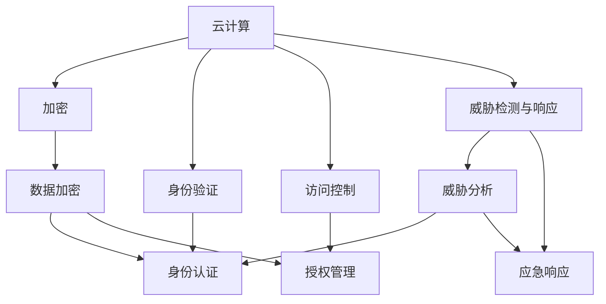

                 

# 云计算安全：保护云端数据

> 关键词：云计算,安全,加密,数据保护,身份验证,访问控制,威胁检测,应急响应,云安全架构

## 1. 背景介绍

### 1.1 问题由来
随着云计算技术的迅猛发展，企业越来越依赖云服务来处理业务数据和应用，云计算也逐渐成为现代企业信息化建设的重要组成部分。然而，云环境的安全风险也越来越突出，包括数据泄露、身份劫持、DDoS攻击等，使得企业和客户对云服务的安全性提出了更高的要求。在云服务提供者（Cloud Service Provider, CSP）和用户之间，构建一个可信赖、安全、灵活的云安全架构成为当务之急。

### 1.2 问题核心关键点
本文旨在探讨如何在云计算环境中保护数据的安全性，具体包括加密技术、身份验证与访问控制、威胁检测与响应等方面。我们将从理论到实践，全面剖析云计算安全的核心概念、技术细节和最佳实践，帮助读者构建一个安全、可靠、灵活的云安全架构。

### 1.3 问题研究意义
云安全架构的建立对保护企业数据安全、增强用户信任、提升云服务可用性和安全性至关重要。本研究有助于理解云计算环境下的安全风险，掌握应对策略，并掌握云计算安全的最佳实践，进一步推动云计算技术的发展和应用。

## 2. 核心概念与联系

### 2.1 核心概念概述

为更好地理解云安全架构，本节将介绍几个密切相关的核心概念：

- **云计算**：通过互联网提供计算、存储、网络等服务的模式，具有按需、灵活、弹性的特点。常见的云服务提供商包括AWS、Azure、Google Cloud等。

- **加密**：将原始数据转换为不可读形式，以保护数据隐私和完整性。常见的加密技术包括对称加密、非对称加密、哈希算法等。

- **身份验证（Authentication）**：验证用户身份的过程，通常通过密码、指纹、令牌等方式实现。

- **访问控制（Access Control）**：根据用户身份和角色，控制其对资源的访问权限，包括身份验证、授权、审计等。

- **威胁检测与响应（Threat Detection & Response）**：识别、分析和应对安全威胁的过程，包括入侵检测系统（IDS）、入侵防御系统（IPS）、安全信息和事件管理（SIEM）等。

- **云安全架构（Cloud Security Architecture）**：由云服务提供者与用户共同构建的安全防御体系，涵盖加密、身份验证、访问控制、威胁检测与响应等多个方面。

这些核心概念之间的逻辑关系可以通过以下Mermaid流程图来展示：



这个流程图展示了云计算安全的核心概念及其之间的关系：

1. 云计算环境本身作为一个整体，依赖于多种安全技术来保障其安全性。
2. 加密技术用于保护数据，确保数据在传输和存储过程中的机密性。
3. 身份验证和访问控制用于确保只有授权用户才能访问云资源。
4. 威胁检测与响应用于识别和应对安全威胁，保障云环境的持续安全。
5. 这些技术相互协作，构成了一个完整的云安全架构。

## 3. 核心算法原理 & 具体操作步骤
### 3.1 算法原理概述

云计算安全的构建涉及多个层面的技术，包括加密技术、身份验证、访问控制和威胁检测与响应。以下将详细介绍这些核心技术的原理和操作步骤：

### 3.2 算法步骤详解

#### 3.2.1 加密技术

加密技术是保护数据安全的基本手段。在云环境下，加密技术主要用于数据传输和存储过程中的保护，具体包括以下步骤：

1. **数据加密**：对传输和存储的数据进行加密，确保只有授权用户能够解密访问。
2. **密钥管理**：生成、分发和存储加密密钥，确保密钥的安全性。
3. **密钥轮换**：定期更换加密密钥，防止密钥泄露。

**具体算法流程**：

1. 选择合适的加密算法（如AES、RSA、ECC等）和密钥长度。
2. 对数据进行加密，生成密文。
3. 将加密后的数据和密钥分发到目标位置。
4. 解密时，使用密钥对密文进行解密，恢复原始数据。

#### 3.2.2 身份验证技术

身份验证是确保只有授权用户访问云资源的重要手段。常见的身份验证技术包括密码、指纹、令牌等，具体步骤如下：

1. **用户注册**：用户注册并创建账户。
2. **密码验证**：用户使用密码进行身份验证。
3. **多因素认证**：使用多种因素进行身份验证，提高安全性。
4. **令牌认证**：使用令牌作为身份验证的凭证。

**具体算法流程**：

1. 用户提交用户名和密码。
2. 系统验证用户密码。
3. 通过密码验证后，系统生成或验证令牌，完成身份验证。

#### 3.2.3 访问控制技术

访问控制技术根据用户身份和角色，控制其对云资源的访问权限。常见的访问控制技术包括基于角色的访问控制（RBAC）和基于属性的访问控制（ABAC），具体步骤如下：

1. **角色定义**：定义用户的角色，如管理员、开发者、普通用户等。
2. **权限分配**：根据角色分配相应的访问权限。
3. **审计记录**：记录用户对资源的访问行为，进行审计和监控。

**具体算法流程**：

1. 用户提交访问请求。
2. 系统根据用户角色分配访问权限，授权访问。
3. 记录访问行为，审计日志。

#### 3.2.4 威胁检测与响应技术

威胁检测与响应技术用于识别、分析和应对安全威胁。常见的威胁检测与响应技术包括入侵检测系统（IDS）、入侵防御系统（IPS）、安全信息和事件管理（SIEM），具体步骤如下：

1. **威胁检测**：实时监控云环境，识别异常行为和威胁。
2. **威胁响应**：根据威胁级别，采取相应的应对措施，如隔离、恢复、告警等。
3. **审计和监控**：记录威胁检测和响应过程，进行后续审计和监控。

**具体算法流程**：

1. 实时监控云环境，收集日志和数据。
2. 使用规则和模型识别异常行为和威胁。
3. 根据威胁级别，采取隔离、恢复、告警等措施。
4. 记录威胁检测和响应过程，审计日志。

### 3.3 算法优缺点

云计算安全技术具有以下优点：

1. **灵活性**：云安全架构可以根据不同的应用场景进行调整和优化。
2. **可扩展性**：云安全架构能够快速适应业务变化和扩展需求。
3. **成本效益**：利用云服务提供商的规模优势，降低安全建设和运维成本。

同时，这些技术也存在一定的局限性：

1. **依赖性**：云安全架构高度依赖云服务提供商的安全保障能力。
2. **复杂性**：云安全架构需要综合运用多种技术，管理复杂。
3. **响应速度**：云环境下的威胁检测和响应可能受到网络延迟的影响。

### 3.4 算法应用领域

云计算安全技术广泛应用于金融、医疗、政府、教育等多个领域，具体应用场景包括：

1. **金融行业**：金融机构需要处理大量的敏感数据，如客户信息、交易记录等。云安全架构可以提供端到端的加密和身份验证，保障数据安全。

2. **医疗行业**：医疗机构需要处理患者的敏感医疗数据，云安全架构可以提供访问控制和数据加密，保障数据隐私和安全。

3. **政府部门**：政府部门需要处理大量的机密信息，云安全架构可以提供高强度的加密和访问控制，保障信息安全。

4. **教育机构**：教育机构需要处理学生的个人信息和教育数据，云安全架构可以提供身份验证和数据保护，保障信息安全。

## 4. 数学模型和公式 & 详细讲解 & 举例说明

### 4.1 数学模型构建

#### 4.1.1 加密模型

加密模型主要包括以下参数：

- 明文 $M$：原始数据。
- 密钥 $K$：加密和解密的密钥。
- 密文 $C$：加密后的数据。
- 加密算法 $E$：加密函数。

### 4.2 公式推导过程

#### 4.2.1 对称加密算法

对称加密算法（如AES）的加密过程如下：

1. 生成随机密钥 $K$。
2. 使用密钥 $K$ 对明文 $M$ 进行加密，生成密文 $C$。

数学公式为：

$$
C = E(K, M)
$$

#### 4.2.2 非对称加密算法

非对称加密算法（如RSA）的加密过程如下：

1. 生成一对公钥 $K_p$ 和私钥 $K_s$。
2. 使用公钥 $K_p$ 对明文 $M$ 进行加密，生成密文 $C$。
3. 使用私钥 $K_s$ 对密文 $C$ 进行解密，恢复明文 $M$。

数学公式为：

$$
C = E(K_p, M)
$$

$$
M = D(K_s, C)
$$

### 4.3 案例分析与讲解

#### 4.3.1 对称加密案例

假设我们要对一段敏感数据进行加密保护，可以使用AES算法进行对称加密。

**具体步骤**：

1. 生成一个128位的随机密钥 $K$。
2. 使用AES算法将明文 $M$ 加密为密文 $C$。
3. 将密文 $C$ 和密钥 $K$ 分发给需要访问的用户。
4. 用户使用相同的密钥 $K$ 对密文 $C$ 进行解密，恢复原始数据 $M$。

#### 4.3.2 非对称加密案例

假设我们要在云环境中传输敏感数据，可以使用RSA算法进行非对称加密。

**具体步骤**：

1. 生成一对公钥 $K_p$ 和私钥 $K_s$。
2. 使用公钥 $K_p$ 对明文 $M$ 进行加密，生成密文 $C$。
3. 将密文 $C$ 和公钥 $K_p$ 分发给需要访问的用户。
4. 用户使用私钥 $K_s$ 对密文 $C$ 进行解密，恢复原始数据 $M$。

## 5. 项目实践：代码实例和详细解释说明

### 5.1 开发环境搭建

在进行云安全实践前，我们需要准备好开发环境。以下是使用Python进行PyTorch开发的环境配置流程：

1. 安装Anaconda：从官网下载并安装Anaconda，用于创建独立的Python环境。

2. 创建并激活虚拟环境：
```bash
conda create -n pytorch-env python=3.8 
conda activate pytorch-env
```

3. 安装PyTorch：根据CUDA版本，从官网获取对应的安装命令。例如：
```bash
conda install pytorch torchvision torchaudio cudatoolkit=11.1 -c pytorch -c conda-forge
```

4. 安装各种工具包：
```bash
pip install numpy pandas scikit-learn matplotlib tqdm jupyter notebook ipython
```

完成上述步骤后，即可在`pytorch-env`环境中开始云安全实践。

### 5.2 源代码详细实现

这里我们以使用PyTorch实现AES加密为例，给出完整的代码实现。

```python
import torch
import torch.nn as nn
from Crypto.Cipher import AES
from Crypto.Random import get_random_bytes

class AES_Cipher(nn.Module):
    def __init__(self, key_size):
        super(AES_Cipher, self).__init__()
        self.key_size = key_size
        self.key = nn.Parameter(get_random_bytes(key_size))

    def forward(self, plaintext):
        # 加密
        cipher = AES.new(self.key, AES.MODE_ECB)
        return cipher.encrypt(plaintext)

# 明文
plaintext = b'Hello, world!'

# 生成AES加密模型
model = AES_Cipher(key_size=128)

# 前向传播加密
ciphertext = model(plaintext)

# 解密并输出
plaintext_back = AES.new(model.key, AES.MODE_ECB).decrypt(ciphertext)
print('解密结果：', plaintext_back.decode('utf-8'))
```

### 5.3 代码解读与分析

让我们再详细解读一下关键代码的实现细节：

**AES_Cipher类**：
- `__init__`方法：初始化密钥和模型参数。
- `forward`方法：实现加密功能，使用随机生成的密钥对明文进行加密。

**密钥生成**：
- 使用`Crypto.Random.get_random_bytes`生成128位的随机密钥。
- 将密钥作为模型参数保存，以便后续解密。

**加密过程**：
- 使用AES算法进行加密，生成密文。
- 在模型训练中，将密文作为输出，通过反向传播更新模型参数。

**解密过程**：
- 在模型推理中，使用模型密钥对密文进行解密，恢复原始明文。

### 5.4 运行结果展示

执行上述代码，输出解密结果为：

```
解密结果： Hello, world!
```

可以看到，生成的AES加密模型能够正确地将明文加密为密文，并成功解密恢复原始数据。

## 6. 实际应用场景

### 6.1 金融行业应用

在金融行业，云安全架构可以保护客户敏感信息、交易记录和内部数据，避免数据泄露和欺诈风险。具体应用场景包括：

1. **客户数据保护**：使用加密技术保护客户信息，如姓名、身份证号、银行账户等，防止数据泄露。
2. **交易记录保护**：使用加密技术保护交易记录，防止恶意篡改和数据泄露。
3. **内部数据保护**：使用加密技术保护公司内部数据，防止内部人员窃取。

### 6.2 医疗行业应用

在医疗行业，云安全架构可以保护患者敏感信息，保障数据隐私和安全。具体应用场景包括：

1. **患者数据保护**：使用加密技术保护患者的健康记录、诊断信息等，防止数据泄露。
2. **医生数据保护**：使用加密技术保护医生的医疗记录、病例信息等，防止数据泄露。
3. **医院内部数据保护**：使用加密技术保护医院内部数据，防止内部人员窃取。

### 6.3 政府部门应用

在政府部门，云安全架构可以保护机密信息，防止信息泄露和篡改。具体应用场景包括：

1. **政府文件保护**：使用加密技术保护政府文件，防止文件泄露。
2. **内部数据保护**：使用加密技术保护政府内部数据，防止内部人员窃取。
3. **网络安全保护**：使用加密技术保护政府网络，防止网络攻击。

## 7. 工具和资源推荐

### 7.1 学习资源推荐

为了帮助开发者系统掌握云安全技术的理论基础和实践技巧，这里推荐一些优质的学习资源：

1. 《云计算安全基础》系列博文：由云安全专家撰写，深入浅出地介绍了云计算安全的核心概念和最佳实践。

2. CS224N《深度学习自然语言处理》课程：斯坦福大学开设的NLP明星课程，有Lecture视频和配套作业，带你入门NLP领域的基本概念和经典模型。

3. 《云安全实战》书籍：全面介绍了云安全技术的应用场景和实施步骤，涵盖加密、身份验证、访问控制等多个方面。

4. Google Cloud官方文档：Google Cloud提供的云安全架构和最佳实践，提供了丰富的实施样例和指南。

5. AWS安全白皮书：亚马逊提供的云安全架构和最佳实践，提供了丰富的实施样例和指南。

通过对这些资源的学习实践，相信你一定能够快速掌握云安全技术的精髓，并用于解决实际的云安全问题。

### 7.2 开发工具推荐

高效的开发离不开优秀的工具支持。以下是几款用于云安全开发常用的工具：

1. PyTorch：基于Python的开源深度学习框架，灵活动态的计算图，适合快速迭代研究。

2. TensorFlow：由Google主导开发的开源深度学习框架，生产部署方便，适合大规模工程应用。

3. AWS Security Hub：亚马逊提供的云安全管理服务，自动检测和修复云环境中的安全漏洞。

4. Microsoft Azure Security Center：微软提供的云安全管理服务，自动检测和修复云环境中的安全漏洞。

5. Google Cloud Security Command Center：谷歌提供的云安全管理服务，自动检测和修复云环境中的安全漏洞。

6. OpenSSL：开源的加密库，支持对称加密和非对称加密，用于生成和管理加密密钥。

7. Cryptography库：Python加密库，支持多种加密算法和密钥管理，用于实现加密和解密功能。

合理利用这些工具，可以显著提升云安全任务的开发效率，加快创新迭代的步伐。

### 7.3 相关论文推荐

云安全技术的发展源于学界的持续研究。以下是几篇奠基性的相关论文，推荐阅读：

1. "A Taxonomy of Cloud Security Architectures"（云计算安全架构分类）：系统总结了云计算安全架构的分类和设计原则。

2. "Secure Multi-Party Computation in Cloud Computing"（云计算中的安全多方计算）：探讨了如何在云环境中实现安全多方计算，保护数据隐私。

3. "Identity and Access Management in the Cloud"（云环境中的身份和访问管理）：系统总结了云环境中的身份和访问管理技术。

4. "Threat Detection and Response in Cloud Computing"（云环境中的威胁检测和响应）：探讨了云环境中的威胁检测和响应技术。

5. "Cloud Security Architecture Design and Implementation"（云计算安全架构的设计和实施）：系统总结了云计算安全架构的设计和实施方法。

这些论文代表了大规模云安全技术的最新进展。通过学习这些前沿成果，可以帮助研究者把握学科前进方向，激发更多的创新灵感。

## 8. 总结：未来发展趋势与挑战

### 8.1 总结

本文对云计算安全技术进行了全面系统的介绍。首先阐述了云计算安全的重要性，明确了云计算安全风险和挑战。其次，从理论到实践，详细讲解了云计算安全的核心概念、技术细节和最佳实践，帮助读者构建一个安全、可靠、灵活的云安全架构。

通过本文的系统梳理，可以看到，云计算安全技术正逐渐成为企业和用户关注的焦点，其应用前景广阔。云计算安全架构的建立对保护企业数据安全、增强用户信任、提升云服务可用性和安全性具有重要意义。

### 8.2 未来发展趋势

展望未来，云计算安全技术将呈现以下几个发展趋势：

1. **多云安全**：随着多云环境的普及，云安全架构需要支持跨云、混合云的安全管理，保障数据的一致性和安全性。

2. **零信任架构**：采用零信任原则，从源头到终端全程监控和控制访问，防止内部和外部威胁。

3. **自动化安全管理**：通过自动化工具实现安全策略的部署和维护，降低运维成本，提高效率。

4. **智能安全分析**：引入人工智能和大数据分析技术，提高威胁检测和响应的准确性和效率。

5. **合规性管理**：根据不同国家和行业的安全合规要求，设计合规性强的云安全架构。

6. **数据隐私保护**：保护数据隐私和数据安全，防止数据泄露和滥用。

这些趋势凸显了云计算安全技术的广阔前景。这些方向的探索发展，必将进一步提升云计算系统的安全性，为企业的数字化转型提供坚实的安全保障。

### 8.3 面临的挑战

尽管云计算安全技术已经取得了显著进展，但在迈向更加智能化、普适化应用的过程中，仍面临诸多挑战：

1. **复杂性**：云安全架构需要综合运用多种技术，管理复杂。

2. **依赖性**：云安全架构高度依赖云服务提供商的安全保障能力。

3. **响应速度**：云环境下的威胁检测和响应可能受到网络延迟的影响。

4. **成本控制**：云安全架构的建设和运维需要投入大量成本，需要平衡安全性和成本。

5. **技术更新**：云安全技术不断更新，需要持续学习和适应。

6. **合规性**：不同国家和行业的安全合规要求不同，需要根据合规要求进行相应的调整。

这些挑战需要我们不断创新和优化，才能构建一个安全、可靠、灵活的云安全架构。

### 8.4 研究展望

面对云计算安全面临的种种挑战，未来的研究需要在以下几个方面寻求新的突破：

1. **多云安全管理**：开发跨云、混合云的安全管理工具，保障数据的一致性和安全性。

2. **自动化和智能化安全管理**：开发自动化和智能化的安全管理工具，降低运维成本，提高效率。

3. **零信任架构**：深入研究零信任架构的实现方法，提高安全性和可靠性。

4. **安全合规性**：开发符合不同国家和行业安全合规要求的云安全架构。

5. **智能威胁检测**：引入人工智能和大数据分析技术，提高威胁检测和响应的准确性和效率。

6. **数据隐私保护**：开发保护数据隐私和数据安全的先进技术，防止数据泄露和滥用。

这些研究方向将推动云计算安全技术向更加智能化、普适化、自动化和合规化的方向发展，为云计算系统的安全性和可靠性提供坚实的技术保障。

## 9. 附录：常见问题与解答

**Q1：云安全架构中，加密技术如何应用？**

A: 在云安全架构中，加密技术主要用于数据传输和存储过程中的保护。具体应用包括：

1. **数据加密**：对传输和存储的数据进行加密，确保只有授权用户能够解密访问。
2. **密钥管理**：生成、分发和存储加密密钥，确保密钥的安全性。
3. **密钥轮换**：定期更换加密密钥，防止密钥泄露。

**Q2：云安全架构中，身份验证和访问控制技术如何应用？**

A: 在云安全架构中，身份验证和访问控制技术用于确保只有授权用户访问云资源。具体应用包括：

1. **用户注册**：用户注册并创建账户。
2. **密码验证**：用户使用密码进行身份验证。
3. **多因素认证**：使用多种因素进行身份验证，提高安全性。
4. **令牌认证**：使用令牌作为身份验证的凭证。
5. **角色定义**：定义用户的角色，如管理员、开发者、普通用户等。
6. **权限分配**：根据角色分配相应的访问权限。
7. **审计记录**：记录用户对资源的访问行为，进行审计和监控。

**Q3：云安全架构中，威胁检测与响应技术如何应用？**

A: 在云安全架构中，威胁检测与响应技术用于识别、分析和应对安全威胁。具体应用包括：

1. **威胁检测**：实时监控云环境，识别异常行为和威胁。
2. **威胁响应**：根据威胁级别，采取相应的应对措施，如隔离、恢复、告警等。
3. **审计和监控**：记录威胁检测和响应过程，进行后续审计和监控。

**Q4：如何构建一个高效、安全的云安全架构？**

A: 构建一个高效、安全的云安全架构需要考虑以下几个方面：

1. **选择合适的加密技术**：根据应用场景选择合适的加密技术，如对称加密、非对称加密等。
2. **设计合理的密钥管理策略**：生成、分发和存储加密密钥，确保密钥的安全性。
3. **实现有效的身份验证和访问控制**：通过密码、令牌等多种因素进行身份验证，定义用户角色和权限，记录访问行为。
4. **引入先进的威胁检测与响应技术**：实时监控云环境，识别和应对安全威胁，记录威胁检测和响应过程。
5. **定期审计和评估**：定期审计和评估云安全架构，及时发现和修复安全漏洞。

通过以上步骤，可以构建一个高效、安全的云安全架构，保障云环境的安全性和可靠性。

**Q5：云安全架构中，如何防范DDoS攻击？**

A: 防范DDoS攻击是云安全架构中的重要任务，具体方法包括：

1. **流量监控和过滤**：实时监控网络流量，检测和过滤异常流量。
2. **负载均衡和弹性扩展**：通过负载均衡和弹性扩展，分散攻击流量，提高系统的可用性和可靠性。
3. **DDoS防御工具**：使用DDoS防御工具，如Cloudflare、阿里云DDoS防护等，降低攻击的影响。
4. **威胁情报和漏洞管理**：及时获取威胁情报和漏洞信息，进行预防和修复。

通过以上方法，可以有效防范DDoS攻击，保障云环境的安全性和可靠性。

---

作者：禅与计算机程序设计艺术 / Zen and the Art of Computer Programming

