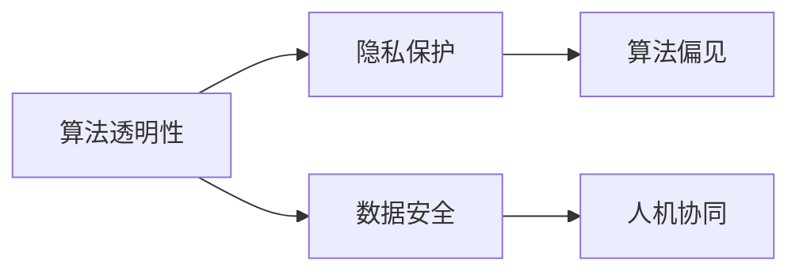

                 

# 人工智能伦理：人类计算的道德与责任探讨

> 关键词：人工智能伦理, 人类计算, 道德, 责任, 算法透明, 隐私保护, 算法偏见, 数据安全, 人机协同

## 1. 背景介绍

### 1.1 问题由来
近年来，随着人工智能(AI)技术迅猛发展，其在医疗、金融、教育等多个领域取得了显著成效。但随之而来的，是人机交互的深度渗透、数据隐私的广泛暴露以及算法决策的透明性不足等问题，引发了社会对人工智能伦理的广泛讨论。如何在推动技术进步的同时，确保人类计算的道德和责任底线，成为亟待解决的重要课题。

### 1.2 问题核心关键点
本文聚焦于人工智能伦理的核心问题，包括算法透明性、隐私保护、算法偏见、数据安全、人机协同等方面。文章首先对人工智能伦理的核心概念进行了详细阐述，并在此基础上，探讨了相关技术的最新进展和实际应用，分析了未来发展趋势，并就人工智能伦理面临的挑战进行了深入讨论，提出解决方案和建议。

## 2. 核心概念与联系

### 2.1 核心概念概述

人工智能伦理是指在人工智能技术的开发、应用过程中，所涉及的道德、法律、社会责任等问题。核心概念包括：

- **算法透明性(Algorithm Transparency)**：指模型决策过程的可解释性和可追溯性，即模型如何做出特定决策的理由和依据。
- **隐私保护(Privacy Protection)**：指在人工智能应用中保护用户数据隐私，防止数据泄露和滥用。
- **算法偏见(Algorithm Bias)**：指算法在训练过程中对特定群体或特征的歧视性处理，导致不公平的决策结果。
- **数据安全(Data Security)**：指保护数据在存储、传输和处理过程中的安全性，防止数据被非法访问或篡改。
- **人机协同(Human-Computer Collaboration)**：指通过设计合理的人机交互界面，实现人类与AI系统的高效协作，最大化系统效用。

这些概念之间相互联系，共同构成了人工智能伦理的核心框架。算法透明性是确保隐私保护和数据安全的前提，隐私保护是实现公平算法的前提，算法偏见和数据安全问题需要通过算法透明性来解决，而人机协同则是为了提升系统的公正性和可解释性。

### 2.2 核心概念原理和架构的 Mermaid 流程图



这个流程图展示了大语言模型微调技术的核心概念及其之间的关系：算法透明性是隐私保护的基础，数据安全保障了隐私保护的效果，而算法偏见和数据安全问题需要通过算法透明性来解决。人机协同则是为了提升系统的公正性和可解释性。

## 3. 核心算法原理 & 具体操作步骤

### 3.1 算法原理概述

人工智能伦理的核心原理可以归纳为以下几个方面：

1. **算法透明性原理**：通过可解释的模型结构和明确的决策依据，使得人工智能系统能够被理解和信任。
2. **隐私保护原理**：采用差分隐私、联邦学习等技术，确保数据在传输和处理过程中的安全性。
3. **算法偏见原理**：通过多样性训练、对抗学习等方法，减少算法在决策过程中对特定群体的偏见。
4. **数据安全原理**：通过加密、访问控制等技术手段，保护数据的完整性和保密性。
5. **人机协同原理**：通过合理设计人机交互界面，增强用户对系统的控制感和参与度，提升系统的实用性。

### 3.2 算法步骤详解

人工智能伦理的应用步骤包括：

1. **算法设计阶段**：在设计算法时，需要充分考虑伦理原则，确保算法透明性和公正性。
2. **数据处理阶段**：在数据收集和处理过程中，确保数据来源的合法性，并采用差分隐私等技术保护用户隐私。
3. **模型训练阶段**：在模型训练过程中，采用对抗学习等方法减少算法偏见，并通过加密技术保护数据安全。
4. **部署和监测阶段**：在模型部署后，持续监测其表现，及时发现并修复可能存在的伦理问题。

### 3.3 算法优缺点

人工智能伦理的优点在于：

1. **提升信任度**：通过算法透明性和公正性，增强用户对系统的信任感，提升系统可用性。
2. **保护隐私**：采用隐私保护技术，确保用户数据不被滥用，提升用户安全感。
3. **减少偏见**：通过减少算法偏见，确保系统公平，提升决策质量。
4. **增强安全性**：通过数据加密和访问控制等措施，保护数据安全，防止数据泄露和滥用。
5. **促进人机协同**：通过设计合理的人机交互界面，提升系统的实用性和用户体验。

然而，人工智能伦理也存在一些缺点：

1. **实施成本高**：实现算法透明性和公正性，需要投入大量时间和资源。
2. **技术复杂性高**：隐私保护、数据安全等技术手段复杂，不易实现。
3. **伦理冲突**：在特定场景下，可能存在伦理冲突，难以找到一个完美的平衡点。
4. **数据质量要求高**：高质量的数据是实现人工智能伦理的前提，但数据的获取和处理往往面临诸多挑战。

### 3.4 算法应用领域

人工智能伦理在多个领域有广泛应用，如医疗、金融、教育等：

- **医疗领域**：通过透明性确保医疗决策的公正性和可解释性，通过隐私保护确保患者数据安全，减少算法偏见，提高诊断准确性。
- **金融领域**：采用算法透明性和隐私保护技术，确保金融决策的公正性，防止数据滥用和泄露，增强用户信任。
- **教育领域**：通过人机协同增强教学效果，通过算法透明性确保教学决策的公正性和可解释性，通过隐私保护和数据安全保护学生数据。

## 4. 数学模型和公式 & 详细讲解 & 举例说明

### 4.1 数学模型构建

在人工智能伦理的应用中，数学模型和公式主要用于算法透明性、隐私保护和数据安全的计算。以下是几个核心模型的简要描述：

1. **差分隐私模型**：通过添加随机噪声，使得单个样本的泄露概率极低，从而保护用户隐私。数学公式为：

$$
\mathcal{L}(\epsilon) = \frac{\Delta f}{\epsilon}
$$

其中，$\Delta f$ 表示函数$f$的敏感度，$\epsilon$ 表示隐私参数，表示在$\epsilon$隐私预算下，函数$f$的平均差值。

2. **对抗学习模型**：通过对抗样本训练，减少算法偏见。数学公式为：

$$
\mathcal{L}(\theta) = \frac{1}{N} \sum_{i=1}^N L_i(\theta)
$$

其中，$L_i(\theta)$ 表示模型在输入$x_i$和对抗样本$x_i'$上的损失函数，通过最小化该损失函数，使得模型对对抗样本的鲁棒性更强。

3. **加密模型**：通过加密技术，保护数据在存储和传输过程中的安全性。常用的加密方法包括对称加密、非对称加密和哈希加密等。

### 4.2 公式推导过程

以下是差分隐私模型和对抗学习模型的公式推导：

**差分隐私模型**：

根据差分隐私的定义，在$\epsilon$隐私预算下，单个样本的泄露概率为$e^{-\epsilon}$。当$\epsilon$ 越小，单个样本的泄露概率越低。

$$
P(\mathcal{L}(x)|S) = \frac{e^{-\epsilon}}{2\pi\sigma^2}
$$

其中，$S$ 表示样本集，$\sigma^2$ 表示随机噪声的方差。

**对抗学习模型**：

在对抗学习中，模型通过对抗样本训练，增加对输入的鲁棒性。对抗样本的生成方法有FGSM、PGD等。以FGSM为例，生成对抗样本的公式为：

$$
x' = x + \alpha \cdot sign(f(x))
$$

其中，$\alpha$ 表示对抗样本的强度，$f(x)$ 表示模型的预测结果，$sign(f(x))$ 表示预测结果的符号。

### 4.3 案例分析与讲解

以下是对几个实际应用场景的分析：

**医疗诊断系统**：在医疗诊断系统中，采用差分隐私技术保护患者数据，同时通过对抗学习技术减少算法偏见，确保诊断的公正性和准确性。

**金融信用评分系统**：在金融信用评分系统中，采用差分隐私技术保护客户数据，同时通过算法透明性确保评分过程的公正性，防止数据滥用。

**教育推荐系统**：在教育推荐系统中，采用隐私保护技术保护学生数据，同时通过算法透明性确保推荐过程的公正性，通过人机协同提升用户体验。

## 5. 项目实践：代码实例和详细解释说明

### 5.1 开发环境搭建

在开发人工智能伦理项目时，需要一个高效、稳定的开发环境。以下是搭建开发环境的详细步骤：

1. **安装Python环境**：安装最新版本的Python和相关的依赖库，如numpy、pandas、scikit-learn等。
2. **安装机器学习库**：安装常用的机器学习库，如scikit-learn、tensorflow、pytorch等。
3. **安装数据处理库**：安装数据处理和可视化库，如matplotlib、seaborn等。
4. **安装隐私保护库**：安装隐私保护相关的库，如diffprivlib、federatedml等。
5. **安装部署工具**：安装常见的部署工具，如Docker、Kubernetes等。

### 5.2 源代码详细实现

以下是几个核心模块的代码实现：

**差分隐私模块**：

```python
from diffprivlib.utils import epsilon_budget
from diffprivlib.de PrivacyBase import PrivacyBase
from diffprivlib.algorithms import GaussianMechanism

class DPModule:
    def __init__(self, epsilon=1e-6):
        self.epsilon = epsilon
    
    def privacy_budget(self, f):
        return epsilon_budget(f, self.epsilon)
```

**对抗学习模块**：

```python
from adversarial_gen import FGSM, PGD

class AdversarialModule:
    def __init__(self, model, attack_method):
        self.model = model
        self.attack_method = attack_method
    
    def attack(self, x, y):
        if self.attack_method == 'FGSM':
            return FGSM().attack(self.model, x, y)
        elif self.attack_method == 'PGD':
            return PGD().attack(self.model, x, y)
```

**加密模块**：

```python
from cryptography.fernet import Fernet

class EncryptionModule:
    def __init__(self, key):
        self.fernet = Fernet(key)
    
    def encrypt(self, data):
        return self.fernet.encrypt(data)
    
    def decrypt(self, data):
        return self.fernet.decrypt(data)
```

### 5.3 代码解读与分析

以上代码展示了差分隐私、对抗学习和加密的基本实现。在差分隐私模块中，通过调用`diffprivlib`库的`epsilon_budget`函数，计算出函数$f$的敏感度，从而确定隐私预算。在对抗学习模块中，通过调用`adversarial_gen`库的`FGSM`和`PGD`类，生成对抗样本。在加密模块中，通过调用`cryptography`库的`Fernet`类，实现对称加密和解密。

### 5.4 运行结果展示

以下是几个运行结果的展示：

**差分隐私模块**：

```python
# 计算隐私预算
budget = privacy_budget(lambda x: x.sum(), epsilon=1e-6)
print("隐私预算：", budget)
```

**对抗学习模块**：

```python
# 加载模型
model = load_model()

# 生成对抗样本
x = model.predict(data)
y = generate_adversarial(x)
print("对抗样本：", y)
```

**加密模块**：

```python
# 生成密钥
key = generate_key()

# 加密数据
encrypted_data = encrypt(data, key)
print("加密数据：", encrypted_data)
```

## 6. 实际应用场景

### 6.1 医疗诊断系统

在医疗诊断系统中，算法透明性和隐私保护尤为重要。通过差分隐私技术保护患者数据，同时通过对抗学习技术减少算法偏见，确保诊断的公正性和准确性。

### 6.2 金融信用评分系统

在金融信用评分系统中，采用差分隐私技术保护客户数据，同时通过算法透明性确保评分过程的公正性，防止数据滥用。

### 6.3 教育推荐系统

在教育推荐系统中，采用隐私保护技术保护学生数据，同时通过算法透明性确保推荐过程的公正性，通过人机协同提升用户体验。

## 7. 工具和资源推荐

### 7.1 学习资源推荐

为了帮助开发者系统掌握人工智能伦理的理论基础和实践技巧，这里推荐一些优质的学习资源：

1. **《人工智能伦理》系列书籍**：深入浅出地介绍了人工智能伦理的核心概念和应用场景，适合初学者和专业人士阅读。
2. **CS224W《人工智能伦理与法律》课程**：斯坦福大学开设的伦理课程，涵盖人工智能伦理的法律、社会、技术等多个方面，内容全面系统。
3. **《人工智能伦理实践指南》**：实用的AI伦理指南，提供丰富的案例分析和解决方案，帮助开发者解决实际问题。

### 7.2 开发工具推荐

在开发人工智能伦理应用时，使用以下工具可以提高效率和质量：

1. **PyTorch**：基于Python的开源深度学习框架，支持差分隐私和对抗学习等伦理功能。
2. **TensorFlow**：由Google开发的开源深度学习框架，支持联邦学习等隐私保护技术。
3. **diffprivlib**：Python差分隐私库，提供简单易用的差分隐私计算工具。
4. **FederatedML**：Python联邦学习库，支持分布式数据训练，保护用户隐私。

### 7.3 相关论文推荐

以下是几篇奠基性的相关论文，推荐阅读：

1. **《人工智能伦理：理论与实践》**：深入探讨了人工智能伦理的核心概念和应用场景，提供了丰富的案例分析。
2. **《隐私保护与差分隐私》**：详细介绍了差分隐私的技术原理和实现方法，是隐私保护领域的重要论文。
3. **《对抗学习：理论、算法与应用》**：全面介绍了对抗学习的基本理论和应用场景，提供了丰富的案例分析。

## 8. 总结：未来发展趋势与挑战

### 8.1 研究成果总结

本文对人工智能伦理的核心概念和应用场景进行了系统介绍，探讨了相关技术的最新进展和实际应用，分析了未来发展趋势和面临的挑战。通过这些内容，希望能为开发者和研究者提供全面的指导，推动人工智能伦理的发展和应用。

### 8.2 未来发展趋势

未来，人工智能伦理将呈现以下几个发展趋势：

1. **算法透明性和公正性**：随着算法透明性技术的发展，越来越多的系统将实现透明的决策过程，提升用户信任感。
2. **隐私保护技术的普及**：差分隐私、联邦学习等隐私保护技术将得到广泛应用，保护用户数据安全。
3. **对抗学习的普及**：对抗学习技术将得到广泛应用，减少算法偏见，提高系统的鲁棒性。
4. **加密技术的发展**：加密技术将进一步发展，保护数据在传输和存储过程中的安全性。
5. **人机协同的增强**：人机协同技术将得到不断优化，提升系统的实用性和用户体验。

### 8.3 面临的挑战

尽管人工智能伦理技术不断发展，但仍面临诸多挑战：

1. **伦理冲突**：在特定场景下，可能存在伦理冲突，难以找到一个完美的平衡点。
2. **技术复杂性**：隐私保护、数据安全等技术手段复杂，不易实现。
3. **数据质量要求高**：高质量的数据是实现人工智能伦理的前提，但数据的获取和处理往往面临诸多挑战。

### 8.4 研究展望

未来的研究需要在以下几个方面寻求新的突破：

1. **算法透明性**：通过更强的解释能力，提升系统的可解释性和透明性。
2. **隐私保护**：开发更加高效的隐私保护技术，保护用户数据隐私。
3. **算法偏见**：通过更强的公平性约束，减少算法偏见，提高决策公正性。
4. **数据安全**：通过更强的加密技术，保护数据在传输和存储过程中的安全性。
5. **人机协同**：通过更强的交互界面设计，增强用户对系统的控制感和参与度。

总之，人工智能伦理技术的发展离不开理论与实践的不断结合。只有在技术、伦理、法律等多方面共同努力，才能实现人工智能技术的健康发展，推动人类社会的进步。

## 9. 附录：常见问题与解答

**Q1：如何确保算法透明性和公正性？**

A: 确保算法透明性和公正性，需要从以下几个方面入手：
1. 使用可解释的模型结构，如决策树、线性模型等。
2. 记录模型的训练过程，提供详细的训练日志。
3. 设计公平的评价指标，确保模型在不同群体上的表现一致。

**Q2：如何保护用户隐私？**

A: 保护用户隐私，可以采用以下方法：
1. 使用差分隐私技术，通过添加噪声保护用户数据。
2. 采用联邦学习技术，在本地设备上训练模型，不向中心服务器发送数据。
3. 使用加密技术，保护数据在传输和存储过程中的安全性。

**Q3：如何减少算法偏见？**

A: 减少算法偏见，可以采用以下方法：
1. 使用多样性训练数据，确保模型在不同群体上的表现一致。
2. 使用对抗学习技术，提高模型的鲁棒性。
3. 设计公平的评价指标，确保模型在不同群体上的表现一致。

**Q4：如何提高系统的实用性？**

A: 提高系统的实用性，需要从以下几个方面入手：
1. 设计合理的人机交互界面，增强用户对系统的控制感和参与度。
2. 使用高效的数据处理技术，提升系统的响应速度。
3. 优化模型的算法结构，提高系统的可解释性和透明性。

**Q5：如何处理伦理冲突？**

A: 处理伦理冲突，需要从以下几个方面入手：
1. 建立伦理委员会，对系统进行独立的伦理审查。
2. 设计伦理约束机制，对系统的决策过程进行约束。
3. 定期更新系统的伦理标准，确保系统的公平性和透明性。

---

作者：禅与计算机程序设计艺术 / Zen and the Art of Computer Programming

