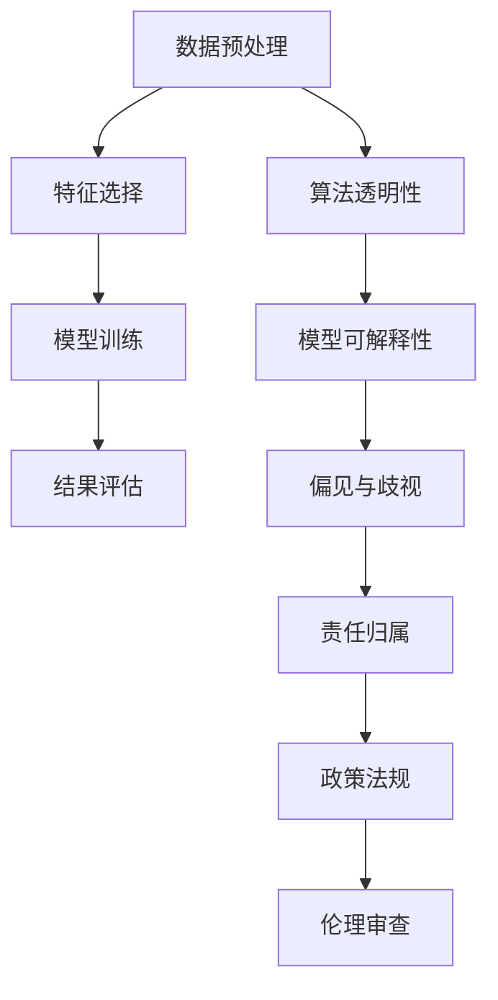

                 

## 1. 背景介绍

随着人工智能（AI）技术的飞速发展，其在医疗、金融、教育、娱乐等多个领域的应用日益广泛。AI技术的普及为人类社会带来了前所未有的便利和效率，但同时也引发了一系列伦理道德问题。例如，AI在医疗诊断中的偏见、AI辅助决策的责任归属、AI隐私保护等问题，引发了广泛的社会关注和学术讨论。

本文旨在探讨人工智能伦理的核心问题，即知识发现的边界与责任。知识发现是指通过机器学习算法，从大量数据中挖掘出有价值的信息和规律的过程。这一过程的边界和责任问题，不仅关系到技术应用的合规性，也关乎社会的公平正义与长远发展。

## 2. 核心概念与联系

### 2.1 核心概念概述

在探讨人工智能伦理时，以下概念是至关重要的：

- **知识发现（Knowledge Discovery）**：通过机器学习算法从数据中提取有用信息的过程，包括数据预处理、特征选择、模型训练和结果评估等步骤。
- **算法透明性（Algorithmic Transparency）**：要求机器学习算法的决策过程公开、可理解，以便于监督和问责。
- **模型可解释性（Model Interpretability）**：指机器学习模型能够提供明确的决策理由，便于理解和质疑。
- **偏见与歧视（Bias and Discrimination）**：指机器学习模型在数据学习过程中所包含的历史偏见和社会偏见，可能导致不公平的决策。
- **责任归属（Responsibility Assignment）**：指在AI系统出现错误或失误时，谁应该承担责任的问题。

这些核心概念之间存在紧密的联系。算法透明性和模型可解释性有助于揭示知识发现过程中的偏见与歧视，从而明确责任归属。

### 2.2 核心概念原理和架构的 Mermaid 流程图



## 3. 核心算法原理 & 具体操作步骤

### 3.1 算法原理概述

知识发现的过程涉及数据预处理、特征选择、模型训练和结果评估等多个步骤。其核心算法包括监督学习、无监督学习、强化学习等。这些算法在处理数据时，往往会引入不同的偏见和歧视，从而影响最终的决策结果。

### 3.2 算法步骤详解

1. **数据预处理**：清洗、归一化、特征工程等，确保数据的准确性和一致性。
2. **特征选择**：选择最相关的特征，减少噪声和冗余，提高模型的泛化能力。
3. **模型训练**：使用合适的算法，如随机森林、神经网络、支持向量机等，训练模型以发现知识。
4. **结果评估**：使用准确率、召回率、F1-score等指标，评估模型的性能。
5. **算法透明性**：记录模型的训练过程和参数设置，便于追溯和解释。
6. **模型可解释性**：通过可视化工具、特征重要性分析等，提供决策的依据。
7. **偏见与歧视检测**：利用统计分析、敏感性分析等方法，检测和消除模型中的偏见。
8. **责任归属**：建立明确的责任分配机制，确保在出现失误时能够追责。

### 3.3 算法优缺点

**优点**：
- **自动化与效率**：机器学习算法能够快速处理大量数据，发现规律和知识。
- **跨领域应用**：算法在医疗、金融、教育等多个领域都有广泛应用，提高了工作效率。

**缺点**：
- **不透明性**：某些算法如深度神经网络，其决策过程难以解释。
- **数据依赖性**：模型的性能高度依赖于训练数据的质量，数据偏见可能导致歧视性决策。
- **责任归属模糊**：模型是由算法和数据共同决定的，责任归属复杂。

### 3.4 算法应用领域

知识发现技术在医疗诊断、金融风控、智能客服、智能推荐等多个领域得到了广泛应用。例如，在医疗诊断中，通过分析患者的症状、病史、基因数据等，帮助医生快速准确地诊断疾病。在金融风控中，通过分析用户的历史行为数据，预测其信用风险，有效防范金融欺诈。

## 4. 数学模型和公式 & 详细讲解 & 举例说明

### 4.1 数学模型构建

知识发现通常涉及分类、回归、聚类等多种数学模型。以下以逻辑回归为例，介绍其数学模型构建过程：

假设训练数据集为 $(\mathbf{x}_i, y_i)$，其中 $\mathbf{x}_i \in \mathbb{R}^n$ 为输入特征向量，$y_i \in \{0, 1\}$ 为分类标签。逻辑回归模型的目标是最小化交叉熵损失函数：

$$
\mathcal{L}(\mathbf{w}, b) = -\frac{1}{N}\sum_{i=1}^N y_i \log \sigma(\mathbf{w}^T \mathbf{x}_i + b) + (1-y_i) \log(1-\sigma(\mathbf{w}^T \mathbf{x}_i + b))
$$

其中 $\sigma(z) = \frac{1}{1+e^{-z}}$ 为逻辑回归模型的输出函数，$\mathbf{w} \in \mathbb{R}^n$ 为模型参数，$b$ 为偏置项。

### 4.2 公式推导过程

逻辑回归模型的参数更新公式为：

$$
\mathbf{w} \leftarrow \mathbf{w} - \eta \nabla_{\mathbf{w}} \mathcal{L}(\mathbf{w}, b)
$$

其中 $\nabla_{\mathbf{w}} \mathcal{L}(\mathbf{w}, b)$ 为损失函数对 $\mathbf{w}$ 的梯度，$\eta$ 为学习率。根据梯度下降算法，更新公式可以展开为：

$$
\mathbf{w} \leftarrow \mathbf{w} - \eta \frac{1}{N}\sum_{i=1}^N [y_i(\mathbf{x}_i\sigma^{-1}(\mathbf{w}^T \mathbf{x}_i + b)) - (1-y_i)\mathbf{x}_i\sigma^{-1}(1-\sigma(\mathbf{w}^T \mathbf{x}_i + b))]
$$

### 4.3 案例分析与讲解

以医疗诊断为例，假设要使用逻辑回归模型预测肿瘤是否为恶性。首先，收集包含肿瘤类型、体积、位置、年龄等特征的数据集。其次，对数据进行预处理和特征选择。然后，使用逻辑回归模型训练模型，并评估其性能。最后，通过算法透明性和模型可解释性分析模型的决策过程，确保其公平性和可解释性。

## 5. 项目实践：代码实例和详细解释说明

### 5.1 开发环境搭建

为了进行知识发现模型的开发，我们需要以下开发环境：

- Python 3.7+
- NumPy、Pandas、Scikit-learn 等科学计算库
- Jupyter Notebook 或 PyCharm 等开发环境

### 5.2 源代码详细实现

以下是一个简单的逻辑回归模型的代码实现：

```python
import numpy as np
from sklearn.linear_model import LogisticRegression
from sklearn.model_selection import train_test_split
from sklearn.metrics import accuracy_score

# 加载数据
X, y = load_data()

# 数据预处理
X_train, X_test, y_train, y_test = train_test_split(X, y, test_size=0.2, random_state=42)

# 初始化模型
model = LogisticRegression()

# 模型训练
model.fit(X_train, y_train)

# 模型评估
y_pred = model.predict(X_test)
accuracy = accuracy_score(y_test, y_pred)

print("Accuracy:", accuracy)
```

### 5.3 代码解读与分析

上述代码中，首先使用 `sklearn` 库加载数据，然后进行数据预处理和模型初始化。接着，使用 `fit` 方法对模型进行训练，并使用 `predict` 方法对测试集进行预测。最后，使用 `accuracy_score` 函数计算模型的准确率。

## 6. 实际应用场景

### 6.1 医疗诊断

在医疗诊断中，知识发现技术可以用于快速准确地诊断疾病。例如，通过分析患者的症状、病史、基因数据等，帮助医生快速确定病因和治疗方法。知识发现模型可以不断学习和更新，从而提高诊断的准确性和效率。

### 6.2 金融风控

在金融风控中，知识发现技术可以用于预测用户的信用风险，从而防范金融欺诈。通过分析用户的历史行为数据，发现潜在的风险因素，如贷款逾期次数、消费金额等，从而及时采取措施。

### 6.3 智能客服

在智能客服中，知识发现技术可以用于分析用户咨询记录，发现常见问题和解决方案，从而提高服务质量和用户体验。通过对用户反馈的分析和处理，智能客服系统可以不断学习和优化，提供更准确的建议和解决方案。

### 6.4 未来应用展望

随着知识发现技术的不断进步，其在医疗、金融、教育等多个领域的应用将更加广泛。未来的知识发现技术将更加智能和高效，能够处理更加复杂和多样化的数据，提供更准确的决策支持。

## 7. 工具和资源推荐

### 7.1 学习资源推荐

1. 《机器学习实战》：通过大量实例，介绍机器学习算法的应用和实现。
2. 《深度学习》（Goodfellow 等著）：介绍深度学习的基础理论和应用。
3. 《Python 机器学习基础教程》：使用 Python 实现机器学习算法，适合初学者。

### 7.2 开发工具推荐

1. Jupyter Notebook：开源的交互式计算环境，适合进行数据处理和模型训练。
2. PyCharm：流行的 Python 开发环境，支持多种科学计算库和机器学习框架。

### 7.3 相关论文推荐

1. "On the Shoulders of Giants: The History of Machine Learning"：讨论机器学习的历史和发展。
2. "Bias and Fairness in Machine Learning"：探讨机器学习中的偏见和公平性问题。
3. "Responsible AI: Definitions, Requirements, and Considerations"：介绍负责任 AI 的定义和要求。

## 8. 总结：未来发展趋势与挑战

### 8.1 研究成果总结

本文系统探讨了人工智能伦理的核心问题，即知识发现的边界与责任。通过分析算法透明性、模型可解释性、偏见与歧视、责任归属等关键概念，揭示了知识发现技术的潜力和风险。知识发现技术在多个领域得到了广泛应用，但也面临着诸多挑战。

### 8.2 未来发展趋势

未来知识发现技术将更加智能和高效，能够处理更加复杂和多样化的数据，提供更准确的决策支持。同时，算法透明性、模型可解释性和偏见与歧视检测等技术也将得到更广泛的应用，确保知识发现过程的公平性和可解释性。

### 8.3 面临的挑战

知识发现技术的发展也面临诸多挑战，如数据隐私保护、算法透明性和责任归属等。如何解决这些问题，确保知识发现的公平性和安全性，将是未来的重要研究方向。

### 8.4 研究展望

未来，知识发现技术的发展将更加注重公平性和透明度，确保技术应用符合伦理道德规范。同时，知识发现技术也将与其他技术如自然语言处理、计算机视觉等进行更深入的融合，拓展其应用范围和深度。

## 9. 附录：常见问题与解答

**Q1: 什么是知识发现（Knowledge Discovery）？**

A: 知识发现是指通过机器学习算法，从大量数据中挖掘出有价值的信息和规律的过程。通常包括数据预处理、特征选择、模型训练和结果评估等步骤。

**Q2: 如何避免机器学习模型中的偏见和歧视？**

A: 避免机器学习模型中的偏见和歧视，需要从数据采集、数据清洗、特征选择和模型训练等多个环节入手。例如，在数据采集时，应确保数据的多样性和代表性，避免样本偏差。在数据清洗和特征选择时，应消除数据中的噪声和偏见，选择最相关的特征。在模型训练时，应使用公平性评估指标，监测模型中的偏见。

**Q3: 如何确保机器学习模型的责任归属？**

A: 确保机器学习模型的责任归属，需要建立明确的责任分配机制。例如，在使用机器学习算法进行决策时，应明确算法的来源、数据来源和使用的环境。在出现决策失误时，应根据责任归属机制，追究相关责任。

---

作者：禅与计算机程序设计艺术 / Zen and the Art of Computer Programming

