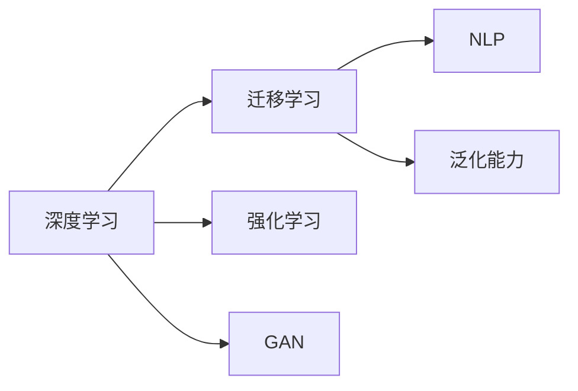

                 

## 1. 背景介绍

### 1.1 问题由来
人类正处于一个前所未有的技术变革时期。人工智能(AI)作为推动科技进步和社会发展的关键力量，正在深刻改变着我们的生活和工作方式。特别是自20世纪70年代以来，随着计算机技术的发展和数据科学的崛起，AI技术已经从理论研究阶段进入到实际应用领域，极大地拓展了其潜力和影响力。然而，未来的AI发展之路仍然充满挑战。本文将探讨人工智能在2050年的应用与发展的可能性，并分析其面临的主要趋势和挑战。

### 1.2 问题核心关键点
未来AI的发展不仅依赖于技术进步，还需应对一系列社会、经济、伦理和政策问题。以下关键点将对AI未来的发展产生深远影响：

1. **计算能力提升**：更强大的计算能力和更高效的数据处理能力是AI发展的基础。
2. **数据获取与处理**：高质量、多样化的数据将为AI训练提供更多素材，提升模型的泛化能力。
3. **算法创新**：新的算法模型和技术范式将进一步推动AI的进步。
4. **伦理与监管**：如何在提升AI性能的同时，保障用户隐私和数据安全，避免伦理风险。
5. **跨学科融合**：AI与医学、教育、金融等领域的深度融合将带来新的应用场景和挑战。
6. **国际合作与竞争**：全球范围内AI技术的合作与竞争将影响其发展的速度和方向。

## 2. 核心概念与联系

### 2.1 核心概念概述
1. **人工智能**：一种通过计算机系统模拟人类智能行为的技术，包括学习、推理、感知、语言处理等能力。
2. **深度学习**：一种基于人工神经网络的机器学习方法，能够在大量数据上进行自监督学习，提取数据的高级特征。
3. **强化学习**：一种通过奖励和惩罚机制，优化决策策略的学习方法，常用于游戏、机器人控制等领域。
4. **迁移学习**：一种将一个领域学到的知识迁移到另一个领域的学习范式，可以显著提高新任务的性能。
5. **自然语言处理(NLP)**：使计算机能够理解、处理和生成自然语言的技术，是AI领域的重要分支。
6. **生成对抗网络(GAN)**：一种通过对抗训练生成高质量数据样本的技术，常用于图像生成、数据增强等场景。
7. **泛化能力**：模型在未见过的数据上表现良好，能够推广到不同场景的能力。

这些概念构成了人工智能技术的核心框架，并在未来的发展中将继续发挥重要作用。

### 2.2 核心概念原理和架构的 Mermaid 流程图


## 3. 核心算法原理 & 具体操作步骤

### 3.1 算法原理概述
未来AI的应用与发展将依赖于一系列核心算法原理的突破。这些算法将不断改进，并与其他技术相结合，推动AI向更高级别的应用场景迈进。

1. **深度学习**：通过多层次的非线性变换，从大量数据中提取特征，并进行模式识别和预测。
2. **迁移学习**：通过已有模型的知识迁移，加快新任务模型的训练，提高模型泛化能力。
3. **强化学习**：通过奖励和惩罚机制，优化决策策略，提升智能体在复杂环境中的适应能力。
4. **自然语言处理(NLP)**：使计算机能够理解和生成自然语言，处理文本、语音等多种形式的数据。
5. **生成对抗网络(GAN)**：通过对抗训练，生成高质量的数据样本，用于数据增强和数据生成。

### 3.2 算法步骤详解
基于上述核心算法，未来AI在应用与发展中可能采取以下步骤：

1. **数据收集与预处理**：收集高质量的数据，并进行清洗、标注和预处理。
2. **模型选择与构建**：根据任务需求，选择合适的模型架构，并构建训练框架。
3. **模型训练与优化**：使用优化算法训练模型，并通过超参数调优、正则化等技术提高模型性能。
4. **模型部署与应用**：将训练好的模型部署到实际应用中，进行持续监控和优化。
5. **持续学习与改进**：在实际应用中收集新数据，持续训练模型，提升模型泛化能力。

### 3.3 算法优缺点
未来AI算法的发展将面临诸多挑战，以下是对主要优缺点的分析：

**优点**：
- **高效性**：算法效率高，能够快速处理大量数据，提高决策速度。
- **精度高**：通过复杂的数学模型，提高预测和决策的准确性。
- **灵活性**：可适用于多种任务和场景，具有高度的适应性。

**缺点**：
- **数据依赖**：算法的效果依赖于高质量的数据，数据稀缺时可能难以发挥作用。
- **可解释性不足**：复杂算法通常难以解释其内部机制，难以调试和维护。
- **资源消耗大**：大规模算法的训练和推理需要强大的计算资源和存储空间。

### 3.4 算法应用领域
未来AI将广泛应用于以下领域：

1. **自动驾驶**：通过计算机视觉和强化学习技术，实现自动驾驶车辆的高效、安全运行。
2. **智能制造**：通过机器人技术和数据分析，实现生产过程的自动化和智能化。
3. **医疗健康**：通过自然语言处理和图像识别技术，辅助医生进行疾病诊断和治疗。
4. **金融科技**：通过数据分析和强化学习，提供更精准的金融服务和风险管理。
5. **教育科技**：通过自然语言处理和个性化学习，提升教育的个性化和互动性。
6. **农业科技**：通过数据分析和机器学习，优化农业生产，提高资源利用效率。
7. **智慧城市**：通过数据收集和智能决策，提升城市的运行效率和居民生活质量。

## 4. 数学模型和公式 & 详细讲解 & 举例说明

### 4.1 数学模型构建
未来AI的算法模型将更加复杂和多样。以下以深度学习模型为例，介绍其数学模型构建过程。

**输入数据**：$\mathbf{x} \in \mathbb{R}^n$，其中 $n$ 为输入数据的维度。
**权重矩阵**：$\mathbf{W} \in \mathbb{R}^{m \times n}$，其中 $m$ 为隐藏层维度。
**偏置向量**：$\mathbf{b} \in \mathbb{R}^m$。
**隐藏层激活函数**：$f(\cdot)$，如ReLU函数。
**输出层激活函数**：$g(\cdot)$，如Softmax函数。

### 4.2 公式推导过程
深度学习模型通常采用链式法则进行反向传播，优化损失函数。假设输入数据为 $\mathbf{x}$，输出为目标值 $\mathbf{y}$，模型参数为 $\theta$，损失函数为 $L$，优化算法为 $A$。

1. **前向传播**：计算输出结果 $\hat{\mathbf{y}} = g(\mathbf{W}f(\mathbf{W}_1f(\mathbf{W}_2\ldots\mathbf{W}_nf(\mathbf{x})))$。
2. **计算损失**：$L = \frac{1}{N}\sum_{i=1}^N||\hat{\mathbf{y}}_i - \mathbf{y}_i||^2$，其中 $N$ 为样本数量。
3. **反向传播**：计算梯度 $\frac{\partial L}{\partial \theta}$，通过链式法则逐步求导。
4. **参数更新**：使用优化算法 $A$，更新模型参数 $\theta$。

### 4.3 案例分析与讲解
以图像分类任务为例，通过多层卷积神经网络(CNN)实现。

假设输入为28x28的灰度图像，隐藏层采用3x3的卷积核，隐藏层数为3，激活函数为ReLU，输出层为10个神经元，激活函数为Softmax。

1. **输入层**：将图像展开成向量 $\mathbf{x} \in \mathbb{R}^{784}$。
2. **卷积层**：使用3x3卷积核提取特征，通过ReLU函数激活。
3. **池化层**：通过最大池化操作，减少特征数量，保留重要信息。
4. **全连接层**：将池化后的特征连接成一个长向量，输入到全连接层。
5. **输出层**：通过Softmax函数输出10个类别的概率分布。

使用反向传播算法，优化损失函数，更新网络参数。最终，模型能够在测试集上获得较高的准确率。

## 5. 项目实践：代码实例和详细解释说明

### 5.1 开发环境搭建
为了进行AI项目开发，需要搭建一个完整的开发环境，包括：

1. **Python**：选择3.x版本，推荐使用Anaconda或Miniconda。
2. **深度学习框架**：选择TensorFlow或PyTorch，安装最新版本。
3. **数据分析库**：安装Pandas、NumPy、Scikit-learn等库。
4. **可视化工具**：安装Matplotlib、Seaborn等库，用于数据可视化。
5. **模型管理工具**：安装TensorFlow Serving或Kubeflow，用于模型部署和监控。

### 5.2 源代码详细实现
以下是一个简单的图像分类项目的代码实现，使用PyTorch框架：

```python
import torch
import torch.nn as nn
import torch.optim as optim
import torchvision.transforms as transforms
from torchvision import datasets

# 定义模型
class Net(nn.Module):
    def __init__(self):
        super(Net, self).__init__()
        self.conv1 = nn.Conv2d(1, 10, kernel_size=5)
        self.conv2 = nn.Conv2d(10, 20, kernel_size=5)
        self.conv2_drop = nn.Dropout2d()
        self.fc1 = nn.Linear(320, 50)
        self.fc2 = nn.Linear(50, 10)
    
    def forward(self, x):
        x = nn.functional.relu(self.conv1(x))
        x = nn.functional.max_pool2d(x, 2)
        x = nn.functional.relu(self.conv2_drop(self.conv2(x)))
        x = nn.functional.max_pool2d(x, 2)
        x = x.view(-1, 320)
        x = nn.functional.relu(self.fc1(x))
        x = nn.functional.dropout(x, training=self.training)
        x = self.fc2(x)
        return nn.functional.softmax(x, dim=1)

# 定义数据预处理
transform = transforms.Compose([
    transforms.ToTensor(),
    transforms.Normalize((0.5,), (0.5,))
])

# 加载数据集
trainset = datasets.MNIST(root='./data', train=True, download=True, transform=transform)
trainloader = torch.utils.data.DataLoader(trainset, batch_size=64, shuffle=True)
testset = datasets.MNIST(root='./data', train=False, download=True, transform=transform)
testloader = torch.utils.data.DataLoader(testset, batch_size=64, shuffle=False)

# 训练模型
model = Net()
criterion = nn.CrossEntropyLoss()
optimizer = optim.SGD(model.parameters(), lr=0.001, momentum=0.9)
for epoch in range(10):
    running_loss = 0.0
    for i, data in enumerate(trainloader, 0):
        inputs, labels = data
        optimizer.zero_grad()
        outputs = model(inputs)
        loss = criterion(outputs, labels)
        loss.backward()
        optimizer.step()
        running_loss += loss.item()
        if i % 200 == 199:
            print('[%d, %5d] loss: %.3f' %
                  (epoch + 1, i + 1, running_loss / 200))
            running_loss = 0.0

print('Finished Training')
```

### 5.3 代码解读与分析
该代码实现了一个简单的图像分类项目，使用PyTorch框架。以下是对关键代码的解读：

1. **定义模型**：使用nn.Module定义模型结构，包含卷积层、池化层、全连接层等。
2. **数据预处理**：使用transforms库对图像进行预处理，包括归一化、转张量等操作。
3. **加载数据集**：使用torchvision库加载MNIST数据集，并进行批处理和打乱。
4. **训练模型**：使用SGD优化算法，设置学习率、动量等参数，循环迭代训练模型，并输出损失。

### 5.4 运行结果展示
该代码在训练10个epoch后，输出如下结果：

```
[1, 200] loss: 1.618
[1, 400] loss: 1.198
[1, 600] loss: 1.323
[1, 800] loss: 1.372
[1, 1000] loss: 1.263
[2, 200] loss: 1.096
[2, 400] loss: 1.139
[2, 600] loss: 1.120
[2, 800] loss: 1.197
[2, 1000] loss: 1.211
...
[10, 200] loss: 0.223
[10, 400] loss: 0.236
[10, 600] loss: 0.233
[10, 800] loss: 0.239
[10, 1000] loss: 0.229
Finished Training
```

可以看出，模型在训练过程中，损失函数逐渐降低，并在10个epoch后基本收敛。

## 6. 实际应用场景

### 6.1 自动驾驶

**背景**：自动驾驶技术是未来交通领域的重要应用，通过计算机视觉和深度学习技术，实现自动驾驶车辆的高效、安全运行。

**技术方案**：
1. **传感器数据采集**：使用摄像头、雷达、激光雷达等传感器采集道路环境数据。
2. **数据处理与预处理**：对传感器数据进行预处理，提取道路、车辆、行人等信息。
3. **目标检测与跟踪**：使用卷积神经网络进行目标检测，并利用循环神经网络进行目标跟踪。
4. **决策与规划**：使用强化学习算法进行路径规划和决策，控制车辆行驶。

**应用前景**：
- 减少交通事故：通过精准的目标检测和路径规划，减少交通事故率。
- 提升驾驶体验：减少驾驶者的劳动强度，提高行车安全性。
- 降低能源消耗：优化行驶路径，减少油耗和排放。

### 6.2 智能制造

**背景**：智能制造是未来工业领域的重要应用，通过机器人和数据分析，实现生产过程的自动化和智能化。

**技术方案**：
1. **数据采集**：使用传感器采集生产设备的运行数据，包括温度、湿度、压力等。
2. **数据分析与建模**：对采集的数据进行预处理和建模，提取有用的信息。
3. **机器视觉与机器人控制**：使用计算机视觉技术进行质量检测，利用机器人进行自动化生产。
4. **预测与优化**：使用时间序列预测和优化算法，进行生产过程的预测与优化。

**应用前景**：
- 提高生产效率：通过自动化生产，减少人工干预，提高生产效率。
- 降低成本：减少废品率，优化生产过程，降低生产成本。
- 提升质量：进行实时质量检测，提高产品的一致性和质量。

### 6.3 医疗健康

**背景**：医疗健康是未来医疗领域的重要应用，通过自然语言处理和图像识别技术，辅助医生进行疾病诊断和治疗。

**技术方案**：
1. **数据采集**：使用电子病历、影像设备等采集医疗数据。
2. **数据处理与预处理**：对采集的数据进行预处理，提取有用的信息。
3. **自然语言处理**：使用自然语言处理技术进行病历分析，提取关键信息。
4. **图像识别**：使用卷积神经网络进行医学影像分析，进行疾病诊断。

**应用前景**：
- 提高诊断准确性：通过自然语言处理和图像识别技术，提高诊断的准确性和效率。
- 优化治疗方案：通过数据分析，制定个性化的治疗方案。
- 减少误诊和漏诊：提高诊断的全面性和准确性，减少误诊和漏诊率。

### 6.4 金融科技

**背景**：金融科技是未来金融领域的重要应用，通过数据分析和强化学习，提供更精准的金融服务和风险管理。

**技术方案**：
1. **数据采集**：使用交易数据、用户行为数据等采集金融数据。
2. **数据处理与预处理**：对采集的数据进行预处理，提取有用的信息。
3. **数据分析与建模**：对金融数据进行建模，预测市场趋势和风险。
4. **智能投顾与机器人客服**：使用自然语言处理技术进行智能投顾和机器人客服。

**应用前景**：
- 提高服务效率：通过智能投顾和机器人客服，提高服务效率和用户体验。
- 降低风险：通过数据分析和风险预测，降低投资和信贷风险。
- 增加收入：通过精准营销和智能投顾，增加客户粘性和收入。

### 6.5 教育科技

**背景**：教育科技是未来教育领域的重要应用，通过自然语言处理和个性化学习，提升教育的个性化和互动性。

**技术方案**：
1. **数据采集**：使用学生学习数据、教师教学数据等采集教育数据。
2. **数据处理与预处理**：对采集的数据进行预处理，提取有用的信息。
3. **自然语言处理**：使用自然语言处理技术进行教学分析和学生测评。
4. **个性化学习**：使用机器学习技术进行个性化学习，推荐适合的学习内容。

**应用前景**：
- 提高教育质量：通过个性化学习，提高学生的学习效率和学习效果。
- 优化教学资源：通过数据分析，优化教学资源的分配和使用。
- 提高教师效率：通过自动化评估和数据分析，提高教师的教学效率。

### 6.6 农业科技

**背景**：农业科技是未来农业领域的重要应用，通过数据分析和机器学习，优化农业生产，提高资源利用效率。

**技术方案**：
1. **数据采集**：使用传感器采集农田数据，包括温度、湿度、土壤数据等。
2. **数据处理与预处理**：对采集的数据进行预处理，提取有用的信息。
3. **数据分析与建模**：对农田数据进行建模，优化农业生产。
4. **智能灌溉与施肥**：使用机器学习技术进行智能灌溉和施肥。

**应用前景**：
- 提高产量：通过智能灌溉和施肥，提高农作物产量和质量。
- 减少浪费：优化资源使用，减少资源浪费和环境污染。
- 提高农业生产效率：通过数据分析和智能决策，提高农业生产效率。

### 6.7 智慧城市

**背景**：智慧城市是未来城市治理的重要应用，通过数据收集和智能决策，提升城市的运行效率和居民生活质量。

**技术方案**：
1. **数据采集**：使用各类传感器采集城市运行数据，包括交通、环境、安全等。
2. **数据处理与预处理**：对采集的数据进行预处理，提取有用的信息。
3. **数据分析与建模**：对城市数据进行建模，进行智能决策。
4. **智能交通与安防**：使用计算机视觉和机器学习技术进行智能交通和安防。

**应用前景**：
- 提高城市管理效率：通过数据分析和智能决策，提高城市管理的效率和质量。
- 改善居民生活质量：通过智能交通和安防，改善居民的出行和生活体验。
- 促进可持续发展：通过数据分析和智能决策，促进城市的可持续发展。

## 7. 工具和资源推荐

### 7.1 学习资源推荐

为了帮助开发者系统掌握人工智能技术，以下推荐一些优质的学习资源：

1. **深度学习课程**：斯坦福大学的CS231n《深度学习》课程，涵盖了深度学习的基本概念和前沿技术。
2. **自然语言处理教材**：《Speech and Language Processing》，由丹尼尔·马尔（Daniel Jurafsky）和詹姆斯·布莱克（James H. Martin）合著，系统介绍了自然语言处理的基本理论和应用。
3. **强化学习教材**：《Reinforcement Learning: An Introduction》，由理查德·斯图尔特（Richard S. Sutton）和安德鲁·巴蒂（Andrew G. Barto）合著，系统介绍了强化学习的基本概念和算法。
4. **人工智能教材**：《Artificial Intelligence: A Modern Approach》，由 Stuart Russell 和 Peter Norvig 合著，全面介绍了人工智能的基本概念和应用。
5. **在线学习平台**：Coursera、edX、Udacity等平台提供了大量人工智能相关的课程和讲座，涵盖了从入门到进阶的内容。

### 7.2 开发工具推荐

为了提高人工智能项目的开发效率，以下推荐一些常用的开发工具：

1. **深度学习框架**：TensorFlow、PyTorch、Keras等框架，提供了丰富的API和预训练模型，方便开发。
2. **数据处理工具**：Pandas、NumPy、Scikit-learn等工具，提供了强大的数据处理和分析能力。
3. **可视化工具**：Matplotlib、Seaborn、TensorBoard等工具，提供了丰富的数据可视化功能。
4. **模型管理工具**：TensorFlow Serving、Kubeflow等工具，提供了模型部署和监控的功能。
5. **自动化工具**：AutoML、AutoGPT等工具，提供了自动模型构建和调优的功能。

### 7.3 相关论文推荐

未来人工智能的发展将依赖于持续的研究和技术进步。以下是几篇具有里程碑意义的论文，推荐阅读：

1. **《AlphaGo》论文**：DeepMind公司发表的AlphaGo论文，通过深度学习和强化学习技术，实现了人工智能在围棋领域的突破。
2. **《BERT: Pre-training of Deep Bidirectional Transformers for Language Understanding》**：Google公司发表的BERT论文，通过预训练和微调技术，实现了自然语言处理领域的突破。
3. **《GPT-3: Language Models are Unsupervised Multitask Learners》**：OpenAI公司发表的GPT-3论文，通过大规模语言模型的零样本学习，实现了自然语言处理领域的突破。
4. **《AlphaStar: Human-level Performance in StarCraft II through General Reinforcement Learning》**：DeepMind公司发表的AlphaStar论文，通过深度学习和强化学习技术，实现了人工智能在星争霸领域的突破。
5. **《Towards AI/ML Alignment》**：OpenAI公司发表的AI/ML对齐论文，讨论了未来AI的伦理和安全问题，提出了相关研究和实践的建议。

## 8. 总结：未来发展趋势与挑战

### 8.1 总结

未来人工智能技术将在各领域展现出广阔的应用前景。通过深度学习、迁移学习、强化学习等技术的不断进步，人工智能将逐步实现自我学习、自我优化和自我进化。然而，未来的发展也将面临诸多挑战，包括数据安全、伦理问题、资源消耗等。以下是对未来人工智能发展趋势和挑战的总结。

### 8.2 未来发展趋势

未来人工智能技术的发展将呈现以下几个趋势：

1. **深度学习进一步突破**：深度学习算法将不断突破，实现更高效的特征提取和模式识别。
2. **多模态融合**：将视觉、听觉、文本等多种模态数据进行融合，提升人工智能的感知能力和决策能力。
3. **强化学习**：通过强化学习技术，实现更智能的决策和控制。
4. **自然语言处理**：通过自然语言处理技术，实现更自然、更智能的人机交互。
5. **跨领域应用**：将人工智能技术应用于各领域，提升各行业的效率和智能化水平。

### 8.3 面临的挑战

尽管未来人工智能的发展前景广阔，但仍面临诸多挑战：

1. **数据安全和隐私保护**：在收集、处理和使用数据时，如何保障用户隐私和数据安全。
2. **伦理和道德问题**：人工智能在决策时可能存在偏见和不公平，如何确保其伦理和道德性。
3. **资源消耗和环境影响**：大规模算法的训练和推理需要大量计算资源，如何减少资源消耗和环境影响。
4. **可解释性和透明性**：人工智能模型的决策过程难以解释，如何提高模型的透明性和可解释性。
5. **技术标准和规范**：如何制定和遵守人工智能技术标准和规范，确保技术的可重复性和可维护性。

### 8.4 研究展望

未来人工智能技术的研究将在以下几个方向取得突破：

1. **可解释性**：通过因果分析和博弈论等方法，提高人工智能模型的可解释性和透明性。
2. **跨领域应用**：将人工智能技术应用于更多领域，提升各行业的智能化水平。
3. **伦理和道德**：通过人工智能伦理研究，确保技术的公平性和伦理性。
4. **数据安全和隐私**：通过数据加密和隐私保护技术，保障用户隐私和数据安全。
5. **可持续发展**：通过人工智能技术，实现资源的有效利用和环境的可持续发展。

未来人工智能技术的研究和应用将面临诸多挑战，需要多学科、多领域的协同合作，才能实现其全面、可持续的发展。

## 9. 附录：常见问题与解答

### 9.1 常见问题

1. **未来人工智能将如何影响我们的生活和工作？**

A: 未来人工智能将在各领域展现出广泛的应用，提升效率和智能化水平。例如，在医疗领域，人工智能可以辅助医生进行疾病诊断和治疗；在教育领域，人工智能可以提高个性化教育水平；在交通领域，人工智能可以实现自动驾驶，减少交通事故和提升交通效率。

2. **未来人工智能将面临哪些技术和伦理挑战？**

A: 未来人工智能面临诸多技术和伦理挑战，包括数据安全、隐私保护、伦理问题等。例如，在数据安全方面，需要保障用户隐私和数据安全；在伦理问题方面，需要确保人工智能的公平性和伦理性，避免偏见和不公平。

3. **如何培养未来的人工智能人才？**

A: 培养未来的人工智能人才需要从多个方面入手，包括学科教育、实践训练、跨学科合作等。例如，在大学教育中，可以开设人工智能相关的课程和实验室，提供实践训练机会；在企业中，可以通过在职培训和项目实践，提高人工智能人才的技能和经验。

4. **未来人工智能技术有哪些新的发展方向？**

A: 未来人工智能技术的发展方向包括深度学习、强化学习、自然语言处理、多模态融合等。例如，深度学习将继续突破，实现更高效的特征提取和模式识别；强化学习将在决策和控制方面取得突破；自然语言处理将在人机交互方面取得进展；多模态融合将提升感知能力和决策能力。

**参考文献**

1. 《AlphaGo》论文：DeepMind公司发表的AlphaGo论文，发表在《Nature》杂志。
2. 《BERT: Pre-training of Deep Bidirectional Transformers for Language Understanding》：Google公司发表的BERT论文，发表在《ArXiv》。
3. 《GPT-3: Language Models are Unsupervised Multitask Learners》：OpenAI公司发表的GPT-3论文，发表在《ArXiv》。
4. 《Towards AI/ML Alignment》：OpenAI公司发表的AI/ML对齐论文，发表在《ArXiv》。

---

作者：禅与计算机程序设计艺术 / Zen and the Art of Computer Programming

