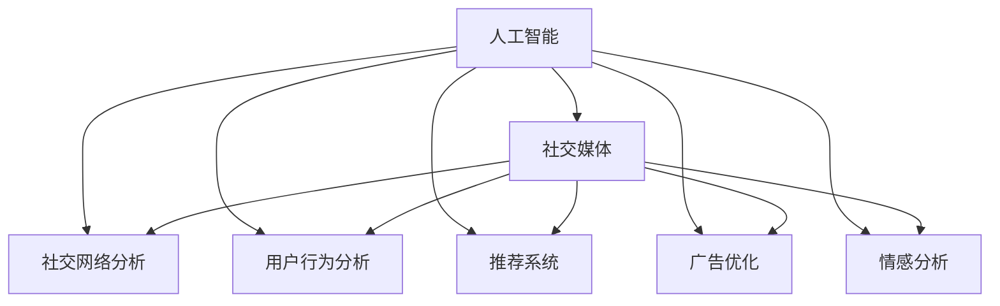

                 

# 人工智能在社交媒体和营销中的应用

> 关键词：人工智能,社交媒体,社交网络分析,营销,用户行为分析,推荐系统,广告优化,情感分析,机器学习,数据挖掘

## 1. 背景介绍

在数字化时代，社交媒体已成为品牌营销的重要渠道之一。通过社交媒体，企业可以与消费者进行实时互动，收集消费者反馈，了解市场需求，优化营销策略。人工智能(AI)技术在社交媒体和营销中的应用，使得这一过程更加高效、精准。本文将详细介绍人工智能如何在社交媒体和营销中发挥作用，探索其在数据分析、广告投放、客户服务等关键环节的应用实例。

## 2. 核心概念与联系

### 2.1 核心概念概述

- **人工智能**：利用机器学习、深度学习等技术，使计算机具备人类智能的某些方面，如视觉、语音、语言理解等。
- **社交媒体**：包括微博、微信、Instagram、Twitter等平台，是用户分享、交流、互动的虚拟社区。
- **社交网络分析(Social Network Analysis, SNA)**：通过分析社交网络的结构和属性，发现用户之间的连接模式，洞察用户行为和兴趣。
- **用户行为分析**：通过数据挖掘和机器学习技术，分析用户的行为和偏好，为个性化推荐和精准营销提供依据。
- **推荐系统**：根据用户的历史行为和偏好，推荐个性化的内容或产品。
- **广告优化**：通过优化广告投放策略，提高广告效果，降低广告成本。
- **情感分析**：利用自然语言处理(NLP)技术，分析用户对品牌、产品或事件的情感倾向。

这些核心概念通过以下Mermaid流程图连接起来：



## 3. 核心算法原理 & 具体操作步骤

### 3.1 算法原理概述

人工智能在社交媒体和营销中的应用，主要依赖于以下几个算法和模型：

- **自然语言处理(NLP)**：用于文本分析和情感分析，能够从用户评论、帖子中提取有价值的信息。
- **推荐系统算法**：包括协同过滤、矩阵分解等，能够根据用户历史行为和偏好，推荐相关内容或产品。
- **机器学习算法**：包括决策树、随机森林、神经网络等，用于用户行为分析和广告投放优化。
- **深度学习算法**：如卷积神经网络(CNN)、递归神经网络(RNN)、长短时记忆网络(LSTM)等，能够处理大规模数据集，发现更深层次的模式和规律。

### 3.2 算法步骤详解

以情感分析为例，介绍基于人工智能的社交媒体情感分析的基本流程：

1. **数据预处理**：对社交媒体文本进行清洗、分词、去停用词等预处理操作。
2. **特征提取**：使用NLP技术将文本转换为模型可以处理的向量表示。
3. **模型训练**：使用机器学习或深度学习模型训练情感分类器。
4. **模型评估**：在测试数据集上评估模型性能，调整模型参数。
5. **模型应用**：将训练好的模型应用到新的社交媒体数据中，进行情感分析。

### 3.3 算法优缺点

**优点**：
- **高效**：人工智能算法能够处理大规模数据，快速分析用户行为和情感。
- **精准**：基于机器学习和深度学习算法，能够发现用户行为背后的深层次规律。
- **实时**：能够实时监测用户行为和反馈，快速响应市场变化。

**缺点**：
- **数据依赖**：算法的有效性依赖于高质量的数据，数据质量和标注工作量大。
- **模型复杂**：复杂的深度学习模型需要较大的计算资源和较长的训练时间。
- **隐私问题**：处理用户数据时，需要考虑隐私保护和数据安全。

### 3.4 算法应用领域

人工智能在社交媒体和营销中的应用领域广泛，包括但不限于以下几个方面：

- **用户行为分析**：分析用户浏览、点赞、评论等行为，了解用户偏好和兴趣。
- **推荐系统**：根据用户历史行为，推荐个性化的内容或产品，提高用户满意度和转化率。
- **广告优化**：分析广告投放效果，优化广告投放策略，提高广告ROI。
- **情感分析**：分析用户对品牌、产品或事件的情感倾向，改进产品和服务。
- **客户服务**：通过聊天机器人等AI技术，提供24/7的客户服务，提高用户满意度。

## 4. 数学模型和公式 & 详细讲解 & 举例说明

### 4.1 数学模型构建

以推荐系统为例，构建一个基于协同过滤的推荐模型：

设用户集合为 $U=\{u_1, u_2, ..., u_m\}$，物品集合为 $I=\{i_1, i_2, ..., i_n\}$，用户 $u_i$ 对物品 $i_j$ 的评分表示为 $r_{i_j}^u$。推荐系统旨在预测用户 $u_i$ 对物品 $i_j$ 的评分。

推荐模型可以表示为：
$$
\hat{r}_{i_j}^u = \omega_0 + \sum_{k=1}^K \omega_k r_{i_k}^u + \sum_{k=1}^K \phi_k x_{i_k} x_{u_k}^T + \psi_k x_{i_k} y_{u_k}^T
$$

其中，$\omega_0, \omega_k, \phi_k, \psi_k$ 为模型参数，$r_{i_k}^u$ 和 $x_{i_k}, y_{u_k}$ 分别为用户和物品的特征向量。

### 4.2 公式推导过程

上述推荐模型的推导过程如下：

1. **用户-物品评分矩阵**：将用户和物品的评分数据表示为 $R \in \mathbb{R}^{m \times n}$ 矩阵。
2. **用户特征矩阵**：将用户的历史行为表示为特征向量 $X \in \mathbb{R}^{m \times K}$。
3. **物品特征矩阵**：将物品的属性表示为特征向量 $Y \in \mathbb{R}^{n \times K}$。
4. **预测评分矩阵**：利用推荐模型对用户和物品的评分进行预测，表示为 $\hat{R} \in \mathbb{R}^{m \times n}$。
5. **损失函数**：采用均方误差损失函数，表示为 $L = ||R - \hat{R}||_F^2$，其中 $||.||_F$ 表示矩阵的Frobenius范数。
6. **优化目标**：最小化损失函数 $L$，表示为：
   $$
   \min_{\omega_0, \omega_k, \phi_k, \psi_k} L
   $$

通过优化算法（如梯度下降）求解上述目标函数，即可得到推荐模型的参数，实现个性化推荐。

### 4.3 案例分析与讲解

以Facebook的推荐系统为例，介绍其推荐算法和技术架构：

1. **数据收集**：Facebook收集用户的行为数据，包括点赞、评论、分享等。
2. **数据预处理**：对数据进行清洗、去噪、归一化等处理。
3. **特征提取**：提取用户的特征，如兴趣标签、社交关系等。
4. **模型训练**：利用协同过滤算法训练推荐模型。
5. **模型应用**：将训练好的模型应用到新的用户行为数据中，推荐相关内容。
6. **效果评估**：评估模型的性能，不断优化模型参数和推荐策略。

## 5. 项目实践：代码实例和详细解释说明

### 5.1 开发环境搭建

以TensorFlow为例，搭建推荐系统的开发环境：

1. **安装TensorFlow**：从TensorFlow官网下载并安装TensorFlow。
2. **配置环境**：安装所需的Python库，如NumPy、Pandas等。
3. **设置数据集**：准备好用户行为数据和物品属性数据。

### 5.2 源代码详细实现

以下是一个简单的协同过滤推荐系统的代码实现：

```python
import numpy as np
import tensorflow as tf

# 数据准备
# 用户-物品评分矩阵
R = np.array([[5, 4, 0, 0],
              [0, 0, 3, 1],
              [2, 2, 5, 0],
              [0, 0, 0, 4]])
# 用户特征矩阵
X = np.array([[1, 1, 0],
              [0, 0, 1],
              [1, 0, 1],
              [1, 1, 0]])
# 物品特征矩阵
Y = np.array([[1, 0, 1],
              [1, 1, 0],
              [0, 0, 1],
              [1, 0, 1]])

# 模型构建
# 定义模型参数
omega_0 = tf.Variable(tf.zeros([1]))
omega_k = tf.Variable(tf.zeros([3]))
phi_k = tf.Variable(tf.zeros([3, 3]))
psi_k = tf.Variable(tf.zeros([3, 3]))

# 定义模型输入输出
u = tf.placeholder(tf.float32, [None, 3])
i = tf.placeholder(tf.float32, [None, 3])
y = tf.placeholder(tf.float32, [None, 1])

# 定义预测评分函数
def predict(r, u, i):
    return omega_0 + tf.reduce_sum(tf.multiply(tf.matmul(u, phi_k), r), axis=1) + tf.reduce_sum(tf.multiply(tf.matmul(i, psi_k), u), axis=1)

# 定义损失函数
def loss(r, y, r_hat):
    return tf.reduce_mean(tf.square(r_hat - y))

# 定义优化器
optimizer = tf.train.AdamOptimizer(learning_rate=0.01)
train_op = optimizer.minimize(loss(R, y, predict(R, X, Y)))

# 训练模型
with tf.Session() as sess:
    sess.run(tf.global_variables_initializer())
    for i in range(1000):
        _, l = sess.run([train_op, loss(R, y, predict(R, X, Y))])
        if i % 100 == 0:
            print("Step %d, Loss: %.4f" % (i, l))

# 测试模型
test_r = np.array([[0, 0, 5],
                   [0, 0, 0],
                   [0, 0, 3],
                   [0, 0, 0]])
test_y = np.array([[4.],
                   [4.],
                   [2.],
                   [4.]])
test_r_hat = predict(R, X, Y)

# 打印推荐结果
print(test_r_hat)
```

### 5.3 代码解读与分析

上述代码实现了基于协同过滤的推荐系统，关键步骤如下：

1. **数据准备**：准备好用户行为数据和物品属性数据。
2. **模型构建**：定义模型参数和预测函数。
3. **损失函数定义**：采用均方误差损失函数。
4. **优化器定义**：使用Adam优化器最小化损失函数。
5. **训练模型**：使用训练数据进行模型训练，输出损失值。
6. **测试模型**：对新的数据进行预测，输出推荐评分。

## 6. 实际应用场景

### 6.1 智能广告投放

在智能广告投放中，基于人工智能的广告优化算法可以显著提升广告效果。通过分析用户行为数据，识别用户兴趣和偏好，优化广告投放策略，提高广告点击率和转化率。

以Google AdWords为例，其推荐算法采用多臂老虎机(MAB)模型，优化广告预算分配，最大化广告效果。通过实时监测广告效果，动态调整投放策略，提高广告ROI。

### 6.2 用户行为分析

通过社交媒体数据分析，了解用户的行为和偏好，提供个性化的推荐和服务。

以Amazon为例，其推荐系统通过分析用户浏览、购买历史数据，提供个性化的商品推荐。Amazon利用协同过滤、基于内容的推荐等技术，提升用户体验和销售额。

### 6.3 客户服务

通过聊天机器人等AI技术，提供24/7的客户服务，提高用户满意度。

以Alibaba的智能客服为例，其利用NLP技术和机器学习算法，构建智能客服系统。通过用户输入的文本，实时分析用户意图，提供精准的解答和建议。

## 7. 工具和资源推荐

### 7.1 学习资源推荐

- **《深度学习》（Ian Goodfellow等著）**：深度学习领域的经典教材，详细介绍了深度学习的基本原理和应用。
- **Coursera《机器学习》课程**：由斯坦福大学教授Andrew Ng讲授，系统介绍机器学习的基本概念和算法。
- **Kaggle**：数据科学和机器学习竞赛平台，提供大量公开数据集和竞赛，锻炼实际应用能力。

### 7.2 开发工具推荐

- **TensorFlow**：Google开发的深度学习框架，支持大规模数据处理和模型训练。
- **PyTorch**：Facebook开发的深度学习框架，支持动态图和高效的GPU加速。
- **Scikit-learn**：Python的机器学习库，提供简单易用的API，支持多种机器学习算法。

### 7.3 相关论文推荐

- **Ad-click prediction for web search ads**（ICML 2008）：介绍了多臂老虎机算法在广告点击预测中的应用。
- **A probabilistic latent semantic analysis of web usage**（KDD 2007）：通过分析用户行为数据，提供个性化推荐。
- **Neural image caption generation with attention**（ICML 2015）：利用深度学习技术，生成高质量的图像描述。

## 8. 总结：未来发展趋势与挑战

### 8.1 总结

本文详细介绍了人工智能在社交媒体和营销中的应用，包括用户行为分析、推荐系统、广告优化、情感分析等。通过实际案例和代码实现，展示了人工智能技术的强大应用潜力。未来，随着深度学习、机器学习等技术的发展，人工智能将在社交媒体和营销中发挥更大作用。

### 8.2 未来发展趋势

- **自动化**：利用自动化工具和算法，减少人工干预，提升工作效率。
- **实时性**：通过实时分析用户数据，及时调整策略，提高响应速度。
- **个性化**：根据用户行为和偏好，提供个性化的推荐和服务。
- **智能化**：引入更多智能算法，如自然语言处理、机器学习、深度学习等，提升系统的智能化水平。

### 8.3 面临的挑战

- **数据隐私**：处理用户数据时，需要考虑隐私保护和数据安全。
- **算法复杂**：复杂的算法需要较大的计算资源和较长的训练时间。
- **模型泛化**：模型需要具备良好的泛化能力，适应不同场景和数据分布。
- **用户接受度**：需要用户接受和信任AI技术，才能发挥其最大效用。

### 8.4 研究展望

- **模型优化**：进一步优化推荐算法和模型结构，提高性能和效率。
- **多模态融合**：将视觉、语音、文本等多模态数据进行融合，提升系统性能。
- **跨领域应用**：将AI技术应用到更多领域，提升整体智能化水平。

## 9. 附录：常见问题与解答

**Q1：如何保护用户数据隐私？**

A: 在数据收集和处理过程中，采用数据匿名化、差分隐私等技术，保护用户隐私。同时，严格遵守数据保护法规，如GDPR等。

**Q2：如何评估推荐系统的性能？**

A: 评估推荐系统性能的常用指标包括准确率、召回率、F1值、用户满意度等。通过A/B测试等方法，评估不同策略的效果。

**Q3：推荐系统如何避免过拟合？**

A: 通过引入正则化、dropout等技术，防止模型过拟合。同时，在训练过程中，采用交叉验证、逐步增加数据等方法，提高模型的泛化能力。

**Q4：机器学习模型如何处理缺失数据？**

A: 采用插值、均值填充等方法处理缺失数据。同时，利用模型自适应能力，减少缺失数据对模型的影响。

**Q5：如何提高模型的实时性？**

A: 利用分布式计算、模型裁剪、压缩等技术，提高模型计算速度。同时，采用GPU、TPU等硬件加速，提升处理效率。

---

作者：禅与计算机程序设计艺术 / Zen and the Art of Computer Programming

