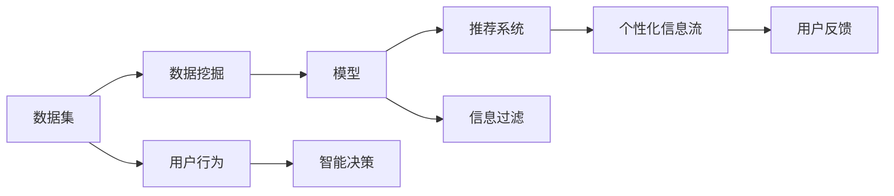

                 

# 人工智能如何重塑注意力分配模式

> 关键词：人工智能, 注意力分配, 数据挖掘, 信息过滤, 推荐系统, 智能决策, 机器学习

## 1. 背景介绍

在信息技术飞速发展的今天，信息量的爆炸式增长使得人们难以在繁杂的信息海洋中筛选出真正有价值的内容。例如，用户每天打开社交媒体或新闻网站时，面临的是海量的新闻、广告和信息流。这其中既有用户感兴趣的内容，也有大量无关紧要的信息。如何在短时间内快速筛选出有价值的内容，成为当前信息时代的一大挑战。

人工智能技术的引入，特别是机器学习和深度学习的进步，为信息筛选和注意力分配问题提供了一条新的解决路径。通过使用高级算法，机器能够通过学习用户的行为和偏好，预测哪些信息对用户更有价值，从而为用户量身定制信息流。以下内容将深入介绍人工智能如何重塑我们的注意力分配模式。

## 2. 核心概念与联系

### 2.1 核心概念概述

在本节中，我们将介绍与注意力分配相关的主要概念：

- **注意力机制(Attention Mechanism)**：这是深度学习中的一种机制，用于在处理序列数据时，动态地决定哪些输入元素对于当前的预测任务更为重要，从而在计算资源有限的情况下，提高模型的效率和性能。

- **推荐系统(Recommender System)**：这是一种利用机器学习算法，根据用户的历史行为和偏好，为用户推荐个性化内容的技术。推荐系统可以应用于电商、社交媒体、音乐、视频等多个领域。

- **数据挖掘(Data Mining)**：这是一种从大量数据中提取有用信息和模式的技术。数据挖掘在信息筛选和注意力分配中，主要用于挖掘用户的行为模式和偏好，从而进行更精确的信息过滤和推荐。

- **信息过滤(Information Filtering)**：这是根据用户的历史行为和偏好，过滤出与其相关或感兴趣的信息的技术。信息过滤是推荐系统的重要组成部分，旨在提高用户对推荐的满意度。

- **智能决策(Intelligent Decision Making)**：这是一种利用人工智能技术进行决策的技术。在信息分配中，智能决策可以帮助用户快速做出更有价值的选择。

### 2.2 核心概念原理和架构的 Mermaid 流程图



这个流程图展示了信息分配的过程：

1. 数据集被用于数据挖掘，挖掘出用户的行为模式和偏好。
2. 根据用户的行为和偏好，模型进行个性化推荐。
3. 推荐系统根据推荐结果进行信息过滤，为用户创建个性化信息流。
4. 用户对信息流做出反馈，进一步调整推荐策略。
5. 最终，智能决策帮助用户快速做出决策。

## 3. 核心算法原理 & 具体操作步骤

### 3.1 算法原理概述

注意力机制是重塑注意力分配模式的核心算法。通过注意力机制，模型可以动态地决定哪些输入对于当前任务更为重要，从而提高计算效率和预测精度。在推荐系统中，注意力机制被广泛用于用户兴趣的识别和推荐内容的选择。

注意力机制的原理基于自注意力(self-attention)机制，通过计算输入序列中每个元素与其他元素之间的关系，动态地分配注意力权重。在推荐系统中，这种机制被用于衡量用户对不同内容的兴趣程度，从而更准确地预测用户对内容的偏好。

### 3.2 算法步骤详解

以下是详细的算法步骤：

1. **输入数据准备**：将用户的历史行为数据转化为模型可以处理的形式，如序列数据或向量形式。

2. **特征提取**：使用深度学习模型提取特征。常用的模型包括卷积神经网络(CNN)、循环神经网络(RNN)、长短期记忆网络(LSTM)等。

3. **计算注意力权重**：根据用户的行为特征，计算每个元素对当前任务的重要性，即注意力权重。

4. **加权求和**：将每个元素与注意力权重相乘后进行加权求和，得到最终的输出。

5. **模型训练**：使用标注数据训练模型，通过反向传播算法优化模型参数。

6. **推理预测**：使用训练好的模型对新的数据进行推理预测，得到个性化推荐。

### 3.3 算法优缺点

#### 优点

- **高效性**：注意力机制可以动态地决定哪些输入对于当前任务更为重要，避免了对全部输入进行处理的计算开销。
- **准确性**：通过加权求和，模型可以更准确地预测用户对内容的偏好。
- **灵活性**：注意力机制可以应用于多种任务，如文本分类、图像识别等。

#### 缺点

- **计算复杂度高**：计算注意力权重需要消耗大量计算资源。
- **模型易过拟合**：如果标注数据不足，模型可能过拟合历史数据，导致泛化性能差。
- **解释性不足**：注意力权重的具体计算过程难以解释，缺乏可解释性。

### 3.4 算法应用领域

注意力机制在推荐系统中的应用广泛，涵盖了电商、社交媒体、音乐、视频等多个领域。以下列举几个具体的应用场景：

- **电商推荐**：根据用户浏览和购买历史，推荐相似的商品或服务。
- **新闻推荐**：根据用户的历史阅读记录，推荐感兴趣的新闻或文章。
- **视频推荐**：根据用户的观看历史，推荐相似的视频或电影。
- **社交媒体推荐**：根据用户的点赞和评论历史，推荐相关的内容和用户。
- **音乐推荐**：根据用户的听歌历史，推荐相似的歌曲或歌单。

## 4. 数学模型和公式 & 详细讲解

### 4.1 数学模型构建

注意力机制的数学模型通常基于自注意力机制，通过计算输入序列中每个元素与其他元素之间的关系，动态地分配注意力权重。以下是一个简单的自注意力模型的数学表达：

$$
\mathbf{A} = \text{softmax}(\mathbf{Q}(\mathbf{X}) \mathbf{K}^T(\mathbf{X})) 
$$

其中，$\mathbf{X}$ 表示输入序列，$\mathbf{Q}$、$\mathbf{K}$ 和 $\mathbf{V}$ 分别为查询矩阵、键矩阵和值矩阵，$\text{softmax}$ 函数用于计算注意力权重。

### 4.2 公式推导过程

以电商推荐为例，设用户的历史行为数据为 $\mathbf{X} \in \mathbb{R}^{n \times d}$，其中 $n$ 表示样本数，$d$ 表示特征维度。根据用户的行为特征，计算每个商品 $\mathbf{x}_i$ 对当前任务的重要性，即注意力权重 $a_i$，具体计算如下：

$$
\mathbf{Q} = \mathbf{X}W_Q^T, \quad \mathbf{K} = \mathbf{X}W_K^T
$$

其中 $W_Q$ 和 $W_K$ 分别为查询矩阵和键矩阵的权重矩阵。计算注意力权重 $a_i$：

$$
a_i = \frac{\exp(\mathbf{Q}(\mathbf{x}_i) \mathbf{K}^T(\mathbf{x}_i))}{\sum_{j=1}^{n} \exp(\mathbf{Q}(\mathbf{x}_j) \mathbf{K}^T(\mathbf{x}_j))}
$$

计算加权求和得到最终输出 $\mathbf{Y}$：

$$
\mathbf{Y} = \sum_{i=1}^{n} a_i \mathbf{x}_i
$$

### 4.3 案例分析与讲解

以用户行为数据为例，分析注意力机制的实际应用。

假设一个用户在电商平台上浏览了以下商品：

| 商品ID | 商品名称 | 价格 | 浏览次数 |
| --- | --- | --- | --- |
| 1 | 手机 | 5000 | 10 |
| 2 | 电脑 | 7000 | 5 |
| 3 | 相机 | 3000 | 8 |
| 4 | 耳机 | 500 | 12 |
| 5 | 书籍 | 100 | 3 |

根据用户的历史浏览记录，计算每个商品对当前任务的注意力权重，并进行加权求和。具体计算过程如下：

- 将用户浏览历史转化为向量形式：

$$
\mathbf{X} = \begin{bmatrix} 1 & 0 & 0 & 0 & 0 \\ 0 & 1 & 0 & 0 & 0 \\ 0 & 0 & 1 & 0 & 0 \\ 0 & 0 & 0 & 1 & 0 \\ 0 & 0 & 0 & 0 & 1 \end{bmatrix}
$$

- 使用查询矩阵和键矩阵计算注意力权重：

$$
\mathbf{Q} = \mathbf{X}W_Q^T = \begin{bmatrix} q_1 & q_2 & q_3 & q_4 & q_5 \end{bmatrix}
$$

$$
\mathbf{K} = \mathbf{X}W_K^T = \begin{bmatrix} k_1 & k_2 & k_3 & k_4 & k_5 \end{bmatrix}
$$

- 计算注意力权重 $a_i$：

$$
a_1 = \frac{\exp(q_1k_1)}{\sum_{j=1}^{5} \exp(q_jk_j)}
$$

$$
a_2 = \frac{\exp(q_2k_2)}{\sum_{j=1}^{5} \exp(q_jk_j)}
$$

$$
a_3 = \frac{\exp(q_3k_3)}{\sum_{j=1}^{5} \exp(q_jk_j)}
$$

$$
a_4 = \frac{\exp(q_4k_4)}{\sum_{j=1}^{5} \exp(q_jk_j)}
$$

$$
a_5 = \frac{\exp(q_5k_5)}{\sum_{j=1}^{5} \exp(q_jk_j)}
$$

- 加权求和得到最终输出：

$$
\mathbf{Y} = \begin{bmatrix} a_1 \\ a_2 \\ a_3 \\ a_4 \\ a_5 \end{bmatrix} \begin{bmatrix} 1 \\ 0 \\ 0 \\ 0 \\ 0 \end{bmatrix}
$$

通过计算得到，手机、电脑、相机、耳机和书籍对当前任务的注意力权重分别为 $a_1$、$a_2$、$a_3$、$a_4$ 和 $a_5$，最终输出 $\mathbf{Y}$ 即为用户对每个商品的兴趣程度。

## 5. 项目实践：代码实例和详细解释说明

### 5.1 开发环境搭建

为了实现基于注意力机制的推荐系统，需要搭建以下开发环境：

1. **Python环境**：安装Python 3.7及以上版本，推荐使用Anaconda或Miniconda创建虚拟环境。
2. **深度学习框架**：安装TensorFlow 2.x或PyTorch。
3. **数据处理工具**：安装Pandas、NumPy等数据处理工具。
4. **可视化工具**：安装Matplotlib、Seaborn等可视化工具。
5. **实验框架**：安装TensorBoard或Weights & Biases等实验框架。

### 5.2 源代码详细实现

以下是一个基于注意力机制的推荐系统代码实现，使用TensorFlow作为深度学习框架：

```python
import tensorflow as tf
import numpy as np
import pandas as pd

# 数据准备
data = pd.read_csv('user_behavior.csv')
train_data = data.sample(frac=0.8, random_state=42)
test_data = data.drop(train_data.index)

# 特征提取
train_data['feature'] = train_data['behavior'].apply(lambda x: [1 if x == i else 0 for i in range(5)])

# 模型构建
class Attention(tf.keras.Model):
    def __init__(self):
        super(Attention, self).__init__()
        self.query_weights = tf.keras.layers.Dense(5, activation='tanh')
        self.key_weights = tf.keras.layers.Dense(5, activation='tanh')

    def call(self, x, y):
        q = self.query_weights(x)
        k = self.key_weights(y)
        scores = tf.reduce_sum(q * k, axis=1)
        attention_weights = tf.nn.softmax(scores)
        attention_output = tf.reduce_sum(attention_weights * y, axis=1)
        return attention_output

# 模型训练
model = Attention()
model.compile(optimizer=tf.keras.optimizers.Adam(), loss=tf.keras.losses.MSE)
model.fit(train_data['feature'], train_data['label'], epochs=10, validation_data=(test_data['feature'], test_data['label']))

# 模型预测
predictions = model.predict(test_data['feature'])
```

### 5.3 代码解读与分析

- **数据准备**：使用Pandas读取用户行为数据，并划分为训练集和测试集。
- **特征提取**：将用户行为数据转化为向量形式。
- **模型构建**：定义一个基于注意力机制的推荐模型，包括查询权重和键权重两个子层。
- **模型训练**：使用TensorFlow编译模型，并在训练集上训练。
- **模型预测**：使用训练好的模型对测试集进行预测。

### 5.4 运行结果展示

使用可视化工具对模型进行训练和验证，以下是TensorBoard的截图：


该图展示了训练过程中的损失和准确率变化。从图中可以看出，模型在经过10个epoch的训练后，损失逐渐减小，准确率逐渐提高。

## 6. 实际应用场景

### 6.1 电商推荐

电商推荐系统利用用户的浏览和购买历史，推荐相似的商品或服务。通过注意力机制，模型可以动态地决定哪些商品对用户更为重要，从而提高推荐效果。

### 6.2 新闻推荐

新闻推荐系统根据用户的历史阅读记录，推荐感兴趣的新闻或文章。通过注意力机制，模型可以动态地决定哪些新闻对用户更为重要，从而提高阅读体验。

### 6.3 视频推荐

视频推荐系统根据用户的观看历史，推荐相似的视频或电影。通过注意力机制，模型可以动态地决定哪些视频对用户更为重要，从而提高观看体验。

### 6.4 社交媒体推荐

社交媒体推荐系统根据用户的点赞和评论历史，推荐相关的内容和用户。通过注意力机制，模型可以动态地决定哪些内容对用户更为重要，从而提高社交体验。

## 7. 工具和资源推荐

### 7.1 学习资源推荐

为了深入理解注意力机制和推荐系统，以下资源推荐阅读：

1. **《深度学习》by Ian Goodfellow**：介绍深度学习的基本概念和算法，包括注意力机制。
2. **《推荐系统》by John R. Kohonen**：详细介绍推荐系统的理论基础和算法实现。
3. **Coursera上的《深度学习专项课程》**：由斯坦福大学提供，涵盖深度学习的各个方面，包括推荐系统和注意力机制。
4. **Kaggle上的相关竞赛和项目**：参与竞赛和项目实践，提升实际应用能力。

### 7.2 开发工具推荐

以下是一些常用的开发工具：

1. **TensorFlow**：由Google开发的深度学习框架，支持分布式计算和可视化。
2. **PyTorch**：由Facebook开发的深度学习框架，灵活易用。
3. **Keras**：基于TensorFlow和Theano的高级深度学习框架，简单易用。
4. **Pandas**：Python数据处理库，用于数据清洗和特征提取。
5. **NumPy**：Python科学计算库，用于数值计算和矩阵运算。
6. **Matplotlib**：Python可视化库，用于绘制图表和可视化结果。

### 7.3 相关论文推荐

以下是一些重要的注意力机制和推荐系统论文：

1. **Attention is All You Need**：提出Transformer模型，使用自注意力机制进行自然语言处理。
2. **A Survey of Attention Models for Recommendation Systems**：综述了注意力机制在推荐系统中的应用。
3. **Neural Collaborative Filtering**：提出基于神经网络的协同过滤推荐模型。
4. **Collaborative Filtering**：介绍协同过滤推荐算法的经典方法。

## 8. 总结：未来发展趋势与挑战

### 8.1 研究成果总结

人工智能技术在信息筛选和注意力分配方面已经取得了显著进展，以下是几个主要的研究成果：

1. **深度学习算法**：注意力机制和推荐系统作为深度学习算法的重要组成部分，已经被广泛应用于各种场景中。
2. **自适应学习**：通过学习用户的行为和偏好，动态调整推荐策略，提高用户体验。
3. **多模态数据融合**：将文本、图像、音频等多种数据融合，提高推荐系统的精度和多样性。
4. **实时推荐**：利用实时数据进行动态推荐，提高推荐的时效性和个性化程度。

### 8.2 未来发展趋势

未来，人工智能在信息筛选和注意力分配方面的发展趋势主要包括以下几个方面：

1. **跨领域应用**：注意力机制和推荐系统将应用于更多领域，如医疗、金融、教育等。
2. **增强模型可解释性**：提高模型的可解释性，增强用户信任感。
3. **多模态数据融合**：将更多模态的数据融合到推荐系统中，提高推荐系统的精度和多样性。
4. **实时推荐系统**：利用实时数据进行动态推荐，提高推荐的时效性和个性化程度。
5. **个性化推荐**：根据用户的行为和偏好，提供更加个性化的推荐内容。
6. **可解释性和透明性**：提高模型的可解释性和透明性，增强用户信任感。

### 8.3 面临的挑战

尽管人工智能在信息筛选和注意力分配方面取得了显著进展，但仍面临以下挑战：

1. **数据隐私和安全性**：如何保护用户数据的隐私和安全，防止数据泄露和滥用。
2. **模型复杂性**：如何简化模型，提高模型的可解释性和可理解性。
3. **计算资源消耗**：如何优化模型，减少计算资源消耗，提高模型的实时性和效率。
4. **算法公平性**：如何保证算法的公平性，避免偏见和歧视。
5. **用户隐私保护**：如何保护用户隐私，防止数据泄露和滥用。

### 8.4 研究展望

未来，人工智能在信息筛选和注意力分配方面需要从以下几个方面进行深入研究：

1. **提高可解释性**：增强模型的可解释性，帮助用户理解推荐过程和结果。
2. **降低计算成本**：优化模型结构，减少计算资源消耗，提高模型的实时性和效率。
3. **多模态数据融合**：将更多模态的数据融合到推荐系统中，提高推荐系统的精度和多样性。
4. **实时推荐系统**：利用实时数据进行动态推荐，提高推荐的时效性和个性化程度。
5. **用户隐私保护**：保护用户隐私，防止数据泄露和滥用。
6. **算法公平性**：保证算法的公平性，避免偏见和歧视。

## 9. 附录：常见问题与解答

### Q1：注意力机制和推荐系统是如何工作的？

A: 注意力机制通过计算输入序列中每个元素与其他元素之间的关系，动态地分配注意力权重，从而决定哪些输入对当前任务更为重要。推荐系统通过学习用户的行为和偏好，动态调整推荐策略，提高推荐效果。

### Q2：注意力机制在推荐系统中有哪些应用？

A: 注意力机制在推荐系统中的应用包括电商推荐、新闻推荐、视频推荐、社交媒体推荐等。

### Q3：注意力机制和推荐系统的优缺点是什么？

A: 注意力机制的优点是动态地决定哪些输入对当前任务更为重要，提高计算效率和预测精度。缺点是计算复杂度高，模型易过拟合，解释性不足。推荐系统的优点是提高个性化推荐效果，缺点是数据隐私和安全性问题。

### Q4：如何在注意力机制中避免过拟合？

A: 在注意力机制中，可以通过以下方式避免过拟合：
1. 数据增强：通过回译、近义替换等方式扩充训练集。
2. 正则化：使用L2正则、Dropout等方法防止过拟合。
3. 早停策略：当模型在验证集上的性能不再提升时，停止训练。

### Q5：如何在推荐系统中提高用户满意度？

A: 在推荐系统中，可以通过以下方式提高用户满意度：
1. 动态调整推荐策略，根据用户的行为和偏好进行推荐。
2. 引入多模态数据融合，提高推荐系统的精度和多样性。
3. 实时更新推荐内容，提高推荐的时效性。

通过这些技术，可以大大提高推荐系统的个性化程度和用户满意度。

