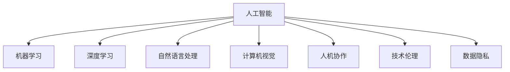

                 

# 人工智能：社会影响与思考

> 关键词：人工智能, 社会影响, 技术伦理, 人工智能治理, 社会公平, 就业影响, 教育变革

## 1. 背景介绍

### 1.1 问题由来
人工智能(AI)的迅猛发展已经深刻改变了现代社会。从智能推荐系统、无人驾驶、智能客服到医疗影像分析、基因编辑，AI技术正在渗透到各个领域，为人类生产生活带来了翻天覆地的变化。然而，伴随技术进步，一系列社会伦理、隐私、就业、公平等问题也逐渐凸显，引发了广泛的关注和讨论。

### 1.2 问题核心关键点
在AI浪潮的推动下，人类社会的生产方式、治理模式、价值观念都在发生深刻变革。如何平衡技术创新与人类福祉，确保AI技术健康、可持续地发展，成为了当前面临的关键课题。以下是对AI社会影响的系统思考：

1. **技术伦理**：如何在技术中立性原则下，确保AI系统的透明、公正、可靠。
2. **隐私保护**：如何保障个人数据隐私，防止数据滥用和泄露。
3. **就业影响**：如何应对AI对劳动力市场的冲击，保障社会就业稳定。
4. **社会公平**：如何缩小AI带来的数字鸿沟，避免技术偏见和歧视。
5. **数据治理**：如何建立高效、合规的数据治理体系，确保数据质量与安全。

这些关键问题，将直接影响AI技术的未来走向和应用范围，需要在技术创新与社会进步之间找到平衡点。

### 1.3 问题研究意义
研究AI的社会影响，对于推动AI技术健康发展、构建智能公平社会具有重要意义：

1. **促进技术伦理**：明确AI伦理规范，指导AI系统设计，确保技术创新服务于人类福祉。
2. **保障数据安全**：制定数据治理标准，保护用户隐私，防止数据滥用。
3. **提升就业质量**：探索AI与人类协作的新模式，实现技术红利普惠，增强就业稳定性。
4. **促进社会公平**：消除技术偏见，推动教育、医疗等领域的公平发展。
5. **推动制度创新**：构建AI治理体系，为AI技术的规范应用提供保障。

通过对AI社会影响的全面分析，我们才能在技术创新的道路上，更好地实现社会进步与和谐发展。

## 2. 核心概念与联系

### 2.1 核心概念概述

为更好地理解AI技术对社会的影响，本节将介绍几个密切相关的核心概念：

- **人工智能**：指通过计算机算法和数据处理，使机器具备智能行为的学科和应用。
- **机器学习**：一种实现人工智能的技术，通过数据驱动的学习，使机器能够自我优化。
- **深度学习**：机器学习的一个分支，通过构建多层神经网络模型，学习非线性关系，实现复杂模式的识别和预测。
- **自然语言处理**：研究计算机如何理解、处理和生成人类语言的技术，是AI的重要分支之一。
- **计算机视觉**：研究计算机如何“看”和理解图像和视频，是AI的另一重要分支。
- **人机协作**：探讨AI与人类在任务执行中的互动模式，实现技术红利普惠。
- **技术伦理**：研究AI技术在设计、开发、应用中的伦理问题，确保技术的公正、透明和可靠。
- **数据隐私**：指个人数据的保护，防止数据滥用和泄露，确保数据安全和用户隐私。

这些核心概念之间的逻辑关系可以通过以下Mermaid流程图来展示：



这个流程图展示了大语言模型的核心概念及其之间的关系：

1. 人工智能技术通过机器学习和深度学习实现智能行为。
2. 自然语言处理和计算机视觉是AI的重要应用领域，用于处理和理解复杂的人类信息。
3. 人机协作研究AI与人类在任务执行中的互动模式。
4. 技术伦理和数据隐私是AI技术设计和应用中必须关注的重要问题。

这些概念共同构成了AI技术的研究与应用框架，对其社会影响进行了全面的分析。

## 3. 核心算法原理 & 具体操作步骤
### 3.1 算法原理概述

AI技术的社会影响，涉及从技术原理到应用实践的多个层面。以下将从技术角度，探讨AI对社会的影响，并提出相应的对策。

**技术原理**：
AI技术的核心在于机器学习和深度学习算法。通过大量数据和计算资源的投入，使机器能够从数据中学习模式，进行预测和决策。这种技术的基础是对复杂非线性关系的建模，但同时也带来了数据依赖、计算资源消耗高、结果不可解释等挑战。

**社会影响**：
1. **就业影响**：自动化和智能化提高了生产效率，但也会导致部分职业的消失，引发就业结构性变化。
2. **公平性问题**：AI系统可能因为数据偏见、算法设计不合理等因素，产生歧视性输出，影响社会公平。
3. **隐私保护**：AI系统往往需要大量数据进行训练，数据收集和使用过程中存在隐私泄露的风险。
4. **伦理问题**：AI系统的决策过程不透明，可能带来算法黑箱、决策不公等问题。

**对策**：
1. **数据隐私保护**：加强数据匿名化、去标识化处理，建立数据使用的法律法规。
2. **算法透明性**：引入可解释性模型，增加算法决策的透明性和可解释性。
3. **就业保障**：推动职业再教育和技能培训，帮助劳动者适应技术变化，实现职业转型。
4. **公平性设计**：设计公正无偏的算法，定期审查和更新算法，消除算法偏见。

### 3.2 算法步骤详解

以下是AI技术在实际应用中对社会影响的具体分析步骤：

**Step 1: 数据收集与预处理**
- 收集相关领域的原始数据，进行数据清洗、去噪、标准化等预处理操作。
- 进行数据匿名化、去标识化处理，确保数据隐私。

**Step 2: 模型设计与训练**
- 选择合适的机器学习算法和模型结构，如深度神经网络、支持向量机等。
- 训练模型，调整超参数，确保模型在训练集上的性能表现。

**Step 3: 模型评估与部署**
- 在测试集上评估模型性能，确保模型泛化能力强。
- 将模型部署到实际应用环境中，进行持续监测和优化。

**Step 4: 社会影响评估**
- 评估AI模型对就业、公平、隐私等方面的影响。
- 根据评估结果，提出改进措施和建议。

**Step 5: 社会实践与反馈**
- 在实际应用中不断调整和优化模型，收集反馈意见。
- 通过政策引导、教育培训等方式，促进技术红利普惠。

### 3.3 算法优缺点

AI技术在提升生产效率、推动创新应用的同时，也存在以下优缺点：

**优点**：
1. 自动化生产、智能决策，提高效率和精度。
2. 处理大数据、复杂任务，具有广泛应用前景。
3. 创新医疗、金融等领域，推动社会进步。

**缺点**：
1. 高昂的计算资源和数据依赖，成本较高。
2. 可能带来就业结构性变化，引发社会问题。
3. 数据隐私和安全问题难以完全解决。
4. 算法偏见、决策不公可能影响公平性。

### 3.4 算法应用领域

AI技术已经广泛应用于各个领域，涵盖以下关键应用：

- **医疗**：辅助诊断、智能医疗设备、个性化治疗方案。
- **金融**：风险评估、投资策略、反欺诈检测。
- **教育**：个性化教育、智能辅导、教学质量评估。
- **智能制造**：自动化生产、质量检测、供应链管理。
- **智能交通**：自动驾驶、智能调度、安全监控。

这些应用领域充分展示了AI技术的强大潜力，同时也带来了相应的社会影响。

## 4. 数学模型和公式 & 详细讲解 & 举例说明（备注：数学公式请使用latex格式，latex嵌入文中独立段落使用 $$，段落内使用 $)
### 4.1 数学模型构建

AI技术的社会影响评估，涉及多个维度的数据和指标。以下构建一个多目标优化模型，用于评估AI对社会的影响：

**模型目标**：
- 最小化就业风险：$Minimize\ J_1$
- 最大化公平性：$Maximize\ J_2$
- 保障数据隐私：$Minimize\ J_3$

**模型约束**：
- 模型数据集不能泄露个人隐私：$C_1$
- 模型决策透明可解释：$C_2$
- 模型算法无偏公正：$C_3$

**模型公式**：
$$
Minimize\ J_1 = F_{emp}(AI\_system)
$$
$$
Maximize\ J_2 = F_{fair}(AI\_system)
$$
$$
Minimize\ J_3 = F_{privacy}(AI\_system)
$$

其中 $F_{emp}$、$F_{fair}$、$F_{privacy}$ 分别代表就业风险、公平性和隐私保护的目标函数，$C_1$、$C_2$、$C_3$ 为相应的约束条件。

### 4.2 公式推导过程

以就业风险评估为例，推导目标函数 $F_{emp}$：

假设AI系统对劳动市场的影响为 $L$，包括失业率、工作岗位变动等。AI技术引入后的劳动市场变化可以通过以下公式计算：

$$
L = F_{trans}(AI\_system, \Delta J, \Delta T)
$$

其中 $\Delta J$ 代表失业率变化，$\Delta T$ 代表新增工作岗位数量。$F_{trans}$ 为失业和岗位变动的转移函数。

就业风险评估的目标函数 $F_{emp}$ 可以表示为：

$$
F_{emp} = L \times W
$$

其中 $W$ 为就业风险的权重，用于调节失业和岗位变化的影响程度。

### 4.3 案例分析与讲解

**案例分析**：智能制造对就业的影响

智能制造的引入，通过自动化和智能化生产，大幅提高了生产效率和产品质量。但同时，也可能导致部分岗位的消失，引发就业问题。

**分析步骤**：
1. 收集智能制造相关的就业数据，如自动化程度、岗位变化等。
2. 评估智能制造对不同行业、不同岗位的就业影响。
3. 基于就业数据，构建就业风险评估模型，预测未来就业趋势。
4. 根据评估结果，提出相应的就业保障措施，如职业再教育、技能培训等。

## 5. 项目实践：代码实例和详细解释说明
### 5.1 开发环境搭建

在进行AI社会影响评估的项目实践前，需要准备好开发环境。以下是使用Python进行模型开发的环境配置流程：

1. 安装Anaconda：从官网下载并安装Anaconda，用于创建独立的Python环境。

2. 创建并激活虚拟环境：
```bash
conda create -n ai-env python=3.8 
conda activate ai-env
```

3. 安装Python相关的库：
```bash
pip install numpy pandas scikit-learn matplotlib tqdm jupyter notebook ipython
```

4. 安装AI相关的库：
```bash
pip install tensorflow keras tensorflow-gpu scikit-learn
```

5. 安装机器学习和深度学习相关的库：
```bash
pip install tensorflow-gpu keras
```

完成上述步骤后，即可在`ai-env`环境中开始项目实践。

### 5.2 源代码详细实现

这里以智能制造领域的就业风险评估为例，给出使用TensorFlow进行模型开发的PyTorch代码实现。

首先，定义数据预处理函数：

```python
import numpy as np
import pandas as pd
from sklearn.preprocessing import StandardScaler

def preprocess_data(data_path):
    data = pd.read_csv(data_path)
    # 数据清洗
    data = data.dropna()
    # 标准化处理
    scaler = StandardScaler()
    data = scaler.fit_transform(data)
    return data
```

然后，定义模型构建函数：

```python
from tensorflow import keras
from tensorflow.keras.layers import Dense, Dropout

def build_model(input_dim, output_dim, hidden_units, dropout_rate):
    model = keras.Sequential([
        Dense(hidden_units, input_dim=input_dim, activation='relu'),
        Dropout(dropout_rate),
        Dense(output_dim, activation='sigmoid')
    ])
    return model

# 模型参数
input_dim = 4
output_dim = 1
hidden_units = 64
dropout_rate = 0.2

# 构建模型
model = build_model(input_dim, output_dim, hidden_units, dropout_rate)
model.compile(optimizer='adam', loss='binary_crossentropy', metrics=['accuracy'])
```

接着，定义模型训练函数：

```python
from sklearn.model_selection import train_test_split
from tensorflow.keras.utils import to_categorical

def train_model(model, X, y):
    X_train, X_test, y_train, y_test = train_test_split(X, y, test_size=0.2, random_state=42)
    model.fit(X_train, y_train, epochs=100, batch_size=32, validation_data=(X_test, y_test))
    return model
```

最后，启动模型训练流程：

```python
# 加载数据
X, y = preprocess_data('data.csv')

# 数据转换
y = to_categorical(y, num_classes=2)

# 模型训练
model = train_model(model, X, y)

# 模型评估
y_pred = model.predict(X_test)
y_pred = [1 if pred > 0.5 else 0 for pred in y_pred]
accuracy = np.mean(y_pred == y_test)
print(f"Accuracy: {accuracy}")
```

以上就是使用TensorFlow进行智能制造领域就业风险评估的完整代码实现。可以看到，TensorFlow库提供了强大的深度学习功能和丰富的API，方便开发者进行模型构建和训练。

### 5.3 代码解读与分析

让我们再详细解读一下关键代码的实现细节：

**preprocess_data函数**：
- 读取数据，并进行数据清洗和标准化处理，确保数据质量。

**build_model函数**：
- 定义一个简单的神经网络模型，包括一个隐藏层和一个输出层，使用ReLU激活函数和Dropout正则化技术。

**train_model函数**：
- 使用train_test_split将数据集划分为训练集和测试集，使用to_categorical将标签转换为独热编码格式。
- 在训练集上使用模型训练，并在测试集上进行验证，输出模型评估指标。

**模型训练流程**：
- 加载数据并预处理。
- 将数据转换为独热编码格式。
- 在模型上训练并评估，输出准确率。

可以看到，TensorFlow的API设计简洁高效，通过简单几步即可完成模型的构建和训练。这不仅提高了开发效率，也使得模型调整更加灵活方便。

当然，工业级的系统实现还需考虑更多因素，如模型的保存和部署、超参数的自动搜索、更灵活的目标函数等。但核心的模型训练逻辑基本与此类似。

## 6. 实际应用场景
### 6.1 智能制造

AI在智能制造中的应用，通过自动化和智能化生产，大幅提高了生产效率和产品质量。但同时，也可能导致部分岗位的消失，引发就业问题。

在技术实现上，可以收集智能制造相关的就业数据，如自动化程度、岗位变化等。基于这些数据，建立就业风险评估模型，预测未来就业趋势，提出相应的就业保障措施，如职业再教育、技能培训等。

### 6.2 智能医疗

AI在医疗领域的应用，通过智能影像分析、个性化治疗方案等，显著提升了医疗服务质量和效率。但同时，也可能带来医疗资源分配不均、患者隐私泄露等问题。

在技术实现上，可以收集医疗领域的原始数据，如影像数据、病历数据等。通过构建医疗风险评估模型，分析AI技术对就业、公平、隐私等方面的影响，提出相应的优化措施，如数据匿名化、透明可解释算法等。

### 6.3 智能交通

AI在智能交通中的应用，通过自动驾驶、智能调度等技术，提高了交通效率和安全性。但同时，也可能带来数据隐私、系统安全等问题。

在技术实现上，可以收集交通领域的原始数据，如车辆位置、交通流量等。通过构建交通风险评估模型，分析AI技术对就业、公平、隐私等方面的影响，提出相应的优化措施，如数据加密、系统安全监控等。

### 6.4 未来应用展望

随着AI技术的发展，未来的应用场景将更加广阔，对社会的影响也将更加深远。

- **教育领域**：AI技术在个性化教育、智能辅导等领域的应用，将推动教育公平和质量提升。
- **金融领域**：AI技术在风险评估、投资策略等领域的应用，将推动金融服务的创新和普惠。
- **公共安全**：AI技术在智能监控、应急响应等领域的应用，将提升公共安全的保障水平。

未来，随着AI技术的不断成熟，其在各个领域的应用将更加深入，对社会的影响也将更加复杂多样。如何在技术创新的同时，保障社会公平、隐私安全、就业稳定，将是重要的研究方向。

## 7. 工具和资源推荐
### 7.1 学习资源推荐

为了帮助开发者系统掌握AI技术对社会影响的理论基础和实践技巧，这里推荐一些优质的学习资源：

1. 《深度学习》系列书籍：Ian Goodfellow等编著，系统介绍了深度学习的基本概念和应用。
2. 《人工智能：一种现代方法》系列书籍：Stuart Russell和Peter Norvig编著，涵盖AI领域的经典理论和技术。
3. 《AI治理：伦理、法律和社会挑战》系列书籍：探讨AI技术的伦理、法律和社会挑战。
4. 《Python机器学习》系列书籍：Sebastian Raschka和Vahid Mirjalili编著，全面介绍了机器学习技术的实现和应用。
5. 《TensorFlow官方文档》：TensorFlow的官方文档，提供了丰富的学习资源和样例代码。
6. 《机器学习入门》系列视频课程：Coursera平台，由Andrew Ng主讲，适合初学者入门学习。

通过对这些资源的学习实践，相信你一定能够快速掌握AI技术对社会影响的精髓，并用于解决实际的AI应用问题。

### 7.2 开发工具推荐

高效的开发离不开优秀的工具支持。以下是几款用于AI开发常用的工具：

1. PyTorch：基于Python的开源深度学习框架，灵活动态的计算图，适合快速迭代研究。
2. TensorFlow：由Google主导开发的开源深度学习框架，生产部署方便，适合大规模工程应用。
3. Weights & Biases：模型训练的实验跟踪工具，可以记录和可视化模型训练过程中的各项指标，方便对比和调优。
4. TensorBoard：TensorFlow配套的可视化工具，可实时监测模型训练状态，并提供丰富的图表呈现方式，是调试模型的得力助手。
5. Jupyter Notebook：交互式的开发环境，方便编写和运行代码，适合快速原型开发。
6. Visual Studio Code：轻量级的代码编辑器，支持多种语言和框架，方便开发和调试。

合理利用这些工具，可以显著提升AI技术对社会影响的开发效率，加快创新迭代的步伐。

### 7.3 相关论文推荐

AI技术对社会影响的研究源于学界的持续研究。以下是几篇奠基性的相关论文，推荐阅读：

1. "Deep Learning" by Ian Goodfellow：深度学习领域的经典教材，系统介绍了深度学习的理论和实践。
2. "Artificial Intelligence: A Modern Approach" by Stuart Russell and Peter Norvig：AI领域的经典教材，涵盖AI技术的各个方面。
3. "The Ethics of Artificial Intelligence and Robotics" by Wendell Wallach：探讨AI技术的伦理和社会影响。
4. "Towards A Theory of Fairness" by Igor Murokh：提出公平性理论，探讨如何构建公平无偏的AI系统。
5. "Ethical Considerations of Artificial Intelligence" by James Allen and Jaime Victor：探讨AI技术的伦理和社会影响，提出相应的对策。

这些论文代表了大语言模型微调技术的发展脉络。通过学习这些前沿成果，可以帮助研究者把握学科前进方向，激发更多的创新灵感。

## 8. 总结：未来发展趋势与挑战

### 8.1 总结

本文对AI技术对社会的影响进行了系统梳理。首先阐述了AI技术的迅猛发展及其带来的深远影响，明确了AI技术在就业、公平、隐私等方面面临的关键问题。其次，从技术角度，探讨了AI技术对社会的影响，并提出了相应的对策。

通过本文的系统梳理，可以看到，AI技术在推动社会进步的同时，也带来了诸多挑战。如何在技术创新的同时，保障社会公平、隐私安全、就业稳定，将是未来的重要研究方向。

### 8.2 未来发展趋势

展望未来，AI技术的发展将呈现以下几个趋势：

1. **技术伦理**：随着AI技术的广泛应用，技术伦理问题将越来越受到重视。需要建立和完善AI伦理框架，确保技术透明、公正、可靠。
2. **隐私保护**：数据隐私和安全将成为AI技术发展的关键课题。需要加强数据匿名化、去标识化处理，建立隐私保护法律和技术标准。
3. **就业保障**：AI技术的应用将带来就业结构性变化，需要推动职业再教育和技能培训，实现技术红利普惠。
4. **社会公平**：消除技术偏见，推动教育、医疗等领域的公平发展，缩小数字鸿沟。
5. **制度创新**：构建AI治理体系，为AI技术的规范应用提供保障。

以上趋势凸显了AI技术发展的广阔前景，需要跨学科、跨领域的共同努力，确保技术进步与人类福祉同步前进。

### 8.3 面临的挑战

尽管AI技术的发展取得了巨大进展，但在迈向更加智能化、普适化应用的过程中，它仍面临着诸多挑战：

1. **技术伦理**：AI系统可能因为数据偏见、算法设计不合理等因素，产生歧视性输出，影响社会公平。
2. **隐私保护**：AI系统往往需要大量数据进行训练，数据收集和使用过程中存在隐私泄露的风险。
3. **就业影响**：AI技术的应用将带来就业结构性变化，需要推动职业再教育和技能培训，实现技术红利普惠。
4. **数据治理**：需要建立高效、合规的数据治理体系，确保数据质量与安全。
5. **系统安全**：AI系统可能受到恶意攻击，需要加强系统安全防护，防止数据泄露和系统崩溃。

这些挑战需要在技术创新与社会进步之间找到平衡点，推动AI技术健康、可持续地发展。

### 8.4 研究展望

面对AI技术发展所面临的种种挑战，未来的研究需要在以下几个方面寻求新的突破：

1. **技术伦理**：研究AI系统的透明性、公正性、可靠性，建立伦理规范，确保技术创新服务于人类福祉。
2. **隐私保护**：研究数据匿名化、去标识化处理，建立隐私保护法律和技术标准，保障个人数据安全。
3. **就业保障**：推动职业再教育和技能培训，实现技术红利普惠，保障社会就业稳定。
4. **社会公平**：消除技术偏见，推动教育、医疗等领域的公平发展，缩小数字鸿沟。
5. **系统安全**：研究系统安全防护技术，防止数据泄露和系统崩溃，保障AI系统稳定运行。

这些研究方向的探索，将引领AI技术迈向更加智能化、普适化的应用，为构建智能公平社会提供有力保障。

## 9. 附录：常见问题与解答

**Q1：AI技术对就业的影响有哪些？**

A: AI技术对就业的影响主要体现在以下方面：
1. **自动化生产**：自动化和智能化生产提高了生产效率，但可能导致部分岗位的消失。
2. **技能要求提升**：AI技术的发展需要具备高技能的劳动者，可能引发劳动市场的技能结构性变化。
3. **职业再教育**：AI技术的应用需要重新培养技能，促进职业再教育和技能培训。

**Q2：如何保障AI技术的公平性？**

A: 保障AI技术的公平性需要从数据、算法和应用三个方面入手：
1. **数据公平**：收集多样化的数据，避免数据偏见，确保训练数据的代表性。
2. **算法无偏**：设计公正无偏的算法，定期审查和更新算法，消除算法偏见。
3. **应用透明**：确保AI系统的决策过程透明可解释，提供决策依据和理由。

**Q3：AI技术的隐私保护有哪些措施？**

A: 隐私保护是AI技术发展的关键课题，主要措施包括：
1. **数据匿名化**：将个人数据进行匿名化处理，保护用户隐私。
2. **去标识化**：删除个人数据中的标识符，确保数据不可追溯。
3. **访问控制**：建立严格的访问控制机制，防止数据滥用和泄露。
4. **数据加密**：对数据进行加密处理，确保数据传输和存储安全。

**Q4：AI技术的应用前景如何？**

A: AI技术在各个领域的应用前景广阔，主要体现在以下几个方面：
1. **医疗领域**：辅助诊断、智能医疗设备、个性化治疗方案。
2. **金融领域**：风险评估、投资策略、反欺诈检测。
3. **教育领域**：个性化教育、智能辅导、教学质量评估。
4. **智能制造**：自动化生产、质量检测、供应链管理。
5. **智能交通**：自动驾驶、智能调度、安全监控。

AI技术的应用将深刻改变各领域的工作方式和业务模式，推动社会进步和技术创新。

**Q5：如何构建AI治理体系？**

A: 构建AI治理体系需要从以下几个方面入手：
1. **法律法规**：制定和完善AI技术的法律法规，明确各方责任和义务。
2. **伦理规范**：建立AI技术的伦理框架，确保技术透明、公正、可靠。
3. **技术标准**：制定AI技术的技术标准，确保技术符合规范和要求。
4. **监督机制**：建立监督和审查机制，确保AI技术的合法合规应用。
5. **公众参与**：加强公众对AI技术的理解和参与，提升公众信任和接受度。

通过构建完善的AI治理体系，可以确保AI技术的健康、可持续地发展，保障社会公平和公共利益。

**Q6：AI技术的社会影响有哪些？**

A: AI技术的社会影响主要体现在以下几个方面：
1. **就业影响**：自动化和智能化生产提高了生产效率，但可能导致部分岗位的消失，引发就业问题。
2. **公平性问题**：AI系统可能因为数据偏见、算法设计不合理等因素，产生歧视性输出，影响社会公平。
3. **隐私保护**：AI系统往往需要大量数据进行训练，数据收集和使用过程中存在隐私泄露的风险。
4. **伦理问题**：AI系统的决策过程不透明，可能带来算法黑箱、决策不公等问题。

AI技术的应用需要综合考虑技术创新与社会福祉，确保技术红利普惠，保障社会公平和隐私安全。

---

作者：禅与计算机程序设计艺术 / Zen and the Art of Computer Programming

