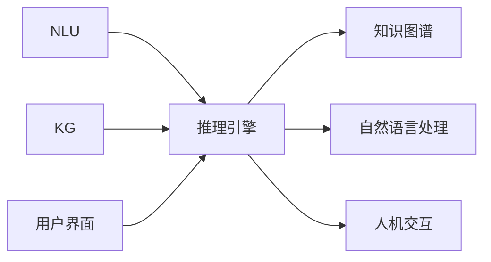

                 

## 1. 背景介绍

### 1.1 问题由来

随着人工智能（AI）技术的迅速发展，人机协作（Human-Machine Collaboration）正在成为推动各行各业创新和变革的关键驱动力。无论是制造业的自动化生产线，还是金融行业的智能投顾，亦或是医疗行业的智能诊断，人机协作都已经渗透到各个领域。然而，如何有效地协同人类智慧与AI能力，实现无缝衔接、高效协同，是一个充满挑战的问题。

人工智能技术的迅速发展，尤其是自然语言处理（NLP）和机器学习的突破，为人机协作提供了新的工具和平台。通过构建智能系统，人类可以将复杂的决策、策略等交由AI处理，自己专注于创造性、情感性和高层次的决策。这种人机协作模式，不仅能够提升工作效率，还能释放人类潜力，推动社会进步。

### 1.2 问题核心关键点

人机协作的核心在于构建一个智能化的系统，该系统能够理解人类的指令和需求，提供精准的决策和建议。这种系统通常包括以下关键组件：

- **自然语言理解（NLU）**：解析人类输入的文本，理解其中的意图和语义。
- **知识图谱**：构建领域知识库，存储和检索相关领域的知识和信息。
- **推理引擎**：根据输入数据和知识图谱，进行逻辑推理和决策分析。
- **用户界面（UI）**：提供友好的人机交互界面，方便用户输入和查看结果。
- **机器学习模型**：基于大规模数据训练的模型，用于理解和生成自然语言。

这些组件相互协作，共同构成一个智能化的系统，实现高效的人机协作。然而，构建这样一个系统并非易事，需要跨学科的知识和技能。

### 1.3 问题研究意义

人机协作的研究对于提升人类工作和生活质量，推动科技进步和社会发展具有重要意义：

- **提升效率**：人机协作可以处理大量重复性、低价值的任务，让人类专注于更具创造性的工作。
- **优化决策**：AI能够基于大量数据和历史经验，提供更准确、更快速的决策支持。
- **增强学习**：人机协作系统能够不断学习和改进，提供更精准的预测和建议。
- **促进创新**：通过AI的辅助，人类能够更快速地进行实验和验证，推动新想法和新技术的落地。

## 2. 核心概念与联系

### 2.1 核心概念概述

为更好地理解人机协作系统，本节将介绍几个密切相关的核心概念：

- **自然语言处理（NLP）**：研究计算机如何理解和处理人类语言的技术，包括文本分析、情感分析、机器翻译等。
- **知识图谱（KG）**：构建领域知识库，存储实体、关系和属性，用于推理和检索。
- **机器学习（ML）**：通过数据训练模型，使机器能够自主学习和改进。
- **推理引擎**：根据知识图谱和用户输入，进行逻辑推理和决策分析。
- **人机交互（HMI）**：提供友好的用户界面，方便用户与系统进行交互。

这些核心概念之间存在着紧密的联系，相互支撑，共同构建了人机协作系统的基础架构。

### 2.2 核心概念原理和架构的 Mermaid 流程图



这个流程图展示了人机协作系统的核心组件和工作流程：

1. 用户通过人机交互界面输入问题或指令。
2. 自然语言处理组件解析输入文本，理解其中的意图和语义。
3. 推理引擎根据输入和知识图谱进行逻辑推理，生成结果。
4. 结果通过自然语言处理组件生成回复，并通过人机交互界面输出。

### 2.3 核心概念之间的关系

这些核心概念之间的相互关系如下：

- **NLP**：解析和理解用户输入的文本，是人机交互的基础。
- **KG**：存储和检索领域知识，为推理引擎提供支持。
- **ML**：通过数据训练模型，提升推理引擎的准确性和泛化能力。
- **推理引擎**：基于NLP和KG，进行逻辑推理和决策分析，是系统的核心。
- **人机交互**：提供友好的用户界面，方便用户输入和查看结果，提升用户体验。

## 3. 核心算法原理 & 具体操作步骤

### 3.1 算法原理概述

人机协作系统的核心算法原理包括自然语言理解（NLU）、知识图谱构建和推理引擎设计。这些算法共同作用，实现高效的人机交互和决策支持。

- **NLU算法**：解析和理解用户输入的文本，提取其中的意图和实体。
- **知识图谱构建算法**：构建领域知识库，存储和检索相关知识和信息。
- **推理引擎算法**：基于知识图谱和用户输入，进行逻辑推理和决策分析。

### 3.2 算法步骤详解

人机协作系统的算法步骤如下：

1. **数据预处理**：收集和清洗领域相关的数据，准备用于模型训练和知识图谱构建。
2. **自然语言理解（NLU）**：使用自然语言处理技术解析用户输入的文本，理解其中的意图和语义。
3. **知识图谱构建**：构建领域知识库，存储和检索相关知识和信息。
4. **推理引擎设计**：设计推理引擎，基于知识图谱和用户输入，进行逻辑推理和决策分析。
5. **人机交互设计**：设计友好的用户界面，方便用户输入和查看结果。

### 3.3 算法优缺点

人机协作系统的算法优点包括：

- **高效性**：自动化处理大量重复性、低价值的任务，提升效率。
- **准确性**：基于大量数据训练的模型，提供精准的决策和建议。
- **灵活性**：能够不断学习和改进，适应新任务和新数据。

然而，这些算法也存在一些缺点：

- **数据依赖性**：需要大量的标注数据和高质量的知识库，成本较高。
- **复杂性**：构建和维护复杂的人机协作系统需要跨学科知识和技能。
- **安全性**：需要确保系统的安全性和隐私保护，避免数据泄露和滥用。

### 3.4 算法应用领域

人机协作系统的算法广泛应用于以下领域：

- **智能客服**：构建智能客服系统，处理用户咨询，提供快速、准确的回复。
- **智能投顾**：设计智能投顾系统，提供个性化的投资建议和策略。
- **智能医疗**：开发智能医疗系统，辅助医生进行诊断和治疗决策。
- **智能制造**：构建智能制造系统，实现生产过程的自动化和优化。
- **智能交通**：设计智能交通系统，提升交通管理效率和安全性。

## 4. 数学模型和公式 & 详细讲解 & 举例说明

### 4.1 数学模型构建

人机协作系统的数学模型主要包括以下几个部分：

- **NLU模型**：解析和理解用户输入的文本，提取其中的意图和实体。
- **知识图谱模型**：存储和检索领域知识，表示实体、关系和属性。
- **推理引擎模型**：基于知识图谱和用户输入，进行逻辑推理和决策分析。

### 4.2 公式推导过程

以下是人机协作系统的核心数学模型和公式推导过程：

**NLU模型**：

假设用户输入的文本为 $x$，意图为 $y$。NLU模型的目标是找到最优的参数 $\theta$，使得模型输出 $f_\theta(x)$ 与真实意图 $y$ 的差距最小。

$$
\min_{\theta} \mathcal{L}(f_\theta(x), y)
$$

**知识图谱模型**：

知识图谱由节点（实体和属性）和边（关系）构成。假设知识图谱中的节点为 $n$，边为 $e$，节点关系为 $r$。知识图谱模型的目标是找到最优的参数 $\theta$，使得模型输出 $g_\theta(n,e,r)$ 与真实知识图谱的差距最小。

$$
\min_{\theta} \mathcal{L}(g_\theta(n,e,r), \text{KG})
$$

**推理引擎模型**：

推理引擎的目标是根据知识图谱和用户输入，生成结果 $z$。假设推理引擎的输入为 $x$ 和 $\text{KG}$，输出为 $z$。推理引擎模型的目标是找到最优的参数 $\theta$，使得模型输出 $h_\theta(x, \text{KG})$ 与真实结果 $z$ 的差距最小。

$$
\min_{\theta} \mathcal{L}(h_\theta(x, \text{KG}), z)
$$

### 4.3 案例分析与讲解

以下是一个简单的案例分析：

假设一个智能客服系统需要理解用户输入的文本，并根据用户的意图提供相应的回答。

- **NLU模型**：使用BERT模型解析用户输入的文本，提取其中的意图和实体。
- **知识图谱模型**：构建包含常见问题和答案的知识图谱，存储和检索相关信息。
- **推理引擎模型**：根据用户的意图和知识图谱，生成相应的回答。

具体实现如下：

**NLU模型**：

使用BERT模型解析用户输入的文本，提取其中的意图和实体。

```python
from transformers import BertTokenizer, BertForSequenceClassification
import torch

tokenizer = BertTokenizer.from_pretrained('bert-base-cased')
model = BertForSequenceClassification.from_pretrained('bert-base-cased', num_labels=2)

input_text = "What is the weather like today?"
input_ids = tokenizer.encode(input_text, add_special_tokens=True)
labels = torch.tensor([0])
outputs = model(input_ids)
```

**知识图谱模型**：

构建包含常见问题和答案的知识图谱，存储和检索相关信息。

```python
# 假设已经构建好知识图谱，包含以下节点和边
nodes = ['weather', 'temperature', 'city']
edges = [('weather', 'temperature'), ('weather', 'city')]
kg = {node: {'attributes': {'name': name}, 'relationships': []} for node, name in zip(nodes, nodes)}
kg['weather']['relationships'].append(('to', 'temperature'))
kg['weather']['relationships'].append(('to', 'city'))

# 存储知识图谱到文件
with open('knowledge_graph.json', 'w') as f:
    json.dump(kg, f)
```

**推理引擎模型**：

根据用户的意图和知识图谱，生成相应的回答。

```python
# 假设已经构建好推理引擎，能够根据用户意图和知识图谱生成回答
def get_answer(input_text):
    intent, entity = extract_intent_entity(input_text)
    kg_path = 'knowledge_graph.json'
    with open(kg_path, 'r') as f:
        kg = json.load(f)
    result = None
    if intent == 'weather':
        temperature = kg['weather']['temperature'][0]['attributes']['value']
        city = kg['weather']['city'][0]['attributes']['value']
        result = f"The temperature in {city} is {temperature}."
    return result
```

通过上述步骤，可以实现一个简单的智能客服系统，用户输入文本后，系统能够理解用户的意图，并根据知识图谱提供相应的回答。

## 5. 项目实践：代码实例和详细解释说明

### 5.1 开发环境搭建

在进行人机协作系统的开发前，我们需要准备好开发环境。以下是使用Python进行开发的环境配置流程：

1. 安装Anaconda：从官网下载并安装Anaconda，用于创建独立的Python环境。

2. 创建并激活虚拟环境：
```bash
conda create -n collaborations python=3.8 
conda activate collaborations
```

3. 安装相关库：
```bash
conda install numpy pandas scikit-learn transformers
```

4. 安装TensorFlow和PyTorch：
```bash
conda install tensorflow-gpu==2.3 pytorch==1.8
```

5. 安装相关工具包：
```bash
pip install torchvision torchaudio nltk
```

完成上述步骤后，即可在`collaborations`环境中开始开发实践。

### 5.2 源代码详细实现

下面以智能客服系统为例，给出使用TensorFlow和PyTorch进行开发的PyTorch代码实现。

首先，定义自然语言理解（NLU）组件：

```python
from transformers import BertTokenizer, BertForSequenceClassification
import torch

tokenizer = BertTokenizer.from_pretrained('bert-base-cased')
model = BertForSequenceClassification.from_pretrained('bert-base-cased', num_labels=2)

def extract_intent_entity(input_text):
    input_ids = tokenizer.encode(input_text, add_special_tokens=True)
    labels = torch.tensor([0])
    outputs = model(input_ids, labels)
    intent = outputs.logits.argmax().item()
    entity = None
    if intent == 0:
        entity = tokenizer.decode(input_ids[1:-1])
    return intent, entity
```

然后，定义知识图谱组件：

```python
# 假设已经构建好知识图谱，包含以下节点和边
nodes = ['weather', 'temperature', 'city']
edges = [('weather', 'temperature'), ('weather', 'city')]
kg = {node: {'attributes': {'name': name}, 'relationships': []} for node, name in zip(nodes, nodes)}
kg['weather']['relationships'].append(('to', 'temperature'))
kg['weather']['relationships'].append(('to', 'city'))

# 存储知识图谱到文件
with open('knowledge_graph.json', 'w') as f:
    json.dump(kg, f)
```

接着，定义推理引擎组件：

```python
import json

# 假设已经构建好推理引擎，能够根据用户意图和知识图谱生成回答
def get_answer(input_text):
    intent, entity = extract_intent_entity(input_text)
    kg_path = 'knowledge_graph.json'
    with open(kg_path, 'r') as f:
        kg = json.load(f)
    result = None
    if intent == 'weather':
        temperature = kg['weather']['temperature'][0]['attributes']['value']
        city = kg['weather']['city'][0]['attributes']['value']
        result = f"The temperature in {city} is {temperature}."
    return result
```

最后，启动智能客服系统的流程：

```python
while True:
    input_text = input("What is your question? ")
    answer = get_answer(input_text)
    print(answer)
```

### 5.3 代码解读与分析

让我们再详细解读一下关键代码的实现细节：

**NLU组件**：
- 使用BERT模型解析用户输入的文本，提取其中的意图和实体。
- `extract_intent_entity`函数：使用模型预测意图和实体，返回结果。

**知识图谱组件**：
- 构建包含常见问题和答案的知识图谱，存储和检索相关信息。
- `kg`字典：存储节点和边。

**推理引擎组件**：
- 根据用户的意图和知识图谱，生成相应的回答。
- `get_answer`函数：根据意图和知识图谱生成回答。

**主程序**：
- 循环获取用户输入，调用`get_answer`函数生成回答，并输出。

可以看出，通过这些组件的协同工作，可以实现一个基本的智能客服系统。开发者可以根据具体需求，进一步优化和扩展这些组件。

## 6. 实际应用场景

### 6.1 智能客服系统

智能客服系统是人机协作的典型应用场景之一。传统客服往往需要配备大量人力，高峰期响应缓慢，且一致性和专业性难以保证。而使用智能客服系统，可以7x24小时不间断服务，快速响应客户咨询，用自然流畅的语言解答各类常见问题。

在技术实现上，可以收集企业内部的历史客服对话记录，将问题和最佳答复构建成监督数据，在此基础上对预训练模型进行微调。微调后的对话模型能够自动理解用户意图，匹配最合适的答案模板进行回复。对于客户提出的新问题，还可以接入检索系统实时搜索相关内容，动态组织生成回答。如此构建的智能客服系统，能大幅提升客户咨询体验和问题解决效率。

### 6.2 智能投顾

智能投顾系统是金融领域人机协作的重要应用。传统投顾需要耗费大量时间和精力进行研究和分析，且难以覆盖所有的市场和行业。而智能投顾系统能够基于历史数据和市场动态，提供精准的投资建议和策略。

在技术实现上，可以构建包含市场数据、公司财务数据、新闻事件等信息的知识图谱，并设计推理引擎进行逻辑推理和决策分析。智能投顾系统可以根据用户输入的股票代码、行业等，自动提供相关投资建议和风险评估。同时，系统还能实时监控市场动态，及时调整投资策略，确保用户资产的安全和增值。

### 6.3 智能医疗

智能医疗系统是人机协作在医疗领域的典型应用。传统医疗诊断需要医生根据大量的医学知识和经验进行判断，且难以全面覆盖所有的疾病和症状。而智能医疗系统能够基于大量医疗数据和临床知识，提供精准的诊断和治疗建议。

在技术实现上，可以构建包含疾病、症状、药物等信息的知识图谱，并设计推理引擎进行逻辑推理和决策分析。智能医疗系统可以根据用户输入的症状和历史数据，自动推荐可能的疾病和治疗方法，并提供个性化的治疗方案。同时，系统还能实时监控用户的健康状况，及时提供健康建议和预警。

### 6.4 未来应用展望

随着人机协作技术的不断进步，未来将有更多领域受益于智能系统的构建和应用。

在智慧城市治理中，智能交通、智能安防、智能环保等系统将提升城市的智能化水平，构建更安全、高效、可持续的未来城市。

在智能制造领域，智能制造系统将实现生产过程的自动化和优化，提升生产效率和产品质量。

在智能教育领域，智能教学系统将根据学生的学习情况，提供个性化的学习资源和指导，提升教育质量和公平性。

此外，在医疗、金融、智能家居等更多领域，智能系统的应用也将不断拓展，为人类生活带来更多便利和改善。

## 7. 工具和资源推荐

### 7.1 学习资源推荐

为了帮助开发者系统掌握人机协作系统的开发，这里推荐一些优质的学习资源：

1. 《深度学习》（Ian Goodfellow）：全面介绍深度学习理论和方法的经典教材，适合初学者和进阶者。
2. 《自然语言处理综论》（Daniel Jurafsky & James H. Martin）：详细介绍自然语言处理技术和应用的权威书籍。
3. 《知识图谱构建与查询》（Bianpeng Ma）：介绍知识图谱构建、存储和查询的全面教材。
4. 《TensorFlow实战》（Emina Toroker）：详解TensorFlow框架的使用方法和实践案例。
5. 《PyTorch深度学习编程》（Eric Torr）：介绍PyTorch框架的使用方法和实践案例。

通过对这些资源的学习实践，相信你一定能够快速掌握人机协作系统的开发技巧，并用于解决实际的业务问题。

### 7.2 开发工具推荐

高效的开发离不开优秀的工具支持。以下是几款用于人机协作系统开发的工具：

1. TensorFlow：由Google主导开发的开源深度学习框架，生产部署方便，适合大规模工程应用。
2. PyTorch：基于Python的开源深度学习框架，灵活动态的计算图，适合快速迭代研究。
3. Elasticsearch：开源的搜索和分析引擎，适合存储和检索大规模文本数据。
4. Spark：Apache基金会开源的大数据处理框架，适合处理海量数据。
5. TensorBoard：TensorFlow配套的可视化工具，可实时监测模型训练状态，并提供丰富的图表呈现方式。

合理利用这些工具，可以显著提升人机协作系统的开发效率，加快创新迭代的步伐。

### 7.3 相关论文推荐

人机协作技术的发展源于学界的持续研究。以下是几篇奠基性的相关论文，推荐阅读：

1. "Attention is All You Need"（NeurIPS 2017）：提出Transformer结构，开启了NLP领域的预训练大模型时代。
2. "BERT: Pre-training of Deep Bidirectional Transformers for Language Understanding"（NIPS 2018）：提出BERT模型，引入基于掩码的自监督预训练任务，刷新了多项NLP任务SOTA。
3. "Knowledge Graph Embeddings"（KDD 2017）：提出知识图谱嵌入技术，将知识图谱与自然语言处理结合，提升推理能力。
4. "Adversarial Machine Learning"（ICML 2017）：介绍对抗机器学习的思想，增强模型的鲁棒性和安全性。
5. "Human-Machine Collaboration: Towards Collaborative Intelligence"（IEEE 2021）：系统综述人机协作技术的研究现状和未来方向。

这些论文代表了大语言模型微调技术的发展脉络。通过学习这些前沿成果，可以帮助研究者把握学科前进方向，激发更多的创新灵感。

## 8. 总结：未来发展趋势与挑战

### 8.1 研究成果总结

人机协作技术的发展已经取得了显著的成果，主要体现在以下几个方面：

- **技术成熟**：自然语言处理、知识图谱构建、推理引擎设计等关键技术已经相对成熟，能够构建高效的人机协作系统。
- **应用广泛**：智能客服、智能投顾、智能医疗等多个领域的应用已经得到验证，取得了良好的效果。
- **效果显著**：人机协作系统能够显著提升工作效率和决策准确性，推动各行业的创新和进步。

### 8.2 未来发展趋势

展望未来，人机协作技术将呈现以下几个发展趋势：

1. **技术融合**：未来人机协作技术将与其他人工智能技术进行更深层次的融合，如知识表示、因果推理、强化学习等，形成更加全面、精准的智能系统。
2. **应用拓展**：人机协作技术将应用到更多领域，如智能制造、智慧城市、智能家居等，带来更多的创新和便利。
3. **智能化提升**：通过深度学习和自然语言处理技术，人机协作系统将具备更强的理解和生成能力，提供更优质的服务。
4. **安全与隐私保护**：随着应用场景的增加，系统的安全性与隐私保护将成为重要议题，需要引入区块链、加密等技术进行保障。
5. **跨文化支持**：未来人机协作系统将支持多语言和多文化，提供全球化的智能服务。

### 8.3 面临的挑战

尽管人机协作技术已经取得了显著成果，但在应用推广的过程中，仍面临诸多挑战：

1. **数据隐私**：如何保护用户隐私，避免数据泄露和滥用，是一个重要的挑战。
2. **安全漏洞**：系统的安全性和鲁棒性需要进一步提升，避免被攻击和滥用。
3. **模型透明性**：人机协作系统的决策过程需要具备更高的透明性和可解释性，方便用户理解和调试。
4. **泛化能力**：系统需要具备更强的泛化能力，能够适应新任务和新数据。
5. **跨领域适应**：不同领域的应用场景各不相同，人机协作系统需要具备跨领域适应能力。

### 8.4 研究展望

为了应对这些挑战，未来需要从以下几个方面进行研究：

1. **数据隐私保护**：引入区块链、加密等技术，保护用户隐私和数据安全。
2. **安全漏洞防护**：设计更加鲁棒的模型和算法，避免被攻击和滥用。
3. **模型透明性提升**：引入可解释性技术，提高系统的透明性和可解释性。
4. **泛化能力增强**：通过迁移学习和多任务学习等方法，提升系统的泛化能力。
5. **跨领域适应性改进**：设计更加灵活的模型和算法，提升系统的跨领域适应能力。

总之，人机协作技术的研究方向需要更加多元化，综合考虑技术、应用、伦理和安全等多方面因素，方能在未来取得更大的突破。相信在学界和产业界的共同努力下，人机协作技术必将在构建智能未来新世界中发挥重要作用。

---

作者：禅与计算机程序设计艺术 / Zen and the Art of Computer Programming

