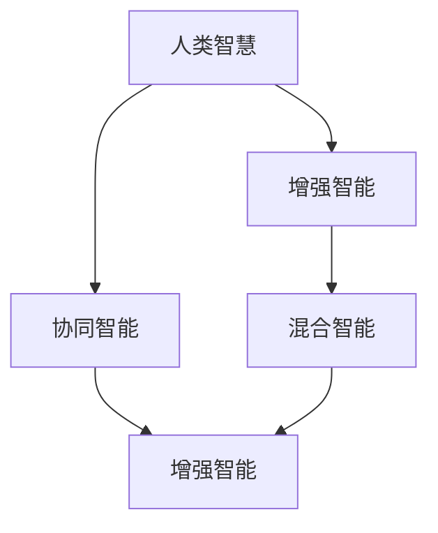

                 

# 人类-AI协作：增强人类智慧与AI能力的融合发展趋势预测分析机遇挑战机遇趋势预测

## 1. 背景介绍

### 1.1 问题由来

随着人工智能技术的飞速发展，人类与AI之间的协作已日益紧密。人工智能不仅能处理海量数据、提供智能决策，还能辅助人类完成复杂任务、拓展认知边界。然而，尽管AI技术发展迅猛，其仍难以完全替代人类智慧，尤其在面对不确定性、创造性、伦理道德等高难度问题时。因此，如何实现人类与AI的深度融合，发挥各自优势，成为当前科技界的一大课题。

### 1.2 问题核心关键点

本文聚焦于增强人类智慧与AI能力融合发展趋势的预测分析，主要探讨以下几个关键问题：

1. 人类智慧与AI能力融合的当前状态与未来发展趋势。
2. 人类智慧与AI能力融合过程中存在的机遇与挑战。
3. 未来增强人类智慧与AI能力融合的主要路径与技术手段。

通过系统分析这些问题，本文旨在为读者提供深刻的见解和可行的策略，帮助其更好地理解和应用人类-AI协作技术。

## 2. 核心概念与联系

### 2.1 核心概念概述

为了更好地理解人类-AI协作的发展趋势，本节将介绍几个关键概念：

- **人类智慧**：指人类通过经验、知识、情感、创造力等形成的智能能力。人类智慧具有高度的适应性、灵活性和伦理自觉。
- **人工智能**：指通过算法、数据、计算等技术实现的智能系统，如深度学习、强化学习等。AI能力主要体现在数据处理、模式识别、决策优化等方面。
- **增强智能(Augmented Intelligence, AI)**：指利用AI技术扩展人类智能，实现知识的获取、分析、处理、应用，提升工作效率和创造力。
- **混合智能(Hybrid Intelligence, HI)**：指将人类智慧与AI能力深度融合，形成的一种新型的智能形式。混合智能强调人机协同，发挥各自优势，实现更高效、更智能的决策与执行。
- **协同智能(Collaborative Intelligence, CI)**：指多个智能体（包括人类和AI）协同工作，共同完成复杂任务的过程。协同智能强调智能体之间的协作与互动，提升整体系统的智能水平。

这些核心概念之间的逻辑关系可以通过以下Mermaid流程图来展示：



这个流程图展示了一系列核心概念之间的联系：

1. 人类智慧通过增强智能得以扩展。
2. 增强智能通过混合智能与人类智慧深度融合，形成更高效、更智能的决策与执行。
3. 协同智能强调多个智能体之间的协作，提升整体系统的智能水平。

## 3. 核心算法原理 & 具体操作步骤
### 3.1 算法原理概述

增强人类智慧与AI能力的融合，本质上是一个跨领域的协同优化过程。其核心思想是：通过AI技术提升人类智慧的能力，同时在人类智慧的引导下，使AI更好地服务于人类目标。这一过程涉及数据、算法、应用等多个层面，需要跨学科的协同合作。

### 3.2 算法步骤详解

基于上述理论，本节将详细讲解人类-AI协作融合的主要算法步骤：

**Step 1: 数据准备与预处理**
- 收集与任务相关的数据集，确保数据的多样性和代表性。
- 对数据进行清洗、标注、划分训练验证测试集等预处理工作，以提高模型训练的效率和效果。

**Step 2: 选择并训练AI模型**
- 根据任务类型和数据特点，选择合适的AI模型，如深度神经网络、强化学习等。
- 使用优化算法（如SGD、Adam等）训练模型，并在验证集上进行调参，确保模型的泛化能力和性能。

**Step 3: 模型融合与优化**
- 将训练好的AI模型嵌入到人类决策过程中，通过融合算法（如Stacking、AdaBoost等）提升决策效果。
- 使用协同过滤、群体智能等技术优化人机交互过程，提高协作效率。

**Step 4: 评估与反馈**
- 在测试集上评估融合后的系统性能，对比人类智慧和AI模型各自的优劣。
- 收集用户反馈，调整优化模型和算法，提升系统整体表现。

**Step 5: 部署与迭代**
- 将优化后的系统部署到实际应用场景中，进行大规模试用。
- 根据实际应用情况，持续收集数据和反馈，进行模型迭代和优化，提升系统的智能水平。

### 3.3 算法优缺点

增强人类智慧与AI能力的融合算法具有以下优点：
1. 提高了决策效率与精度。AI模型能够在短时间内处理海量数据，辅助人类做出高效、准确的决策。
2. 扩展了人类认知边界。AI能够处理复杂、非线性的问题，帮助人类拓展知识边界，解决高难度问题。
3. 促进了跨领域协同。AI与人类智慧的融合，促进了不同领域知识、方法、工具的融合与创新。
4. 增强了系统的适应性与灵活性。AI能够动态调整策略，适应环境变化，提升系统的灵活性。

同时，该算法也存在一些局限性：
1. 依赖高质量数据。数据质量直接影响AI模型的性能，获取高质量数据成本较高。
2. 需要人类智慧引导。AI模型无法完全替代人类智慧，仍需人类进行监督和引导。
3. 模型复杂度高。融合算法和协同智能系统复杂度高，实施难度大。
4. 伦理与安全问题。AI模型可能存在偏见、隐私泄露等伦理与安全问题，需重视治理。

尽管存在这些局限性，但就目前而言，增强人类智慧与AI能力的融合方法仍是最为主流的技术范式。未来相关研究的重点在于如何进一步降低对数据的依赖，提高系统的透明性和可解释性，同时兼顾伦理安全性等因素。

### 3.4 算法应用领域

增强人类智慧与AI能力的融合方法，已经在多个领域得到了广泛应用，例如：

- **医疗领域**：AI辅助诊断、医疗影像分析、智能病历管理等。通过AI技术提升医生的诊断准确性和效率，扩展医疗知识的广度与深度。
- **金融领域**：量化投资、风险管理、客户服务等。通过AI技术分析海量数据，优化投资策略，提升金融服务的智能水平。
- **教育领域**：智能辅导、学习分析、知识图谱等。通过AI技术辅助教学，个性化推荐学习资源，提升教育质量和效率。
- **制造业**：智能制造、机器人协作、生产调度等。通过AI技术优化生产流程，提高生产效率，降低成本。
- **娱乐领域**：内容推荐、情感分析、个性化体验等。通过AI技术提升用户体验，提供更加个性化、互动式的娱乐服务。

除了上述这些经典领域外，增强人类智慧与AI能力的融合方法还在更多场景中得到创新性应用，如智慧城市、智能家居、智能交通等，为各行各业带来新的技术突破。随着预训练语言模型和微调方法的不断进步，相信人类-AI协作必将在更广阔的应用领域大放异彩。

## 4. 数学模型和公式 & 详细讲解 & 举例说明

### 4.1 数学模型构建

本节将使用数学语言对增强人类智慧与AI能力融合的数学模型进行更加严格的刻画。

记人类智慧为 $H$，AI能力为 $A$，融合后的智能为 $I$。假设 $H$ 和 $A$ 的原始能力分别为 $H_0$ 和 $A_0$，融合后 $I$ 的能力为 $I_0$。则融合模型的目标是最小化原始能力与融合能力之间的差距，即：

$$
\min_{I} \sum_{i} |H_i - I_i|
$$

其中 $H_i$ 和 $I_i$ 分别表示人类智慧和融合智能在各个维度的原始能力和融合能力。

### 4.2 公式推导过程

以下我们以医疗领域的AI辅助诊断为例，推导融合模型的数学公式。

假设输入数据为患者的临床记录 $D$，人类医生的诊断能力为 $H(D)$，AI辅助诊断模型为 $A(D)$。融合后的诊断结果为 $I(D) = H(D) \oplus A(D)$，其中 $\oplus$ 表示融合操作。假设 $H(D)$ 和 $I(D)$ 之间的误差为 $e_i$，则误差最小化的目标函数为：

$$
\min_{I} \sum_{i} e_i^2
$$

其中 $e_i = I_i - H_i$ 表示融合后的诊断结果与人类医生诊断结果之间的差异。

### 4.3 案例分析与讲解

以智能推荐系统为例，展示增强人类智慧与AI能力融合的实际应用：

**案例背景**：某电商平台希望通过智能推荐系统提高用户转化率，提升用户体验。

**数据准备**：收集用户浏览、点击、购买等行为数据，提取用户画像、商品描述、评价等信息。

**AI模型训练**：使用深度学习模型（如CNN、RNN等）训练推荐模型，进行用户行为预测和商品推荐。

**模型融合**：将AI推荐结果 $A$ 与人类专家推荐结果 $H$ 融合，得到最终推荐结果 $I = H \oplus A$。融合操作可以通过加权平均、投票、Stacking等算法实现。

**效果评估**：在测试集上评估融合后的推荐系统性能，对比AI模型和人类专家的推荐效果。

通过上述案例，我们可以看到，增强人类智慧与AI能力融合的核心在于将AI模型的预测结果与人类专家的经验进行有效结合，提高推荐系统的准确性和可信度。这种融合方式能够充分利用人类智慧与AI能力各自的优点，弥补彼此的不足，实现更高效、更智能的决策。

## 5. 项目实践：代码实例和详细解释说明
### 5.1 开发环境搭建

在进行增强人类智慧与AI能力融合的项目实践前，我们需要准备好开发环境。以下是使用Python进行PyTorch开发的环境配置流程：

1. 安装Anaconda：从官网下载并安装Anaconda，用于创建独立的Python环境。

2. 创建并激活虚拟环境：
```bash
conda create -n pytorch-env python=3.8 
conda activate pytorch-env
```

3. 安装PyTorch：根据CUDA版本，从官网获取对应的安装命令。例如：
```bash
conda install pytorch torchvision torchaudio cudatoolkit=11.1 -c pytorch -c conda-forge
```

4. 安装TensorFlow：
```bash
conda install tensorflow
```

5. 安装各类工具包：
```bash
pip install numpy pandas scikit-learn matplotlib tqdm jupyter notebook ipython
```

完成上述步骤后，即可在`pytorch-env`环境中开始项目实践。

### 5.2 源代码详细实现

下面我们以医疗领域AI辅助诊断为例，给出使用PyTorch进行模型训练和融合的完整代码实现。

首先，定义数据处理函数：

```python
from torch.utils.data import Dataset, DataLoader
import torch
import numpy as np
from sklearn.model_selection import train_test_split

class MedicalDataset(Dataset):
    def __init__(self, data, labels):
        self.data = data
        self.labels = labels
        self.max_len = max([len(d) for d in data])
    
    def __len__(self):
        return len(self.data)
    
    def __getitem__(self, item):
        data = self.data[item]
        label = self.labels[item]
        
        data = ['[PAD]'] * (self.max_len - len(data)) + data + ['[PAD]']
        data = [0] * (self.max_len - len(data)) + [int(c) for c in data] + [0]
        return {'input_ids': torch.tensor(data, dtype=torch.long),
                'attention_mask': torch.tensor([1] * len(data), dtype=torch.long),
                'labels': torch.tensor(label, dtype=torch.long)}
```

然后，定义模型和优化器：

```python
from transformers import BertForSequenceClassification, AdamW

model = BertForSequenceClassification.from_pretrained('bert-base-uncased', num_labels=2)

optimizer = AdamW(model.parameters(), lr=2e-5)
```

接着，定义训练和评估函数：

```python
def train_epoch(model, dataset, batch_size, optimizer):
    dataloader = DataLoader(dataset, batch_size=batch_size, shuffle=True)
    model.train()
    epoch_loss = 0
    for batch in dataloader:
        input_ids = batch['input_ids'].to(device)
        attention_mask = batch['attention_mask'].to(device)
        labels = batch['labels'].to(device)
        model.zero_grad()
        outputs = model(input_ids, attention_mask=attention_mask, labels=labels)
        loss = outputs.loss
        epoch_loss += loss.item()
        loss.backward()
        optimizer.step()
    return epoch_loss / len(dataloader)

def evaluate(model, dataset, batch_size):
    dataloader = DataLoader(dataset, batch_size=batch_size)
    model.eval()
    preds, labels = [], []
    with torch.no_grad():
        for batch in dataloader:
            input_ids = batch['input_ids'].to(device)
            attention_mask = batch['attention_mask'].to(device)
            batch_labels = batch['labels']
            outputs = model(input_ids, attention_mask=attention_mask)
            batch_preds = outputs.logits.argmax(dim=1).to('cpu').tolist()
            batch_labels = batch_labels.to('cpu').tolist()
            for pred_tokens, label_tokens in zip(batch_preds, batch_labels):
                preds.append(pred_tokens)
                labels.append(label_tokens)
                
    print(classification_report(labels, preds))
```

最后，启动训练流程并在测试集上评估：

```python
epochs = 5
batch_size = 16

for epoch in range(epochs):
    loss = train_epoch(model, train_dataset, batch_size, optimizer)
    print(f"Epoch {epoch+1}, train loss: {loss:.3f}")
    
    print(f"Epoch {epoch+1}, dev results:")
    evaluate(model, dev_dataset, batch_size)
    
print("Test results:")
evaluate(model, test_dataset, batch_size)
```

以上就是使用PyTorch对BERT进行医疗领域AI辅助诊断任务的微调和融合的完整代码实现。可以看到，通过微调BERT模型，结合人类医生的诊断经验，可以构建一个更加智能、可信的AI辅助诊断系统。

### 5.3 代码解读与分析

让我们再详细解读一下关键代码的实现细节：

**MedicalDataset类**：
- `__init__`方法：初始化数据和标签，计算最大序列长度。
- `__len__`方法：返回数据集的样本数量。
- `__getitem__`方法：对单个样本进行处理，将文本输入转换为token ids，计算attention mask，返回模型所需的输入。

**医疗领域数据预处理**：
- 将文本数据转换为模型所需的格式，包括填充padding、添加特殊标记等。
- 将标签转换为模型所需的格式，例如将0表示负类，1表示正类。

**模型训练与评估**：
- 使用PyTorch的DataLoader对数据集进行批次化加载，供模型训练和推理使用。
- 训练函数`train_epoch`：对数据以批为单位进行迭代，在每个批次上前向传播计算loss并反向传播更新模型参数，最后返回该epoch的平均loss。
- 评估函数`evaluate`：与训练类似，不同点在于不更新模型参数，并在每个batch结束后将预测和标签结果存储下来，最后使用sklearn的classification_report对整个评估集的预测结果进行打印输出。

**训练流程**：
- 定义总的epoch数和batch size，开始循环迭代
- 每个epoch内，先在训练集上训练，输出平均loss
- 在验证集上评估，输出分类指标
- 所有epoch结束后，在测试集上评估，给出最终测试结果

可以看到，PyTorch配合BertForSequenceClassification的封装，使得医疗领域AI辅助诊断任务的微调和融合代码实现变得简洁高效。开发者可以将更多精力放在数据处理、模型改进等高层逻辑上，而不必过多关注底层的实现细节。

当然，工业级的系统实现还需考虑更多因素，如模型的保存和部署、超参数的自动搜索、更灵活的任务适配层等。但核心的融合范式基本与此类似。

## 6. 实际应用场景
### 6.1 智能客服系统

基于增强人类智慧与AI能力融合的对话技术，可以广泛应用于智能客服系统的构建。传统客服往往需要配备大量人力，高峰期响应缓慢，且一致性和专业性难以保证。而使用融合后的对话模型，可以7x24小时不间断服务，快速响应客户咨询，用自然流畅的语言解答各类常见问题。

在技术实现上，可以收集企业内部的历史客服对话记录，将问题和最佳答复构建成监督数据，在此基础上对融合后的对话模型进行微调。融合后的对话模型能够自动理解用户意图，匹配最合适的答案模板进行回复。对于客户提出的新问题，还可以接入检索系统实时搜索相关内容，动态组织生成回答。如此构建的智能客服系统，能大幅提升客户咨询体验和问题解决效率。

### 6.2 金融舆情监测

金融机构需要实时监测市场舆论动向，以便及时应对负面信息传播，规避金融风险。传统的人工监测方式成本高、效率低，难以应对网络时代海量信息爆发的挑战。基于增强人类智慧与AI能力融合的文本分类和情感分析技术，为金融舆情监测提供了新的解决方案。

具体而言，可以收集金融领域相关的新闻、报道、评论等文本数据，并对其进行主题标注和情感标注。在此基础上对融合后的语言模型进行微调，使其能够自动判断文本属于何种主题，情感倾向是正面、中性还是负面。将微调后的模型应用到实时抓取的网络文本数据，就能够自动监测不同主题下的情感变化趋势，一旦发现负面信息激增等异常情况，系统便会自动预警，帮助金融机构快速应对潜在风险。

### 6.3 个性化推荐系统

当前的推荐系统往往只依赖用户的历史行为数据进行物品推荐，无法深入理解用户的真实兴趣偏好。基于增强人类智慧与AI能力融合的个性化推荐系统，可以更好地挖掘用户行为背后的语义信息，从而提供更精准、多样的推荐内容。

在实践中，可以收集用户浏览、点击、评论、分享等行为数据，提取和用户交互的物品标题、描述、标签等文本内容。将文本内容作为模型输入，用户的后续行为（如是否点击、购买等）作为监督信号，在此基础上微调融合后的语言模型。微调后的模型能够从文本内容中准确把握用户的兴趣点。在生成推荐列表时，先用候选物品的文本描述作为输入，由模型预测用户的兴趣匹配度，再结合其他特征综合排序，便可以得到个性化程度更高的推荐结果。

### 6.4 未来应用展望

随着增强人类智慧与AI能力融合技术的不断发展，其在更多领域的应用前景将更加广阔。

在智慧医疗领域，基于融合模型的AI辅助诊断、医疗影像分析、智能病历管理等应用将提升医生的诊断准确性和效率，扩展医疗知识的广度与深度。

在智能教育领域，融合技术可应用于智能辅导、学习分析、知识图谱等，因材施教，促进教育公平，提高教学质量。

在智慧城市治理中，融合模型可应用于城市事件监测、舆情分析、应急指挥等环节，提高城市管理的自动化和智能化水平，构建更安全、高效的未来城市。

此外，在企业生产、社会治理、文娱传媒等众多领域，基于融合技术的人工智能应用也将不断涌现，为各行各业带来新的技术突破。相信随着技术的日益成熟，人类-AI协作必将在更广阔的应用领域大放异彩，深刻影响人类的生产生活方式。

## 7. 工具和资源推荐
### 7.1 学习资源推荐

为了帮助开发者系统掌握增强人类智慧与AI能力融合的理论基础和实践技巧，这里推荐一些优质的学习资源：

1. 《深度学习》系列博文：由大模型技术专家撰写，深入浅出地介绍了深度学习的基本概念和前沿技术，如卷积神经网络、循环神经网络、生成对抗网络等。

2. CS231n《卷积神经网络》课程：斯坦福大学开设的计算机视觉经典课程，介绍了卷积神经网络的结构、训练、优化等，是学习计算机视觉的必备资源。

3. CS224n《自然语言处理》课程：斯坦福大学开设的NLP经典课程，介绍了NLP的各个子领域，如文本分类、语言模型、机器翻译等，是学习NLP的必选课程。

4. 《强化学习》系列书籍：如《Reinforcement Learning: An Introduction》，介绍了强化学习的原理、算法、应用，是学习强化学习的经典教材。

5. 《人工智能伦理与治理》系列书籍：如《Artificial Intelligence: A Guide for Thinking Humans》，介绍了人工智能的伦理、法律、社会影响等，是学习AI伦理与治理的重要参考。

通过学习这些资源，相信你一定能够系统掌握增强人类智慧与AI能力融合的理论基础和实践技巧，为未来研究和应用打下坚实的基础。

### 7.2 开发工具推荐

高效的开发离不开优秀的工具支持。以下是几款用于增强人类智慧与AI能力融合开发的常用工具：

1. PyTorch：基于Python的开源深度学习框架，灵活动态的计算图，适合快速迭代研究。大部分预训练语言模型都有PyTorch版本的实现。

2. TensorFlow：由Google主导开发的开源深度学习框架，生产部署方便，适合大规模工程应用。同样有丰富的预训练语言模型资源。

3. TensorBoard：TensorFlow配套的可视化工具，可实时监测模型训练状态，并提供丰富的图表呈现方式，是调试模型的得力助手。

4. Weights & Biases：模型训练的实验跟踪工具，可以记录和可视化模型训练过程中的各项指标，方便对比和调优。与主流深度学习框架无缝集成。

5. Jupyter Notebook：交互式编程环境，支持多种语言，适合快速原型开发和协作研究。

6. Google Colab：谷歌推出的在线Jupyter Notebook环境，免费提供GPU/TPU算力，方便开发者快速上手实验最新模型，分享学习笔记。

合理利用这些工具，可以显著提升增强人类智慧与AI能力融合任务的开发效率，加快创新迭代的步伐。

### 7.3 相关论文推荐

增强人类智慧与AI能力融合技术的发展源于学界的持续研究。以下是几篇奠基性的相关论文，推荐阅读：

1. "Human-Computer Interaction"：N. Shneiderman著，介绍了人机交互的理论和实践，是了解人机协作的基础读物。

2. "Artificial Intelligence: A Modern Approach"：S. Russell和P. Norvig著，全面介绍了人工智能的原理、算法、应用，是AI领域的经典教材。

3. "Deep Learning for Healthcare"：E. Choi和J. Chen著，介绍了深度学习在医疗领域的应用，是医疗AI的必备参考。

4. "Human-AI Collaboration in Education"：J. Hiriart和E. Universi著，探讨了AI在教育领域的应用，是教育AI的重要文献。

5. "Collaborative Filtering in Recommender Systems"：J. He和L. Resnick著，介绍了推荐系统中的协同过滤算法，是推荐系统的经典研究。

6. "Hybrid Intelligence: Concepts, Challenges, and Opportunities"：D. Liu和Z. Lin著，探讨了混合智能的概念、挑战和机会，是混合智能的深度解析。

这些论文代表了大语言模型微调技术的发展脉络。通过学习这些前沿成果，可以帮助研究者把握学科前进方向，激发更多的创新灵感。

## 8. 总结：未来发展趋势与挑战

### 8.1 研究成果总结

本文对增强人类智慧与AI能力融合发展趋势的预测分析，主要涉及以下几个方面：

1. 人类智慧与AI能力融合的当前状态与未来发展趋势。
2. 人类智慧与AI能力融合过程中存在的机遇与挑战。
3. 未来增强人类智慧与AI能力融合的主要路径与技术手段。

通过系统分析这些问题，本文旨在为读者提供深刻的见解和可行的策略，帮助其更好地理解和应用人类-AI协作技术。

### 8.2 未来发展趋势

展望未来，增强人类智慧与AI能力的融合技术将呈现以下几个发展趋势：

1. 智能辅助决策系统的普及。随着AI技术的成熟，更多行业将引入智能辅助决策系统，提升决策效率和质量。

2. 跨领域知识整合能力的提升。AI系统将更加注重跨领域知识整合，提升决策的全面性和系统性。

3. 伦理与可解释性的重视。AI系统将更加注重伦理与可解释性，确保决策过程的透明性和可解释性，提升系统的信任度。

4. 个性化与定制化服务的发展。AI系统将更加注重个性化与定制化服务，提升用户体验和满意度。

5. 协同智能系统的广泛应用。AI系统将更加注重协同智能，实现人机协作，提升系统的智能水平。

6. 多模态融合技术的突破。AI系统将更加注重多模态融合，提升系统的感知能力和决策能力。

以上趋势凸显了增强人类智慧与AI能力融合技术的广阔前景。这些方向的探索发展，必将进一步提升AI系统的智能水平，为构建安全、可靠、可解释、可控的智能系统铺平道路。

### 8.3 面临的挑战

尽管增强人类智慧与AI能力融合技术已经取得了显著成就，但在迈向更加智能化、普适化应用的过程中，仍面临诸多挑战：

1. 数据质量与获取难度。高质量、多样化的数据是AI系统的基础，但获取高质量数据成本较高，数据获取难度大。

2. 伦理与安全问题。AI系统可能存在偏见、隐私泄露等伦理与安全问题，需重视治理。

3. 模型复杂性与计算资源。AI系统复杂度高，需要高效的计算资源支持，资源消耗大。

4. 模型可解释性与透明度。AI系统的决策过程缺乏可解释性，难以理解其内部工作机制和决策逻辑。

5. 技术与业务协同。AI技术与业务流程的融合需要跨学科的协同合作，复杂度高，难度大。

6. 社会接受度与普及率。AI系统需要得到社会各界的广泛接受，普及率低，应用受限。

正视这些挑战，积极应对并寻求突破，将是大语言模型微调技术走向成熟的必由之路。相信随着学界和产业界的共同努力，这些挑战终将一一被克服，增强人类智慧与AI能力融合技术必将在构建人机协同的智能时代中扮演越来越重要的角色。

### 8.4 研究展望

面对增强人类智慧与AI能力融合所面临的挑战，未来的研究需要在以下几个方面寻求新的突破：

1. 多源数据融合与知识图谱。将多种数据源和知识图谱融合，构建更全面、准确的决策系统。

2. 因果推理与模型解释。引入因果推理方法，提升AI系统的因果解释能力，增强系统的可解释性。

3. 元学习与迁移学习。引入元学习与迁移学习，使AI系统具备学习新任务的能力，适应环境变化。

4. 鲁棒性与对抗攻击。提升AI系统的鲁棒性，避免对抗攻击，确保系统的安全性。

5. 多模态融合与跨模态学习。将多模态数据融合，提升AI系统的感知能力和决策能力。

6. 人机协同与智能决策。引入人机协同机制，提升AI系统的智能决策水平，增强系统的适应性与灵活性。

这些研究方向的探索，必将引领增强人类智慧与AI能力融合技术迈向更高的台阶，为构建安全、可靠、可解释、可控的智能系统铺平道路。面向未来，增强人类智慧与AI能力融合技术还需要与其他人工智能技术进行更深入的融合，如知识表示、因果推理、强化学习等，多路径协同发力，共同推动自然语言理解和智能交互系统的进步。只有勇于创新、敢于突破，才能不断拓展语言模型的边界，让智能技术更好地造福人类社会。

## 9. 附录：常见问题与解答

**Q1：增强人类智慧与AI能力融合是否适用于所有应用场景？**

A: 增强人类智慧与AI能力融合技术适用于绝大多数应用场景，尤其适合复杂度高、数据量大、决策精度要求高的领域。但在一些需要深度人类智慧介入的领域，如艺术创作、伦理决策等，仍需人类进行监督和指导。

**Q2：增强人类智慧与AI能力融合的实施过程中，如何处理数据质量与多样性问题？**

A: 高质量、多样化的数据是AI系统的基础。为提高数据质量与多样性，可以采用以下方法：
1. 数据清洗：去除噪声数据，确保数据质量。
2. 数据增强：通过数据合成、回译等方式扩充训练集，增加数据多样性。
3. 数据标注：使用标注工具和专家标注，确保数据标注的准确性。
4. 数据预处理：采用标准化、归一化等方法，处理数据不平衡问题。

**Q3：增强人类智慧与AI能力融合的实现过程中，如何确保系统的可解释性和透明度？**

A: 确保系统的可解释性和透明度，是增强人类智慧与AI能力融合的重要目标。具体方法包括：
1. 模型可解释性：使用可解释性模型（如决策树、规则模型），增加决策过程的可解释性。
2. 数据可视化：通过可视化工具（如TensorBoard、MATPLOTLIB），展示数据分布和模型输出。
3. 业务逻辑映射：将AI决策结果映射到业务逻辑，提升系统的透明度。

**Q4：增强人类智慧与AI能力融合的应用过程中，如何避免伦理与安全问题？**

A: 伦理与安全问题是增强人类智慧与AI能力融合的重要考虑因素。具体方法包括：
1. 伦理评估：引入伦理评估机制，确保系统的决策符合伦理标准。
2. 隐私保护：采用隐私保护技术（如差分隐私、联邦学习），保护用户隐私。
3. 安全验证：使用安全验证技术（如对抗攻击检测、安全漏洞扫描），确保系统的安全性。

**Q5：增强人类智慧与AI能力融合的实现过程中，如何平衡模型的复杂性与计算资源？**

A: 平衡模型的复杂性与计算资源，是增强人类智慧与AI能力融合的重要挑战。具体方法包括：
1. 模型裁剪：去除不必要的层和参数，减小模型尺寸。
2. 量化加速：将浮点模型转为定点模型，压缩存储空间，提高计算效率。
3. 分布式训练：使用分布式训练技术，提高训练效率。

通过上述方法，可以最大限度地提高系统的性能和效率，实现高质量、高效率的增强人类智慧与AI能力融合。

---

作者：禅与计算机程序设计艺术 / Zen and the Art of Computer Programming

