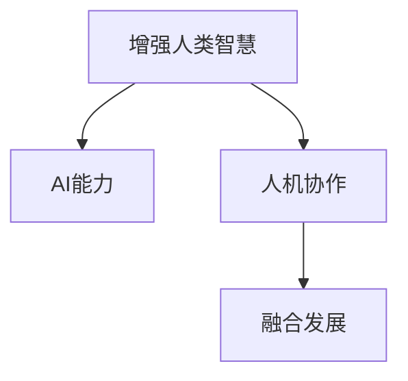

                 

# 人类-AI协作：增强人类智慧与AI能力的融合发展趋势预测分析机遇挑战机遇趋势预测分析

## 1. 背景介绍

在信息时代，人工智能（AI）技术正以前所未有的速度改变着我们的生活和工作方式。从智能客服、推荐系统、自动驾驶，到医学诊断、金融分析、法律咨询等领域，AI的广泛应用正在重塑人类的未来。然而，面对AI的崛起，人们既充满期待，也心生担忧。如何平衡人类的智慧与AI的能力，实现二者间的有效协作，成为当下最热门的话题。本文将深度探讨人类与AI的融合发展趋势、面临的机遇与挑战，并通过技术、伦理和社会多角度综合分析，为AI与人类协作的未来提供洞见。

## 2. 核心概念与联系

### 2.1 核心概念概述

为深入理解AI与人类协作的未来，本节将介绍几个核心概念：

- **增强人类智慧（Augmented Human Intelligence）**：通过AI技术辅助人类决策、提升工作效率、增强认知能力。
- **AI能力**：包括机器学习、深度学习、自然语言处理（NLP）、计算机视觉等核心技术能力。
- **人机协作（Human-AI Collaboration）**：AI与人类之间互为补充、共同完成复杂任务的协作模式。
- **融合发展（Convergence）**：AI与人类智慧在多层面上的融合，涵盖技术、业务、社会等多维度。

这些概念之间的关系可以通过以下Mermaid流程图来展示：



这个流程图展示了核心概念之间的逻辑关系：

1. **增强人类智慧**：利用**AI能力**来辅助人类完成任务，提升智慧水平。
2. **人机协作**：AI与人类共同工作，实现更高效、更智能的协同作业。
3. **融合发展**：通过AI与人类智慧的深度融合，实现更广泛的应用场景和更高的价值创造。

## 3. 核心算法原理 & 具体操作步骤

### 3.1 算法原理概述

AI与人类协作的核心在于如何将AI的能力有效融入到人类的决策和任务执行过程中。基于此，本节将介绍几种关键算法原理：

- **协同过滤推荐**：基于用户行为数据的协同过滤算法，通过相似用户或物品推荐，提升个性化推荐效果。
- **自然语言处理**：利用NLP技术，理解人类语言，实现智能客服、机器翻译等任务。
- **强化学习**：通过与环境的交互，AI逐步优化决策策略，实现自动驾驶、游戏AI等应用。
- **生成对抗网络（GANs）**：通过对抗训练，生成高质量的数据或图像，应用于图像生成、风格转换等场景。

### 3.2 算法步骤详解

基于上述算法原理，AI与人类协作的具体操作步骤可以分为以下几个关键步骤：

**Step 1: 需求识别与问题定义**
- 明确AI需要解决的具体问题或任务，如推荐、翻译、驾驶等。
- 分析任务的复杂度，确定AI与人类协作的方式和程度。

**Step 2: 数据准备与特征工程**
- 收集与任务相关的数据，包括历史数据、实时数据等。
- 进行数据清洗、特征选择、特征工程，提取对任务有用的信息。

**Step 3: 模型选择与训练**
- 选择合适的AI模型，如协同过滤、NLP模型、强化学习模型等。
- 使用训练数据对模型进行训练，优化模型参数，提升模型性能。

**Step 4: 集成与部署**
- 将训练好的AI模型集成到业务系统中，如推荐引擎、智能客服系统等。
- 部署AI模型，进行性能测试，确保系统稳定运行。

**Step 5: 监控与反馈**
- 实时监控AI系统运行情况，收集用户反馈。
- 根据反馈调整模型和系统，持续优化AI与人类协作的效果。

### 3.3 算法优缺点

**协同过滤推荐**
- **优点**：能够有效利用用户行为数据，提升推荐精度和个性化程度。
- **缺点**：数据稀疏性问题，难以覆盖所有用户和物品，容易产生冷启动问题。

**自然语言处理**
- **优点**：可以处理自然语言，实现人机自然交互。
- **缺点**：语言多样性和复杂性带来处理难度，多语言处理仍需改进。

**强化学习**
- **优点**：能够自适应环境变化，优化决策策略。
- **缺点**：需要大量训练时间，依赖大量数据进行训练，难以推广到新环境。

**生成对抗网络（GANs）**
- **优点**：能够生成高质量的数据或图像，应用广泛。
- **缺点**：训练过程中存在模式崩溃、梯度消失等问题，需要精细调节超参数。

### 3.4 算法应用领域

AI与人类协作的应用领域非常广泛，涵盖了从消费互联网到工业互联网的各个方面：

- **消费互联网**：智能客服、推荐系统、内容生成等。
- **工业互联网**：智能制造、智能物流、智能运维等。
- **医疗健康**：医学影像分析、患者诊疗建议等。
- **金融保险**：信用评估、风险预测、客户服务等。
- **教育培训**：个性化学习、智能评估、虚拟助教等。

这些领域的应用，展示了AI与人类协作的巨大潜力，也为未来AI技术的发展指明了方向。

## 4. 数学模型和公式 & 详细讲解 & 举例说明

### 4.1 数学模型构建

本节将使用数学语言对AI与人类协作的核心算法进行更加严格的刻画。

设AI模型为$f(x)$，其中$x$为输入特征，$f(x)$为模型输出。假设训练集为$D=\{(x_i,y_i)\}_{i=1}^N$，其中$x_i$为输入，$y_i$为标签。则模型的损失函数可以表示为：

$$
\mathcal{L}(f)=\frac{1}{N}\sum_{i=1}^N \ell(f(x_i),y_i)
$$

其中$\ell$为损失函数，通常使用交叉熵损失函数：

$$
\ell(f(x_i),y_i)=-y_i\log f(x_i)-(1-y_i)\log(1-f(x_i))
$$

### 4.2 公式推导过程

以协同过滤推荐算法为例，假设训练集为$D=\{(u_i,i_i)\}_{i=1}^N$，其中$u_i$为用户，$i_i$为物品。模型的目标是通过用户$u_i$的历史行为数据，预测其对物品$i_i$的评分。设模型的输出为$f(u_i,i_i)$，则协同过滤推荐算法的目标函数为：

$$
\mathcal{L}(f)=\frac{1}{N}\sum_{i=1}^N \sum_{u_i} [y_i-\alpha f(u_i,i_i)]^2
$$

其中$y_i$为用户$u_i$对物品$i_i$的评分，$\alpha$为正则化参数，$u_i$为所有用户集合。

### 4.3 案例分析与讲解

以智能客服系统为例，假设系统需要处理用户询问“我如何退货”，系统首先通过NLP技术将用户问题转化为语义表示，再利用推荐算法推荐合适的退货流程和信息。推荐算法可以使用协同过滤或基于模型的推荐方法，如LightGBM、XGBoost等。推荐结果将作为AI模型的输出，辅助人类客服人员处理用户请求。

## 5. 项目实践：代码实例和详细解释说明

### 5.1 开发环境搭建

在进行AI与人类协作的实践前，我们需要准备好开发环境。以下是使用Python进行PyTorch开发的环境配置流程：

1. 安装Anaconda：从官网下载并安装Anaconda，用于创建独立的Python环境。

2. 创建并激活虚拟环境：
```bash
conda create -n ai-env python=3.8 
conda activate ai-env
```

3. 安装PyTorch：根据CUDA版本，从官网获取对应的安装命令。例如：
```bash
conda install pytorch torchvision torchaudio cudatoolkit=11.1 -c pytorch -c conda-forge
```

4. 安装各类工具包：
```bash
pip install numpy pandas scikit-learn matplotlib tqdm jupyter notebook ipython
```

完成上述步骤后，即可在`ai-env`环境中开始AI与人类协作的实践。

### 5.2 源代码详细实现

这里我们以协同过滤推荐系统为例，给出使用PyTorch进行推荐模型训练的代码实现。

首先，定义训练数据集和模型：

```python
import torch
from torch.utils.data import Dataset, DataLoader
from torch.nn import Linear, Embedding, BCELoss, Adam
from sklearn.model_selection import train_test_split

class RecommendationDataset(Dataset):
    def __init__(self, users, items, user_item_ratings, num_users, num_items, num_factors):
        self.users = users
        self.items = items
        self.user_item_ratings = user_item_ratings
        self.num_users = num_users
        self.num_items = num_items
        self.num_factors = num_factors
        
    def __len__(self):
        return len(self.user_item_ratings)
    
    def __getitem__(self, index):
        user = self.users[index]
        item = self.items[index]
        rating = self.user_item_ratings[index]
        
        user_embedding = torch.tensor([user] * self.num_factors)
        item_embedding = torch.tensor([item] * self.num_factors)
        
        return {'user_embedding': user_embedding,
                'item_embedding': item_embedding,
                'rating': rating}

# 创建dataset
users, items, user_item_ratings = create_dataset() # 假设存在该函数，用于生成推荐数据
num_users, num_items, num_factors = 1000, 1000, 10

train_dataset = RecommendationDataset(users, items, user_item_ratings, num_users, num_items, num_factors)
val_dataset = RecommendationDataset(users, items, user_item_ratings, num_users, num_items, num_factors)
test_dataset = RecommendationDataset(users, items, user_item_ratings, num_users, num_items, num_factors)

train_loader = DataLoader(train_dataset, batch_size=64, shuffle=True)
val_loader = DataLoader(val_dataset, batch_size=64, shuffle=True)
test_loader = DataLoader(test_dataset, batch_size=64, shuffle=False)

# 定义模型
model = Linear(2 * num_factors, 1)
loss_fn = BCELoss()

# 设置优化器和超参数
optimizer = Adam(model.parameters(), lr=0.001)
```

然后，定义训练和评估函数：

```python
import numpy as np

def train_epoch(model, loader, loss_fn, optimizer):
    model.train()
    epoch_loss = 0
    for batch in loader:
        user_embeddings = batch['user_embedding'].to(device)
        item_embeddings = batch['item_embedding'].to(device)
        ratings = batch['rating'].to(device)
        
        model.zero_grad()
        output = model(torch.cat([user_embeddings, item_embeddings], dim=1))
        loss = loss_fn(output, ratings)
        epoch_loss += loss.item()
        loss.backward()
        optimizer.step()
        
    return epoch_loss / len(loader)

def evaluate(model, loader, loss_fn):
    model.eval()
    epoch_loss = 0
    epoch_mse = 0
    with torch.no_grad():
        for batch in loader:
            user_embeddings = batch['user_embedding'].to(device)
            item_embeddings = batch['item_embedding'].to(device)
            ratings = batch['rating'].to(device)
            
            output = model(torch.cat([user_embeddings, item_embeddings], dim=1))
            loss = loss_fn(output, ratings)
            epoch_loss += loss.item()
            epoch_mse += ((ratings - output) ** 2).mean().item()
        
    return epoch_loss / len(loader), np.sqrt(epoch_mse) / len(loader)

# 启动训练流程
device = torch.device('cuda') if torch.cuda.is_available() else torch.device('cpu')
model.to(device)

epochs = 10
for epoch in range(epochs):
    train_loss = train_epoch(model, train_loader, loss_fn, optimizer)
    val_loss, val_mse = evaluate(model, val_loader, loss_fn)
    
    print(f'Epoch {epoch+1}, train loss: {train_loss:.3f}, val loss: {val_loss:.3f}, val mse: {val_mse:.3f}')
    
print('Training complete.')
```

以上就是使用PyTorch进行协同过滤推荐系统的完整代码实现。可以看到，利用PyTorch的强大封装，我们可以很方便地定义数据集、模型、优化器等组件，并使用高级API进行训练和评估。

### 5.3 代码解读与分析

让我们再详细解读一下关键代码的实现细节：

**RecommendationDataset类**：
- `__init__`方法：初始化训练数据、用户数、物品数、因子数等关键信息。
- `__len__`方法：返回数据集的样本数量。
- `__getitem__`方法：对单个样本进行处理，将用户和物品嵌入转换为向量，并返回模型所需的输入和标签。

**模型和损失函数定义**：
- 定义线性模型，用于预测用户对物品的评分。
- 使用BCELoss作为损失函数，用于衡量模型输出与真实标签的差异。

**训练和评估函数**：
- 使用PyTorch的DataLoader对数据集进行批次化加载，供模型训练和推理使用。
- 训练函数`train_epoch`：对数据以批为单位进行迭代，在每个批次上前向传播计算loss并反向传播更新模型参数。
- 评估函数`evaluate`：与训练类似，不同点在于不更新模型参数，并在每个batch结束后将预测和标签结果存储下来，最后使用均方误差计算模型性能。

**训练流程**：
- 定义总的epoch数，开始循环迭代
- 每个epoch内，先在训练集上训练，输出平均loss和mse
- 在验证集上评估，输出验证集的平均loss和mse
- 所有epoch结束后，训练完成

可以看到，利用PyTorch进行AI与人类协作的代码实现，不仅简洁高效，而且便于扩展和优化。开发者可以根据具体需求，灵活调整模型的复杂度和训练策略，以实现最优的效果。

## 6. 实际应用场景

### 6.1 智能客服系统

智能客服系统是AI与人类协作的重要应用之一。传统客服往往需要耗费大量人力，响应速度慢，且质量不稳定。而使用智能客服系统，可以通过自然语言处理技术，自动理解用户问题，并提供即时的解决方案，极大提升客服效率和质量。

在技术实现上，可以采用协同过滤推荐算法，根据用户历史行为数据，推荐最合适的回答模板。模型训练数据可以来自企业的客服记录，通过文本处理技术，将问题-回答对转换为推荐数据。模型训练完成后，用户提出的新问题将被自动匹配最合适的回答模板，由AI系统生成回复。

### 6.2 个性化推荐系统

个性化推荐系统通过AI技术与用户行为数据的深度结合，实现精准推荐。用户对商品、内容、服务等不同类别的兴趣偏好，可以通过点击、浏览、评论等行为数据进行建模。通过协同过滤、基于内容的推荐等算法，系统能够动态生成个性化推荐内容，提高用户满意度。

推荐系统的核心在于如何有效处理用户行为数据，提取有意义的特征，并利用这些特征进行高效建模。模型训练数据来自用户的过往行为，通过协同过滤或基于模型的推荐方法，系统能够预测用户对新物品的评分，进而推荐合适的商品、内容或服务。推荐系统的成功应用，能够显著提升用户体验和商家收益。

### 6.3 医疗诊断系统

医疗诊断系统通过AI技术与医疗数据的深度结合，辅助医生进行疾病诊断和治疗。AI模型可以学习医生的诊疗经验，分析病人的影像、基因、病历等数据，生成诊疗建议。通过自然语言处理技术，系统能够理解医生的指令，自动执行查询、分析、推荐等任务。

在技术实现上，可以采用基于深度学习的医疗影像分析模型，如卷积神经网络（CNN）、循环神经网络（RNN）等，对医学影像进行分析和识别。同时，可以通过文本处理技术，将医生的诊疗指令转换为可执行的模型参数，生成个性化的诊疗建议。医疗诊断系统的应用，能够提高诊断效率和准确性，减轻医生的工作负担。

### 6.4 未来应用展望

随着AI技术的不断发展，未来AI与人类协作的应用将更加广泛和深入。以下是几个可能的未来应用趋势：

**智慧城市**：AI与人类协作的智慧城市管理系统，能够实时监测城市运行状态，智能调度资源，提升城市管理效率。

**智慧交通**：智能交通系统通过AI技术，实现交通流量预测、智能导航、自动驾驶等功能，提升交通出行效率和安全性。

**智慧教育**：智能教育系统通过AI技术，实现个性化学习、智能评估、虚拟助教等功能，提升教育质量和效率。

**智慧金融**：智能金融系统通过AI技术，实现信用评估、风险预测、智能投顾等功能，提升金融服务的智能化水平。

这些应用场景展示了AI与人类协作的广阔前景，为未来社会的智能化发展提供了新的可能。

## 7. 工具和资源推荐

### 7.1 学习资源推荐

为了帮助开发者系统掌握AI与人类协作的理论基础和实践技巧，这里推荐一些优质的学习资源：

1. 《深度学习》系列课程：由斯坦福大学、Coursera等机构提供，系统介绍深度学习的基本概念和经典算法。

2. 《机器学习实战》书籍：适合初学者，通过实践项目，掌握机器学习技术。

3. 《自然语言处理综论》书籍：全面介绍自然语言处理技术，涵盖语言模型、序列建模、信息检索等内容。

4. 《强化学习》书籍：介绍强化学习的基本原理和应用案例，适合对智能系统感兴趣的技术人员。

5. Kaggle竞赛平台：提供大量数据集和开源代码，适合实践机器学习和深度学习项目。

通过这些资源的学习实践，相信你一定能够快速掌握AI与人类协作的精髓，并用于解决实际的AI应用问题。

### 7.2 开发工具推荐

高效的开发离不开优秀的工具支持。以下是几款用于AI与人类协作开发的常用工具：

1. PyTorch：基于Python的开源深度学习框架，灵活的计算图，适合快速迭代研究。

2. TensorFlow：由Google主导开发的开源深度学习框架，生产部署方便，适合大规模工程应用。

3. TensorFlow Hub：提供预训练模型和工具，简化模型部署和应用。

4. Weights & Biases：模型训练的实验跟踪工具，可以记录和可视化模型训练过程中的各项指标。

5. TensorBoard：TensorFlow配套的可视化工具，可实时监测模型训练状态，提供丰富的图表呈现方式。

6. Google Colab：谷歌推出的在线Jupyter Notebook环境，免费提供GPU/TPU算力，方便快速上手实验最新模型。

合理利用这些工具，可以显著提升AI与人类协作任务的开发效率，加快创新迭代的步伐。

### 7.3 相关论文推荐

AI与人类协作的研究源于学界的持续研究。以下是几篇奠基性的相关论文，推荐阅读：

1. 《协同过滤推荐算法》论文：介绍协同过滤推荐的基本原理和应用案例，是推荐系统的经典之作。

2. 《基于深度学习的医疗影像分析》论文：通过深度学习技术，实现医疗影像的自动化分析，提升诊断效率。

3. 《自然语言处理综述》论文：全面介绍自然语言处理技术的发展历程和最新进展。

4. 《强化学习基础》论文：介绍强化学习的基本原理和算法，适合对智能系统感兴趣的研究人员。

5. 《多模态学习综述》论文：探讨多模态学习技术在AI与人类协作中的应用，展示多模态信息融合的潜力。

这些论文代表了大规模AI与人类协作的研究方向，通过学习这些前沿成果，可以帮助研究者把握学科前进方向，激发更多的创新灵感。

## 8. 总结：未来发展趋势与挑战

### 8.1 总结

本文对AI与人类协作的未来趋势进行了全面系统的介绍。首先阐述了AI与人类协作的背景和意义，明确了AI与人类智慧在多维度上的融合。其次，从原理到实践，详细讲解了AI与人类协作的核心算法和具体操作步骤，给出了技术应用的完整代码实例。同时，本文还广泛探讨了AI与人类协作在智能客服、推荐系统、医疗诊断等领域的实际应用，展示了AI与人类协作的巨大潜力。

通过本文的系统梳理，可以看到，AI与人类协作正在成为AI技术应用的重要方向，极大地拓展了AI系统的应用边界，为未来社会的智能化发展提供了新的路径。

### 8.2 未来发展趋势

展望未来，AI与人类协作技术将呈现以下几个发展趋势：

**数据驱动的智能决策**：通过大规模数据驱动的AI模型，实现自动化决策，提高决策效率和质量。

**跨领域知识融合**：AI与人类智慧在多领域知识的融合，实现更全面、更深入的智能应用。

**个性化智能服务**：通过AI技术，实现个性化推荐、智能客服等功能，提升用户体验和满意度。

**人机协同创造**：AI与人类共同完成复杂的创造性工作，如自动生成文本、音乐、艺术等。

**伦理道德的AI**：在AI模型中加入伦理导向的评估指标，确保AI的决策符合人类价值观和伦理道德。

以上趋势凸显了AI与人类协作技术的广阔前景，这些方向的探索发展，必将进一步提升AI系统的性能和应用范围，为构建人机协同的智能系统铺平道路。

### 8.3 面临的挑战

尽管AI与人类协作技术已经取得了显著进展，但在迈向更加智能化、普适化应用的过程中，它仍面临诸多挑战：

**数据质量问题**：高质量的数据是AI系统性能的关键，但数据获取和标注成本高，难以覆盖所有应用场景。

**隐私和安全问题**：AI系统在处理敏感数据时，隐私和安全问题尤为突出，需要严格的法规和技术保障。

**可解释性和可控性**：AI系统的决策过程往往难以解释，缺乏透明度和可控性，容易被滥用或误用。

**技术鸿沟问题**：AI技术的发展速度快，但并非所有行业和人员都能快速适应，需要技术普及和培训。

**伦理道德问题**：AI系统在决策过程中可能带有偏见，需要建立公平、公正的决策机制，避免歧视和偏见。

这些挑战需要AI与人类协作技术在实践中不断探索和解决，才能实现更加广泛、深入的应用。

### 8.4 研究展望

面对AI与人类协作技术面临的挑战，未来的研究需要在以下几个方面寻求新的突破：

**数据增强和生成**：利用生成对抗网络（GANs）等技术，增强数据质量和多样性，弥补数据不足的问题。

**模型可解释性**：引入可解释性技术，如LIME、SHAP等，增强AI模型的透明度和可控性。

**多模态融合**：将文本、图像、音频等多模态数据融合，提升AI系统的感知和理解能力。

**伦理导向的AI**：在AI模型的设计过程中，加入伦理导向的评估指标，确保AI的决策符合人类价值观和伦理道德。

这些研究方向将引领AI与人类协作技术的发展方向，为构建更加安全、可靠、可解释的智能系统提供保障。

## 9. 附录：常见问题与解答

**Q1: 如何选择合适的AI模型？**

A: 选择合适的AI模型需要考虑多个因素，包括任务类型、数据规模、计算资源等。一般来说，对于推荐系统、客服系统等，协同过滤算法较为适用；对于图像、语音等领域，深度学习模型（如CNN、RNN等）更为适合。

**Q2: 如何提高AI系统的可解释性？**

A: 提高AI系统的可解释性可以通过引入可解释性技术，如LIME、SHAP等，将模型的预测结果映射回具体的特征。此外，也可以通过可视化工具，如TensorBoard、Weights & Biases等，帮助理解模型的内部工作机制。

**Q3: AI与人类协作系统如何保护用户隐私？**

A: AI与人类协作系统可以通过数据加密、去标识化等技术保护用户隐私。同时，在数据处理和分析过程中，需要严格遵守相关法规，确保数据的合法使用和保护。

**Q4: AI与人类协作系统的决策过程如何确保公平性？**

A: 确保AI系统的公平性需要引入公平性评估指标，如公平误差、代表性偏差等。同时，可以通过数据增强、模型调整等手段，消除模型中的偏见和歧视。

**Q5: 如何应对AI与人类协作系统中的技术鸿沟问题？**

A: 技术鸿沟问题的解决需要从多个层面入手，包括技术普及、培训教育、社区支持等。通过建立开源社区、提供技术支持、开展培训项目等，可以帮助更多人快速上手AI技术。

这些问题的解答，可以帮助开发者更好地理解和应用AI与人类协作技术，推动AI技术在更多领域落地应用。

---

作者：禅与计算机程序设计艺术 / Zen and the Art of Computer Programming

