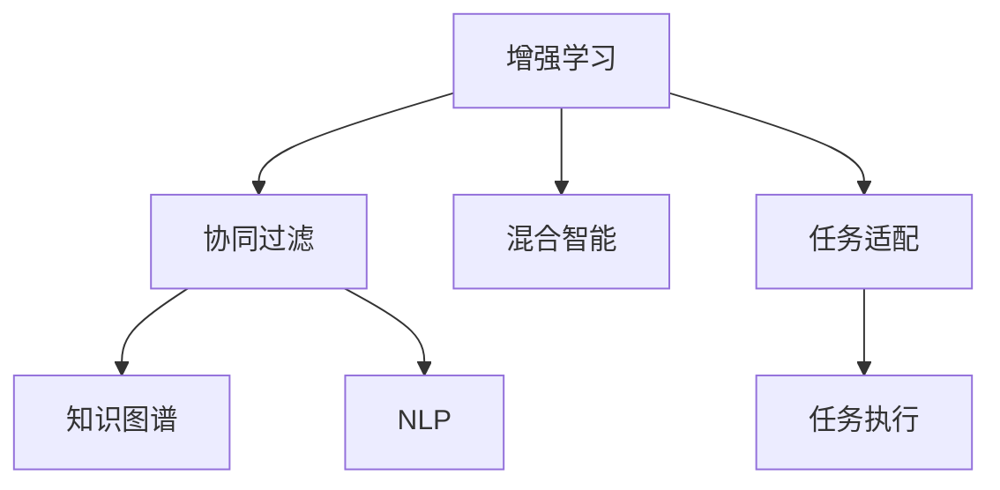

                 

# 人类-AI协作：增强人类潜能与AI能力的融合发展趋势分析与展望

## 1. 背景介绍

### 1.1 问题由来
随着人工智能(AI)技术的快速发展，人类-AI协作已不再是科幻小说中的场景。从智能助理到自动驾驶，从医学诊断到工业生产，AI在各个领域展现出了巨大的潜力和应用前景。然而，AI并非万能，它依然需要在人的监督和引导下发挥最大效用。如何将AI与人类的智能相结合，最大化地发挥彼此的优势，成为当前技术发展的重要课题。

### 1.2 问题核心关键点
人类-AI协作的核心关键点在于如何构建一个高效的协同系统，使AI能够根据人类的指令、知识、经验进行推理和决策，同时提升人类的工作效率、创造力和决策能力。这种协作不仅需要考虑技术层面的问题，还需要关注伦理、安全、隐私等社会问题。

## 2. 核心概念与联系

### 2.1 核心概念概述

为更好地理解人类-AI协作，本节将介绍几个关键概念及其联系：

- **增强学习(Reinforcement Learning, RL)**：一种通过智能体与环境的交互，根据奖励信号不断优化策略的学习方法。人类可以通过设定奖励机制，指导AI在特定任务上的学习。
- **协同过滤(Collaborative Filtering)**：一种通过分析用户行为，为用户推荐感兴趣物品的技术。AI可以基于人类的反馈，调整推荐策略，提升推荐准确度。
- **混合智能(Hybrid Intelligence)**：指将人类的逻辑推理、创造性思维与AI的计算能力、数据处理能力结合起来，构建更加智能的协同系统。
- **知识图谱(Knowledge Graph)**：一种结构化的语义知识库，用于表示实体、属性、关系等。AI可以借助知识图谱进行更高级别的推理和决策。
- **自然语言处理(Natural Language Processing, NLP)**：使计算机能够理解和处理人类语言的技术。AI可以通过NLP技术，理解人类指令，执行复杂任务。

这些概念之间的联系可以通过以下Mermaid流程图来展示：



这个流程图展示了增强学习如何与协同过滤、混合智能、知识图谱、NLP等技术相结合，构建人类-AI协作系统：

1. 通过增强学习，AI能够根据人类的指令和反馈进行优化。
2. 协同过滤结合NLP技术，使AI能够更好地理解用户需求，提升推荐效果。
3. 混合智能通过结合人类和AI的优势，构建更复杂的决策系统。
4. 知识图谱为AI提供更丰富的语义信息，提升推理和决策能力。
5. 任务适配层将用户需求转化为AI可执行的任务，并结合知识图谱进行推理。

## 3. 核心算法原理 & 具体操作步骤
### 3.1 算法原理概述

人类-AI协作的核心算法原理主要基于增强学习，通过构建一个协同优化框架，使AI能够在人类的引导下逐步学习并优化策略。这一过程需要人类的监督和反馈，以确保AI的学习方向与人类目标一致。

### 3.2 算法步骤详解

基于增强学习的人类-AI协作通常包括以下几个关键步骤：

**Step 1: 环境设计**
- 定义一个具体的任务场景，如推荐系统、自动驾驶、医疗诊断等。
- 设计合适的环境状态和动作空间，以便AI能够理解和执行。

**Step 2: 策略设计**
- 设计AI的策略，如强化学习中的策略函数，使其能够根据当前环境状态选择动作。
- 初始化AI的策略参数，可以是随机初始化，也可以是预训练模型。

**Step 3: 奖励机制设计**
- 定义奖励函数，衡量AI执行动作后环境的改善程度。
- 设计惩罚机制，防止AI执行有害动作，如医疗诊断中的误诊。

**Step 4: 交互过程**
- 在实际环境中运行AI，执行一系列动作并观察环境变化。
- 根据奖励函数计算奖励信号，更新策略参数，优化AI行为。

**Step 5: 反馈与调整**
- 收集人类的反馈，评估AI的执行效果。
- 根据反馈调整奖励机制，使AI行为更加符合人类期望。

### 3.3 算法优缺点

基于增强学习的人类-AI协作方法具有以下优点：
1. 高度灵活。AI可以根据环境变化不断调整策略，适应各种复杂任务。
2. 鲁棒性强。通过反馈机制，AI能够逐步优化策略，提高执行效果。
3. 可扩展性高。适用于各种规模和复杂度的任务，通过任务适配层可以进行定制化设计。

同时，该方法也存在一些局限性：
1. 学习曲线陡峭。需要大量的训练数据和计算资源，初期的学习效果可能不够理想。
2. 模型复杂。增强学习模型的复杂度较高，需要细致的设计和调参。
3. 可靠性不足。缺乏有监督学习，模型的泛化能力和鲁棒性可能不足。

尽管存在这些局限性，基于增强学习的方法仍是当前人类-AI协作的主要范式。未来相关研究将重点关注如何降低学习成本、提高模型鲁棒性，同时兼顾可解释性和伦理安全性等因素。

### 3.4 算法应用领域

基于增强学习的人类-AI协作方法已经在多个领域得到了广泛应用，例如：

- 智能推荐系统：如电商平台上的商品推荐、视频平台上的内容推荐。通过协同过滤结合NLP技术，AI能够理解用户需求，提供个性化推荐。
- 自动驾驶：在复杂的道路环境中，AI能够根据实时反馈，优化驾驶策略，提高行驶安全性。
- 医疗诊断：AI在医生指导下，通过增强学习不断优化诊断策略，提高诊断准确度。
- 机器人控制：AI在物理机器人上执行复杂任务，如工业生产线上的自动化作业。
- 智能客服：AI在客服系统中，根据用户反馈，不断优化服务策略，提升用户体验。

除了上述这些经典应用外，基于增强学习的人类-AI协作方法还在更多场景中得到创新性地应用，如智能游戏、自动化交易、智能家居等，为人类生活和工作带来了更多便利和效率。

## 4. 数学模型和公式 & 详细讲解  
### 4.1 数学模型构建

本节将使用数学语言对基于增强学习的人类-AI协作过程进行更加严格的刻画。

记任务环境为 $\mathcal{E}$，动作空间为 $\mathcal{A}$，奖励函数为 $r$，初始状态为 $s_0$。AI的策略为 $\pi$，定义为从状态 $s$ 到动作 $a$ 的概率分布。在每个时间步 $t$，AI从状态 $s_t$ 执行动作 $a_t$，观察到下一个状态 $s_{t+1}$ 和奖励 $r_t$。

基于Q-Learning的增强学习过程可以表示为：

$$
\begin{aligned}
Q_{\theta}(s_t,a_t) &= Q_{\theta}(s_t,a_t) + \alpha \left[ r_t + \gamma \max_{a'} Q_{\theta}(s_{t+1},a') - Q_{\theta}(s_t,a_t) \right] \\
\pi_{\theta}(a_t|s_t) &= \frac{\exp\left(\frac{Q_{\theta}(s_t,a_t)}{\alpha}\right)}{\sum_{a} \exp\left(\frac{Q_{\theta}(s_t,a)}{\alpha}\right)}
\end{aligned}
$$

其中 $Q_{\theta}(s_t,a_t)$ 表示在策略 $\pi_{\theta}$ 下，从状态 $s_t$ 执行动作 $a_t$ 的Q值，$\alpha$ 为学习率，$\gamma$ 为折扣因子。

### 4.2 公式推导过程

以下我们以智能推荐系统为例，推导协同过滤的数学模型。

假设系统维护了用户-物品矩阵 $I \in \mathbb{R}^{N \times M}$，其中 $N$ 为用户数，$M$ 为物品数。$I_{i,j}$ 表示用户 $i$ 对物品 $j$ 的评分。定义协同过滤的优化目标为最大化用户的平均评分：

$$
\max_{I} \sum_{i=1}^N \frac{1}{M} \sum_{j=1}^M I_{i,j}
$$

引入Q-Learning框架，设推荐系统为环境，用户的评分作为奖励信号，物品特征向量 $\vec{a}_j$ 作为动作空间，策略函数 $\pi_{\theta}$ 用于选择物品特征向量，策略参数 $\theta$ 为机器学习模型的参数。

Q-Learning的目标函数为：

$$
\min_{\theta} \mathbb{E}_{t}\left[ (Q_{\theta}(s_t,a_t) - (r_t + \gamma \max_{a'} Q_{\theta}(s_{t+1},a')) \right]
$$

在训练过程中，每轮迭代更新策略参数：

$$
\theta \leftarrow \theta + \alpha \left[ r_t + \gamma \max_{a'} Q_{\theta}(s_{t+1},a') - Q_{\theta}(s_t,a_t) \right]
$$

其中 $r_t = I_{i_t,j_t}$ 为用户的评分，$a_t = \vec{a}_{j_t}$ 为用户选择的物品特征向量，$I_{i_t,j_t}$ 为用户的评分。

### 4.3 案例分析与讲解

在智能推荐系统中，协同过滤结合NLP技术，使AI能够理解用户需求，提供个性化推荐。具体流程如下：

1. 用户输入搜索词，通过NLP技术解析为查询向量 $\vec{q}$。
2. 将查询向量输入到协同过滤模型中，得到物品向量 $\vec{a}_j$ 与查询向量的相似度评分。
3. 根据相似度评分，选择Top $k$ 个物品，作为推荐结果。
4. 用户对推荐结果进行评分，更新协同过滤模型的参数。

通过上述流程，AI能够不断优化推荐策略，提高推荐效果。

## 5. 项目实践：代码实例和详细解释说明
### 5.1 开发环境搭建

在进行人类-AI协作实践前，我们需要准备好开发环境。以下是使用Python进行PyTorch开发的环境配置流程：

1. 安装Anaconda：从官网下载并安装Anaconda，用于创建独立的Python环境。

2. 创建并激活虚拟环境：
```bash
conda create -n pytorch-env python=3.8 
conda activate pytorch-env
```

3. 安装PyTorch：根据CUDA版本，从官网获取对应的安装命令。例如：
```bash
conda install pytorch torchvision torchaudio cudatoolkit=11.1 -c pytorch -c conda-forge
```

4. 安装各类工具包：
```bash
pip install numpy pandas scikit-learn matplotlib tqdm jupyter notebook ipython
```

完成上述步骤后，即可在`pytorch-env`环境中开始协作实践。

### 5.2 源代码详细实现

这里我们以智能推荐系统为例，给出使用PyTorch进行协同过滤的代码实现。

首先，定义协同过滤模型和损失函数：

```python
import torch
import torch.nn as nn
import torch.optim as optim

class CollaborativeFiltering(nn.Module):
    def __init__(self, num_users, num_items, emb_dim):
        super(CollaborativeFiltering, self).__init__()
        self.user_emb = nn.Embedding(num_users, emb_dim)
        self.item_emb = nn.Embedding(num_items, emb_dim)
        self.cos_sim = nn.CosineSimilarity(dim=1)

    def forward(self, user_ids, item_ids):
        user_embs = self.user_emb(user_ids)
        item_embs = self.item_emb(item_ids)
        dot = torch.bmm(user_embs, item_embs.permute(0, 2, 1)).sum(dim=2)
        scores = self.cos_sim(dot, user_embs)
        return scores

# 定义损失函数
loss_fn = nn.MSELoss()
```

然后，加载数据并定义训练函数：

```python
# 加载数据
user_ids = torch.LongTensor(np.random.randint(0, num_users, size=(num_users,)))
item_ids = torch.LongTensor(np.random.randint(0, num_items, size=(num_users,)))
ratings = torch.randn(num_users, num_items)

# 定义训练函数
optimizer = optim.Adam(model.parameters(), lr=0.001)
def train_epoch(model, optimizer, user_ids, item_ids, ratings):
    model.train()
    loss = 0
    for i in range(num_epochs):
        optimizer.zero_grad()
        predictions = model(user_ids, item_ids)
        loss = loss_fn(predictions, ratings)
        loss.backward()
        optimizer.step()
        loss += loss.item()
    return loss / num_epochs
```

最后，启动训练流程并在测试集上评估：

```python
# 训练模型
num_epochs = 100
loss = train_epoch(model, optimizer, user_ids, item_ids, ratings)

# 在测试集上评估
test_ids = torch.randperm(num_items)[:100]
test_ratings = ratings.numpy()[test_ids]
predictions = model(user_ids, test_ids)
print('Average loss: %.2f' % (loss/num_epochs))
print('Average MAE: %.2f' % (np.mean(np.abs(predictions - test_ratings))))
```

以上就是使用PyTorch进行协同过滤的完整代码实现。可以看到，通过增强学习，AI能够不断优化协同过滤模型的参数，提升推荐效果。

### 5.3 代码解读与分析

让我们再详细解读一下关键代码的实现细节：

**CollaborativeFiltering类**：
- `__init__`方法：初始化用户和物品嵌入层，以及余弦相似度层。
- `forward`方法：前向传播计算相似度分数。

**损失函数**：
- 使用均方误差损失函数衡量预测评分与真实评分之间的差异。

**训练函数**：
- 定义优化器和训练轮数。
- 在每个epoch中，前向传播计算预测评分，并计算损失。
- 反向传播更新模型参数。
- 收集损失，平均损失后返回。

**训练流程**：
- 定义总的epoch数，开始循环迭代。
- 在每个epoch内，进行前向传播和反向传播。
- 计算平均损失，并在测试集上进行评估。

可以看到，通过增强学习，AI能够不断优化协同过滤模型，提升推荐效果。开发者可以将更多精力放在数据处理、模型改进等高层逻辑上，而不必过多关注底层的实现细节。

当然，工业级的系统实现还需考虑更多因素，如模型的保存和部署、超参数的自动搜索、更灵活的任务适配层等。但核心的增强学习范式基本与此类似。

## 6. 实际应用场景
### 6.1 智能客服系统

基于增强学习的人类-AI协作技术，可以广泛应用于智能客服系统的构建。传统客服往往需要配备大量人力，高峰期响应缓慢，且一致性和专业性难以保证。而使用增强学习的AI，能够7x24小时不间断服务，快速响应客户咨询，用自然流畅的语言解答各类常见问题。

在技术实现上，可以收集企业内部的历史客服对话记录，将问题和最佳答复构建成监督数据，在此基础上对增强学习模型进行训练。模型能够自动理解用户意图，匹配最合适的答复模板进行回复。对于客户提出的新问题，还可以接入检索系统实时搜索相关内容，动态组织生成回答。如此构建的智能客服系统，能大幅提升客户咨询体验和问题解决效率。

### 6.2 金融舆情监测

金融机构需要实时监测市场舆论动向，以便及时应对负面信息传播，规避金融风险。传统的人工监测方式成本高、效率低，难以应对网络时代海量信息爆发的挑战。基于增强学习的人类-AI协作技术，能够从海量的金融新闻、评论中自动筛选出重要的舆情信息，通过分析舆情趋势，提供风险预警。

具体而言，可以收集金融领域相关的新闻、报道、评论等文本数据，并对其进行情感分析。通过增强学习的训练，模型能够自动识别舆情信息，并根据情感分析结果，调整风险预警策略。将增强学习的模型应用到实时抓取的网络文本数据，就能够自动监测不同主题下的情感变化趋势，一旦发现负面信息激增等异常情况，系统便会自动预警，帮助金融机构快速应对潜在风险。

### 6.3 个性化推荐系统

当前的推荐系统往往只依赖用户的历史行为数据进行物品推荐，无法深入理解用户的真实兴趣偏好。基于增强学习的人类-AI协作技术，可以更好地挖掘用户行为背后的语义信息，从而提供更精准、多样的推荐内容。

在实践中，可以收集用户浏览、点击、评论、分享等行为数据，提取和用户交互的物品标题、描述、标签等文本内容。将文本内容作为模型输入，用户的后续行为（如是否点击、购买等）作为监督信号，在此基础上增强学习模型进行训练。模型能够从文本内容中准确把握用户的兴趣点。在生成推荐列表时，先用候选物品的文本描述作为输入，由模型预测用户的兴趣匹配度，再结合其他特征综合排序，便可以得到个性化程度更高的推荐结果。

### 6.4 未来应用展望

随着增强学习技术的发展，人类-AI协作技术将在更多领域得到应用，为传统行业带来变革性影响。

在智慧医疗领域，基于增强学习的医疗问答、病历分析、药物研发等应用将提升医疗服务的智能化水平，辅助医生诊疗，加速新药开发进程。

在智能教育领域，增强学习的技术可应用于作业批改、学情分析、知识推荐等方面，因材施教，促进教育公平，提高教学质量。

在智慧城市治理中，增强学习模型可应用于城市事件监测、舆情分析、应急指挥等环节，提高城市管理的自动化和智能化水平，构建更安全、高效的未来城市。

此外，在企业生产、社会治理、文娱传媒等众多领域，基于增强学习的人类-AI协作技术也将不断涌现，为NLP技术带来了全新的突破。相信随着技术的日益成熟，增强学习技术将成为人工智能落地应用的重要范式，推动人工智能技术向更广阔的领域加速渗透。

## 7. 工具和资源推荐
### 7.1 学习资源推荐

为了帮助开发者系统掌握增强学习的人类-AI协作技术的理论基础和实践技巧，这里推荐一些优质的学习资源：

1. 《强化学习》（Reinforcement Learning）系列博文：由大模型技术专家撰写，深入浅出地介绍了强化学习原理、算法和应用，适合初学者和进阶开发者。

2. CS229《强化学习》课程：斯坦福大学开设的强化学习课程，有Lecture视频和配套作业，帮助你系统掌握强化学习的核心概念和实现技巧。

3. 《Deep Reinforcement Learning with Python》书籍：由OpenAI等知名机构提供的入门教材，详细介绍了如何使用Python实现强化学习算法。

4. DeepMind官方文档：DeepMind作为强化学习的先驱，提供了丰富的文档和代码示例，帮助你快速上手。

5. arXiv论文库：最新的强化学习论文和技术进展，涵盖从算法到应用的多方面内容。

通过对这些资源的学习实践，相信你一定能够快速掌握增强学习的人类-AI协作技术的精髓，并用于解决实际的NLP问题。

### 7.2 开发工具推荐

高效的开发离不开优秀的工具支持。以下是几款用于增强学习的人类-AI协作技术开发的常用工具：

1. PyTorch：基于Python的开源深度学习框架，灵活动态的计算图，适合快速迭代研究。大部分强化学习模型都有PyTorch版本的实现。

2. TensorFlow：由Google主导开发的开源深度学习框架，生产部署方便，适合大规模工程应用。同样有丰富的强化学习模型资源。

3. OpenAI Gym：一个模拟环境库，提供了多种模拟环境，方便开发者测试和调试强化学习算法。

4. Viola：一个用于自动生成强化学习模型的库，能够生成适合特定问题的模型架构。

5. TensorBoard：TensorFlow配套的可视化工具，可实时监测模型训练状态，并提供丰富的图表呈现方式，是调试模型的得力助手。

6. Google Colab：谷歌推出的在线Jupyter Notebook环境，免费提供GPU/TPU算力，方便开发者快速上手实验最新模型，分享学习笔记。

合理利用这些工具，可以显著提升增强学习的人类-AI协作技术的开发效率，加快创新迭代的步伐。

### 7.3 相关论文推荐

增强学习技术的发展源于学界的持续研究。以下是几篇奠基性的相关论文，推荐阅读：

1. Q-learning：首次提出基于Q值的强化学习算法，为后续研究提供了基础。

2. Deep Q-Networks：使用深度神经网络进行Q值估计，提升了强化学习的性能。

3. AlphaGo：通过增强学习技术，击败世界围棋冠军李世石，展示了强化学习在复杂决策问题上的潜力。

4. PPO（Proximal Policy Optimization）：一种基于政策梯度的强化学习算法，具有较高的收敛速度和稳定性。

5. OpenAI Gym：提供了一个通用的强化学习环境库，便于研究和测试强化学习算法。

这些论文代表了大增强学习技术的发展脉络。通过学习这些前沿成果，可以帮助研究者把握学科前进方向，激发更多的创新灵感。

## 8. 总结：未来发展趋势与挑战

### 8.1 总结

本文对基于增强学习的人类-AI协作技术进行了全面系统的介绍。首先阐述了增强学习技术的背景和应用前景，明确了增强学习在人类-AI协作中的重要地位。其次，从原理到实践，详细讲解了增强学习的基本步骤和关键算法，给出了增强学习任务开发的完整代码实例。同时，本文还广泛探讨了增强学习技术在智能客服、金融舆情、个性化推荐等多个行业领域的应用前景，展示了增强学习技术的巨大潜力。此外，本文精选了增强学习技术的各类学习资源，力求为读者提供全方位的技术指引。

通过本文的系统梳理，可以看到，基于增强学习的人类-AI协作技术正在成为NLP领域的重要范式，极大地拓展了人工智能技术的应用边界，催生了更多的落地场景。受益于增强学习技术的不断发展，人类-AI协作技术必将进一步提升NLP系统的性能和应用范围，为人类认知智能的进化带来深远影响。

### 8.2 未来发展趋势

展望未来，增强学习的人类-AI协作技术将呈现以下几个发展趋势：

1. 技术复杂度提升。随着任务复杂度的增加，增强学习的模型结构和训练难度也将提高。未来的研究将探索更多高级强化学习算法，如PPO、A3C等，以适应更复杂的问题。

2. 模型规模扩大。随着计算资源的增加，模型规模也将持续增大，以容纳更丰富的语义信息。超大规模模型将进一步提升推荐、诊断等任务的精度。

3. 自监督学习结合。增强学习可以结合自监督学习技术，通过无标签数据进行预训练，提高模型泛化能力和鲁棒性。

4. 混合智能扩展。增强学习模型将与更多领域的技术进行融合，如计算机视觉、语音识别等，构建更加全面的人类-AI协作系统。

5. 跨模态协同。增强学习模型将融合多模态信息，如视觉、语音、文本等，提升跨模态任务的处理能力。

6. 伦理与社会影响研究。随着增强学习技术的应用推广，如何确保模型行为符合伦理和社会规范，将成为重要的研究课题。

以上趋势凸显了增强学习技术的广阔前景。这些方向的探索发展，必将进一步提升人类-AI协作技术的性能和应用范围，为构建安全、可靠、可解释、可控的智能系统铺平道路。

### 8.3 面临的挑战

尽管增强学习技术已经取得了瞩目成就，但在迈向更加智能化、普适化应用的过程中，它仍面临着诸多挑战：

1. 学习效率。增强学习模型的训练过程往往耗时较长，如何提高模型训练速度，是一个重要的研究方向。

2. 模型可解释性。增强学习模型通常被视为"黑盒"系统，缺乏对模型内部决策过程的解释，这在金融、医疗等高风险应用中尤为关键。

3. 模型鲁棒性。增强学习模型面对域外数据时，泛化性能往往大打折扣。如何在保证模型鲁棒性的同时，提高模型的泛化能力，还需要更多的研究。

4. 数据隐私。在增强学习模型中，如何保护用户的隐私，防止数据泄露，是一个重要的法律和伦理问题。

5. 系统可控性。增强学习模型在复杂环境中可能出现"失控"，如何设计模型以确保系统的可控性和稳定性，是一个重要的研究方向。

6. 模型公平性。增强学习模型在训练过程中，可能会学习到偏见和歧视，如何设计模型以确保公平性，是一个重要的伦理问题。

正视增强学习技术面临的这些挑战，积极应对并寻求突破，将使增强学习技术走向成熟。相信随着学界和产业界的共同努力，这些挑战终将一一被克服，增强学习技术必将在构建安全、可靠、可解释、可控的智能系统方面发挥更大的作用。

### 8.4 研究展望

面对增强学习技术面临的种种挑战，未来的研究需要在以下几个方面寻求新的突破：

1. 探索高效的模型结构。研究更加高效的模型结构，如卷积神经网络、残差网络等，以适应复杂任务，提高训练效率。

2. 开发新的优化算法。研究更加高效的优化算法，如Adam、Adafactor等，以加速模型训练。

3. 引入自监督学习。通过无标签数据进行预训练，提高模型泛化能力和鲁棒性。

4. 结合其他人工智能技术。结合计算机视觉、语音识别等技术，构建更加全面的人类-AI协作系统。

5. 引入伦理和社会规范。在模型设计中引入伦理导向的评估指标，确保模型的行为符合社会规范。

6. 强化学习研究深化。深化对强化学习理论的理解，探索更多高级强化学习算法，如多智能体学习、元学习等。

这些研究方向的探索，必将引领增强学习技术迈向更高的台阶，为构建安全、可靠、可解释、可控的智能系统铺平道路。面向未来，增强学习技术还需要与其他人工智能技术进行更深入的融合，如知识表示、因果推理、强化学习等，多路径协同发力，共同推动自然语言理解和智能交互系统的进步。只有勇于创新、敢于突破，才能不断拓展语言模型的边界，让智能技术更好地造福人类社会。

## 9. 附录：常见问题与解答

**Q1：人类-AI协作与传统的AI应用有何不同？**

A: 传统AI应用主要依赖于监督学习、无监督学习等方法，需要大量的标注数据进行训练。而人类-AI协作主要通过增强学习技术，利用人类的反馈和指导，逐步优化AI的行为，适应复杂的任务环境。人类-AI协作能够更好地利用人类的先验知识和经验，提升AI的推理和决策能力。

**Q2：如何设计有效的奖励机制？**

A: 设计有效的奖励机制是增强学习成功的关键。奖励机制需要考虑多个因素，如任务目标、用户需求、环境变化等。设计时，需要考虑奖励的及时性、公平性和多样性。一般而言，奖励机制的设定需要经过多次实验验证，以找到最优的奖励策略。

**Q3：增强学习模型是否会学习到偏见？**

A: 增强学习模型在训练过程中，可能会学习到数据中的偏见和歧视。为避免这一问题，需要设计多样化的数据集，确保训练数据的多样性和代表性。同时，在模型设计中引入公平性约束，确保模型的决策过程公平无歧视。

**Q4：增强学习模型是否可以用于实时控制？**

A: 增强学习模型可以在实时控制中发挥作用，如自动驾驶、机器人控制等。通过设计合适的环境状态和动作空间，增强学习模型能够根据实时反馈进行优化，实现高效控制。

**Q5：增强学习模型在实际应用中是否需要大量标注数据？**

A: 增强学习模型通常不需要大量标注数据进行训练，可以通过交互数据进行在线学习。但为了确保模型鲁棒性和泛化能力，初期可能需要一定的标注数据进行监督学习。

通过以上分析，可以看到，人类-AI协作技术正在成为人工智能领域的重要方向，极大地拓展了AI的应用场景。未来，随着增强学习技术的不断发展，人类-AI协作将带来更多创新和突破，推动人工智能技术向更加智能化、普适化的方向迈进。

---

作者：禅与计算机程序设计艺术 / Zen and the Art of Computer Programming

