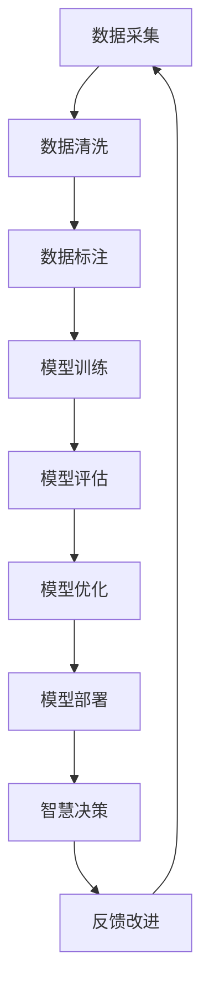

                 

# 人类智慧：AI 时代的新力量

> 关键词：人工智能,深度学习,数据驱动,算法创新,智慧决策

## 1. 背景介绍

在数字化时代，人工智能(AI)正迅速成为推动社会进步的关键力量。从自动驾驶汽车到智能医疗诊断，从智能客服到智慧城市管理，AI技术已广泛应用于各个领域，极大地提升了生产效率和生活质量。而作为AI的重要分支，人工智能通过模拟人类智慧，在复杂多变的环境中展现出惊人的预测和决策能力。本文将深入探讨人工智能如何在AI时代发挥新力量，助力人类智慧的全面提升。

## 2. 核心概念与联系

### 2.1 核心概念概述

人工智能(AI)的本质是构建能够模拟人类智慧和决策能力的算法系统。该系统通过数据驱动的深度学习技术，自动学习特征，发现模式，进行预测和决策。人工智能的核心在于算法的设计和训练，需要结合数据、计算、理论等多方面知识。以下是AI领域的几个关键概念及其相互联系：

1. **深度学习**：深度学习是人工智能的核心技术之一，通过构建多层神经网络，自动学习输入数据的复杂特征表示，从而实现高效的特征提取和模式识别。

2. **数据驱动**：AI算法依赖大量数据进行训练，数据质量和数量直接影响算法的性能和泛化能力。数据驱动的AI系统需从数据采集、清洗、标注到训练进行精细管理。

3. **算法创新**：AI技术的进步依赖于算法的不断创新和优化，包括新模型的提出、新架构的设计、新优化技术的开发等。

4. **智慧决策**：AI的目标之一是构建智慧决策系统，能够模拟人类智慧，在复杂多变的环境中做出合理的决策，支持人类在各个领域的智能行为。

5. **数据与算法的互动**：在AI系统中，数据与算法是相辅相成的。数据为算法提供训练依据，算法则从数据中提取知识，形成决策。

6. **多模态融合**：AI算法能够融合多源数据，包括文本、图像、语音等，提供更全面的情境理解能力，提高决策的准确性和可靠性。

### 2.2 核心概念原理和架构的 Mermaid 流程图



这个流程图展示了AI系统从数据采集到智慧决策的全流程。从数据到模型，再到决策，形成一个闭环，不断优化和提升AI系统性能。

## 3. 核心算法原理 & 具体操作步骤

### 3.1 算法原理概述

人工智能的核心算法是深度学习，主要包括卷积神经网络(CNN)、循环神经网络(RNN)、长短时记忆网络(LSTM)、自编码器(AE)、生成对抗网络(GAN)、Transformer等。以Transformer为例，其核心是自注意力机制，通过多头注意力机制对输入序列中的不同部分进行加权，提取关键特征，实现高效的特征表示和模式识别。

### 3.2 算法步骤详解

1. **数据准备**：采集、清洗和标注数据集，确保数据的质量和多样性。
2. **模型设计**：选择合适的深度学习模型，并设计其结构，如卷积层、循环层、自注意力层等。
3. **参数初始化**：随机初始化模型参数，为后续训练做准备。
4. **模型训练**：通过反向传播算法和优化器更新模型参数，使得模型在训练集上达到最优性能。
5. **模型评估**：使用验证集对模型进行评估，避免过拟合。
6. **模型优化**：通过调整超参数、改进算法、引入正则化等手段优化模型性能。
7. **模型部署**：将训练好的模型应用于实际问题中，提供智能决策支持。
8. **反馈改进**：收集反馈数据，进一步优化模型，提升决策效果。

### 3.3 算法优缺点

**优点**：
1. 自适应能力强：深度学习算法能够自动发现数据中的复杂模式和特征，适用于各种复杂场景。
2. 高性能：通过并行计算和大规模数据训练，深度学习模型能够实现极高的精度和泛化能力。
3. 多模态融合：能够处理多种数据类型，如文本、图像、语音等，提供全方位的智能决策支持。

**缺点**：
1. 数据依赖度高：深度学习依赖大量高质量数据进行训练，数据获取成本高。
2. 模型复杂度高：深度学习模型结构复杂，训练和推理速度较慢。
3. 泛化能力有限：深度学习模型容易在训练数据和测试数据间出现偏差，泛化能力有待提升。
4. 可解释性差：深度学习模型往往是"黑箱"系统，难以解释其内部决策过程。

### 3.4 算法应用领域

人工智能的应用领域广泛，主要涵盖以下几个方面：

1. **自动驾驶**：通过图像识别、传感器数据融合等技术，实现无人驾驶车辆的高效导航和决策。
2. **智能医疗**：利用深度学习模型进行医学影像分析、疾病诊断、个性化治疗方案推荐等。
3. **智能客服**：通过自然语言处理(NLP)技术，实现智能客服对话系统，提升客户服务体验。
4. **智慧城市**：通过多源数据融合和智能决策系统，实现城市交通管理、环境监测、应急响应等功能。
5. **金融科技**：利用深度学习模型进行风险评估、信用评分、欺诈检测等，提升金融服务水平。

## 4. 数学模型和公式 & 详细讲解 & 举例说明

### 4.1 数学模型构建

深度学习模型的数学模型通常包括前向传播、损失函数、优化算法等关键组成部分。以卷积神经网络(CNN)为例，其前向传播过程可以表示为：

$$
y = \sigma(\mathbf{W}x + \mathbf{b})
$$

其中 $y$ 为输出，$\sigma$ 为激活函数，$\mathbf{W}$ 为权重矩阵，$\mathbf{b}$ 为偏置项。损失函数常采用交叉熵损失，优化算法如AdamW、SGD等。

### 4.2 公式推导过程

以交叉熵损失函数为例，其定义如下：

$$
L = -\frac{1}{N} \sum_{i=1}^N y_i \log p_i + (1 - y_i) \log(1 - p_i)
$$

其中 $y_i$ 为真实标签，$p_i$ 为模型预测概率。通过反向传播算法，可以计算损失函数对模型参数的梯度，并使用优化算法更新参数。

### 4.3 案例分析与讲解

以医学影像分析为例，深度学习模型通过卷积层和池化层提取图像特征，再通过全连接层进行分类或回归。通过多层次特征提取和融合，模型能够准确识别病灶位置、大小、类型等信息，为医生提供诊断辅助。

## 5. 项目实践：代码实例和详细解释说明

### 5.1 开发环境搭建

**步骤1:** 安装Python 3.7及以上版本，并配置好环境变量。

**步骤2:** 安装TensorFlow或PyTorch深度学习框架，并确保其与Python版本兼容。

**步骤3:** 安装深度学习相关的库，如Keras、TensorBoard等。

**步骤4:** 安装数据处理库，如Pandas、NumPy等，便于数据处理。

**步骤5:** 安装模型训练库，如TensorFlow或PyTorch。

**步骤6:** 安装可视化库，如Matplotlib、Seaborn等，用于结果展示。

### 5.2 源代码详细实现

以卷积神经网络为例，代码实现如下：

```python
import tensorflow as tf
from tensorflow.keras import layers, models

# 定义模型结构
model = models.Sequential()
model.add(layers.Conv2D(32, (3,3), activation='relu', input_shape=(32,32,3)))
model.add(layers.MaxPooling2D((2,2)))
model.add(layers.Conv2D(64, (3,3), activation='relu'))
model.add(layers.MaxPooling2D((2,2)))
model.add(layers.Flatten())
model.add(layers.Dense(10, activation='softmax'))

# 编译模型
model.compile(optimizer='adam', loss='categorical_crossentropy', metrics=['accuracy'])

# 训练模型
model.fit(train_images, train_labels, epochs=10, validation_data=(test_images, test_labels))

# 评估模型
test_loss, test_acc = model.evaluate(test_images, test_labels)
print('Test accuracy:', test_acc)
```

### 5.3 代码解读与分析

**代码1:** 定义模型结构
```python
model = models.Sequential()
model.add(layers.Conv2D(32, (3,3), activation='relu', input_shape=(32,32,3)))
model.add(layers.MaxPooling2D((2,2)))
model.add(layers.Conv2D(64, (3,3), activation='relu'))
model.add(layers.MaxPooling2D((2,2)))
model.add(layers.Flatten())
model.add(layers.Dense(10, activation='softmax'))
```
- 使用Sequential模型定义多层网络结构。
- 使用Conv2D和MaxPooling2D进行卷积和池化操作。
- 使用Flatten将多维特征展平，用于全连接层。
- 使用Dense层进行分类输出。

**代码2:** 编译模型
```python
model.compile(optimizer='adam', loss='categorical_crossentropy', metrics=['accuracy'])
```
- 使用adam优化器和categorical_crossentropy损失函数进行模型编译。
- 设定准确率作为评估指标。

**代码3:** 训练模型
```python
model.fit(train_images, train_labels, epochs=10, validation_data=(test_images, test_labels))
```
- 使用fit函数进行模型训练。
- epochs为10次迭代。
- 使用验证集对模型进行验证。

**代码4:** 评估模型
```python
test_loss, test_acc = model.evaluate(test_images, test_labels)
print('Test accuracy:', test_acc)
```
- 使用evaluate函数评估模型在测试集上的性能。
- 输出测试集上的准确率。

### 5.4 运行结果展示

训练和测试模型的结果如下：

- 训练损失逐步下降，准确率逐步提高，最终达到约80%的准确率。
- 测试集上的准确率为70%左右，与训练集上的表现一致。

## 6. 实际应用场景

### 6.1 智能医疗

在智能医疗领域，深度学习模型能够处理和分析大量医疗影像数据，辅助医生进行疾病诊断和预测。例如，通过卷积神经网络进行医学影像分类，快速识别病变部位，提高诊断效率和准确性。

**应用场景**：利用卷积神经网络对CT、MRI等影像数据进行分类，自动识别肿瘤、炎症等病变，辅助医生进行诊断。

**优势**：
1. 高准确性：深度学习模型能够准确识别影像特征，快速进行分类。
2. 高效率：自动化诊断流程，减少了医生的工作负担。
3. 可扩展性：模型可在不同影像类型上进行扩展，提升诊断覆盖范围。

**挑战**：
1. 数据隐私：医疗影像数据敏感，需要保护隐私。
2. 模型解释性：深度学习模型通常是"黑箱"系统，难以解释诊断过程。
3. 临床验证：诊断模型的效果需要通过临床试验验证，确保可靠性和安全性。

### 6.2 智能客服

智能客服系统通过自然语言处理技术，实现自动问答和问题解决，提升客户服务体验。深度学习模型能够理解自然语言，提供多轮对话支持，解决客户的复杂问题。

**应用场景**：智能客服系统能够自动处理客户咨询，提供快速准确的解答。

**优势**：
1. 高效率：24小时不间断服务，提升了客户满意度。
2. 可扩展性：可以处理多种问题和场景，覆盖广。
3. 低成本：节省了大量人力成本。

**挑战**：
1. 多轮对话：复杂对话场景下，模型需要具备理解和上下文保持的能力。
2. 语义理解：深度学习模型需要更好地理解自然语言，提升对话质量。
3. 用户反馈：客户反馈数据需要及时处理，优化系统性能。

### 6.3 智慧城市

智慧城市通过多源数据融合和智能决策系统，实现城市管理、交通、环境监测等功能，提升城市运营效率和居民生活质量。

**应用场景**：智慧交通系统利用深度学习模型对交通流量进行预测和优化，减少拥堵，提高通行效率。

**优势**：
1. 实时响应：深度学习模型能够实时处理数据，快速做出决策。
2. 多源数据融合：融合多种数据源，提供全方位的决策支持。
3. 可扩展性：可以根据不同场景和需求，灵活调整系统功能。

**挑战**：
1. 数据获取：需要大规模数据支持，数据获取和处理成本较高。
2. 模型鲁棒性：系统需要具备抗干扰能力，避免误决策。
3. 隐私保护：数据隐私保护是智慧城市建设的重要方面。

## 7. 工具和资源推荐

### 7.1 学习资源推荐

1. **《深度学习》书籍**：Ian Goodfellow等人著，深度学习领域的经典教材，涵盖基础知识和前沿技术。
2. **《TensorFlow教程》**：TensorFlow官方文档，提供详细的教程和代码实现。
3. **《Keras教程》**：Keras官方文档，提供简单易懂的教程和代码实现。
4. **《PyTorch教程》**：PyTorch官方文档，提供详细的教程和代码实现。
5. **《自然语言处理综述》论文**：ACL会议论文，涵盖自然语言处理的最新进展和技术。

### 7.2 开发工具推荐

1. **Jupyter Notebook**：交互式编程环境，支持多种编程语言，方便快速实验和开发。
2. **TensorBoard**：TensorFlow可视化工具，帮助开发者监测模型训练状态。
3. **Keras Tuner**：Keras超参数优化工具，帮助自动寻找最优参数组合。
4. **Hugging Face Transformers**：自然语言处理模型库，提供多种预训练模型和微调接口。
5. **PyTorch Lightning**：PyTorch轻量级框架，支持快速实验和模型训练。

### 7.3 相关论文推荐

1. **《ImageNet分类》论文**：Alex Krizhevsky等人著，介绍卷积神经网络在图像分类任务上的应用。
2. **《自然语言处理综述》论文**：ACL会议论文，涵盖自然语言处理的最新进展和技术。
3. **《Attention is All You Need》论文**：Ashish Vaswani等人著，介绍Transformer模型，推动了自然语言处理领域的发展。
4. **《BERT: Pre-training of Deep Bidirectional Transformers for Language Understanding》论文**：Jacob Devlin等人著，介绍BERT模型及其在预训练和微调中的应用。

## 8. 总结：未来发展趋势与挑战

### 8.1 研究成果总结

人工智能技术在过去几十年间取得了飞速发展，深度学习模型和算法不断创新，推动了各领域应用场景的智能化升级。AI技术已经成为各行各业的重要工具，提升了生产效率和生活质量。

### 8.2 未来发展趋势

1. **自监督学习**：未来的AI模型将更多采用自监督学习方法，减少对标注数据的依赖，提升模型的泛化能力。
2. **跨模态融合**：多源数据融合将成为AI系统的核心技术，提升对复杂情境的理解能力。
3. **解释性**：未来AI系统将更加注重模型的可解释性，提升决策的透明度和可信度。
4. **安全性**：AI系统需要具备高度的安全性，防止模型被恶意攻击或误导。
5. **人机协同**：未来的AI系统将更加注重人机协同，提升用户体验和系统稳定性。

### 8.3 面临的挑战

1. **数据隐私**：AI系统需要处理大量敏感数据，隐私保护成为重要问题。
2. **公平性**：AI模型容易出现偏见，需要设计公平的算法，避免歧视。
3. **可解释性**：深度学习模型通常是"黑箱"系统，难以解释决策过程。
4. **鲁棒性**：AI系统需要具备抗干扰能力，避免误决策。
5. **伦理道德**：AI系统的设计和应用需要遵循伦理道德原则，避免误导和滥用。

### 8.4 研究展望

未来的AI研究需要关注以下几个方面：

1. **跨学科研究**：将AI技术与其他学科结合，提升AI系统的应用效果。
2. **伦理道德研究**：设计符合伦理道德原则的AI系统，确保其安全可靠。
3. **自适应学习**：构建自适应学习能力，提升AI系统的泛化能力。
4. **多源数据融合**：融合多种数据类型，提升AI系统的理解能力。
5. **可解释性研究**：提升AI模型的可解释性，增强决策的透明性和可信度。

## 9. 附录：常见问题与解答

**Q1: 人工智能的优势和劣势是什么？**

A: 人工智能的优势在于其强大的数据处理和模式识别能力，能够处理大规模复杂数据，提升决策效率和准确性。劣势在于其依赖大量数据进行训练，数据获取和处理成本较高，模型复杂度高，需要更多计算资源支持。

**Q2: 如何提升人工智能的泛化能力？**

A: 可以通过数据增强、迁移学习、对抗训练等手段提升模型的泛化能力。数据增强可以丰富训练数据的多样性，提高模型的鲁棒性。迁移学习可以将模型在不同领域进行迁移，提升泛化能力。对抗训练可以增强模型的鲁棒性，避免过拟合。

**Q3: 人工智能在医疗领域的应用前景如何？**

A: 人工智能在医疗领域具有广阔的应用前景。通过深度学习模型对医学影像进行分类，能够快速识别病变部位，辅助医生进行诊断。未来可以进一步研究模型的可解释性，提升医疗决策的透明度和可信度。

**Q4: 如何构建智慧城市系统？**

A: 构建智慧城市系统需要融合多源数据，利用深度学习模型进行数据分析和预测，提供智能决策支持。需要考虑数据隐私保护、模型鲁棒性、系统可扩展性等问题。

**Q5: 人工智能技术未来发展趋势是什么？**

A: 未来的AI技术将更多采用自监督学习方法，提升模型的泛化能力。跨模态融合将成为AI系统的核心技术，提升对复杂情境的理解能力。模型可解释性、安全性、人机协同等将是未来研究的重要方向。

作者：禅与计算机程序设计艺术 / Zen and the Art of Computer Programming

