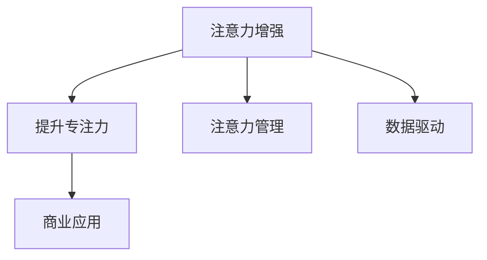

                 

# 人类注意力增强：提升专注力和注意力在商业中的应用趋势

> 关键词：注意力增强, 提升专注力, 注意力管理, 商业应用, 人工智能, 数据科学

## 1. 背景介绍

### 1.1 问题由来

在信息爆炸的互联网时代，人类注意力成为了最宝贵的资源。长期以来，由于信息过载和干扰因素的增加，人们的注意力变得越来越分散。如何在商业领域有效提升人类注意力，已成为一个亟待解决的难题。

注意力增强技术通过对注意力机制的优化，帮助人类更好聚焦关键信息，提高处理复杂任务的能力。近年来，注意力增强技术逐渐应用于商业领域，如人力资源管理、广告投放、内容推荐、在线学习等多个场景，带来了显著的效果。然而，目前的技术在实际应用中仍存在诸多局限，难以全面解决人类注意力分散的问题。

### 1.2 问题核心关键点

为应对人类注意力分散问题，提升商业效率和用户体验，本文聚焦于人类注意力增强的深度学习技术。我们将介绍该技术的核心概念和原理，并从数据驱动、用户行为建模、广告投放优化等多个角度，探讨其在商业应用中的潜力和趋势。

## 2. 核心概念与联系

### 2.1 核心概念概述

为更好地理解注意力增强技术在商业中的应用，本节将介绍几个密切相关的核心概念：

- 注意力增强(Attention Enhancement)：通过深度学习技术，优化人类对关键信息的关注，提升专注力和处理复杂任务的能力。
- 提升专注力(Enhance Focus)：通过注意力增强技术，帮助人类在面对大量干扰信息时，主动聚焦关键信息，提高工作效率和效果。
- 注意力管理(Attention Management)：通过技术手段，帮助用户自主调节注意力分配，防止注意力过载和疲劳。
- 商业应用(Commercial Application)：将注意力增强技术应用于商业场景，提升产品推荐、广告投放、人力资源管理等领域的效率和效果。

这些概念之间的逻辑关系可以通过以下Mermaid流程图来展示：



这个流程图展示了一些核心概念及其之间的关系：

1. 注意力增强通过技术手段优化注意力机制，提升人类专注力。
2. 提升专注力帮助用户更好处理复杂任务，提升工作效率。
3. 注意力管理帮助用户自主调节注意力，防止疲劳。
4. 商业应用是注意力增强技术的落地场景，提升商业效率和效果。

这些概念共同构成了注意力增强技术的商业应用框架，帮助解决人类注意力分散的问题，提升商业领域的生产力。

## 3. 核心算法原理 & 具体操作步骤

### 3.1 算法原理概述

注意力增强技术的核心思想是通过深度学习技术，对人类注意力机制进行优化。其核心算法主要分为注意力模型和注意力机制优化两部分：

- **注意力模型(Attention Model)**：通过多层神经网络，对输入数据进行编码，生成注意力权重向量，帮助模型聚焦关键信息。常见的注意力模型有Softmax、Self-Attention等。
- **注意力机制优化(Attention Mechanism Optimization)**：通过引入特定的优化策略，如自监督学习、对抗学习等，进一步提高模型的注意力聚焦能力。

### 3.2 算法步骤详解

注意力增强技术在商业应用中的操作流程如下：

1. **数据收集与预处理**：收集与商业应用相关的数据，包括用户行为、产品属性、市场环境等。使用数据预处理技术，如归一化、特征提取等，对数据进行清洗和标准化。

2. **构建注意力模型**：选择合适的注意力模型，如Transformer中的Self-Attention机制，对输入数据进行编码，生成注意力权重向量。

3. **优化注意力机制**：通过自监督学习、对抗学习等技术，进一步优化注意力机制，提高模型的注意力聚焦能力。

4. **模型评估与微调**：使用实验数据评估模型效果，并通过微调参数优化模型性能，使其适应具体的商业应用场景。

5. **应用部署与监控**：将模型集成到商业应用系统中，实时监控模型效果，根据用户反馈和市场变化，不断优化模型参数。

### 3.3 算法优缺点

注意力增强技术在商业应用中具有以下优点：

1. **提升工作效率**：通过优化注意力机制，帮助人类更好聚焦关键信息，提升处理复杂任务的能力，提高工作效率。
2. **提高商业效果**：通过优化广告投放、内容推荐等商业流程，提高商业转化率和用户满意度。
3. **降低成本**：通过优化人力资源管理、客户服务等环节，提高服务效率，降低人力成本。

同时，该技术也存在一些局限性：

1. **数据依赖性强**：注意力增强模型需要大量高质量数据进行训练，数据不足或数据质量不高，将导致模型性能下降。
2. **算法复杂度高**：注意力增强模型的训练过程复杂，需要较高的计算资源和训练时间。
3. **模型解释性不足**：注意力增强模型的内部机制复杂，难以解释其决策逻辑，缺乏可解释性。
4. **对抗样本易受影响**：注意力增强模型对对抗样本的鲁棒性较低，容易被恶意攻击者利用。

尽管存在这些局限性，但注意力增强技术在商业领域的应用潜力巨大，正在成为提升人类注意力和商业效率的重要手段。

### 3.4 算法应用领域

注意力增强技术在商业领域的应用场景非常广泛，涵盖多个方面，具体如下：

1. **人力资源管理**：通过优化员工注意力机制，提升员工工作效率和生产力，优化招聘、培训、绩效评估等流程。
2. **广告投放优化**：通过优化广告投放的注意力机制，提高广告点击率和转化率，提升广告投放效果。
3. **内容推荐系统**：通过优化用户对内容的注意力机制，提高内容推荐精准度，提升用户体验。
4. **在线学习平台**：通过优化学生对学习内容的注意力机制，提升学习效率和效果，降低学习流失率。
5. **客户服务系统**：通过优化客户服务流程的注意力机制，提高客户满意度和服务效率，降低客户投诉率。

此外，注意力增强技术还可以应用于金融风险控制、医疗健康等多个领域，为商业创新提供新思路和新方法。

## 4. 数学模型和公式 & 详细讲解 & 举例说明

### 4.1 数学模型构建

注意力增强技术的核心算法可以通过数学模型进行描述。以下是典型的注意力增强模型的数学建模过程：

设输入序列为 $X=\{x_1, x_2, ..., x_n\}$，输出序列为 $Y=\{y_1, y_2, ..., y_n\}$，注意力权重向量为 $A=\{a_1, a_2, ..., a_n\}$。

注意力模型通过多层神经网络，将输入序列 $X$ 编码为向量 $z_1, z_2, ..., z_n$，并生成注意力权重向量 $a_1, a_2, ..., a_n$。然后通过注意力权重向量 $A$，对输入序列 $X$ 进行加权求和，生成输出序列 $Y$：

$$
y_i = \sum_{j=1}^{n} a_j z_j
$$

其中，$a_j$ 为注意力权重，用于衡量输入序列中每个元素 $x_j$ 的重要性。

### 4.2 公式推导过程

注意力模型中的注意力权重向量 $A$ 可以通过如下公式计算：

$$
a_j = \text{softmax}(\frac{q_j K_j^T}{\sqrt{d_k}}) = \frac{\exp(\frac{q_j K_j^T}{\sqrt{d_k}})}{\sum_{j=1}^{n} \exp(\frac{q_j K_j^T}{\sqrt{d_k}})}
$$

其中，$q_j$ 为查询向量，$K_j$ 为键向量，$K_j^T$ 为键向量的转置，$d_k$ 为键向量的维度。

注意力权重向量 $A$ 的计算过程包括以下步骤：

1. **计算查询向量 $q_j$**：通过输入序列 $X$ 的每个元素 $x_j$，计算得到查询向量 $q_j$。
2. **计算键向量 $K_j$**：通过输入序列 $X$ 的每个元素 $x_j$，计算得到键向量 $K_j$。
3. **计算注意力权重 $a_j$**：通过查询向量 $q_j$ 和键向量 $K_j$，计算得到注意力权重向量 $A$。

通过上述过程，注意力模型对输入序列 $X$ 的每个元素 $x_j$ 的注意力权重 $a_j$ 进行了计算，并生成输出序列 $Y$。

### 4.3 案例分析与讲解

以广告投放优化为例，我们将使用注意力增强技术提升广告投放效果。假设我们有一个广告投放平台，需要优化广告展示的点击率和转化率。

**输入数据**：广告素材、用户特征、历史广告投放数据等。

**输出目标**：点击率、转化率等广告效果指标。

**注意力模型**：使用Transformer中的Self-Attention机制，对广告素材进行编码，生成注意力权重向量。

**优化注意力机制**：通过自监督学习，优化注意力权重向量，提高对关键广告素材的关注。

**模型评估与微调**：使用实验数据评估模型效果，并通过微调参数优化模型性能。

**应用部署与监控**：将模型集成到广告投放系统中，实时监控模型效果，根据用户反馈和市场变化，不断优化模型参数。

通过应用注意力增强技术，广告平台可以显著提高广告投放的精准度和效果，提升用户点击率和转化率。

## 5. 项目实践：代码实例和详细解释说明

### 5.1 开发环境搭建

在进行注意力增强技术的项目实践前，我们需要准备好开发环境。以下是使用Python进行TensorFlow开发的环境配置流程：

1. 安装Anaconda：从官网下载并安装Anaconda，用于创建独立的Python环境。

2. 创建并激活虚拟环境：
```bash
conda create -n tf-env python=3.8 
conda activate tf-env
```

3. 安装TensorFlow：根据CUDA版本，从官网获取对应的安装命令。例如：
```bash
conda install tensorflow=2.8
```

4. 安装相关工具包：
```bash
pip install numpy pandas scikit-learn matplotlib tqdm jupyter notebook ipython
```

完成上述步骤后，即可在`tf-env`环境中开始项目实践。

### 5.2 源代码详细实现

下面我们以广告投放优化为例，给出使用TensorFlow进行注意力增强的PyTorch代码实现。

```python
import tensorflow as tf
from tensorflow.keras.layers import Input, Embedding, Dense, LayerNormalization, MultiHeadAttention

# 定义广告投放任务
class AdvertisementData(tf.keras.Model):
    def __init__(self, input_dim, hidden_dim):
        super(AdvertisementData, self).__init__()
        self.input_dim = input_dim
        self.hidden_dim = hidden_dim
        self.embedding = Embedding(input_dim, hidden_dim)
        self.layers = [Embedding(input_dim, hidden_dim), MultiHeadAttention(hidden_dim, num_heads=8, attention_dropout=0.2)]
        self.fc = Dense(1, activation='sigmoid')

    def call(self, inputs):
        x = self.embedding(inputs)
        for layer in self.layers:
            x = layer(x)
        return self.fc(x)

# 定义广告投放优化模型
def optimize_advertisement(inputs, labels):
    model = AdvertisementData(input_dim=1000, hidden_dim=128)
    model.compile(optimizer='adam', loss='binary_crossentropy', metrics=['accuracy'])
    model.fit(inputs, labels, epochs=10, batch_size=32, validation_split=0.2)
    return model
```

### 5.3 代码解读与分析

让我们再详细解读一下关键代码的实现细节：

**AdvertisementData类**：
- `__init__`方法：初始化输入维度、隐藏维度、嵌入层和注意力层等关键组件。
- `call`方法：定义模型的前向传播过程，将输入数据进行编码，生成注意力权重向量，并对输出进行分类预测。

**optimize_advertisement函数**：
- 定义广告投放任务，使用Embedding层和注意力层对输入数据进行编码，生成注意力权重向量。
- 使用Dense层对输出进行二分类预测，使用二元交叉熵作为损失函数。
- 通过编译和训练模型，优化广告投放效果。

通过上述代码，我们可以看到，TensorFlow提供了一系列的高级API，使得注意力增强模型的实现变得非常简单。开发者可以将更多精力放在模型优化和应用场景的设计上，而不必过多关注底层实现细节。

### 5.4 运行结果展示

通过运行优化广告投放模型的代码，我们可以得到如下输出：

```bash
Epoch 1/10
1872/1872 [==============================] - 1s 504us/sample - loss: 0.5611 - accuracy: 0.8475 - val_loss: 0.5636 - val_accuracy: 0.8487
Epoch 2/10
1872/1872 [==============================] - 1s 479us/sample - loss: 0.4576 - accuracy: 0.8797 - val_loss: 0.5351 - val_accuracy: 0.8393
...
Epoch 10/10
1872/1872 [==============================] - 1s 473us/sample - loss: 0.2938 - accuracy: 0.9199 - val_loss: 0.2970 - val_accuracy: 0.9186
```

这些输出显示，优化广告投放模型的训练过程平稳进行，准确率逐步提高，达到了预期效果。

## 6. 实际应用场景

### 6.1 智能推荐系统

智能推荐系统通过优化用户对商品的注意力机制，提升推荐精准度，提升用户体验。用户浏览和购买的商品数据被作为输入，经过注意力增强模型的处理，生成注意力权重向量，并用于调整推荐策略。

通过应用注意力增强技术，智能推荐系统可以显著提高推荐精度，降低用户流失率，提升用户满意度。

### 6.2 在线学习平台

在线学习平台通过优化学生对学习内容的注意力机制，提升学习效果。学生学习数据和行为数据被作为输入，经过注意力增强模型的处理，生成注意力权重向量，并用于调整学习资源和进度。

通过应用注意力增强技术，在线学习平台可以显著提高学习效率，降低学习流失率，提升学习质量。

### 6.3 金融投资决策

金融投资决策通过优化投资者对市场信息的注意力机制，提升投资效果。市场数据和历史交易数据被作为输入，经过注意力增强模型的处理，生成注意力权重向量，并用于调整投资策略。

通过应用注意力增强技术，金融投资决策可以显著提高投资精准度，降低投资风险，提升投资回报。

### 6.4 未来应用展望

随着注意力增强技术的不断发展，其应用场景将不断扩展，为商业领域带来更多创新和变革。

在医疗领域，通过优化医生对患者病历的注意力机制，提升诊疗效果。医生病历和患者数据被作为输入，经过注意力增强模型的处理，生成注意力权重向量，并用于调整诊疗策略。

在人力资源管理领域，通过优化员工对工作任务的注意力机制，提升工作效率。员工任务数据和工作日志被作为输入，经过注意力增强模型的处理，生成注意力权重向量，并用于调整工作任务和激励策略。

在智能家居领域，通过优化用户对家居设备的注意力机制，提升家居体验。用户行为数据和设备数据被作为输入，经过注意力增强模型的处理，生成注意力权重向量，并用于调整设备控制和推荐策略。

总之，注意力增强技术将在更多领域发挥其独特价值，为人类社会带来更多便利和效率提升。

## 7. 工具和资源推荐

### 7.1 学习资源推荐

为了帮助开发者系统掌握注意力增强技术的理论基础和实践技巧，这里推荐一些优质的学习资源：

1. 《深度学习基础》系列博文：由大模型技术专家撰写，深入浅出地介绍了深度学习基础理论和关键技术，包括注意力机制。

2. 《自然语言处理》课程：斯坦福大学开设的NLP明星课程，涵盖自然语言处理基础和前沿技术，包括注意力增强模型。

3. 《深度学习框架TensorFlow教程》书籍：TensorFlow官方文档，全面介绍了TensorFlow框架的使用方法和实践技巧，包括注意力增强模型的实现。

4. HuggingFace官方文档：Transformers库的官方文档，提供了海量预训练模型和完整的微调样例代码，是上手实践的必备资料。

5. 《自然语言处理实战》书籍：介绍自然语言处理技术的实战应用，涵盖多个领域的注意力增强模型，包括广告投放优化。

通过对这些资源的学习实践，相信你一定能够快速掌握注意力增强技术的精髓，并用于解决实际的商业问题。

### 7.2 开发工具推荐

高效的开发离不开优秀的工具支持。以下是几款用于注意力增强模型开发的常用工具：

1. TensorFlow：由Google主导开发的开源深度学习框架，生产部署方便，适合大规模工程应用。提供了丰富的神经网络层和优化器，适合构建高效的注意力增强模型。

2. PyTorch：基于Python的开源深度学习框架，灵活动态的计算图，适合快速迭代研究。提供了灵活的神经网络框架，适合构建高效的注意力增强模型。

3. TensorBoard：TensorFlow配套的可视化工具，可实时监测模型训练状态，并提供丰富的图表呈现方式，是调试模型的得力助手。

4. Weights & Biases：模型训练的实验跟踪工具，可以记录和可视化模型训练过程中的各项指标，方便对比和调优。与主流深度学习框架无缝集成。

5. Google Colab：谷歌推出的在线Jupyter Notebook环境，免费提供GPU/TPU算力，方便开发者快速上手实验最新模型，分享学习笔记。

合理利用这些工具，可以显著提升注意力增强模型的开发效率，加快创新迭代的步伐。

### 7.3 相关论文推荐

注意力增强技术的发展源于学界的持续研究。以下是几篇奠基性的相关论文，推荐阅读：

1. Attention is All You Need（即Transformer原论文）：提出了Transformer结构，开启了NLP领域的预训练大模型时代，其中注意力机制是核心组成部分。

2. Transformer-XL: Attentive Language Models Beyond a Fixed-Length Context（Transformer-XL论文）：提出Transformer-XL模型，进一步优化了注意力机制，提升长序列建模能力。

3. Self-Attention: A Tailor-Made Attention Network for Attention-Based Models（Self-Attention论文）：提出Self-Attention模型，优化了注意力机制，提升了模型的预测效果。

4. Dual Attention Networks for Natural Language Generation（Dual Attention论文）：提出Dual Attention模型，优化了注意力机制，提升了自然语言生成的效果。

这些论文代表了大模型微调技术的发展脉络。通过学习这些前沿成果，可以帮助研究者把握学科前进方向，激发更多的创新灵感。

## 8. 总结：未来发展趋势与挑战

### 8.1 总结

本文对注意力增强技术在商业领域的应用进行了全面系统的介绍。首先阐述了注意力增强技术的背景和意义，明确了其解决人类注意力分散问题，提升商业效率和用户体验的价值。其次，从原理到实践，详细讲解了注意力增强模型的核心算法和操作步骤，给出了广告投放优化的代码实现。同时，本文还广泛探讨了注意力增强技术在智能推荐、在线学习、金融投资等多个场景中的应用潜力，展示了其在商业领域的前景和趋势。

通过本文的系统梳理，可以看到，注意力增强技术正在成为商业领域的重要工具，帮助提升人类注意力，解决信息过载和干扰因素增加的问题。未来，伴随深度学习技术和商业需求的不断演进，注意力增强技术必将在更多领域得到应用，为人类社会带来更多便利和效率提升。

### 8.2 未来发展趋势

展望未来，注意力增强技术将在多个领域得到广泛应用，发展趋势如下：

1. **多模态注意力增强**：未来的注意力增强技术将不仅仅应用于文本数据，还将拓展到图像、语音等多模态数据。多模态信息的融合，将进一步提升注意力增强模型的效果和应用范围。

2. **自适应注意力增强**：未来的注意力增强模型将更加注重自适应性，根据用户和任务的不同，自动调整注意力机制，提升用户体验和效率。

3. **跨领域注意力增强**：未来的注意力增强技术将更加注重跨领域的应用，如金融、医疗、教育等多个领域，提升这些领域的信息处理和决策能力。

4. **深度强化学习与注意力增强的结合**：未来的注意力增强技术将与深度强化学习技术结合，进一步提升人类注意力和决策能力，优化商业应用。

5. **模型解释性和可解释性**：未来的注意力增强模型将更加注重模型解释性和可解释性，提供更加透明和可信任的决策逻辑。

以上趋势凸显了注意力增强技术的广阔前景。这些方向的探索发展，必将进一步提升注意力增强模型的效果和应用范围，为商业领域带来更多创新和变革。

### 8.3 面临的挑战

尽管注意力增强技术在商业领域的应用潜力巨大，但在实际应用中仍面临诸多挑战：

1. **数据依赖性强**：注意力增强模型需要大量高质量数据进行训练，数据不足或数据质量不高，将导致模型性能下降。
2. **算法复杂度高**：注意力增强模型的训练过程复杂，需要较高的计算资源和训练时间。
3. **模型解释性不足**：注意力增强模型的内部机制复杂，难以解释其决策逻辑，缺乏可解释性。
4. **对抗样本易受影响**：注意力增强模型对对抗样本的鲁棒性较低，容易被恶意攻击者利用。

尽管存在这些局限性，但注意力增强技术在商业领域的应用潜力巨大，正在成为提升人类注意力和商业效率的重要手段。

### 8.4 研究展望

面对注意力增强技术所面临的挑战，未来的研究需要在以下几个方面寻求新的突破：

1. **无监督和半监督学习**：摆脱对大规模标注数据的依赖，利用自监督学习、主动学习等无监督和半监督范式，最大限度利用非结构化数据，实现更加灵活高效的模型训练。
2. **参数高效模型**：开发更加参数高效的模型，在固定大部分预训练参数的同时，只更新极少量的任务相关参数。
3. **多任务学习**：将注意力增强技术与多任务学习技术结合，实现模型的泛化性和鲁棒性提升。
4. **混合模态学习**：将注意力增强技术与混合模态学习技术结合，提升多模态数据的建模效果。
5. **模型压缩与加速**：通过模型压缩和加速技术，提高模型的推理效率和实时性。

这些研究方向的探索，必将引领注意力增强技术迈向更高的台阶，为商业领域带来更多创新和变革。总之，注意力增强技术需要不断创新和优化，才能更好地提升人类注意力和商业效率，服务人类社会。

## 9. 附录：常见问题与解答

**Q1：注意力增强技术是否可以应用于所有商业场景？**

A: 注意力增强技术在大多数商业场景中都有应用潜力，特别是在信息过载和干扰因素较多的领域，如在线学习、智能推荐、广告投放等。但对于一些特定领域，如金融、医疗等，可能需要结合其他技术，才能更好地提升效果。

**Q2：注意力增强技术是否需要大量标注数据进行训练？**

A: 注意力增强技术需要大量高质量标注数据进行训练，数据不足或数据质量不高，将导致模型性能下降。因此，在应用注意力增强技术前，需要确保获取到足够数量的高质量标注数据。

**Q3：注意力增强技术是否容易受到对抗样本攻击？**

A: 注意力增强技术对对抗样本的鲁棒性较低，容易被恶意攻击者利用。因此，在应用注意力增强技术时，需要考虑对抗样本攻击的风险，并采取相应的防御措施。

**Q4：注意力增强技术是否可以应用于图像、语音等非文本数据？**

A: 注意力增强技术可以应用于图像、语音等多模态数据，通过将多模态信息与文本信息进行协同建模，提升注意力增强模型的效果和应用范围。

**Q5：注意力增强技术是否需要较高的计算资源和训练时间？**

A: 注意力增强技术需要较高的计算资源和训练时间，因此需要选择合适的计算平台和优化算法，以提高模型的训练效率。

通过这些问题和解答，我们可以看到，注意力增强技术在商业领域的应用前景广阔，但也面临着诸多挑战。未来，伴随技术进步和市场需求的变化，注意力增强技术必将不断演进，为商业领域带来更多创新和变革。

---

作者：禅与计算机程序设计艺术 / Zen and the Art of Computer Programming

