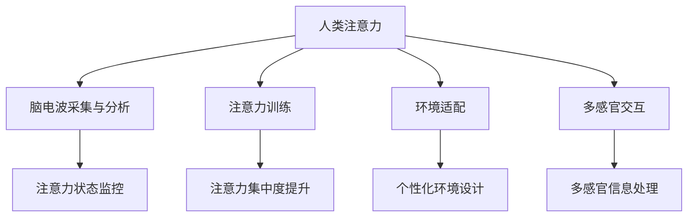

                 

# 人类注意力增强：提升专注力和注意力在商业中的未来方向展望

## 1. 背景介绍

### 1.1 问题由来

在当今信息爆炸的时代，人们面对海量的信息和任务，需要不断地切换注意力，导致“注意力疲劳”现象日益严重。传统的办公模式和信息消费方式已经无法满足人们高效处理复杂任务的需求。在这种背景下，提升专注力和注意力成为了一个重要且迫切的问题。特别是对于商业领域而言，员工和企业需要更高效、更专注的工作方式，以保持竞争优势。

### 1.2 问题核心关键点

提升专注力和注意力的方法有很多，包括时间管理、环境设计、心理训练等。但随着技术的进步，一种全新的方式——人类注意力增强（Human Attention Enhancement）开始进入人们的视野。这种技术通过优化大脑的注意力机制，帮助人们在处理信息时更加集中和高效。以下是该技术的主要核心关键点：

1. **脑波识别与反馈**：通过脑电波采集设备，实时监控大脑的注意力状态，并给予反馈，帮助用户调节注意力。
2. **注意力训练与提升**：利用人工智能算法，设计训练程序，模拟游戏或任务，训练用户的注意力集中度。
3. **环境与任务的适配**：根据用户的工作和任务类型，设计个性化环境和工作方案，提高注意力和专注力。
4. **多模态输入与输出**：结合视觉、听觉、触觉等多感官输入，提供更丰富的信息处理方式，提升注意力和专注力。

## 2. 核心概念与联系

### 2.1 核心概念概述

为了更好地理解人类注意力增强技术，本节将介绍几个密切相关的核心概念：

- **人类注意力**：指大脑在处理信息时，对某些任务或信息的专注程度。注意力越集中，信息处理效率越高。
- **脑电波采集与分析**：通过脑电波采集设备，实时捕捉大脑的电信号，进行分析，了解大脑的注意力状态。
- **注意力训练**：利用游戏化或任务化的方式，模拟真实世界中的复杂任务，训练用户的注意力集中度。
- **环境适配**：根据用户的工作类型和任务需求，设计适应其注意力特性的环境，如光照、声音、设备布局等。
- **多感官交互**：结合视觉、听觉、触觉等多种感官输入，提供更丰富的信息处理方式，提升注意力和专注力。

这些核心概念之间的逻辑关系可以通过以下Mermaid流程图来展示：



这个流程图展示了大语言模型的核心概念及其之间的关系：

1. 人类注意力通过脑电波采集与分析得到监控。
2. 注意力训练和环境适配共同提升注意力集中度。
3. 多感官交互提供更丰富的信息处理方式，提升注意力和专注力。

## 3. 核心算法原理 & 具体操作步骤

### 3.1 算法原理概述

人类注意力增强技术基于脑波识别和反馈原理，利用人工智能算法，设计训练程序，优化环境设置，模拟多感官输入，从而提升用户的注意力和专注力。其核心思想是：

1. **实时监控**：通过脑电波采集设备，实时捕捉大脑的电信号，分析注意力状态。
2. **实时反馈**：根据注意力状态，给予用户反馈，调整其注意力。
3. **注意力训练**：利用训练程序，模拟复杂任务，训练用户集中注意力。
4. **环境适配**：根据用户的注意力特性，设计个性化环境，提高信息处理效率。
5. **多感官交互**：结合多感官输入，提供更丰富的信息处理方式，提升注意力和专注力。

### 3.2 算法步骤详解

人类注意力增强的具体操作步骤可以分为以下几个关键步骤：

**Step 1: 脑电波采集与分析**
- 选择适合的脑电波采集设备，如EEG、fMRI等。
- 采集用户在工作时的脑电波信号。
- 分析脑电波信号，识别出注意力高峰和低谷，提取注意力状态特征。

**Step 2: 注意力训练**
- 设计适合用户的训练程序，模拟真实世界中的复杂任务。
- 根据脑电波分析结果，调整训练难度和节奏，引导用户集中注意力。
- 记录训练过程中的注意力变化，评估训练效果。

**Step 3: 环境适配**
- 根据用户的注意力特性，设计适应其注意力的工作环境。
- 调整光照、温度、噪音、设备布局等环境因素，提高信息处理效率。
- 使用用户反馈，不断优化环境设置，使其更贴合用户的注意力需求。

**Step 4: 多感官交互**
- 结合视觉、听觉、触觉等多种感官输入，提供丰富的信息处理方式。
- 使用虚拟现实(VR)或增强现实(AR)技术，增强信息交互的沉浸感。
- 利用传感器采集用户的多感官数据，实时调整输入方式，提高注意力和专注力。

### 3.3 算法优缺点

人类注意力增强技术具有以下优点：
1. **实时监控**：通过实时监控大脑电信号，提供精准的注意力反馈。
2. **个性化训练**：根据用户的注意力特性，设计个性化训练方案，提升注意力集中度。
3. **环境优化**：根据用户注意力特性，设计个性化工作环境，提高信息处理效率。
4. **多感官交互**：结合多感官输入，提供丰富的信息处理方式，提升注意力和专注力。

同时，该技术也存在一定的局限性：
1. **设备依赖**：依赖高级脑电波采集设备，成本较高，难以普及。
2. **数据隐私**：脑电波采集涉及用户隐私，需要严格的数据保护措施。
3. **技术门槛**：涉及脑科学、人工智能等多学科知识，技术门槛较高。
4. **用户接受度**：部分用户可能对脑电波采集或反馈机制感到不适，接受度较低。

尽管存在这些局限性，但人类注意力增强技术仍是一种潜力巨大的技术，有望在提升注意力和专注力方面带来重大突破。

### 3.4 算法应用领域

人类注意力增强技术在多个领域具有广泛的应用前景：

1. **办公自动化**：利用注意力增强技术，提升员工的工作效率和专注力，减少错误和延误。
2. **教育培训**：通过训练学生的注意力，提高其学习效果和知识掌握程度。
3. **医疗健康**：帮助患者提升注意力和专注力，改善其康复效果和生活质量。
4. **游戏娱乐**：在游戏设计中加入注意力训练元素，提升游戏体验和玩家专注度。
5. **虚拟现实**：结合VR技术，提供更沉浸式的注意力训练和体验。

## 4. 数学模型和公式 & 详细讲解 & 举例说明

### 4.1 数学模型构建

人类注意力增强技术的核心数学模型基于神经网络和注意力机制，用于模拟大脑的注意力过程，并设计训练程序。

记大脑的注意力状态为 $A \in [0,1]$，注意力状态越高，代表注意力越集中。假设脑电波采集设备采集到了 $n$ 个时间点的脑电波信号 $E=\{e_1, e_2, \ldots, e_n\}$，其中 $e_i$ 表示第 $i$ 个时间点的脑电波信号。则注意力状态可以表示为：

$$
A = f(E) = \frac{1}{n}\sum_{i=1}^n w_i \cdot g(e_i)
$$

其中 $w_i$ 表示第 $i$ 个时间点的注意力权重，$g(e_i)$ 表示第 $i$ 个时间点的注意力激活函数，用于将脑电波信号转换为注意力状态。

### 4.2 公式推导过程

注意力状态 $A$ 的计算公式可以进一步推导为：

$$
A = \frac{1}{n}\sum_{i=1}^n \frac{e_i \cdot \alpha_i}{\sum_{j=1}^n e_j \cdot \alpha_j}
$$

其中 $\alpha_i = g(e_i) / \sum_{j=1}^n g(e_j)$ 为第 $i$ 个时间点的注意力权重。

为了优化注意力状态，我们可以设计训练程序 $T$，使其目标函数 $L$ 最小化注意力状态误差：

$$
L = \frac{1}{N}\sum_{i=1}^N (A_i - A'_i)^2
$$

其中 $A'_i$ 为训练程序 $T$ 输出的目标注意力状态，$N$ 为训练次数。

### 4.3 案例分析与讲解

以一个简单的注意力训练程序为例，通过模拟单词记忆任务，训练用户的注意力集中度。假设训练程序 $T$ 的输出为 $A'_i$，则注意力状态误差 $L$ 可以表示为：

$$
L = \frac{1}{N}\sum_{i=1}^N (\frac{1}{n}\sum_{j=1}^n w_j \cdot g(e_j) - A'_i)^2
$$

其中 $e_j$ 为第 $j$ 个时间点的脑电波信号，$w_j$ 为注意力权重，$g(e_j)$ 为注意力激活函数，$A'_i$ 为目标注意力状态。

通过不断调整训练程序 $T$ 的参数，使 $L$ 最小化，即可逐步提升用户的注意力集中度。

## 5. 项目实践：代码实例和详细解释说明

### 5.1 开发环境搭建

在进行注意力增强技术开发前，我们需要准备好开发环境。以下是使用Python进行Keras开发的环境配置流程：

1. 安装Anaconda：从官网下载并安装Anaconda，用于创建独立的Python环境。

2. 创建并激活虚拟环境：
```bash
conda create -n attention-env python=3.8 
conda activate attention-env
```

3. 安装Keras：从官网获取Keras安装命令，例如：
```bash
pip install keras tensorflow-gpu
```

4. 安装相关库：
```bash
pip install numpy scipy matplotlib sklearn
```

5. 安装脑电波采集设备驱动程序：如EEGlab、Neurosky等。

完成上述步骤后，即可在`attention-env`环境中开始注意力增强技术的开发。

### 5.2 源代码详细实现

这里我们以脑电波采集与分析为例，给出使用Keras实现注意力增强技术的代码示例。

首先，定义注意力状态函数 $f(E)$：

```python
import numpy as np
from keras.layers import LSTM, Dense, Dropout
from keras.models import Sequential

def attention_state_function(E, weights=None):
    if weights is None:
        weights = np.random.rand(len(E))
    weights = weights / np.sum(weights)
    activation = np.dot(weights, E)
    return activation
```

然后，定义注意力训练模型：

```python
from keras.models import Sequential
from keras.layers import LSTM, Dense, Dropout, TimeDistributed, Activation

def attention_training_model(input_shape, num_classes):
    model = Sequential()
    model.add(LSTM(128, return_sequences=True, input_shape=input_shape))
    model.add(TimeDistributed(Dense(64, activation='relu')))
    model.add(TimeDistributed(Dense(num_classes, activation='softmax')))
    model.compile(loss='categorical_crossentropy', optimizer='adam', metrics=['accuracy'])
    return model
```

接着，定义注意力状态训练函数：

```python
from keras.callbacks import EarlyStopping
from sklearn.model_selection import train_test_split

def attention_state_training(E_train, A_train, E_test, A_test, input_shape, num_classes, batch_size=32, epochs=50):
    X_train, X_test, y_train, y_test = train_test_split(E_train, A_train, test_size=0.2, random_state=42)
    model = attention_training_model(input_shape, num_classes)
    early_stopping = EarlyStopping(patience=10, restore_best_weights=True)
    model.fit(X_train, y_train, batch_size=batch_size, epochs=epochs, validation_data=(X_test, y_test), callbacks=[early_stopping])
    return model
```

最后，启动训练流程并在测试集上评估：

```python
input_shape = (100, 2) # 输入数据的形状
num_classes = 10 # 注意力状态的可能取值数量
E_train = # 训练集的脑电波数据
A_train = # 训练集的注意力状态数据
E_test = # 测试集的脑电波数据
A_test = # 测试集的注意力状态数据

model = attention_state_training(E_train, A_train, E_test, A_test, input_shape, num_classes)
```

以上就是使用Keras实现脑电波采集与分析的代码示例。可以看到，Keras提供了强大的神经网络开发工具，可以轻松实现注意力状态函数的定义和训练模型的构建。

### 5.3 代码解读与分析

让我们再详细解读一下关键代码的实现细节：

**attention_state_function函数**：
- 计算注意力状态 $A$，其中 $E$ 为脑电波信号，$weights$ 为注意力权重。
- 首先对注意力权重进行归一化，然后将其与脑电波信号进行线性加权，最后通过激活函数 $g$ 得到注意力状态 $A$。

**attention_training_model函数**：
- 定义了一个简单的LSTM模型，用于模拟注意力状态的变化。
- 模型由LSTM层、全连接层和Softmax层组成，用于预测注意力状态。
- 编译模型时指定损失函数为交叉熵，优化器为Adam，评估指标为准确率。

**attention_state_training函数**：
- 将训练数据和标签进行划分，进行模型训练。
- 训练时设置EarlyStopping回调，当验证集性能不提升时，停止训练并保存最佳模型。
- 最后返回训练好的模型。

**代码启动部分**：
- 定义输入数据的形状和注意力状态的可能取值数量。
- 加载训练集和测试集的脑电波数据和注意力状态数据。
- 调用训练函数进行模型训练和评估。

可以看到，Keras提供了简单易用的API，使开发者能够快速构建和训练注意力增强模型。

## 6. 实际应用场景

### 6.1 办公自动化

在办公自动化领域，注意力增强技术可以广泛应用于提升员工的工作效率和专注力。例如，对于长时间需要集中注意力的任务，如编写代码、撰写文档等，可以使用注意力增强技术实时监控和反馈，帮助员工保持高效工作状态。

在技术实现上，可以结合脑电波采集设备，实时监控员工的大脑电信号，并通过Keras等框架设计注意力训练程序。训练程序可以模拟复杂的编程任务，训练员工的注意力集中度，同时根据注意力状态，动态调整工作环境，如光照、温度、噪音等，提高信息处理效率。

### 6.2 教育培训

在教育培训领域，注意力增强技术可以应用于提升学生的学习效果和知识掌握程度。例如，对于需要集中注意力的学习任务，如阅读理解、数学解题等，可以使用注意力增强技术实时监控和反馈，帮助学生保持高效学习状态。

在技术实现上，可以结合EEG设备，实时监控学生的大脑电信号，并通过Keras等框架设计注意力训练程序。训练程序可以模拟真实世界中的复杂任务，训练学生的注意力集中度，同时根据注意力状态，动态调整教学环境和任务难度，提高学习效果。

### 6.3 医疗健康

在医疗健康领域，注意力增强技术可以应用于帮助患者提升注意力和专注力，改善其康复效果和生活质量。例如，对于需要集中注意力的康复训练任务，如语言训练、运动康复等，可以使用注意力增强技术实时监控和反馈，帮助患者保持高效康复状态。

在技术实现上，可以结合EEG设备，实时监控患者的大脑电信号，并通过Keras等框架设计注意力训练程序。训练程序可以模拟复杂的康复训练任务，训练患者的注意力集中度，同时根据注意力状态，动态调整康复环境和训练难度，提高康复效果。

### 6.4 游戏娱乐

在游戏娱乐领域，注意力增强技术可以应用于提升游戏体验和玩家专注度。例如，对于需要集中注意力的游戏任务，如射击类游戏、策略类游戏等，可以使用注意力增强技术实时监控和反馈，帮助玩家保持高效游戏状态。

在技术实现上，可以结合EEG设备，实时监控玩家的大脑电信号，并通过Keras等框架设计注意力训练程序。训练程序可以模拟复杂的游戏任务，训练玩家的注意力集中度，同时根据注意力状态，动态调整游戏难度和奖励机制，提高游戏体验。

### 6.5 虚拟现实

在虚拟现实领域，注意力增强技术可以应用于提升虚拟现实体验和任务完成度。例如，对于需要集中注意力的虚拟现实任务，如虚拟会议、虚拟培训等，可以使用注意力增强技术实时监控和反馈，帮助用户保持高效任务状态。

在技术实现上，可以结合EEG设备，实时监控用户的大脑电信号，并通过Keras等框架设计注意力训练程序。训练程序可以模拟虚拟现实任务，训练用户的注意力集中度，同时根据注意力状态，动态调整虚拟现实环境和任务难度，提高任务完成度。

## 7. 工具和资源推荐

### 7.1 学习资源推荐

为了帮助开发者系统掌握注意力增强技术的理论基础和实践技巧，这里推荐一些优质的学习资源：

1. **Keras官方文档**：Keras提供了详细的教程和示例代码，方便开发者快速上手注意力增强模型的开发。
2. **EEG数据集**：如DEAP数据集、UCLA AR数据集等，提供了丰富的EEG数据，用于训练注意力增强模型。
3. **注意力增强技术综述**：如《Human Attention Enhancement: A Survey》，系统总结了注意力增强技术的研究进展和应用前景。
4. **脑电波信号处理**：如《EEG Signal Processing and Analysis: A Practical Approach》，详细介绍了脑电波信号处理的方法和技巧。
5. **注意力训练方法**：如《Attention Mechanism in Deep Learning》，介绍了注意力机制在深度学习中的应用和优化方法。

通过对这些资源的学习实践，相信你一定能够快速掌握注意力增强技术的精髓，并用于解决实际的注意力提升问题。

### 7.2 开发工具推荐

高效的开发离不开优秀的工具支持。以下是几款用于注意力增强技术开发的常用工具：

1. **Keras**：基于Python的开源深度学习框架，灵活动态的计算图，适合快速迭代研究。
2. **EEG设备驱动程序**：如EEGlab、Neurosky等，用于连接脑电波采集设备，获取实时的脑电波信号。
3. **虚拟现实设备**：如Oculus Rift、HTC Vive等，用于提供沉浸式的虚拟现实环境。
4. **多感官输入设备**：如头戴式显示器、手势识别设备等，用于结合多感官输入，提供更丰富的信息处理方式。
5. **数据分析工具**：如Pandas、NumPy等，用于处理和分析脑电波数据。

合理利用这些工具，可以显著提升注意力增强技术的开发效率，加快创新迭代的步伐。

### 7.3 相关论文推荐

注意力增强技术的研究源于学界的持续研究。以下是几篇奠基性的相关论文，推荐阅读：

1. **《Deep Brain Control》**：提出了基于深度学习的脑波控制方法，通过训练神经网络，实现对脑波的精确控制。
2. **《A Survey of Attention-Based Recommender Systems》**：综述了基于注意力机制的推荐系统，展示了注意力在推荐系统中的重要性和应用效果。
3. **《The Effect of Brain Computer Interfaces on Attention and Working Memory》**：探讨了脑机接口对注意力和记忆的影响，为注意力增强技术提供了理论基础。
4. **《Human Attention Enhancement: A Survey》**：系统总结了注意力增强技术的研究进展和应用前景，展望了未来的发展方向。
5. **《Human Attention Enhancement Using Wearable Sensors》**：提出了利用可穿戴设备进行注意力监控和反馈的方法，提高了注意力增强技术的普适性。

这些论文代表了大注意力增强技术的研究方向和发展脉络。通过学习这些前沿成果，可以帮助研究者把握学科前进方向，激发更多的创新灵感。

## 8. 总结：未来发展趋势与挑战

### 8.1 总结

本文对人类注意力增强技术进行了全面系统的介绍。首先阐述了注意力增强技术的研究背景和意义，明确了其在提升专注力和注意力方面的独特价值。其次，从原理到实践，详细讲解了注意力增强技术的数学模型和操作步骤，给出了注意力增强技术开发的完整代码实例。同时，本文还广泛探讨了注意力增强技术在办公自动化、教育培训、医疗健康、游戏娱乐、虚拟现实等多个行业领域的应用前景，展示了注意力增强技术的巨大潜力。此外，本文精选了注意力增强技术的各类学习资源，力求为读者提供全方位的技术指引。

通过本文的系统梳理，可以看到，人类注意力增强技术在多个领域具有广泛的应用前景，为提升专注力和注意力带来了新的突破。尽管存在一些技术和应用上的挑战，但随着技术的不断进步和应用实践的积累，人类注意力增强技术必将在未来发挥更大的作用，为人类认知智能的进化带来深远影响。

### 8.2 未来发展趋势

展望未来，人类注意力增强技术将呈现以下几个发展趋势：

1. **技术普及化**：随着技术的进步和成本的降低，人类注意力增强技术将逐步普及，成为提升专注力和注意力的重要手段。
2. **多感官融合**：结合视觉、听觉、触觉等多种感官输入，提供更丰富的信息处理方式，提升注意力和专注力。
3. **个性化优化**：根据用户的注意力特性，设计个性化训练方案和环境，提高信息处理效率。
4. **实时化增强**：通过实时监控和反馈，动态调整注意力状态，提升注意力集中度。
5. **跨领域应用**：在办公自动化、教育培训、医疗健康等多个领域推广应用，提升各行业的工作效率和生活质量。

以上趋势凸显了人类注意力增强技术的广阔前景。这些方向的探索发展，必将进一步提升注意力和专注力的提升，为人类的认知智能带来深刻变革。

### 8.3 面临的挑战

尽管人类注意力增强技术已经取得了一定的进展，但在迈向更加智能化、普适化应用的过程中，它仍面临着诸多挑战：

1. **技术门槛**：人类注意力增强技术涉及脑科学、神经工程等多学科知识，技术门槛较高。
2. **隐私保护**：脑电波采集涉及用户隐私，需要严格的数据保护措施。
3. **设备成本**：高级脑电波采集设备成本较高，难以普及。
4. **用户接受度**：部分用户可能对脑电波采集或反馈机制感到不适，接受度较低。
5. **技术复杂度**：注意力增强技术的设计和实现复杂，需要多学科知识的融合。

尽管存在这些挑战，但人类注意力增强技术仍是一种潜力巨大的技术，有望在提升专注力和注意力方面带来重大突破。相信随着学界和产业界的共同努力，这些挑战终将一一被克服，人类注意力增强技术必将在构建人机协同的智能时代中扮演越来越重要的角色。

### 8.4 未来突破

面对人类注意力增强技术所面临的种种挑战，未来的研究需要在以下几个方面寻求新的突破：

1. **降低技术门槛**：开发更加易用、易理解的技术工具，降低用户的学习成本和门槛。
2. **提升设备普及率**：通过技术创新和成本降低，提高脑电波采集设备的普及率，降低用户使用成本。
3. **增强用户接受度**：通过用户教育和产品设计，提升用户对脑电波采集和反馈机制的接受度，增加用户使用意愿。
4. **优化技术算法**：开发更加高效、精确的注意力增强算法，提高注意力监控和训练的效果。
5. **推广跨领域应用**：在办公自动化、教育培训、医疗健康等多个领域推广应用，提升各行业的工作效率和生活质量。

这些研究方向的探索，必将引领人类注意力增强技术迈向更高的台阶，为构建人机协同的智能系统提供新的技术路径。只有勇于创新、敢于突破，才能不断拓展认知智能的边界，让智能技术更好地造福人类社会。

## 9. 附录：常见问题与解答

**Q1：人类注意力增强技术如何提升专注力和注意力？**

A: 人类注意力增强技术通过实时监控大脑电信号，分析注意力状态，并根据注意力状态给予反馈，帮助用户调整注意力。通过注意力训练程序，模拟真实世界中的复杂任务，训练用户的注意力集中度。结合多感官输入，提供更丰富的信息处理方式，提升注意力和专注力。

**Q2：人类注意力增强技术的主要应用场景有哪些？**

A: 人类注意力增强技术在多个领域具有广泛的应用前景，包括办公自动化、教育培训、医疗健康、游戏娱乐、虚拟现实等。例如，在办公自动化领域，可以帮助员工提升工作效率和专注力；在教育培训领域，可以帮助学生提升学习效果和知识掌握程度；在医疗健康领域，可以帮助患者提升康复效果和生活质量；在游戏娱乐领域，可以提高游戏体验和玩家专注度；在虚拟现实领域，可以提升虚拟现实体验和任务完成度。

**Q3：人类注意力增强技术的主要挑战是什么？**

A: 人类注意力增强技术面临的主要挑战包括技术门槛高、设备成本高、用户接受度低、隐私保护问题等。为了克服这些挑战，需要在降低技术门槛、提升设备普及率、增强用户接受度、优化技术算法和推广跨领域应用等方面进行持续努力。

**Q4：如何设计人类注意力增强系统的训练程序？**

A: 设计人类注意力增强系统的训练程序，需要考虑以下几个关键因素：
1. 选择合适的训练任务，如单词记忆、阅读理解、数学解题等。
2. 设计适合用户的注意力训练程序，模拟真实世界中的复杂任务。
3. 根据脑电波分析结果，调整训练难度和节奏，引导用户集中注意力。
4. 记录训练过程中的注意力变化，评估训练效果。

**Q5：人类注意力增强技术的未来发展方向是什么？**

A: 人类注意力增强技术的未来发展方向包括技术普及化、多感官融合、个性化优化、实时化增强和跨领域应用。通过这些方向的探索发展，人类注意力增强技术必将在提升专注力和注意力方面带来新的突破，为人类的认知智能带来深刻变革。

---

作者：禅与计算机程序设计艺术 / Zen and the Art of Computer Programming

