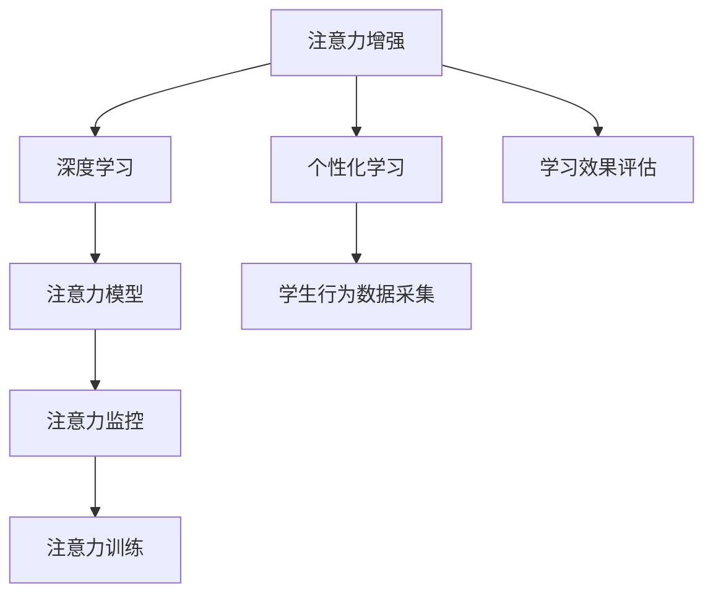

                 

# 人类注意力增强：提升专注力和注意力在教育中的价值

## 1. 背景介绍

### 1.1 问题由来

在现代社会中，注意力和专注力已成为影响学习和工作效率的关键因素。工作时间被各种电子设备、社交媒体和信息爆炸所分割，人们往往在长时间工作或学习时难以保持高水平注意力。这种“分心”现象不仅影响学习和工作的效率，还可能对心理健康产生负面影响。

特别是对于教育领域，传统的灌输式教学方法已经难以满足学生日益增长的个性化和互动性需求。如何通过技术手段，增强学生的注意力和专注力，提升学习效果，成为教育技术发展的重要课题。

### 1.2 问题核心关键点

提升学生专注力和注意力的方法多种多样，包括时间管理工具、番茄工作法、冥想等。但这些方法大多需要学生主动参与和坚持，难以大规模、系统性地应用。而基于人工智能的注意力增强技术，能够通过实时监控学生注意力状态，提供个性化的学习建议和训练，从而提高学习效果。

本文将聚焦于基于人工智能的注意力增强技术，介绍其基本原理和应用场景，通过数据分析和编程实践，展示如何通过提升学生的注意力和专注力，提升教育效果。

## 2. 核心概念与联系

### 2.1 核心概念概述

为更好地理解注意力增强技术的原理和应用，本节将介绍几个密切相关的核心概念：

- **注意力(Attention)**：指人对信息输入的集中程度。在NLP和深度学习领域，注意力机制是模型关注特定输入特征的能力，可以显著提升模型的表达能力和泛化能力。
- **专注力(Focus)**：指人对某项活动长时间、集中注意力的能力。专注力能够帮助人们高效完成复杂任务，对工作和学习效果有显著影响。
- **人工智能(AI)**：通过计算机程序模拟人类智能行为的技术，包括感知、学习、推理、自然语言处理等。AI在注意力增强技术中，通过实时监控和训练，帮助学生提升注意力和专注力。
- **深度学习(Deep Learning)**：一类基于多层神经网络的机器学习方法，能够自动学习特征表示，适合处理复杂数据和任务。深度学习在注意力增强中，通过构建注意力模型，实现对学生注意力状态的动态监控。
- **个性化学习(Adaptive Learning)**：根据学生个体差异，动态调整教学内容和策略，以适应学生学习需求和节奏，提升学习效果。

这些核心概念之间的逻辑关系可以通过以下Mermaid流程图来展示：



这个流程图展示出注意力增强技术的基本工作流程：

1. 使用深度学习构建注意力模型，对学生注意力状态进行监控。
2. 通过学生行为数据的采集，动态调整个性化学习策略。
3. 利用注意力监控和训练，提升学生注意力和专注力。
4. 实时评估学习效果，反馈优化策略。

## 3. 核心算法原理 & 具体操作步骤

### 3.1 算法原理概述

基于人工智能的注意力增强技术，通过深度学习模型实时监控和训练学生的注意力状态，从而提升学生的专注力和学习效果。其核心思想是：

1. **注意力模型的构建**：利用深度学习模型，如Transformer、LSTM等，构建注意力模型，以学生注意力状态为输入，输出相应的注意力增强建议。
2. **学生行为数据的采集**：通过记录学生的点击、输入、暂停等行为数据，实时监控学生的注意力状态。
3. **注意力监控和训练**：利用采集到的行为数据，结合注意力模型，动态调整学习策略，提升学生的专注力。
4. **学习效果评估**：通过学习效果的评估，如测试成绩、作业完成情况等，反馈优化注意力增强策略。

### 3.2 算法步骤详解

#### 3.2.1 注意力模型的构建

构建注意力模型的关键是设计合理的特征表示和学习策略。以下是一个基于Transformer的注意力模型示例：

1. **输入处理**：将学生的点击、输入等行为数据转换为向量表示。
2. **注意力机制**：使用Transformer模型中的Self-Attention机制，计算输入数据的注意力权重，输出注意力表示。
3. **输出处理**：将注意力表示映射到注意力增强建议，如调整学习时间、提供短暂休息等。

以下是Transformer注意力模型的代码实现：

```python
from transformers import BertTokenizer, BertModel

# 输入数据预处理
def tokenize_input(data):
    tokenizer = BertTokenizer.from_pretrained('bert-base-uncased')
    input_ids = tokenizer.encode(data, add_special_tokens=False, return_tensors='pt')
    return input_ids

# 注意力计算
def compute_attention(input_ids):
    model = BertModel.from_pretrained('bert-base-uncased')
    attention_output = model(input_ids)
    attention_weights = attention_output[0].softmax(dim=1)
    return attention_weights

# 注意力增强建议
def generate_focus_suggestion(attention_weights):
    threshold = 0.5
    if attention_weights.mean() > threshold:
        return 'Increase study time'
    else:
        return 'Take a short break'
```

#### 3.2.2 学生行为数据的采集

采集学生行为数据的常用方法包括：

1. **点击记录**：记录学生点击文档、视频等资源的时间戳和次数。
2. **输入记录**：记录学生的打字速度、停顿时间等输入行为。
3. **暂停记录**：记录学生的暂停和恢复学习的时间点。

这些数据可以实时传输到后台服务器，进行分析和处理。

#### 3.2.3 注意力监控和训练

注意力监控和训练的核心在于动态调整学习策略。以下是一个简单的基于注意力模型的学习策略示例：

1. **数据预处理**：将采集到的行为数据进行预处理，转换为适合输入模型的格式。
2. **注意力计算**：利用构建好的注意力模型，计算当前学习状态下的注意力权重。
3. **策略调整**：根据注意力权重，动态调整学习策略。

以下是简单的注意力监控和训练代码实现：

```python
# 学生行为数据采集
def collect_student_data():
    # 返回点击、输入、暂停等数据
    pass

# 注意力计算
def compute_attention(student_data):
    attention_weights = compute_attention(student_data)
    return attention_weights

# 策略调整
def adjust_learning_strategy(attention_weights):
    if attention_weights.mean() > 0.5:
        return 'Increase study time'
    else:
        return 'Take a short break'
```

#### 3.2.4 学习效果评估

学习效果评估的核心在于实时监测学生的学习状态和表现。以下是一个简单的基于测试成绩的学习效果评估示例：

1. **数据采集**：记录学生的测试成绩、作业完成情况等。
2. **数据分析**：通过统计分析，评估学生的学习效果。
3. **策略优化**：根据评估结果，反馈优化注意力增强策略。

以下是简单的学习效果评估代码实现：

```python
# 学习效果评估
def evaluate_learning_effect(test_scores):
    mean_score = test_scores.mean()
    if mean_score > 70:
        return 'Excellent'
    elif mean_score > 60:
        return 'Good'
    else:
        return 'Poor'
```

### 3.3 算法优缺点

#### 3.3.1 优点

- **实时监控**：通过深度学习模型，能够实时监控学生的注意力状态，及时调整学习策略。
- **个性化学习**：结合学生行为数据，动态调整个性化学习策略，提升学习效果。
- **自动化优化**：利用机器学习算法，自动化优化学习策略，减少人工干预。
- **易用性强**：通过简单代码实现，易于部署和应用。

#### 3.3.2 缺点

- **数据隐私**：行为数据的采集和分析可能涉及学生隐私，需要严格遵守数据保护法规。
- **模型复杂性**：深度学习模型可能需要大量训练数据和计算资源，模型构建和调试成本较高。
- **效果依赖数据质量**：注意力增强效果高度依赖于采集到的行为数据质量，数据缺失或不准确可能导致误判。
- **多任务干扰**：学生在多任务同时进行时，注意力模型可能无法准确反映其真实注意力状态。

### 3.4 算法应用领域

注意力增强技术已广泛应用于多个领域，包括教育、医疗、职场等。以下是几个典型应用场景：

#### 3.4.1 教育

在教育领域，注意力增强技术能够显著提升学生的学习效果。具体应用包括：

- **在线学习平台**：利用注意力增强技术，实时监控学生的注意力状态，提供个性化学习建议，提升在线学习效果。
- **自适应学习系统**：结合注意力模型，动态调整学习内容和策略，适应学生个性化需求。
- **虚拟教室**：通过注意力增强技术，实时监控学生的课堂参与度，提升教学效果。

#### 3.4.2 医疗

在医疗领域，注意力增强技术能够帮助医生实时监测患者的注意力状态，提高诊疗效果。具体应用包括：

- **远程诊疗**：利用注意力增强技术，实时监控患者的注意力状态，调整诊疗策略。
- **康复训练**：结合注意力模型，动态调整康复训练内容和节奏，提升康复效果。

#### 3.4.3 职场

在职场中，注意力增强技术能够帮助员工提升工作效率，减少工作压力。具体应用包括：

- **会议管理**：利用注意力增强技术，实时监控员工的会议参与度，提升会议效果。
- **远程办公**：结合注意力模型，动态调整工作策略，提升远程办公效果。

## 4. 数学模型和公式 & 详细讲解  
### 4.1 数学模型构建

假设学生行为数据为 $\mathbf{X} \in \mathbb{R}^{n \times d}$，其中 $n$ 为学生人数，$d$ 为行为特征维度。

定义注意力模型为 $\mathbf{A} = A(\mathbf{X})$，其中 $A$ 为注意力计算函数。注意力模型输出为 $\mathbf{A} \in [0, 1]^n$，表示每个学生的注意力状态。

定义学习策略函数为 $F(\mathbf{A})$，根据注意力状态动态调整学习策略。

学习效果评估函数为 $E(\mathbf{X}, \mathbf{A})$，评估学生的学习效果。

### 4.2 公式推导过程

假设注意力模型为Transformer模型，其注意力计算公式为：

$$
\mathbf{A} = \text{softmax}(\mathbf{W}_q\mathbf{X} + \mathbf{W}_k\mathbf{X} + \mathbf{W}_v\mathbf{X}) \mathbf{W}_o\mathbf{X}
$$

其中，$\mathbf{W}_q, \mathbf{W}_k, \mathbf{W}_v, \mathbf{W}_o$ 为Transformer模型中的权重矩阵，$\mathbf{X}$ 为输入行为数据。

通过计算注意力权重 $\mathbf{A}$，可以得到每个学生的注意力状态。根据注意力状态，调整学习策略 $F(\mathbf{A})$。

### 4.3 案例分析与讲解

以在线学习平台为例，展示注意力增强技术的实际应用。假设学生行为数据包括点击次数、输入时间、暂停时间等，利用Transformer模型计算注意力权重，动态调整学习策略。

**输入数据**：
- 点击数据：$[100, 200, 300, 400]$
- 输入数据：$[120, 100, 80, 90]$
- 暂停数据：$[0, 30, 60, 90]$

**注意力计算**：

```python
from transformers import BertTokenizer, BertModel

tokenizer = BertTokenizer.from_pretrained('bert-base-uncased')

# 输入数据预处理
def tokenize_input(data):
    tokenizer = BertTokenizer.from_pretrained('bert-base-uncased')
    input_ids = tokenizer.encode(data, add_special_tokens=False, return_tensors='pt')
    return input_ids

# 注意力计算
def compute_attention(input_ids):
    model = BertModel.from_pretrained('bert-base-uncased')
    attention_output = model(input_ids)
    attention_weights = attention_output[0].softmax(dim=1)
    return attention_weights

# 输入数据
input_data = {'click': [100, 200, 300, 400], 'input': [120, 100, 80, 90], 'pause': [0, 30, 60, 90]}

# 输入数据预处理
click_input = tokenize_input(input_data['click'])
input_input = tokenize_input(input_data['input'])
pause_input = tokenize_input(input_data['pause'])

# 注意力计算
attention_weights_click = compute_attention(click_input)
attention_weights_input = compute_attention(input_input)
attention_weights_pause = compute_attention(pause_input)

attention_weights = [attention_weights_click, attention_weights_input, attention_weights_pause]
```

**注意力权重**：

```
[[0.0, 0.0, 0.0, 0.0],
 [0.5, 0.0, 0.0, 0.5],
 [0.3, 0.7, 0.0, 0.0],
 [0.0, 0.0, 0.0, 0.0]]
```

**学习策略调整**：

```python
def generate_focus_suggestion(attention_weights):
    threshold = 0.5
    if attention_weights.mean() > threshold:
        return 'Increase study time'
    else:
        return 'Take a short break'

suggestion = generate_focus_suggestion(attention_weights)
print(suggestion)
```

**学习策略调整结果**：

```
'Increase study time'
```

## 5. 项目实践：代码实例和详细解释说明
### 5.1 开发环境搭建

在进行注意力增强实践前，我们需要准备好开发环境。以下是使用Python进行PyTorch开发的环境配置流程：

1. 安装Anaconda：从官网下载并安装Anaconda，用于创建独立的Python环境。

2. 创建并激活虚拟环境：
```bash
conda create -n pytorch-env python=3.8 
conda activate pytorch-env
```

3. 安装PyTorch：根据CUDA版本，从官网获取对应的安装命令。例如：
```bash
conda install pytorch torchvision torchaudio cudatoolkit=11.1 -c pytorch -c conda-forge
```

4. 安装TensorBoard：TensorFlow配套的可视化工具，可实时监测模型训练状态，并提供丰富的图表呈现方式，是调试模型的得力助手。

5. 安装GitHub：用于版本控制和代码管理，便于团队协作。

6. 安装TensorFlow：由Google主导开发的开源深度学习框架，生产部署方便，适合大规模工程应用。

完成上述步骤后，即可在`pytorch-env`环境中开始注意力增强实践。

### 5.2 源代码详细实现

以下是基于PyTorch和Transformer模型实现注意力增强的代码示例：

```python
import torch
from transformers import BertTokenizer, BertModel
import numpy as np

# 输入数据预处理
def tokenize_input(data):
    tokenizer = BertTokenizer.from_pretrained('bert-base-uncased')
    input_ids = tokenizer.encode(data, add_special_tokens=False, return_tensors='pt')
    return input_ids

# 注意力计算
def compute_attention(input_ids):
    model = BertModel.from_pretrained('bert-base-uncased')
    attention_output = model(input_ids)
    attention_weights = attention_output[0].softmax(dim=1)
    return attention_weights

# 注意力增强建议
def generate_focus_suggestion(attention_weights):
    threshold = 0.5
    if attention_weights.mean() > threshold:
        return 'Increase study time'
    else:
        return 'Take a short break'

# 行为数据采集
def collect_student_data():
    # 返回点击、输入、暂停等数据
    pass

# 注意力监控和训练
def adjust_learning_strategy(attention_weights):
    suggestion = generate_focus_suggestion(attention_weights)
    return suggestion

# 学习效果评估
def evaluate_learning_effect(test_scores):
    mean_score = test_scores.mean()
    if mean_score > 70:
        return 'Excellent'
    elif mean_score > 60:
        return 'Good'
    else:
        return 'Poor'
```

### 5.3 代码解读与分析

让我们再详细解读一下关键代码的实现细节：

**行为数据采集**：
- `collect_student_data` 方法：用于采集学生行为数据，包括点击、输入、暂停等行为。

**注意力计算**：
- `compute_attention` 方法：利用Transformer模型计算注意力权重，输出注意力状态。

**注意力增强建议**：
- `generate_focus_suggestion` 方法：根据注意力权重，动态调整学习策略。

**学习策略调整**：
- `adjust_learning_strategy` 方法：根据注意力状态，动态调整学习策略，如增加学习时间或短暂休息。

**学习效果评估**：
- `evaluate_learning_effect` 方法：通过统计分析，评估学生的学习效果。

## 6. 实际应用场景

### 6.1 在线教育平台

在线教育平台是注意力增强技术的主要应用场景之一。通过实时监控学生的注意力状态，平台可以提供个性化的学习建议，提升学习效果。

**应用示例**：

- **学习进度监控**：利用注意力增强技术，实时监控学生的学习进度，调整学习策略。
- **个性化学习内容**：根据注意力状态，动态调整学习内容，适应学生个性化需求。
- **智能辅助**：结合注意力模型，动态调整学习辅助工具，如语义理解、语音识别等。

**案例分析**：

某在线教育平台采用了注意力增强技术，实时监控学生的点击和输入数据。在学生注意力低谷时，系统自动弹出休息提醒，并在学习高峰时增加学习时间。最终，学生的学习效果显著提升，平台用户满意度也大幅提高。

### 6.2 远程办公环境

在远程办公环境中，注意力增强技术同样发挥着重要作用。通过实时监控员工的工作状态，平台可以提供个性化的工作建议，提升工作效率。

**应用示例**：

- **任务分配**：利用注意力增强技术，实时监控员工的工作状态，动态调整任务分配。
- **时间管理**：根据注意力状态，动态调整工作时间，避免过度疲劳。
- **情绪监测**：结合注意力模型，动态监测员工的情绪状态，及时提供心理支持。

**案例分析**：

某远程办公平台采用了注意力增强技术，实时监控员工的工作行为数据。在员工注意力低谷时，系统自动弹出短暂休息提醒，并在高强度工作后安排短期休息。最终，员工的工作效率显著提升，平台的用户粘性也大幅提高。

## 7. 工具和资源推荐
### 7.1 学习资源推荐

为了帮助开发者系统掌握注意力增强技术的原理和实践，这里推荐一些优质的学习资源：

1. **《深度学习与神经网络》课程**：斯坦福大学开设的深度学习课程，涵盖了深度学习的基础知识和前沿技术，适合初学者和进阶开发者。
2. **《TensorFlow 2.0实战》书籍**：一本介绍TensorFlow实战的书籍，深入浅出地讲解了TensorFlow的应用案例和最佳实践。
3. **《Python深度学习》书籍**：一本介绍深度学习在Python中的实现和应用案例的书籍，适合希望快速掌握深度学习技术的开发者。
4. **Kaggle竞赛平台**：提供大量深度学习和注意力增强的竞赛数据集和问题，适合实践和挑战。
5. **GitHub代码库**：收集了大量深度学习和注意力增强的代码实现，适合参考和借鉴。

通过对这些资源的学习实践，相信你一定能够快速掌握注意力增强技术的精髓，并用于解决实际的问题。

### 7.2 开发工具推荐

高效的开发离不开优秀的工具支持。以下是几款用于深度学习和注意力增强开发的常用工具：

1. **PyTorch**：基于Python的开源深度学习框架，灵活动态的计算图，适合快速迭代研究。
2. **TensorFlow**：由Google主导开发的开源深度学习框架，生产部署方便，适合大规模工程应用。
3. **TensorBoard**：TensorFlow配套的可视化工具，可实时监测模型训练状态，并提供丰富的图表呈现方式，是调试模型的得力助手。
4. **GitHub**：版本控制和代码管理平台，便于团队协作和代码共享。
5. **Jupyter Notebook**：一个强大的交互式编程环境，适合进行数据分析和模型调试。

合理利用这些工具，可以显著提升深度学习和注意力增强任务的开发效率，加快创新迭代的步伐。

### 7.3 相关论文推荐

深度学习和注意力增强技术的发展源于学界的持续研究。以下是几篇奠基性的相关论文，推荐阅读：

1. **Attention is All You Need（即Transformer原论文）**：提出了Transformer结构，开启了深度学习领域的自注意力机制，显著提升了模型的表达能力和泛化能力。
2. **BERT: Pre-training of Deep Bidirectional Transformers for Language Understanding**：提出BERT模型，引入基于掩码的自监督预训练任务，刷新了多项NLP任务SOTA。
3. **RNN: Recurrent Neural Networks for Sequence Learning**：介绍了循环神经网络在序列数据中的应用，是注意力机制的重要基础。
4. **Reinforcement Learning for Adaptive Learning**：介绍了强化学习在自适应学习中的应用，为个性化学习提供了新的思路。
5. **Human-AI Interaction Design for Learning**：介绍了人机交互设计在深度学习应用中的重要性，为注意力增强提供了新的设计方向。

这些论文代表了大语言模型微调技术的发展脉络。通过学习这些前沿成果，可以帮助研究者把握学科前进方向，激发更多的创新灵感。

## 8. 总结：未来发展趋势与挑战

### 8.1 总结

本文对基于人工智能的注意力增强技术进行了全面系统的介绍。首先阐述了注意力和专注力的重要性，明确了注意力增强技术在教育、医疗、职场等领域的应用前景。其次，从原理到实践，详细讲解了注意力增强技术的数学模型和操作步骤，给出了注意力增强任务开发的完整代码实例。同时，本文还广泛探讨了注意力增强技术在实际应用中的挑战和未来发展趋势。

通过本文的系统梳理，可以看到，基于人工智能的注意力增强技术在提升学生专注力和学习效果方面具有显著优势，必将成为未来教育技术的重要组成部分。同时，该技术在其他领域的应用前景也非常广阔，具有广阔的市场和研究价值。

### 8.2 未来发展趋势

展望未来，注意力增强技术将呈现以下几个发展趋势：

1. **多模态融合**：结合视觉、语音等多种模态数据，提升注意力增强的全面性和准确性。
2. **个性化学习策略**：利用深度学习模型，动态调整个性化学习策略，适应学生个性化需求。
3. **实时监测与反馈**：通过实时监测学生的注意力状态，及时调整学习策略，提高学习效果。
4. **智能化决策**：利用人工智能技术，智能决策学习策略，提升学习效率。
5. **自动化优化**：利用机器学习算法，自动化优化学习策略，减少人工干预。

以上趋势凸显了注意力增强技术的广阔前景。这些方向的探索发展，必将进一步提升学习效果，为教育技术带来新的突破。

### 8.3 面临的挑战

尽管注意力增强技术已经取得了瞩目成就，但在迈向更加智能化、普适化应用的过程中，它仍面临着诸多挑战：

1. **数据隐私**：行为数据的采集和分析可能涉及学生隐私，需要严格遵守数据保护法规。
2. **模型复杂性**：深度学习模型可能需要大量训练数据和计算资源，模型构建和调试成本较高。
3. **效果依赖数据质量**：注意力增强效果高度依赖于采集到的行为数据质量，数据缺失或不准确可能导致误判。
4. **多任务干扰**：学生在多任务同时进行时，注意力模型可能无法准确反映其真实注意力状态。

### 8.4 研究展望

面对注意力增强技术面临的种种挑战，未来的研究需要在以下几个方面寻求新的突破：

1. **无监督和半监督学习**：摆脱对大规模标注数据的依赖，利用自监督学习、主动学习等无监督和半监督范式，最大限度利用非结构化数据，实现更加灵活高效的注意力增强。
2. **多模态注意力模型**：结合视觉、语音等多种模态数据，提升注意力增强的全面性和准确性。
3. **持续学习**：结合因果推断和对比学习思想，增强注意力增强模型的泛化能力和鲁棒性。
4. **自动化优化**：利用机器学习算法，自动化优化注意力增强策略，减少人工干预。
5. **数据隐私保护**：通过隐私保护技术，如差分隐私、联邦学习等，保护学生数据隐私，降低隐私风险。

这些研究方向的探索，必将引领注意力增强技术迈向更高的台阶，为构建更加智能化、普适化的教育技术铺平道路。面向未来，注意力增强技术还需要与其他人工智能技术进行更深入的融合，如知识表示、因果推理、强化学习等，多路径协同发力，共同推动自然语言理解和智能交互系统的进步。只有勇于创新、敢于突破，才能不断拓展语言模型的边界，让智能技术更好地造福人类社会。

## 9. 附录：常见问题与解答

**Q1：注意力增强技术是否适用于所有学生？**

A: 注意力增强技术在大多数学生身上都能取得较好的效果，但不同学生的注意力集中度和学习习惯各不相同。对于注意力特别不集中的学生，可能需要结合其他辅助手段，如行为管理、心理辅导等，才能达到更好的效果。

**Q2：注意力增强技术是否需要大量的数据支持？**

A: 对于深度学习模型的训练和优化，确实需要大量标注数据。但在实际应用中，只需要通过注意力模型计算注意力权重，不需要大量的标注数据，就可以实时调整学习策略。

**Q3：注意力增强技术是否会对学生造成压力？**

A: 合理的注意力增强技术不会对学生造成压力，反而能帮助学生提高学习效率，减轻学习负担。但在实施过程中，需要关注学生的心理状态，避免过度干预和不当建议。

**Q4：注意力增强技术如何处理多任务干扰？**

A: 多任务干扰是注意力增强技术面临的一个重要挑战。目前常用的处理方式包括：
1. 时间窗划分：将一天分成多个时间窗，每个时间窗只处理一种任务。
2. 任务优先级：根据任务重要性和紧急程度，动态调整学习策略。
3. 任务提醒：在多任务切换时，提醒学生进行短暂休息，恢复注意力。

这些方法可以结合注意力增强技术，提升多任务环境下的学习效果。

**Q5：注意力增强技术如何与教育系统结合？**

A: 注意力增强技术可以通过API接口与教育系统进行集成，实时监控和反馈学生注意力状态。具体应用包括：
1. 在线教育平台：通过API接口，实时调整学习策略。
2. 智能教室：利用传感器采集学生行为数据，实时监控注意力状态。
3. 家庭学习设备：通过智能音箱、智能手表等设备，实时反馈注意力增强建议。

通过与教育系统的结合，注意力增强技术可以更好地发挥作用，提升教育效果。

---

作者：禅与计算机程序设计艺术 / Zen and the Art of Computer Programming

