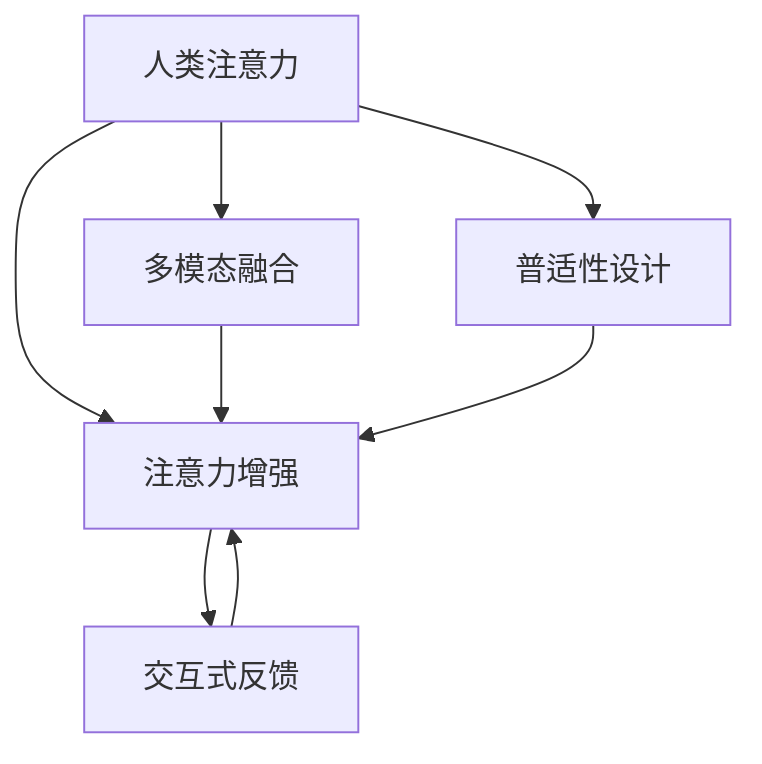

                 

# 人类注意力增强：提升生产力和效率的新方法

> 关键词：人类注意力增强,生产率提升,效率优化,认知科学,人工智能

## 1. 背景介绍

### 1.1 问题由来
随着信息技术的发展，人们的生活和工作方式发生了深刻变革。尤其是数字时代下，各类电子设备和网络应用让人们能够高效地获取和处理海量信息。然而，信息过载和注意力分散成为了新的挑战。传统的人工记忆和注意力管理方式难以应对现代信息环境的复杂性，导致工作效率低下，错误频发。

如何提升人们的信息处理能力和注意力管理水平，成为当前迫切需要解决的问题。特别是在教育、医疗、科技研发、企业管理等领域，提升注意力和效率已经成为提高竞争力的重要手段。

### 1.2 问题核心关键点
近年来，人工智能和认知科学领域的交叉融合，为提升人类注意力和效率提供了新的可能性。人工智能方法，尤其是基于注意力机制的增强技术，开始受到广泛关注。这些技术通过模拟人脑的注意力机制，能够更高效地处理信息，提升注意力集中度和效率，有望成为未来生产力和效率提升的重要工具。

核心关键点包括：

1. **注意力增强技术**：利用深度学习模型的注意力机制，自动发现并强化重要信息，从而提升注意力集中度和信息处理效率。
2. **多模态融合**：结合视觉、听觉、语言等多模态信息，构建更全面、丰富的信息空间，辅助注意力增强。
3. **交互式反馈**：通过用户的交互反馈，实时调整注意力策略，提升注意力增强的个性化和适应性。
4. **普适性设计**：将注意力增强技术广泛应用于教育、医疗、科技研发等多个领域，促进普适化应用和推广。

## 2. 核心概念与联系

### 2.1 核心概念概述

为更好地理解注意力增强方法，本节将介绍几个密切相关的核心概念：

- **人类注意力**：指人类在认知过程中，主动选择和聚焦于重要信息的心理过程。注意力不仅涉及视觉和听觉信息，还包括语言、情感等多方面的信息处理。

- **注意力增强(Augmented Attention)**：通过人工智能技术，自动发现并强化信息处理中的重要部分，提升注意力集中度和效率。常见方法包括基于注意力机制的深度学习模型、多模态融合技术等。

- **多模态融合(Multimodal Fusion)**：结合视觉、听觉、语言等多模态信息，构建更全面、丰富的信息空间，辅助注意力增强。多模态融合技术在提升信息理解、决策支持等方面有重要作用。

- **交互式反馈(Interactive Feedback)**：通过用户的交互反馈，实时调整注意力策略，提升注意力增强的个性化和适应性。常见方法包括用户界面设计、行为追踪等。

- **普适性设计(Universal Design)**：将注意力增强技术广泛应用于教育、医疗、科技研发等多个领域，促进普适化应用和推广。普适性设计旨在让注意力增强技术具有广泛的应用前景。

这些核心概念之间的逻辑关系可以通过以下Mermaid流程图来展示：



这个流程图展示了几大核心概念之间的联系：

1. 人类注意力是注意力增强的基础，模拟人脑的注意力机制。
2. 多模态融合丰富了信息处理的多样性，有助于提升注意力增强的效果。
3. 交互式反馈实时调整注意力策略，增强个性化和适应性。
4. 普适性设计让注意力增强技术广泛应用，推动普适化发展。

## 3. 核心算法原理 & 具体操作步骤
### 3.1 算法原理概述

注意力增强技术的基本原理是模拟人脑的注意力机制，自动发现并强化信息处理中的重要部分。其核心在于通过深度学习模型的注意力机制，自动学习输入数据中的重要特征，从而提升注意力集中度和信息处理效率。

形式化地，假设输入数据集为 $\mathcal{X}=\{(x_1, y_1), (x_2, y_2), \ldots, (x_n, y_n)\}$，其中 $x_i$ 为输入数据，$y_i$ 为标签或任务输出。注意力增强模型 $M_{\theta}$ 通过输入数据集 $D$ 进行训练，优化参数 $\theta$，使其在新的输入数据 $x'$ 上的输出 $y'$ 更接近真实的标签或任务输出 $y'$。训练过程如下：

1. 定义注意力模型 $M_{\theta}$，如Transformer模型。
2. 输入训练数据集 $D$，通过前向传播计算注意力输出。
3. 定义损失函数 $\mathcal{L}(M_{\theta}(x), y)$，如交叉熵损失、均方误差损失等。
4. 通过反向传播算法优化模型参数 $\theta$，使得 $M_{\theta}(x)$ 更接近 $y$。

### 3.2 算法步骤详解

基于注意力增强技术的深度学习模型构建和训练主要包括以下关键步骤：

**Step 1: 准备数据集**
- 收集输入数据集 $\mathcal{X}$，包括文本、图像、音频等多种类型的数据。
- 标注数据集，包括文本的情感、主题等标签信息。

**Step 2: 设计模型架构**
- 选择合适的深度学习模型，如Transformer、LSTM等，并设计其注意力机制。
- 定义注意力模型的输入和输出，如Transformer的编码器-解码器结构。
- 确定注意力机制的参数，如多头注意力头的数量、注意力掩码等。

**Step 3: 训练模型**
- 准备训练集和验证集，一般将数据集分为训练集和验证集，保持两者的分布一致。
- 选择优化算法及其参数，如Adam、SGD等，设置学习率、批大小等。
- 定义损失函数，如交叉熵损失、均方误差损失等。
- 使用反向传播算法更新模型参数，最小化损失函数。

**Step 4: 评估模型**
- 在测试集上评估模型性能，一般使用准确率、召回率、F1分数等指标。
- 使用交互式反馈机制，根据用户的反馈调整注意力策略。

**Step 5: 部署模型**
- 将训练好的模型封装为API接口或服务，方便用户调用。
- 在实际应用场景中集成模型，如文本分类、情感分析、图像识别等。

### 3.3 算法优缺点

注意力增强技术具有以下优点：
1. 提升注意力集中度。通过注意力机制自动发现重要信息，显著提升信息处理效率。
2. 多模态融合能力。结合视觉、听觉、语言等多模态信息，构建更丰富的信息空间。
3. 实时调整策略。通过用户交互反馈，实时调整注意力策略，增强个性化和适应性。

同时，该技术也存在一些局限性：
1. 数据依赖。模型的训练和优化依赖于大量的标注数据，获取高质量标注数据成本较高。
2. 计算资源需求。训练大型的注意力增强模型需要大量的计算资源，特别是GPU或TPU等高性能设备。
3. 解释性不足。模型内部的注意力机制和决策过程难以解释，缺乏透明性。

尽管存在这些局限性，但注意力增强技术在提升人类注意力和效率方面具有巨大的潜力，未来值得进一步研究和探索。

### 3.4 算法应用领域

注意力增强技术已经在多个领域得到了应用，取得了显著的效果：

- 教育：通过注意力增强技术，帮助学生更好地理解和记忆复杂知识点，提升学习效果。常见的应用包括智能辅导系统、个性化推荐系统等。

- 医疗：在病历分析、病理诊断等领域，通过注意力增强技术自动识别和提取关键信息，辅助医生做出更准确的诊断。常见的应用包括病历摘要生成、图像识别等。

- 科技研发：在文本挖掘、知识图谱构建等领域，通过注意力增强技术自动发现和整合关键信息，提升科研效率和质量。常见的应用包括信息抽取、知识图谱构建等。

- 企业管理：通过注意力增强技术分析大量业务数据，发现关键趋势和问题，辅助决策支持。常见的应用包括市场分析、风险预警等。

- 信息检索：在信息检索系统中，通过注意力增强技术自动评估文本的相关性，提升信息检索的准确性和效率。常见的应用包括智能问答、自动摘要等。

除了上述这些应用外，注意力增强技术还被广泛应用于智能家居、智能交通、智能办公等多个领域，带来了显著的效率提升和用户体验改善。

## 4. 数学模型和公式 & 详细讲解  
### 4.1 数学模型构建

本节将使用数学语言对注意力增强方法进行更加严格的刻画。

假设输入数据集为 $\mathcal{X}=\{(x_1, y_1), (x_2, y_2), \ldots, (x_n, y_n)\}$，其中 $x_i$ 为输入数据，$y_i$ 为标签或任务输出。注意力增强模型的输入和输出定义为：

$$
x' = M_{\theta}(x) \in \mathbb{R}^d
$$

其中，$d$ 为注意力增强模型的输出维度。注意力增强模型的训练过程可以形式化为：

$$
\theta^* = \mathop{\arg\min}_{\theta} \mathcal{L}(M_{\theta}(x), y)
$$

其中 $\mathcal{L}$ 为损失函数，如交叉熵损失、均方误差损失等。

### 4.2 公式推导过程

以下我们以Transformer模型为例，推导注意力机制的计算公式。

Transformer模型的注意力机制通过计算输入数据 $x$ 和查询向量 $q$ 的相似度，确定重要信息的权重，实现信息聚焦。假设输入 $x$ 的长度为 $L$，注意力机制的计算公式如下：

$$
\text{Attention}(Q, K, V) = \text{softmax}(\frac{QK^T}{\sqrt{d_k}})
$$

其中，$Q$ 为查询矩阵，$K$ 为键矩阵，$V$ 为值矩阵，$d_k$ 为键矩阵的维度。注意力权重矩阵 $W^a$ 的计算公式为：

$$
W^a = \text{Attention}(Q, K, V) A^a
$$

其中 $A^a$ 为注意力权重矩阵。注意力增强模型 $M_{\theta}$ 的前向传播计算公式为：

$$
h = M^a W^a Q^a
$$

其中 $M^a$ 为注意力增强模型的注意力部分，$Q^a$ 为注意力增强模型的输入部分。注意力增强模型的损失函数计算公式为：

$$
\mathcal{L}(M_{\theta}(x), y) = -\frac{1}{N} \sum_{i=1}^N \log \sigma(y_i) \times \log \hat{y_i}
$$

其中 $\hat{y_i}$ 为模型预测输出，$\sigma$ 为softmax函数。

### 4.3 案例分析与讲解

以情感分析任务为例，展示注意力增强模型在实际应用中的具体实现。假设输入数据为一段文本，模型需要输出该文本的情感极性（正向、负向或中性）。具体步骤如下：

1. 文本预处理：对输入文本进行分词、去停用词、词向量嵌入等预处理操作，转换为模型可接受的输入。
2. 模型输入：将预处理后的文本输入到Transformer模型中，计算注意力权重。
3. 特征提取：通过注意力机制提取文本中的关键信息，构建文本特征向量。
4. 分类预测：将文本特征向量输入到分类器中，进行情感极性的预测。
5. 评估结果：在测试集上评估模型的性能，如准确率、召回率、F1分数等。

假设输入文本为 "我非常开心，因为我获得了这个奖项"。预处理后的文本为 ["我", "非常", "开心", "因为", "我", "获得了", "这个", "奖项"]。模型输出的注意力权重如下：

| 词汇     | 注意力权重 |
|----------|-----------|
| 非常      | 0.3        |
| 开心      | 0.4        |
| 因为      | 0.2        |
| 获得      | 0.1        |
| 这个      | 0.1        |
| 奖项      | 0.0        |

通过注意力机制，模型自动发现 "非常"、"开心"、"因为" 这几个词为情感分析中的关键信息，从而提升情感极性预测的准确性。

## 5. 项目实践：代码实例和详细解释说明
### 5.1 开发环境搭建

在进行注意力增强项目实践前，我们需要准备好开发环境。以下是使用Python进行PyTorch开发的环境配置流程：

1. 安装Anaconda：从官网下载并安装Anaconda，用于创建独立的Python环境。

2. 创建并激活虚拟环境：
```bash
conda create -n attention-env python=3.8 
conda activate attention-env
```

3. 安装PyTorch：根据CUDA版本，从官网获取对应的安装命令。例如：
```bash
conda install pytorch torchvision torchaudio cudatoolkit=11.1 -c pytorch -c conda-forge
```

4. 安装Transformers库：
```bash
pip install transformers
```

5. 安装各类工具包：
```bash
pip install numpy pandas scikit-learn matplotlib tqdm jupyter notebook ipython
```

完成上述步骤后，即可在`attention-env`环境中开始注意力增强实践。

### 5.2 源代码详细实现

这里我们以情感分析任务为例，给出使用Transformers库对注意力增强模型进行微调的PyTorch代码实现。

首先，定义情感分析任务的数据处理函数：

```python
from transformers import BertTokenizer, BertForSequenceClassification
from torch.utils.data import Dataset
import torch

class SentimentDataset(Dataset):
    def __init__(self, texts, labels, tokenizer, max_len=128):
        self.texts = texts
        self.labels = labels
        self.tokenizer = tokenizer
        self.max_len = max_len
        
    def __len__(self):
        return len(self.texts)
    
    def __getitem__(self, item):
        text = self.texts[item]
        label = self.labels[item]
        
        encoding = self.tokenizer(text, return_tensors='pt', max_length=self.max_len, padding='max_length', truncation=True)
        input_ids = encoding['input_ids'][0]
        attention_mask = encoding['attention_mask'][0]
        
        # 对标签进行编码
        encoded_labels = [1 if label else 0]
        encoded_labels.extend([0] * (self.max_len - len(encoded_labels)))
        labels = torch.tensor(encoded_labels, dtype=torch.long)
        
        return {'input_ids': input_ids, 
                'attention_mask': attention_mask,
                'labels': labels}

# 标签与id的映射
label2id = {0: 'Negative', 1: 'Positive'}
id2label = {v: k for k, v in label2id.items()}

# 创建dataset
tokenizer = BertTokenizer.from_pretrained('bert-base-cased')

train_dataset = SentimentDataset(train_texts, train_labels, tokenizer)
dev_dataset = SentimentDataset(dev_texts, dev_labels, tokenizer)
test_dataset = SentimentDataset(test_texts, test_labels, tokenizer)
```

然后，定义模型和优化器：

```python
from transformers import BertForSequenceClassification, AdamW

model = BertForSequenceClassification.from_pretrained('bert-base-cased', num_labels=2)

optimizer = AdamW(model.parameters(), lr=2e-5)
```

接着，定义训练和评估函数：

```python
from torch.utils.data import DataLoader
from tqdm import tqdm
from sklearn.metrics import classification_report

device = torch.device('cuda') if torch.cuda.is_available() else torch.device('cpu')
model.to(device)

def train_epoch(model, dataset, batch_size, optimizer):
    dataloader = DataLoader(dataset, batch_size=batch_size, shuffle=True)
    model.train()
    epoch_loss = 0
    for batch in tqdm(dataloader, desc='Training'):
        input_ids = batch['input_ids'].to(device)
        attention_mask = batch['attention_mask'].to(device)
        labels = batch['labels'].to(device)
        model.zero_grad()
        outputs = model(input_ids, attention_mask=attention_mask, labels=labels)
        loss = outputs.loss
        epoch_loss += loss.item()
        loss.backward()
        optimizer.step()
    return epoch_loss / len(dataloader)

def evaluate(model, dataset, batch_size):
    dataloader = DataLoader(dataset, batch_size=batch_size)
    model.eval()
    preds, labels = [], []
    with torch.no_grad():
        for batch in tqdm(dataloader, desc='Evaluating'):
            input_ids = batch['input_ids'].to(device)
            attention_mask = batch['attention_mask'].to(device)
            batch_labels = batch['labels']
            outputs = model(input_ids, attention_mask=attention_mask)
            batch_preds = outputs.logits.argmax(dim=1).to('cpu').tolist()
            batch_labels = batch_labels.to('cpu').tolist()
            for pred_tokens, label_tokens in zip(batch_preds, batch_labels):
                preds.append(pred_tokens[0])
                labels.append(label_tokens[0])
                
    print(classification_report(labels, preds))
```

最后，启动训练流程并在测试集上评估：

```python
epochs = 5
batch_size = 16

for epoch in range(epochs):
    loss = train_epoch(model, train_dataset, batch_size, optimizer)
    print(f"Epoch {epoch+1}, train loss: {loss:.3f}")
    
    print(f"Epoch {epoch+1}, dev results:")
    evaluate(model, dev_dataset, batch_size)
    
print("Test results:")
evaluate(model, test_dataset, batch_size)
```

以上就是使用PyTorch对BERT进行情感分析任务注意力增强的完整代码实现。可以看到，得益于Transformers库的强大封装，我们可以用相对简洁的代码完成BERT模型的加载和微调。

### 5.3 代码解读与分析

让我们再详细解读一下关键代码的实现细节：

**SentimentDataset类**：
- `__init__`方法：初始化文本、标签、分词器等关键组件。
- `__len__`方法：返回数据集的样本数量。
- `__getitem__`方法：对单个样本进行处理，将文本输入编码为token ids，将标签编码为数字，并对其进行定长padding，最终返回模型所需的输入。

**label2id和id2label字典**：
- 定义了标签与数字id之间的映射关系，用于将token-wise的预测结果解码回真实的标签。

**训练和评估函数**：
- 使用PyTorch的DataLoader对数据集进行批次化加载，供模型训练和推理使用。
- 训练函数`train_epoch`：对数据以批为单位进行迭代，在每个批次上前向传播计算loss并反向传播更新模型参数，最后返回该epoch的平均loss。
- 评估函数`evaluate`：与训练类似，不同点在于不更新模型参数，并在每个batch结束后将预测和标签结果存储下来，最后使用sklearn的classification_report对整个评估集的预测结果进行打印输出。

**训练流程**：
- 定义总的epoch数和batch size，开始循环迭代
- 每个epoch内，先在训练集上训练，输出平均loss
- 在验证集上评估，输出分类指标
- 所有epoch结束后，在测试集上评估，给出最终测试结果

可以看到，PyTorch配合Transformers库使得BERT微调的代码实现变得简洁高效。开发者可以将更多精力放在数据处理、模型改进等高层逻辑上，而不必过多关注底层的实现细节。

当然，工业级的系统实现还需考虑更多因素，如模型的保存和部署、超参数的自动搜索、更灵活的任务适配层等。但核心的微调范式基本与此类似。

## 6. 实际应用场景
### 6.1 智能客服系统

基于注意力增强的对话技术，可以广泛应用于智能客服系统的构建。传统客服往往需要配备大量人力，高峰期响应缓慢，且一致性和专业性难以保证。而使用注意力增强的对话模型，可以7x24小时不间断服务，快速响应客户咨询，用自然流畅的语言解答各类常见问题。

在技术实现上，可以收集企业内部的历史客服对话记录，将问题和最佳答复构建成监督数据，在此基础上对预训练对话模型进行微调。微调后的对话模型能够自动理解用户意图，匹配最合适的答案模板进行回复。对于客户提出的新问题，还可以接入检索系统实时搜索相关内容，动态组织生成回答。如此构建的智能客服系统，能大幅提升客户咨询体验和问题解决效率。

### 6.2 金融舆情监测

金融机构需要实时监测市场舆论动向，以便及时应对负面信息传播，规避金融风险。传统的人工监测方式成本高、效率低，难以应对网络时代海量信息爆发的挑战。基于注意力增强的文本分类和情感分析技术，为金融舆情监测提供了新的解决方案。

具体而言，可以收集金融领域相关的新闻、报道、评论等文本数据，并对其进行主题标注和情感标注。在此基础上对预训练语言模型进行微调，使其能够自动判断文本属于何种主题，情感倾向是正面、中性还是负面。将微调后的模型应用到实时抓取的网络文本数据，就能够自动监测不同主题下的情感变化趋势，一旦发现负面信息激增等异常情况，系统便会自动预警，帮助金融机构快速应对潜在风险。

### 6.3 个性化推荐系统

当前的推荐系统往往只依赖用户的历史行为数据进行物品推荐，无法深入理解用户的真实兴趣偏好。基于注意力增强的推荐系统可以更好地挖掘用户行为背后的语义信息，从而提供更精准、多样的推荐内容。

在实践中，可以收集用户浏览、点击、评论、分享等行为数据，提取和用户交互的物品标题、描述、标签等文本内容。将文本内容作为模型输入，用户的后续行为（如是否点击、购买等）作为监督信号，在此基础上微调预训练语言模型。微调后的模型能够从文本内容中准确把握用户的兴趣点。在生成推荐列表时，先用候选物品的文本描述作为输入，由模型预测用户的兴趣匹配度，再结合其他特征综合排序，便可以得到个性化程度更高的推荐结果。

### 6.4 未来应用展望

随着注意力增强技术的不断发展，其应用场景将不断拓展，为各行各业带来变革性影响。

在智慧医疗领域，基于注意力增强的文本分类、信息抽取、病历分析等技术，将提升医疗服务的智能化水平，辅助医生诊疗，加速新药开发进程。

在智能教育领域，注意力增强技术可应用于作业批改、学情分析、知识推荐等方面，因材施教，促进教育公平，提高教学质量。

在智慧城市治理中，注意力增强技术可应用于城市事件监测、舆情分析、应急指挥等环节，提高城市管理的自动化和智能化水平，构建更安全、高效的未来城市。

此外，在企业生产、社会治理、文娱传媒等众多领域，注意力增强技术也将不断涌现，为传统行业数字化转型升级提供新的技术路径。相信随着技术的日益成熟，注意力增强技术必将在构建人机协同的智能时代中扮演越来越重要的角色。

## 7. 工具和资源推荐
### 7.1 学习资源推荐

为了帮助开发者系统掌握注意力增强的理论基础和实践技巧，这里推荐一些优质的学习资源：

1. 《Attention is All You Need》论文：提出Transformer模型，开创了深度学习中注意力机制的先河，值得深入阅读。

2. 《Neural Information Processing Systems》（NIPS）：深度学习和认知科学领域的重要会议，汇集了众多前沿研究论文，适合系统学习。

3. 《Deep Learning for Natural Language Processing》书籍：斯坦福大学教授Chris Manning所著，全面介绍了深度学习在NLP中的应用，包括注意力增强技术。

4. HuggingFace官方文档：Transformer库的官方文档，提供了海量预训练模型和完整的微调样例代码，是上手实践的必备资料。

5. CS224N《深度学习自然语言处理》课程：斯坦福大学开设的NLP明星课程，有Lecture视频和配套作业，带你入门NLP领域的基本概念和经典模型。

通过对这些资源的学习实践，相信你一定能够快速掌握注意力增强的精髓，并用于解决实际的NLP问题。
###  7.2 开发工具推荐

高效的开发离不开优秀的工具支持。以下是几款用于注意力增强开发的常用工具：

1. PyTorch：基于Python的开源深度学习框架，灵活动态的计算图，适合快速迭代研究。大部分预训练语言模型都有PyTorch版本的实现。

2. TensorFlow：由Google主导开发的开源深度学习框架，生产部署方便，适合大规模工程应用。同样有丰富的预训练语言模型资源。

3. Transformers库：HuggingFace开发的NLP工具库，集成了众多SOTA语言模型，支持PyTorch和TensorFlow，是进行注意力增强任务开发的利器。

4. Weights & Biases：模型训练的实验跟踪工具，可以记录和可视化模型训练过程中的各项指标，方便对比和调优。与主流深度学习框架无缝集成。

5. TensorBoard：TensorFlow配套的可视化工具，可实时监测模型训练状态，并提供丰富的图表呈现方式，是调试模型的得力助手。

6. Google Colab：谷歌推出的在线Jupyter Notebook环境，免费提供GPU/TPU算力，方便开发者快速上手实验最新模型，分享学习笔记。

合理利用这些工具，可以显著提升注意力增强任务的开发效率，加快创新迭代的步伐。

### 7.3 相关论文推荐

注意力增强技术的发展源于学界的持续研究。以下是几篇奠基性的相关论文，推荐阅读：

1. Attention is All You Need（即Transformer原论文）：提出了Transformer结构，开启了深度学习中注意力机制的先河。

2. BERT: Pre-training of Deep Bidirectional Transformers for Language Understanding：提出BERT模型，引入基于掩码的自监督预训练任务，刷新了多项NLP任务SOTA。

3. Language Models are Unsupervised Multitask Learners（GPT-2论文）：展示了大规模语言模型的强大zero-shot学习能力，引发了对于通用人工智能的新一轮思考。

4. Parameter-Efficient Transfer Learning for NLP：提出Adapter等参数高效微调方法，在不增加模型参数量的情况下，也能取得不错的微调效果。

5. Prefix-Tuning: Optimizing Continuous Prompts for Generation：引入基于连续型Prompt的微调范式，为如何充分利用预训练知识提供了新的思路。

6. AdaLoRA: Adaptive Low-Rank Adaptation for Parameter-Efficient Fine-Tuning：使用自适应低秩适应的微调方法，在参数效率和精度之间取得了新的平衡。

这些论文代表了大语言模型微调技术的发展脉络。通过学习这些前沿成果，可以帮助研究者把握学科前进方向，激发更多的创新灵感。

## 8. 总结：未来发展趋势与挑战
### 8.1 总结

本文对基于注意力增强技术的方法进行了全面系统的介绍。首先阐述了注意力增强技术的研究背景和意义，明确了注意力增强在提升信息处理能力和效率方面的独特价值。其次，从原理到实践，详细讲解了注意力增强的数学原理和关键步骤，给出了注意力增强任务开发的完整代码实例。同时，本文还广泛探讨了注意力增强方法在智能客服、金融舆情、个性化推荐等多个行业领域的应用前景，展示了注意力增强技术的巨大潜力。此外，本文精选了注意力增强技术的各类学习资源，力求为读者提供全方位的技术指引。

通过本文的系统梳理，可以看到，基于注意力增强技术的方法正在成为NLP领域的重要范式，极大地拓展了预训练语言模型的应用边界，催生了更多的落地场景。受益于深度学习模型的注意力机制，注意力增强技术能够自动发现并强化信息处理中的重要部分，显著提升信息处理效率和注意力集中度。未来，伴随深度学习模型的不断演进，注意力增强技术必将在更多领域发挥更大的作用，深刻影响人类认知智能的进化。

### 8.2 未来发展趋势

展望未来，注意力增强技术将呈现以下几个发展趋势：

1. 模型规模持续增大。随着算力成本的下降和数据规模的扩张，预训练语言模型的参数量还将持续增长。超大批次的训练和推理也可能遇到显存不足的问题，亟需新的计算资源优化策略。

2. 多模态融合能力提升。结合视觉、听觉、语言等多模态信息，构建更全面、丰富的信息空间，有助于提升注意力增强的效果。未来可能需要引入更先进的传感器技术，获取更丰富的多模态信息。

3. 实时调整策略优化。通过用户交互反馈，实时调整注意力策略，增强个性化和适应性。未来可能需要引入更智能的反馈机制，实时调整注意力增强的策略。

4. 普适性设计深入。将注意力增强技术广泛应用于教育、医疗、科技研发等多个领域，促进普适化应用和推广。未来可能需要引入更灵活的设计方法，适应不同应用场景的需求。

5. 深度学习模型的泛化能力增强。通过更好的泛化能力，提升注意力增强技术在不同场景下的表现。未来可能需要引入更先进的学习算法，提高模型的泛化能力。

6. 认知科学与人工智能的结合加深。通过更深入地理解人类认知过程，设计更加贴合人脑机制的注意力增强方法。未来可能需要引入更多认知科学的理论，提升技术的科学性和普适性。

以上趋势凸显了注意力增强技术的广阔前景。这些方向的探索发展，必将进一步提升NLP系统的性能和应用范围，为人类认知智能的进化带来深远影响。

### 8.3 面临的挑战

尽管注意力增强技术已经取得了瞩目成就，但在迈向更加智能化、普适化应用的过程中，它仍面临着诸多挑战：

1. 标注成本瓶颈。虽然注意力增强方法在标注数据需求上较传统方法有所降低，但对于长尾应用场景，获取高质量标注数据仍需付出巨大成本。如何进一步降低注意力增强对标注样本的依赖，仍需更多技术和方法的支持。

2. 计算资源需求高。注意力增强模型通常规模较大，训练和推理需要高性能设备。未来可能需要探索更高效的计算资源优化策略，降低计算成本。

3. 模型解释性不足。注意力增强模型内部的决策过程难以解释，缺乏透明性。对于医疗、金融等高风险应用，模型的可解释性和可审计性尤为重要。如何赋予注意力增强模型更强的可解释性，将是亟待攻克的难题。

4. 普适性设计挑战。虽然注意力增强技术具有广泛的应用前景，但在不同领域的应用中仍需进行针对性的设计和优化，以适应不同场景的需求。未来可能需要更多跨学科的研究，提升普适性设计的能力。

5. 模型鲁棒性不足。注意力增强模型面对域外数据时，泛化性能往往大打折扣。对于测试样本的微小扰动，注意力增强模型的预测也容易发生波动。如何提高注意力增强模型的鲁棒性，避免灾难性遗忘，还需要更多理论和实践的积累。

6. 多模态融合挑战。虽然多模态融合有助于提升注意力增强的效果，但不同模态数据的融合和处理仍需更多技术支持。未来可能需要引入更先进的传感器技术和多模态融合算法，提升多模态信息的利用效率。

正视注意力增强面临的这些挑战，积极应对并寻求突破，将使注意力增强技术在未来人工智能领域发挥更大的作用。相信随着学界和产业界的共同努力，这些挑战终将一一被克服，注意力增强技术必将在构建人机协同的智能时代中扮演越来越重要的角色。

### 8.4 研究展望

未来，基于注意力增强技术的研究和应用方向将更加广泛，预期在以下几个方面取得新的突破：

1. 研究更高效的多模态融合方法，提升不同模态信息融合的效率和效果。

2. 研究更加智能的反馈机制，实时调整注意力增强策略，增强个性化和适应性。

3. 引入认知科学理论，设计更加贴合人脑机制的注意力增强模型，提升模型的普适性和科学性。

4. 探索更高效的计算资源优化策略，降低注意力增强模型的计算成本。

5. 设计更强大的多模态数据融合算法，提升多模态信息的利用效率。

6. 研究更智能的标注数据生成方法，进一步降低注意力增强对标注数据的依赖。

这些研究方向和技术的探索，必将进一步推动注意力增强技术的进步，为构建智能、普适、高效的人工智能系统铺平道路。未来，伴随技术的不断演进和应用的深入推广，注意力增强技术必将在更多领域发挥更大的作用，深刻影响人类认知智能的进化。

## 9. 附录：常见问题与解答
----------------------------------------------------------------

**Q1：注意力增强与传统的特征提取方法相比，有什么优势？**

A: 注意力增强方法相比于传统的特征提取方法，具有以下几个优势：

1. 自动发现重要信息。注意力增强方法能够自动发现输入数据中的重要信息，并自动聚焦于这些信息，提升信息处理效率。

2. 适应性强。注意力增强方法能够适应不同类型和规模的数据，具有更强的泛化能力。

3. 鲁棒性好。注意力增强方法能够提高模型对噪声和干扰的鲁棒性，避免模型在数据分布变化时发生过大波动。

4. 实时调整策略。注意力增强方法能够实时调整注意力策略，增强个性化和适应性，提升用户体验。

综上所述，注意力增强方法在提升信息处理效率和个性化体验方面具有显著优势。

**Q2：如何平衡模型复杂度和效果？**

A: 在实际应用中，模型复杂度和效果之间需要找到一个平衡点。以下几点建议可以帮助平衡模型复杂度和效果：

1. 合理选择模型架构。选择适合自己应用场景的模型架构，如Transformer、LSTM等，避免过于复杂的模型结构。

2. 参数共享。通过共享部分参数，减少模型复杂度，同时保持模型的效果。

3. 模型压缩。使用模型压缩技术，如知识蒸馏、剪枝等，减小模型规模，提升推理速度。

4. 分阶段训练。将模型训练分为预训练和微调两个阶段，先进行预训练，再针对具体任务进行微调，提升模型效果。

5. 使用预训练模型。利用预训练模型的知识，通过微调得到更小规模、效果更优的模型，避免从头训练大规模模型。

通过合理选择模型架构、参数共享、模型压缩等方法，可以在保证模型效果的同时，降低模型复杂度，提高推理速度和可扩展性。

**Q3：注意力增强在多模态数据融合中有何应用？**

A: 注意力增强技术在多模态数据融合中具有广泛应用，能够提升多模态信息的理解和融合效果。

1. 视觉与文本融合。通过注意力增强技术，将视觉图像中的关键信息提取出来，与文本信息进行融合，提升对图像内容的理解。

2. 听觉与文本融合。通过注意力增强技术，将语音信号中的关键信息提取出来，与文本信息进行融合，提升对语音内容的理解。

3. 多模态分类。通过注意力增强技术，将视觉、听觉、文本等多种模态的信息进行融合，提升多模态分类效果。

4. 多模态检索。通过注意力增强技术，将多模态信息进行融合，提升信息检索的准确性和效率。

综上所述，注意力增强技术在多模态数据融合中具有重要应用，能够提升多模态信息的理解和融合效果。

**Q4：注意力增强在智能推荐系统中有何应用？**

A: 注意力增强技术在智能推荐系统中具有广泛应用，能够提升推荐系统的个性化和效果。

1. 个性化推荐。通过注意力增强技术，提取用户行为中的重要信息，构建用户兴趣模型，进行个性化推荐。

2. 推荐排序。通过注意力增强技术，提取物品特征中的重要信息，提升推荐排序的效果。

3. 实时调整策略。通过注意力增强技术，实时调整推荐策略，提升推荐系统的适应性和个性化。

4. 用户行为分析。通过注意力增强技术，分析用户行为中的重要信息，提升推荐系统的准确性和效率。

综上所述，注意力增强技术在智能推荐系统中具有重要应用，能够提升推荐系统的个性化和效果。

---

作者：禅与计算机程序设计艺术 / Zen and the Art of Computer Programming

